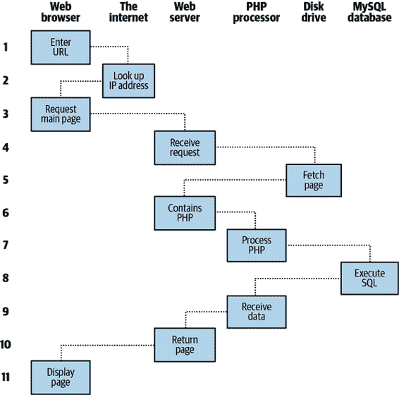
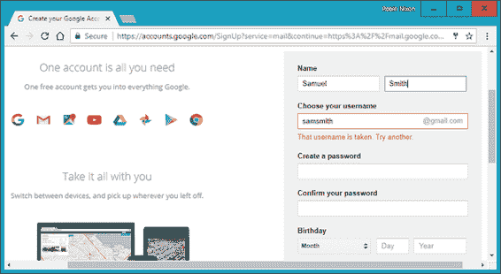

# 第一章：动态网页内容介绍

万维网是一个不断发展的网络，早在 1990 年代初期就已经远远超出了其创立时解决特定问题的概念。在欧洲核子研究中心（现已成为大型强子对撞机的运营者）进行的最先进实验产生了大量数据，这些数据分布在全世界各地的参与科学家之间变得异常棘手。

那个时候，互联网已经建立起来，连接了数十万台计算机，因此蒂姆·伯纳斯-李（一位欧洲核子研究中心的研究员）设计了一种使用超链接框架进行导航的方法，后来被称为超文本传输协议，或者 HTTP。他还创建了一种叫做超文本标记语言，或者 HTML 的标记语言。为了将它们结合起来，他写了第一个网页浏览器和网页服务器。

如今，我们认为这些工具理所当然，但在当时，这个概念是革命性的。迄今为止，家用调制解调器用户所体验到的最大连接性是拨号连接到一个公告板，你只能与该服务的其他用户交流和交换数据。因此，你需要成为许多公告板系统的成员，才能有效地通过电子方式与你的同事和朋友进行沟通。

但是伯纳斯-李一举改变了这一切，在 1990 年代中期，已经有三种主要的图形网页浏览器竞争吸引了五百万用户的注意。很快就显而易见，有些东西是缺失的。是的，文本和图片页面与超链接的概念非常出色，但其结果并未反映出计算机和互联网在满足每个用户具体需求方面的即时潜力。使用网络是一种非常枯燥和普通的体验，即使现在我们有了滚动文本和动画 GIF！

购物车、搜索引擎和社交网络明显改变了我们使用网络的方式。在本章中，我们将简要介绍构成网络的各种组件以及帮助使其使用成为丰富和动态体验的软件。

###### 注意

现在我们需要立即开始使用一些缩写词。在继续之前，我已经试图清楚地解释它们，但不要太担心它们代表什么或者这些名称的含义，因为随着你继续阅读，细节会变得清晰起来。

# HTTP 和 HTML：伯纳斯-李的基础

HTTP 是一种通信标准，它管理在运行在最终用户计算机上的浏览器和 Web 服务器之间发送的请求和响应。服务器的工作是接受来自客户端的请求并尝试以有意义的方式回复，通常是通过提供请求的 Web 页面 —— 这就是为什么使用术语*服务器*。与服务器的自然对应物是*客户端*，因此该术语同时适用于 Web 浏览器和运行它的计算机。

在客户端和服务器之间可能存在多个其他设备，例如路由器、代理、网关等等。它们在确保请求和响应在客户端和服务器之间正确传输方面扮演着不同的角色。通常情况下，它们使用互联网来发送这些信息。这些中间设备中的一些还可以通过在所谓的*缓存*中本地存储页面或信息，然后直接从缓存向客户端提供这些内容来帮助加速互联网。

Web 服务器通常可以处理多个同时连接，当不与客户端通信时，它会花时间监听传入连接。一旦连接到达，服务器就会发送回复以确认接收到连接。

# **请求/响应过程**

在其最基本的水平上，请求/响应过程包括 Web 浏览器或其他客户端请求 Web 服务器发送 Web 页面，服务器然后发送页面。浏览器然后负责显示或渲染页面（参见图 1-1）。

###### 图 1-1\. 基本的客户端/服务器请求/响应序列

请求和响应序列中的步骤如下：

1.  您在浏览器的地址栏中输入*http://server.com*。

1.  您的浏览器查找*server.com*的 Internet 协议（IP）地址。

1.  您的浏览器发出请求，请求*server.com*的主页。

1.  请求通过互联网传输并到达*server.com* Web 服务器。

1.  Web 服务器在收到请求后，在其磁盘上查找 Web 页面。

1.  Web 服务器检索页面并将其返回给浏览器。

1.  您的浏览器显示 Web 页面。

对于平均网页，该过程还会为页面中的每个对象执行一次：图形、嵌入式视频或 Flash 文件，甚至 CSS 模板。

在第 2 步中，请注意浏览器查找*server.com*的 IP 地址。连接到互联网的每台机器都有一个 IP 地址 —— 包括您的计算机，但我们通常通过名称访问 Web 服务器，例如*google.com*。浏览器还要查询一个名为域名系统（DNS）的附加互联网服务，以查找服务器关联的 IP 地址，然后使用它与计算机通信。

对于动态网页，过程稍微复杂一些，因为可能会同时涉及 PHP 和 MySQL。例如，您可能会点击一件雨衣的图片。然后 PHP 将使用标准的数据库语言 SQL（本书中您将学习到其许多命令）组装一个请求，并将请求发送到 MySQL 服务器。MySQL 服务器将返回您选择的雨衣的信息，PHP 代码将其包装在一些 HTML 中，服务器将其发送到您的浏览器（见 图 1-2）。



###### 图 1-2\. 动态客户端/服务器请求/响应序列

步骤如下：

1.  您在浏览器的地址栏中输入 *http://server.com*。

1.  您的浏览器查找 *server.com* 的 IP 地址。

1.  您的浏览器向该地址发出请求，请求 Web 服务器的主页。

1.  请求穿过互联网并到达 *server.com* Web 服务器。

1.  Web 服务器在收到请求后，从硬盘中获取主页文件。

1.  现在首页已经加载到内存中，Web 服务器注意到它是一个包含 PHP 脚本的文件，并将页面传递给 PHP 解释器。

1.  PHP 解释器执行 PHP 代码。

1.  一些 PHP 包含 SQL 语句，这些语句现在由 PHP 解释器传递给 MySQL 数据库引擎。

1.  MySQL 数据库将语句的结果返回给 PHP 解释器。

1.  PHP 解释器将执行的 PHP 代码的结果与来自 MySQL 数据库的结果一起返回给 Web 服务器。

1.  Web 服务器将页面返回给请求的客户端，客户端显示该页面。

虽然了解这个过程对于了解这三个元素如何协同工作是有帮助的，但实际上你不需要关心这些细节，因为它们都会自动发生。

每个示例中返回给浏览器的 HTML 页面可能包含 JavaScript，客户端会本地解释它，可能会发起另一个请求，就像嵌入对象（如图像）一样。

# PHP、MySQL、JavaScript、CSS 和 HTML5 的好处

在本章开头，我介绍了 Web 1.0 的世界，但很快人们就开始创造 Web 1.1，随着诸如 Java、JavaScript、JScript（微软的 JavaScript 轻微变体）和 ActiveX 等浏览器增强功能的开发。在服务器端，使用脚本语言如 Perl（PHP 语言的替代方案）和 *服务器端脚本*（动态地将一个文件的内容（或运行本地程序的输出）插入另一个文件中）正在进行进展。 

风云稍定后，三种主要技术脱颖而出。尽管 Perl 仍然是一种流行的脚本语言并拥有强大的追随者群体，PHP 的简单性和与 MySQL 数据库程序的内置链接使其用户数量超过了两倍。而 JavaScript 则已成为动态操作层叠样式表（CSS）和 HTML 的必不可少的组成部分，现在更承担了处理客户端异步通信的更强大任务（在网页加载后在客户端和服务器之间交换数据）。使用异步通信，网页在后台执行数据处理并向 web 服务器发送请求——而用户在浏览网页时并不知道这一切正在进行。

毫无疑问，PHP 和 MySQL 的共生特性帮助它们双双前进，但最初是什么吸引开发者呢？简单答案必须是你可以使用它们快速创建网站动态元素的简便性。MySQL 是一个快速而强大且易于使用的数据库系统，几乎提供了网站在查找和向浏览器提供数据时所需的一切。当 PHP 联合 MySQL 来存储和检索这些数据时，你拥有了构建 Web 2.0 所需的基本部件。

当你把 JavaScript 和 CSS 也加入进来时，你就有了构建高度动态和交互式网站的配方——尤其是现在有许多复杂的 JavaScript 框架可供调用，以加速网页开发。这些包括广为人知的 jQuery，直到最近仍是程序员访问异步通信特性的常见方式，以及近年来快速增长的 React JavaScript 库。它现在是下载和实施最广泛的框架之一，以至于自 2020 年以来，Indeed 网站列出的 React 开发者职位数量超过 jQuery 的两倍以上。

## MariaDB：MySQL 的克隆品

在 Oracle 收购 Sun 微系统（MySQL 的所有者）之后，社区担心 MySQL 可能不会完全保持开源，因此从中分叉出了 MariaDB，以在 GNU GPL 下保持其自由。MariaDB 的开发由 MySQL 的一些原始开发者领导，它与 MySQL 保持极其密切的兼容性。因此，在一些服务器上，你可能会遇到 MariaDB 替代 MySQL，但不用担心，本书中的所有内容在 MySQL 和 MariaDB 上同样适用，你可以随意切换而不会有任何区别。

无论如何，事实证明，许多最初的担忧似乎已经消除，因为 MySQL 仍然是开源的，Oracle 只是为支持和提供附加功能（如地理复制和自动扩展）的版本收费。然而，与 MariaDB 不同，MySQL 不再由社区驱动，因此知道如果需要时 MariaDB 始终可用将让许多开发者安心，可能也确保了 MySQL 本身将继续保持开源。

## 使用 PHP

使用 PHP，将动态活动嵌入网页非常简单。给页面添加*.php*扩展名后，即可立即使用脚本语言。从开发者的角度来看，你只需编写如下的代码：

```php
<?php
 echo " Today is " . date("l") . ". ";
?>

Here's the latest news.
```

开头的`<?php`告诉 Web 服务器允许 PHP 程序解释直到`?>`标签之间的所有代码。在这个结构之外，所有内容都将直接发送给客户端作为 HTML。因此，文本`Here's the latest news.`将简单地输出到浏览器；在 PHP 标记内，内置的`date`函数根据服务器系统时间显示当前星期几。

两部分的最终输出如下：

```php
*Today is Wednesday. Here's the latest news.*
```

PHP 是一种灵活的语言，有些人更喜欢将 PHP 结构直接放在 PHP 代码旁边，如下所示：

```php
Today is <?php echo date("l"); ?>. Here's the latest news.
```

还有更多格式化和输出信息的方式，我将在有关 PHP 的章节中进行解释。关键是，使用 PHP，Web 开发人员拥有一种脚本语言，虽然不像在 C 或类似语言中编译代码那样快速，但速度非常快，并且与 HTML 标记完美集成。

###### 注意

如果你打算将本书中的 PHP 示例输入到程序编辑器中与我一起工作，你必须记住在它们前面加上`<?php`，并在后面加上`?>`，以确保 PHP 解释器可以处理它们。为了方便起见，你可能希望准备一个名为*example.php*的文件，并在适当位置添加这些标记。

使用 PHP，你可以对你的 Web 服务器进行无限制的控制。无论你需要在页面中动态修改 HTML、处理信用卡、将用户详细信息添加到数据库，还是从第三方网站获取信息，你都可以在同一个 PHP 文件中完成。

## 使用 MySQL

当然，能够动态更改 HTML 输出的能力没有太大意义，除非你还有一种方法跟踪用户在使用网站时提供的信息。在互联网早期，许多网站使用“平面”文本文件存储用户名和密码等数据。但是，如果文件没有正确锁定以防止多个同时访问导致的损坏，这种方法可能会导致问题。此外，平面文件在变得过大之前就变得难以管理，更不用说尝试合并文件和在合理时间内执行复杂搜索的困难了。

这就是关系型数据库与结构化查询变得至关重要的地方。而 MySQL 作为免费使用并安装在大量互联网服务器上的数据库管理系统，则非常出色地胜任了这一角色。它是一个强大且异常快速的数据库管理系统，使用类似英语的命令。

MySQL 结构的最高级别是数据库，您可以在其中拥有一个或多个包含您数据的表。例如，假设您正在处理一个名为*users*的表，在其中创建了*surname*、*firstname*和*email*列，现在希望添加另一个用户。您可能使用的一条命令如下：

```php
INSERT INTO users VALUES('Smith', 'John', 'jsmith@mysite.com');
```

之前您已经发出了其他命令来创建数据库和表，并设置了所有正确的字段，但此处的 SQL `INSERT`命令显示了向数据库添加新数据可以多么简单。SQL 是上世纪 70 年代设计的一种语言，它让人联想起最古老的编程语言之一，COBOL。然而，它非常适合数据库查询，这就是为什么在这么长时间后它仍然在使用中的原因。

查找数据同样简单。假设您有一个用户的电子邮件地址并需要查找该人的姓名。为此，您可以发出如下所示的 MySQL 查询：

```php
SELECT surname,firstname FROM users WHERE email='jsmith@mysite.com';
```

MySQL 然后将返回`Smith, John`及数据库中与该电子邮件地址可能关联的任何其他姓名对。

正如您所期望的那样，您可以在 MySQL 中做的远不止简单的`INSERT`和`SELECT`命令。例如，您可以组合相关数据集以将相关信息片段汇集在一起，请求以各种顺序返回结果，在您仅知道要搜索的字符串的一部分时进行部分匹配，仅返回第*n*个结果等等。

使用 PHP，您可以直接调用 MySQL 而无需自己直接访问 MySQL 命令行界面。这意味着您可以将结果保存在数组中进行处理，并执行多次查找，每次查找都依赖于从前面的查找返回的结果，以便深入到您需要的数据项。

更有力的是，正如稍后将看到的，MySQL 内置了额外的功能，可以高效地运行 MySQL 内部的常见操作，而不是通过多个 PHP 调用 MySQL 创建它们。

## 使用 JavaScript

JavaScript 的创建是为了使脚本能够访问 HTML 文档的所有元素。换句话说，它提供了一种动态用户交互的手段，例如在输入表单中检查电子邮件地址的有效性，并显示诸如“您是认真的吗？”之类的提示（尽管不能依赖其用于安全性，这应始终在 Web 服务器上执行）。

结合 CSS（请参阅下一节），JavaScript 是动态网页背后的动力，使页面能够在您眼前变化，而不是在服务器返回新页面时变化。

然而，JavaScript 以前使用起来很棘手，因为不同浏览器设计者选择实现方式存在显著差异。这主要是在一些制造商试图在其浏览器中添加额外功能，却牺牲了与竞争对手的兼容性时出现的问题。

幸运的是，开发者们大多已经理智过来，意识到彼此兼容的必要性，因此在如今不太需要为不同浏览器优化代码。然而，仍然有数百万用户在使用传统浏览器，而且这种情况可能在未来很多年内仍会存在。幸运的是，有解决不兼容性问题的解决方案，本书后面我们会看到一些库和技术，使您能够安全地忽略这些差异。

现在，让我们看看如何使用基本的 JavaScript，所有浏览器都支持：

```php
<script type="text/javascript">
  document.write("Today is " + Date() );
</script>
```

此代码片段告诉 Web 浏览器解析 `<script>` 标签中的所有内容为 JavaScript，浏览器通过使用 JavaScript 函数 `Date` 将文本 `Today is` 与当前日期一起写入当前文档。结果将看起来像这样：

```php
Today is Wed Jan 01 2025 01:23:45
```

###### 注意

除非您需要指定确切的 JavaScript 版本，通常可以省略 `type="text/javascript"`，直接使用 `<script>` 开始 JavaScript 的解析。

如前所述，JavaScript 最初是为了在 HTML 文档中动态控制各种元素而开发的，这仍然是它的主要用途。但是越来越多地，JavaScript 被用于*Ajax*，即在后台访问 Web 服务器的过程。

异步通信使得网页开始类似独立程序，因为它们不需要完全重新加载以显示新内容。相反，异步调用可以拉取和更新网页上的单个元素，例如在社交网络网站上更改您的照片或替换您点击的按钮与问题答案。这个主题在第十八章中有详尽的介绍。

然后，在第二十二章中，我们仔细研究了 jQuery 框架，您可以在需要快速、跨浏览器的代码来操作网页时使用它，以免重复发明轮子。当然，还有其他可用的框架，因此我们还会看一下 React，在第二十四章中是当今最受欢迎的选择之一。它们都非常可靠，是许多经验丰富的网页开发者工具包中的主要工具。

## 使用 CSS

CSS 是 HTML 的重要伴侣，确保 HTML 文本和嵌入的图像在用户屏幕上一致且合适地排列。随着近年来 CSS3 标准的出现，CSS 现在提供了以前仅由 JavaScript 支持的动态交互水平。例如，不仅可以为任何 HTML 元素设置样式以更改其尺寸、颜色、边框、间距等，而且现在还可以仅使用几行 CSS 为网页添加动画过渡和转换效果。

使用 CSS 可能就像在网页头部的`<style>`和`</style>`标签之间插入几条规则一样简单，就像这样：

```php
<style>
  p {
    text-align:justify;
    font-family:Helvetica;
  }
</style>
```

这些规则改变了`<p>`标签的默认文本对齐方式，使其中包含的段落完全对齐并使用 Helvetica 字体。

正如你将在第十九章中了解的那样，有许多不同的方式可以布置 CSS 规则，你还可以直接将它们包含在标签内部或保存为一个外部文件单独加载。这种灵活性不仅可以让你精确地为你的 HTML 设置样式，还可以（例如）提供内置的悬停功能来在鼠标悬停时为对象添加动画效果。你还将学习如何从 JavaScript 以及 HTML 中访问元素的所有 CSS 属性。

# 还有 HTML5

尽管所有这些对 Web 标准的增加都非常有用，但对于越来越雄心勃勃的开发者来说还不够。例如，在没有像 Flash 这样的插件的情况下，仍然没有简单的方法在 Web 浏览器中操作图形。同样，插入音频和视频到网页中也是如此。而且，在 HTML 的发展过程中还出现了一些令人讨厌的不一致性。

因此，为了澄清所有这些并将互联网推向 Web 2.0 之外，进入其下一个迭代，创建了一个新的 HTML 标准来解决所有这些缺陷：*HTML5*。其开发始于 2004 年，当时 Mozilla 基金会和 Opera Software（两个流行的 Web 浏览器开发者）起草了第一个草案，但直到 2013 年初，最终草案才被提交给了万维网联盟（W3C），这是国际上的 Web 标准管理机构。

HTML5 发展了几年，但现在我们有了一个非常稳定和稳健的版本 5.1（自 2016 年以来）。然而，这是一个永无止境的发展循环，随着时间的推移，肯定会向其中添加更多功能，例如计划在 2017 年作为 W3C 推荐发布的 5.2 版（计划使插件系统过时），以及截至 2020 年仍在计划中的 HTML 5.3（具有自动大写功能等提议功能）。HTML5 中用于处理和显示媒体的一些最佳功能包括`<audio>`、`<video>`和`<canvas>`元素，它们添加了声音、视频和高级图形。关于 HTML5 的所有这些以及其他方面的详细信息都在第二十五章中详细介绍。

###### 注意

我喜欢 HTML5 规范的一点是不再需要 XHTML 语法来自动关闭元素。过去，你可以使用`<br>`元素显示一个换行。然后，为了确保与 XHTML（计划中用于替换 HTML 但从未实现的）的未来兼容性，这被改为`<br />`，其中添加了一个关闭`/`字符（因为预期所有元素都应包含带有此字符的关闭标记）。但现在情况已经完全变了，你可以使用这些类型元素的任一版本。因此，出于简洁和减少击键次数的考虑，在这本书中，我已经恢复 r>` 等样式。

# Apache 网络服务器

除了 PHP、MySQL、JavaScript、CSS 和 HTML5，动态网站还有第六位英雄：网络服务器。在这本书中，这意味着 Apache 网络服务器。我们已经讨论过网络服务器在 HTTP 服务器/客户端交换过程中做了一些什么，但它在幕后做了更多的事情。

例如，Apache 不仅提供 HTML 文件，它还处理各种文件，从图像和 Flash 文件到 MP3 音频文件，RSS（真正简单联合）源等等。这些对象不必是静态文件，比如 GIF 图像。它们都可以由诸如 PHP 脚本之类的程序生成。没错：PHP 甚至可以为您创建图像和其他文件，无论是即时生成还是提前生成以供以后使用。

要做到这一点，通常你要么在 Apache 或 PHP 中预编译模块，要么在运行时调用模块。其中一个这样的模块是 GD（图形绘制）库，PHP 用它来创建和处理图形。

Apache 也支持各种各样的自己的模块。除了 PHP 模块外，作为网络程序员最重要的模块是处理安全性的模块。其他例子包括 Rewrite 模块，它使网络服务器能够处理各种 URL 类型并将它们重写为自己的内部要求，以及 Proxy 模块，你可以用它来从缓存中提供经常请求的页面，以减轻服务器的负载。

本书的后面，你将看到如何使用这些模块来增强三个核心技术提供的功能。

# 处理移动设备

我们现在完全进入了互联的移动计算设备世界，仅为桌面计算机开发网站的概念已经相当过时。相反，开发人员现在旨在开发响应式网站和 Web 应用程序，以适应它们运行的环境。

因此，在本版本中新加入的内容是，我展示了如何仅使用本书详细介绍的技术以及强大的 jQuery Mobile 库，轻松创建这些类型的产品。借助它，你将能够专注于网站和 Web 应用程序的内容和可用性，知道它们的显示方式将自动优化以适应各种不同的计算设备——这样你就少了一件需要担心的事情。

为了展示如何充分利用它的力量，本书的最后一章创建了一个简单的社交网络示例网站，使用 jQuery 使其完全响应，并确保它在从小型手机屏幕到平板电脑或台式电脑的任何设备上显示良好。我们同样可以使用 React（或其他 JavaScript 库或框架），但也许这是你在完成本书后想要自己尝试的一个练习。

# 关于开源

这本书中涉及的技术都是开源的：任何人都可以阅读和修改代码。关于这些技术之所以如此流行的原因，常常被争论，但 PHP、MySQL 和 Apache *确实* 是它们类别中使用最广泛的三种工具。可以肯定的是，它们的开源性意味着它们是由社区中的团队开发的，这些团队编写了他们自己想要和需要的功能，原始代码对所有人都是开放的，可以随时查看和修改。可以迅速发现错误，并在它们发生之前预防安全漏洞。

还有另一个好处：所有这些程序都可以免费使用。不用担心如果要扩展你的网站并增加更多服务器就必须购买额外的许可证，也无需在决定是否升级到这些产品的最新版本之前检查预算。

# 将所有内容整合在一起

PHP、MySQL、JavaScript（有时候辅助 React 或其他框架）、CSS 和 HTML5 的真正美妙之处在于它们如何协同工作来生成动态的 Web 内容：PHP 在 Web 服务器上处理所有主要工作，MySQL 管理所有数据，而 CSS 和 JavaScript 的组合则负责网页的呈现。JavaScript 还可以在需要更新某些内容（无论是在服务器上还是在网页上）时与你的 PHP 代码进行通信。借助 HTML5 中强大的功能，如画布、音频和视频以及地理位置，你可以使你的网页高度动态、互动且多媒体丰富。

在不使用程序代码的情况下，让我们通过查看将一些技术组合到每日异步通信功能中的过程来总结本章的内容，这是许多网站在用户注册新帐户时使用的功能的示例：检查所需的用户名是否已存在于站点上。这在 Gmail 中有一个很好的例子（见图 1-3）。



###### 图 1-3\. Gmail 使用异步通信来检查用户名的可用性

这个异步过程涉及的步骤将类似于以下内容：

1.  服务器输出 HTML 创建网页表单，要求输入必要的详细信息，如用户名、名字、姓氏和电子邮件地址。

1.  同时，服务器将一些 JavaScript 附加到 HTML 上，以监视用户名输入框并检查两件事情：是否已输入了一些文本，以及是否取消了输入选择，因为用户已点击了另一个输入框。

1.  一旦文本被输入并取消选定该字段，JavaScript 代码会将输入的用户名传回到 Web 服务器上的 PHP 脚本，并等待响应。

1.  Web 服务器查找用户名并回复 JavaScript，告知该名称是否已被占用。

1.  然后，JavaScript 在用户名输入框旁边放置一个指示，显示用户名对用户是否可用的状态——可能是一个绿色的勾或一个红色的叉，以及一些文本。

1.  如果用户名不可用，并且用户仍然提交表单，JavaScript 将中断提交并重新强调（可能通过更大的图形和/或警报框）用户需要选择另一个用户名。

1.  可选地，这个过程的改进版本甚至可以查看用户请求的用户名，并建议当前可用的替代用户名。

所有这些都在后台静静地进行，为用户提供了舒适且无缝的使用体验。没有异步通信，整个表单都必须提交到服务器，然后服务器会返回 HTML，并突出显示任何错误。这也算是一个可行的解决方案，但远不及即时处理表单字段那样整洁和令人愉悦。

然而，异步通信不仅仅可以用于简单的输入验证和处理，我们将在本书的后续部分探讨许多其他可以使用它来实现的功能。

在本章中，您已经读到了 PHP、MySQL、JavaScript、CSS 和 HTML5（以及 Apache）的核心技术的很好介绍，并学习了它们如何共同工作。在第二章中，我们将讨论如何在自己的 Web 开发服务器上安装和练习您将要学习的所有内容。

# 问题

1.  至少需要哪四个组件才能创建一个完全动态的网页？

1.  *HTML* 是什么意思？

1.  为什么 *MySQL* 的名称包含字母 *SQL*？

1.  *PHP* 和 *JavaScript* 都是能够为网页生成动态结果的编程语言。它们的主要区别是什么，为什么你会同时使用它们呢？

1.  *CSS* 代表什么？

1.  列出 HTML5 中引入的三个主要新元素。

1.  如果你在一个开源工具中遇到一个（很少见的）Bug，你认为你能如何修复它？

1.  为什么像 jQuery 或 React 这样的框架对于开发现代网站和 Web 应用程序如此重要？

查看 “第一章答案” 在 附录 A 中，获取这些问题的答案。
