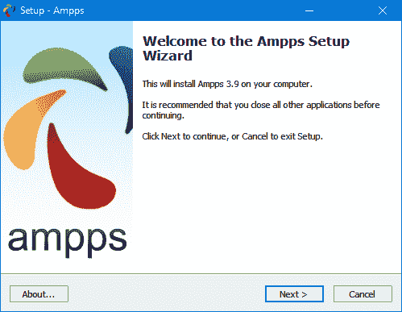
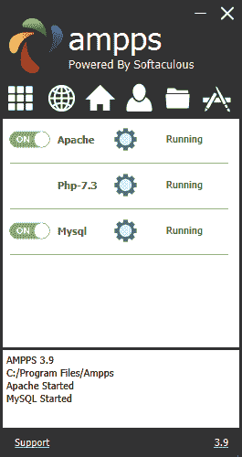

# 第二章：建立开发服务器

如果你想开发互联网应用程序但没有自己的开发服务器，你将不得不在能够测试之前将每一次修改上传到 Web 上的某个其他服务器。

即使在快速的宽带连接上，这仍可能导致开发时间显著减慢。然而，在本地计算机上，测试可以像保存更新一样简单（通常只需点击图标一次），然后在浏览器中点击刷新按钮。

另一个开发服务器的优点是，当你编写和测试时，你不必担心尴尬的错误或安全问题，而在公共网站上，你需要意识到人们可能会看到或使用你的应用程序。最好在你仍然在家庭或小办公室系统上，预计受到防火墙和其他保护措施保护的时候，把一切都搞定。

一旦你拥有了自己的开发服务器，你会想知道之前是如何没有它的，而且设置一个是很容易的。只需按照以下各节中的步骤进行操作，根据你使用的是 PC、Mac 还是 Linux 系统，选择适当的说明。

在本章中，我们只涵盖了 Web 体验的服务器端，正如在第一章中描述的那样。但是为了测试你的工作结果——特别是当我们稍后在本书中开始使用 JavaScript、CSS 和 HTML5 时——你最好有一个至少包含 Microsoft Edge、Mozilla Firefox、Opera、Safari 和 Google Chrome 的主要 Web 浏览器的实例运行在方便你的某个系统上。一旦准备好发布产品，你可能需要所有这些，以确保在所有浏览器和平台上一切都如预期运行。如果你计划确保你的网站在移动设备上看起来良好，你应该尽量安排访问各种 iOS 和 Android 设备。

# 什么是 **WAMP**, **MAMP** 或 **LAMP**？

**WAMP**、**MAMP** 和 **LAMP** 是 “Windows, Apache, MySQL 和 PHP”，“Mac, Apache, MySQL 和 PHP”，以及 “Linux, Apache, MySQL 和 PHP”的缩写。这些缩写描述了用于开发动态互联网页面的完整功能设置。

**WAMPs**、**MAMPs** 和 **LAMPs** 以捆绑程序包的形式出现，这些程序将捆绑的程序一起绑定，以便你不必单独安装和设置它们。这意味着你只需下载和安装一个单一的程序，并按照几个简单的提示进行操作，就可以快速启动和运行你的 Web 开发服务器，几乎没有任何麻烦。

在安装过程中，会为你创建几个默认设置。这样的安装的安全配置不会像生产 Web 服务器上那样严格，因为它被优化用于本地使用。因此，你绝对不应该将这样的设置作为生产服务器安装。

然而，对于开发和测试网站和应用程序来说，其中一个这样的安装完全足够了。

###### 警告

如果您选择不通过 WAMP/MAMP/LAMP 方式构建自己的开发系统，您应知道自行下载和集成各部分可能非常耗时，并可能需要大量研究来完全配置所有内容。但如果您已经安装并集成了所有组件，它们应该可以与本书中的示例一起工作。

# 在 Windows 上安装 AMPPS

有几个可用的 WAMP 服务器，每个提供稍有不同的配置。在各种开源和免费选项中，最好的之一是 AMPPS。您可以通过点击网站的[主页](http://ampps.com)上显示的按钮来下载，如图 2-1 所示。（也有 Mac 和 Linux 版本可用；参见“在 macOS 上安装 AMPPS”和“在 Linux 上安装 LAMP”。）

###### 注意

最近，Chrome 已更新以禁止从混合来源（例如从 https:// 网页下载的 http:// 文件）下载。其他浏览器可能也会遵循这一安全倡议。当前 AMPPS 网站使用混合来源，您可能会遇到此问题。解决方法是当 Chrome（或其他浏览器）提示“无法安全下载 AMPPS”时，不要选择 *DISCARD*，而是使用上箭头选择 *Keep*，然后下载将继续。此外，如果单击下载链接似乎无任何反应，您将需要右键单击并选择 *另存为* 来启动下载。

我建议您始终下载最新的稳定版本（截至我写作时，版本为 3.9，大小约为 114 MB）。各种 Windows、macOS 和 Linux 安装程序列在下载页面上。


###### 图 2-1\. AMPPS 网站

###### 注意

在本版本的生命周期内，以下步骤中显示的某些屏幕和选项可能会发生变化。如果确实如此，请凭常识尽量按照所描述的操作顺序进行。

下载安装程序后，请运行它以显示图 2-2 中显示的窗口。不过，在到达该窗口之前，如果您使用防病毒程序或在 Windows 上激活了用户账户控制，可能会首先显示一个或多个提示通知，您需要点击“是”和/或“确定”以继续安装。

单击“下一步”，然后必须接受协议。再次单击“下一步”，然后再次单击以跳过信息屏幕。现在，您需要确认安装位置。这可能会建议为主硬盘的某个字母，但如果您希望，可以更改此选项：

```php
C:\Program Files (x86)\Ampps
```



###### 图 2-2\. 安装程序的初始窗口

接下来，您必须在下一个屏幕上接受协议并点击下一步，然后在阅读信息摘要后再次点击下一步，然后系统会询问您希望将 AMPPS 安装到哪个文件夹。

一旦您决定安装 AMPPS 的位置，请点击下一步，决定保存快捷方式的位置（通常默认即可），然后再次点击下一步选择您希望安装的图标，如图 2-3 所示。在接下来的屏幕上，点击“安装”按钮开始安装过程。


###### 图 2-3\. 选择要安装的图标

安装过程将需要几分钟，之后您将看到图 2-4 中的完成屏幕，然后点击“完成”。


###### 图 2-4\. AMPPS 现在已安装

最后一件事是安装 Microsoft Visual C++ Redistributable，如果您尚未安装。一个窗口将弹出以提示您，如图 2-5 所示。点击“是”开始安装，或者如果您确定已经安装了它，则点击“否”。或者，您也可以无论如何继续，系统会告知您是否需要重新安装。


###### 图 2-5\. 如果尚未安装，请安装 Visual C++ Redistributable

如果您选择继续安装，您需要在弹出的窗口中同意条款和条件，然后点击安装。安装过程应该相当快速。点击关闭以完成。

安装完成后，您的桌面右下角将会显示图 2-6 中显示的控制窗口。如果您允许创建这些图标，您也可以通过“开始”菜单或桌面上的 AMPPS 应用程序快捷方式调出此窗口。

在继续之前，如果您有任何进一步的问题，我建议您熟悉[AMPPS 文档](http://ampps.com/wiki)，否则您已准备好开始了——控制窗口底部始终有一个支持链接，您可以通过它访问 AMPPS 网站，以便在需要时打开故障申请。



###### 图 2-6\. AMPPS 控制窗口

###### 注意

您可能会注意到 AMPPS 中默认的 PHP 版本是 7.3。如果由于任何原因您希望尝试版本 5.6，请在 AMPPS 控制窗口内点击选项按钮（一个方形中的九个白色框），然后选择“更改 PHP 版本”，接着会弹出一个新菜单，您可以在其中选择 5.6 到 7.3 之间的版本。

## 安装测试

此时，首先要做的一件事是验证一切是否正常工作。为此，请在浏览器的地址栏中输入以下任何一个 URL：

```php
localhost
127.0.0.1
```

这将调出一个介绍屏幕，在这里您将有机会通过给它设置密码来保护 AMPPS（参见图 2-7）。我建议您不要勾选复选框，只需点击提交按钮即可继续而不设置密码。


###### 图 2-7\. 初始安全设置屏幕

一旦完成这些步骤，您将被带到主控页面，位于*localhost/ampps/*（从现在开始，我假设您通过*localhost*而不是*127.0.0.1*访问 AMPPS）。从这里，您可以配置和控制 AMPPS 堆栈的所有方面，所以请记下这一点以备将来参考，或者在浏览器中设置书签。

接下来，键入以下内容以查看新 Apache Web 服务器的文档根目录（在以下部分描述）：

```php
localhost
```

这一次，您不会看到关于设置安全性的初始屏幕，而是应该看到类似于图 2-8 的内容。


###### 图 2-8\. 查看文档根目录

## 访问文档根目录（Windows）

*文档根目录*是包含域的主要 Web 文档的目录。当在浏览器中键入基本 URL 而没有路径时，例如*http://yahoo.com*或对于您的本地服务器是*http://localhost*，服务器将使用此目录。

默认情况下，AMPPS 将使用以下位置作为文档根目录：

```php
C:\Program Files\Ampps\www
```

为确保配置正确，现在应创建“Hello World”文件。因此，请使用 Windows 记事本（或 Windows 上的*Notepad++*，或 Mac 上的*Atom*，或您选择的其他许多可用选项，但不要使用 Microsoft Word 等富文本编辑器）创建一个如下所示的小型 HTML 文件：

```php
<!DOCTYPE html>
<html lang="en">
  <head>
    <title>A quick test</title>
  </head>
  <body>
    Hello World!
  </body>
</html>
```

输入完毕后，将文件保存到文档根目录，文件名为*test.html*。如果您使用的是记事本，请确保“另存为类型”框中的值已从文本文档 (*.txt) 更改为所有文件 (*.*)

您现在可以通过在浏览器地址栏中输入以下 URL 来调用此页面（参见图 2-9）：

```php
localhost/test.html
```


###### 图 2-9\. 您的第一个网页

###### 注意

请记住，从文档根目录（或子文件夹）提供网页与从计算机文件系统加载网页到 Web 浏览器不同。前者将确保访问 PHP、MySQL 和 Web 服务器的所有功能，而后者仅将文件加载到浏览器中，并尽力显示它，但无法处理任何 PHP 或其他服务器指令。因此，您通常应该从浏览器的地址栏中使用*localhost*前缀来运行示例，除非您确信文件不依赖于 Web 服务器功能。

## 替代 WAMPs

当软件更新时，有时它的工作方式可能与您的预期不同，甚至可能会引入错误。因此，如果您在 AMPPS 中遇到无法解决的困难，您可能更喜欢选择网上其他可用的解决方案之一。

您仍然可以使用本书中的所有示例，但您需要按照每个 WAMP 附带的说明进行操作，这可能不像前面的指南那样易于理解。

这是我认为的一些最佳选择：

+   [EasyPHP](http://easyphp.org)

+   [XAMPP](http://apachefriends.org)

+   [WAMPServer](http://wampserver.com/en)

###### 注意

在本书的整个版本周期内，AMPPS 的开发人员很可能会对软件进行改进，因此安装屏幕和使用方法可能会随时间而演变，Apache、PHP 或 MySQL 的版本也可能会更新。因此，请不要假设某些东西出了问题，如果屏幕和操作看起来不同，请跟随任何提示，并参考[网站上的文档](http://ampps.com)。

# 在 macOS 上安装 AMPPS

AMPPS 也可在 macOS 上使用，并且您可以从[网站](http://ampps.com)下载它，如前所示在图 2-1 中（在我写作时，当前版本是 3.0，大小约为 270 MB）。

如果您的浏览器在下载完成后未自动打开，请双击*.dmg*文件，然后将*AMPPS*文件夹拖到*应用程序*文件夹中（参见图 2-10）。


###### 图 2-10\. 将 AMPPS 文件夹拖到应用程序

现在以通常的方式打开您的*应用程序*文件夹，然后双击 AMPPS 程序。如果您的安全设置阻止文件被打开，请按住 Control 键并单击一次图标。将弹出一个新窗口询问您是否确定要打开它。点击打开以继续。启动应用程序时，您可能需要输入 macOS 密码。

一旦 AMPPS 启动，类似于图 2-6 所示的控制窗口将出现在您桌面的左下角。

###### 注意

您可能注意到 AMPPS 中的默认 PHP 版本是 7.3。如果出于任何原因您希望尝试 5.6 版本，请单击 AMPPS 控制窗口内的选项按钮（一个有九个白色方框的正方形），然后选择更改 PHP 版本，这时会出现一个新菜单，您可以在其中选择 5.6 至 7.3 之间的版本。

## 访问文档根目录（macOS）

默认情况下，AMPPS 将使用以下位置作为文档根目录：

```php
/Applications/Ampps/www
```

为了确保您已正确配置一切，现在您应该创建强制性的“Hello World”文件。因此，请使用 TextEdit 程序或任何其他程序或文本编辑器创建以下类型的小型 HTML 文件，但不要使用像 Microsoft Word 这样的富文本处理器：

```php
<!DOCTYPE html>
<html lang="en">
  <head>
    <title>A quick test</title>
  </head>
  <body>
    Hello World!
  </body>
</html>
```

输入完毕后，请使用文件名 *test.html* 将文件保存到文档根目录中。

您现在可以通过在地址栏中输入以下 URL 来在浏览器中打开此页面（以查看与 图 2-9 类似的结果）：

```php
localhost/test.html
```

###### 注意

请记住，从文档根目录（或子文件夹）提供网页与从计算机文件系统加载网页到 Web 浏览器是不同的。前者确保访问 PHP、MySQL 和 Web 服务器的所有功能，而后者仅将文件加载到浏览器中，浏览器尽其所能显示它，但无法处理任何 PHP 或其他服务器指令。因此，通常应从浏览器地址栏中使用 *localhost* 前缀来运行示例，除非您确信该文件不依赖于 Web 服务器功能。

# 在 Linux 上安装 LAMP

本书主要面向 PC 和 Mac 用户，但其内容在 Linux 计算机上同样适用。不过，有数十种流行的 Linux 版本，每种版本可能需要以略有不同的方式安装 LAMP，因此我无法在本书中全部涵盖。但是，Linux 也有一种名为 AMPPS 的版本可供使用，可能是您最简单的选择。

尽管如此，一些 Linux 版本预装了 Web 服务器和 MySQL，您可能已经准备就绪。要确认，请在浏览器中输入以下内容，查看是否能获取默认的文档根网页：

```php
localhost
```

如果此操作成功，您可能已安装 Apache 服务器，并且可能已经运行 MySQL；请向系统管理员确认。

但是，如果您尚未安装 Web 服务器，可以从网站下载 AMPPS 的版本。

安装步骤与前一节中显示的顺序类似。如果需要进一步了解如何使用软件，请参阅文档。

# 远程工作

如果您已经可以访问配置了 PHP 和 MySQL 的 Web 服务器，您可以随时用于 Web 开发。但是，除非您拥有高速连接，否则这可能并非您的最佳选项。在本地进行开发允许您测试修改，几乎没有上传延迟。

远程访问 MySQL 也许不是件容易的事情。您应该使用安全的 SSH 协议登录服务器，通过命令行手动创建数据库并设置权限。您的 Web 主机公司将为您提供最佳操作建议，并提供 MySQL 访问的任何密码（当然也包括首次登录服务器的密码）。我建议您永远不要使用不安全的 Telnet 协议远程登录任何服务器。

## 登录

我建议至少 Windows 用户应安装诸如 [PuTTY](http://putty.org) 之类的程序进行 SSH 访问（请记住 SSH 比 Telnet 安全得多）。

在 Mac 上，你已经可以使用 SSH。只需选择*应用程序*文件夹，然后选择*实用工具*，然后启动终端。在终端窗口中，使用 SSH 登录服务器如下：

```php
ssh *mylogin*@*server.com*
```

其中*`server.com`*是你希望登录的服务器名称，*`mylogin`*是你要使用的用户名。然后系统会提示你输入该用户名的正确密码，如果输入正确，你将登录成功。

## 使用 SFTP 或 FTPS

要在您的 Web 服务器上传输文件，通常需要 FTP、SFTP 或 FTPS 程序。虽然 FTP 不是安全协议，但仍然经常用软件上传和下载文件，称为 FTP，但确保 Web 服务器安全的是 FTPS 或 SFTP。如果你在网上寻找一个好的客户端，你会发现有很多选择，可能需要一段时间才能找到适合你的功能完备的程序。

# 不要使用 FTP

FTP 是不安全的，不应使用。有比 FTP 更安全的文件传输方法，如使用 Git 或类似技术。此外，基于 SSH 的 SFTP（安全文件传输协议）和 SCP（安全复制协议）也越来越受欢迎。好的 FTP 程序通常也支持 SFTP 和 FTPS（FTP-SSL）。文件传输方式通常取决于你所在公司的政策，但对于个人使用来说，如 FileZilla（下面讨论）这样的 FTP 程序将提供你所需的大部分（如果不是全部）功能和安全性。

我偏爱的 FTP/SFTP 程序是开源软件[FileZilla](http://filezilla-project.org)，支持 Windows、Linux 和 macOS 10.5 或更新版本（参见图 2-11）。有关如何使用 FileZilla 的完整说明，请参阅[wiki](http://wiki.filezilla-project.org)。


###### 图 2-11. FileZilla 是一个功能齐全的 FTP 程序

当然，如果你已经有一个 FTPS 或 SFTP 程序，那就更好了——坚持你熟悉的工具。

# 使用代码编辑器

尽管纯文本编辑器可以用于编辑 HTML、PHP 和 JavaScript，但专用代码编辑器的改进显著，现在它们具备了非常实用的功能，如彩色语法突出显示。今天的程序编辑器很智能，甚至可以在你运行程序之前就显示语法错误的位置。一旦你使用了现代编辑器，你会想知道自己以前是怎么没有用它们的。

有很多优秀的程序可供选择，但我选择了微软的 Visual Studio Code（VSC），因为它功能强大，在 Windows、Mac 和 Linux 上都能运行，并且是免费的（参见图 2-12）。尽管每个人的编程风格和偏好不同，如果你对它不习惯，还有很多其他代码编辑器可供选择，或者你可能希望直接选择一个集成开发环境（IDE），正如下一节所述。


###### 图 2-12\. 程序编辑器（如 Visual Studio Code）优于纯文本编辑器

如你所见，通过图 2-12，VSC 适当地突出语法，使用颜色帮助澄清正在发生的事情。此外，你可以将光标放在括号或大括号旁边，它会突出显示匹配的括号，这样你可以检查是否有过多或过少。事实上，VSC 还有更多功能，随着你的使用，你会发现并享受它们。你可以从[code.visualstudio.com](https://code.visualstudio.com)下载副本。

如果你有其他喜欢的编辑器，可以使用它；使用你已经熟悉的程序是个好主意。

# 使用 IDE

尽管专用程序编辑器对你的编程生产力可能非常有用，但与集成开发环境相比，它们的效用显得微不足道。IDE 提供许多额外功能，如编辑器内调试和程序测试，以及函数描述等，尽管这些功能如今也在一些代码编辑器中慢慢加入，比如之前推荐的 VSC。图 2-13 展示了流行的 Eclipse IDE，主框架加载了一些 HTML（它还允许你使用 PHP、JavaScript 和其他文件类型）。


###### 图 2-13\. 使用 IDE 时，代码开发变得更快、更容易

在使用 IDE 进行开发时，你可以设置断点，然后运行所有（或部分）代码，它将在断点处停止，并为你提供关于程序当前状态的信息。

作为学习编程的辅助工具，本书中的示例可以直接输入到集成开发环境（IDE）中运行，无需打开网页浏览器。不同平台都有多种 IDE 可供选择。表 2-1 列出了一些最受欢迎的免费 PHP IDE 以及它们的下载 URL。

表 2-1\. 免费 IDE 选择

| IDE | 下载链接 |   | Windows | macOS | Linux |
| --- | --- | --- | --- | --- | --- |
| Eclipse PDT | [eclipse.org/downloads/packages](https://tinyurl.com/geteclipseide) |   |        ✓ |      ✓ |     ✓ |
| NetBeans | [*www.netbeans.org*](http://www.netbeans.org) |   |        ✓ |      ✓ |     ✓ |
| Visual Studio | [*code.visualstudio.com*](https://code.visualstudio.com) |   |        ✓ |      ✓ |     ✓ |

选择一个 IDE 可能是非常个人化的事情，所以如果你打算使用一个，我建议你先下载几个或更多来试用；它们都有试用版或免费使用，所以不会花费你任何费用。

现在花时间安装一个你熟悉的代码编辑器或 IDE，然后你将准备好在接下来的章节中尝试示例。

有了这些工具，现在你已经准备好继续进入《第三章》，我们将深入探讨 PHP，并了解如何使 HTML 和 PHP 协同工作，以及 PHP 语言本身的结构。但在继续之前，我建议你用以下问题来测试你的新知识。

# 问题

1.  什么是 WAMP、MAMP 和 LAMP 之间的区别？

1.  IP 地址 127.0.0.1 和 URL *http://localhost* 有什么共同点？

1.  FTP 程序的目的是什么？

1.  远程 Web 服务器的主要缺点是什么？

1.  为什么使用程序编辑器而不是纯文本编辑器更好？

请参阅《第二章答案》在《附录 A》中查看这些问题的答案。
