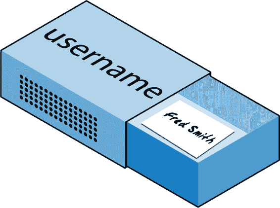

# 第三章：PHP 简介

在第一章中，我解释了 PHP 是您用来使服务器生成动态输出的语言——每次浏览器请求页面时，输出可能会有所不同。在这一章中，您将开始学习这种简单但功能强大的语言；接下来几章将深入探讨这个主题，直到第七章。

我鼓励您使用第二章中列出的 IDE 之一或良好的代码编辑器来开发您的 PHP 代码。

这些程序中的许多程序将允许您运行 PHP 代码并查看本章讨论的输出。我还将向您展示如何创建 PHP 代码，以便您可以看到 Web 页面中的输出（最终用户将如何看待它）。但是，在这个阶段，这一步骤虽然一开始可能会令人兴奋，但实际上并不重要。

在生产中，您的网页将是 PHP、HTML、JavaScript 和一些 MySQL 语句的组合，使用 CSS 布局。此外，每个页面都可以导向其他页面，以便用户通过链接点击和填写表单。尽管如此，在学习每种语言时，我们可以避开所有这些复杂性。现在专注于编写 PHP 代码，并确保您得到预期的输出，或者至少理解实际得到的输出！

# 将 PHP 嵌入 HTML 中

默认情况下，PHP 文档以扩展名*.php*结尾。当 Web 服务器在请求的文件中遇到此扩展名时，它会自动将其传递给 PHP 处理器。当然，Web 服务器高度可配置，一些 Web 开发者选择强制以*.htm*或*.html*结尾的文件也由 PHP 处理，通常是因为他们想隐藏其对 PHP 的使用。

您的 PHP 程序负责传回一个干净的文件，适合在 Web 浏览器中显示。在最简单的情况下，一个 PHP 文档只会输出 HTML。为了证明这一点，您可以拿任何普通的 HTML 文档，并将其保存为 PHP 文档（例如，将*index.html*另存为*index.php*），它将与原始文档显示完全一致。

要触发 PHP 命令，您需要学习一个新的标签。这是第一部分：

```php
<?php
```

您可能注意到的第一件事是标签没有关闭。这是因为整个 PHP 部分可以放置在此标签内，只有当遇到关闭部分时才会结束，其看起来像这样：

```php
?>
```

一个小的 PHP“Hello World”程序可能看起来像示例 3-1。

##### 示例 3-1. 调用 PHP

```php
<?php
  echo "Hello world";
?>
```

使用此标签可以非常灵活。一些程序员在文档开头就打开标签，并在文档末尾关闭它，直接从 PHP 命令输出任何 HTML。然而，其他人选择仅在这些标签中插入 PHP 的最小可能片段，只在需要动态脚本时，将文档的其余部分保持为标准 HTML。

后一种类型的程序员通常认为，他们的编码风格会导致更快的代码，而前者则认为速度提升是如此微小，以至于不能证明在单个文档中多次进出 PHP 的额外复杂性。

随着你的学习深入，你肯定会发现自己偏好的 PHP 开发风格，但为了使本书中的示例更易于理解，我采用了尽量减少 PHP 和 HTML 之间转换次数的方法——通常在一个文档中只有一两次。

顺便说一句，PHP 语法还有一种轻微的变体。如果你在互联网上搜索 PHP 示例，你可能会遇到打开和关闭语法看起来像这样的代码：

```php
<?
  echo "Hello world";
?>
```

尽管 PHP 解析器被调用的情况不太明显，但这是一种有效的替代语法，通常也可以工作。但我不鼓励使用，因为它与 XML 不兼容，现在已经被弃用（意味着不再推荐使用，并且未来版本可能会移除支持）。

###### 注意

如果你的文件中只有 PHP 代码，可以省略结尾的 `?>`。这是一个很好的做法，因为它可以确保你的 PHP 文件没有多余的空白字符泄漏（特别是在你编写面向对象的代码时尤为重要）。

# 本书的示例

为了节省你输入所有内容的时间，本书中的所有示例都已存储在 GitHub 上。你可以通过访问以下链接将存档下载到你的计算机中：[GitHub](https://github.com/RobinNixon/lpmj6)。

除了按章节和示例编号列出所有示例（如 *example3-1.php*），某些示例可能需要显式的文件名，此时示例的副本也将使用相同文件夹中的文件名保存（例如即将出现的 示例 3-4，应保存为 *test1.php*）。

# PHP 的结构

在本节中，我们将涵盖相当广泛的内容。这并不太困难，但我建议你仔细阅读，因为这为本书中的所有其他内容奠定了基础。和往常一样，章节末尾有一些有用的问题，可以用来测试你学到了多少知识。

## 使用注释

有两种方式可以向你的 PHP 代码添加注释。第一种通过在前面加上一对斜杠将单行变为注释：

```php
// This is a comment
```

这种版本的注释功能是暂时从一个给你错误的程序中移除一行代码的好方法。例如，你可以使用这样的注释隐藏一个调试代码行，直到你需要它，就像这样：

```php
// echo "X equals $x";
```

你也可以直接在一行代码后使用这种类型的注释描述它的操作，就像这样：

```php
$x += 10; // Increment $x by 10
```

当你需要使用多行时，有第二种类型的注释，看起来像 示例 3-2。

##### 示例 3-2\. 多行注释

```php
<?php
/* This is a section
 of multiline comments
 which will not be
 interpreted */
?>
```

您可以使用`/*`和`*/`字符对来在代码的几乎任何位置打开和关闭注释。大多数程序员使用这种结构来暂时注释掉整个不起作用或由于某种原因他们不希望解释的代码部分。

###### 警告

一个常见的错误是使用`/*`和`*/`来注释一个已包含使用这些字符的注释部分的大段代码。您不能以这种方式嵌套注释；PHP 解释器不会知道注释何时结束，并显示错误消息。但是，如果您使用具有语法高亮的编辑器或 IDE，这种错误更容易发现。

## 基本语法

PHP 是一种相当简单的语言，起源于 C 和 Perl（如果您曾经接触过这些语言），但它看起来更像 Java。它也非常灵活，但您需要学习关于其语法和结构的一些规则。

### 分号

您可能已经注意到在前面的示例中，PHP 命令以分号结尾，就像这样：

```php
$x += 10;
```

在 PHP 中，您将遇到的最常见的错误之一是忘记分号。这会导致 PHP 将多个语句视为一个语句，PHP 无法理解，因此会生成一个`Parse error`消息。

### `$` 符号

`$` 符号已经被许多不同的编程语言以多种方式使用。例如，在 BASIC 语言中，它被用来终止变量名称以表示它们是字符串。

然而，在 PHP 中，您必须在*所有*变量前面放置一个`$`。这是必需的，以使 PHP 解析器更快，因为它可以立即知道何时遇到变量。无论您的变量是数字、字符串还是数组，它们都应该看起来像示例 3-3 中的那些。

##### 示例 3-3\. 三种不同类型的变量赋值

```php
<?php
  $mycounter = 1;
  $mystring  = "Hello";
  $myarray   = array("One", "Two", "Three");
?>
```

这实际上就是您必须记住的语法。与 Python 等严格要求缩进和布局的语言不同，PHP 完全自由，您可以随意使用或不使用缩进和空格。事实上，合理使用空白通常是鼓励的（以及全面注释），这有助于您在回顾代码时理解它。它还有助于其他程序员在维护代码时理解。

## 变量

有一个简单的比喻可以帮助您理解 PHP 变量的含义。只需将它们想象成小（或大）火柴盒！没错，就是您粉刷过并写上名称的火柴盒。

### 字符串变量

想象一下，您有一盒火柴上面写着*用户名*。然后，您在一张纸上写下*Fred Smith*并将其放入盒子中（参见图 3-1）。好吧，这与将字符串值分配给变量的过程相同，就像这样：

```php
$username = "Fred Smith";
```

引号表明“Fred Smith”是一个由字符组成的*字符串*。你必须用引号或撇号（单引号）将每个字符串括起来，尽管这两种引号之间存在微妙的差异，稍后会进行解释。当你想看看盒子里面装了什么时，你打开它，拿出那张纸，然后阅读它。在 PHP 中，这样做看起来像这样（显示变量的内容）：

```php
echo $username;
```

或者您可以将其分配给另一个变量（复印纸张并将副本放入另一个火柴盒），如下所示：

```php
$current_user = $username;
```



###### 图 3-1\. 您可以将变量视为装有物品的火柴盒

##### 示例 3-4\. 你的第一个 PHP 程序

```php
<?php // test1.php
  $username = "Fred Smith";
  echo $username;
  echo "<br>";
  $current_user = $username;
  echo $current_user;
?>
```

现在，您可以通过在浏览器地址栏中输入以下内容来调用它：

```php
http://localhost/test1.php
```

###### 注意

如果在安装网络服务器期间（详见第二章）不太可能发生，您将服务器分配的端口更改为 80 以外的任何数字，则必须将该端口号放在本书中的所有示例中的 URL 中，例如，如果将端口更改为 8080，则前述 URL 将变成如下所示：

```php
http://localhost:8080/test1.php
```

我不会再提到这一点了，所以请记住在尝试示例或编写自己的代码时使用端口号（如果需要）。

运行此代码的结果应该是两次出现名称*Fred Smith*，第一次是`echo $username`命令的结果，第二次是`echo $current_user`命令的结果。

### 数值变量

变量不一定只能包含字符串，它们也可以包含数字。如果我们回到火柴盒类比，要在变量`$count`中存储数字 17，相当于在火柴盒里放入 17 颗珠子，并在盒子上写上单词*count*：

```php
$count = 17;
```

你也可以使用浮点数（包含小数点）。语法是一样的：

```php
$count = 17.5;
```

要查看火柴盒的内容，只需打开它并计算珠子的数量。在 PHP 中，您可以将`$count`的值分配给另一个变量，或者可能只是将其回显到 Web 浏览器中。

### 数组

您可以将数组视为几个粘在一起的火柴盒。例如，假设我们要在名为`$team`的数组中存储一个五人足球队的球员姓名。为此，我们可以侧向粘合五个火柴盒，并在分别的纸片上写下所有球员的名字，将每个名字放入一个火柴盒中。

在整个火柴盒组件的顶部，我们将写下*team*（参见图 3-2）。在 PHP 中，这的等效物将是以下内容：

```php
$team = array('Bill', 'Mary', 'Mike', 'Chris', 'Anne');
```


###### 图 3-2\. 数组就像粘在一起的几个火柴盒

此语法比您迄今看到的其他示例更复杂。数组构建代码包括以下结构：

```php
array();
```

内部包含五个字符串。每个字符串用单引号或双引号括起来，并用逗号分隔。

如果我们想知道第四名玩家是谁，我们可以使用这个命令：

```php
echo $team[3]; // Displays the name Chris
```

前述声明中的数字为 3 而不是 4 的原因是 PHP 数组的第一个元素实际上是零索引，因此玩家编号将从 0 到 4。

### 二维数组

数组还有更多用途。例如，它们不仅可以是单维线条的火柴盒，还可以是二维矩阵，甚至具有更多维度。

举例说明二维数组，比如我们想要跟踪井字棋游戏，这需要一个 3 × 3 的九个单元格的数据结构。要用火柴盒表示这个结构，想象九个火柴盒按照 3 行 3 列的矩阵排列在一起（见图 3-3）。


###### 图 3-3\. 用火柴盒模拟的多维数组

现在，你可以在每个移动中正确的火柴盒上放置一个带有*x*或*o*的纸条。要在 PHP 代码中实现这一点，你必须设置一个包含三个更多数组的数组，就像示例 3-5 中那样，其中数组已经设置了进行中的游戏。

##### 示例 3-5\. 定义一个二维数组

```php
<?php
  $oxo = array(array('x', ' ', 'o'),
               array('o', 'o', 'x'),
               array('x', 'o', ' '));
?>
```

再次，我们在复杂性上迈出了一步，但是如果你掌握了基本的数组语法，这是很容易理解的。在外部`array()`结构中嵌套了三个`array()`结构。我们用一个字符填充了每一行的数组：*x*，*o*或空格。（我们使用空格以便所有单元格在显示时宽度相同。）

要返回该数组中第二行的第三个元素，你可以使用以下 PHP 命令，它将显示一个`x`：

```php
echo $oxo[1][2];
```

###### 注意

记住，数组索引（指向数组元素的指针）从零开始，而不是从一开始，所以前一个命令中的`[1]`指的是三个数组中的第二个，`[2]`则指的是该数组中的第三个位置。此命令将返回火柴盒中第三行第二列的内容。

正如前文所述，我们可以通过简单地在数组中创建更多数组来支持更多维度的数组。但是，在本书中我们不会涉及超过二维的数组。

如果你仍然难以掌握使用数组，不要担心，因为这个主题在第六章中有详细解释。

### 变量命名规则

在创建 PHP 变量时，必须遵循以下四条规则：

+   变量名在美元符号后必须以字母或下划线字符开头。

+   变量名只能包含字符`a`到`z`，`A`到`Z`，`0`到`9`，和`_`（下划线）。

+   变量名不得包含空格。如果变量名必须由多个词组成，一个好主意是用下划线 `_`（下划线）字符分隔单词（例如，`$user_name`）。

+   变量名区分大小写。变量 `$High_Score` 与变量 `$high_score` 不同。

###### 注意

为了允许包含带重音的扩展 ASCII 字符，PHP 还支持变量名中从 127 到 255 的字节。但除非你的代码只由习惯使用这些字符的程序员维护，否则最好避免使用它们，因为使用英文键盘的程序员将难以访问它们。

## 运算符

*运算符* 允许你指定执行的数学运算，比如加法、减法、乘法和除法。但还有其他类型的运算符，如字符串、比较和逻辑运算符。在 PHP 中数学运算看起来很像普通算术运算——例如，以下语句输出 `8`：

```php
echo 6 + 2;
```

在继续学习 PHP 能为你做什么之前，花点时间了解它提供的各种运算符。

### 算术运算符

算术运算符执行你所期望的操作——它们用于执行数学运算。你可以用它们进行四个主要运算（加、减、乘、除），以及找到模数（除法后的余数），并对值进行增加或减少（参见 表 3-1）。

表 3-1\. 算术运算符

| 运算符 | 描述 | 示例 |
| --- | --- | --- |
| `+` | 加法 | `$j` **`+`** `1` |
| `–` | 减法 | `$j` **`–`** `6` |
| `*` | 乘法 | `$j` **`*`** `11` |
| `/` | 除法 | `$j` **`/`** `4` |
| `%` | 取模（除法后的余数） | `$j` **`%`** `9` |
| `++` | 递增 | **`++`**`$j` |
| `--` | 递减 | **`--`**`$j` |
| `**` | 指数（或幂） | `$j******2` |

### 赋值运算符

这些运算符将值赋给变量。它们从简单的 `=` 开始，然后是 `+=`、`-=` 等等（参见 表 3-2）。运算符 `+=` 将右侧的值加到左侧的变量上，而不是完全替换左侧的值。因此，如果 `$count` 初始值为 `5`，则语句：

```php
$count += 1;
```

将 `$count` 设置为 `6`，就像更熟悉的赋值语句一样：

```php
$count = $count + 1;

```

`/=` 和 `*=` 运算符类似，但用于除法和乘法，`.=` 运算符将变量连接起来，使 `$a .= "."` 将句点附加到 `$a` 的末尾，而 `%=` 分配一个百分比值。

表 3-2\. 赋值运算符

| 运算符 | 示例 | 等价于 |
| --- | --- | --- |
| `=` | ``$j **`=`** 15`` | `$j = 15` |
| `+=` | ``$j **`+=`** 5`` | `$j = $j + 5` |
| `–=` | ``$j **`-=`** 3`` | `$j = $j – 3` |
| `*=` | ``$j **`*=`** 8`` | `$j = $j * 8` |
| `/=` | ``$j **`/=`** 16`` | `$j = $j / 16` |
| `.=` | ``$j **`.=`** $k`` | `$j = $j . $k` |
| `%=` | ``$j **`%=`** 4`` | `$j = $j % 4` |

### 比较运算符

比较运算符通常用于诸如 `if` 语句等结构中，需要比较两个项的情况下。例如，您可能希望知道一个您一直在递增的变量是否达到了特定值，或者另一个变量是否小于一个设定值等（参见 表 3-3）。

表 3-3\. 比较运算符

| 运算符 | 描述 | 示例 |
| --- | --- | --- |
| `==` | *等于* | `$j **==** 4` |
| `!=` | *不等于* | ``$j **`!=`** 21`` |
| `>` | *大于* | ``$j **`>`** 3`` |
| `<` | *小于* | ``$j **`<`** 100`` |
| `>=` | *大于或等于* | ``$j **`>=`** 15`` |
| `<=` | *小于或等于* | ``$j **`<=`** 8`` |
| `<>` | *不等于* | ``$j **`<>`** 23`` |
| `===` | *全等于* | ``$j **`===`** "987"`` |
| `!==` | *不全等于* | ``$j **`!==`** "1.2e3"`` |

请注意 `=` 和 `==` 之间的差异。前者是赋值运算符，而后者是比较运算符。即使是高级程序员有时在编码时也可能混淆这两者，所以请小心。

### 逻辑运算符

如果你以前没有使用过逻辑运算符，刚开始可能会感到有些令人畏惧。但只需像在英语中运用逻辑一样思考即可。例如，你可能会对自己说，“如果现在时间晚于下午 12 点而早于下午 2 点，则吃午饭。”在 PHP 中，这段代码可能看起来像以下示例（使用军事时间）：

```php
if ($hour > 12 && $hour < 14) dolunch();
```

在这里，我们已经将去吃午饭的一系列指令移到一个稍后需要创建的名为 `dolunch` 的函数中。

如前面的示例所示，通常使用逻辑运算符来组合前一节中显示的比较运算符的结果。逻辑运算符也可以输入到另一个逻辑运算符中：“如果现在时间晚于下午 12 点且早于下午 2 点，或者如果烤肉的香味弥漫在走廊上并且桌子上有盘子。”通常情况下，如果某物具有 `TRUE` 或 `FALSE` 值，它可以输入到一个逻辑运算符中。逻辑运算符需要两个真值或假值输入，并生成一个真值或假值结果。

表 3-4 显示了逻辑运算符。

表 3-4\. 逻辑运算符

| 运算符 | 描述 | 示例 |
| --- | --- | --- |
| `&&` | *与* | `$j == 3 **&&** $k == 2` |
| `and` | 低优先级的 *and* | `$j == 3 **and** $k == 2` |
| `&#124;&#124;` | *或* | `$j < 5 **&#124;&#124;** $j > 10` |
| `or` | 低优先级的 *or* | `$j < 5 **or** $j > 10` |
| `!` | *非* | `! ($j **==** $k)` |
| `xor` | *异或* | `$j **xor** $k` |

注意 `&&` 通常可以和 `and` 互换；同样，`||` 和 `or` 也是如此。然而，因为 `and` 和 `or` 的优先级较低，除非它们是唯一的选项，否则应避免使用它们，就像以下语句一样，这个语句必须使用 `or` 操作符（如果第一个失败，`||` 不能用来强制执行第二个语句）：

```php
$html = file_get_contents($site) `or` die("Cannot download from $site");
```

这些运算符中最不寻常的是 `xor`，它代表*排他或*，如果任一值为 `TRUE`，则返回 `TRUE` 值，但如果两个输入都为 `TRUE` 或都为 `FALSE`，则返回 `FALSE` 值。为了理解这一点，想象一下你想要自己调配家庭用品的清洁剂。氨水和漂白剂都是良好的清洁剂，所以你希望你的清洁剂有其中之一。但是清洁剂不能同时有两种，因为这种组合是危险的。在 PHP 中，你可以这样表示：

```php
$ingredient = $ammonia xor $bleach;
```

在这个例子中，如果 `$ammonia` 或 `$bleach` 的任一值为 `TRUE`，`$ingredient` 也将被设置为 `TRUE`。但是如果两者都为 `TRUE` 或都为 `FALSE`，`$ingredient` 将被设置为 `FALSE`。

## 变量赋值

将值分配给变量的语法始终为 *`variable = value`*。或者，要将值重新分配给另一个变量，则为 *`other_variable = variable`*。

还有一些其他的赋值运算符可能会对你有用。例如，我们已经看到了这个：

```php
$x += 10;
```

这告诉 PHP 解析器将右侧的值（在本例中为值 `10`）添加到变量 `$x` 中。同样，我们可以进行减法如下：

```php
$y –= 10;
```

### 变量递增和递减

增加或减去 1 是一种常见的操作，PHP 提供了特殊的运算符来实现。你可以使用以下之一来代替 `+=` 和 `-=` 运算符：

```php
++$x;
--$y;
```

与测试（`if` 语句）结合使用的语法如下：

```php
if (++$x == 10) echo $x;
```

这告诉 PHP *首先* 递增 `$x` 的值，然后测试它是否为 `10`，如果是，则输出其值。但是你也可以要求 PHP 在测试值之后（或者，如下例中，递减）递增变量的值，就像这样：

```php
if ($y-- == 0) echo $y;
```

这给出了一个略有不同的结果。假设 `$y` 在执行该语句之前初始值为 `0`。比较将返回一个 `TRUE` 结果，但是在进行比较后，`$y` 将被设置为 `-1`。那么 `echo` 语句会显示 `0` 还是 `-1`？试着猜一下，然后在 PHP 处理器中尝试这个语句以确认。因为这些语句的组合很令人困惑，应该只作为教育例子而不是良好编程风格的指南。

简而言之，如果运算符放在变量之前，则变量在测试之前被递增或递减，而如果运算符放在变量之后，则变量在测试之后被递增或递减。

顺便说一句，前面问题的正确答案是 `echo` 语句将显示结果 `–1`，因为 `$y` 在 `if` 语句中被访问后立即递减，然后在 `echo` 语句之前。

### 字符串连接

*连接* 是一个有些古怪的术语，用于将某物放在另一物后面。因此，字符串连接使用句点（`.`）将一个字符串附加到另一个字符串。这样做的最简单方法如下：

```php
echo "You have " . $msgs . " messages.";
```

假设变量 `$msgs` 被设置为值 `5`，那么这行代码的输出将是：

```php
You have 5 messages.
```

就像你可以使用 `+=` 运算符向数字变量添加值一样，你可以使用 `.=` 将一个字符串附加到另一个字符串上，像这样：

```php
$bulletin .= $newsflash;
```

在这种情况下，如果 `$bulletin` 包含新闻公告，而 `$newsflash` 包含新闻快讯，这条命令将新闻快讯附加到新闻公告中，使得 `$bulletin` 现在包含了两个文本字符串。

### 字符串类型

PHP 支持两种类型的字符串，根据你使用的引号类型来表示。如果你希望赋值一个字面字符串，保留其确切内容，你应该使用单引号（撇号），像这样：

```php
$info = 'Preface variables with a $ like this: $variable';
```

在这种情况下，单引号字符串中的每个字符都被赋值给 `$info`。如果你使用了双引号，PHP 将尝试将 `$variable` 解析为一个变量。

另一方面，当你想在字符串中包含变量的值时，你可以使用双引号字符串：

```php
echo "This week $count people have viewed your profile";
```

正如你将会意识到的，这种语法还提供了一个更简单的选项，用于连接字符串而无需使用句点或关闭和重新打开引号来附加一个字符串到另一个字符串上。这称为 *变量替换*，一些程序员广泛使用它，而其他人则根本不使用它。

### 转义字符

有时字符串需要包含具有特殊含义的字符，这些字符可能会被错误地解释。例如，以下代码行将无法工作，因为在 *spelling’s* 中遇到的第二个引号告诉 PHP 解析器字符串已经结束。因此，剩余的部分将被拒绝作为错误：

```php
$text = 'My spelling's atroshus'; // Erroneous syntax
```

要纠正这个问题，你可以直接在有问题的引号前加上反斜杠，告诉 PHP 将该字符视为字面量，而不解释它：

```php
$text = 'My spelling\'s still atroshus';
```

你可以在 PHP 几乎所有可能导致解释字符错误的情况下使用这个技巧。例如，以下双引号字符串将被正确赋值：

```php
$text = "She wrote upon it, \"Return to sender\".";
```

此外，你可以使用转义字符插入各种特殊字符到字符串中，如制表符、换行符和回车符。你可能猜到，它们分别用 `\t`、`\n` 和 `\r` 表示。这里有一个使用制表符布局标题的示例—这仅用于说明转义，因为在网页中总有更好的布局方式：

```php
$heading = "Date\tName\tPayment";
```

这些特殊的反斜杠前缀字符只在双引号包围的字符串中起作用。在单引号包围的字符串中，前面的字符串将显示为丑陋的`\t`序列而不是制表符。在单引号包围的字符串中，只有转义的撇号（`\'`）和转义的反斜杠本身（`\\`）被识别为转义字符。

## 多行命令

有时你需要从 PHP 中输出大量文本，使用多个`echo`（或`print`）语句会耗时且混乱。为了解决这个问题，PHP 提供了两个便利的方法。第一个是将多行放在引号中，如示例 3-6 所示。变量也可以像在示例 3-7 中那样赋值。

##### 示例 3-6\. 多行字符串`echo`语句

```php
<?php
  $author = "Steve Ballmer";

  echo "Developers, developers, developers, developers, developers,
 developers, developers, developers, developers!

 - $author.";
?>
```

##### 示例 3-7\. 多行字符串赋值

```php
<?php
  $author = "Bill Gates";

  $text = "Measuring programming progress by lines of code is like
 Measuring aircraft building progress by weight.

 - $author.";
?>
```

PHP 还提供了使用`<<<`运算符的多行序列——通常称为*here-document*或*heredoc*——作为指定字符串文字的一种方式，保留文本中的换行和其他空白（包括缩进）。其使用方法可以在示例 3-8 中看到。

##### 示例 3-8\. 替代的多行`echo`语句

```php
<?php
  $author = "Brian W. Kernighan";

  echo <<<_END
 Debugging is twice as hard as writing the code in the first place.
 Therefore, if you write the code as cleverly as possible, you are,
 by definition, not smart enough to debug it.

 - $author.
_END;
?>
```

这段代码告诉 PHP 输出两个`_END`标签之间的所有内容，就好像它是一个双引号包围的字符串（但在 heredoc 中，引号不需要转义）。这意味着开发者可以直接在 PHP 代码中编写整个 HTML 部分，然后只需用 PHP 变量替换特定的动态部分。

重要的是要记住，关闭的`_END;` *必须* 出现在新行的开头，并且它必须是那一行中*唯一* 的内容—甚至不能在它后面添加注释（甚至是一个空格）。一旦你关闭了一个多行块，你可以自由地再次使用相同的标签名。

###### 注意

记住：使用`<<<_END..._END;`这种 heredoc 结构时，你不需要添加`\n`换行符来换行，只需按回车键并开始新的一行。与双引号或单引号包围的字符串不同的是，在 heredoc 中，你可以自由地使用所有单引号和双引号，无需通过在它们前面加上反斜杠（`\`）进行转义。

示例 3-9 展示了如何使用相同的语法将多行赋值给一个变量。

##### 示例 3-9\. 多行字符串变量赋值

```php
<?php
  $author = "Scott Adams";

  $out = <<<_END
 Normal people believe that if it ain't broke, don't fix it.
 Engineers believe that if it ain't broke, it doesn't have enough
 features yet.

 - $author.
_END;
echo $out;
?>
```

变量`$out`将被填充为两个标签之间的内容。如果你是在追加而不是赋值，你也可以使用`.=`来将字符串追加到`$out`而不是使用`=`。

要小心不要在第一次出现的`_END`后面直接加上分号，因为这会在多行块甚至开始之前终止它，并导致`Parse error`消息。

顺便说一句，`_END` 标签只是我为这些示例选择的一个，因为在 PHP 代码中不太可能使用它，因此是唯一的。你可以使用任何你喜欢的标签，比如 `_SECTION1` 或 `_OUTPUT` 等等。此外，为了区分这样的标签和变量或函数，一般的做法是在它们之前加上一个下划线。

###### 注意

将文本布置在多行上通常只是为了使你的 PHP 代码更易于阅读，因为一旦它在网页中显示，HTML 格式规则就接管了，空白会被抑制（但是在我们的例子中，`$author` 仍然会被替换为变量的值）。

因此，例如，如果你将这些多行输出示例加载到浏览器中，它们将*不会*显示在几行上，因为所有浏览器都像对待空格一样对待换行符。但是，如果你使用浏览器的查看源代码功能，你会发现换行符被正确放置，PHP 保留了换行符。

## 变量类型

PHP 是一种弱类型语言。这意味着变量在使用之前不必声明，并且 PHP 总是在访问时根据上下文需要的类型来转换变量。

例如，你可以创建一个多位数，并通过假设它为字符串来提取它的第*n*位数字。在示例 3-10 中，数字`12345`和`67890`相乘，返回结果`838102050`，然后放入变量`$number`中。

##### 示例 3-10\. 数字自动转换为字符串

```php
<?php
  $number = 12345 * 67890;
  echo substr($number, 3, 1);
?>
```

在赋值点，`$number`是一个数值变量。但是在第二行，调用了 PHP 函数`substr`，它要求从`$number`中返回一个字符，从第四个位置开始（记住 PHP 偏移从零开始）。为此，PHP 将`$number`转换为一个九个字符的字符串，以便`substr`可以访问并返回字符，而在本例中是`1`。

同样适用于将字符串转换为数字，等等。在示例 3-11 中，变量`$pi`被设置为一个字符串值，然后通过计算圆的面积的方程，在第三行自动转换为浮点数，输出值`78.5398175`。

##### 示例 3-11\. 将字符串自动转换为数字

```php
<?php
  $pi     = "3.1415927";
  $radius = 5;
  echo $pi * ($radius * $radius);
?>
```

实际上，这一切的意思是你不必过于担心你的变量类型。只需给它们赋予对你来说有意义的值，PHP 将根据需要自动转换它们。然后，当你想检索值时，只需请求它们，例如，使用`echo`语句，但请记住，有时自动转换的操作可能不像你期望的那样运行。

## 常量

*常量*与变量类似，用于保存稍后访问的信息，但它们就像它们听起来的那样——常量。换句话说，一旦定义了常量，其值在程序的其余部分设置，并且无法更改。

例如，你可以使用一个常量来保存服务器根目录的位置（网站主文件夹的位置）。你可以像这样定义这样一个常量：

```php
define("ROOT_LOCATION", "/usr/local/www/");
```

然后，要读取变量的内容，只需像普通变量一样引用它（但不需要前面加上美元符号）：

```php
$directory = ROOT_LOCATION;
```

现在，每当你需要在不同配置的服务器上运行你的 PHP 代码时，你只需要改变一行代码。

###### 注意

关于常量，你必须记住的两件主要事情是它们不应该以`$`开头（不像普通变量），并且只能使用`define`函数来定义它们。

通常被认为是一个良好的实践是只为常量变量名使用大写字母，特别是如果其他人也会阅读你的代码。

## 预定义常量

PHP 准备了几十个预定义的常量，作为初学者通常不会使用。然而，有一些被称为*魔术常量*，你会发现它们非常有用。魔术常量的名称总是以两个下划线开头和两个下划线结尾，这样你就不会意外地尝试使用已经被占用的名称来定义自己的常量。它们在 Table 3-5 中有详细介绍。表中提到的概念将在后续章节中介绍。

表 3-5\. PHP 的魔术常量

| 魔术常量 | 描述 |
| --- | --- |
| `__LINE__` | 文件的当前行号。 |
| `__FILE__` | 文件的完整路径和文件名。如果在`include`中使用，则返回被包含文件的文件名。一些操作系统允许目录的别名，称为*符号链接*；在 `__FILE__` 中，这些始终会被更改为实际的目录。 |
| `__DIR__` | 文件所在的目录。如果在`include`中使用，返回被包含文件的目录。这相当于*`dirname`*`(__FILE__)`。这个目录名没有尾随的斜杠，除非它是根目录。 |
| `__FUNCTION__` | 函数名。以声明时的大小写形式返回函数名。在 PHP 4 中，其值始终是小写的。 |
| `__CLASS__` | 类名。以声明时的大小写形式返回类名。在 PHP 4 中，其值始终是小写的。 |
| `__METHOD__` | 类方法名。方法名将以声明时的大小写形式返回。 |
| `__NAMESPACE__` | 当前命名空间的名称。此常量在编译时定义（区分大小写）。 |

这些变量的一个方便用法是调试时，当你需要插入一行代码以查看程序流是否到达它：

```php
echo "This is line " . __LINE__ . " of file " . __FILE__;
```

这会将当前文件中的当前程序行（包括路径）打印到 Web 浏览器。

## echo 和 print 命令之间的区别

到目前为止，您已经看到了`echo`命令在多种不同方式下从服务器向浏览器输出文本。在某些情况下，已输出字符串文字。在其他情况下，首先连接字符串或评估变量。我还展示了分布在多行的输出。

但是有一种可以使用的`echo`替代方案：`print`。这两个命令非常相似，但`print`是一个类似函数的结构，接受一个参数并返回一个值（始终为`1`），而`echo`纯粹是 PHP 语言的构造。由于这两个命令都是构造，所以都不需要括号。

总的来说，`echo`命令通常比`print`命令稍快一点，因为它不设置返回值。另一方面，由于它不像函数实现，`echo`不能作为更复杂表达式的一部分使用，而`print`可以。下面是一个使用`print`输出变量值为`TRUE`或`FALSE`的示例——使用`echo`无法以同样的方式执行，因为它将显示`Parse error`消息：

```php
$b ? print "TRUE" : print "FALSE";
```

问号仅仅是一种询问变量`$b`是否为`TRUE`或`FALSE`的方法。如果`$b`为`TRUE`，则执行冒号后面左侧的命令，而如果`$b`为`FALSE`，则执行冒号后面右侧的命令。

尽管如此，本书中的示例通常使用`echo`，我建议您在 PHP 开发中达到需要使用`print`的阶段之前也这样做。

## 函数

*函数*分离执行特定任务的代码部分。例如，也许您经常需要查找日期并以特定格式返回。这将是一个将其转换为函数的好例子。执行此操作的代码可能只有三行，但如果您不使用函数，则不得不在程序中粘贴它十几次，这将使您的程序变得不必要地庞大和复杂。而且，如果以后决定更改日期格式，将其放在函数中意味着只需更改一个地方。

将代码放入函数中不仅可以缩短程序并提高可读性，还可以增加额外的功能（双关语），因为函数可以接受参数以使其执行不同的操作。它们还可以将值返回给调用代码。

要创建函数，请按照示例 3-12 中所示的方式声明它。

##### 示例 3-12\. 一个简单的函数声明

```php
<?php
  function longdate($timestamp)
  {
    return date("l F jS Y", $timestamp);
  }
?>
```

此函数以*2025 年 5 月 2 日星期五*的格式返回日期。初始括号之间可以传递任意数量的参数；我们选择只接受一个。花括号包围后续调用该函数时执行的所有代码。请注意，在此示例中`date`函数调用中的第一个字母是小写字母 L，不要与数字 1 混淆。

要使用这个函数输出今天的日期，请在你的代码中放置以下调用：

```php
echo longdate(time());
```

如果你需要打印出 17 天前的日期，现在只需要发出以下调用：

```php
echo longdate(time() - 17 * 24 * 60 * 60);
```

它传递给`longdate`当前时间减去 17 天前的秒数（17 天 × 24 小时 × 60 分钟 × 60 秒）。

函数也可以接受多个参数并返回多个结果，使用我将在接下来的章节中介绍的技术。

## 变量作用域

如果你有一个非常长的程序，很可能你会开始用尽好的变量名，但是在 PHP 中你可以决定变量的*作用域*。换句话说，你可以告诉它你想要变量`$temp`仅在特定函数内部使用，并在函数返回时忘记它曾经被使用过。事实上，这是 PHP 变量的默认作用域。

或者，你可以告诉 PHP 一个变量的作用域是全局的，因此可以被程序中的任何其他部分访问。

### 局部变量

*局部变量*是仅在函数内部创建并且只能被函数访问的变量。它们通常是临时变量，用于存储函数返回之前部分处理的结果。

一组局部变量是函数的参数列表。在前一节中，我们定义了一个接受名为`$timestamp`参数的函数。这仅在函数体中有意义；你不能在函数外部获取或设置它的值。

对于局部变量的另一个例子，请再看一下稍微修改过的`longdate`函数，在示例 3-13 中。

##### 示例 3-13。`longdate`函数的扩展版本

```php
<?php
  function longdate($timestamp)
  {
    $temp = date("l F jS Y", $timestamp);
    return "The date is $temp";
  }
?>
```

在这里，我们将`date`函数返回的值赋给临时变量`$temp`，然后将其插入到函数返回的字符串中。一旦函数返回，`$temp`变量及其内容就会消失，就像它们从未被使用过一样。

现在，为了看到变量作用域的影响，让我们看一些类似的代码，如示例 3-14。在这里，`$temp`在调用`longdate`函数之前被创建。

##### 示例 3-14。试图在函数`longdate`中访问`$temp`将失败

```php
<?php
  $temp = "The date is ";
  echo longdate(time());

  function longdate($timestamp)
  {
    return $temp . date("l F jS Y", $timestamp);
  }
?>
```

然而，因为`$temp`既不是在`longdate`函数内创建的，也没有作为参数传递给它，所以`longdate`无法访问它。因此，这段代码仅输出日期，而不是前面的文本。事实上，根据 PHP 的配置方式，它可能首先显示错误消息`Notice: Undefined variable: temp`，这是你不希望用户看到的。

这是因为，默认情况下，函数内创建的变量仅在该函数内部可用，而在任何函数之外创建的变量只能被非函数代码访问。

修复 示例 3-14 的一些方法出现在示例 3-15 和 3-16 中。

##### 示例 3-15\. 重新编写以在其本地作用域内引用 `$temp` 修复了问题

```php
<?php
  $temp = "The date is ";
  echo $temp . longdate(time());

  function longdate($timestamp)
  {
    return date("l F jS Y", $timestamp);
  }
?>
```

示例 3-15 将对 `$temp` 的引用移出函数。引用出现在变量定义的同一作用域内。

##### 示例 3-16\. 另一种解决方案：将 `$temp` 作为参数传递

```php
<?php
  $temp = "The date is ";
  echo longdate($temp, time());

  function longdate($text, $timestamp)
  {
    return $text . date("l F jS Y", $timestamp);
  }
?>
```

示例 3-16 中的解决方案将 `$temp` 作为额外参数传递给 `longdate` 函数。`longdate` 函数将其读入一个临时变量 `$text` 中，并输出所需的结果。

###### 注意

忘记变量作用域是一个常见的编程错误，所以记住变量作用域是如何工作的将有助于你调试一些非常晦涩的问题。可以说，除非你另有声明，否则变量的作用域仅限于局部：要么是当前函数内，要么是在任何函数外的代码中，这取决于它是在函数内首次创建还是访问。

### 全局变量

有些情况下，你需要一个具有*全局*范围的变量，因为你希望所有的代码都能访问它。此外，有些数据可能又大又复杂，你不想把它作为函数的参数来回传递。

要从全局作用域访问变量，需添加关键字 `global`。假设你有一种方法将用户登录到网站，并希望所有代码都知道它是与已登录用户还是访客进行交互。一种方法是在变量前使用 `global` 关键字，如 `$is_logged_in`：

```php
global $is_logged_in;
```

现在你的登录函数只需在成功登录尝试时将该变量设置为 `1`，失败时设置为 `0`。由于变量的作用域设置为全局，你程序中的每一行代码都可以访问它。

尽管如此，你应该谨慎使用给予全局访问权限的变量。我建议只有在完全找不到其他实现结果的方法时才创建它们。通常，将程序分成小部分并隔离数据会减少 bug 并更容易维护。如果你有一个千行的程序（总有一天你会有这样的程序），发现某个全局变量在某个时刻有错误的值，你将需要多长时间才能找到设置它错误的代码？

另外，如果你有太多全局作用域的变量，你就有可能在本地再次使用其中的一个变量名，或者至少认为你已经在本地使用过它，实际上它已经声明为全局。这种情况可能导致各种奇怪的 bug。

###### 注意

我通常采用所有需要全局访问的变量名大写的约定（就像建议将常量设为大写一样），这样我一眼就能看到变量的作用域。

### 静态变量

在“本地变量”章节（#local_variables）中，我提到当函数结束时，局部变量的值将被清除。如果函数运行多次，它将以变量的新副本开始，并且先前的设置不会产生影响。

这里有一个有趣的案例。如果您在函数内部有一个局部变量，不希望代码的其他部分访问它，但又希望保留其值以供下次调用函数时使用怎么办？为什么？也许是因为您想要一个计数器来跟踪函数调用的次数。解决方案是声明一个 *静态* 变量，如 示例 3-17 所示。

##### 示例 3-17\. 使用静态变量的函数

```php
<?php
  function test()
  {
    static $count = 0;
    echo $count;
    $count++;
  }
?>
```

函数 `test` 的第一行创建了一个名为 `$count` 的静态变量，并将其初始化为 `0`。下一行输出变量的值；最后一行增加变量的值。

下次调用该函数时，由于 `$count` 已经声明，函数的第一行将被跳过。然后显示 `$count` 先前增加的值，然后再次增加变量。

如果您计划使用静态变量，应注意不能在定义中分配表达式的结果。它们只能用预定义的值初始化（参见 示例 3-18）。

##### 示例 3-18\. 允许和不允许的静态变量声明

```php
<?php
  static $int = 0;         // Allowed
  static $int = 1+2;       // Correct (as of PHP 5.6)
  static $int = sqrt(144); // Disallowed
?>
```

### 超全局变量

从 PHP 4.1.0 开始，几个预定义变量可用。它们被称为 *超全局变量*，这意味着它们由 PHP 环境提供，但在程序中是全局的，可在任何地方访问。

这些超全局变量包含关于当前运行程序及其环境的大量有用信息（见 表 3-6）。它们结构化为关联数组，这是第六章讨论的主题（参见 第 6 章）。

表 3-6\. PHP 超全局变量

| 超全局变量名称 | 内容 |
| --- | --- |
| `$GLOBALS` | 当前脚本全局范围内定义的所有变量。数组的键是变量名。 |
| `$_SERVER` | 包含头信息、路径和脚本位置等信息。此数组的条目由 Web 服务器创建，并不能保证每个 Web 服务器都提供所有或部分条目。 |
| `$_GET` | 通过 HTTP GET 方法传递给当前脚本的变量。 |
| `$_POST` | 通过 HTTP POST 方法传递给当前脚本的变量。 |
| `$_FILES` | 通过 HTTP POST 方法上传到当前脚本的项目。 |
| `$_COOKIE` | 通过 HTTP cookie 传递给当前脚本的变量。 |
| `$_SESSION` | 当前脚本可用的会话变量。 |
| `$_REQUEST` | 浏览器传递的信息的内容；默认包括 `$_GET`、`$_POST` 和 `$_COOKIE`。 |
| `$_ENV` | 通过环境方法传递给当前脚本的变量。 |

所有超全局变量（除了`$GLOBALS`）都以单个下划线和大写字母命名；因此，应避免以此方式命名您自己的变量，以避免潜在的混淆。

为了说明您如何使用它们，让我们看一个常见的例子。超全局变量提供的众多信息中，有一个是指向当前网页的引用页面的 URL。可以这样访问这些引用页面信息：

```php
$came_from = $_SERVER['HTTP_REFERER'];
```

就是这么简单。哦，如果用户直接访问您的网页，比如直接在浏览器中输入其 URL，那么`$came_from`将被设置为空字符串。

### 超全局变量和安全性

在您开始使用超全局变量之前，需要注意一点，因为黑客经常利用它们来寻找可能破坏您网站的漏洞。他们会通过加载`$_POST`、`$_GET`或其他超全局变量来注入恶意代码，如 Unix 或 MySQL 命令，如果您天真地访问它们，可能会导致损坏或显示敏感数据。

因此，在使用它们之前，您应始终对超全局变量进行清理。通过 PHP 的`htmlentities`函数是一种方法。它将所有字符转换为 HTML 实体。例如，小于号和大于号（`<`和`>`）被转换为字符串`&lt;`和`&gt;`，这样它们就变得无害了，所有的引号和反斜杠等也是如此。

因此，更好的访问`$_SERVER`（以及其他超全局变量）的方法是：

```php
$came_from = htmlentities($_SERVER['HTTP_REFERER']);
```

###### 警告

在任何需要处理用户或其他第三方数据以进行输出的情况下，使用`htmlentities`函数进行清理是一种重要的实践，而不仅仅是超全局变量。

本章为你提供了使用 PHP 的坚实基础。在第四章中，你将开始运用所学内容来构建表达式和控制程序流程，换句话说，进行实际编程。

但在继续之前，我建议你通过以下（如果可能的话，全部都做）问题来测试自己，确保你已经完全消化了本章的内容。

# 问题

1.  用于启动 PHP 解释程序代码的标记是什么？它的简写形式是什么？

1.  有哪两种类型的注释标签？

1.  每个 PHP 语句的结尾必须放置哪个字符？

1.  哪个符号用于定义所有 PHP 变量的前缀？

1.  变量可以存储什么？

1.  `$variable = 1`和`$variable == 1`之间有什么区别？

1.  为什么变量名允许使用下划线（`$current_user`），而不允许使用连字符（`$current-user`）？

1.  变量名区分大小写吗？

1.  变量名可以包含空格吗？

1.  如何将一个变量类型转换为另一个变量类型（比如从字符串到数字）？

1.  `++$j`和`$j++`之间有什么区别？

1.  运算符`&&`和`and`可以互换使用吗？

1.  如何创建多行的`echo`或赋值？

1.  能重新定义一个常量吗？

1.  如何转义引号？

1.  `echo` 和 `print` 命令有什么区别？

1.  函数的目的是什么？

1.  如何使一个变量在 PHP 程序的所有部分都可访问？

1.  如果在函数内生成数据，有哪些方法可以将数据传递给程序的其余部分？

1.  将字符串和数字结合的结果是什么？

请参阅“第三章答案”，在附录 A 中找到这些问题的答案。
