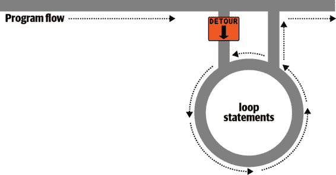

# 第四章：PHP 中的表达式和控制流

前一章只是简单介绍了一些这一章更全面涵盖的主题，如做出选择（分支）和创建复杂表达式。在前一章中，我想专注于 PHP 中最基本的语法和操作，但无法避免触及更高级的主题。现在我可以填补你需要正确使用这些强大 PHP 功能的背景。

在本章中，你将深入了解 PHP 编程的实践工作以及如何控制程序的流程。

# 表达式

让我们从任何编程语言中最基础的部分开始：*表达式*。

表达式是值、变量、运算符和函数的组合，其结果是一个值。对于任何已经学过高中代数的人来说，这是熟悉的。这里有一个例子：

```php
*`y`* = 3 (|2*`x`*| + 4)
```

在 PHP 中，它将是:

```php
$y = 3 * (abs(2 * $x) + 4);
```

这个数学声明中返回的值（*`y`*在这个数学声明中，或者在 PHP 中是`$y`）可以是一个数字，一个字符串，或者一个*布尔值*（以 19 世纪英国数学家和哲学家乔治·布尔命名）。到现在为止，你应该熟悉前两种值类型，但我将解释第三种。

## 真还是假？

基本的布尔值可以是`TRUE`或`FALSE`。例如，表达式`20 > 9`（20 大于 9）是`TRUE`，表达式`5 == 6`（5 等于 6）是`FALSE`。（你可以使用其他经典布尔运算符如`AND`、`OR`和`XOR`来结合这些操作，这些在本章后面会介绍。）

###### 注意

请注意，我在`TRUE`和`FALSE`的名称中使用了大写字母。这是因为它们在 PHP 中是预定义常量。如果你愿意，你也可以使用小写版本，因为它们也是预定义的。事实上，小写版本更稳定，因为 PHP 不允许重新定义它们；大写的可能会被重新定义，这是在导入第三方代码时需要注意的事情。

如果你要求 PHP 打印预定义的常量，它实际上不会这样做，就像在示例 4-1 中一样。对于每一行，示例打印出一个字母，后面跟着一个冒号和一个预定义常量。当示例运行时，PHP 将数字值`1`随意分配给`TRUE`，因此在`a:`之后显示`1`。更神秘的是，因为`b:`评估为`FALSE`，它不显示任何值。在 PHP 中，常量`FALSE`被定义为`NULL`，另一个表示无值的预定义常量。

##### 示例 4-1。输出`TRUE`和`FALSE`的值

```php
<?php // test2.php
  echo "a: [" . TRUE  . "]<br>";
  echo "b: [" . FALSE . "]<br>";
?>
```

`<br>`标签用于创建换行符，从而在 HTML 中将输出分为两行。这是输出：

```php
a: [1]
b: []
```

转向布尔表达式，示例 4-2 展示了一些简单的表达式：前面提到的两个，再加上另外两个。

##### 示例 4-2。四个简单的布尔表达式

```php
<?php
  echo "a: [" . (20 > 9) . "]<br>";
  echo "b: [" . (5 == 6) . "]<br>";
  echo "c: [" . (1 == 0) . "]<br>";
  echo "d: [" . (1 == 1) . "]<br>";
?>
```

这段代码的输出是：

```php
a: [1]
b: []
c: []
d: [1]
```

顺便说一句，在某些语言中，`FALSE` 可能被定义为 `0` 或者甚至是 `-1`，所以在使用每种语言时，检查其定义是很重要的。幸运的是，布尔表达式通常深藏在其他代码中，因此你通常不必担心 `TRUE` 和 `FALSE` 在内部的具体表现。事实上，这些名称在代码中很少出现。

## 文字和变量

这些是编程的最基本元素，也是表达式的构建块。*文字* 简单地意味着评估为其自身的东西，比如数字 `73` 或字符串 `"Hello"`。变量，我们已经看到其名称以美元符号开头，评估为已分配给它的值。最简单的表达式只是一个单一的文字或变量，因为两者都返回一个值。

示例 4-3 显示了三个文字和两个变量，它们都返回值，尽管类型不同。

##### 示例 4-3\. 文字和变量

```php
<?php
  $myname = "Brian";
  $myage  = 37;

  echo "a: " . 73      . "<br>"; // Numeric literal
  echo "b: " . "Hello" . "<br>"; // String literal
  echo "c: " . FALSE   . "<br>"; // Constant literal
  echo "d: " . $myname . "<br>"; // String variable
  echo "e: " . $myage  . "<br>"; // Numeric variable
?>
```

正如你所期望的那样，你会从所有这些运算中看到返回值，除了 `c:`，它评估为 `FALSE`，在以下输出中不返回任何内容：

```php
a: 73
b: Hello
c:
d: Brian
e: 37
```

结合运算符，可以创建更复杂的表达式，评估为有用的结果。

程序员将表达式与我们早些时候看到的赋值操作符等其他语言结构结合起来，形成*语句*。 示例 4-4 显示了两个语句。第一个将表达式 `366 - $day_number` 的结果赋给变量 `$days_to_new_year`，第二个仅在表达式 `$days_to_new_year < 30` 评估为 `TRUE` 时输出友好消息。

##### 示例 4-4\. 表达式和语句

```php
<?php
  $days_to_new_year = 366 - $day_number; // Expression

  if ($days_to_new_year < 30)
  {
     echo "Not long now till new year";  // Statement
  }
?>
```

# 运算符

PHP 提供了许多强大的不同类型的运算符——算术、字符串、逻辑、赋值、比较等等（参见 表 4-1）。

表 4-1\. PHP 运算符类型

| 运算符 | 描述 | 示例 |
| --- | --- | --- |
| 算术 | 基本数学运算 | `$a + $b` |
| 数组 | 数组并集 | `$a + $b` |
| 赋值 | 赋值操作 | `$a = $b + 23` |
| 位运算 | 在字节内操作位 | `12 ^ 9` |
| 比较 | 比较两个值 | `$a < $b` |
| 执行 | 执行反引号内容 | `` `ls -al` `` |
| 增量/减量 | 加或减 1 | `$a++` |
| 逻辑 | 布尔运算 | `$a and $b` |
| 字符串 | 连接 | `$a . $b` |

每个运算符接受不同数量的操作数：

+   *一元* 运算符，如递增（`$a++`）或否定（`!$a`），接受一个操作数。

+   *二元* 运算符，代表大多数 PHP 运算符（包括加法、减法、乘法和除法），接受两个操作数。

+   唯一的*三元* 运算符，采用 `expr ? x : y` 的形式，需要三个操作数。它是一个简洁的单行 `if` 语句，如果 `expr` 是 `TRUE`，则返回 `x`，如果 `expr` 是 `FALSE`，则返回 `y`。

## 运算符优先级

如果所有运算符的优先级相同，则按遇到的顺序处理它们。实际上，许多运算符确实具有相同的优先级。看看 示例 4-5。

##### 示例 4-5\. 三个等价表达式

```php
1 + 2 + 3 - 4 + 5
2 - 4 + 5 + 3 + 1
5 + 2 - 4 + 1 + 3
```

在这里，您会看到尽管数字（及其前面的运算符）已经移动，但每个表达式的结果是值`7`，因为加号和减号运算符具有相同的优先级。我们可以用乘法和除法来尝试同样的事情（参见 示例 4-6）。

##### 示例 4-6\. 三个同等表达式

```php
1 * 2 * 3 / 4 * 5
2 / 4 * 5 * 3 * 1
5 * 2 / 4 * 1 * 3
```

这里的结果值始终为`7.5`。但是当我们在一个表达式中混合具有*不同*优先级的运算符时，情况就会改变，就像 示例 4-7 中一样。

##### 示例 4-7\. 使用混合优先级运算符的三个表达式

```php
1 + 2 * 3 - 4 * 5
2 - 4 * 5 * 3 + 1
5 + 2 - 4 + 1 * 3
```

如果没有运算符优先级，这三个表达式的计算结果将分别为`25`，`–29`和`12`。但是因为乘法和除法优先于加法和减法，这些表达式被计算为如果在表达式的这些部分周围有括号，就像数学表示法一样（参见 示例 4-8）。

##### 示例 4-8\. 显示隐含括号的三个表达式

```php
1 + (2 * 3) - (4 * 5)
2 - (4 * 5 * 3) + 1
5 + 2 - 4 + (1 * 3)
```

PHP 首先计算括号内的子表达式，以得出半完成的表达式在 示例 4-9 中的结果。

##### 示例 4-9\. 在评估括号中的子表达式后

```php
1 + (6) - (20)
2 - (60) + 1
5 + 2 - 4 + (3)
```

这些表达式的最终结果分别为`–13`，`–57`和`6`（与没有运算符优先级时得到的`25`，`–29`和`12`完全不同）。

当然，您可以通过插入自己的括号并强制希望的任何顺序来覆盖默认的运算符优先级（参见 示例 4-10）。

##### 示例 4-10\. 强制左到右的评估

```php
((1 + 2) * 3 - 4) * 5
(2 - 4) * 5 * 3 + 1
(5 + 2 - 4 + 1) * 3
```

正确插入括号后，现在可以看到值分别为`25`，`–29`和`12`。

表 4-2 按优先级从高到低列出了 PHP 的运算符。

表 4-2\. PHP 运算符的优先级（从高到低）

| 运算符 | 类型 |
| --- | --- |
| `()` | 括号 |
| `++ --` | 自增/自减 |
| `!` | 逻辑 |
| `* / %` | 算术 |
| `+ - .` | 算术和字符串 |
| `<< >>` | 位 |
| `< <= > >= <>` | 比较 |
| `== != === !==` | 比较 |
| `&` | 位（及引用） |
| `^` | 位 |
| `&#124;` | 位 |
| `&&` | 逻辑 |
| `&#124;&#124;` | 逻辑 |
| `? :` | 三元 |
| `= += -= *= /= .= %= &= != ^= <<= >>=` | 赋值 |
| `and` | 逻辑 |
| `xor` | 逻辑 |
| `or` | 逻辑 |

此表中的顺序并非任意排列，而是精心设计，以便您可以在不使用括号的情况下获取最常见和直观的优先级。例如，您可以使用`and`或`or`分隔两个比较，以获得预期的结果。

## 结合性

我们一直在讨论从左到右处理表达式，除非运算符优先级生效。但是有些运算符要求从右到左处理，这种处理方向称为运算符的*结合性*。对于某些运算符，没有结合性。

结合性（如表 4-3 所详细说明的）在不显式强制优先级的情况下变得重要，因此您需要了解运算符的默认操作。

表 4-3\. 运算符结合性

| Operator | 描述 | Associativity |
| --- | --- | --- |
| `< <= >= == != === !== <>` | 比较 | None |
| `!` | 逻辑 `NOT` | Right |
| `~` | 位 `NOT` | Right |
| `++ --` | 增加和减少 | Right |
| `(int)` | 转换为整数 | Right |
| `(double) (float) (real)` | 转换为浮点数 | Right |
| `(string)` | 转换为字符串 | Right |
| `(array)` | 转换为数组 | Right |
| `(object)` | 转换为对象 | Right |
| `@` | 抑制错误报告 | Right |
| `= += -= *= /=` | 赋值 | Right |
| `.= %= &= &#124;= ^= <<= >>=` | 赋值 | Right |
| `+` | 加法和一元加 | Left |
| `-` | 减法和取反 | Left |
| `*` | 乘法 | Left |
| `/` | 除法 | Left |
| `%` | 取模 | Left |
| `.` | 字符串连接 | Left |
| `<< >> & ^ &#124;` | 位运算 | Left |
| `?:` | 三元运算符 | Left |
| `&#124;&#124; && and or xor` | 逻辑 | Left |
| `,` | 分隔符 | Left |

例如，让我们看一下赋值运算符在示例 4-11 中的应用，其中三个变量都设置为值`0`。

##### 示例 4-11\. 多重赋值语句

```php
<?php
  $level = $score = $time = 0;
?>
```

只有在先评估表达式的最右部分，然后继续从右到左处理时，才可能进行多重赋值。

###### 注意

作为 PHP 的新手，您应该避免运算符结合性的潜在陷阱，始终将子表达式嵌套在括号中以强制评估顺序。这也将有助于其他可能需要维护您代码的程序员理解正在发生的事情。

## 关系运算符

关系运算符回答诸如“这个变量的值是否为零？”和“哪个变量的值更大？”的问题。这些运算符测试两个操作数并返回布尔结果，要么是`TRUE`要么是`FALSE`。关系运算符有三种类型：*相等性*，*比较*和*逻辑*。

### 相等性

就像我们在本章中已经看到的几次一样，等号运算符是`==`（两个等号）。重要的是不要将它与`=`（单个等号）赋值运算符混淆。在例子 4-12 中，第一条语句分配一个值，第二条测试它是否相等。

##### 例子 4-12\. 分配一个值并测试相等性

```php
<?php
  $month = "March";

  if ($month == "March") echo "It's springtime";
?>
```

如你所见，通过返回`TRUE`或`FALSE`，等号运算符使你能够使用例如`if`语句来测试条件。但这并不是全部，因为 PHP 是一种弱类型语言。如果等号表达式的两个操作数类型不同，PHP 会将它们转换为它认为最合适的类型。很少使用的*全等*运算符由三个连续的等号组成，可以用来比较项目而不进行转换。

例如，任何完全由数字组成的字符串在与数字比较时将被转换为数字。在例子 4-13 中，`$a`和`$b`是两个不同的字符串，因此我们预期`if`语句都不会输出结果。

##### 例子 4-13\. 等号和全等运算符

```php
<?php
  $a = "1000";
  $b = "+1000";

  if ($a == $b)  echo "1";
  if ($a === $b) echo "2";
?>
```

然而，如果你运行这个例子，你会看到它输出数字`1`，这意味着第一个`if`语句评估为`TRUE`。这是因为两个字符串首先被转换为数字，并且`1000`与`+1000`是相同的数值。相比之下，第二个`if`语句使用全等运算符，因此它将`$a`和`$b`作为字符串进行比较，发现它们不同，因此不输出任何内容。

就像强制操作符优先级一样，每当你对 PHP 如何转换操作数类型感到怀疑时，你可以使用全等运算符来关闭这种行为。

就像你可以使用等号运算符来测试操作数是否相等一样，你也可以使用`!=`，不等运算符来测试它们*不*相等。看一下例子 4-14，它是例子 4-13 的重写，其中等号和全等运算符已被它们的反向替换。

##### 例子 4-14\. 不等和非全等运算符

```php
<?php
  $a = "1000";
  $b = "+1000";

  if ($a != $b)  echo "1";
  if ($a !== $b) echo "2";
?>
```

正如你可能期望的那样，第一个`if`语句不会输出数字`1`，因为代码询问`$a`和`$b`是否*不*在数值上相等。

相反，这段代码输出数字`2`，因为第二个`if`语句询问`$a`和`$b`是否在它们实际的字符串类型上*不*相同，答案是`TRUE`；它们不同。

### 比较运算符

使用比较运算符，你不仅可以测试相等和不相等，PHP 还提供了`>`（大于）、`<`（小于）、`>=`（大于等于）和`<=`（小于等于）等来使用。例子 4-15 展示了它们的使用。

##### 示例 4-15\. 四个比较运算符

```php
<?php
  $a = 2; $b = 3;

  if ($a > $b)  echo "$a is greater than $b<br>";
  if ($a < $b)  echo "$a is less than $b<br>";
  if ($a >= $b) echo "$a is greater than or equal to $b<br>";
  if ($a <= $b) echo "$a is less than or equal to $b<br>";
?>
```

在此示例中，其中`$a`为`2`，`$b`为`3`，输出如下： 

```php
2 is less than 3
2 is less than or equal to 3
```

请尝试自己运行此示例，改变`$a`和`$b`的值，看看结果。尝试将它们设置为相同的值，看看会发生什么。

### 逻辑运算符

逻辑运算符产生`true`或`false`的结果，因此也称为*布尔运算符*。共有四种运算符（请参见表 4-4）。

表 4-4\. 逻辑运算符

| 逻辑运算符 | 描述 |
| --- | --- |
| `AND` | 如果两个操作数都为`TRUE`则为`TRUE` |
| `OR` | 如果任一操作数为`TRUE`则为`TRUE` |
| `XOR` | 如果两个操作数中的一个为`TRUE`则为`TRUE` |
| `! (NOT)` | 如果操作数为`FALSE`则为`TRUE`，如果操作数为`TRUE`则为`FALSE` |

您可以在示例 4-16 中看到这些运算符的使用。请注意，PHP 要求使用`!`符号代替`NOT`。此外，这些运算符可以是小写或大写。

##### 示例 4-16\. 使用的逻辑运算符

```php
<?php
  $a = 1; $b = 0;

  echo ($a AND $b) . "<br>";
  echo ($a or $b)  . "<br>";
  echo ($a XOR $b) . "<br>";
  echo !$a         . "<br>";
?>
```

逐行分析，此示例输出空值、`1`、`1`和空值，意味着只有第二个和第三个`echo`语句评估为`TRUE`。（请记住，`NULL`—或空值—表示`FALSE`的值。）这是因为`AND`语句要求如果要返回`TRUE`值，那么两个操作数都必须为`TRUE`，而第四个语句对`$a`的值执行`NOT`操作，将其从`TRUE`（值为`1`）转换为`FALSE`。如果你想要试验一下，请尝试运行代码，并为`$a`和`$b`赋予不同的`1`和`0`值。

###### 注意

在编码时，请记住`AND`和`OR`的优先级低于操作符的其他版本，如`&&`和`||`。

`OR`运算符可能会在`if`语句中造成意外问题，因为如果第一个操作数被评估为`TRUE`，则不会评估第二个操作数。在示例 4-17 中，如果`$finished`的值为`1`，则函数`getnext`将永远不会被调用。

##### 示例 4-17\. 使用`OR`运算符的语句

```php
<?php
  if ($finished == 1 OR getnext() == 1) exit;
?>
```

如果需要在每个`if`语句中调用`getnext`，可以像示例 4-18 中所做的那样重写代码。

##### 示例 4-18\. 修改后的`if...OR`语句以确保调用`getnext`

```php
<?php
  $gn = getnext();

  if ($finished == 1 OR $gn == 1) exit;
?>
```

在这种情况下，在执行`getnext`函数并将返回的值存储在`$gn`之前，会执行`if`语句。

###### 注意

另一个解决方案是交换两个子句以确保执行`getnext`，因为它将首先出现在表达式中。

表 4-5 显示了使用逻辑运算符的所有可能变体。还应注意，`!TRUE`等于`FALSE`，`!FALSE`等于`TRUE`。

表 4-5\. 所有可能的 PHP 逻辑表达式

| 输入 |   | 运算符和结果 |
| --- | --- | --- |
| a | b | AND | OR | XOR |
| `TRUE` | `TRUE` | `TRUE` | `TRUE` | `FALSE` |
| `TRUE` | `FALSE` | `FALSE` | `TRUE` | `TRUE` |
| `FALSE` | `TRUE` | `FALSE` | `TRUE` | `TRUE` |
| `FALSE` | `FALSE` | `FALSE` | `FALSE` | `FALSE` |

# 条件语句

*条件语句* 改变程序流。它们使您能够对某些事物提出问题，并以不同的方式响应您得到的答案。条件语句是创建动态网页的核心（使用 PHP 的初衷），因为它们使得每次查看页面时都可以轻松地呈现不同的输出。

在本节中，我将介绍三种基本的条件语句：`if`语句、`switch`语句和`?`运算符。此外，循环条件语句（我们马上会讲到）会反复执行代码，直到满足条件为止。

## `if`语句

想象一下程序流就像是你驾驶沿着的一条单车道公路。它基本上是一条笔直的路线，但偶尔会遇到各种指示牌，告诉你应该往哪个方向走。

对于`if`语句，你可以想象遇到一个绕行标志，如果某个条件为`TRUE`，你必须按照绕行标志的指示行驶。如果是这样，你会驶出去，沿着绕行路线直到回到主路，然后继续沿着原来的方向前进。或者，如果条件不为`TRUE`，你将忽略绕行路线，继续驾驶（见图 4-1）。


###### 图 4-1。程序流就像是一条单车道公路

`if`条件的内容可以是任何有效的 PHP 表达式，包括相等测试、比较表达式、对`0`和`NULL`的测试，甚至函数（无论是内置函数还是你自己编写的函数）。

当`if`条件为`TRUE`时要执行的操作通常放在大括号内（`{ }`）。如果只有一个语句要执行，可以忽略大括号，但如果始终使用大括号，将避免因缺少大括号而导致的难以追踪的错误，例如当您向条件添加额外的行时，该行不会被评估。

###### 注意

多年来，“goto fail”漏洞一直困扰着苹果产品中安全套接层（SSL）代码，因为一位程序员忘记在`if`语句周围加上大括号，导致有时函数会错误地报告成功连接，而实际上并非总是如此。这使得恶意攻击者能够让一个安全证书被接受，而本应被拒绝。如果有疑问，请在你的`if`语句周围加上大括号。

然而，出于简洁和清晰的考虑，本书中的许多示例忽略了这个建议，并省略了单语句的大括号。

在示例 4-19 中，想象一下现在是月底，你所有的账单都已经支付，所以你正在进行一些银行账户的维护工作。

##### 示例 4-19。带有大括号的`if`语句

```php
<?php
  if ($bank_balance < 100)
  {
    $money         = 1000;
    $bank_balance += $money;
  }
?>
```

在本例中，您正在检查您的余额，以查看是否少于$100（或您的货币单位）。如果是，则支付自己$1,000，然后将其添加到余额中。（如果赚钱那么简单！）

如果银行余额为$100 或更高，则忽略条件语句，程序流将跳到下一行（未显示）。

在本书中，开放的花括号通常从新行开始。有些人喜欢将第一个花括号放在条件表达式的右侧；其他人则从新行开始。无论哪种方式都可以，因为 PHP 允许您按照自己的方式设置空白字符（空格、换行和制表符）。但是，如果您每个条件级别都用制表符缩进，您会发现代码更易于阅读和调试。

## `else`语句

有时，当条件不为`TRUE`时，您可能不希望立即继续主程序代码，而是希望执行其他操作。这就是`else`语句的用处。借助它，您可以在公路上设置第二个分支，就像图 4-2 中那样。

使用`if...else`语句，如果条件为`TRUE`，则执行第一个条件语句。但如果为`FALSE`，则执行第二个条件语句。两者之一 *必须* 被执行。在任何情况下都不能两者都执行（或都不执行）。示例 4-20 展示了使用`if...else`结构。


###### 图 4-2\. 现在的公路有一个`if`分支和一个`else`分支

##### 示例 4-20\. 使用花括号的`if...else`语句

```php
<?php
  if ($bank_balance < 100)
  {
    $money         = 1000;
    $bank_balance += $money;
  }
  else
  {
    $savings      += 50;
    $bank_balance -= 50;
  }
?>
```

在这个例子中，如果您确定银行账户中有$100 或更多的金额，则执行`else`语句，将一部分资金存入您的储蓄账户。

与`if`语句一样，如果您的`else`只有一个条件语句，可以选择省略花括号。（但建议始终使用花括号。首先，它们使代码更易于理解。其次，它们让您可以轻松地在以后的分支中添加更多语句。）

## `elseif`语句

有时您希望根据一系列条件发生不同的可能性。您可以使用`elseif`语句来实现这一点。正如您可能想象的那样，它类似于`else`语句，只是您在条件代码之前放置了进一步的条件表达式。在示例 4-21 中，您可以看到完整的`if...elseif...else`结构。

##### 示例 4-21\. 使用花括号的`if...elseif...else`语句

```php
<?php
  if ($bank_balance < 100)
  {
    $money         = 1000;
    $bank_balance += $money;
  }
  elseif ($bank_balance > 200)
  {
    $savings      += 100;
    $bank_balance -= 100;
  }
  else
  {
    $savings      += 50;
    $bank_balance -= 50;
  }
?>
```

在本例中，在`if`和`else`语句之间插入了一个`elseif`语句。它检查您的银行余额是否超过$200，并且如果是，则决定您本月可以存下$100。

虽然我可能有些过度使用这个比喻，但你可以把它想象成一个多路的绕道 (见 图 4-3)。


###### 图 4-3\. 带有 `if`、`elseif` 和 `else` 的公路

###### 注意

`else` 语句关闭 `if...else` 或 `if...elseif...else` 语句。如果不需要最终的 `else`，可以省略它，但不能在 `elseif` 之前留有 `else`；在 `if` 语句之前也不能有 `elseif`。

你可以有任意多个 `elseif` 语句。但是随着 `elseif` 语句的数量增加，如果符合你的需求，可能更适合考虑使用 `switch` 语句。接下来我们将详细讨论这一点。

## `switch` 语句

`switch` 语句在一个变量或表达式的结果可能有多个值，并且每个值应该触发不同活动的情况下非常有用。

例如，考虑一个由 PHP 驱动的菜单系统，根据用户的请求向主菜单代码传递单个字符串。假设选项是主页、关于、新闻、登录和链接，我们将变量 `$page` 设置为其中一个，根据用户的输入。

如果我们使用 `if...elseif...else` 来编写这段代码，可能会像 示例 4-22。

##### 示例 4-22\. 多行 `if...elseif...else` 语句

```php
<?php
  if     ($page == "Home")  echo "You selected Home";
  elseif ($page == "About") echo "You selected About";
  elseif ($page == "News")  echo "You selected News";
  elseif ($page == "Login") echo "You selected Login";
  elseif ($page == "Links") echo "You selected Links";
  else                      echo "Unrecognized selection";
?>
```

如果我们使用 `switch` 语句，代码可能看起来像 示例 4-23。

##### 示例 4-23\. `switch` 语句

```php
<?php
  switch ($page)
  {
    case "Home":
        echo "You selected Home";
        break;
    case "About":
        echo "You selected About";
        break;
    case "News":
        echo "You selected News";
        break;
    case "Login":
        echo "You selected Login";
        break;
    case "Links":
        echo "You selected Links";
        break;
  }
?>
```

正如你所见，`$page` 只在 `switch` 语句的开头提到。此后，`case` 命令检查是否匹配。一旦匹配，执行匹配的条件语句。当然，在实际程序中，你会在这里编写代码来显示或跳转到一个页面，而不仅仅是告诉用户选择了什么。

###### 注意

在 `switch` 语句中，你不使用花括号来定义 `case` 命令。相反，它们以冒号开头，并以 `break` 语句结束。整个 `switch` 语句中的所有 `case` 都包含在一对花括号中。

### 退出

如果你希望在 `switch` 语句中因为条件已满足而跳出，使用 `break` 命令。这个命令告诉 PHP 退出 `switch` 并跳转到下一条语句。

如果你在 示例 4-23 中省略了 `break` 命令，并且 `Home` 的情况被评估为 `TRUE`，那么所有五个情况都会被执行。或者，如果 `$page` 的值是 `News`，那么之后的所有 `case` 命令都会被执行。这是有意为之的，允许一些高级编程，但通常你应该记住每次一组 `case` 条件执行完毕时都要发出 `break` 命令。事实上，忽略 `break` 语句是一个常见的错误。

### 默认操作

`switch`语句中的典型要求是在未满足任何`case`条件时返回默认操作。例如，在示例 4-23 中的菜单代码中，你可以在最后一个大括号之前立即添加示例 4-24 中的代码。

##### 示例 4-24\. 添加到示例 4-23 的默认语句

```php
default:
    echo "Unrecognized selection";
    break;
```

这复制了示例 4-22 中`else`语句的效果。

尽管此处不需要`break`命令，因为默认是最终的子语句，并且程序流会自动继续到结束大括号，但如果你决定将`default`语句放在较高位置，那么肯定需要一个`break`命令来防止程序流陷入后续语句。通常，最安全的做法是始终包含`break`命令。

### 替代语法

如果你愿意，可以在`switch`语句中用单个冒号替换第一个大括号，并用`endswitch`命令替换最后一个大括号，就像示例 4-25 中所示。然而，这种方法并不常用，仅在你在第三方代码中遇到时才会提到。

##### 示例 4-25\. 备选`switch`语句语法

```php
<?php
  switch ($page):
    case "Home":
        echo "You selected Home";
        break;

    // etc

    case "Links":
        echo "You selected Links";
        break;
  endswitch;
?>
```

## `?`（或三元）操作符

避免使用`if`和`else`语句的冗长方法之一是使用更紧凑的三元操作符`?`，这在使用中有些不同，因为它需要三个操作数而不是通常的两个。

我们在第三章中简要提到了这一点，讨论了`print`和`echo`语句之间的区别，作为与`print`良好配合但不与`echo`良好配合的操作符类型的示例。

`?`操作符接受一个必须评估的表达式，以及两个要执行的语句：一个是当表达式评估为`TRUE`时，另一个是当它为`FALSE`时。示例 4-26 展示了我们可能会用于向汽车数字仪表板写入有关燃油水平警告的代码。

##### 示例 4-26\. 使用`?`操作符

```php
<?php
  echo $fuel <= 1 ? "Fill tank now" : "There's enough fuel";
?>
```

在此语句中，如果燃料少于或等于一加仑（换句话说，`$fuel`设置为`1`或更少），则将字符串`Fill tank now`返回给前面的`echo`语句。否则，将返回字符串`There's enough fuel`。你也可以将`?`语句返回的值赋给一个变量（参见示例 4-27）。

##### 示例 4-27\. 将`?`条件结果赋给变量

```php
<?php
  $enough = $fuel <= 1 ? FALSE : TRUE;
?>
```

在这里，只有当燃料超过一加仑时，`$enough`才会被赋值为`TRUE`；否则，它将被赋值为`FALSE`。

如果您觉得`?`运算符令人困惑，可以继续使用`if`语句，但您应该熟悉这个运算符，因为您会在其他人的代码中看到它。它可能很难阅读，因为它经常混合多个相同变量的出现。例如，以下代码是相当流行的：

```php
$saved = $saved >= $new ? $saved : $new;
```

如果仔细拆解，您可以弄清楚此代码的作用：

```php
$saved =                // Set the value of $saved to...
        $saved >= $new  // Check $saved against $new
    ?                   // Yes, comparison is true...
        $saved          // ... so assign the current value of $saved
    :                   // No, comparison is false...
        $new;           // ... so assign the value of $new
```

这是在程序进行时跟踪所见到的最大值的简洁方法。您将最大值保存在`$saved`中，并在每次获得新值时将其与`$new`进行比较。熟悉`?`运算符的程序员发现它比用于这样的短比较的`if`语句更为方便。当不用于编写紧凑的代码时，它通常用于在行内做出一些决策，例如在将变量设置为函数参数之前测试是否已设置。

# 循环

计算机的一大优点是它们可以快速且不知疲倦地重复计算任务。通常情况下，您可能希望程序重复执行相同的代码序列，直到发生某些事件，如用户输入值或达到自然结束。PHP 的循环结构为实现这一点提供了完美的方式。

要想象这是如何工作的，请看图 4-4。这与用于说明`if`语句的公路隐喻大致相同，只是这条路也有一个循环部分，一旦车辆进入其中，只有在正确的程序条件下才能退出。



###### 图 4-4\. 将循环想象为程序高速公路布局的示意图

## `while`循环

让我们将示例 4-26 中的数字汽车仪表板转变为一个循环，以在驾驶时持续检查燃油水平，使用一个`while`循环（示例 4-28）。

##### 示例 4-28\. 一个`while`循环

```php
<?php
  $fuel = 10;

  while ($fuel > 1)
  {
    // Keep driving...
    echo "There's enough fuel";
  }
?>
```

实际上，您可能更喜欢保持绿灯亮起，而不是输出文本，但关键是您希望对燃油水平做出的任何正面指示都放在`while`循环内部。顺便说一句，如果您尝试这个示例，注意它会持续打印字符串，直到您在浏览器中单击停止按钮。

###### 注意

与`if`语句一样，您会注意到`while`语句内部需要用花括号来容纳语句，除非只有一个语句。

查看另一个显示 12 倍表的`while`循环的示例，请参阅示例 4-29。

##### 示例 4-29\. 打印 12 倍表的`while`循环

```php
<?php
  $count = 1;

  while ($count <= 12)
  {
    echo "$count times 12 is " . $count * 12 . "<br>";
    ++$count;
  }
?>
```

在这里，变量`$count`被初始化为`1`的值，然后开始一个`while`循环，其比较表达式为`$count <= 12`。此循环将继续执行，直到变量大于 12。从这段代码输出如下：

```php
1 times 12 is 12
2 times 12 is 24
3 times 12 is 36
*and so on...*
```

在循环内部，打印一个字符串以及`$count`乘以 12 的值。为了整洁起见，接下来是一个`<br>`标签，强制换行。然后递增`$count`，准备最后的大括号，告诉 PHP 回到循环的起始处。

此时，再次测试`$count`是否大于 12。它不是，但现在它的值是`2`，再绕过循环 11 次后，它的值将变为`13`。当发生这种情况时，跳过`while`循环内的代码，执行转到循环后的代码，本例中即为程序的末尾。

如果没有`++$count`语句（同样也可以是`$count++`），这个循环就像本节中的第一个循环。它永远不会结束，只会一遍又一遍地打印`1 * 12`的结果。

但是有一种更整洁的方式可以编写这个循环，我想你会喜欢。看看示例 4-30。

##### 示例 4-30。示例 4-29 的简化版本

```php
<?php
  $count = 0;

  while (++$count <= 12)
    echo "$count times 12 is " . $count * 12 . "<br>";
?>
```

在这个例子中，可以将`++$count`语句从`while`循环内的语句移动到循环的条件表达式中。现在发生的是，PHP 在每次迭代循环开始时遇到变量`$count`，注意到它前面有递增操作符，首先递增变量，然后再将其与值`12`进行比较。因此，你可以看到现在必须将`$count`初始化为`0`，而不是`1`，因为一进入循环就会递增。如果保持初始化为`1`，则只会输出 2 到 12 之间的结果。

## do...while 循环

对`while`循环的轻微变化是`do...while`循环，当您希望一段代码至少执行一次并在此后进行条件检查时使用。示例 4-31 展示了使用这种循环的修改版本的 12 乘法表代码。

##### 示例 4-31。用于打印 12 乘法表的`do...while`循环

```php
<?php
  $count = 1;
  do
    echo "$count times 12 is " . $count * 12 . "<br>";
  while (++$count <= 12);
?>
```

注意，我们又回到了将`$count`初始化为`1`（而不是`0`）的地方，因为在我们有机会递增变量之前，循环的`echo`语句就已执行了。尽管如此，代码看起来还是相当相似的。

当然，如果在`do...while`循环内有多个语句，记得使用大括号，就像示例 4-32 中那样。

##### 示例 4-32。扩展示例 4-31 以使用大括号

```php
<?php
  $count = 1;

  do {
    echo "$count times 12 is " . $count * 12;
    echo "<br>";
  } while (++$count <= 12);
?>
```

## for 循环

最后一种循环语句是`for`循环，也是最强大的，因为它结合了在进入循环时设置变量、在迭代循环时测试条件以及在每次迭代后修改变量的能力。

示例 4-33 展示了如何使用`for`循环编写乘法表程序。

##### 示例 4-33\. 输出 12 乘法表的`for`循环

```php
<?php
  for ($count = 1 ; $count <= 12 ; ++$count)
    echo "$count times 12 is " . $count * 12 . "<br>";
?>
```

看看代码是如何被简化为一个包含单个条件语句的`for`语句？这里发生了什么。每个`for`语句都有三个参数：

+   一个初始化表达式

+   一个条件表达式

+   一个修改表达式

这些用分号分隔开，像这样：`for (`*`expr1`* `;` *`expr2`* `;` *`expr3`*`)`。在循环的第一次迭代开始时，初始化表达式被执行。在乘法表代码中，`$count`被初始化为值`1`。然后，在每次循环中，条件表达式（在本例中是`$count <= 12`）被测试，只有在条件为`TRUE`时才进入循环。最后，在每次迭代结束时，修改表达式被执行。在乘法表代码中，变量`$count`被递增。

所有这些结构都清晰地消除了将循环控制放置在其主体内的要求，仅仅为你希望循环执行的语句保留空间。

如果`for`循环包含多个语句，记得要使用大括号，就像示例 4-34 中那样。

##### 示例 4-34\. 示例 4-33 中的`for`循环，加入了大括号

```php
<?php
  for ($count = 1 ; $count <= 12 ; ++$count)
  {
    echo "$count times 12 is " . $count * 12;
    echo "<br>";
  }
?>
```

让我们比较何时使用`for`循环和`while`循环。`for`循环是专门设计用于一个在规律性变化的单一值上。通常情况下，你有一个增量值，例如你得到一个用户选择列表并想逐个处理每个选择。但你可以随意变换这个变量。`for`语句的更复杂形式甚至允许在每个参数中执行多个操作：

```php
for ($i = 1, $j = 1 ; $i + $j < 10 ; $i++ , $j++)
{
  // ...
}
```

尽管这很复杂且不建议首次使用者使用。关键是要区分逗号和分号。这三个参数必须用分号分隔。在每个参数内部，多个语句可以用逗号分隔。因此，在前面的示例中，第一个和第三个参数每个包含两个语句：

```php
$i = 1, $j = 1  // Initialize $i and $j
$i + $j < 10    // Terminating condition
$i++ , $j++     // Modify $i and $j at the end of each iteration
```

从这个例子中要理解的主要内容是，你必须使用分号来分隔这三个参数部分，而不是逗号（逗号只能用来分隔参数部分内的语句）。

那么，什么情况下使用`while`语句比`for`语句更合适？当你的条件不依赖于变量的简单、规律性变化时。例如，如果你想要检查某些特殊输入或错误，并在其发生时结束循环，就使用`while`语句。

## 退出循环

就像你看到如何跳出`switch`语句一样，你也可以使用相同的`break`命令跳出`for`循环（或任何循环）。当例如其中一个语句返回错误且循环无法继续安全执行时，这一步就是必要的。可能出现这种情况的一个案例是写入文件返回错误，可能是因为磁盘已满（参见示例 4-35）。

##### 示例 4-35\. 使用`for`循环编写文件并进行错误处理

```php
<?php
  $fp = fopen("text.txt", 'wb');

  for ($j = 0 ; $j < 100 ; ++$j)
  {
    $written = fwrite($fp, "data");

    if ($written == FALSE) break;
  }

  fclose($fp);
?>
```

这是迄今为止你见过的最复杂的代码片段，但你已经准备好了。我们将在第七章中探讨文件处理命令，但现在你只需要知道，第一行以二进制模式打开文件*text.txt*进行写入，并将文件指针返回到变量`$fp`中，稍后用于引用打开的文件。

然后，循环迭代 100 次（从 0 到 99），将字符串`data`写入文件。每次写入后，变量`$written`由`fwrite`函数赋值，表示正确写入的字符数。但如果发生错误，`fwrite`函数则赋值为`FALSE`。

`fwrite`的行为使得代码可以轻松检查变量`$written`是否设置为`FALSE`，如果是，则跳出循环，并进入关闭文件的下一条语句。

如果你希望改进代码，可以简化这行代码：

```php
if ($written == FALSE) break;
```

使用`NOT`运算符，像这样：

```php
if (!$written) break;
```

实际上，内部循环语句对可以缩短为单个语句：

```php
if (!fwrite($fp, "data")) break;
```

换句话说，你可以消除`$written`变量，因为它只是用来检查`fwrite`返回的值。你可以直接测试返回值而不是用`$written`变量。

`break`命令比你想象的更加强大，因为如果你的代码嵌套超过一层需要跳出，你可以在`break`命令后跟一个数字来指示跳出多少层：

```php
break 2;
```

## continue 语句

`continue`语句有点像`break`语句，不过它指示 PHP 停止处理当前循环的迭代，并直接进入下一次迭代。因此，PHP 不会跳出整个循环，而是仅退出当前迭代。

在某些情况下，这种方法非常有用，例如你知道在当前循环中继续执行没有意义，并且你想要节省处理器周期，或者通过直接进入循环的下一次迭代来防止发生错误。在示例 4-36 中，使用`continue`语句可以防止当变量`$j`的值为`0`时发生除以零的错误。

##### 示例 4-36\. 使用`continue`捕获除零错误

```php
<?php
  $j = 11;

  while ($j > -10)
  {
    $j--;

    if ($j == 0) continue;

    echo (10 / $j) . "<br>";
  }
?>
```

对于 `$j` 在 `10` 到 `-10` 之间的所有值（`0` 除外），计算 `10` 除以 `$j` 的结果会显示出来。但是当 `$j` 为 `0` 时，会执行 `continue` 语句，并立即跳到循环的下一个迭代。

# 隐式和显式转换

PHP 是一种弱类型语言，允许你在使用变量时简单地声明其类型。它还会根据需要自动将值从一种类型转换为另一种类型。这称为*隐式转换*。

然而，有时 PHP 的隐式转换可能不是你想要的。在 示例 4-37 中，请注意除法的输入是整数。默认情况下，PHP 将输出转换为浮点数，以便提供最精确的值——4.66 循环。

##### 示例 4-37\. 这个表达式返回一个浮点数

```php
<?php
  $a = 56;
  $b = 12;
  $c = $a / $b;

  echo $c;
?>
```

但是如果我们希望 `$c` 是一个整数呢？我们可以通过各种方式来实现这一点，其中一种方法是使用整数转换类型 `(int)` 强制将 `$a / $b` 的结果转换为整数值，就像这样：

```php
$c = (int) ($a / $b);
```

这称为*显式*转换。请注意，为了确保整个表达式的值被转换为整数，我们将表达式置于括号中。否则，只有变量 `$a` 会被转换为整数，这将是毫无意义的练习，因为除以 `$b` 仍将返回一个浮点数。

您可以将变量和文字显式转换为 表 4-6 中所示的类型。

表 4-6\. PHP 的类型转换

| 类型转换 | 描述 |
| --- | --- |
| `(int) (integer)` | 通过舍弃小数部分转换为整数。 |
| `(bool) (boolean)` | 转换为布尔值。 |
| `(float) (double) (real)` | 转换为浮点数。 |
| `(string)` | 转换为字符串。 |
| `(array)` | 转换为数组。 |
| `(object)` | 转换为对象。 |

###### 注意

通常可以通过调用 PHP 的内置函数避免使用转换。例如，要获取整数值，可以使用 `intval` 函数。正如本书中的其他部分一样，本节主要是为了帮助您理解可能偶尔遇到的第三方代码。

# PHP 动态链接

因为 PHP 是一种编程语言，其输出对于每个用户可能完全不同，因此一个完整的网站可以仅由单个 PHP 网页运行。每当用户点击某些内容时，细节可以发送回同一个网页，根据各种 cookie 和/或其他会话详细信息决定下一步该执行什么操作。

尽管可以通过这种方式构建整个网站，但并不推荐，因为您的源代码会越来越庞大，并开始变得难以管理，因为它必须考虑用户可能采取的每一个可能的操作。

相反，将您的网站开发分成不同的部分更加明智。例如，一个明确的过程是注册网站，以及所有这些操作的检查以验证电子邮件地址，确定用户名是否已被使用等等。

第二个模块可能是登录用户后将其传递到网站的主要部分之前的模块。然后您可能有一个具有用户留言功能的消息模块，一个包含链接和有用信息的模块，另一个允许上传图片的模块等等。

只要您已经通过 cookie 或会话变量创建了跟踪用户在网站上行动的方式（我们将在后面的章节中更详细地讨论这两者），您可以将您的网站分成 PHP 代码的合理部分，每个部分都是自包含的，因此在未来开发每个新功能和维护旧功能时会变得更加轻松。如果您有一个团队，不同的人可以分别工作在不同的模块上，这样每个程序员只需彻底了解一个部分。

# 动态链接实例

如今 Web 上更受欢迎的基于 PHP 的应用之一是内容管理系统（CMS）WordPress（见图 4-5）。您可能没有意识到，但每个主要部分都有自己的主 PHP 文件，并且一整套通用的共享函数已放置在根据需要由主 PHP 页面包含的单独文件中。


###### 图 4-5. WordPress CMS

整个平台通过幕后的会话追踪来紧密连接，以便在从一个子部分过渡到另一个子部分时几乎感觉不到。因此，希望调整 WordPress 的 Web 开发人员可以轻松找到他们需要的特定文件，修改它，测试和调试它，而不必去破坏程序的不相关部分。下次您使用 WordPress 时，请关注您浏览器的地址栏，您会注意到它使用的一些不同的 PHP 文件。

本章内容涵盖了相当多的内容，到目前为止，您应该能够编写自己的小型 PHP 程序。但在开始下一章关于函数和对象之前，您可能希望通过回答以下问题来测试您的新知识。

# 问题

1.  `TRUE`和`FALSE`分别表示什么实际底层值？

1.  什么是最简单的两种表达形式？

1.  什么是一元、二元和三元运算符的区别？

1.  强制自己操作符优先级的最佳方法是什么？

1.  *运算符结合性*是什么意思？

1.  何时使用`===`（身份）运算符？

1.  命名三种条件语句类型。

1.  您可以使用哪个命令来跳过当前循环迭代并继续下一个迭代？

1.  为什么`for`循环比`while`循环更强大？

1.  `if`和`while`语句如何解释不同数据类型的条件表达式？

请查看“第四章答案”，在附录 A 中可以找到这些问题的答案。
