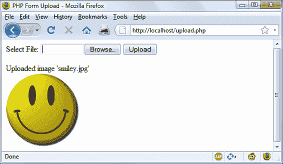

# 第七章：PHP 实用指南

前面的章节介绍了 PHP 语言的各个元素。本章将基于你的新编程技能，教你如何执行一些常见但重要的实际任务。你将学习如何处理字符串，以实现清晰简洁的代码，并在网页浏览器中显示你想要的效果，包括高级的日期和时间管理。你还将了解如何创建和修改文件，包括用户上传的文件。

# 使用 printf

你已经看到了 `print` 和 `echo` 函数，它们仅仅是将文本输出到浏览器。但是一个更强大的函数 `printf` 可以通过在字符串中添加特殊的格式化字符来控制输出的格式。对于每个格式化字符，`printf` 都希望你传递一个参数，它将使用该格式显示。例如，以下示例使用 `%d` 转换说明符来显示值 `3` 的十进制表示：

```php
printf("There are %d items in your basket", 3);
```

如果你用 `%b` 替换 `%d`，那么值 `3` 将以二进制 (`11`) 形式显示。表 7-1 显示了支持的转换说明符。

表 7-1\. `printf` 转换说明符

| 指示符 | 对参数`arg`的转换操作 | 示例（对于参数为 123） |
| --- | --- | --- |
| `%` | 显示 `%` 字符（不需要`arg`） | `%` |
| `b` | 以二进制整数显示`arg` | `1111011` |
| `c` | 显示`arg`的 ASCII 字符 | `{` |
| `d` | 以有符号十进制整数显示`arg` | `123` |
| `e` | 使用科学计数法显示`arg` | `1.23000e+2` |
| `f` | 以浮点数显示`arg` | `123.000000` |
| `o` | 以八进制整数显示`arg` | `173` |
| `s` | 以字符串形式显示`arg` | `123` |
| `u` | 以无符号十进制显示`arg` | `123` |
| `x` | 以小写十六进制显示`arg` | `7b` |
| `X` | 以大写十六进制显示`arg` | `7B` |

在 `printf` 函数中，你可以使用任意数量的转换说明符，只要你传递相匹配的参数，并且每个说明符前面都有 `%` 符号。因此，以下代码是有效的，并将输出 `"我的名字是 Simon。我今年 33 岁，这在十六进制中是 21"`：

```php
printf("My name is %s. I'm %d years old, which is %X in hexadecimal",
  'Simon', 33, 33);
```

如果省略任何参数，你将收到一个解析错误，提示意外遇到右括号 `)` 或参数不足。

更实际的 `printf` 示例是使用十进制值在 HTML 中设置颜色。例如，假设你想要一个颜色，其中红色为 65、绿色为 127、蓝色为 245，但不想自己将其转换为十六进制。这里有一个简单的解决方案：

```php
printf("<span style='color:#%X%X%X'>Hello</span>", 65, 127, 245);
```

仔细检查撇号(`''`)之间的颜色规范格式。颜色规范首先是井号 (`#`)。然后是三个 `%X` 格式说明符，分别对应你的数字。这个命令的输出如下所示：

```php
<span style='color:#417FF5'>Hello</span>
```

通常，使用变量或表达式作为 `printf` 的参数会更方便。例如，如果您将颜色值存储在三个变量 `$r`、`$g` 和 `$b` 中，可以通过以下方式创建更深的颜色：

```php
printf("<span style='color:#%X%X%X'>Hello</span>", $r-20, $g-20, $b-20);
```

## 精度设置

不仅可以指定转换类型，还可以设置显示结果的精度。例如，通常货币金额只显示两位小数。但是，在计算后，值可能具有更高的精度，例如 123.42 / 12，得到 10.285\. 为确保这些值在内部正确存储但仅显示两位小数，可以在 `%` 符号和转换说明符之间插入字符串 `".2"`：

```php
printf("The result is: $%.2f", 123.42 / 12);
```

此命令的输出如下：

```php
The result is $10.29
```

实际上，你拥有比这更多的控制权，因为你还可以指定输出是用零还是空格填充，通过在转换说明符前面加上特定的值。示例 7-1 展示了四种可能的组合。

##### 示例 7-1\. 精度设置

```php
<?php
  echo "<pre>"; // Enables viewing of the spaces

  // Pad to 15 spaces
  printf("The result is $%15f\n", 123.42 / 12);

  // Pad to 15 spaces, fill with zeros
  printf("The result is $%015f\n", 123.42 / 12);

  // Pad to 15 spaces, 2 decimal places precision
  printf("The result is $%15.2f\n", 123.42 / 12);

  // Pad to 15 spaces, 2 decimal places precision, fill with zeros
  printf("The result is $%015.2f\n", 123.42 / 12);

  // Pad to 15 spaces, 2 decimal places precision, fill with # symbol
  printf("The result is $%'#15.2f\n", 123.42 / 12);
?>
```

此示例的输出如下：

```php
The result is $      10.285000
The result is $00000010.285000
The result is $          10.29
The result is $000000000010.29
The result is $##########10.29
```

它的工作方式很简单，如果你从右到左看（见 表 7-2）。请注意：

+   最右边的字符是转换说明符：在本例中为浮点数 `f`。

+   如果在转换说明符之前有一个句点和一个数字在一起，则输出的精度被指定为该数字的值。

+   无论是否有精度说明符，如果有数字，则表示输出应填充到该字符数。在前面的示例中，这是 15 个字符。如果输出已等于或大于填充长度，则忽略此参数。

+   在 `%` 符号之后允许的最左边的参数是 `0`，除非设置了填充值，否则会被忽略，如果需要的是除零或空格之外的填充字符，则可以使用任意你选择的一个，并在其前面加上一个单引号，例如 `'#`。

+   左边是 `%` 符号，表示开始转换。

表 7-2\. 转换说明符组件

| 开始转换 | 填充字符 | 填充字符数 | 显示精度 | 转换说明符 | 示例 |
| --- | --- | --- | --- | --- | --- |
| `%` |   | `15` |   | `f` | `10.285000` |
| `%` | `0` | `15` | `.2` | `f` | `000000000010.29` |
| `%` | `'#` | `15` | `.4` | `f` | `########10.2850` |

## 字符串填充

您还可以像处理数字一样，将字符串填充到所需的长度，选择不同的填充字符，甚至可以选择左对齐或右对齐。示例 7-2 展示了各种示例。

##### 示例 7-2\. 字符串填充

```php
<?php
  echo "<pre>"; // Enables viewing of the spaces

  $h = 'Rasmus';

  printf("[%s]\n",         $h); // Standard string output
  printf("[%12s]\n",       $h); // Right justify with spaces to width 12
  printf("[%-12s]\n",      $h); // Left justify with spaces
  printf("[%012s]\n",      $h); // Pad with zeros
  printf("[%'#12s]\n\n",   $h); // Use the custom padding character '#'

  $d = 'Rasmus Lerdorf';        // The original creator of PHP

  printf("[%12.8s]\n",     $d); // Right justify, cutoff of 8 characters
  printf("[%-12.12s]\n",   $d); // Left justify, cutoff of 12 characters
  printf("[%-'@12.10s]\n", $d); // Left justify, pad with '@', cutoff 10 chars
?>
```

请注意，在 Web 页面布局方面，我使用了 `<pre>` HTML 标签来保留所有空格和每行后的 `\n` 换行字符。该示例的输出如下所示：

```php
[Rasmus]
[      Rasmus]
[Rasmus      ]
[000000Rasmus]
[######Rasmus]

[    Rasmus L]
[Rasmus Lerdo]
[Rasmus Ler@@]
```

当您指定填充值时，长度等于或大于该值的字符串将被忽略，*除非*提供了截断值，将字符串缩短至小于填充值。

表 7-3 显示了可用于字符串转换说明符的组件。

表 7-3\. 字符串转换说明符组件

| 开始转换 | 左/右对齐 | 填充字符 | 填充字符数 | 截断 | 转换说明符 | 示例（使用“Rasmus”） |
| --- | --- | --- | --- | --- | --- | --- |
| `%` |   |   |   |   | `s` | `[Rasmus]` |
| `%` | `-` |   | `10` |   | `s` | `[Rasmus ]` |
| `%` |   | `'#` | `8` | `.4` | `s` | `[####Rasm]` |

## 使用 sprintf

通常情况下，您不希望输出转换的结果，但需要将其用于代码中的其他地方。这就是 sprintf 函数的用武之地。使用它，您可以将输出发送到另一个变量，而不是直接发送到浏览器。

您可以使用它进行转换，就像以下示例中为 RGB 颜色组 65, 127, 245 返回十六进制字符串值 `$hexstring` 一样：

```php
$hexstring = sprintf("%X%X%X", 65, 127, 245);
```

或者您可能希望将输出存储在变量中以供其他用途或显示：

```php
$out = sprintf("The result is: $%.2f", 123.42 / 12);
echo $out;
```

# 日期和时间函数

PHP 使用标准的 Unix 时间戳来跟踪日期和时间，即从 1970 年 1 月 1 日开始的秒数。要确定当前时间戳，可以使用 `time` 函数：

```php
echo time();
```

因为值以秒为单位存储，要获得下周此时刻的时间戳，您可以使用以下方法，将 7 天× 24 小时× 60 分钟× 60 秒添加到返回值中：

```php
echo time() + 7 * 24 * 60 * 60;
```

如果您希望为给定日期创建时间戳，可以使用 `mktime` 函数。对于 2022 年 12 月 1 日的第一秒的时间戳是 `1669852800`：

```php
echo mktime(0, 0, 0, 12, 1, 2022);
```

传递的参数从左到右依次为：

+   小时数（0–23）

+   分钟数（0–59）

+   秒数（0–59）

+   月份数（1–12）

+   日数（1–31）

+   年份（1970–2038，或者在 32 位有符号系统上的 PHP 5.1.0+中为 1901–2038）

###### 注意

您可能会问为什么要将年份限制在 1970 到 2038 年之间。这是因为 Unix 的原始开发者选择了 1970 年作为基准日期，没有程序员需要在此之前使用！

幸运的是，从版本 5.1.0 开始，PHP 支持使用有符号 32 位整数的系统进行时间戳，支持 1901 年到 2038 年的日期。然而，这引入了一个比原问题更严重的问题，因为 Unix 的设计者还决定，在大约 70 年后没有人会继续使用 Unix，因此他们认为可以用 32 位值存储时间戳，而这将在 2038 年 1 月 19 日耗尽！

这将产生所谓的 Y2K38 问题（类似于千年虫问题，由于将年份存储为两位数值引起，也必须解决）。PHP 在 5.2 版本中引入了`DateTime`类以解决这个问题，但仅适用于 64 位架构，这在今天的大多数计算机上都是（但使用前请检查）。

要显示日期，请使用`date`函数，它支持众多格式选项，使您能够按任意方式显示日期。格式如下：

```php
date($format, $timestamp);
```

参数`$format`应为包含格式说明符的字符串，如表 7-4 所详述，并且`$timestamp`应为 Unix 时间戳。有关所有说明符的完整列表，请参阅[文档](https://tinyurl.com/phpdate)。以下命令将以格式`"Monday February 17th, 2025 - 1:38pm"`输出当前日期和时间：

```php
echo date("l F jS, Y - g:ia", time());
```

Table 7-4\. 主要日期函数格式说明符

| 格式 | 描述 | 返回值 |
| --- | --- | --- |
| **日期说明符** |
| `d` | 日期，两位数，前导零 | `01` 到 `31` |
| `D` | 星期几，三个字母 | `Mon` 到 `Sun` |
| `j` | 日期，无前导零 | `1` 到 `31` |
| `l` | 星期几，全称 | `Sunday` 到 `Saturday` |
| `N` | 星期几，数字形式，星期一至星期日 | `1` 到 `7` |
| `S` | 日期后缀（与`j`说明符一起使用） | `st`、`nd`、`rd` 或 `th` |
| `w` | 星期几，数字形式，星期日至星期六 | `0` 到 `6` |
| `z` | 年内的第几天 | `0` 到 `365` |
| **周说明符** |
| `W` | 年的周数 | `01` 到 `52` |
| **月份说明符** |
| `F` | 月份名称 | `January` 到 `December` |
| `m` | 月份，带前导零 | `01` 到 `12` |
| `M` | 月份名称，三个字母 | `Jan` 到 `Dec` |
| `n` | 月份，无前导零 | `1` 到 `12` |
| `t` | 给定月份的天数 | `28` 到 `31` |
| **年份说明符** |
| `L` | 闰年 | `1` = 是，`0` = 否 |
| `y` | 年份，2 位数 | `00` 到 `99` |
| `Y` | 年份，4 位数 | `0000` 到 `9999` |
| **时间格式说明符** |
| `a` | 上午或下午，小写 | `am` 或 `pm` |
| `A` | 上午或下午，大写 | `AM` 或 `PM` |
| `g` | 小时，12 小时制，无前导零 | `1` 到 `12` |
| `G` | 小时，24 小时制，无前导零 | `0` 到 `23` |
| `h` | 小时，12 小时制，前导零 | `01` 到 `12` |
| `H` | 小时，24 小时制，前导零 | `00` 到 `23` |
| `i` | 分钟，前导零 | `00` 到 `59` |
| `s` | 秒，前导零 | `00` 到 `59` |

## 日期常量

有许多有用的常量可以与 `date` 命令一起使用，以返回特定格式的日期。例如，`date(DATE_RSS)` 返回符合 RSS 订阅格式的当前日期和时间。一些常用的常量如下：

<dfn class="keep-together">`DATE_ATOM`</dfn>

这是 Atom 订阅的格式。PHP 的格式是`"Y-m-d\TH:i:sP"`，示例输出是`"2025-05-15T12:00:00+00:00"`。

<dfn class="keep-together">`DATE_COOKIE`</dfn>

这是从 Web 服务器或 JavaScript 设置的 cookie 的格式。PHP 的格式是`"l, d-M-y H:i:s T"`，示例输出是`"Thursday, 15-May-25 12:00:00 UTC"`。

<dfn class="keep-together">`DATE_RSS`</dfn>

这是用于 RSS 订阅的格式。PHP 的格式是`"D, d M Y H:i:s O"`，示例输出是`"Thu, 15 May 2025 12:00:00 UTC"`。

<dfn class="keep-together">`DATE_W3C`</dfn>

这是用于万维网联盟的格式。PHP 的格式是`"Y-m-d\TH:i:sP"`，示例输出是`"2025-05-15T12:00:00+00:00"`。

可以在[文档](https://tinyurl.com/phpdatetime)中找到完整的列表。

## 使用 checkdate

您已经看到如何以多种格式显示有效日期。但是如何检查用户是否向程序提交了有效日期？答案是将月、日和年传递给 `checkdate` 函数，如果日期有效则返回`TRUE`，否则返回`FALSE`。

例如，如果输入任意年份的 9 月 31 日，将始终是一个无效日期。示例 7-3 显示了您可以用于此目的的代码。目前，它会发现给定日期无效。

##### 示例 7-3\. 检查日期的有效性

```php
<?php
  $month = 9;    // September (only has 30 days)
  $day   = 31;   // 31st
  $year  = 2025; // 2025

  if (checkdate($month, $day, $year)) echo "Date is valid";
  else echo "Date is invalid";
?>
```

# 文件处理

尽管 MySQL 强大，但并非在 Web 服务器上存储所有数据的唯一（或者说是最佳）方法。有时，直接访问硬盘上的文件可能更快、更便捷。这种情况包括修改用户上传头像或处理日志文件。

不过，首先要注意文件命名：如果您在编写可能在不同 PHP 安装中使用的代码，就无法确定这些系统是否区分大小写。例如，Windows 和 macOS 的文件名不区分大小写，但 Linux 和 Unix 的文件名区分大小写。因此，您应始终假定系统区分大小写，并坚持使用全小写文件名等约定。

## 检查文件是否存在

要确定文件是否已存在，可以使用 `file_exists` 函数。该函数返回`TRUE`或`FALSE`，用法如下：

```php
if (file_exists("testfile.txt")) echo "File exists";
```

## 创建文件

此时，*testfile.txt* 不存在，让我们创建它并向其中写入几行内容。键入 示例 7-4 并将其保存为 *testfile.php*。

##### 示例 7-4\. 创建一个简单的文本文件

```php
<?php // testfile.php
  $fh = fopen("testfile.txt", 'w') or die("Failed to create file");

  $text = <<<_END
Line 1
Line 2
Line 3
_END;

  fwrite($fh, $text) or die("Could not write to file");
  fclose($fh);
  echo "File 'testfile.txt' written successfully";
?>
```

如果程序调用`die`函数，打开的文件将作为终止程序的一部分自动关闭。

当你在浏览器中运行这个程序时，如果一切顺利，你将会收到消息`File 'testfile.txt' written successfully`。如果你收到错误消息，可能是你的硬盘已满，或者更可能的是你没有权限创建或写入文件，这时你应该根据你的操作系统修改目标文件夹的属性。否则，文件*testfile.txt*现在应该存储在你保存*testfile.php*程序的相同文件夹中。尝试用文本编辑器或程序打开文件——内容将会像这样：

```php
Line 1
Line 2
Line 3
```

这个简单的例子展示了所有文件处理所需的顺序：

1.  总是通过调用`fopen`来开始打开文件。通过调用`fopen`函数来实现这一点。

1.  然后你可以调用其他函数；这里我们向文件写入（`fwrite`），但你也可以从现有文件中读取（`fread`或`fgets`）以及执行其他操作。

1.  最后通过关闭文件(`fclose`)来完成。尽管程序在结束时会自动关闭文件，但在你完成后手动关闭文件也是必要的。

每个打开的文件都需要一个文件资源，以便 PHP 可以访问和管理它。前面的例子将变量`$fh`（我选择用来表示*文件句柄*的变量名）设置为`fopen`函数返回的值。此后，每个访问已打开文件的文件处理函数，如`fwrite`或`fclose`，都必须将`$fh`作为参数传递，以标识正在访问的文件。不用担心`$fh`变量的内容；它是 PHP 用来引用有关文件的内部信息的数字——你只需将该变量传递给其他函数。

失败时，`fopen`会返回`FALSE`。前面的例子展示了捕获并响应失败的简单方法：调用`die`函数来结束程序并向用户显示错误消息。Web 应用程序绝不会以这种粗暴的方式中止（你应该创建一个带有错误消息的网页），但这对于我们的测试目的来说是可以接受的。

注意`fopen`调用的第二个参数。它只是字符`w`，告诉函数以写入模式打开文件。如果文件不存在，函数会创建该文件。在使用这些函数时要小心：如果文件已经存在，`w`模式参数会导致`fopen`调用删除旧内容（即使你没有写入任何新内容！）。

在这里可以使用几种不同的模式参数，详细说明见表 7-5。包含`+`符号的模式在“更新文件”部分有进一步解释。

表 7-5\. 支持的`fopen`模式

| 模式 | 动作 | 描述 |
| --- | --- | --- |
| `'r'` | 从文件开头读取 | 只读模式打开；将文件指针放在文件开头。如果文件不存在，则返回`FALSE`。 |
| --- | --- | --- |
| `'r+'` | 从文件开头读取并允许写入 | 可读写打开；将文件指针放在文件开头。如果文件不存在，则返回`FALSE`。 |
| --- | --- | --- |
| `'w'` | 从文件开头写入并截断文件 | 只写打开；将文件指针放在文件开头并截断文件为零长度。如果文件不存在，则尝试创建。 |
| --- | --- | --- |
| `'w+'` | 从文件开头写入、截断文件并允许读取 | 可读写打开；将文件指针放在文件开头并截断文件为零长度。如果文件不存在，则尝试创建。 |
| --- | --- | --- |
| `'a'` | 追加到文件末尾 | 只写打开；将文件指针放在文件末尾。如果文件不存在，则尝试创建。 |
| --- | --- | --- |
| `'a+'` | 追加到文件末尾并允许读取 | 可读写打开；将文件指针放在文件末尾。如果文件不存在，则尝试创建。 |
| --- | --- | --- |

## 从文件中读取

从文本文件中读取的最简单方法是通过`fgets`获取整行（最后的`s`可以理解为*string*），如示例 7-5。

##### 示例 7-5\. 使用`fgets`读取文件

```php
<?php
  $fh = fopen("testfile.txt", 'r') or
    die("File does not exist or you lack permission to open it");

  $line = fgets($fh);
  fclose($fh);
  echo $line;
?>
```

如果你按照示例 7-4 创建文件，你会得到第一行：

```php
Line 1
```

你可以通过`fread`函数检索多行或行的部分，如示例 7-6。

##### 示例 7-6\. 使用`fread`读取文件

```php
<?php
  $fh = fopen("testfile.txt", 'r') or
    die("File does not exist or you lack permission to open it");

  $text = fread($fh, 3);
  fclose($fh);
  echo $text;
?>
```

我在`fread`调用中请求了三个字符，因此程序显示如下内容：

```php
Lin
```

`fread`函数通常用于二进制数据。如果在跨越多行的文本数据上使用它，请记得计算换行符。

## 复制文件

让我们尝试 PHP `copy` 函数来创建*testfile.txt*的克隆。将其保存为*copyfile.php*，然后在浏览器中调用该程序，如示例 7-7。

##### 示例 7-7\. 复制文件

```php
<?php // copyfile.php
  copy('testfile.txt', 'testfile2.txt') or die("Could not copy file");
  echo "File successfully copied to 'testfile2.txt'";
?>
```

如果再次检查你的文件夹，你会看到现在有了新文件*testfile2.txt*。顺便说一句，如果不希望程序在复制失败时退出，你可以尝试示例 7-8 中的替代语法。它使用`!`（`NOT`）运算符作为一个快捷简便的缩写。放在表达式前面，它会对其应用`NOT`运算符，所以这里的等效语句在英语中会以“如果无法复制...”开头。

##### 示例 7-8\. 复制文件的替代语法

```php
<?php // copyfile2.php
  if (!copy('testfile.txt', 'testfile2.txt')) echo "Could not copy file";
  else echo "File successfully copied to 'testfile2.txt'";
?>
```

## 移动文件

要移动文件，请使用`rename`函数重命名，如示例 7-9。

##### 示例 7-9\. 移动文件

```php
<?php // movefile.php
  if (!rename('testfile2.txt', 'testfile2.new'))
    echo "Could not rename file";
  else echo "File successfully renamed to 'testfile2.new'";
?>
```

你也可以在目录上使用`rename`函数。为了避免在原始文件不存在时出现任何警告消息，可以先调用`file_exists`函数进行检查。

## 删除文件

删除文件只需使用`unlink`函数从文件系统中删除，如示例 7-10 中所示。

##### 示例 7-10\. 删除文件

```php
<?php // deletefile.php
  if (!unlink('testfile2.new')) echo "Could not delete file";
  else echo "File 'testfile2.new' successfully deleted";
?>
```

###### 警告

每当直接访问硬盘上的文件时，您必须始终确保文件系统不会被破坏。例如，如果根据用户输入删除文件，则必须确保它是可以安全删除的文件，并且用户被允许删除它。

与移动文件一样，如果文件不存在，将显示警告消息，您可以通过首先使用`file_exists`检查其是否存在，然后再调用`unlink`来避免这种情况。

## 更新文件

通常，您可能希望向已保存的文件添加更多数据，有多种方法可以实现。您可以使用追加写模式之一（参见表 7-5），或者您可以简单地使用支持写入的其他模式之一打开文件进行读写，并将文件指针移动到希望写入或读取的文件中的正确位置。

*文件指针*是文件中下一个文件访问将发生的位置，无论是读取还是写入。它与*文件句柄*（在示例 7-4 中存储在变量`$fh`中）不同，后者包含有关正在访问的文件的详细信息。

您可以通过输入示例 7-11 并将其保存为*update.php*来查看其操作。然后在浏览器中调用它。

##### 示例 7-11\. 更新文件

```php
<?php // update.php
  $fh   = fopen("testfile.txt", 'r+') or die("Failed to open file");
  $text = fgets($fh);

  fseek($fh, 0, SEEK_END);
  fwrite($fh, "\n$text") or die("Could not write to file");
  fclose($fh);

  echo "File 'testfile.txt' successfully updated";
?>
```

此程序通过使用`'r+'`设置模式同时打开*testfile.txt*进行读取和写入，将文件指针置于开头。然后使用`fgets`函数从文件中读取一行（直到第一个换行符）。之后，调用`fseek`函数将文件指针直接移动到文件末尾，在此时，从文件开头提取的文本行（存储在`$text`中）将以`\n`换行符开头附加到文件末尾，然后关闭文件。结果文件现在如下所示：

```php
Line 1
Line 2
Line 3
Line 1
```

第一行已成功复制并附加到文件的末尾。

此处使用的`$fh`文件句柄外，还向`fseek`函数传递了另外两个参数，`0`和`SEEK_END`。`SEEK_END`告诉函数将文件指针移动到文件末尾，`0`告诉它从那一点开始向后移动多少位置。在示例 7-11 的情况下，使用`0`是因为需要保持指针在文件的末尾。

`fseek`函数还有两个其他的寻址选项：`SEEK_SET`和`SEEK_CUR`。`SEEK_SET`选项告诉函数将文件指针设置为前面参数给出的确切位置。因此，以下示例将文件指针移动到位置 18：

```php
fseek($fh, 18, SEEK_SET);
```

`SEEK_CUR`将文件指针设置为当前位置*加上*给定偏移量的值。因此，如果文件指针当前位于位置 18，则以下调用将其移动到位置 23：

```php
fseek($fh, 5, SEEK_CUR);

```

## 为多次访问锁定文件

Web 程序经常被许多用户同时调用。如果多个人尝试同时写入文件，可能会导致文件损坏。如果一个人在读取文件时另一个人在写入它，文件是没问题的，但读取它的人可能会得到奇怪的结果。为了处理同时使用者，你必须使用文件锁定`flock`函数。这个函数将所有其他访问文件的请求排队，直到你的程序释放锁。因此，每当你的程序对可能被多个用户同时访问的文件执行写入访问时，你还应该为它们添加文件锁定，如示例 7-12 中所示，这是示例 7-11 的更新版本。

##### 示例 7-12\. 使用文件锁更新文件

```php
<?php
  $fh   = fopen("testfile.txt", 'r+') or die("Failed to open file");
  $text = fgets($fh);

  if (flock($fh, LOCK_EX))
  {
    fseek($fh, 0, SEEK_END);
    fwrite($fh, "$text") or die("Could not write to file");
    flock($fh, LOCK_UN);
  }

  fclose($fh);
  echo "File 'testfile.txt' successfully updated";
?>
```

对于文件锁定有一个技巧，以保持网站访问者最佳的响应时间：在对文件进行更改之前直接执行锁定操作，然后立即解锁。将文件锁定时间超过此时间将不必要地减慢应用程序。这就是为什么在示例 7-12 中的`flock`调用直接在`fwrite`调用之前和之后的原因。

第一次调用`flock`使用`LOCK_EX`参数在由`$fh`引用的文件上设置独占文件锁：

```php
flock($fh, LOCK_EX);
```

从此时起，直到使用`LOCK_UN`参数释放锁为止，没有其他进程可以写入（甚至读取）该文件，如下所示：

```php
flock($fh, LOCK_UN);
```

一旦释放锁定，其他进程就可以再次访问文件。这也是为什么每次需要读取或写入数据时都应重新定位到文件中希望访问的位置的原因之一——另一个进程可能在上次访问后更改了文件。

但是，你是否注意到请求独占锁的调用嵌套在一个`if`语句中？这是因为并非所有系统都支持`flock`；因此，明智的做法是检查是否成功获取了锁，以防无法获取锁。

另一件你必须考虑的事情是，`flock`被称为*建议性*锁定。这意味着它只锁定调用该函数的其他进程。如果你有任何直接修改文件而没有实现`flock`文件锁定的代码，它将始终覆盖锁定，并可能对你的文件造成严重破坏。

顺便说一句，实现文件锁定然后意外地在某个代码部分中留下它可能会导致一个极其难以定位的错误。

###### 警告

`flock` 在 NFS 和许多其他网络文件系统上无法工作。 此外，当使用像 ISAPI 这样的多线程服务器时，您可能无法依赖 `flock` 来保护文件免受同一服务器实例的并行线程中运行的其他 PHP 脚本的影响。 另外，`flock` 不支持使用旧的 FAT 文件系统的任何系统，例如较旧版本的 Windows，尽管您不太可能遇到这些系统（希望如此）。

如果不确定，可以尝试在程序开始时快速锁定一个测试文件，看看是否可以锁定该文件。 检查后不要忘记解锁它（如果不需要，可能还要删除它）。

还要记住，任何对 `die` 函数的调用都会自动解锁锁定并关闭文件，作为结束程序的一部分。

## 读取整个文件

一个方便的函数用于读取整个文件，而无需使用文件句柄是 `file_get_contents`。 它非常容易使用，就像您可以在 Example 7-13 中看到的那样。

##### Example 7-13\. 使用 `file_get_contents`

```php
<?php
  echo "<pre>";  // Enables display of line feeds
  echo file_get_contents("testfile.txt");
  echo "</pre>"; // Terminates <pre> tag
?>
```

但是这个函数实际上比这更有用，因为您还可以使用它从 Internet 上的服务器获取文件，就像 Example 7-14 中请求 O’Reilly 主页的 HTML 并将其显示为用户已经浏览到页面本身一样。 结果类似于 Figure 7-1。

##### Example 7-14\. 抓取 O’Reilly 主页

```php
<?php
  echo file_get_contents("http://oreilly.com");
?>

```


###### Figure 7-1\. 使用 `file_get_contents` 抓取的 O’Reilly 主页

## 文件上传

将文件上传到 Web 服务器是许多人看起来令人生畏的主题，但实际上却没有那么困难。 要从表单中上传文件，您需要选择一种特殊的编码类型称为 `multipart/form-data`，您的浏览器会处理其余部分。 要查看其工作原理，请输入 Example 7-15 中的程序并将其保存为 *upload.php*。 运行时，您将在浏览器中看到一个表单，让您上传您选择的文件。

##### Example 7-15\. 图像上传程序 upload.php

```php
<?php // upload.php
  echo <<<_END
 <html><head><title>PHP Form Upload</title></head><body>
 <form method='post' action='upload.php' enctype='multipart/form-data'>
 Select File: <input type='file' name='filename' size='10'>
 <input type='submit' value='Upload'>
 </form>
_END;

  if ($_FILES)
  {
    $name = $_FILES['filename']['name'];
    move_uploaded_file($_FILES['filename']['tmp_name'], $name);
    echo "Uploaded image '$name'<br>";
  }

  echo "</body></html>";
?>
```

让我们逐段检查这个程序。 多行 `echo` 语句的第一行开始一个 HTML 文档，显示标题，然后开始文档的主体。

接下来我们来到表单，它选择表单提交的 POST 方法，将发布数据的目标设置为程序 *upload.php*（程序本身），并告诉 Web 浏览器应使用 `multipart/form-data` 的内容类型来编码发布的数据，这是文件上传的 MIME 类型。

设置好表单后，下一行显示提示 `Select File:`，然后请求两个输入。 第一个请求是文件，它使用 `file` 类型的输入，名称为 `filename`，并且输入字段宽度为 10 个字符。 第二个请求的输入只是一个提交按钮，标签为 `Upload`（取代默认的提交按钮文本 Submit Query）。 然后关闭表单。

这个简短的程序展示了 Web 编程中的一个常见技术，即一个程序被调用两次：用户首次访问页面时和用户点击提交按钮时。

接收上传数据的 PHP 代码非常简单，因为所有上传的文件都放置在关联数组`$_FILES`中。因此，仅需快速检查`$_FILES`是否包含任何内容即可确定用户是否已上传文件。这通过语句`if ($_FILES)`完成。

用户首次访问页面时，在上传文件之前，`$_FILES`是空的，所以程序会跳过此代码块。当用户上传文件时，程序再次运行，并在`$_FILES`数组中发现一个元素。

一旦程序意识到文件已上传，就会从 PHP 存储它的临时位置检索并将实际名称读取到变量`$name`中。现在只需要使用`move_uploaded_file`函数将上传的文件从 PHP 存储的临时位置移动到更永久的位置即可。我们通过将文件的原始名称传递给它来执行此操作，文件将保存到当前目录中。

最后，上传的图像将显示在一个`IMG`标签中，结果应该看起来像图 7-2。

###### 警告

如果运行此程序并收到类似`move_uploaded_file`函数调用时`Permission denied`的警告消息，那么您可能没有为程序运行的文件夹设置正确的权限。



###### 图 7-2\. 以表单数据形式上传图像

### 使用 `$_FILES`

当上传文件时，`$_FILES` 数组中存储了五个东西，如表 7-6 所示（其中*`file`*是提交表单提供的文件上传字段名）。

表 7-6\. `$_FILES`数组的内容

| 数组元素 | 内容 |
| --- | --- |
| `$_FILES['*file*']['*name*']` | 上传文件的名称（例如，*smiley.jpg*） |
| `$_FILES['*file*']['*type*']` | 文件的内容类型（例如，*image/jpeg*） |
| `$_FILES['*file*']['*size*']` | 文件的字节大小 |
| `$_FILES['*file*']['*tmp_name*']` | 服务器上存储的临时文件名 |
| `$_FILES['*file*']['*error*']` | 文件上传引起的错误代码 |

以前称为*MIME*（多用途互联网邮件扩展）类型的内容类型，但由于它们后来的使用扩展到整个互联网，现在通常称为*互联网媒体类型*。表 7-7 展示了在`$_FILES['`*`file`*`']['`*`type`*`']`中经常出现的一些类型。

表 7-7\. 一些常见的互联网媒体内容类型

| `application/pdf` | `image/gif` | `multipart/form-data` | `text/xml` |
| --- | --- | --- | --- |
| `application/zip` | `image/jpeg` | `text/css` | `video/mpeg` |
| `audio/mpeg` | `image/png` | `text/html` | `video/mp4` |
| `audio/x-wav` | `application/json` | `text/plain` | `audio/webm` |

### 验证

我希望现在毋庸置疑（尽管我还是会这么说），表单数据验证是非常重要的，因为用户可能试图入侵你的服务器。

除了恶意构造的输入数据之外，你还需要检查一些其他事情，例如是否实际接收到了文件，以及如果有的话，是否发送了正确类型的数据。

考虑到所有这些因素，示例 7-16，*upload2.php*，是*upload.php*的更安全的重写。

##### 示例 7-16\. `upload.php`的更安全版本

```php
<?php // upload2.php
  echo <<<_END
 <html><head><title>PHP Form Upload</title></head><body>
 <form method='post' action='upload2.php' enctype='multipart/form-data'>
 Select a JPG, GIF, PNG or TIF File:
 <input type='file' name='filename' size='10'>
 <input type='submit' value='Upload'></form>
 _END;

  if ($_FILES)
  {
    $name = $_FILES['filename']['name'];

    switch($_FILES['filename']['type'])
    {
      case 'image/jpeg': $ext = 'jpg'; break;
      case 'image/gif':  $ext = 'gif'; break;
      case 'image/png':  $ext = 'png'; break;
      case 'image/tiff': $ext = 'tif'; break;
      default:           $ext = '';    break;
    }
    if ($ext)
    {
      $n = "image.$ext";
      move_uploaded_file($_FILES['filename']['tmp_name'], $n);
      echo "Uploaded image '$name' as '$n':<br>";
      echo "";
    }
    else echo "'$name' is not an accepted image file";
  }
  else echo "No image has been uploaded";

  echo "</body></html>";
?>
```

非 HTML 代码部分从示例 7-15 的半打行扩展到超过 20 行，从`if ($_FILES)`开始。

就像之前的版本一样，这个`if`行检查是否实际上有任何数据被发布，但是现在在程序底部附近有一个匹配的`else`，当没有上传任何内容时向屏幕输出一条消息。

在`if`语句内部，变量`$name`被赋予从上传计算机检索到的文件名的值（就像以前一样），但是这一次我们不依赖于用户发送给我们有效数据。相反，`switch`语句根据此程序支持的四种图像类型检查上传的内容类型。如果找到匹配项，则变量`$ext`设置为该类型的三字母文件扩展名。如果没有找到匹配项，则上传的文件不属于接受的类型，变量`$ext`设置为空字符串`""`。

###### 注意

在这个例子中，文件类型仍然来自浏览器，并且可以被上传文件的用户修改或更改。在这种情况下，此类用户操作并不令人担忧，因为这些文件只被视为图像。但是，如果文件可能是可执行的，你不应依赖于你未确认绝对正确的信息。

代码的下一部分然后检查变量`$ext`是否包含一个字符串，并且如果是这样的话，创建一个新的文件名叫做`$n`，基本名称为*image*，扩展名存储在`$ext`中。这意味着程序对要创建的文件类型有完全的控制，因为它只能是其中之一：*image.jpg*、*image.gif*、*image.png*或*image.tif*。

有了程序未被破坏的保证，PHP 代码的其余部分与之前的版本大致相同。它将上传的临时图像移动到新位置，然后显示它，同时显示旧图像和新图像的名称。

###### 注意

不用担心必须删除 PHP 在上传过程中创建的临时文件，因为如果文件没有被移动或重命名，当程序退出时它会自动删除。

在`if`语句之后，有一个匹配的`else`语句，只有在上传了不受支持的图像类型时才会执行（此时显示适当的错误消息）。

当编写自己的文件上传例程时，我强烈建议您使用类似的方法，并为上传的文件预先选择名称和位置。这样，无法通过您使用的变量尝试添加路径名和其他恶意数据。如果这意味着多个用户可能使用相同的名称上传文件，则可以在这些文件前加上其用户的用户名前缀，或将它们保存到为每个用户单独创建的文件夹中。

但是，如果您必须使用提供的文件名，您应该通过允许仅包含字母数字字符和句点的方式进行清理，可以使用以下命令使用正则表达式（参见第十八章）对`$name`进行搜索和替换：

```php
$name = preg_replace("/[^A-Za-z0-9.]/", "", $name);
```

这样，字符串`$name`中仅留下 A-Z、a-z、0-9 和句点，并删除所有其他内容。

更好的是，为了确保您的程序在所有系统上都能正常工作，无论它们是区分大小写还是不区分大小写，您可能应该改用以下命令，同时将所有大写字母改为小写字母：

```php
$name = strtolower(preg_replace("[^A-Za-z0-9.]", "", $name));
```

###### 注意

有时您可能会遇到`image/pjpeg`的媒体类型，表示渐进式 JPEG，但您可以安全地将其添加到代码中作为`image/jpeg`的别名，如下所示：

```php
case 'image/pjpeg':
case 'image/jpeg': $ext = 'jpg'; break;
```

# 系统调用

有时 PHP 可能没有您执行某个操作所需的函数，但运行它的操作系统可能会有。在这种情况下，您可以使用`exec`系统调用来完成工作。

例如，要快速查看当前目录的内容，您可以使用诸如示例 7-17 的程序。如果您使用的是 Windows 系统，它将直接使用 Windows `dir`命令运行。在 Linux、Unix 或 macOS 上，请注释或删除第一行，并取消注释第二行以使用`ls`系统命令。您可能希望键入此程序，将其保存为*exec.php*，并在浏览器中调用它。

##### 示例 7-17\. 执行系统命令

```php
<?php // exec.php
  $cmd = "dir";   // Windows, Mac, Linux
  // $cmd = "ls"; // Linux, Unix & Mac

  exec(escapeshellcmd($cmd), $output, $status);

  if ($status) echo "Exec command failed";
  else
  {
    echo "<pre>";
    foreach($output as $line) echo htmlspecialchars("$line\n");
    echo "</pre>";
  }
?>
```

调用`htmlspecialchars`函数用于将系统返回的任何特殊字符转换为 HTML 可以理解和正确显示的字符，整理输出。根据您使用的系统，运行此程序的结果将类似于以下内容（来自 Windows `dir`命令）：

```php
Volume in drive C is Hard Disk
 Volume Serial Number is DC63-0E29

 Directory of C:\Program Files (x86)\Ampps\www

11/04/2025  11:58    <DIR>          .
11/04/2025  11:58    <DIR>          ..
28/01/2025  16:45    <DIR>          5th_edition_examples
08/01/2025  10:34    <DIR>          cgi-bin
08/01/2025  10:34    <DIR>          error
29/01/2025  16:18            1,150 favicon.ico
              1 File(s)      1,150 bytes
              5 Dir(s)  1,611,387,486,208 bytes free
```

`exec`接受三个参数：

+   命令本身（在前一种情况下为`$cmd`）

+   系统将从命令中获取输出的数组（在前一种情况下为`$output`）

+   一个变量，用于包含调用的返回状态（在前一种情况下是`$status`）

如果愿意，可以省略`$output`和`$status`参数，但将无法知道调用生成的输出，甚至不知道是否成功完成。

您还应注意`escapeshellcmd`函数的使用。在发出`exec`调用时，始终使用此函数是一个好习惯，因为它清理命令字符串，防止执行任意命令，如果您向调用提供用户输入。

###### 警告

共享网络主机通常会禁用系统调用功能，因为它们存在安全风险。如果可能的话，你应该始终尝试在 PHP 内部解决问题，只有在确实必要时才直接访问系统。此外，访问系统相对较慢，如果你的应用程序预计在 Windows 和 Linux/Unix 系统上运行，你需要编写两种实现。

# XHTML 还是 HTML5？

因为 XHTML 文档需要良好的格式，你可以使用标准的 XML 解析器解析它们——与 HTML 不同，后者需要宽松的专用 HTML 解析器。因此，XHTML 从未真正流行起来，当制定新标准时，万维网联盟选择支持 HTML5 而不是较新的 XHTML2 标准。

HTML5 同时具有 HTML4 和 XHTML 的一些特性，但使用起来更简单，验证时更宽松。幸运的是，现在你只需要在 HTML5 文档的头部放置一个单一的文档类型声明（而不是之前需要的多种 strict、transitional 和 frameset 类型）：

```php
<!DOCTYPE html>
```

只需简单的单词`html`即可告诉浏览器你的网页是为 HTML5 设计的，因为自 2011 年左右，大多数流行浏览器的最新版本都支持大部分 HTML5 规范，所以这种文档类型通常是你唯一需要的，除非你选择支持旧版浏览器。

就 HTML 文档编写而言，Web 开发人员可以安全地忽略旧的 XHTML 文档类型和语法（例如使用`<br />`而不是更简单的`<br>`标签）。但如果你发现自己需要支持非常旧的浏览器或依赖于 XHTML 的特殊应用程序，你可以在[*http://xhtml.com*](http://xhtml.com)获取更多信息。

# 问题

1.  哪个`printf`转换说明符用于显示浮点数？

1.  什么`printf`语句可用于将输入字符串`"Happy Birthday"`输出为字符串`"**Happy"`？

1.  要将`printf`的输出发送到变量而不是浏览器，你会使用哪个替代函数？

1.  如何为 2025 年 5 月 2 日上午 7:11 创建 Unix 时间戳？

1.  使用`fopen`以写入和读取模式打开文件，并将文件截断，并将文件指针置于起始位置时，会使用哪种文件访问模式？

1.  删除文件*file.txt*的 PHP 命令是什么？

1.  哪个 PHP 函数用于一次性从网络上读取整个文件？

1.  哪个 PHP 超全局变量包含有关上传文件的详细信息？

1.  哪个 PHP 函数启用运行系统命令？

1.  HTML5 中更倾向于使用以下哪种标签风格：`<hr>`还是`<hr />`？

请参阅“第七章答案”，位于附录 A 中，以获取这些问题的答案。
