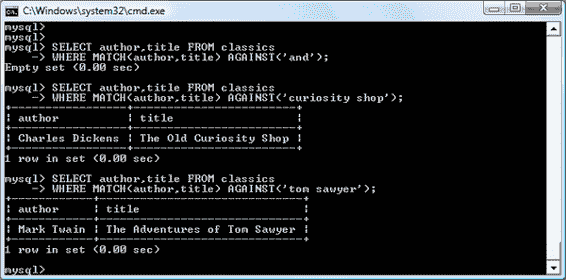

# 第八章：MySQL 简介

MySQL 已经安装了超过一千万个实例，可能是最流行的用于 Web 服务器的数据库管理系统。在 1990 年代中期开发，现在是一种成熟的技术，支持如今最受欢迎的互联网目的地之一。

其成功之一是与 PHP 一样，它是免费使用的。但它也非常强大且速度异常快。MySQL 也具有高度可扩展性，这意味着它可以随着您的网站增长；最新的基准测试结果可以[在线更新](https://tinyurl.com/mysqlbm)。

# MySQL 基础知识

*数据库*是存储在计算机系统中的结构化记录或数据的集合，并以可以快速搜索并能迅速检索信息的方式组织。

MySQL 中的 *SQL* 代表 *Structured Query Language*。这种语言基于英语并且也用于其他数据库，如 Oracle 和 Microsoft SQL Server。它旨在通过命令允许从数据库中发出简单请求，例如：

```php
SELECT title FROM publications WHERE author = 'Charles Dickens';
```

一个 MySQL 数据库包含一个或多个*表*，每个表包含*记录*或*行*。在这些行中有各种*列*或*字段*，包含数据本身。表 8-1 展示了一个包含五个出版物的示例数据库，详细说明了作者、标题、类型和出版年份。

表 8-1。简单数据库示例

| 作者 | 标题 | 类型 | 年份 |
| --- | --- | --- | --- |
| 马克·吐温 | 汤姆·索亚历险记 | 小说 | 1876 |
| 简·奥斯汀 | 傲慢与偏见 | 小说 | 1811 |
| 查尔斯·达尔文 | 物种起源 | 非虚构 | 1856 |
| 查尔斯·狄更斯 | 古玩店 | 小说 | 1841 |
| 威廉·莎士比亚 | 罗密欧与朱丽叶 | 戏剧 | 1594 |

表中的每一行与 MySQL 表中的一行相同，表中的每一列对应 MySQL 中的一列，行内的每个元素与 MySQL 中的字段相同。

为了唯一标识此数据库，我将在接下来的示例中称其为*出版物*数据库。同时，正如您已经注意到的，所有这些出版物都被认为是文学经典，所以我将称表中保存详细信息的表为*经典文学*。

# 数据库术语总结

您现在需要熟悉的主要术语如下：

<dfn class="keep-together">数据库</dfn>

包含 MySQL 数据集合的整体容器

<dfn class="keep-together">表</dfn>

数据库中存储实际数据的子容器

<dfn class="keep-together">行</dfn>

表内的单个记录，可能包含多个字段

<dfn class="keep-together">列</dfn>

一行中的字段名称

我应该指出，我并不试图复制关于关系数据库使用的精确术语，而只是提供简单、日常的术语，以帮助您快速掌握基本概念并开始使用数据库。

# 通过命令行访问 MySQL

有三种主要方式可以与 MySQL 交互：使用命令行、通过诸如 phpMyAdmin 的 Web 界面以及通过 PHP 等编程语言。我们将从第 11 章开始进行这些操作的第三种方法，但现在让我们先看看前两种方法。

## 启动命令行界面

下面的部分描述了 Windows、macOS 和 Linux 的相关说明。

### Windows 用户

如果您按照第 2 章中解释的方式安装了 AMPPS，您将能够从以下目录访问 MySQL 可执行文件：

```php
C:\Program Files\Ampps\mysql\bin
```

###### 注意

如果您在其他位置安装了 AMPPS，则需要使用该目录，例如 32 位安装的 AMPPS 如下：

```php
C:\Program Files (x86)\Ampps\mysql\bin
```

默认情况下，初始 MySQL 用户是*root*，默认密码是*mysql*。因此，要进入 MySQL 的命令行界面，请选择开始→运行，输入`CMD`到运行框中，然后按回车。这将调用 Windows 命令提示符。从那里，输入以下内容（根据刚才讨论做出适当更改）：

```php
cd C:\"Program Files\Ampps\mysql\bin"
mysql -u root -pmysql
```

第一条命令切换到 MySQL 目录，第二条告诉 MySQL 使用用户*root*和密码*mysql*登录。您现在已登录到 MySQL，可以开始输入命令了。

如果您使用的是 Windows PowerShell（而不是命令提示符），它不会从当前位置加载命令，因此您必须明确指定要从何处加载程序，这种情况下，您应输入以下内容（注意在`mysql`命令之前加上前缀 `./`）：

```php
cd C:\"Program Files\Ampps\mysql\bin"
./mysql -u root -pmysql
```

要确保一切都按预期工作，请输入以下内容，结果应类似于图 8-1：

```php
SHOW databases;
```


###### 图 8-1\. 从 Windows 命令提示符访问 MySQL

您现在可以继续下一节，“使用命令行界面”。

### macOS 用户

要继续本章，您应按照第 2 章中详细介绍的方式安装 AMPPS。您还应该运行 Web 服务器并启动 MySQL 服务器。

要进入 MySQL 命令行界面，请启动 Terminal 程序（Finder→Utilities 中应该有）。然后调用已安装在目录*/Applications/ampps/mysql/bin*中的 MySQL 程序。

默认情况下，初始 MySQL 用户是*root*，密码为*mysql*。因此，要启动程序，请输入以下内容：

```php
/Applications/ampps/mysql/bin/mysql -u root -pmysql
```

此命令告诉 MySQL 使用用户*root*和密码*mysql*登录。为了验证一切正常，请输入以下内容（应该会得到图 8-2 的结果）：

```php
SHOW databases;
```


###### 图 8-2\. 从 macOS 终端程序访问 MySQL

如果收到类似`Can't connect to local MySQL server through socket`的错误，请首先按照第二章中描述的步骤启动 MySQL 服务器。

您现在应该准备好进入下一节，“使用命令行界面”。

### Linux 用户

在运行类似 Linux 的 Unix 操作系统的系统上，您可能已经安装并运行了 PHP 和 MySQL，并且能够进入下一节的示例（如果没有，则可以按照第二章中的步骤安装 AMPPS）。首先，您应该输入以下内容以登录到您的 MySQL 系统：

```php
mysql -u root -p
```

这告诉 MySQL 使用用户*root*登录，并要求输入密码。如果有密码，请输入；否则，只需按回车键即可。

一旦登录成功，请输入以下内容来测试程序——您应该会看到类似图 8-3 的响应：

```php
SHOW databases;
```


###### 图 8-3\. 使用 Linux 访问 MySQL

如果此过程在任何时候失败，请参考第二章确保您已正确安装 MySQL。否则，您现在应该准备好进入下一节，“使用命令行界面”。

### 远程服务器上的 MySQL

如果您正在访问远程服务器上的 MySQL，它可能是 Linux/FreeBSD/Unix 类型的服务器，您应该通过安全的 SSH 协议连接到它（切勿使用不安全的 Telnet 协议）。一旦连接成功，您可能会发现事情有些不同，这取决于系统管理员如何设置服务器——尤其是如果它是共享主机服务器。因此，您需要确保已获得 MySQL 的访问权限，并且拥有您的用户名和密码。有了这些信息，您可以输入以下内容，其中*`username`*是您提供的用户名：

```php
mysql -u *username* -p
```

提示输入密码。然后，您可以尝试以下命令，这应该会得到类似图 8-3 的结果：

```php
SHOW databases;
```

可能已经存在其他数据库，而*test*数据库可能不存在。

还要记住系统管理员对所有事物有最终控制权，您可能会遇到一些意外的设置。例如，您可能会发现需要在创建的所有数据库名称之前加上唯一的标识字符串，以确保您的名称不会与其他用户创建的数据库名称发生冲突。

因此，如果您遇到任何问题，请与系统管理员交谈，他们将会帮助您解决问题。只需告诉系统管理员您需要用户名和密码。您还应该要求能够创建新的数据库或者至少为您创建一个准备好使用的数据库。然后，您可以在该数据库中创建所有需要的表格。

## 使用命令行界面

从现在开始，无论您使用 Windows、macOS 还是 Linux 直接访问 MySQL，使用的所有命令（以及可能出现的错误）都是相同的。

### 分号

让我们从基础知识开始。您注意到您键入的`SHOW databases;`命令末尾的分号（`;`）了吗？分号由 MySQL 用于分隔或结束命令。如果您忘记输入它，MySQL 将发出提示并等待您输入。所需的分号被纳入语法中，以便您输入多行命令，这可能很方便，因为有些命令变得相当长。它还允许您在每个命令后放置分号，一次输入多个命令。当您按下 Enter（或 Return）键时，解释器会将它们全部接收并按顺序执行。

###### 注意

很常见的是，您会收到 MySQL 提示符而不是您命令的结果；这意味着您忘记了最后的分号。只需输入分号并按 Enter 键，您将得到您想要的结果。

MySQL 可能会向您展示六种不同的提示符（参见表 8-2），因此您始终会知道在多行输入时的位置。

表 8-2\. MySQL 的六个命令提示符

| MySQL 提示符 | 意义 |
| --- | --- |
| `mysql>` | 准备并等待命令 |
| `->` | 等待下一行命令 |
| `'>` | 等待下一行以单引号开头的字符串 |
| `">` | 等待下一行以双引号开头的字符串 |
| `` `> `` | 等待下一行以反引号开头的字符串 |
| `/*>` | 等待下一行以`/*`开头的注释 |

### 取消命令

如果您在输入命令的过程中决定不执行它，可以输入`\c`并按回车键。示例 8-1 展示了如何使用该命令。

##### 示例 8-1\. 取消输入行

```php
meaningless gibberish to mysql \c
```

当您键入该行时，MySQL 将忽略您键入的所有内容并发出新的提示符。如果没有`\c`，它将显示错误消息。但要小心：如果您已打开字符串或注释，请先关闭它，然后再使用`\c`，否则 MySQL 会认为`\c`只是字符串的一部分。示例 8-2 展示了正确的做法。

##### 示例 8-2\. 从字符串内部取消输入

```php
this is "meaningless gibberish to mysql" \c
```

还要注意，在分号后使用`\c`将不会取消之前的命令，因为这是一个新的语句。

## MySQL 命令

您已经看到了`SHOW`命令，它列出了表、数据库和许多其他项目。您最常使用的命令列在表 8-3 中。

表 8-3\. 常见的 MySQL 命令

| 命令 | 动作 |
| --- | --- |
| `ALTER` | 修改数据库或表 |
| `BACKUP` | 备份表 |
| `\c` | 取消输入 |
| `CREATE` | 创建数据库 |
| `DELETE` | 从表中删除一行 |
| `DESCRIBE` | 描述表的列 |
| `DROP` | 删除数据库或表 |
| `EXIT` (Ctrl-C) | 退出（某些系统上） |
| `GRANT` | 更改用户权限 |
| `HELP` (`\h`, `\?`) | 显示帮助 |
| `INSERT` | 插入数据 |
| `LOCK` | 锁定表 |
| `` QUIT `(`\q`)` `` | 同`EXIT` |
| `RENAME` | 重命名表 |
| `SHOW` | 列出对象的详细信息 |
| `SOURCE` | 执行文件 |
| `STATUS` (`\s`) | 显示当前状态 |
| `TRUNCATE` | 清空表 |
| `UNLOCK` | 解锁表 |
| `UPDATE` | 更新现有记录 |
| `USE` | 使用数据库 |

在我们继续之前，我将涵盖其中大部分内容，但首先，您需要记住 MySQL 命令的几个要点：

+   SQL 命令和关键字不区分大小写。`CREATE`、`create`和`CrEaTe`都表示同一意思。然而，为了清晰起见，您可能更喜欢使用大写。

+   在 Linux 和 macOS 上，表名区分大小写，但在 Windows 上不区分大小写。因此，为了可移植性，请始终选择一种大小写风格并坚持使用。推荐的风格是对表名使用小写。

### 创建数据库

如果您正在远程服务器上工作，并且只有一个用户帐户和访问为您创建的单个数据库，请继续到“创建表”部分（#creating_a_table）。否则，通过执行以下命令来创建一个名为*publications*的新数据库：

```php
CREATE DATABASE publications;
```

一条成功的命令将返回一条目前意义不大的消息—`Query OK, 1 row affected (0.00 sec)`—但很快就会变得合理。现在您已经创建了数据库，想要使用它，请执行以下命令：

```php
USE publications;
```

您现在应该看到消息`Database changed`，然后可以继续执行以下示例。

### 创建用户

现在您已经看到了如何轻松使用 MySQL 并创建了您的第一个数据库，是时候看看如何创建用户了，因为您可能不想将 PHP 脚本授予 MySQL 的 root 访问权限——如果被黑客入侵将会带来真正的麻烦。

要创建用户，请发出`CREATE USER`命令，其形式如下（不要输入此命令；这不是一个实际的工作命令）：

```php
CREATE USER '*`username`*'@'*`hostname`*' IDENTIFIED BY '*`password`*';
GRANT *`PRIVILEGES`* ON *`database``.``object`* TO '*`username`*'@'*`hostname`*';
```

这看起来都很简单，可能除了`*database.object*`部分，它指的是数据库本身及其包含的对象，如表（参见表 8-4）。

表 8-4\. `GRANT`命令的示例参数

| 参数 | 意义 |
| --- | --- |
| `*.*` | 所有数据库及其所有对象 |
| ``*`database`*.*`` | 仅限名为*`database`*的数据库及其所有对象 |
| ``*`database`*.*`object`*`` | 仅限名为*`database`*的数据库及其名为*`object`*的对象 |

所以，让我们创建一个用户，他可以访问新的*publications*数据库及其所有对象，输入以下命令（用您选择的用户名*jim*和密码*password*替换）：

```php
CREATE USER 'jim'@'localhost' IDENTIFIED BY 'password';
GRANT ALL ON publications.* TO 'jim'@'localhost';

```

这样做的效果是允许用户*jim@localhost*使用密码*password*完全访问*publications*数据库。你可以通过输入`quit`退出并重新运行 MySQL 来测试此步骤是否有效，但不要像以前那样以 root 身份登录，而是使用你创建的用户名登录（例如，jim）。参见 Table 8-5 获取适合你操作系统的正确命令。如果*mysql*客户端程序安装在系统的不同目录中，则需要根据需要修改。

表 8-5\. 启动 MySQL 并作为 jim@localhost 登录

| 操作系统 | 示例命令 |
| --- | --- |
| Windows | `C:\"Program Files\Ampps\mysql\bin\mysql" -u jim -p` |
| macOS | `/Applications/ampps/mysql/bin/mysql -u jim -p` |
| Linux | `mysql -u jim –p` |

现在你只需要在提示时输入密码，就可以登录了。

如果你愿意，你可以在`-p`后立即输入你的密码（无需任何空格），以避免在提示时输入密码，但这被认为是不良实践，因为如果其他人登录到你的系统，可能有方法查看你输入的命令并找出你的密码。

###### 注意

你只能授予你已经拥有的权限，并且你必须有权限执行`GRANT`命令。如果你不打算授予所有权限，你可以选择授予一系列的权限。有关`GRANT`命令和一旦授予就可以撤销的`REVOKE`命令的更多详细信息，请参阅[文档](https://tinyurl.com/mysqlgrant)。此外，请注意，如果你创建一个新用户但没有指定`IDENTIFIED BY`子句，该用户将没有密码，这是非常不安全的情况，应该避免。

### 创建表格

此时，你应该已经登录到 MySQL，为*publications*数据库（或为你创建的数据库）授予了`ALL`权限，因此你可以开始创建你的第一个表格了。确保输入以下内容以使用正确的数据库（如果名称不同，请替换`publications`）：

```php
USE publications;
```

现在逐行输入 Example 8-3 中的命令。

##### Example 8-3\. 创建名为 classics 的表

```php
CREATE TABLE classics (
 author VARCHAR(128),
 title VARCHAR(128),
 type VARCHAR(16),
 year CHAR(4)) ENGINE InnoDB;

```

###### 注意

此命令中的最后两个词需要稍作解释。MySQL 可以以多种不同的方式内部处理查询，这些不同的方式由不同的*引擎*支持。从版本 5.6 开始，*InnoDB*是 MySQL 的默认存储引擎，我们在这里使用它是因为它支持`FULLTEXT`搜索。只要你有一个相对最新的 MySQL 版本，你可以在创建表时省略命令中的`ENGINE InnoDB`部分，但我现在保留它以强调正在使用的引擎。

如果您使用的是 MySQL 5.6 之前的版本，则 InnoDB 引擎不支持`FULLTEXT`索引，因此您需要在命令中将`InnoDB`替换为`MyISAM`以指示您希望使用该引擎（参见“创建 FULLTEXT 索引”）。

InnoDB 通常更高效且是推荐的选项。如果您按照第二章中详细说明的方法安装了 AMPPS 堆栈，则应至少具有 MySQL 的 5.6.35 版本。

###### 注意

您还可以将上一个命令一次性在一行上执行，就像这样：

```php
CREATE TABLE classics (author VARCHAR(128), title
VARCHAR(128), type VARCHAR(16), year CHAR(4)) ENGINE
InnoDB;
```

但是 MySQL 命令可能会很长和复杂，因此我建议在您熟悉较长命令之前使用示例 8-3 中显示的格式。

然后 MySQL 应显示响应`Query OK, 0 rows affected`，以及执行命令所花费的时间。如果您看到错误消息，请仔细检查您的语法。每个括号和逗号都很重要，打字错误很容易出现。

要检查新表是否已创建，请输入以下内容：

```php
DESCRIBE classics;
```

一切顺利的话，您将看到示例 8-4 中显示的一系列命令和响应，特别注意显示的表格式。

##### 示例 8-4\. MySQL 会话：创建和检查新表

```php
mysql> USE publications;
Database changed
mysql> CREATE TABLE classics (
    ->  author VARCHAR(128),
    ->  title VARCHAR(128),
    ->  type VARCHAR(16),
    ->  year CHAR(4)) ENGINE InnoDB;
Query OK, 0 rows affected (0.03 sec)

mysql> DESCRIBE classics;
+--------+--------------+------+-----+---------+-------+
| Field  | Type         | Null | Key | Default | Extra |
+--------+--------------+------+-----+---------+-------+
| author | varchar(128) | YES  |     | NULL    |       |
| title  | varchar(128) | YES  |     | NULL    |       |
| type   | varchar(16)  | YES  |     | NULL    |       |
| year   | char(4)      | YES  |     | NULL    |       |
+--------+--------------+------+-----+---------+-------+
4 rows in set (0.00 sec)
```

当您需要确保已正确创建 MySQL 表时，`DESCRIBE`命令是一种无价的调试辅助工具。您还可以使用它来回顾表的字段或列名称以及每个字段中的数据类型。让我们详细查看每个标题：

<dfn class="keep-together">`Field`</dfn>

表内每个字段或列的名称

<dfn class="keep-together">`Type`</dfn>

字段中存储的数据类型

<dfn class="keep-together">`Null`</dfn>

字段是否允许包含`NULL`值

<dfn class="keep-together">`Key`</dfn>

已应用的键的类型（在 MySQL 中，*键*或*索引*是快速查找和搜索数据的一种方式）

<dfn class="keep-together">`Default`</dfn>

如果在创建新行时未指定值，则将分配给字段的默认值

<dfn class="keep-together">`Extra`</dfn>

附加信息，例如字段是否设置为自动增量

## 数据类型

在示例 8-3 中，您可能已经注意到表的三个字段被赋予了`VARCHAR`数据类型，而一个字段被赋予了`CHAR`类型。术语`VARCHAR`代表*可变长度字符*串，并且该命令接受一个数值，告诉 MySQL 在此字段中存储的字符串的最大长度。

`CHAR`和`VARCHAR`都接受文本字符串，并对字段大小施加限制。不同之处在于，`CHAR`字段中的每个字符串都具有指定的大小。如果插入较小的字符串，它将填充空格。`VARCHAR`字段不会填充文本；它允许字段的大小根据插入的文本变化。但是，`VARCHAR`需要一些开销来跟踪每个值的大小。因此，如果所有记录中的大小类似，`CHAR`稍微更有效率，而如果大小差异很大并且可能很大，则`VARCHAR`更有效率。此外，这种开销导致对`VARCHAR`数据的访问比对`CHAR`数据稍慢。

字符和文本列的另一个特性，对今天的全球网络覆盖非常重要的是*字符集*。这些为特定字符分配特定的二进制值。你用于英语的字符集显然与用于俄语的不同。你可以在创建字符或文本列时为其指定字符集。

在我们的示例中，`VARCHAR`非常有用，因为它可以容纳不同长度的作者名和标题，同时帮助 MySQL 规划数据库的大小，并更轻松地执行查找和搜索。只需注意，如果您尝试分配超过允许长度的字符串值，它将被截断为表定义中声明的最大长度。

然而，`year`字段具有可预测的值，因此我们使用更高效的`CHAR(4)`数据类型而不是`VARCHAR`。参数为`4`允许 4 个字节的数据，支持从–999 到 9999 年的所有年份；一个字节包括 8 位，可以具有 00000000 到 11111111 的值，即 0 到 255 的十进制数值。

当然，你可以只存储两位数值来表示年份，但如果你的数据在下个世纪仍然需要使用，或者可能会发生环绕，那么就需要先进行清理—考虑到可能导致日期从 2000 年 1 月 1 日开始被视为 1900 年的“千年虫”问题，在全球最大的计算机设施中都存在这个问题。

###### 注意

我在*classics*表中没有使用`YEAR`数据类型，因为它仅支持 0000 年和 1901 年至 2155 年的年份。这是因为 MySQL 为了效率的原因将年份存储在单个字节中，但这意味着只有 256 年可用，并且*classics*表中的标题出版年份远在 1901 年之前。

### `CHAR`数据类型

表 8-6 列出了`CHAR`数据类型。这两种类型都有一个参数，用于设置字段允许的字符串最大（或确切）长度。正如表所示，每种类型都有一个内置的最大字节数。

表 8-6\. MySQL 的 CHAR 数据类型

| 数据类型 | 使用的字节 | 示例 |
| --- | --- | --- |
| ``CHAR(*`n`*)`` | 精确 *`n`*（<= 255） | `CHAR(5)` *“Hello” uses 5 bytes* `CHAR(57)` *“Goodbye” uses 57 bytes* |
| ``VARCHAR(*`n`*)`` | 最多 *`n`* (<= 65535) | `VARCHAR(7)` *“Hello” 使用 5* *字节* `VARCHAR(100)` *“Goodbye” 使用 7 字节* |

### BINARY 数据类型

`BINARY` 数据类型（参见 表 8-7）存储没有相关字符集的字节字符串。例如，你可以使用 `BINARY` 数据类型来存储 GIF 图像。

表 8-7\. MySQL 的 BINARY 数据类型

| 数据类型 | 使用字节 | 示例 |
| --- | --- | --- |
| `BINARY(`*`n`*`)` | 恰好 *`n`* (<= 255) | 与 `CHAR` 相似但包含二进制数据 |
| `VARBINARY(`*`n`*`)` | 最多 *`n`* (<= 65535) | 与 `VARCHAR` 相似但包含二进制数据 |

### `TEXT` 数据类型

字符数据也可以存储在一个 `TEXT` 字段中。这些字段与 `VARCHAR` 字段之间的差异很小：

+   在版本 5.0.3 之前，MySQL 会从 `VARCHAR` 字段中删除前导和尾随空格。

+   `TEXT` 字段不能有默认值。

+   MySQL 仅索引 `TEXT` 列的前 *n* 个字符（创建索引时指定 *n*）。

这意味着，如果你需要搜索字段的整个内容，`VARCHAR` 是更好和更快的数据类型。如果你永远不会搜索字段中超过某个前导字符数，那么你可能应该使用 `TEXT` 数据类型（参见 表 8-8）。

表 8-8\. MySQL 的 `TEXT` 数据类型

| 数据类型 | 使用字节 | 属性 |
| --- | --- | --- |
| ``TINYTEXT(*`n`*)`` | 最多 *`n`* (<= 255) | 被视为带有字符集的字符串 |
| ``TEXT(*`n`*)`` | 最多 *`n`* (<= 65535) | 被视为带有字符集的字符串 |
| ``MEDIUMTEXT(*`n`*)`` | 最多 *`n`* (<= 1.67e + 7) | 被视为带有字符集的字符串 |
| ``LONGTEXT(*`n`*)`` | 最多 *`n`* (<= 4.29e + 9) | 被视为带有字符集的字符串 |

数据类型的最大值越小，效率也越高；因此，你应该使用你知道对于字段中存储的任何字符串都足够的最小最大值。

### `BLOB` 数据类型

术语 `BLOB` 代表 *二进制大对象*，因此，正如你想的那样，`BLOB` 数据类型对于超过 65,536 字节大小的二进制数据最为有用。`BLOB` 和 `BINARY` 数据类型之间的主要区别是 `BLOB` 不能有默认值。`BLOB` 数据类型列在 表 8-9 中。

表 8-9\. MySQL 的 `BLOB` 数据类型

| 数据类型 | 使用字节 | 属性 |
| --- | --- | --- |
| ``TINYBLOB(*`n`*)`` | 最多 *`n`* (<= 255) | 被视为二进制数据—无字符集 |
| ``BLOB(*`n`*)`` | 最多 *`n`* (<= 65535) | 被视为二进制数据—无字符集 |
| ``MEDIUMBLOB(*`n`*)`` | 最多 *`n`* (<= 1.67e + 7) | 被视为二进制数据—无字符集 |
| ``LONGBLOB(*`n`*)`` | 最多 *`n`* (<= 4.29e + 9) | 被视为二进制数据—无字符集 |

### 数值数据类型

MySQL 支持各种数值数据类型，从单字节到双精度浮点数。尽管数值字段可以使用的最大内存为 8 字节，但建议您选择能够充分处理您期望的最大值的最小数据类型。这有助于保持数据库小并快速访问。

表 8-10 列出了 MySQL 支持的数值数据类型及其可包含的值范围。如果您对术语不熟悉，*有符号数*的可能范围从负值通过 0 到正值；*无符号数*的值范围从 0 到正值。它们都可以保存相同数量的值；可以想象有符号数被左移一半，使其一半的值为负数，另一半为正数。请注意，浮点数值（任何精度）可能只是有符号的。

表 8-10\. MySQL 的数值数据类型

| 数据类型 | 使用字节 | 最小值 | 最大值 |
| --- | --- | --- | --- |
| 有符号 | 无符号 | 有符号 | 无符号 |
| --- | --- | --- | --- |
| `TINYINT` | `1` | `–128` | `0` | `127` | `255` |
| `SMALLINT` | `2` | `–32768` | `0` | `32767` | `65535` |
| `MEDIUMINT` | `3` | `–8.38e + 6` | `0` | `8.38e + 6` | `1.67e + 7` |
| `INT` / `INTEGER` | `4` | `–2.15e + 9` | `0` | `2.15e + 9` | `4.29e + 9` |
| `BIGINT` | `8` | `–9.22e + 18` | `0` | `9.22e + 18` | `1.84e + 19` |
| `FLOAT` | `4` | `–3.40e + 38` | *n/a* | `3.4e + 38` | *n/a* |
| `DOUBLE` / `REAL` | `8` | `–1.80e + 308` | *n/a* | `1.80e + 308` | *n/a* |

要指定数据类型是否为无符号，请使用`UNSIGNED`限定词。以下示例创建了一个名为*tablename*的表，其中包含一个名为*fieldname*的`UNSIGNED INTEGER`数据类型的字段：

```php
CREATE TABLE tablename (fieldname INT UNSIGNED);
```

在创建数值字段时，您还可以传递一个可选的数字作为参数，如下所示：

```php
CREATE TABLE tablename (fieldname INT(4));
```

但您必须记住，与`BINARY`和`CHAR`数据类型不同，此参数并不表示要使用的存储字节数。这似乎是反直觉的，但该数字实际上表示的是在检索字段中的数据时的显示宽度。它通常与`ZEROFILL`限定词一起使用，如下所示：

```php
CREATE TABLE tablename (fieldname INT(4) ZEROFILL);
```

这样做的效果是使任何宽度小于四个字符的数字填充一个或多个零，以使字段的显示宽度为四个字符长度。当字段已经达到或超过指定宽度时，不会进行填充。

### 日期和时间类型

MySQL 支持的主要剩余数据类型涉及日期和时间，可以在表 8-11 中查看。

表 8-11\. MySQL 的`DATE`和`TIME`数据类型

| 数据类型 | 时间/日期格式 |
| --- | --- |
| `DATETIME` | `'0000-00-00 00:00:00'` |
| `DATE` | `'0000-00-00'` |
| `TIMESTAMP` | `'0000-00-00 00:00:00'` |
| `TIME` | `'00:00:00'` |
| `YEAR` | `0000`（仅年份 0000 和 1901–2155） |

`DATETIME`和`TIMESTAMP`数据类型显示方式相同。主要区别在于`TIMESTAMP`具有非常狭窄的范围（从 1970 年到 2037 年），而`DATETIME`将保存几乎您可能指定的任何日期，除非您对古代历史或科幻感兴趣。

`TIMESTAMP`很有用，因为你可以让 MySQL 为你设置值。如果在添加行时未指定值，则自动插入当前时间。你还可以让 MySQL 在每次更改行时更新`TIMESTAMP`列。

### 自动增量属性

有时您需要确保数据库中每一行都保证是唯一的。您可以通过仔细检查输入的数据并确保至少有一个值在任何两行中不同来在程序中执行此操作，但这种方法容易出错，并且仅在某些情况下有效。例如，在*classics*表中，作者可能多次出现。同样，出版年份也会频繁重复，等等。很难保证没有重复行。

通用解决方案是专门为此目的使用额外的列。一会儿我们将讨论使用出版物的 ISBN（国际标准书号），但首先我想介绍`AUTO_INCREMENT`数据类型。

正如其名称所示，赋予此数据类型的列将将其内容的值设置为先前插入行中的列条目值加 1。示例 8-5 显示了如何向表*classics*添加名为*id*的新列，该列具有自增功能。

##### 示例 8-5\. 添加自增列 id

```php
ALTER TABLE classics ADD id INT UNSIGNED NOT NULL AUTO_INCREMENT KEY;
```

这是你对`ALTER`命令的介绍，它与`CREATE`非常相似。`ALTER`操作现有表，可以添加、更改或删除列。我们的示例添加了一个名为*id*的列，具有以下特性：

<dfn class="keep-together">`INT UNSIGNED`</dfn>

使该列采用足够大的整数，以便我们在表中存储超过 40 亿条记录。

<dfn class="keep-together">`NOT NULL`</dfn>

确保每一列都有值。许多程序员在字段中使用`NULL`来指示其没有任何值。但这样做会允许重复，这将违反该列存在的整体原因，因此我们禁止`NULL`值。

<dfn class="keep-together">`AUTO_INCREMENT`</dfn>

如前所述，这会导致 MySQL 为每一行的该列设置一个唯一值。我们实际上无法控制该列在每行中将取得的值，但我们并不在乎：我们关心的是我们可以保证一个唯一的值。

<dfn class="keep-together">`KEY`</dfn>

自增列作为键很有用，因为你往往会基于这一列搜索行。这将在“索引”部分进行解释。

每个*id*列的条目现在都将具有唯一的编号，第一个从 1 开始，其他的依次递增。每次插入新行时，其*id*列将自动获得序列中的下一个数字。

而不是事后应用列，您可以通过以稍微不同的格式发布`CREATE`命令来包含它。在这种情况下，示例 8-3 中的命令将替换为示例 8-6。特别要注意最后一行。

##### 示例 8-6\. 在表创建时添加自增 id 列

```php
CREATE TABLE classics (
 author VARCHAR(128),
 title VARCHAR(128),
 type VARCHAR(16),
 year CHAR(4),
 id INT UNSIGNED NOT NULL AUTO_INCREMENT KEY) ENGINE InnoDB;
```

如果您想检查列是否已添加，请使用以下命令查看表的列和数据类型：

```php
DESCRIBE classics;
```

现在我们已经完成了，*id*列不再需要了，因此如果您是通过示例 8-5 创建它的，现在应该使用示例 8-7 中的命令来删除该列。

##### 示例 8-7\. 删除 id 列

```php
ALTER TABLE classics DROP id;
```

### 向表添加数据

要向表中添加数据，请使用`INSERT`命令。让我们通过使用`INSERT`命令的一种形式，重复将来自表 8-1 的数据填充到表*classics*中来看看它的效果（示例 8-8）。

##### 示例 8-8\. 填充经典表

```php
INSERT INTO classics(author, title, type, year)
 VALUES('Mark Twain','The Adventures of Tom Sawyer','Fiction','1876');
INSERT INTO classics(author, title, type, year)
 VALUES('Jane Austen','Pride and Prejudice','Fiction','1811');
INSERT INTO classics(author, title, type, year)
 VALUES('Charles Darwin','The Origin of Species','Nonfiction','1856');
INSERT INTO classics(author, title, type, year)
 VALUES('Charles Dickens','The Old Curiosity Shop','Fiction','1841');
INSERT INTO classics(author, title, type, year)
 VALUES('William Shakespeare','Romeo and Juliet','Play','1594');
```

每输入完两行之后，您应该看到一个`Query OK`消息。一旦所有行都已输入，请输入以下命令，它将显示表的内容。结果应该类似于图 8-4。

```php
SELECT * FROM classics;
```

现在暂时不必担心`SELECT`命令——我们将在“查询 MySQL 数据库”一节中讨论它。简单来说，按照现在的方式输入，它将显示您刚刚输入的所有数据。

如果您看到返回的结果顺序不同也不要担心，这是正常的，因为此时的顺序是未指定的。在本章后面我们将学习如何使用`ORDER BY`来选择希望结果返回的顺序，但目前它们可能以任何顺序显示。


###### 图 8-4\. 填充经典表并查看其内容

让我们回头看看我们如何使用`INSERT`命令。首先部分`INSERT INTO classics`告诉 MySQL 在哪里插入以下数据。然后在括号内，列出了四个列名——*author*、*title*、*type*和*year*——所有列名之间用逗号分隔。这告诉 MySQL 这些是要插入数据的字段。

每个`INSERT`命令的第二行包含关键字`VALUES`，后面跟着括号内用逗号分隔的四个字符串。这向 MySQL 提供了要插入到先前指定的四个列中的四个值。（一如既往，我在哪里断行是任意选择的。）

每个数据项将插入到相应的列中，一一对应。如果您意外地按不同于数据的顺序列出列，则数据将进入错误的列中。此外，列的数量必须与数据项的数量匹配。（有更安全的`INSERT`使用方法，我们很快就会看到。）

### 重命名表

重命名表，如通过`ALTER`命令对表的结构或元信息进行的任何其他更改。因此，例如，要将表名*classics*更改为*pre1900*，您将使用以下命令：

```php
ALTER TABLE classics RENAME pre1900;
```

如果您尝试过该命令，则应该通过输入以下内容恢复表名，以便本章后面的示例按照打印的方式运行：

```php
ALTER TABLE pre1900 RENAME classics;
```

### 修改列的数据类型

更改列的数据类型还需使用`ALTER`命令，这次配合`MODIFY`关键字。要将列*year*的数据类型从`CHAR(4)`更改为`SMALLINT`（仅需要 2 个字节的存储空间，因此可以节省磁盘空间），请输入以下内容：

```php
ALTER TABLE classics MODIFY year SMALLINT;
```

当您执行此操作时，如果数据类型的转换对 MySQL 有意义，它将自动更改数据并保持含义。在这种情况下，它将每个字符串转换为可比较的整数，只要该字符串可识别为指代整数。

### 添加新列

假设您已创建了一个表并填充了大量数据，但后来发现需要增加一个额外的列。别担心。以下是如何添加新列*pages*的方法，用于存储出版物的页数：

```php
ALTER TABLE classics ADD pages SMALLINT UNSIGNED;
```

使用`UNSIGNED SMALLINT`数据类型添加名为*pages*的新列，足以容纳最多 65535 的值——希望这足够存储任何已发表的书籍！

如果您要求 MySQL 使用`DESCRIBE`命令描述更新后的表，如下所示，您将看到已进行了更改（参见图 8-5）：

```php
DESCRIBE classics;
```


###### 图 8-5。添加新页面列并查看表

### 重命名列

再次查看图 8-5，您可能会发现，拥有一个名为*type*的列很令人困惑，因为这是 MySQL 用来标识数据类型的名称。再次强调——没问题——让我们将其名称更改为*category*，如下所示：

```php
ALTER TABLE classics CHANGE type category VARCHAR(16);
```

请注意，在此命令的末尾添加了`VARCHAR(16)`。这是因为`CHANGE`关键字要求指定数据类型，即使您不打算更改它，并且在最初创建该列时指定了`VARCHAR(16)`作为*类型*。

### 删除列

实际上，在反思之后，您可能会决定这个特定数据库中的页数列*pages*并不那么有用，因此下面是如何通过使用`DROP`关键字删除该列的方法：

```php
ALTER TABLE classics DROP pages;
```

###### 警告

记住，`DROP`是不可逆的。您应该始终谨慎使用它，因为如果不小心，它可能会意外删除整个表（甚至整个数据库）！

### 删除表

删除表确实非常简单。但是，因为我不希望您不得不重新输入*classics*表的所有数据，让我们快速创建一个新表，验证其存在，然后再删除它。您可以通过键入示例 8-9 中的命令来执行此操作。这四个命令的结果应如图 8-6 所示。

##### 示例 8-9\. 创建、查看和删除表

```php
CREATE TABLE disposable(trash INT);
DESCRIBE disposable;
DROP TABLE disposable;
SHOW tables;
```


###### 图 8-6\. 创建、查看和删除表

# 索引

就目前而言，*classics*表可以在 MySQL 中无问题地工作和搜索，直到它的行数超过几百行。此时，随着每新增一行，数据库访问速度会变得越来越慢，因为 MySQL 在发出查询时必须搜索每一行。这就像在需要查找某物时搜索图书馆中的每一本书一样。

当然，你不必像这样搜索图书馆，因为它们要么有一个卡片索引系统，要么更可能有自己的数据库。对 MySQL 也是如此，因为通过稍微增加内存和磁盘空间的开销，您可以为 MySQL 创建一个“卡片索引”，用于进行极快的搜索。

## 创建索引

实现快速搜索的方法是在创建表时或随时以后添加*索引*。但是，决策并不那么简单。例如，有不同的索引类型，如常规`INDEX`、`PRIMARY KEY`或`FULLTEXT`索引。此外，您必须决定哪些列需要索引，这需要您预测是否会搜索每列的任何数据。索引也可以变得更加复杂，因为您可以将多个列组合到一个索引中。即使在做出了决策后，您仍然可以通过限制要索引的每列的数量来减少索引大小。

如果我们想象一下可能在*classics*表上进行的搜索，就会发现所有列都可能需要进行搜索。但是，如果在“添加新列”部分创建的*pages*列没有被删除，那么可能不需要索引，因为大多数人不太可能通过页面数来搜索书籍。不管怎样，继续为每个列添加索引，使用示例 8-10 中的命令。

##### 示例 8-10\. 为 classics 表添加索引

```php
ALTER TABLE classics ADD INDEX(author(20));
ALTER TABLE classics ADD INDEX(title(20));
ALTER TABLE classics ADD INDEX(category(4));
ALTER TABLE classics ADD INDEX(year);
DESCRIBE classics;
```

前两个命令在*author*和*title*列上创建索引，将每个索引限制为仅前 20 个字符。例如，当 MySQL 索引以下标题时：

```php
The Adventures of Tom Sawyer
```

它实际上只会存储索引的前 20 个字符：

```php
The Adventures of To
```

这样做是为了减小索引的大小并优化数据库访问速度。我选择了 20，因为对于这些列中的大多数字符串来说，这可能足以确保唯一性。如果 MySQL 发现两个内容相同的索引，它将不得不浪费时间访问表本身，并检查索引的列，以找出真正匹配的行。

使用*category*列，目前只需要第一个字符来识别字符串的唯一性（F 表示 Fiction，N 表示 Nonfiction，P 表示 Play），但我选择了四个字符的索引，以便未来可能共享前三个字符的类别。当您有更完整的类别集时，还可以稍后重新索引此列。最后，我对*year*列的索引没有设置限制，因为它的长度明确定义为四个字符。

发出这些命令的结果（以及确认它们是否有效的`DESCRIBE`命令）可以在图 8-7 中看到，该图显示了每列的`MUL`关键字。此关键字表示该列中可能存在多个值的多次出现，这正是我们想要的，因为作者可能出现多次，同一书名可能由多位作者使用，等等。


###### 图 8-7\. 为经典表添加索引

### 使用 CREATE INDEX

添加索引的另一种方法是使用`ALTER TABLE`命令。它们是等效的，但`CREATE INDEX`不能用于创建`PRIMARY KEY`（参见“主键”一节）。此命令的格式显示在例子 8-11 的第二行中。

##### 例子 8-11\. 这两个命令是等效的

```php
ALTER TABLE classics ADD INDEX(author(20));
CREATE INDEX author ON classics (author(20));
```

### 在创建表时添加索引

您无需等到创建表后才添加索引。事实上，这样做可能会很耗时，因为向大表添加索引可能需要很长时间。因此，让我们看一下一个命令，它创建了带有索引的*classics*表。

例子 8-12 是例子 8-3 的重新制作，在这个版本中，索引与表同时创建。请注意，为了融入本章所做的修改，此版本使用了新的列名*category*代替*type*，并将*year*的数据类型设置为`SMALLINT`，而不是`CHAR(4)`。如果您想在首先删除当前*classics*表之前尝试它，请将第 1 行中的*classics*改为其他名称，如*classics1*，然后在完成后删除*classics1*。

##### 例子 8-12\. 创建带索引的经典表

```php
CREATE TABLE classics (
 author VARCHAR(128),
 title VARCHAR(128),
 category VARCHAR(16),
 year SMALLINT,
 INDEX(author(20)),
 INDEX(title(20)),
 INDEX(category(4)),
 INDEX(year)) ENGINE InnoDB;
```

### 主键

到目前为止，您已经创建了表*classics*并确保 MySQL 可以通过添加索引快速搜索它，但仍然有一些缺失。表中的所有出版物都可以进行搜索，但没有单个唯一的键用于即时访问行。当我们开始从不同的表中组合数据时，拥有具有唯一值的键的重要性将显现出来。

在“AUTO_INCREMENT 属性”一节中简要介绍了在创建自增列*id*时主键的概念，该列本可以用作此表的主键。然而，我希望将该任务保留给更合适的列：国际公认的 ISBN。

因此，让我们继续为此键创建一个新的列。请记住，ISBN 号码长度为 13 个字符，您可能认为以下命令将起作用：

```php
ALTER TABLE classics ADD isbn CHAR(13) PRIMARY KEY;
```

但并非如此。如果您尝试，您将收到类似于`Duplicate entry` for key 1 的错误。原因是表已经填充了一些数据，并且此命令试图向每一行添加具有值`NULL`的列，这是不允许的，因为在具有主键索引的任何列中，所有值必须是唯一的。如果表中还没有数据，此命令将正常工作，就像在表创建时添加主键索引一样。

在我们当前的情况下，我们必须稍微狡猾地创建新列，而不添加索引，填充数据，然后使用示例 8-13 中的命令回顾性地添加索引。幸运的是，当前数据集中每年都是唯一的，因此我们可以使用*year*列来标识每一行进行更新。请注意，此示例使用了`UPDATE`命令和`WHERE`关键字，在“查询 MySQL 数据库”一节中有更详细的解释。

##### 示例 8-13\. 使用数据填充 isbn 列并使用主键

```php
ALTER TABLE classics ADD isbn CHAR(13);
UPDATE classics SET isbn='9781598184891' WHERE year='1876';
UPDATE classics SET isbn='9780582506206' WHERE year='1811';
UPDATE classics SET isbn='9780517123201' WHERE year='1856';
UPDATE classics SET isbn='9780099533474' WHERE year='1841';
UPDATE classics SET isbn='9780192814968' WHERE year='1594';
ALTER TABLE classics ADD PRIMARY KEY(isbn);
DESCRIBE classics;
```

输入这些命令后，结果应该如图 8-8 所示。请注意，关键字`PRIMARY KEY`在`ALTER TABLE`语法中替代了关键字`INDEX`（比较示例 8-10 和 8-13）。


###### 图 8-8\. 回顾性地向经典表添加主键

当创建*classics*表时已经创建了主键，您可以使用示例 8-14 中的命令。同样，如果您希望尝试此示例，请在第 1 行中将*classics*重命名为其他名称，然后删除测试表。

##### 示例 8-14\. 创建具有主键的经典表

```php
CREATE TABLE classics (
 author VARCHAR(128),
 title VARCHAR(128),
 category VARCHAR(16),
 year SMALLINT,
 isbn CHAR(13),
 INDEX(author(20)),
 INDEX(title(20)),
 INDEX(category(4)),
 INDEX(year),
 PRIMARY KEY (isbn)) ENGINE InnoDB;
```

### 创建 FULLTEXT 索引

不同于常规索引，MySQL 的`FULLTEXT`允许对整个文本列进行超快速的搜索。它会将每个数据字符串中的每个单词存储在特殊索引中，您可以使用“自然语言”进行搜索，类似于使用搜索引擎。

###### 注意

MySQL 并不严格地存储`FULLTEXT`索引中的*所有*单词，因为它有一个内置的停用词列表，包含超过 500 个常见词汇，它们会被忽略，因为它们对搜索并不是非常有用。这些词称为*停用词*，列表包括*the*、*as*、*is*、*of*等。该列表有助于 MySQL 在执行`FULLTEXT`搜索时运行更快，并保持数据库的大小。

以下是关于`FULLTEXT`索引的一些事项，您应该知道：

+   自 MySQL 5.6 起，InnoDB 表可以使用`FULLTEXT`索引，但在此之前，`FULLTEXT`索引只能用于 MyISAM 表。如果需要将表转换为 MyISAM，通常可以使用 MySQL 命令`ALTER TABLE tablename ENGINE = MyISAM;`。

+   只能为`CHAR`、`VARCHAR`和`TEXT`列创建`FULLTEXT`索引。

+   在创建表时，可以在`CREATE TABLE`语句中定义`FULLTEXT`索引，也可以稍后使用`ALTER TABLE`（或`CREATE INDEX`）添加。

+   对于大型数据集，将数据加载到没有`FULLTEXT`索引的表中，然后再创建索引，速度会*快得多*。

要创建`FULLTEXT`索引，请将其应用于一个或多个记录，如示例 8-15 中所示，在*classics*表中的*author*和*title*列对上添加了一个`FULLTEXT`索引（此索引是额外创建的，并不影响已创建的索引）。

##### 示例 8-15\. 在经典表中添加`FULLTEXT`索引

```php
ALTER TABLE classics ADD FULLTEXT(author,title);
```

您现在可以在这对列上执行`FULLTEXT`搜索。如果现在将这些出版物的整篇文章添加到数据库中（尤其是它们已经脱离版权保护期），那么它们将成为完全可搜索的。查看“MATCH...AGAINST”一节，了解使用`FULLTEXT`进行搜索的描述。

###### 注意

如果发现 MySQL 在访问数据库时运行速度比预期慢，问题通常与索引有关。要么你在需要索引的地方没有索引，要么索引设计不够优化。调整表的索引通常可以解决这类问题。性能超出本书的范围，但在第九章中，我会给出一些提示，让你知道应该注意什么。

## 查询 MySQL 数据库

到目前为止，我们已经创建了一个 MySQL 数据库和表，填充了数据，并添加了索引以加快搜索速度。现在是时候看看这些搜索是如何执行的，以及可用的各种命令和限定符。

### SELECT

如您在 图 8-4 中看到的，`SELECT` 命令用于从表中提取数据。在该部分中，我使用了最简单的形式来选择所有数据并显示它们——这是您除了最小的表外永远不希望做的事情，因为所有数据将以不可读的速度滚动。或者，在 Unix/Linux 计算机上，您可以通过发出以下命令告诉 MySQL 每次一页地分页输出屏幕：

```php
pager less;

```

这将输出传输到 `less` 程序。要恢复标准输出并关闭分页，您可以发出以下命令：

```php
nopager;

```

现在让我们更详细地研究 `SELECT`。其基本语法是：

```php
SELECT *`something`* FROM *`tablename`*;
```

*`something`* 可以是 `*`（星号），如前所示，表示 *每一列*，或者您可以选择仅选择特定列。例如，示例 8-16 显示了如何仅选择 *作者* 和 *标题*，以及仅选择 *标题* 和 *ISBN*。输入这些命令的结果可以在 图 8-9 中看到。

##### 示例 8-16\. 两个不同的 `SELECT` 语句

```php
SELECT author,title FROM classics;
SELECT title,isbn FROM classics;
```


###### 图 8-9\. 两个不同 `SELECT` 语句的输出

### SELECT COUNT

*`something`* 参数的另一个替代品是 `COUNT`，它可以以多种方式使用。在 示例 8-17 中，它通过将 `*` 作为参数来显示表中的行数，这意味着 *所有行*。正如您所期望的那样，返回的结果是 `5`，因为表中有五个出版物。

##### 示例 8-17\. 计数行

```php
SELECT COUNT(*) FROM classics;
```

### SELECT DISTINCT

`DISTINCT` 修饰符（及其合作伙伴 `DISTINCTROW`）允许您在包含相同数据的多个条目时清除多个条目。例如，假设您想要列出表中所有的作者。如果您仅从包含同一作者多本书的表中选择 *作者* 列，通常会看到一个长列表，其中包含一遍又一遍相同的作者名字。但通过添加 `DISTINCT` 关键字，您可以仅显示每个作者一次。所以，让我们通过添加另一行来测试这一点，这行重复了我们现有的某个作者（示例 8-18）。

##### 示例 8-18\. 复制数据

```php
INSERT INTO classics(author, title, category, year, isbn)
 VALUES('Charles Dickens','Little Dorrit','Fiction','1857', '9780141439969');
```

现在查尔斯·狄更斯在表中出现了两次，我们可以比较使用 `SELECT` 带有和不带有 `DISTINCT` 修饰符的结果。示例 8-19 和 图 8-10 显示，简单的 `SELECT` 列表将狄更斯列出两次，而带有 `DISTINCT` 修饰符的命令只显示一次。

##### 示例 8-19\. 带有和不带有 `DISTINCT` 修饰符

```php
SELECT author FROM classics;
SELECT DISTINCT author FROM classics;
```


###### 图 8-10\. 带有和不带有 `DISTINCT` 的选择数据

### DELETE

当您需要从表中删除行时，请使用 `DELETE` 命令。其语法与 `SELECT` 命令类似，并允许您使用 `WHERE` 和 `LIMIT` 等限定符来缩小要删除的确切行或行的范围。

现在您已经看到了`DISTINCT`限定词的效果，如果您输入了 Example 8-18，则应该通过输入 Example 8-20 中的命令来移除*小杜丽*。

##### Example 8-20\. 移除新条目

```php
DELETE FROM classics WHERE title='Little Dorrit';
```

本示例为所有*标题*列包含确切字符串`小杜丽`的行发出`DELETE`命令。

`WHERE`关键字非常强大，正确输入非常重要；错误可能导致命令应用于错误的行（或在没有匹配`WHERE`子句的情况下无效）。因此，我们现在将花一些时间来详细介绍这个子句，这是 SQL 的核心。

### WHERE

`WHERE`关键字使您能够通过返回仅当某个表达式为真时的查询结果来缩小查询范围。Example 8-20 仅返回列完全匹配字符串`Little Dorrit`的行，使用等号操作符`=。Example 8-21 显示了使用`WHERE`与`=操作符的更多示例。

##### Example 8-21\. 使用`WHERE`关键字

```php
SELECT author,title FROM classics WHERE author="Mark Twain";
SELECT author,title FROM classics WHERE isbn="9781598184891";
```

鉴于我们当前的表格，在 Example 8-21 中的两个命令显示相同的结果。但是如果我们可以轻松地添加更多马克·吐温的书籍，那么第一行将显示他写的所有书名，第二行将继续（因为我们知道 ISBN 是唯一的）显示`汤姆·索亚历险记`。换句话说，使用唯一键进行搜索更加可预测，稍后您将看到唯一和主键的价值。

您还可以使用`LIKE`限定词进行搜索模式匹配，允许对字符串的部分进行搜索。此限定词应与`%`字符一起使用。当放置在关键字之前时，`%`表示*任何内容在前面*。放置在关键字之后时，表示*任何内容在后面*。Example 8-22 执行了三种不同的查询，分别是字符串开头的查询、字符串结尾的查询以及字符串中的任意位置的查询。

##### Example 8-22\. 使用`LIKE`限定词

```php
SELECT author,title FROM classics WHERE author LIKE "Charles%";
SELECT author,title FROM classics WHERE title LIKE "%Species";
SELECT author,title FROM classics WHERE title LIKE "%and%";
```

您可以在 Figure 8-11 中看到这些命令的结果。第一个命令输出了查尔斯·达尔文和查尔斯·狄更斯的出版物，因为`LIKE`限定词设置为返回与字符串`Charles`后跟任何其他文本匹配的内容。然后只返回了`物种起源`，因为这是唯一一行的列以`Species`结尾。最后，`傲慢与偏见`和`罗密欧与朱丽叶`都被返回，因为它们在列中任何位置匹配字符串`and`。如果占位符中没有内容，`%`也会匹配空字符串。


###### 图 8-11\. 使用`WHERE`与`LIKE`限定词

### LIMIT

`LIMIT`限定符使您能够选择在查询中返回多少行以及从表中的哪个位置开始返回它们。当传递一个参数时，它告诉 MySQL 从结果的开头开始，并仅返回该参数中给定的行数。如果传递两个参数，则第一个指示 MySQL 从结果开头的偏移量开始显示，第二个指示要返回的行数。您可以将第一个参数视为指示“跳过开头这些结果行数”的内容。

Example 8-23 包括三条命令。第一条返回表中的前三行。第二条从位置 1 开始返回两行（跳过第一行）。最后一条命令从位置 3 开始返回单行（跳过前三行）。Figure 8-12 显示了执行这三条命令的结果。

##### Example 8-23\. 限制返回的结果数

```php
SELECT author,title FROM classics LIMIT 3;
SELECT author,title FROM classics LIMIT 1,2;
SELECT author,title FROM classics LIMIT 3,1;
```

###### 警告

要注意`LIMIT`关键字，因为偏移量从 0 开始，但要返回的行数从 1 开始。因此，`LIMIT 1,3`意味着从*第二*行开始返回*三*行。您可以将第一个参数视为指定要跳过多少行，因此英文指令将是“返回 3 行，跳过第 1 行”。


###### Figure 8-12\. 限制使用`LIMIT`返回的行

### MATCH...AGAINST

`MATCH...AGAINST`结构可以用于已经添加了`FULLTEXT`索引的列（参见“创建`FULLTEXT`索引”部分）。使用它，您可以像在互联网搜索引擎中一样进行自然语言搜索。与使用`WHERE...=`或`WHERE...LIKE`不同，`MATCH...AGAINST`允许您在搜索查询中输入多个单词，并将它们与`FULLTEXT`列中的所有单词进行匹配。`FULLTEXT`索引不区分大小写，因此查询中使用的大小写不重要。

假设您已经在*author*和*title*列上添加了`FULLTEXT`索引，请输入 Example 8-24 中显示的三个查询。第一个查询要求返回包含单词*and*的任何行。如果您使用的是 MyISAM 存储引擎，由于*and*是该引擎中的停用词，MySQL 会忽略它，该查询将始终生成一个空集——无论列中存储的内容是什么。否则，如果您使用的是 InnoDB，*and*是一个允许的单词。第二个查询要求返回包含单词*curiosity*和*shop*的任何行，无论顺序如何。最后一个查询对单词*tom*和*sawyer*执行相同类型的搜索。Figure 8-13 显示了这些查询的结果。

##### Example 8-24\. 在`FULLTEXT`索引上使用`MATCH...AGAINST`

```php
SELECT author,title FROM classics
 WHERE MATCH(author,title) AGAINST('and');
SELECT author,title FROM classics
 WHERE MATCH(author,title) AGAINST('curiosity shop');
SELECT author,title FROM classics
 WHERE MATCH(author,title) AGAINST('tom sawyer');
```



###### 图 8-13\. 在 `FULLTEXT` 索引上使用 `MATCH...AGAINST`

### 在布尔模式中使用 `MATCH...AGAINST`

如果希望使您的 `MATCH...AGAINST` 查询具有更大的能力，可以使用 *布尔模式*。这将改变标准 `FULLTEXT` 查询的效果，使其搜索任何搜索词的组合，而不是要求所有搜索词都在文本中。列中的单个词的存在会导致搜索返回该行。

布尔模式还允许您在搜索词前加上 `+` 或 `-` 符号，以指示它们是必须包含还是排除的。如果普通布尔模式表示，“这些词中的任何一个都可以”，加号表示，“这个词必须存在；否则，不返回该行。” 减号表示，“这个词不能存在；其存在则使该行被排除在返回结果之外。”

示例 8-25 通过两个查询展示了布尔模式。第一个查询要求返回所有包含单词 *charles* 而不包含单词 *species* 的行。第二个使用双引号请求返回所有包含确切短语 *origin of* 的行。图 8-14 显示了这些查询的结果。

##### 示例 8-25\. 在布尔模式下使用 MATCH...AGAINST

```php
SELECT author,title FROM classics
 WHERE MATCH(author,title)
 AGAINST('+charles -species' IN BOOLEAN MODE);
SELECT author,title FROM classics
 WHERE MATCH(author,title)
 AGAINST('"origin of"' IN BOOLEAN MODE);
```


###### 图 8-14\. 在布尔模式下使用 `MATCH...AGAINST`

如您所料，第一个请求只返回查尔斯·狄更斯的《老古玩店》；任何包含单词 *species* 的行均已排除，因此忽略了查尔斯·达尔文的出版物。

###### 注

第二个查询中有一点值得注意：停用词 *of* 是搜索字符串的一部分，但仍然被搜索使用，因为双引号覆盖了停用词。

### UPDATE...SET

此结构允许您更新字段的内容。如果要更改一个或多个字段的内容，首先需要缩小范围，就像使用 `SELECT` 命令一样。示例 8-26 展示了两种不同方式使用 `UPDATE...SET`。您可以在 图 8-15 中查看结果。

##### 示例 8-26\. 使用 `UPDATE...SET`

```php
UPDATE classics SET author='Mark Twain (Samuel Langhorne Clemens)'
 WHERE author='Mark Twain';
UPDATE classics SET category='Classic Fiction'
 WHERE category='Fiction';
```


###### 图 8-15\. 更新经典表中的列

在第一个查询中，马克·吐温的真名塞缪尔·兰霍恩·克莱蒙斯被添加到他的笔名后面的括号中，这只影响了一行。然而，第二个查询影响了三行，因为它将 *category* 列中所有 *Fiction* 一词更改为 *Classic Fiction*。

在执行更新时，您还可以利用已经见过的限定词，比如 `LIMIT`，以及后续的 `ORDER BY` 和 `GROUP BY` 关键字。

### ORDER BY

`ORDER BY` sorts returned results by one or more columns in ascending or descending order. 示例 8-27 shows two such queries, the results of which can be seen in 图 8-16.

##### 示例 8-27\. 使用 `ORDER BY`

```php
SELECT author,title FROM classics ORDER BY author;
SELECT author,title FROM classics ORDER BY title DESC;
```


###### 图 8-16\. 请求结果排序

As you can see, the first query returns the publications by *author* in ascending alphabetical order (the default), and the second returns them by *title* in descending order.

If you wanted to sort all the rows by *author* and then by descending *year* of publication (to view the most recent first), you would issue the following query:

```php
SELECT author,title,year FROM classics ORDER BY author,year DESC;
```

This shows that each ascending and descending qualifier applies to a single column. The `DESC` keyword applies only to the preceding column, *year*. Because you allow *author* to use the default sort order, it is sorted in ascending order. You could also have explicitly specified ascending order for that column, with the same results:

```php
SELECT author,title,year FROM classics ORDER BY author ASC,year DESC;
```

### GROUP BY

In a similar fashion to `ORDER BY`, you can group results returned from queries using `GROUP BY`, which is good for retrieving information about a group of data. For example, if you want to know how many publications there are of each category in the *classics* table, you can issue the following query:

```php
SELECT category,COUNT(author) FROM classics GROUP BY category;
```

which returns the following output:

```php
+-----------------+---------------+
| category        | COUNT(author) |
+-----------------+---------------+
| Classic Fiction |             3 |
| Nonfiction      |             1 |
| Play            |             1 |
+-----------------+---------------+
3 rows in set (0.00 sec)
```

## Joining Tables Together

It is quite normal to maintain multiple tables within a database, each holding a different type of information. For example, consider the case of a *customers* table that needs to be able to be cross-referenced with publications purchased from the *classics* table. Enter the commands in 示例 8-28 to create this new table and populate it with three customers and their purchases. 图 8-17 shows the result.

##### 示例 8-28\. 创建和填充 customers 表

```php
CREATE TABLE customers (
 name VARCHAR(128),
 isbn VARCHAR(13),
 PRIMARY KEY (isbn)) ENGINE InnoDB;
INSERT INTO customers(name,isbn)
 VALUES('Joe Bloggs','9780099533474');
INSERT INTO customers(name,isbn)
 VALUES('Mary Smith','9780582506206');
INSERT INTO customers(name,isbn)
 VALUES('Jack Wilson','9780517123201');
SELECT * FROM customers;
```


###### 图 8-17\. 创建 customers 表

###### 注意

There’s also a shortcut for inserting multiple rows of data, as in 示例 8-28, in which you can replace the three separate `INSERT INTO` queries with a single one listing the data to be inserted, separated by commas, like this:

```php
INSERT INTO customers(name,isbn) VALUES
 ('Joe Bloggs','9780099533474'),
 ('Mary Smith','9780582506206'),
 ('Jack Wilson','9780517123201');
```

Of course, in a proper table containing customers’ details there would also be addresses, phone numbers, email addresses, and so on, but they aren’t necessary for this explanation. While creating the new table, you should have noticed that it has something in common with the *classics* table: a column called *isbn*. Because it has the same meaning in both tables (an ISBN refers to a book, and always the same book), we can use this column to tie the two tables together into a single query, as in 示例 8-29.

##### 示例 8-29\. 合并两个表为一个 `SELECT`

```php
SELECT name,author,title FROM customers,classics
 WHERE customers.isbn=classics.isbn;
```

这个操作的结果如下所示：

```php
+-------------+-----------------+------------------------+
| name        | author          | title                  |
+-------------+-----------------+------------------------+
| Joe Bloggs  | Charles Dickens | The Old Curiosity Shop |
| Mary Smith  | Jane Austen     | Pride and Prejudice    |
| Jack Wilson | Charles Darwin  | The Origin of Species  |
+-------------+-----------------+------------------------+
3 rows in set (0.00 sec)
```

看看这个查询是如何巧妙地将表格链接在一起，展示了从*classics*表格中由*customers*表格中的人购买的出版物？

### 自然连接

使用`NATURAL JOIN`，您可以节省一些输入时间并使查询更加清晰。这种连接方式会自动连接具有相同名称的列。因此，要达到与示例 8-29 相同的结果，您可以输入以下内容：

```php
SELECT name,author,title FROM customers NATURAL JOIN classics;
```

### JOIN...ON

如果您希望指定连接两个表的列，请使用`JOIN...ON`结构，如下所示，以获得与示例 8-29 相同的结果：

```php
SELECT name,author,title FROM customers
 JOIN classics ON customers.isbn=classics.isbn;
```

### 使用 AS

您还可以通过使用`AS`关键字创建别名来节省输入时间并提高查询的可读性。因此，下面的代码也与示例 8-29 的操作相同：

```php
SELECT name,author,title from
 customers AS cust, classics AS class WHERE cust.isbn=class.isbn;
```

这个操作的结果如下所示：

```php
+-------------+-----------------+------------------------+
| name        | author          | title                  |
+-------------+-----------------+------------------------+
| Joe Bloggs  | Charles Dickens | The Old Curiosity Shop |
| Mary Smith  | Jane Austen     | Pride and Prejudice    |
| Jack Wilson | Charles Darwin  | The Origin of Species  |
+-------------+-----------------+------------------------+
3 rows in set (0.00 sec)
```

您还可以使用`AS`来重命名列（无论是否连接表），如下所示：

```php
SELECT name AS customer FROM customers ORDER BY customer;
```

这导致以下输出：

```php
+-------------+
| customer    |
+-------------+
| Jack Wilson |
| Joe Bloggs  |
| Mary Smith  |
+-------------+
3 rows in set (0.00 sec)
```

当您的查询中多次引用相同的表名时，别名特别有用。

## 使用逻辑运算符

您还可以在 MySQL 的`WHERE`查询中使用逻辑运算符`AND`、`OR`和`NOT`来进一步缩小选择范围。示例 8-30 展示了每个运算符的一个实例，但您可以根据需要混合使用它们。

##### 示例 8-30\. 使用逻辑运算符

```php
SELECT author,title FROM classics WHERE
 author LIKE "Charles%" AND author LIKE "%Darwin";
SELECT author,title FROM classics WHERE
 author LIKE "%Mark Twain%" OR author LIKE "%Samuel Langhorne Clemens%";
SELECT author,title FROM classics WHERE
 author LIKE "Charles%" AND author NOT LIKE "%Darwin";
```

我选择了第一个查询，因为查尔斯·达尔文有可能以他的全名查尔斯·罗伯特·达尔文出现在某些行中。该查询返回任何*author*列以*Charles*开头并以*Darwin*结尾的出版物。第二个查询搜索使用马克·吐温的笔名或他的真实姓名萨缪尔·兰霍恩·克莱门斯写的出版物。第三个查询返回由名为查尔斯但姓不是达尔文的作者写的出版物。

# MySQL 函数

您可能会想知道为什么有人要在 PHP 中使用 MySQL 函数，因为 PHP 本身带有大量强大的函数。答案非常简单：MySQL 函数直接在数据库中处理数据。如果使用 PHP，您首先必须从 MySQL 提取原始数据，然后操作它，并执行所需的数据库查询。

在 MySQL 中内置的函数大大减少了执行复杂查询所需的时间及其复杂性。您可以从文档中了解更多有关所有可用的[string](http://tinyurl.com/mysqlstrings)和[date/time](http://tinyurl.com/mysqldates)函数的信息。

# 通过 phpMyAdmin 访问 MySQL

虽然使用 MySQL 需要学习这些主要命令及其工作原理，但一旦理解它们，使用诸如*phpMyAdmin*之类的程序来管理您的数据库和表将会更快更简单。

要完成此操作，请假设您已按照第二章中描述的方式安装了 AMPPS，输入以下内容打开程序（参见图 8-18）：

```php
http://localhost/phpmyadmin
```


###### 图 8-18\. phpMyAdmin 主界面

在 phpMyAdmin 主界面的左侧窗格中，您可以单击以选择要操作的任何表（尽管在创建之前不会有可用的表）。您还可以单击“新建”以创建新数据库。

从这里，您可以执行所有主要操作，例如创建新数据库、添加表、创建索引等等。要了解更多关于 phpMyAdmin 的信息，请查阅[文档](https://docs.phpmyadmin.net)。

如果您通过本章中的示例与我一起工作，那么恭喜您——这是一段相当漫长的旅程。您已经从学习如何创建 MySQL 数据库开始，通过发出结合多个表的复杂查询，到使用布尔运算符并利用 MySQL 的各种限定符。

在下一章中，我们将开始学习如何进行高效的数据库设计、高级 SQL 技术以及 MySQL 函数和事务。

# 问题

1.  在 MySQL 查询中，分号的作用是什么？

1.  您将使用哪个命令来查看可用的数据库或表？

1.  如何在本地主机上创建一个名为*newuser*、密码为*newpass*并具有对数据库*newdatabase*中所有内容访问权限的新 MySQL 用户？

1.  如何查看表的结构？

1.  MySQL 索引的目的是什么？

1.  `FULLTEXT`索引提供了哪些好处？

1.  什么是停用词？

1.  `SELECT DISTINCT`和`GROUP BY`都导致显示只显示每个列中值的一个输出行，即使多行包含该值。`SELECT DISTINCT`和`GROUP BY`之间的主要区别是什么？

1.  使用`SELECT...WHERE`结构，如何返回只包含*author*列中的*classics*表中某处包含单词*Langhorne*的行？

1.  需要在两个表中定义什么才能使它们可以连接在一起？

参见附录 A 中的“第八章答案”，获取这些问题的答案。
