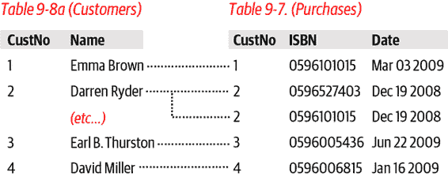
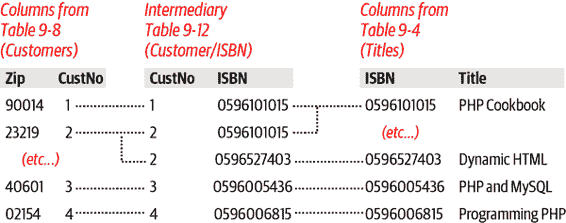
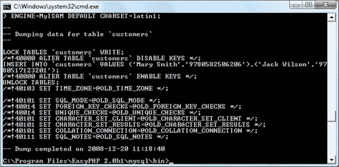

# 第九章：精通 MySQL

第八章为您提供了使用结构化查询语言的关系数据库实践的良好基础。您已经了解了如何创建数据库及其包含的表，以及插入、查找、更改和删除数据。

掌握了这些知识后，我们现在需要看看如何设计数据库以实现最大速度和效率。例如，您如何决定将哪些数据放在哪个表中？多年来，已经制定了许多指导原则，如果您遵循这些原则，可以确保您的数据库高效，并且能够随着数据的增加而增长。

# 数据库设计

在开始创建数据库之前，正确设计数据库非常重要；否则，您几乎肯定需要返回并更改它，分割一些表，合并其他表，并移动各种列，以建立 MySQL 可以轻松使用的合理关系。

坐下来，拿起一张纸和一支铅笔，写下您认为您和您的用户可能会问的一些查询是一个很好的起点。对于在线书店的数据库，您的一些问题可能是：

+   数据库中有多少作者、书籍和客户？

+   哪位作者写了某本书？

+   哪些书是某个作者写的？

+   哪本书是最贵的？

+   哪本书是畅销书？

+   哪些书今年没有销售？

+   特定客户购买了哪些书籍？

+   哪些书与其他书同时购买？

当然，在这样的数据库上，您可以提出许多其他查询，但即使这样一个小样本也将开始为您提供如何布置表的见解。例如，书籍和 ISBN 可能可以合并到一个表中，因为它们密切相关（稍后我们将讨论一些微妙之处）。相反，书籍和客户应该在不同的表中，因为它们之间的连接非常松散。一个客户可以购买任何一本书，甚至是多本书，而一本书可以被许多客户购买，也可能被更多潜在客户忽略。

当您计划对某些内容进行大量搜索时，一个搜索通常可以从拥有自己的表中受益。当事物之间的耦合松散时，最好将它们放在单独的表中。

考虑到这些简单的经验法则，我们可以猜测我们至少需要三个表来容纳所有这些查询：

<dfn class="keep-together">作者</dfn>

将有很多搜索关于作者的信息，其中许多作者合作撰写了书籍，并且许多作者将出现在合集中。将每位作者的所有信息一起列出，并与该作者关联，将为搜索产生最佳结果，因此有一个 *作者* 表。

<dfn class="keep-together">书籍</dfn>

许多书籍有不同的版本。有时它们会更改出版商，有时它们与其他无关的书籍有相同的标题。因此，书籍和作者之间的链接足够复杂，需要一个单独的表格来处理。

<dfn class="keep-together">顾客</dfn>

明确起见，顾客应该有自己的表格，因为他们可以自由购买任何作者的任何书籍。

## 主键：关系数据库的关键

利用关系数据库的强大功能，我们可以在一个地方定义每位作者、每本书和每位顾客的信息。显然，我们感兴趣的是它们之间的链接——比如谁写了每本书以及谁购买了它——但我们可以通过仅在三个表格之间建立链接来存储这些信息。我将向你展示基本原则，然后你只需实践，它会变得自然而然。

这个神奇的方法是给每个作者一个唯一的标识符。我们将为每本书和每位顾客做同样的事情。我们在前一章中已经看到了这样做的方法：*主键*。对于书籍来说，使用 ISBN 是有意义的，尽管然后你必须处理具有不同 ISBN 的多个版本。对于作者和顾客，你可以简单地分配任意的键值，上一章中提到的`AUTO_INCREMENT`功能使这一过程变得容易。

简而言之，每个表格将围绕着你可能经常搜索的某个对象设计——在本例中是作者、书籍或顾客——并且该对象将有一个主键。不要选择可能对不同对象具有相同值的键。ISBN 是一个少见的情况，产业已经提供了一个可以依赖的主键，对于每个产品都是唯一的。大多数情况下，为此目的创建一个任意的键，使用`AUTO_INCREMENT`。

# 规范化

将数据分成表格并创建主键的过程称为*规范化*。它的主要目标是确保每个信息片段只出现在数据库中一次。数据重复是低效的，因为它使数据库变得比必要的更大，从而减慢访问速度。更重要的是，重复数据的存在会增加你只更新重复数据的一行的风险，从而在数据库中创建不一致性，可能引发严重的错误。

例如，如果你在*作者*表格和*书籍*表格中列出书籍的标题，并且你需要纠正标题中的印刷错误，你必须搜索这两个表格，并确保在书名出现的每个地方都做出相同的更改。最好将书名保留在一个地方，并在其他地方使用 ISBN。

但是在将数据库拆分成多个表格的过程中，重要的是不要走得太远，创建比必要更多的表格，这也会导致设计效率低下和访问速度变慢。

幸运的是，关系模型的发明者 E·F·科德分析了规范化的概念，并将其分为三个称为*第一*、*第二*和*第三范式*的独立模式。如果按顺序修改数据库以满足这些范式中的每一个，您将确保您的数据库在快速访问和最小内存和磁盘空间使用方面达到最佳平衡。

要了解规范化过程是如何工作的，请从表 9-1 中的相当庞大的数据库开始，该表格显示了一个包含所有作者姓名、书名和（虚构的）客户详细信息的表格。您可以考虑它是一个旨在跟踪哪些客户订购了书籍的第一个尝试。显然，这是一种低效的设计，因为数据到处重复（重复部分已经高亮显示），但这代表了一个起点。

表 9-1\. 数据库表的高度低效设计

| 作者 1 | 作者 2 | 标题 | ISBN | 价格 | 客户姓名 | 客户地址 | 购买日期 |
| --- | --- | --- | --- | --- | --- | --- |
| *大卫·斯克拉* | *亚当·特拉彻伯格* | *PHP Cookbook* | *0596101015* | *44.99* | 艾玛·布朗 | 加利福尼亚州洛杉矶市彩虹路 1565 号 | 2009 年 3 月 3 日 |
| 丹尼·古德曼 |   | 动态 HTML | 0596527403 | 59.99 | **达伦·赖德** | **弗吉尼亚州里士满市艾米丽大道 4758 号** | **2008 年 12 月 19 日** |
| 休·威廉姆斯 | 大卫·莱恩 | PHP 和 MySQL | 0596005436 | 44.95 | 厄尔·B·瑟斯顿 | 肯塔基州法兰克福市格雷戈里大道 862 号 | 2009 年 6 月 22 日 |
| *大卫·斯克拉* | *亚当·特拉彻伯格* | *PHP Cookbook* | *0596101015* | *44.99* | **达伦·赖德** | **弗吉尼亚州里士满市艾米丽大道 4758 号** | **2008 年 12 月 19 日** |
| 拉斯穆斯·勒多夫 | 凯文·塔特罗 & 彼得·麦金泰尔 | 编程 PHP | 0596006815 | 39.99 | 大卫·米勒 | 马萨诸塞州沃尔瑟姆市思达克莲街 3647 号 | 2009 年 1 月 16 日 |

在接下来的三个部分中，我们将检查这个数据库设计，您将看到我们如何通过消除各种重复条目并将单个表格拆分为包含一种类型数据的多个表格来改进它。

## 第一范式

要使数据库符合*第一范式*，它必须满足三个要求：

+   不应存在包含相同类型数据的重复列。

+   所有列应包含单一值。

+   每行应该有一个主键，以唯一标识每一行。

顺序查看这些要求时，您应立即注意到*作者 1*和*作者 2*列均属于重复数据类型。因此，我们已经有了一个目标列，可以将其拉入单独的表格，因为重复的*作者*列违反了规则 1。

其次，最终书籍《*编程 PHP*》列出了三位作者。我通过让**凯文·塔特罗**和**彼得·麦金泰尔**共享*作者 2*列来处理这一点，这违反了规则 2——这也是将*作者*详细信息转移到单独表格的另一个原因。

然而，规则 3 已得到满足，因为 ISBN 的主键已经创建。

表 9-2 显示从表 9-1 中去除*作者*列的结果。尽管仍然有突出显示的重复项，但看起来清爽多了。

表 9-2\. 从表 9-1 中去除*作者*列的结果

| 标题 | ISBN | 价格 | 客户姓名 | 客户地址 | 购买日期 |
| --- | --- | --- | --- | --- | --- |
| *PHP Cookbook* | *0596101015* | *44.99* | 艾玛·布朗 | 加利福尼亚州洛杉矶市彩虹路 1565 号 | 2009 年 3 月 3 日 |
| 动态 HTML | 0596527403 | 59.99 | **达伦·赖德** | **弗吉尼亚州里士满市艾米丽大道 4758 号** | **2008 年 12 月 19 日** |
| PHP 与 MySQL | 0596005436 | 44.95 | 厄尔·B·瑟斯顿 | 肯塔基州法兰克福市格雷戈里巷 862 号 | 2009 年 6 月 22 日 |
| *PHP Cookbook* | *0596101015* | *44.99* | **达伦·赖德** | **弗吉尼亚州里士满市艾米丽大道 4758 号** | **2008 年 12 月 19 日** |
| 编程 PHP | 0596006815 | 39.99 | 大卫·米勒 | 马萨诸塞州沃尔瑟姆市雪松巷 3647 号 | 2009 年 1 月 16 日 |

显示在表 9-3 中的新*作者*表规模小而简单。它只列出标题的 ISBN 及其作者。如果一本书有多位作者，其他作者将有他们自己的行。起初，你可能对这个表感到不适，因为你无法知道哪位作者写了哪本书。但别担心：MySQL 可以快速告诉你。你要做的就是告诉它你想获取信息的书籍，MySQL 将使用其 ISBN 在*作者*表中进行搜索，仅需几毫秒。

表 9-3\. 新的作者表

| ISBN | 作者 |
| --- | --- |
| 0596101015 | 大卫·斯克拉 |
| 0596101015 | 亚当·特拉切伯格 |
| 0596527403 | 丹尼·古德曼 |
| 0596005436 | 休·E·威廉姆斯 |
| 0596005436 | 大卫·莱恩 |
| 0596006815 | 拉斯穆斯·勒多夫 |
| 0596006815 | 凯文·塔特罗 |
| 0596006815 | 皮特·麦金泰尔 |

正如我之前提到的，当我们创建*书籍*表时，ISBN 将成为其主键。我在这里提到这一点是为了强调 ISBN 不是*作者*表的主键。在现实世界中，*作者*表也应该有一个主键，以便每位作者都有一个唯一的标识符。

所以，在*作者*表中，*ISBN*只是一列，用于加快搜索速度，我们可能会将其作为一个键，但不是主键。实际上，在这个表中它不能成为主键，因为它不是唯一的：同一个 ISBN 在两个或更多作者合作撰写的书籍中会出现多次。

因为我们将用它来链接另一张表中的作者与书籍，所以这列被称为*外键*。

###### 注意

键（也称为*索引*）在 MySQL 中有几个目的。定义键的根本原因是加快搜索速度。在第八章中的示例中，您已经看到键在`WHERE`子句中用于搜索。但键还可以用于唯一标识一个项。因此，唯一键通常用作一张表的主键，并用作外键以将该表中的行链接到另一张表中的行。

## 第二范式

第一范式处理多列之间的重复数据（或冗余）。*第二范式*则涉及多行之间的冗余。要实现第二范式，你的表必须已经处于第一范式。完成这一步后，通过识别数据在不同位置重复的列，然后将其移至自己的表中，即可实现第二范式。

因此，让我们再次看看表 9-2。请注意，达伦·赖德购买了两本书，因此他的详细信息重复了。这告诉我们需要将*客户*列单独提取到自己的表中。表 9-4 显示了从表 9-2 中移除*客户*列的结果。

表 9-4\. 新的标题表

| ISBN | 标题 | 价格 |
| --- | --- | --- |
| 0596101015 | PHP Cookbook | 44.99 |
| 0596527403 | Dynamic HTML | 59.99 |
| 0596005436 | PHP and MySQL | 44.95 |
| 0596006815 | Programming PHP | 39.99 |

正如您所见，在表 9-4 中，现在仅剩下四本唯一书籍的*ISBN*、*标题*和*价格*列，因此这现在构成了一个高效且自包含的表，满足了第一和第二范式的要求。在此过程中，我们设法将信息减少到与书名密切相关的数据。此表还可以包括出版年份、页数、再版次数等详细信息，因为这些详细信息也与书名密切相关。唯一的规则是不能在任何列中放入可能对于单本书有多个值的列，因为那样我们就必须在多行中列出同一本书，从而违反第二范式。例如，恢复*作者*列将违反这种规范化。

然而，看到提取的*客户*列，现在在表 9-5，我们可以看到仍然有更多的规范化工作要做，因为达伦·赖德的详细信息仍然重复。同时，也可以认为第一范式规则 2（所有列应包含单个值）尚未得到正确遵守，因为地址确实需要拆分为*地址*、*城市*、*州*和*邮政编码*的单独列。

表 9-5\. 来自表 9-2 的客户详细信息

| ISBN | 客户名称 | 客户地址 | 购买日期 |
| --- | --- | --- | --- |
| 0596101015 | Emma Brown | 1565 Rainbow Road, Los Angeles, CA 90014 | Mar 03 2009 |
| 0596527403 | Darren Ryder | 4758 Emily Drive, Richmond, VA 23219 | Dec 19 2008 |
| 0596005436 | Earl B. Thurston | 862 Gregory Lane, Frankfort, KY 40601 | Jun 22 2009 |
| 0596101015 | Darren Ryder | 4758 Emily Drive, Richmond, VA 23219 | Dec 19 2008 |
| 0596006815 | David Miller | 3647 Cedar Lane, Waltham, MA 02154 | Jan 16 2009 |

我们必须进一步分割此表，以确保每个客户的详细信息仅输入一次。因为 ISBN 不能用作标识客户（或作者）的主键，所以必须创建一个新的键。

表 9-6 是将*Customers*表规范化为第一和第二范式的结果。现在每个客户都有一个名为*CustNo*的唯一客户号，它是表的主键，很可能是通过`AUTO_INCREMENT`创建的。客户地址的所有部分也已分开为不同的列，以便于搜索和更新。

表 9-6\. 新客户表

| 客户号 | 姓名 | 地址 | 城市 | 州 | 邮编 |
| --- | --- | --- | --- | --- | --- |
| 1 | Emma Brown | 1565 Rainbow Road | 洛杉矶 | 加利福尼亚 | 90014 |
| 2 | Darren Ryder | 4758 Emily Drive | Richmond | VA | 23219 |
| 3 | Earl B. Thurston | 862 Gregory Lane | Frankfort | KY | 40601 |
| 4 | David Miller | 3647 Cedar Lane | Waltham | MA | 02154 |

同时，为了规范化表 9-6，我们不得不删除有关客户购买的信息，否则每本书购买都会有客户详细信息的多个实例。相反，购买数据现在放在一个称为*Purchases*的新表中（参见表 9-7）。

表 9-7\. 新购买表

| 客户号 | ISBN | 日期 |
| --- | --- | --- |
| 1 | 0596101015 | Mar 03 2009 |
| 2 | 0596527403 | Dec 19 2008 |
| 2 | 0596101015 | Dec 19 2008 |
| 3 | 0596005436 | Jun 22 2009 |
| 4 | 0596006815 | Jan 16 2009 |

在这里，来自表 9-6 的*CustNo*列被重用为将*Customers*和*Purchases*表联系在一起的键。因为*ISBN*列也在这里重复，所以这个表也可以与*Authors*和*Titles*表关联。

*CustNo* 列在*Purchases*表中可能是一个有用的键，但不是主键。一个客户可以购买多本书（甚至同一本书的多本副本），因此*CustNo*列不是主键。事实上，*Purchases*表没有主键。这没关系，因为我们不希望跟踪唯一的购买。如果一个客户在同一天购买了两本相同的书，我们会允许两行具有相同的信息。为了方便搜索，我们可以将*CustNo*和*ISBN*都定义为键，但不是主键。

###### 注意

现在有四个表，比我们最初预计需要的三个多了一个。我们通过规范化过程做出了这个决定，方法是遵循第一和第二范式规则，这明确了还需要一个名为 *Purchases* 的第四个表。

现在我们有的表是 *Authors*（表 9-3）、*Titles*（表 9-4）、*Customers*（表 9-6）和 *Purchases*（表 9-7），我们可以使用 *CustNo* 或 *ISBN* 键将每个表与任何其他表链接起来。

例如，要查看 Darren Ryder 购买了哪些书，你可以在表 9-6，即 *Customers* 表中查找他；在这里你会看到他的 *CustNo* 是 2。拿着这个编号，你现在可以去表 9-7，即 *Purchases* 表；查看这里的 *ISBN* 列，你会看到他在 2008 年 12 月 19 日购买了书籍 0596527403 和 0596101015。对于人类来说，这看起来是一件很麻烦的事情，但对 MySQL 来说却并不难。

要确定这些标题是什么，你可以参考表 9-4，即 *Titles* 表，并看到他购买的书是 *Dynamic HTML* 和 *PHP Cookbook*。如果你想知道这些书的作者，你也可以使用刚刚在表 9-3 查找的 ISBN，即 *Authors* 表，你会发现 ISBN 0596527403 的 *Dynamic HTML* 是由 Danny Goodman 写的，而 ISBN 0596101015 的 *PHP Cookbook* 是由 David Sklar 和 Adam Trachtenberg 写的。

## 第三范式

一旦你有一个符合第一和第二范式的数据库，它就已经非常完善了，你可能不需要进一步修改它。然而，如果你希望对数据库非常严格，你可以确保它符合*第三范式*，这要求那些不直接依赖于主键但依赖于表中另一个值的数据也被移到单独的表中，根据依赖关系。

例如，在表 9-6 中，*Customers* 表中可以认为 *State*、*City* 和 *Zip* 键与每个客户并非直接相关，因为许多其他人的地址中也会有相同的细节。然而，它们在彼此之间是直接相关的，因为 *Address* 依赖于 *City*，而 *City* 又依赖于 *State*。

因此，为了满足表 9-6 的第三范式，你需要将它分解成表 9-8 至表 9-11。

表 9-8\. 第三范式 Customers 表

| CustNo | Name | Address | Zip |
| --- | --- | --- | --- |
| 1 | Emma Brown | 1565 Rainbow Road | 90014 |
| 2 | Darren Ryder | 4758 Emily Drive | 23219 |
| 3 | Earl B. Thurston | 862 Gregory Lane | 40601 |
| 4 | David Miller | 3647 Cedar Lane | 02154 |

表 9-9\. 第三范式邮政编码表

| 邮政编码 | 城市 ID |
| --- | --- |
| 90014 | 1234 |
| 23219 | 5678 |
| 40601 | 4321 |
| 02154 | 8765 |

表 9-10\. 第三范式城市表

| 城市 ID | 名称 | 州 ID |
| --- | --- | --- |
| 1234 | 洛杉矶 | 5 |
| 5678 | 里士满 | 46 |
| 4321 | 法兰克福 | 17 |
| 8765 | 沃尔瑟姆 | 21 |

表 9-11\. 第三范式州表

| 州 ID | 名称 | 缩写 |
| --- | --- | --- |
| 5 | 加利福尼亚州 | CA |
| 46 | 弗吉尼亚州 | VA |
| 17 | 肯塔基州 | KY |
| 21 | 马萨诸塞州 | MA |

那么，您将如何使用这四个表的集合，而不是单个的表 9-6？好吧，您将在表 9-8 中查找*Zip* *code*，然后在表 9-9 中找到匹配的*CityID*。有了这些信息，您可以在表 9-10 中查找城市*名称*，然后再找到*StateID*，您可以在表 9-11 中使用它来查找州的*名称*。

虽然以这种方式使用第三范式可能看起来有些多余，但它确实有其优势。例如，请参阅表 9-11，在这里可以同时包括一个州的名称及其两字母缩写。如果您希望，它还可以包含人口详细信息和其他人口统计数据。

###### 注意

表 9-10 还可以包含更多对您和/或您的客户有用的本地化人口统计信息。通过拆分这些数据片段，您可以更轻松地在未来维护您的数据库，如果有必要添加列的话。

决定是否使用第三范式可能会有些棘手。您的评估应基于以后可能需要添加的数据。如果您绝对确定客户的姓名和地址是您所需要的全部信息，那么您可能希望跳过最后这个规范化阶段。

另一方面，假设您正在为美国邮政服务等大型组织编写数据库。如果一个城市改名了，您会怎么做？如果像表 9-6 这样的表，您将需要在每个该城市的实例上进行全局搜索和替换。但是如果您根据第三范式设置了数据库，您只需要在表 9-10 中更改一个条目，即可反映在整个数据库中。

因此，我建议您问自己两个问题，以帮助您决定是否对任何表执行第三范式规范化：

+   是否可能需要向这个表中添加许多新列？

+   这个表的任何字段在任何时候是否需要全局更新？

如果两个答案中有任何一个是肯定的，那么您可能应该考虑执行这个最后的规范化阶段。

## 不使用规范化的时机

现在你已经了解了规范化的所有内容，我要告诉你为什么在高流量站点上应该把这些规则丢掉。没错——在会导致 MySQL 抖动的站点上，你永远不应该完全规范化你的表。

规范化要求在多个表之间分布数据，这意味着每个查询需要对 MySQL 进行多次调用。在一个非常流行的站点上，如果你有规范化的表，一旦并发用户超过几十个，你的数据库访问速度将显著减慢，因为它们将在它们之间创建数百次数据库访问。事实上，我甚至会说，在你能够看到 MySQL 阻塞之前，你应该*反规范化*任何常常查找的数据。

如果你的表中存在重复的数据，你可以显著减少需要进行的额外请求的数量，因为大多数你想要的数据在每个表中都是可用的。这意味着你只需在查询中添加一个额外的列，该字段将对所有匹配结果可用。

当然，你必须处理之前提到的缺点，比如消耗大量的磁盘空间，并确保在需要修改数据时更新每一个副本。

多次更新可以自动化。MySQL 提供了一个名为*触发器*的功能，可以在你做出更改时自动修改数据库。（触发器超出了本书的范围。）另一种传播冗余数据的方法是设置一个定期运行的 PHP 程序来保持所有副本同步。该程序从“主”表中读取更改并更新所有其他表。（你将在下一章学习如何从 PHP 访问 MySQL。）

然而，在你对 MySQL 非常熟悉之前，我建议你完全规范化所有表（至少达到第一和第二范式），因为这将养成良好的习惯并使你处于良好的状态。只有当你真正开始看到 MySQL 日志阻塞时，你才应该考虑反规范化。

# 关系

MySQL 被称为*关系型*数据库管理系统，因为它的表不仅存储数据，还存储数据之间的*关系*。有三类关系。

## 一对一

一个*一对一关系*就像（传统的）婚姻：每个项目只与另一种类型的项目有关系。这种情况非常罕见。例如，一个作者可以写多本书，一本书可以有多个作者，甚至一个地址可以与多个客户关联。也许在本章中迄今为止最好的一个一对一关系的例子是一个州的名称与其两个字符缩写之间的关系。

但是，为了论证，让我们假设在任何地址只能始终存在一个客户。在这种情况下，图 9-1 中的 Customers–Addresses 关系是一对一关系：每个地址只有一个客户居住，并且每个地址只能有一个客户。


###### 图 9-1\. 客户表，表 9-8，分成两个表

通常，当两个项目具有一对一关系时，您只需将它们作为同一表中的列包括。将它们拆分为单独的表的两个原因是：

+   您希望做好准备，以防关系以后发生变化，并且不再是一对一。

+   表格有很多列，你认为通过拆分可以提高性能或维护。

当然，当您在现实世界中构建自己的数据库时，您将不得不创建一对多的客户-地址关系（*一个* 地址，*多个* 客户）。

## 一对多

*一对多*（或多对一）关系发生在一个表中的一行与另一个表中的多行相关联时。如果允许在同一地址有多个客户，如前所述，表 9-8 将形成一对多关系，这就是为什么在这种情况下必须拆分它。

因此，在 图 9-1 内查看表 9-8a 时，您可以看到它与 表 9-7 具有一对多关系，因为表 9-8a 中每个客户只有一个。然而 表 9-7，*Purchases* 表，可以（也确实）包含来自同一客户的多次购买。因此，*一个* 客户与 *多个* 购买之间存在关系。

您可以在 图 9-2 中并排查看这两个表，其中连接每个表中行的虚线从左侧表的单行开始，但可以连接到右侧表的多行。这种一对多关系也是描述多对一关系的首选方案，此时通常会交换左右表以将它们视为一对多关系。



###### 图 9-2\. 说明两个表之间的关系

要在关系数据库中表示一对多关系，请为“多”创建一个表和“一”创建一个表。 “多”表必须包含一个列，该列列出“一”表的主键。因此，*Purchases* 表将包含一个列，列出客户的主键。

## 多对多

在 *多对多关系* 中，一个表中的多行与另一个表中的多行关联。要创建此关系，请添加一个包含其他每个表中相同关键列的第三个表。该第三个表除了连接其他表之外什么也不包含，因为它的唯一目的就是连接其他表。

Table 9-12 就是这样一张表。它是从 Table 9-7，即 *Purchases* 表中提取的，但省略了购买日期信息。它包含每个售出书籍的 ISBN 及其购买者的客户号的副本。

Table 9-12\. 一个中介表

| CustNo | ISBN |
| --- | --- |
| 1 | 0596101015 |
| 2 | 0596527403 |
| 2 | 0596101015 |
| 3 | 0596005436 |
| 4 | 0596006815 |

有了这个中介表，您可以通过一系列的关联遍历数据库中的所有信息。您可以以地址作为起点，查找住在该地址的客户购买的任何书籍的作者。

例如，假设您想了解邮政编码为 23219 的购买情况。在表 9-8b 中查找该邮政编码，您会发现客户号为 2 的客户至少购买了一件数据库中的物品。此时，您可以使用表 9-8a 查找该客户的姓名，或使用新的中介 Table 9-12 查看购买的书籍。

从这里，您将发现购买了两个标题，并可以跟踪它们回到 Table 9-4 查找这些书籍的标题和价格，或者到 Table 9-3 查看这些书籍的作者。

如果您觉得这实际上是将多个一对多关系结合在一起，那么您是完全正确的。为了说明这一点，Figure 9-3 将三个表结合在一起。



###### 图 9-3\. 通过第三张表创建多对多关系

跟随左侧表中的任何邮政编码到相关的客户 ID。从那里，您可以链接到中间表，该表通过链接客户 ID 和 ISBN 连接左侧和右侧表。现在您只需跟随一个 ISBN 到右侧表，即可查看它与哪本书相关联。

您还可以使用中介表从书名反向查找到邮政编码。*Titles* 表可以告诉您 ISBN，然后您可以在中间表中使用这个 ISBN 找到购买该书的客户的 ID 号码，最后您可以使用 *Customers* 表将客户 ID 号码与客户的邮政编码匹配。

## 数据库与匿名性

使用关系的一个有趣方面是，你可以累积关于某个项（如客户）的大量信息，而不需要实际了解该客户是谁。请注意，在前面的示例中，我们从客户的邮政编码到客户的购买记录，再返回，而无需了解客户的姓名。数据库可以用于跟踪人员，但也可以帮助保护人们的隐私，同时返回关于购买的信息，而不泄露其他客户详细信息，例如。

# 事务

在一些应用程序中，确保一系列查询按正确顺序运行，并且每个查询都成功完成非常重要。例如，假设你正在创建一系列用于从一个银行账户转账到另一个账户的查询。你不希望发生以下事件之一：

+   你将资金添加到第二个账户，但当你尝试从第一个账户扣除时，更新失败，现在两个账户都有资金。

+   你从第一个银行账户中扣除资金，但是添加到第二个账户的更新请求失败了，资金就这样消失了。

如你所见，在这种类型的事务中，查询的顺序非常重要，而且事务的每个部分都必须成功完成。但是，如何确保这种情况发生呢？因为一旦发生了查询，它就无法撤销了？你是否需要跟踪事务的所有部分，然后逐个撤销它们？答案绝对是否定的，因为 MySQL 提供了强大的事务处理功能，正好可以处理这些情况。

另外，事务允许多个用户或程序同时访问数据库。MySQL 通过确保所有事务排队执行，并确保用户或程序依次执行，而不会互相干扰，无缝处理这一过程。

## 事务存储引擎

要使用 MySQL 的事务功能，你必须使用 MySQL 的 InnoDB 存储引擎（从版本 5.5 开始默认使用）。如果不确定你的代码将在哪个版本的 MySQL 上运行，而不是假设 InnoDB 是默认引擎，你可以在创建表时强制使用它，如下所示。

通过在示例 9-1 中输入命令来创建一个银行账户表。（记住，为此你需要访问 MySQL 命令行，并且必须已经选择了一个适合创建此表的数据库。）

##### 示例 9-1\. 创建一个事务准备的表

```php
CREATE TABLE accounts (
 number INT, balance FLOAT, PRIMARY KEY(number)
 ) ENGINE InnoDB;
DESCRIBE accounts;
```

此示例的最后一行显示了新表的内容，以确保它已正确创建。输出应如下所示：

```php
+---------+---------+------+-----+---------+-------+
| Field   | Type    | Null | Key | Default | Extra |
+---------+---------+------+-----+---------+-------+
| number  | int(11) | NO   | PRI | NULL    |       |
| balance | float   | YES  |     | NULL    |       |
+---------+---------+------+-----+---------+-------+
2 rows in set (0.00 sec)
```

现在让我们在表内创建两行，以便你可以练习使用事务。在示例 9-2 中输入这些命令。

##### 示例 9-2\. 填充 accounts 表

```php
INSERT INTO accounts(number, balance) VALUES(12345, 1025.50);
INSERT INTO accounts(number, balance) VALUES(67890, 140.00);
SELECT * FROM accounts;
```

第三行显示表格内容以确认行已正确插入。输出应如下所示：

```php
+--------+---------+
| number | balance |
+--------+---------+
|  12345 |  1025.5 |
|  67890 |     140 |
+--------+---------+
2 rows in set (0.00 sec)
```

创建并预填充了这个表后，你可以开始使用事务了。

## 使用 BEGIN

MySQL 的事务以 `BEGIN` 或 `START TRANSACTION` 语句开始。键入 示例 9-3 中的命令将事务发送给 MySQL。

##### 示例 9-3\. MySQL 事务

```php
BEGIN;
UPDATE accounts SET balance=balance+25.11 WHERE number=12345;
COMMIT;
SELECT * FROM accounts;
```

这个事务的结果由最后一行显示，应如下所示：

```php
+--------+---------+
| number | balance |
+--------+---------+
|  12345 | 1050.61 |
|  67890 |     140 |
+--------+---------+
2 rows in set (0.00 sec)
```

正如你所见，账号 12345 的余额增加了 25.11，现在是 1050.61。你也许注意到了 示例 9-3 中的 `COMMIT` 命令，接下来将对其进行解释。

## 使用 COMMIT

当你确认事务中的一系列查询已成功完成时，使用 `COMMIT` 命令将所有更改提交到数据库。在接收到 `COMMIT` 命令之前，MySQL 认为你所做的所有更改只是临时的。这个功能让你有机会通过不发送 `COMMIT` 而是发出 `ROLLBACK` 命令来取消事务。

## 使用 ROLLBACK

使用 `ROLLBACK` 命令，你可以告诉 MySQL 忘记从事务开始以来的所有查询，并取消事务。通过在 示例 9-4 中输入资金转移事务来看看它的运行效果。

##### 示例 9-4\. 资金转移事务

```php
BEGIN;
UPDATE accounts SET balance=balance-250 WHERE number=12345;
UPDATE accounts SET balance=balance+250 WHERE number=67890;
SELECT * FROM accounts;
```

输入完这些行后，你应该看到以下结果：

```php
+--------+---------+
| number | balance |
+--------+---------+
|  12345 |  800.61 |
|  67890 |     390 |
+--------+---------+
2 rows in set (0.00 sec)
```

第一个银行账户的值比之前少了 250，第二个账户增加了 250；你已经在它们之间转移了 250 的价值。但假设出现了问题，你希望撤销这笔交易。你只需按照 示例 9-5 中的命令执行即可。

##### 示例 9-5\. 使用 `ROLLBACK` 取消事务

```php
ROLLBACK;
SELECT * FROM accounts;
```

现在你应该看到以下输出，显示两个账户的先前余额已经恢复，因为整个事务已通过 `ROLLBACK` 命令被取消：

```php
+--------+---------+
| number | balance |
+--------+---------+
|  12345 | 1050.61 |
|  67890 |     140 |
+--------+---------+
2 rows in set (0.00 sec)
```

# 使用 EXPLAIN

MySQL 提供了一个强大的工具来调查你向其发出的查询的解释方式。使用 `EXPLAIN`，你可以获取任何查询的快照，以查明是否可以以更好或更有效的方式发出它。示例 9-6 展示了如何与你之前创建的 *accounts* 表一起使用它。

##### 示例 9-6\. 使用 `EXPLAIN` 命令

```php
EXPLAIN SELECT * FROM accounts WHERE number='12345';
```

这个 `EXPLAIN` 命令的结果应该如下所示：

```php
+--+------+--------+------+-----+--------+-------+----+-----+----+------+-----+
|id|select|table   |part- |type |possible|key    |key |ref  |rows|fil-  |Extra|
|  |_type |        |itions|     |_keys   |       |_len|     |    |tered |     |
+--+------+--------+------+-----+--------+-------+----+-----+----+------+-----+
|1 |SIMPLE|accounts|NULL  |const|PRIMARY |PRIMARY|4   |const|1   |100.00|NULL |
+--+------+--------+------+-----+--------+-------+----+-----+----+------+-----+
1 row in set (0.00 sec)
```

MySQL 在此给出的信息如下：

<dfn class="keep-together">`select_type`</dfn>

选择类型是 `SIMPLE`。如果你正在将表连接在一起，这将显示连接类型。

<dfn class="keep-together">`table`</dfn>

当前正在查询的表是 `accounts`。

<dfn class="keep-together">`type`</dfn>

查询类型为`const`。从效率最低到最高的类型，可能的值可以是`ALL`、`index`、`range`、`ref`、`eq`*_*`ref`、`const`、`system`和`NULL`。

<dfn class="keep-together">`possible_keys`</dfn>

存在一个`PRIMARY`键，这意味着访问应该很快。

<dfn class="keep-together">`key`</dfn>

实际使用的键是`PRIMARY`。这很好。

<dfn class="keep-together">`key_len`</dfn>

键长度为`4`。这是 MySQL 将使用的索引字节数。

<dfn class="keep-together">`ref`</dfn>

`ref`列显示与键一起使用的列或常量。在这种情况下，正在使用一个常量键。

<dfn class="keep-together">`rows`</dfn>

此查询需要搜索的行数为`1`。这很好。

每当你有一个查询似乎执行时间比你预期的长时，请尝试使用`EXPLAIN`来查看可以优化的地方。你将会发现哪些键（如果有的话）正在使用，它们的长度等信息，从而可以相应地调整你的查询或表的设计。

###### 注意

当您完成临时*accounts*表的实验后，可能希望通过输入以下命令将其删除：

```php
DROP TABLE accounts;
```

# 备份与恢复

无论您在数据库中存储哪种类型的数据，它对您都必须有一定的价值，即使只是重新输入它所需的时间成本，如果硬盘发生故障。因此，重要的是您保持备份以保护您的投资。此外，有时您必须将数据库迁移到新服务器；通常最好的方法是先备份它。还重要的是，您定期测试备份以确保它们有效，并且在需要时能够使用。

幸运的是，使用`mysqldump`命令轻松备份和恢复 MySQL 数据。

## 使用 mysqldump

使用`mysqldump`，您可以将一个或多个数据库转储到一个或多个文件中，这些文件包含重新创建所有表并填充其数据所需的所有指令。此命令还可以生成*CSV*（逗号分隔值）和其他分隔文本格式的文件，甚至是 XML 格式的文件。其主要缺点是在备份时必须确保没有人在写入表。有各种方法可以做到这一点，但最简单的方法是在运行`mysqldump`之前关闭 MySQL 服务器，然后在`mysqldump`完成后重新启动服务器。

或者，在运行`mysqldump`之前，您可以锁定要备份的表。要锁定表以便读取数据（因为我们想要读取数据），请从 MySQL 命令行执行以下命令：

```php
LOCK TABLES *`tablename1`* READ, *`tablename2`* READ ...
```

然后，要释放锁，请输入以下命令：

```php
UNLOCK TABLES;
```

默认情况下，`mysqldump`的输出只是简单地打印出来，但您可以通过`>`重定向符号将其捕获到文件中。

`mysqldump`命令的基本格式如下所示：

```php
mysqldump -u *user* -p*password database*
```

但在转储数据库内容之前，必须确保 `mysqldump` 在你的路径中，否则需在命令中指定其位置。表 9-13 显示了在不同安装和操作系统中可能的程序位置，这些已在第二章中涵盖。如果使用不同的安装程序，则其位置可能略有不同。

表 9-13\. 不同安装的 `mysqldump` 的可能位置

| 操作系统和程序 | 可能的文件夹位置 |
| --- | --- |
| Windows AMPPS | *C:\Program Files\Ampps\mysql\bin* |
| macOS AMPPS | */Applications/ampps/mysql/bin* |
| Linux AMPPS | */Applications/ampps/mysql/bin* |

因此，要将你在第八章中创建的*publications*数据库的内容转储到屏幕上，首先退出 MySQL，然后输入示例 9-7 中的命令（必要时指定`mysqldump`的完整路径）。

##### 示例 9-7\. 将 publications 数据库转储到屏幕上

```php
mysqldump -u *user* -p*password* publications
```

确保用你的 MySQL 安装的正确详细信息替换 *`user`* 和 *`password`*。如果用户没有设置密码，可以省略命令的这部分，但 `-u` *`user`* 部分是必需的，除非你以 root 身份执行而无需密码并且正在以 root 身份执行（不推荐）。执行此命令的结果将类似于 图 9-4。



###### 图 9-4\. 将 publications 数据库转储到屏幕上

## 创建备份文件

现在 `mysqldump` 可以工作，并且已验证其正确输出到屏幕，你可以使用 `>` 重定向符号直接将备份数据发送到文件。假设你希望将备份文件命名为 *publications.sql*，则输入 示例 9-8 中的命令（记得替换 *`user`* 和 *`password`* 为正确的详细信息）。

###### 注意

示例 9-8 中的命令将备份文件存储到当前目录。如果需要保存到其他位置，应在文件名之前插入文件路径。还必须确保备份目录已设置正确的权限，允许写入文件，但不允许任何非特权用户访问！

##### 示例 9-8\. 将 publications 数据库转储到文件中

```php
mysqldump -u *user* –p*password* publications > publications.sql
```

###### 注意

有时在使用 Windows PowerShell 访问 MySQL 时可能会出现错误，而在标准命令提示符窗口中则看不到这些错误。

如果将备份文件 echo 到屏幕或加载到文本编辑器中，你会看到它包含如下的 SQL 命令序列：

```php
DROP TABLE IF EXISTS 'classics';
CREATE TABLE 'classics' (
  'author' varchar(128) default NULL,
  'title' varchar(128) default NULL,
  'category' varchar(16) default NULL,
  'year' smallint(6) default NULL,
  'isbn' char(13) NOT NULL default '',
  PRIMARY KEY  ('isbn'),
  KEY 'author' ('author'(20)),
  KEY 'title' ('title'(20)),
  KEY 'category' ('category'(4)),
  KEY 'year' ('year'),
  FULLTEXT KEY 'author_2' ('author','title')
) ENGINE=InnoDB DEFAULT CHARSET=latin1;
```

这是一个智能代码，可用于从备份中恢复数据库，即使当前数据库已存在；它将首先删除需要重新创建的任何表，从而避免可能出现的 MySQL 错误。

### 备份单个表

要仅从数据库备份中备份单个表（例如从*publications*数据库的*classics*表），您应首先从 MySQL 命令行内锁定该表，通过发出以下命令：

```php
LOCK TABLES publications.classics READ;
```

这确保 MySQL 继续运行以进行读取，但不能进行写入。然后，保持 MySQL 命令行打开状态，使用操作系统命令行发出以下命令：

```php
mysqldump -u *user* -p*password* publications classics > classics.sql
```

现在，您必须从 MySQL 命令行内释放表锁，通过在第一个终端窗口中输入以下命令，解锁在当前会话期间已锁定的所有表：

```php
UNLOCK TABLES;
```

### 备份所有表

如果要一次备份所有 MySQL 数据库（包括系统数据库如*mysql*），可以使用类似示例 9-9 中的命令，这样可以恢复整个 MySQL 数据库安装。记得在需要时使用锁定。

##### 示例 9-9\. 将所有 MySQL 数据库转储到文件

```php
mysqldump -u *user* -p*password* --all-databases > all_databases.sql
```

###### 注意

当然，备份的数据库文件中不仅仅是几行 SQL 代码。建议您花几分钟时间查看一些文件，以熟悉备份文件中出现的命令类型及其工作原理。

## 从备份文件恢复

要从文件执行恢复，请调用*mysql*可执行文件，并使用`<`符号指定要从中恢复的文件。因此，要恢复使用`--all-databases`选项转储的整个数据库，可以使用类似示例 9-10 中的命令。

##### 示例 9-10\. 恢复整个数据库集

```php
mysql -u *user* -p*password* < all_databases.sql
```

要恢复单个数据库，请使用`-D`选项，后跟数据库名称，如示例 9-11，其中*publications*数据库正在从示例 9-8 生成的备份中恢复。

##### 示例 9-11\. 恢复 publications 数据库

```php
mysql -u *user* -p*password* -D publications < publications.sql
```

要将单个表恢复到数据库，请使用类似示例 9-12 中的命令，这里只恢复*publications*数据库中的*classics*表。

##### 示例 9-12\. 将 classics 表恢复到 publications 数据库

```php
mysql -u *user* -p*password* -D publications < classics.sql
```

## 以 CSV 格式转储数据

如前所述，`mysqldump`程序非常灵活，支持各种输出格式，例如 CSV 格式，您可以将其用于将数据导入电子表格等其他用途。示例 9-13 展示了如何将*publications*数据库中的*classics*和*customers*表数据导出到*c:/temp*文件夹下的*classics.txt*和*customers.txt*文件中。在 macOS 或 Linux 系统上，您应修改目标路径为一个已存在的文件夹。

##### 示例 9-13\. 将数据转储到 CSV 格式文件

```php
mysqldump -u *user* -p*password* --no-create-info --tab=c:/temp
  --fields-terminated-by=',' publications
```

此命令非常长，在这里显示为两行，但您必须将其作为单行输入。结果如下：

```php
Mark Twain (Samuel Langhorne Clemens)','The Adventures of Tom Sawyer',
 'Classic Fiction','1876','9781598184891
Jane Austen','Pride and Prejudice','Classic Fiction','1811','9780582506206
Charles Darwin','The Origin of Species','Nonfiction','1856','9780517123201
Charles Dickens','The Old Curiosity Shop','Classic Fiction','1841','9780099533474
William Shakespeare','Romeo and Juliet','Play','1594','9780192814968

Mary Smith','9780582506206
Jack Wilson','9780517123201
```

## 计划您的备份

备份的黄金法则是在您认为合适的频率进行备份。数据越有价值，您就越应该频繁备份，并制作更多的副本。如果您的数据库每天至少更新一次，您应该真的每天备份一次。另一方面，如果更新频率不高，您可能可以更少地备份。

###### 注意

您应考虑制作多份备份并将它们存储在不同的位置。如果您有多台服务器，将备份在它们之间复制将变得非常简单。您还应该考虑在可移动硬盘、闪存驱动器、CD 或 DVD 等物理介质上进行备份，并将其保管在不同的地方——最好是像防火保险柜之类的地方。

定期测试数据库的还原也很重要，以确保您的备份操作正确无误。您还需要熟悉数据库的还原操作，因为在压力和匆忙情况下，例如网站遭遇停电后，可能需要进行数据库的还原操作。您可以将数据库还原到私有服务器并运行一些 SQL 命令，以确保数据符合您的预期。

一旦您消化了本章的内容，您将能够熟练使用 PHP 和 MySQL；下一章概述了最新 PHP/MySQL 版本的变化。

# 问题

1.  在关系数据库中，“关系”一词的含义是什么？

1.  删除重复数据和优化表的过程术语是什么？

1.  第一范式有哪三条规则？

1.  如何使表满足第二范式？

1.  在一个包含一对多关系项的两个表中，您会在列中放置什么以将它们联系在一起？

1.  如何创建具有多对多关系的数据库？

1.  什么命令启动和结束 MySQL 事务？

1.  MySQL 提供了哪个功能，使您能够详细查看查询的工作方式？

1.  您会使用什么命令将*publications*数据库备份到名为*publications.sql*的文件中？

参见“第九章答案”，在附录 A 中查看这些问题的答案。
