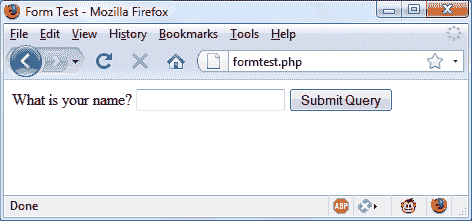
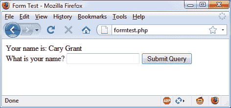
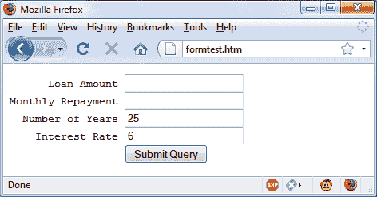
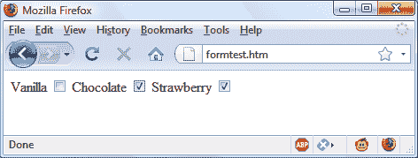
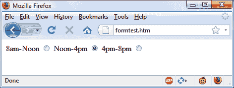
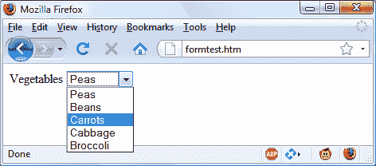
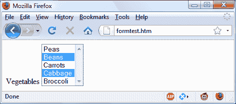
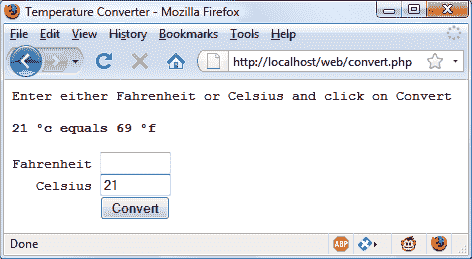

# 第十二章：表单处理

网站用户与 PHP 和 MySQL 交互的主要方式之一是通过 HTML 表单。这些在互联网的早期开发中引入，1993 年甚至在电子商务出现之前就已经存在，并且由于其简单性和易用性而成为主流，尽管格式化它们可能会是一场噩梦。

当然，多年来对 HTML 表单处理进行了增强以添加额外功能，因此本章将使您了解技术的最新进展，并展示实施具有良好可用性和安全性的表单的最佳方法。另外，正如稍后您将看到的，HTML5 规范进一步改进了表单的使用。

# 构建表单

处理表单是一个多部分的过程。首先是创建一个用户可以输入所需详细信息的表单。然后，这些数据被发送到 Web 服务器，在那里进行解释，通常伴随一些错误检查。如果 PHP 代码识别出一个或多个需要重新输入的字段，可能会重新显示表单并显示错误消息。当代码对输入的准确性感到满意时，它会执行某些操作，通常涉及数据库，如输入有关购买的详细信息。

要构建一个表单，您至少必须有以下元素之一：

+   一个开头的`<form>`和结尾的`</form>`标签

+   指定使用 GET 或 POST 方法的提交类型

+   一个或多个 `input` 字段

+   表单数据要提交的目标 URL

示例 12-1 展示了一个用 PHP 创建的非常简单的表单，您应该键入并保存为 *formtest.php*。

##### 示例 12-1\. formtest.php ——一个简单的 PHP 表单处理程序

```php
<?php // formtest.php
  echo <<<_END
 <html>
 <head>
 <title>Form Test</title>
 </head>
 <body>
 <form method="post" action="formtest.php">
 What is your name?
 <input type="text" name="name">
 <input type="submit">
 </form>
 </body>
 </html>
_END;
?>
```

关于这个示例的第一件事情是，正如您在本书中已经看到的，而不是在 PHP 代码中进出，`echo <<<_END..._END` 结构在必须输出多行 HTML 时使用。

在这个多行输出内部是一些标准代码，用于开始 HTML 文档、显示其标题，并启动文档的正文。然后是表单，设置为使用 POST 方法将其数据发送到名为 *formtest.php* 的 PHP 程序，这就是程序本身的名称。

程序的其余部分只是关闭它打开的所有项目：表单、HTML 文档的正文以及 PHP `echo <<<_END` 语句。在 Web 浏览器中打开此程序的结果如 图 12-1 所示。



###### 图 12-1\. 在 Web 浏览器中打开 formtest.php 的结果

# 检索提交的数据

示例 12-1 只是多部分表单处理过程的一部分。如果您输入一个名称并单击“提交查询”按钮，除了重新显示表单（和输入的数据丢失）之外，绝对什么都不会发生。所以现在是时候添加一些 PHP 代码来处理表单提交的数据了。

示例 12-2 扩展了前一个程序，包括数据处理。键入或修改 *formtest.php*，通过添加新行保存为 *formtest2.php*，并自行尝试该程序。运行该程序并输入名称的结果如 图 12-2 所示。

##### 示例 12-2\. formtest.php 的更新版本

```php
<?php // formtest2.php
  if (!empty(($_POST['name']))) $name = $_POST['name'];
  else $name = "(Not Entered)";

  echo <<<_END
 <html>
 <head>
 <title>Form Test</title>
 </head>
 <body>
 Your name is: $name<br>
 <form method="post" action="formtest2.php">
 What is your name?
 <input type="text" name="name">
 <input type="submit">
 </form>
 </body>
 </html>
_END;
?>
```



###### 图 12-2\. 带数据处理的 formtest.php

唯一的变化是在开始时检查 `$_POST` 关联数组的 `name` 字段并将其回显给用户的几行代码。第十一章 介绍了 `$_POST` 关联数组，它包含 HTML 表单中每个字段的元素。在 示例 12-2 中，使用的输入名称是 `name`，表单方法是 POST，因此 `$_POST` 数组的 `name` 元素包含 `$_POST['name']` 中的值。

PHP 的 `isset` 函数用于检测 `$_POST['name']` 是否已被赋值。如果没有任何内容被提交，程序会赋予值 `(Not entered)`；否则，它会存储输入的值。然后，在 `<body>` 语句后添加了一行来显示存储在 `$name` 中的值。

## 默认值

有时在 Web 表单中为您的访问者提供默认值是很方便的。例如，假设您在房地产网站上放置了一个贷款还款计算器小部件。输入默认值，比如说，15 年和 3% 的利率，使用户只需输入贷款总额或每月可支付金额即可。

在这种情况下，这两个值的 HTML 可能如 示例 12-3 所示。

##### 示例 12-3\. 设置默认值

```php
<form method="post" action="calc.php"><pre>
      Loan Amount <input type="text" name="principal">
  Number of Years <input type="text" name="years"    value="15">
    Interest Rate <input type="text" name="interest" value="3">
                  <input type="submit">
</pre></form>
```

看一下第三个和第四个输入。通过填充 `value` 属性，您可以在字段中显示默认值，用户可以在需要时更改。通过合理的默认值，您通常可以通过减少不必要的输入，使您的网络表单更加用户友好。之前代码的结果看起来像是 图 12-3。当然，这是为了说明默认值而创建的，因为程序 *calc.php* 还没有被编写，如果您提交它，表单将返回 404 错误消息。

如果您希望从您的网页向程序传递额外信息，除了用户输入的信息，也可以使用默认值来隐藏字段。我们将在本章后面讨论隐藏字段。



###### 图 12-3\. 使用所选表单字段的默认值

## 输入类型

HTML 表单非常灵活，允许您提交各种输入类型，从文本框和文本区域到复选框、单选按钮等。

### 文本框

您可能最常使用的输入类型是文本框。它接受单行框中的广泛字母数字文本和其他字符。文本框输入的一般格式如下：

```php
<input type="text" name="*`name`*" size="*`size`*" maxlength="*`length`*" value="*`value`*">
```

我们已经讨论了`name`和`value`属性，但在这里引入了两个新属性：`size`和`maxlength`。`size`属性指定框的宽度（以当前字体的字符数表示），`maxlength`指定用户允许输入的最大字符数。

唯一必需的属性是`type`，它告诉 Web 浏览器期望的输入类型，以及`name`，用于在接收提交的表单时处理字段的名称。

### 文本区域

当您需要接受超过短行文本的输入时，请使用文本区域。它类似于文本框，但因为允许多行输入，因此具有一些不同的属性。其一般格式如下：

```php
<textarea name="*`name`*" cols="*`width`*" rows="*`height`*" wrap="*`type`*">
</textarea>
```

首先要注意的是，`<textarea>`具有自己的标签，并不是`<input>`标签的子类型。因此，需要使用闭合标签`</textarea>`来结束输入。

如果没有默认属性，但有要显示的默认文本，则必须将其放在闭合的`</textarea>`之前，然后用户可以看到并且可以编辑它：

```php
<textarea name="*`name`*" cols="*`width`*" rows="*`height`*" wrap="*`type`*"> This is some default text. </textarea>
```

要控制宽度和高度，请使用`cols`和`rows`属性。两者均使用当前字体的字符间距来确定区域的大小。如果省略这些值，将创建一个默认输入框，其尺寸将根据使用的浏览器而异，因此应始终定义它们，以确保表单的外观。

最后，您可以使用`wrap`属性控制输入框中输入的文本如何换行（以及如何将此类换行发送到服务器）。表 12-1 显示了可用的换行类型。如果您省略了`wrap`属性，则使用软换行。

表 12-1\. *<textarea>* 输入中可用的换行类型

| 类型 | 动作 |
| --- | --- |
| `off` | 文本不换行，行与用户输入的完全一样显示。 |
| `soft` | 文本自动换行，但作为一个长字符串发送到服务器，不包含换行和换行符。 |
| `hard` | 文本自动换行，并以软换行或硬换行及换行符的形式发送到服务器。 |

### 复选框

当您希望向用户提供多个不同选项以供选择时，复选框是一个不错的选择。以下是使用的格式：

```php
<input type="checkbox" name="*`name`*" value="*`value`*" checked="checked">
```

默认情况下，复选框是方形的。如果包含`checked`属性，当浏览器显示时该框将已被选中。您为属性分配的字符串应该用双引号或单引号括起来，或者使用值`"checked"`，或者不赋值（只写`checked`）。如果不包括该属性，则该框显示为未选中。这里是一个创建未选中框的示例：

```php
I Agree <input type="checkbox" name="agree">
```

如果用户不选中复选框，则不会提交任何值。但如果他们这样做，名为`agree`的字段将提交值`"on"`。如果您希望自己的值提交而不是单词*on*（比如数字 1），您可以使用以下语法：

```php
I Agree <input type="checkbox" name="agree" value="1">
```

另一方面，如果您希望在提交表单时为读者提供一个通讯快讯，您可能希望复选框已默认为选中状态：

```php
Subscribe? <input type="checkbox" name="news" checked="checked">
```

如果您希望允许一次选择多个项目组，请为它们分配相同的名称。然而，只有最后一个选中的项目将被提交，除非您将数组作为名称传递。例如，示例 12-4 允许用户选择他们喜欢的冰淇淋（请参见图 12-4 了解其在浏览器中的显示方式）。

##### 示例 12-4\. 提供多个复选框选项

```php
   Vanilla <input type="checkbox" name="ice" value="Vanilla">
 Chocolate <input type="checkbox" name="ice" value="Chocolate">
Strawberry <input type="checkbox" name="ice" value="Strawberry">
```



###### 图 12-4\. 使用复选框进行快速选择

如果只有一个复选框被选中，例如第二个，只有该项将被提交（名为`ice`的字段将被赋值为`"巧克力"`）。但是如果选择了两个或更多个，只有最后一个值将被提交，之前的值将被忽略。

如果您*希望*实现独占行为——即只能提交一个项目——那么您应该使用单选按钮而不是复选框（请参见下一节）。否则，要允许多次提交，您必须稍微更改 HTML，如示例 12-5 所示（请注意在`ice`值后添加方括号`[]`）。

##### 示例 12-5\. 使用数组提交多个值

```php
   Vanilla <input type="checkbox" name="ice[]" value="Vanilla">
 Chocolate <input type="checkbox" name="ice[]" value="Chocolate">
Strawberry <input type="checkbox" name="ice[]" value="Strawberry">
```

现在，当表单被提交时，如果这些项目中有任何项目被选中，将提交一个名为`ice`的数组，其中包含所有选定的值。您可以像这样将单个提交的值或值数组提取到一个变量中：

```php
$ice = $_POST['ice'];
```

如果字段`ice`已经作为单个值发布，`$ice`将是一个单一的字符串，比如`"草莓"`。但是，如果`ice`在表单中被定义为数组（如在示例 12-5 中），`$ice`将是一个数组，并且其元素数量将是提交的值的数量。表 12-2 展示了此 HTML 提交的一个、两个或三个选择的七个可能的值集合。在每种情况下，将创建一个包含一个、两个或三个项目的数组。

表 12-2\. 数组`$ice`的七种可能值集合

| 提交一个值 | 提交两个值 | 提交三个值 |
| --- | --- | --- |

|

```php
$ice[0] => Vanilla

$ice[0] => Chocolate

$ice[0] => Strawberry
```

|

```php
$ice[0] => Vanilla
$ice[1] => Chocolate

$ice[0] => Vanilla
$ice[1] => Strawberry

$ice[0] => Chocolate
$ice[1] => Strawberry
```

|

```php
$ice[0] => Vanilla
$ice[1] => Chocolate
$ice[2] => Strawberry
```

|

如果 `$ice` 是一个数组，用于显示其内容的 PHP 代码非常简单，可能看起来像这样：

```php
foreach($ice as $item) echo "$item<br>";
```

这里使用标准的 PHP `foreach` 结构来迭代数组 `$ice` 并将每个元素的值传递到变量 `$item`，然后通过 `echo` 命令显示。`<br>` 只是 HTML 格式设备，用于在显示中每种口味之后强制换行。

### 单选按钮

单选按钮得名于许多旧收音机上找到的推入预置按钮，其中任何先前按下的按钮在按下另一个按钮时会弹起。当您只想要从两个或多个选项的选择中返回单个值时使用。组中的所有按钮必须使用相同的名称，并且由于只返回一个值，您不必传递数组。

例如，如果您的网站为从您的商店购买的物品提供交货时间选择，您可以使用类似于 示例 12-6 中的 HTML（参见 图 12-5 了解其显示方式）。默认情况下，单选按钮是圆形的。

##### 示例 12-6\. 使用单选按钮

```php
8am-Noon<input type="radio" name="time" value="1">
Noon-4pm<input type="radio" name="time" value="2" checked="checked">
 4pm-8pm<input type="radio" name="time" value="3">
```



###### 图 12-5\. 使用单选按钮选择单个值

这里，默认选择了第二个选项 Noon–4pm。此默认选择确保用户至少选择一个交货时间，如果他们喜欢，可以将其更改为其他两个选项之一。如果没有一个项目已经被选中，用户可能会忘记选择选项，而对于交货时间则根本不提交任何值。

### 隐藏字段

有时候，拥有隐藏的表单字段会很方便，这样您可以跟踪表单输入的状态。例如，您可能希望知道表单是否已经提交过。您可以通过在 PHP 代码中添加一些 HTML 来实现，例如以下内容：

```php
echo '<input type="hidden" name="submitted" value="yes">'
```

这是一个简单的 PHP `echo` 语句，将一个 `input` 字段添加到 HTML 表单中。假设表单是在程序外创建并显示给用户的。第一次 PHP 程序接收到输入时，这行代码还没有运行，因此不会有名为 `submitted` 的字段。PHP 程序重新创建表单，添加 `input` 字段。因此，当访问者重新提交表单时，PHP 程序将收到带有 `submitted` 字段设置为 `"yes"` 的输入。代码可以简单地检查该字段是否存在：

```php
if (isset($_POST['submitted']))
{...
```

隐藏字段还可以用于存储其他详细信息，例如您可能创建用于识别用户的会话 ID 字符串等。

###### 警告

永远不要将隐藏字段视为安全的，因为它们并非如此。某人可以通过使用浏览器的“查看源代码”功能轻松查看包含它们的 HTML。恶意攻击者也可以制作一个帖子，以删除、添加或更改隐藏字段。

### <select>

`<select>`标签允许您创建一个包含单个或多个选择项的下拉列表。它遵循以下语法：

```php
<select name="*`name`*" size="*`size`*" multiple="multiple">
```

属性`size`表示展开下拉列表前要显示的行数。单击显示内容时，将显示一个下拉列表，其中包含所有选项。如果使用`multiple`属性，用户可以按住 Ctrl 键并单击以从列表中选择多个选项。例如，要求用户从五个选择中选择其最喜欢的蔬菜，您可以像示例 12-7 中的 HTML 那样使用单选。

##### 示例 12-7\. 使用`<select>`

```php
Vegetables
<select name="veg" size="1">
  <option value="Peas">Peas</option>
  <option value="Beans">Beans</option>
  <option value="Carrots">Carrots</option>
  <option value="Cabbage">Cabbage</option>
  <option value="Broccoli">Broccoli</option>
</select>
```

此 HTML 提供五个选项，第一个选项*Peas*被预先选择（因为它是第一个项目）。图 12-6 显示了单击列表以展开它，并且选项*Carrots*已被突出显示的输出。如果您想要提供不同的默认选项（如*Beans*），请使用`selected`属性，如下所示：

```php
<option selected="selected" value="Beans">Beans</option>
```



###### 图 12-6\. 创建一个带有`<select>`的下拉列表

用户也可以选择多个项目，例如示例 12-8。

##### 示例 12-8\. 使用带有`multiple`属性的`<select>`

```php
Vegetables
<select name="veg" size="5" multiple="multiple">
  <option value="Peas">Peas</option>
  <option value="Beans">Beans</option>
  <option value="Carrots">Carrots</option>
  <option value="Cabbage">Cabbage</option>
  <option value="Broccoli">Broccoli</option>
</select>
```

此 HTML 并没有太大的不同；`size`已更改为`"5"`，并添加了`multiple`属性。但是，正如您从图 12-7 中看到的那样，用户现在可以通过在单击时按住 Ctrl 键来选择多个选项。如果愿意，可以省略`size`属性，输出结果将相同；但是，对于更大的列表，下拉框可能会显示更多的项目，因此建议选择合适的行数并坚持使用。我还建议不要使用高度小于两行的多重选择框 —— 一些浏览器可能无法正确显示所需的滚动条以访问它们。



###### 图 12-7\. 使用带有`multiple`属性的`<select>`

您还可以在多选中使用`selected`属性，并且如果需要，可以预先选择多个选项。

### 标签

您可以通过使用`<label>`标签来提供更好的用户体验。使用它，您可以包围表单元素，使其可通过点击位于开放和关闭`<label>`标签之间的任何可见部分来选择。

例如，回到选择交货时间的示例，您可以允许用户同时单击单选按钮本身和相关文本，如下所示：

```php
<label>8am-Noon<input type="radio" name="time" value="1"></label>
```

这样做时文本不会像超链接一样带有下划线，但当鼠标指针悬停在其上时，指针将变为箭头而不是文本光标，表示整个项是可点击的。

### 提交按钮

为了匹配被提交的表单类型，你可以通过使用`value`属性将提交按钮的文本更改为任何你喜欢的内容，像这样：

```php
<input type="submit" value="Search">
```

你还可以使用类似以下的 HTML 来用图像替换标准文本按钮：

```php
<input type="image" name="submit" src="image.gif">
```

## 清理输入

现在我们回到 PHP 编程。处理用户数据永远不能过分强调其安全性风险，从一开始就学会以最高的警惕性对待所有这些数据至关重要。事实上，清理用户输入以防止潜在的黑客攻击并不难，但必须做好。

首先要记住的是，无论你在 HTML 表单中设置了什么限制来限制输入的类型和大小，对于黑客来说，使用浏览器的查看源代码功能提取表单并修改以提供恶意输入到你的网站是微不足道的事情。

因此，在对从`$_GET`或`$_POST`数组中获取的任何变量进行彻底清理之前，你绝不能信任它们。如果不这样做，用户可能会尝试将 JavaScript 注入到数据中以干扰你网站的运行，甚至试图添加 MySQL 命令以威胁你的数据库。

因此，不要仅仅在读取用户输入时使用如下代码：

```php
$variable = $_POST['user_input'];
```

你还应该使用以下一个或多个代码行。例如，为了防止注入到将提交给 MySQL 的字符串中的转义字符，使用以下方法转义所有必要的字符，并在字符串的开头和结尾添加引号。记住，此函数考虑了 MySQL 连接的当前字符集，因此必须与 PDO 连接对象一起使用（在本例中为`$pdo`），如在第十一章讨论的那样：

```php
$variable = $pdo->quote($variable);
```

###### 注意

记住，确保 MySQL 免受黑客攻击的最安全方法是使用占位符和准备语句，如在第十一章中所述。如果你对所有对 MySQL 的访问都这样做了，那么在转移数据进出数据库时就不需要转义数据。然而，当在 HTML 中包含数据时，仍然需要对其进行清理。

要消除不需要的斜杠，你应该首先检查是否启用了 PHP 的魔术引号功能（这将通过添加斜杠来转义引号），如果是，则调用`stripslashes`函数，如下所示：

```php
if (get_magic_quotes_gpc())
  $variable = stripslashes($variable);
```

要从字符串中删除任何 HTML，请使用以下方法：

```php
$variable = htmlentities($variable);
```

例如，这将把像`<b>hi</b>`这样的可解释 HTML 代码字符串转换为`&lt;b&gt;hi&lt;/b&gt;`，然后显示为文本，而不会被解释为 HTML 标签。

最后，如果你希望完全从输入中删除 HTML，请使用以下方法（但确保在调用`htmlentities`之前使用它，后者会替换任何用作 HTML 标签的尖括号）：

```php
$variable = strip_tags($variable);
```

实际上，直到你确切地知道一个程序需要什么样的净化处理，示例 12-9 展示了一对函数，将所有这些检查结合在一起，提供了非常好的安全级别。

##### 示例 12-9\. `sanitizeString` 和 `sanitizeMySQL` 函数

```php
<?php
  function sanitizeString($var)
  {
    if (get_magic_quotes_gpc())
      $var = stripslashes($var);
    $var = strip_tags($var);
    $var = htmlentities($var);
    return $var;
  }

  function sanitizeMySQL($pdo, $var)
  {
    $var = $pdo->quote($var);
    $var = sanitizeString($var);
    return $var;
  }
?>

```

将此代码添加到您的 PHP 程序的末尾，然后您可以像这样调用它来对每个用户输入进行净化：

```php
$var = sanitizeString($_POST['user_input']);
```

或者，当您拥有一个开放的 MySQL 连接和一个 PDO 连接对象（在本例中称为 `$pdo`）时：

```php
$var = sanitizeMySQL($pdo, $_POST['user_input']);
```

# 一个示例程序

让我们看看一个真实的 PHP 程序如何通过创建名为 *convert.php* 的程序与 HTML 表单集成，程序列出了 示例 12-10。按照示例输入并尝试运行它。

##### 示例 12-10\. 一个用于在华氏度和摄氏度之间转换值的程序

```php
<?php // convert.php
  $f = $c = '';

  if (isset($_POST['f'])) $f = sanitizeString($_POST['f']);
  if (isset($_POST['c'])) $c = sanitizeString($_POST['c']);

  if (is_numeric($f))
  {
    $c = intval((5 / 9) * ($f - 32));
    $out = "$f &deg;f equals $c &deg;c";
  }
  elseif(is_numeric($c))
  {
    $f = intval((9 / 5) * $c + 32);
    $out = "$c &deg;c equals $f &deg;f";
  }
  else $out = "";

  echo <<<_END
<html>
 <head>
 <title>Temperature Converter</title>
 </head>
 <body>
 <pre>
 Enter either Fahrenheit or Celsius and click on Convert

 <b>$out</b>
 <form method="post" action="">
 Fahrenheit <input type="text" name="f" size="7">
 Celsius <input type="text" name="c" size="7">
 <input type="submit" value="Convert">
 </form>
 </pre>
 </body>
</html>
_END;

  function sanitizeString($var)
  {
    if (get_magic_quotes_gpc())
      $var = stripslashes($var);
    $var = strip_tags($var);
    $var = htmlentities($var);
    return $var;
  }
?>
```

当您在浏览器中调用 *convert.php* 时，结果应该看起来类似于 图 12-8。



###### 图 12-8\. 运行中的温度转换程序

为了解析该程序，第一行初始化了变量 `$c` 和 `$f`，以防它们未被提交到程序。接下来的两行获取名为 `f` 或名为 `c` 的字段的值，用于输入的华氏度或摄氏度值。如果用户输入了两者，摄氏度值会被简单地忽略，而华氏度值会被转换。作为安全措施，还使用了来自 示例 12-9 的新函数 `sanitizeString`。

因此，无论 `$f` 和 `$c` 中是提交的值还是空字符串，代码的下一部分构成一个 `if...elseif...else` 结构，首先测试 `$f` 是否具有数值。如果没有，它会检查 `$c`；如果 `$c` 也没有数值，变量 `$out` 被设置为空字符串（稍后详细介绍）。

如果 `$f` 被发现具有数值，变量 `$c` 被分配一个简单的数学表达式，用于将 `$f` 的值从华氏度转换为摄氏度。使用的公式是 摄氏度 = (5 / 9) × (华氏度 – 32)。然后变量 `$out` 被设置为一个解释转换的消息字符串。

另一方面，如果 `$c` 被发现具有数值，执行一个补充操作来将 `$c` 的值从摄氏度转换为华氏度，并将结果赋给 `$f`。使用的公式是 华氏度 = (9 / 5) × 摄氏度 + 32。与前一节类似，字符串 `$out` 被设置为包含有关转换的消息。

在两种转换中，调用 PHP 的 `intval` 函数将转换的结果转换为整数值。虽然这不是必需的，但看起来更好。

所有算术运算完成后，程序现在输出 HTML，其中包含基本的头部和标题，然后是一些介绍性文本，然后显示 `$out` 的值。如果没有进行温度转换，`$out` 将具有 `NULL` 的值，并且不会显示任何内容，这正是在表单尚未提交时所希望的。但是如果进行了转换，`$out` 包含结果，将会显示出来。

在此之后，我们来到了表单，它设置为使用 POST 方法提交到程序本身（用一对双引号表示，以便文件可以以任何名称保存）。在表单内部，有两个输入框，用于输入华氏度或摄氏度的值。然后显示一个带有文本“Convert”的提交按钮，并关闭表单。

在输出 HTML 以关闭文档后，我们最终来到了来自 示例 12-9 的函数 `sanitizeString`。尝试通过输入不同的值来玩弄示例；为了有趣，您能找到一个华氏度和摄氏度相同的值吗？

###### 注意

本章中的所有示例都使用 POST 方法发送表单数据。我建议使用这种方法，因为它既整洁又安全。但是，只要从 `$_GET` 数组中获取值而不是 `$_POST` 数组，表单就可以轻松更改为使用 GET 方法。可能需要这样做的原因包括使搜索结果可书签化或直接从另一页链接。

# HTML5 增强功能

使用 HTML5，开发者可以利用一系列有用的增强功能来处理表单，使表单的使用比以往更加简便，包括新的属性；颜色、日期和时间选择器；以及新的输入类型。您可以随时参考 *caniuse.com* 查看各种浏览器对某一功能的广泛实现情况。

## autocomplete 属性

您可以将 `autocomplete` 属性应用于 `<form>` 元素，或应用于 `<input>` 元素的 `color`、`date`、`email`、`password`、`range`、`search`、`tel`、`text` 或 `url` 类型中的任何一个。

启用自动完成后，先前的用户输入将被召回并自动输入到字段中作为建议。您也可以通过关闭自动完成来禁用此功能。以下是如何为整个表单启用自动完成但对特定字段禁用它（用粗体标出）的方法：

```php
<form action='myform.php' method='post' `autocomplete=``'on'`>
  <input type='text'     name='username'>
  <input type='password' name='password' `autocomplete=``'off'`>
</form>
```

## autofocus 属性

`autofocus` 属性在页面加载时立即将焦点设置到元素上。可以应用于任何 `<input>`、`<textarea>` 或 `<button>` 元素，如下所示：

```php
<input type='text' name='query' `autofocus=``'autofocus'`>
```

###### 注意

使用触摸界面的浏览器（如 Android 或 iOS）通常会忽略 `autofocus` 属性，使用户需点击字段以获取焦点；否则，这一属性可能会产生的缩放、聚焦和弹出键盘将会变得非常令人讨厌。

因为此功能会导致焦点移动到输入元素中，所以退格键将不再将用户带回网页（尽管 Alt-左箭头和 Alt-右箭头仍将在浏览历史中向后和向前移动）。

## placeholder 属性

`placeholder` 属性允许您在任何空白输入字段中放置一个有用的提示，以解释用户应该输入什么。您可以像这样使用它：

```php
<input type='text' name='name' size='50' `placeholder=``'First & Last name'`>
```

输入字段将显示占位符文本作为提示，直到用户开始输入，此时占位符将消失。

## required 属性

`required` 属性确保在提交表单之前已填写字段。像这样使用它：

```php
<input type='text' name='creditcard' `required=``'required'`>
```

当浏览器检测到尝试提交表单时存在未完成的 `required` 输入时，会显示一条消息，提示用户完成字段。

## 覆盖属性

使用覆盖属性，您可以逐元素地覆盖表单设置。例如，使用 `formaction` 属性，您可以指定提交按钮应将表单提交到与表单本身指定的不同 URL，如下所示（其中默认和被覆盖的操作 URL 以粗体显示）：

```php
<form `action=``'url1.php'` method='post'>
  <input type='text' name='field'>
  <input type='submit' `formaction=``'url2.php'`>
</form>
```

HTML5 还支持 `formenctype`、`formmethod`、`formnovalidate` 和 `formtarget` 这些覆盖属性，您可以像使用 `formaction` 一样使用它们来覆盖这些设置之一。

## width 和 height 属性

使用这些新属性，您可以更改输入图像的显示尺寸，像这样：

```php
<input type='image' src='picture.png' `width=``'120'` `height=``'80'`>
```

## min 和 max 属性

使用 `min` 和 `max` 属性，您可以指定输入的最小和最大值。您可以像这样使用这些属性：

```php
<input type='time' name='alarm' value='07:00' `min=``'05:00'` `max=``'09:00'`>
```

然后，浏览器将为允许的值范围提供上下选择器，或者简单地禁止超出该范围的值。

## 步骤属性

常与 `min` 和 `max` 一起使用，`step` 属性支持遍历数字或日期值，像这样：

```php
<input type='time' name='meeting' value='12:00'
  min='09:00' max='16:00' `step=``'3600'`>
```

当您遍历日期或时间值时，每个单位代表 1 秒。

## 表单属性

使用 HTML5，您不再必须将 `<input>` 元素放置在 `<form>` 元素内，因为您可以通过提供 `form` 属性来指定输入适用于哪个表单。以下代码显示了创建表单的示例，但其输入位于 `<form>` 和 `</form>` 标签之外：

```php
<form action='myscript.php' method='post' `id=``'form1'`>
</form>

<input type='text' name='username' `form=``'form1'`>
```

为此，您必须使用 `id` 属性为表单指定一个 ID，并在 `input` 元素的 `form` 属性中引用此 ID。这对于添加隐藏的输入字段非常有用，因为您无法控制字段在表单内的布局，或者使用 JavaScript 在运行时修改表单和输入。

## 列表属性

HTML5 支持将列表附加到输入框，以便用户可以轻松从预定义列表中进行选择，您可以像这样使用它：

```php
Select destination: <input type='url' name='site' `list=``'links'`>

<`datalist` `id=``'links'`>
  <option label='Google' value='http://google.com'>
  <option label='Yahoo!' value='http://yahoo.com'>
  <option label='Bing'   value='http://bing.com'>
  <option label='Ask'    value='http://ask.com'>
<`/datalist`>
```

## 颜色输入类型

`color` 输入类型调用颜色选择器，以便您可以简单地点击您选择的颜色。您可以像这样使用它：

```php
Choose a color <input `type=``'color'` name='color'>

```

## 数字和范围输入类型

`number` 和 `range` 输入类型限制输入为数字，并且还可以指定允许的范围，如下所示：

```php
<input type='number' name='age'>
<input type='range' name='num' min='0' max='100' value='50' step='1'>

```

## 日期和时间选择器

当您选择`date`、`month`、`week`、`time`、`datetime`或`datetime-local`输入类型时，在支持的浏览器上会弹出选择器，用户可以从中选择，例如，这个选择时间的输入：

```php
<input `type=``'time'` name='time' value='12:34'>
```

下一章将向您展示如何使用 cookie 和认证来存储用户的偏好并保持登录状态，以及如何维护完整的用户会话。

# 问题

1.  您可以使用 POST 或 GET 方法提交表单数据。用于将这些数据传递给 PHP 的关联数组是哪些？

1.  文本框和文本区域有什么区别？

1.  如果一个表单必须向用户提供三个选择，每个选择都是互斥的，因此只能选择其中之一，那么在复选框和单选按钮之间选择时，您会使用哪种输入类型？

1.  如何使用单个字段名提交 web 表单中的一组选择？

1.  如何在浏览器中不显示的情况下提交表单字段？

1.  用哪个 HTML 标签封装表单元素及其支持的文本或图形，使整个单元可用鼠标点击选择？

1.  哪个 PHP 函数将 HTML 转换为可以显示但不会被浏览器解释为 HTML 的格式？

1.  什么表单属性可用于帮助用户完成输入字段？

1.  如何确保在提交表单之前完成输入？

参见“第十二章答案”，位于附录 A 中，以查看这些问题的答案。
