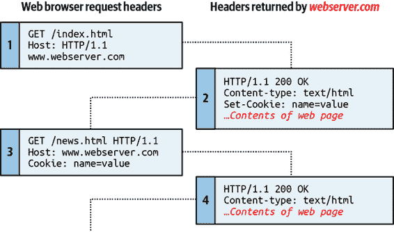
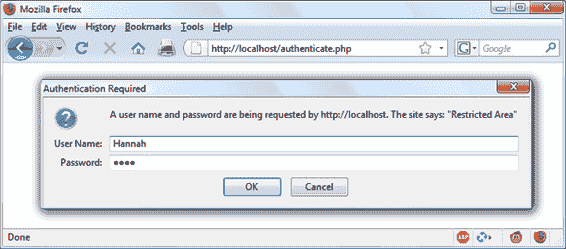
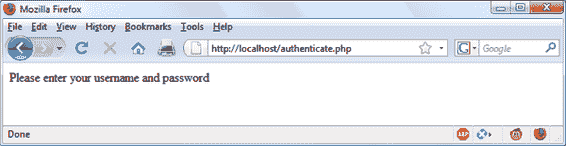
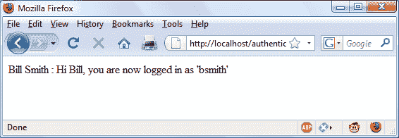
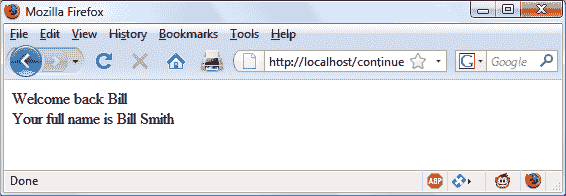

# 第十三章：Cookies、会话和认证

随着您的 Web 项目变得越来越大和复杂，您将发现越来越需要跟踪您的用户。即使您不提供登录和密码，您也经常需要存储关于用户当前会话的详细信息，并在他们返回您的站点时识别他们。

几种技术支持这种互动，从简单的浏览器 cookies 到会话处理和 HTTP 身份验证。它们之间为您提供了配置您的站点以符合用户偏好并确保流畅愉快过渡的机会。

# 在 PHP 中使用 Cookies

*Cookie*是通过 web 浏览器将数据项保存到计算机硬盘的一种数据。它几乎可以包含任何字母数字信息（只要在 4 KB 以下），并且可以从计算机检索并返回到服务器。常见用途包括会话跟踪，跨多次访问保持数据，保存购物车内容，存储登录详细信息等。

由于其隐私影响，**cookies**只能从发行域中读取。换句话说，如果一个 cookie 是由例如*oreilly.com*发行的，只有使用该域的 web 服务器才能检索它。这可以防止其他未经授权的网站获取这些细节。

由于互联网的工作方式，网页上的多个元素可以嵌入来自多个域的内容，每个域都可以发行自己的 cookies。当这种情况发生时，它们被称为*第三方 cookies*。最常见的是由广告公司创建，用于跨多个网站跟踪用户或进行分析。

因此，大多数浏览器允许用户关闭 cookies，无论是对当前服务器的域、第三方服务器还是两者都可以。幸运的是，大多数禁用 cookies 的人只对第三方网站这样做。

Cookies 在传输头部期间交换，在实际 HTML 网页发送之前，一旦 HTML 已经传输，发送 cookie 是不可能的。因此，仔细规划 cookie 的使用非常重要。图 13-1 说明了一个典型的浏览器和 web 服务器之间传递 cookies 的请求和响应对话。



###### 图 13-1\. 带有 cookies 的浏览器/服务器请求/响应对话框

这个交换显示浏览器接收到两个页面：

1.  浏览器发出请求以检索网站*http://www.webserver.com*上的主页面*index.html*。第一个头部指定文件，第二个头部指定服务器。

1.  当 *webserver.com* 的 Web 服务器收到这对标头时，将返回一些自己的标头。第二个标头定义要发送的内容类型（`text/html`），第三个标头发送具有名称 `name` 和值 `value` 的 cookie。然后才传输网页内容。

1.  浏览器接收到 cookie 后，将在以后向发出请求的服务器发送该 cookie，直到 cookie 过期或被删除。因此，当浏览器请求新页面 */news.html* 时，它还会返回具有值 `value` 的 cookie `name`。

1.  由于 cookie 已经设置，当服务器接收到发送 */news.html* 的请求时，它不需要重新发送 cookie，而只需返回请求的页面。

###### 注意

可以通过浏览器内置的开发者工具或扩展程序直接编辑 cookie。因此，由于用户可以更改 cookie 的值，您不应在 cookie 中放置用户名等关键信息，否则可能导致您的网站被意外操纵。Cookie 最适合用于存储语言或货币设置等数据。

## 设置 Cookie

在 PHP 中设置 cookie 很简单。只要还未传输任何 HTML，您可以调用 `setcookie` 函数，其语法如下（参见表 13-1）：

```php
setcookie(name, value, expire, path, domain, secure, httponly);
```

表 13-1\. `setcookie` 参数

| 参数 | 描述 | 示例 |
| --- | --- | --- |
| `name` | cookie 的名称。这是服务器在后续浏览器请求中使用的名称，用于访问 cookie。 | `location` |
| `value` | cookie 的值或 cookie 的内容。这可以包含最多 4 KB 的字母数字文本。 | `USA` |
| `expire` | （*可选*）过期日期的 Unix 时间戳。通常，您可能会使用 `time()` 加上一定的秒数。如果未设置，该 cookie 将在浏览器关闭时过期。 | `time() + 2592000` |
| `path` | （*可选*）服务器上 cookie 的路径。如果是 `/`（斜杠），则该 cookie 在整个域内有效，例如 *www.webserver.com*。如果是子目录，则 cookie 仅在该子目录中有效。默认为设置 cookie 的当前目录，这通常是您会使用的设置。 | `/` |
| `domain` | （*可选*）cookie 的互联网域。如果是 *webserver.com*，则该 cookie 对所有 *webserver.com* 及其子域（如 *www.webserver.com* 和 *images.webserver.com*）可用。如果是 *images.webserver.com*，则该 cookie 仅对 *images.webserver.com* 及其子域（如 *sub.images.webserver.com*）可用，但对例如 *www.webserver.com* 不可用。 | `webserver.com` |
| `secure` | （*可选*）cookie 是否必须使用安全连接（*https://*）。如果该值为 `TRUE`，则该 cookie 只能在安全连接上传输。默认为 `FALSE`。 | `FALSE` |
| `httponly` | （*可选*；自 PHP 版本 5.2.0 起实现。）Cookie 是否必须使用 HTTP 协议。如果该值为 `TRUE`，脚本语言（如 JavaScript）无法访问 Cookie。默认值为 `FALSE`。 | `FALSE` |

因此，要创建一个名为 `location`、值为 `USA` 的 Cookie，在当前域上整个 Web 服务器上都可以访问，并且将在七天内从浏览器缓存中删除，使用以下方法：

```php
setcookie('location', 'USA', time() + 60 * 60 * 24 * 7, '/');
```

## 访问 Cookie

读取 Cookie 的值就像访问 `$_COOKIE` 系统数组一样简单。例如，如果您想要查看当前浏览器是否已经存储了名为 `location` 的 Cookie，并且如果有的话，读取其值，可以使用以下方法：

```php
if (isset($_COOKIE['location'])) $location = $_COOKIE['location'];
```

请注意，只有在将 Cookie 发送到 Web 浏览器后，您才能读取 Cookie。这意味着当您发出一个 Cookie 时，直到浏览器重新加载页面（或另一个具有访问权限的页面）从您的网站返回 Cookie 给服务器时，您无法再次读取它。

## 销毁 Cookie

要删除一个 Cookie，您必须再次发出它并将日期设置为过去。在您的新 `setcookie` 调用中，除了时间戳之外，所有参数都必须与首次发出 Cookie 时的参数相同；否则，删除操作将失败。因此，要删除之前创建的 Cookie，您将使用以下方法：

```php
setcookie('location', 'USA', time() - 2592000, '/');
```

只要给定的时间是过去的，Cookie 就应该被删除。然而，我已经在过去使用了 2,592,000 秒（一个月）的时间，以防客户端计算机的日期和时间设置不正确。您也可以为 Cookie 值提供一个空字符串（或一个值为 `FALSE` 的值），PHP 将自动为您将其时间设置为过去。

# HTTP 身份验证

HTTP 身份验证使用 Web 服务器来管理应用程序的用户和密码。对于要求用户登录的简单应用程序来说，这是足够的，尽管大多数应用程序会有专门的需求或更严格的安全要求，需要使用其他技术。

要使用 HTTP 身份验证，PHP 发送一个头部请求，请求与浏览器开始身份验证对话。服务器必须启用此功能才能正常工作，但由于它是如此常见，您的服务器很可能提供此功能。

###### 注意

尽管它通常与 Apache 一起安装，但 HTTP 身份验证模块不一定安装在您使用的服务器上。因此，尝试运行这些示例可能会生成一个错误，告诉您该功能未启用，这种情况下，您必须安装该模块并更改配置文件以加载它，或者要求系统管理员进行这些更改。

在将您的 URL 输入浏览器或通过链接访问页面后，用户将看到一个“需要身份验证”的提示弹出窗口，请求两个字段：用户名和密码（图 13-2 显示了在 Firefox 中的外观）。



###### 图 13-2\. HTTP 鉴权登录提示

示例 13-1 展示了使其发生的代码。

##### 示例 13-1\. PHP 鉴权

```php
<?php
  if (isset($_SERVER['PHP_AUTH_USER']) &&
      isset($_SERVER['PHP_AUTH_PW']))
  {
    echo "Welcome User: " . htmlspecialchars($_SERVER['PHP_AUTH_USER']) .
         " Password: "    . htmlspecialchars($_SERVER['PHP_AUTH_PW']);
  }
  else
  {
    header('WWW-Authenticate: Basic realm="Restricted Area"');
    header('HTTP/1.1 401 Unauthorized');
    die("Please enter your username and password");
  }
?>
```

程序首先查找两个特定数组值：`$_SERVER['PHP_AUTH_USER']` 和 `$_SERVER['PHP_AUTH_PW']`。如果它们都存在，它们代表用户在身份验证提示中输入的用户名和密码。

###### 注意

注意，在显示到屏幕上时，返回到`$_SERVER`数组中的值首先通过`htmlspecialchars`函数进行处理。这是因为这些值是用户输入的，因此不能信任，黑客可能通过添加 HTML 字符和其他符号尝试跨站点脚本攻击。`htmlspecialchars`将任何这样的输入转换为无害的 HTML 实体。

如果任一值不存在，则用户尚未通过身份验证，并且您通过发出以下标题显示图 13-2，其中`Basic realm`是受保护部分的名称，并作为弹出提示的一部分显示：

```php
WWW-Authenticate: Basic realm="Restricted Area"
```

如果用户填写了字段，PHP 程序会再次从顶部运行。但如果用户点击取消按钮，则程序继续执行以下两行代码，发送以下标题和错误消息：

```php
HTTP/1.1 401 Unauthorized
```

`die` 语句导致文本“请键入您的用户名和密码”被显示（参见图 13-3）。



###### 图 13-3\. 点击取消按钮的结果

###### 注意

一旦用户已经通过身份验证，您将无法再次弹出身份验证对话框，除非用户关闭并重新打开所有浏览器窗口，因为 Web 浏览器将持续将相同的用户名和密码返回给 PHP。在通过此部分并尝试不同操作时，您可能需要关闭并重新打开浏览器几次。最简单的方法是打开一个新的私密或匿名窗口来运行这些示例，这样您就无需关闭整个浏览器。

现在让我们检查有效的用户名和密码。在示例 13-1 中的代码无需太多更改即可添加此检查，只需修改先前的欢迎消息代码以测试正确的用户名和密码，然后发出欢迎消息。认证失败会导致发送错误消息（参见示例 13-2）。

##### Example 13-2\. PHP 鉴权与输入检查

```php
<?php
  $username = 'admin';
  $password = 'letmein';

  if (isset($_SERVER['PHP_AUTH_USER']) &&
      isset($_SERVER['PHP_AUTH_PW']))
  {
    if ($_SERVER['PHP_AUTH_USER'] === $username &&
        $_SERVER['PHP_AUTH_PW']   === $password)
          echo "You are now logged in";
    else die("Invalid username/password combination");
  }
  else
  {
    header('WWW-Authenticate: Basic realm="Restricted Area"');
    header('HTTP/1.0 401 Unauthorized');
    die ("Please enter your username and password");
  }
?>
```

在比较用户名和密码时，使用`===`（全等）运算符，而不是`==`（等于）运算符。这是因为我们要检查两个值是否*完全*匹配。例如，`'0e123' == '0e456'`，这对于用户名或密码目的来说不是合适的匹配。

在前面的例子中，0e123 是 0 乘以 10 的 123 次方，结果为零，0e456 也是 0 乘以 10 的 456 次方，同样计算结果为零。因此，使用`==`运算符，它们会匹配，因为它们的值都评估为零，因此比较的结果将为`true`，但`===`运算符表示两个部分在每个方面都必须完全相同，而这两个字符串是不同的，所以测试将返回`false`。

现在已经有了一个机制来验证用户，但只能针对单个用户名和密码进行。此外，密码以明文形式出现在 PHP 文件中，如果有人成功入侵您的服务器，他们将立即知道密码。因此，让我们看看更好地处理用户名和密码的方法。

## 存储用户名和密码

MySQL 是存储用户名和密码的自然方式。但同样，我们不希望以明文形式存储密码，因为如果数据库被黑客访问，我们的网站可能会受到威胁。相反，我们将使用一个称为*单向函数*的巧妙技巧。

这种类型的函数易于使用，并将文本字符串转换为看似随机的字符串。由于它们的单向性质，这些函数是不可能逆转的，因此它们的输出可以安全地存储在数据库中——窃取它的人将无法知道使用的密码。

在本书的早期版本中，我建议您使用*MD5*散列算法来保护数据安全。然而，时间过去了，现在 MD5 被认为是易于被破解的，因此不安全。实际上，甚至其先前推荐的替代方案*SHA-1*也似乎可以被破解。

所以，现在 PHP 5.5 几乎是到处的最低标准，我已经转而使用其内置的散列函数，这在安全性上更为可靠，并且以一种整洁的方式处理所有事务。

以前，要安全地存储密码，您需要对密码进行*盐*处理，这是指向密码添加用户未输入的额外字符（以进一步混淆它）。然后，您需要通过单向函数将其结果转换为看似随机的字符集，这曾经是难以破解的。

例如，如下代码（现在非常不安全，因为现代图形处理单元具有如此速度和功率）：

```php
echo hash('ripemd128', '`saltstring`mypassword');
```

将显示此值：

```php
9eb8eb0584f82e5d505489e6928741e7
```

请记住，这并不是建议您使用的方法。请将其视为*不*应该做的示例，因为它非常不安全。请继续阅读。

### 使用 password_hash

从 PHP 版本 5.5 开始，有一种更好的方法来创建加盐的密码哈希：`password_hash` 函数。将 `PASSWORD_DEFAULT` 作为其第二个（必需的）参数，要求函数选择当前可用的最安全的哈希函数。`password_hash` 还会为每个密码选择一个随机盐。（不要试图添加额外的盐，因为这可能会损害算法的安全性。）因此，以下代码：

```php
echo password_hash("mypassword", PASSWORD_DEFAULT);
```

将返回以下形式的字符串，其中包括盐和验证密码所需的所有信息。

```php
$2y$10$k0YljbC2dmmCq8WKGf8oteBGiXlM9Zx0ss4PEtb5kz22EoIkXBtbG
```

###### 注意

如果你让 PHP 自行选择哈希算法，你应该允许返回的哈希随着时间的推移而扩展，以实现更好的安全性。PHP 的开发者建议你将哈希存储在数据库字段中，该字段至少可以扩展到 255 个字符（即使现在的平均长度为 60–72）。如果你希望，你可以手动选择 BCRYPT 算法，通过向函数的第二个参数提供常量 `PASSWORD_BCRYPT` 来保证哈希字符串仅为 60 个字符。然而，我不建议这样做，除非你有很好的理由。

你可以提供选项（以可选的第三个参数形式），以进一步定制如何计算哈希值，比如分配给哈希计算的成本或处理器时间的量（更多时间意味着更多安全性，但服务器速度较慢）。成本的默认值为 `10`，这是你在使用 BCRYPT 时应该使用的最低值。

然而，我不想用比你需要的更多信息来使你困惑，所以如果你希望获取有关可用选项的更多细节，请参考 [文档](http://php.net/password-hash)。你甚至可以选择自己的盐（尽管从 PHP 7.0 开始已不建议这样做，因为除非你确切知道自己在做什么，否则这并不安全，就像 WordPress 仍然处理其自己的盐一样）。

### 使用 `password_verify`

要验证密码是否与哈希匹配，使用 `password_verify` 函数，向其传递用户刚输入的密码字符串以及存储在数据库中的该用户密码的哈希值。

所以，假设你的用户之前输入了（非常不安全的）密码 *mypassword*，现在你在变量 `$hash` 中存储了他们密码的哈希字符串（用户创建密码时），你可以像这样验证它们是否匹配：

```php
if (password_verify("mypassword", $hash))
  echo "Valid";
```

如果提供了哈希的正确密码，则 `password_verify` 返回值 `TRUE`，因此此 `if` 语句将显示单词 “Valid.” 如果不匹配，则返回 `FALSE`，然后你可以要求用户再试一次。

## 一个示例程序

让我们看看这些函数与 MySQL 结合使用时是如何协同工作的。首先需要创建一个新表来存储密码哈希，因此在程序中键入 示例 13-3 并将其保存为 *setupusers.php*（或从 [GitHub](https://github.com/RobinNixon/lpmj6) 下载），然后在浏览器中打开它。

##### 示例 13-3\. 创建用户表并添加两个帐户

```php
<?php //setupusers.php
  require_once 'login.php';

  try
  {
    $pdo = new PDO($attr, $user, $pass, $opts);
  }
  catch (\PDOException $e)
  {
    throw new \PDOException($e->getMessage(), (int)$e->getCode());
  }

  $query = "CREATE TABLE users (
    forename VARCHAR(32) NOT NULL,
    surname  VARCHAR(32) NOT NULL,
    username VARCHAR(32) NOT NULL UNIQUE,
    password VARCHAR(255) NOT NULL
  )";

  $result = $pdo->query($query);

  $forename = 'Bill';
  $surname  = 'Smith';
  $username = 'bsmith';
  $password = 'mysecret';
  $hash     = password_hash($password, PASSWORD_DEFAULT);

  add_user($pdo, $forename, $surname, $username, $hash);

  $forename = 'Pauline';
  $surname  = 'Jones';
  $username = 'pjones';
  $password = 'acrobat';
  $hash     = password_hash($password, PASSWORD_DEFAULT);

  add_user($pdo, $forename, $surname, $username, $hash);

  function add_user($pdo, $fn, $sn, $un, $pw)
  {
    $stmt = $pdo->prepare('INSERT INTO users VALUES(?,?,?,?)');

    $stmt->bindParam(1, $fn, PDO::PARAM_STR,  32);
    $stmt->bindParam(2, $sn, PDO::PARAM_STR,  32);
    $stmt->bindParam(3, $un, PDO::PARAM_STR,  32);
    $stmt->bindParam(4, $pw, PDO::PARAM_STR, 255);

    $stmt->execute([$fn, $sn, $un, $pw]);
  }
?>

```

此程序将在 *publications* 数据库中创建名为 *users* 的表（或者您为 第十一章 中的 *login.php* 文件设置的任何数据库）。在此表中，它将创建两个用户：Bill Smith 和 Pauline Jones。他们的用户名和密码分别为 *bsmith/mysecret* 和 *pjones/acrobat*。

使用此表中的数据，我们现在可以修改 示例 13-2 以正确验证用户，并且 示例 13-4 显示了执行此操作所需的代码。将其键入或从伴随网站下载，然后确保将其保存为 *authenticate.php*，并在浏览器中调用它。

##### 示例 13-4\. 使用 MySQL 进行 PHP 身份验证

```php
<?php // authenticate.php   require_once 'login.php';

  try
  {
    $pdo = new PDO($attr, $user, $pass, $opts);
  }
  catch (\PDOException $e)
  {
    throw new \PDOException($e->getMessage(), (int)$e->getCode());
  }

  if (isset($_SERVER['PHP_AUTH_USER']) &&
      isset($_SERVER['PHP_AUTH_PW']))
  {
`$un_temp` `=` `sanitize``(``$pdo``,` `$_SERVER``[``'PHP_AUTH_USER'``]);`
    `$pw_temp` `=` `sanitize``(``$pdo``,` `$_SERVER``[``'PHP_AUTH_PW'``]);`     `$query `  `=` `"``SELECT * FROM users WHERE username=``$un_temp``"``;`
    `$result ` `=` `$pdo``->``query``(``$query``);`

    `if` `(``!``$result``->``rowCount``())` `die``(``"``User not found``"``);`

    `$row` `=` `$result``->``fetch``();`
    `$fn ` `=` `$row``[``'forename'``];`
    `$sn ` `=` `$row``[``'surname'``];`
    `$un ` `=` `$row``[``'username'``];`
    `$pw ` `=` `$row``[``'password'``];`

    `if` `(``password_verify``(``str_replace``(``"``'``"``,` `"``"``,` `$pw_temp``),` `$pw``))`
      `echo` `htmlspecialchars``(``"``$fn` `$sn` `: Hi` `$fn``,         you are now logged in as '``$un``'``"``);`
    `else` `die``(``"``Invalid username/password combination``"``);`
  }
  else
  {
    header('WWW-Authenticate: Basic realm="Restricted Area"');
    header('HTTP/1.1 401 Unauthorized');
    die ("Please enter your username and password");
  }

  function sanitize($pdo, $str)
  {
    $str = htmlentities($str);
    return $pdo->quote($str);
  }
?>

```

###### 注意

使用 HTTP 身份验证将在使用 BCrypt 哈希化的密码时施加约 80 毫秒的惩罚，其默认成本为 10。此减速作为攻击者的屏障，防止他们以最大速度尝试破解密码。因此，在非常繁忙的站点上，HTTP 身份验证不是一个好的解决方案，您可能更喜欢使用会话（请参阅下一节）。

正如你在本书的这一部分可能期待的那样，其中一些示例开始变得相当长了。但不要灰心。这时你真正需要关注的只有加粗的那些行。它们从使用 `sanitize` 函数通过传递的用户名和密码开始，将任何 HTML 实体更改为安全字符串，再使用 `htmlentities` 函数添加单引号到字符串的起始和结束，以及使用 `quote` 方法。

接下来，向 MySQL 发出查询以查找用户 `$un_temp`，如果返回结果，则将第一行分配给 `$row`。因为用户名是唯一的，所以只会有一行。

现在只需检查存储在数据库中的哈希值，即 `$row['password']`，这是用户创建密码时使用 `password_hash` 计算的先前哈希值。

如果刚刚提供的哈希和密码验证成功，`password_verify` 将返回 `TRUE`，并输出友好的欢迎字符串，称呼用户的名字（参见 图 13-4）。否则，将显示错误消息。因为我们已经使用 `quote` 对密码进行了清理，所以在调用 `password_verify` 时，首先会使用 `str_replace` 删除封装的单引号。

您可以尝试在您的浏览器中调用程序，并输入用户名`bsmith`和密码`mysecret`（或`pjones`和`acrobat`），这些值已被示例 13-3 保存到数据库中。



###### 图 13-4. Bill Smith has now been authenticated

###### 注意

通过在遇到输入后立即对其进行清理，您将阻止任何恶意 HTML、JavaScript 或 MySQL 攻击在继续之前，您将不必再次清理此数据。如果用户的密码中包含字符如`<`或`&`（例如），这些字符将被`htmlentities`函数扩展为`&lt;`或`&amp;`——只要您的代码允许字符串的长度可能大于提供的输入宽度，并且始终通过此清理运行密码，您将一切安好。

# 使用会话（Sessions）

因为您的程序无法知道其他程序中设置了哪些变量——甚至不知道同一个程序上次运行时设置了什么值——因此有时您希望从一个网页跟踪用户的活动到另一个网页。您可以通过在表单中设置隐藏字段来实现这一点，如第十一章中所示，并在提交表单后检查字段的值，但是 PHP 提供了更强大、更安全和更简单的解决方案，即*会话（sessions）*。这些是存储在服务器上但只与当前用户相关的变量组。为了确保正确的变量应用于正确的用户，PHP 会在用户的 Web 浏览器中保存一个 cookie 来唯一标识他们。

###### 注意

在 2019 年，谷歌宣布正在通过名为“隐私沙箱（Privacy Sandbox）”的项目逐步淘汰其浏览器中的第三方 cookie。毫无疑问，其他浏览器也将效仿，特别是 Opera 和 Microsoft Edge，它们都依赖于 Google Chrome 的代码库。然而，这引起了监管部门的关注，因为一些公司暗示这可能会导致更多的支出流向谷歌的生态系统，因此其实施可能会发生变化。可以确定的是，cookie 正变得不受欢迎，在您访问的几乎每个网站上都会看到 cookie 警告，其存在的日子已经不多了。总之，谷歌打算将用户分成大约 1000 个具有类似浏览器使用和产品兴趣的群体，以便无法唯一识别或跟踪任何人。然而，一旦 cookie 最终被淘汰，这可能会给您的代码带来问题。因此，我建议您关注可能影响用户与您开发的代码交互方式的这一领域的发展。

此 cookie 仅对 Web 服务器有意义，并不能用于获取用户的任何信息。您可能会问关于那些已禁用 cookie 的用户。在今天这个时代，任何禁用 cookie 的人都不应指望拥有最佳的浏览体验，如果您发现禁用了 cookie，您应该告知这样的用户，如果他们希望充分享受您的网站，则需要启用 cookie，而不是试图绕过 cookie 的使用，这可能会引发安全问题。

## 启动会话

启动会话需要在输出任何 HTML 之前调用 PHP 函数`session_start`，类似于在头部交换期间发送 cookie。然后，要开始保存会话变量，只需将它们分配为`$_SESSION`数组的一部分，如下所示：

```php
$_SESSION['variable'] = $value;
```

然后可以在后续程序运行中轻松读取它们，如下所示：

```php
$variable = $_SESSION['variable'];
```

现在假设您有一个应用程序，它始终需要访问每个用户在表*users*中存储的名字和姓氏，而您应该稍早就已创建了这个表。让我们进一步修改 Example 13-4 中的*authenticate.php*，以便在用户经过验证后设置会话。

Example 13-5 展示了所需的更改。唯一的区别是`if (password_verify...`部分的内容，我们现在通过打开会话并将这些变量保存到其中来开始。请将此程序键入（或修改 Example 13-4）并保存为*authenticate2.php*。但是不要立即在浏览器中运行它，因为您稍后还需要创建第二个程序。

##### Example 13-5\. 在成功验证后设置会话

```php
<?php // authenticate2.php   require_once 'login.php';

  try
  {
    $pdo = new PDO($attr, $user, $pass, $opts);
  }
  catch (\PDOException $e)
  {
    throw new \PDOException($e->getMessage(), (int)$e->getCode());
  }

  if (isset($_SERVER['PHP_AUTH_USER']) &&
      isset($_SERVER['PHP_AUTH_PW']))
  {
    $un_temp = sanitize($pdo, $_SERVER['PHP_AUTH_USER']);
    $pw_temp = sanitize($pdo, $_SERVER['PHP_AUTH_PW']);
    $query   = "SELECT * FROM users WHERE username=$un_temp";
    $result  = $pdo->query($query);

    if (!$result->rowCount()) die("User not found");

    $row = $result->fetch();
    $fn  = $row['forename'];
    $sn  = $row['surname'];
    $un  = $row['username'];
    $pw  = $row['password'];

`if` `(``password_verify``(``str_replace``(``"``'``"``,` `"``"``,` `$pw_temp``),` `$pw``))`
    `{`
      `session_start``();`

      `$_SESSION``[``'forename'``]` `=` `$fn``;`
      `$_SESSION``[``'surname'``]`  `=` `$sn``;`

      `echo` `htmlspecialchars``(``"``$fn` `$sn` `: Hi` `$fn``,         you are now logged in as '``$un``'``"``);`
      `die` `(``"``<p><a href='continue.php'>Click here to continue</a></p>``"``);`
    `}`     else die("Invalid username/password combination");
  }
  else
  {
    header('WWW-Authenticate: Basic realm="Restricted Area"');
    header('HTTP/1.0 401 Unauthorized');
    die ("Please enter your username and password");
  }

  function sanitize($pdo, $str)
  {
    $str = htmlentities($str);
    return $pdo->quote($str);
  }
?>

```

程序的另一个增加部分是“点击这里继续”链接，目标 URL 为*continue.php*。这将用于说明会话如何转移到另一个程序或 PHP 网页。因此，请通过键入 Example 13-6 中的程序并保存来创建*continue.php*。

##### Example 13-6\. 检索会话变量

```php
<?php // continue.php
  session_start();

  if (isset($_SESSION['forename']))
  {
    $forename = htmlspecialchars($_SESSION['forename']);
    $surname  = htmlspecialchars($_SESSION['surname']);

    echo "Welcome back $forename.<br>
 Your full name is $forename $surname.<br>";
  }
  else echo "Please <a href='authenticate2.php'>click here</a> to log in.";
?>
```

现在您已经准备好在浏览器中调用*authenticate2.php*了。在提示时输入用户名`bsmith`和密码`mysecret`（或`pjones`和`acrobat`），然后点击链接加载*continue.php*。当您的浏览器调用它时，结果应该类似于 Figure 13-5。



###### 图 13-5\. 使用会话维护用户数据

会话将复杂的用户认证和登录代码整洁地限制在单个程序中。一旦用户经过验证并创建了会话，您的程序代码就变得非常简单。您只需调用`session_start`并查看`$_SESSION`中您需要访问的任何变量即可。

在示例 13-6 中，快速测试`$_SESSION['forename']`是否有值就足以让您知道当前用户是否经过身份验证，因为会话变量存储在服务器上（不像 cookie 存储在 Web 浏览器中），因此可以信任。

如果`$_SESSION['forename']`尚未被赋值，表示没有活动会话，因此在示例 13-6 的最后一行代码将用户重定向到登录页面*authenticate2.php*。

## 结束会话

当需要结束会话时，通常是用户从您的网站请求注销时，您可以使用`session_destroy`函数，如示例 13-7 中所示。该示例提供了一个有用的函数来完全销毁会话，注销用户并取消所有会话变量的设置。

##### 示例 13-7\. 一个方便的函数来销毁会话及其数据

```php
<?php
  function destroy_session_and_data()
  {
    session_start();
    $_SESSION = array();
    setcookie(session_name(), '', time() - 2592000, '/');
    session_destroy();
  }
?>
```

要查看其实际操作，您可以修改*continue.php*，如示例 13-8 所示。

##### 示例 13-8\. 检索会话变量然后销毁会话

```php
<?php
  session_start();

  if (isset($_SESSION['forename']))
  {
    $forename = $_SESSION['forename'];
    $surname  = $_SESSION['surname'];

    `destroy_session_and_data``();`

    echo htmlspecialchars("Welcome back $forename");
    echo "<br>";
    echo htmlspecialchars("Your full name is $forename $surname.");

  }
  else echo "Please <a href='authenticate.php'>click here</a> to log in.";

  `function` `destroy_session_and_data``()`
  `{`
    `$_SESSION` `=` `array``();`
    `setcookie``(``session_name``(),` `''``,` `time``()` `-` `2592000``,` `'/'``);`
    `session_destroy``();`
  `}`
?>
```

第一次从*authenticate2.php*导航到*continue.php*时，会显示所有会话变量。但是，由于调用了`destroy_session_and_data`函数，如果您之后点击浏览器的重新加载按钮，会话将被销毁，然后您将提示返回登录页面。

## 设置超时时间

还有其他时候，您可能希望自己关闭用户的会话，比如用户忘记或忽略注销时，为了他们自己的安全，您希望程序替他们这样做。您可以通过设置超时时间来实现这一点，超过该时间没有活动则自动注销。

要做到这一点，请使用`ini_set`函数如下所示。该示例将超时设置为正好一天（字母`gc`代表垃圾回收）：

```php
ini_set('session.gc_maxlifetime', 60 * 60 * 24);
```

如果您想知道当前超时周期是多少，可以使用以下方法显示它：

```php
echo ini_get('session.gc_maxlifetime');
```

## 会话安全

尽管我提到一旦您验证了用户并设置了会话，您可以安全地假定会话变量是可信的，但实际情况并非如此。原因是可能使用*数据包嗅探*（数据采样）来发现通过网络传输的会话 ID。此外，如果会话 ID 在 URL 的 GET 部分传递，它可能会出现在外部站点服务器日志中。

防止这些信息被发现的唯一真正安全的方法是实施*传输层安全*（TLS，比安全套接字层更安全的后续版本），并运行 HTTPS 而不是 HTTP 网页。这超出了本书的范围，但您可能希望查看[Apache 文档](https://tinyurl.com/apachetls)以获取设置安全 Web 服务器的详细信息。

### 防止会话劫持

当 TLS 不可行时，您可以通过在存储会话时添加像下面这样的行来进一步验证用户，将他们的 IP 地址与其他详细信息一起存储：

```php
$_SESSION['ip'] = $_SERVER['REMOTE_ADDR'];
```

然后，作为额外的检查，每当加载任何页面并且会话可用时，请执行以下检查。如果存储的 IP 地址与当前 IP 地址不匹配，则调用函数 `different_user`：

```php
if ($_SESSION['ip'] != $_SERVER['REMOTE_ADDR']) different_user();
```

在你的 `different_user` 函数中放置的代码由你决定。由于技术错误，我建议你要么删除当前会话并要求用户重新登录，要么，如果你有他们的电子邮件地址，可以通过发送确认链接的方式，让他们确认身份，这将使他们保留会话中的所有数据。

当然，你需要意识到在同一代理服务器上的用户或在家庭或商业网络上共享相同 IP 地址的用户将具有相同的 IP 地址。如果这对你来说是个问题，请再次使用 HTTPS。你还可以存储浏览器的副本 *用户代理字符串*（开发者在浏览器中放置的标识它们的类型和版本的字符串），这也可能因使用中的各种浏览器类型、版本和计算机平台而区分用户（尽管这不是一个完美的解决方案，如果浏览器自动更新，该字符串将会更改）。使用以下方法存储用户代理：

```php
$_SESSION['ua'] = $_SERVER['HTTP_USER_AGENT'];
```

使用这段代码来比较当前的用户代理字符串与保存的字符串：

```php
if ($_SESSION['ua'] != $_SERVER['HTTP_USER_AGENT']) different_user();
```

或者更好的做法是，像这样结合两个检查，并将组合保存为 `hash` 十六进制字符串：

```php
$_SESSION['check'] = hash('ripemd128', $_SERVER['REMOTE_ADDR'] .
    $_SERVER['HTTP_USER_AGENT']);
```

使用这段代码来比较当前和存储的字符串：

```php
if ($_SESSION['check'] != hash('ripemd128', $_SERVER['REMOTE_ADDR'] .
    $_SERVER['HTTP_USER_AGENT'])) different_user();
```

### 防止会话固定攻击

*会话固定攻击* 是指恶意第三方获取有效的会话 ID（可能由服务器生成），并使用户使用该会话 ID 进行身份验证，而不是使用其自己的 ID 进行身份验证。当攻击者利用通过 URL 的 GET 部分传递会话 ID 的能力时，就可能发生这种情况，例如：

```php
http://yourserver.com/authenticate.php?PHPSESSID=123456789
```

在这个例子中，虚构的会话 ID 123456789 被传递到服务器。现在，请考虑示例 13-9，它容易受到会话固定攻击的影响。要了解详细情况，请键入并保存为 *sessiontest.php*。

##### 示例 13-9\. 会话易受会话固定攻击影响

```php
<?php // sessiontest.php
  session_start();

  if (!isset($_SESSION['count'])) $_SESSION['count'] = 0;
  else ++$_SESSION['count'];

  echo $_SESSION['count'];
?>
```

保存之后，使用以下 URL 在浏览器中调用它（请用正确的路径名作为前缀，例如 *http://localhost*）：

```php
sessiontest.php?PHPSESSID=1234
```

点击重新加载几次，你会看到计数器增加。现在尝试浏览到：

```php
sessiontest.php?PHPSESSID=5678
```

在这里点击重新加载几次，你应该看到计数器继续增加。将计数器留在与第一个 URL 不同的数字上，返回第一个 URL，然后查看数字如何变化。在这里，你已经创建了两个自己选择的不同会话，你也可以轻松地创建所需数量的会话。

这种方法如此危险的原因在于恶意攻击者可能会尝试向毫不知情的用户分发这些类型的 URL，如果其中任何一个用户跟随这些链接，攻击者将能够返回并接管未被删除或过期的任何会话——想象一下，如果那个会话是对购物网站或者更糟的情况是银行的。

为了防止这种情况发生，请尽快使用`session_regenerate_id`更改会话 ID。此函数保留所有当前会话变量值，但用一个攻击者无法知道的新 ID 替换会话 ID。为此，请检查一个您任意发明的特殊会话变量。如果不存在，您就知道这是一个新会话，因此您只需更改会话 ID 并设置特殊会话变量来记录更改。示例 13-10 展示了如何通过使用会话变量`initiated`的代码来实现这一点。

##### 示例 13-10\. 会话再生成

```php
<?php
  session_start();

  if (!isset($_SESSION['initiated']))
  {
    session_regenerate_id();
    $_SESSION['initiated'] = 1;
  }

  if (!isset($_SESSION['count'])) $_SESSION['count'] = 0;
  else ++$_SESSION['count'];

  echo $_SESSION['count'];
?>
```

这样，攻击者可以使用他们生成的任何会话 ID 返回到您的网站，但它们中没有一个会调用另一个用户的会话，因为它们都已被重新生成的 ID 替换。

### 强制仅限于 Cookie 的会话

如果您准备好要求用户在您的网站上启用 Cookie，您可以使用`ini_set`函数，如下所示：

```php
ini_set('session.use_only_cookies', 1);
```

有了这个设置，`?PHPSESSID=`的技巧将被完全忽略。如果您使用这种安全措施，我还建议您告知用户您的网站需要使用 Cookie（但仅在用户禁用 Cookie 的情况下，特别是用户所在地区要求 Cookie 通知时），这样他们就知道如果未能获得他们想要的结果，出了什么问题。

### 使用共享服务器

在与其他帐户共享的服务器上，您不希望将所有会话数据保存在与他们相同的目录中。相反，您应选择一个只有您的帐户有访问权限（并且不可见于 Web）的目录来存储您的会话，方法是在程序开头附近放置一个`ini_set`调用，就像这样：

```php
ini_set('session.save_path', '/home/user/myaccount/sessions');
```

配置选项仅在程序执行期间保留此新值，并在程序结束时恢复原始配置。

这个*sessions*文件夹可能会很快填满；您可能希望根据服务器的繁忙程度定期清除旧会话。它被使用得越多，您希望保留会话的时间就越少。

###### 注意

请记住，您的网站可能会受到黑客攻击的影响。有自动化机器人在互联网上肆虐，试图找到易受攻击的站点。因此，无论您做什么，每当处理不完全由您自己的程序生成的数据时，都应该极度小心对待它。

现在您应该对 PHP 和 MySQL 有很好的掌握，所以第十四章介绍了本书涵盖的第三种主要技术，JavaScript。

# 问题

1.  为什么必须在程序开始时传输 cookie？

1.  哪个 PHP 函数在 web 浏览器中存储 cookie？

1.  如何销毁一个 cookie？

1.  当使用 HTTP 认证时，在 PHP 程序中用户名和密码存储在哪里？

1.  `password_hash` 函数为什么是强大的安全措施？

1.  *加盐* 一个字符串是什么意思？

1.  PHP 会话是什么？

1.  如何启动 PHP 会话？

1.  什么是会话劫持？

1.  会话固定是什么？

请查看 “第十三章答案”，了解这些问题的答案。
