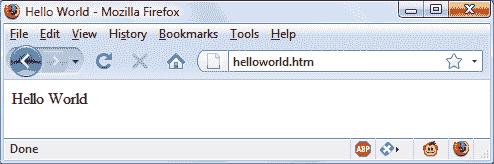
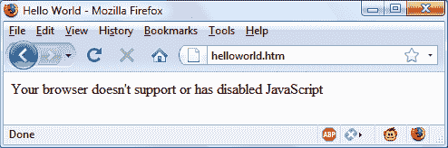
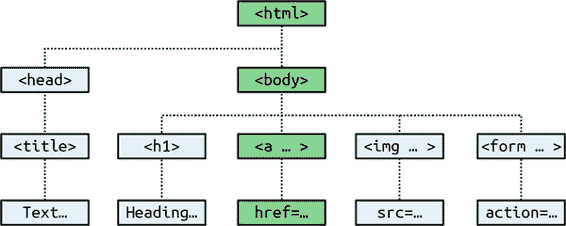

# 第十四章：探索 JavaScript

JavaScript 为您的网站带来了动态功能。每当您在浏览器中鼠标悬停在某个项目上时看到弹出的内容，或者看到页面上出现新的文本、颜色或图片时，或者在页面上抓取一个对象并将其拖动到新位置时——这些通常是通过 JavaScript 完成的（尽管 CSS 越来越强大，也可以完成许多这些功能）。它提供了否则无法实现的效果，因为它在浏览器内运行，并直接访问 Web 文档中的所有元素。

JavaScript 最早出现在 Netscape Navigator 浏览器中，与浏览器中的 Java 技术支持同时推出。由于最初错误地认为 JavaScript 是 Java 的衍生物，长期以来有关它们关系的混淆。然而，命名只是一种营销策略，旨在借助 Java 编程语言的流行来推广新的脚本语言。

当网页的 HTML 元素在所谓的*文档对象模型*（DOM）中得到更正式、结构化的定义时，JavaScript 获得了新的力量。DOM 使得添加新段落或关注文本的一部分并更改它变得相对容易。

由于 JavaScript 和 PHP 都支持 C 编程语言中使用的大部分结构化编程语法，它们在语法上看起来非常相似。它们也都是相当高级的语言。此外，它们都是弱类型语言，因此通过在新的上下文中使用它，很容易将变量更改为新类型。

现在您已经学会了 PHP，您应该会发现 JavaScript 更容易。您会感到高兴，因为它是提供流畅 Web 前端的异步通信技术的核心（与 HTML5 功能一起），这是精明的 Web 用户现在期望的。

# JavaScript 和 HTML 文本

JavaScript 是一种客户端脚本语言，完全运行在 Web 浏览器内或*Node.js*下。要调用它，您需要将其放置在开启 `<script>` 和闭合 `</script>` HTML 标签之间。一个典型的使用 JavaScript 的“Hello World” 文档可能看起来像 示例 14-1。

##### 示例 14-1\. 使用 JavaScript 显示“Hello World”

```php
<html>
  <head><title>Hello World</title></head>
  <body>
    <script type="text/javascript">
      document.write("Hello World")
    </script>
    <noscript>
      Your browser doesn't support or has disabled JavaScript
    </noscript>
  </body>
</html>
```

###### 注意

您可能已经看到使用 HTML 标签 `<script` `language="javascript">` 的网页，但这种用法现在已经不推荐使用了。本示例使用了更新和更受欢迎的 `<script type="text/javascript">`，或者您也可以只使用 `<script>`。

在 `<script>` 标签内是一行 JavaScript 代码，它使用其类似于 PHP `echo` 或 `print` 命令的 `document.write`。正如您所预期的那样，它只是将提供的字符串输出到当前文档中，然后在其中显示。

你可能还注意到，与 PHP 不同的是，JavaScript 中没有分号 (`;`)。这是因为换行在 JavaScript 中起到了分号的作用。然而，如果你希望在一行上有多个语句，除了最后一个外，每个命令都需要加上分号。当然，如果你愿意，你可以在每个语句的末尾加上分号，你的 JavaScript 也会正常工作。我个人的偏好是省略分号，因为它是多余的，因此我也避免可能会引起问题的做法。不过，最终，选择可能取决于你所在的团队，大多数情况下可能会要求使用分号，以确保安全。所以，如果有疑问，就加上分号吧。

在这个例子中还要注意的是 `<noscript>` 和 `</noscript>` 标签对。当你希望为不支持 JavaScript 或禁用 JavaScript 的用户提供替代的静态 HTML 时，可以使用这些标签。是否使用这些标签取决于你，因为它们并不是必需的，但通常情况下应该使用它们，因为为使用 JavaScript 提供的操作提供静态 HTML 替代通常并不困难。然而，本书的其余示例将省略 `<noscript>` 标签，因为我们专注于 JavaScript 的用法，而不是不使用 JavaScript 的情况。

当加载 示例 14-1 时，启用 JavaScript 的 Web 浏览器将输出以下内容（见 图 14-1）：

```php
Hello World
```



###### 图 14-1\. JavaScript，已启用并正常工作

浏览器禁用 JavaScript 将显示此消息（见 图 14-2）：

```php
Your browser doesn't support or has disabled JavaScript
```



###### 图 14-2\. JavaScript，禁用

## 在文档头部使用脚本

除了将脚本放在文档主体中之外，还可以将其放在 `<head>` 部分，这是在页面加载时执行脚本的理想位置。如果在那里放置关键代码和函数，还可以确保它们能够立即被文档中依赖它们的任何其他脚本部分使用。

将脚本放在文档头部的另一个原因是为了使 JavaScript 能够将诸如 meta 标签之类的东西写入 `<head>` 部分，因为你的脚本位置默认会写入文档的那部分。

## 旧版和非标准浏览器

如果你需要支持不支持脚本的浏览器（在今天几乎是不可能的），你需要使用 HTML 注释标签 (`<!--` 和 `-->`) 来防止它们遇到不应看到的脚本代码。示例 14-2 显示了如何将它们添加到你的脚本代码中。

##### 示例 14-2\. 针对非 JavaScript 浏览器修改的“Hello World”示例

```php
<html>
  <head><title>Hello World</title></head>
  <body>
    <script type="text/javascript">`<!--`
      document.write("Hello World")
    `// -->`
    </script>
  </body>
</html>
```

这里在 `<script>` 开始语句之后直接添加了一个开放的 HTML 注释标签 (`<!--`)，并在用 `</script>` 关闭脚本之前直接添加了一个关闭注释标签 (`// -->`)。

双斜杠 (`//`) 用于 JavaScript 表示该行剩余部分是注释。它存在的目的是让支持 JavaScript 的浏览器忽略后面的 `-->`，但非 JavaScript 浏览器将忽略前面的 `//` 并执行 `-->` 以关闭 HTML 注释。

尽管解决方案有点复杂，但你真正需要记住的只是在希望支持非常旧或非标准浏览器时使用以下两行来包含你的 JavaScript：

```php
`<``script` `type``=``"text/javascript"``>``<!--`
  *`(``Your` `JavaScript` `goes` `here``...``)`*
`// -->` `<``/``s``c``r``i``p``t``>`
```

然而，这些注释的使用对于过去几年中发布的任何浏览器都是不必要的，但是你需要注意这一点，以防万一。

## 包含 JavaScript 文件

除了直接在 HTML 文档中编写 JavaScript 代码外，您还可以包含来自您的网站或互联网任何地方的 JavaScript 代码文件。其语法如下：

```php
<script type="text/javascript" src="script.js"></script>
```

要从互联网中引入文件，请使用此方法（这里不包括 `type="text/javascript"`，因为这是可选的）：

```php
<script src="http://someserver.com/script.js"></script>
```

至于脚本文件本身，它们必须 *不* 包含任何 `<script>` 或 `</script>` 标签，因为这些标签是不必要的：浏览器已经知道正在加载 JavaScript 文件。如果将它们放入 JavaScript 文件中，将会导致错误。

包含脚本文件是您在网站上使用第三方 JavaScript 文件的首选方法。

###### 注意

可以省略 `type="text/javascript"` 参数；所有现代浏览器默认假定脚本包含 JavaScript。

## 调试 JavaScript 错误

当你学习 JavaScript 时，能够跟踪打字或其他编码错误非常重要。与 PHP 不同，它在浏览器中显示错误消息，JavaScript 处理错误消息的方式会根据所使用的浏览器而改变。Table 14-1 列出了如何访问最常用浏览器中的 JavaScript 错误消息。

表 14-1\. 在不同浏览器中访问 JavaScript 错误消息

| 浏览器 | 如何访问 JavaScript 错误消息 |
| --- | --- |
| Apple Safari | 打开 Safari 并选择 Safari > Preferences > Advanced。然后选择在菜单栏中显示“开发”菜单。选择 Develop > Show Error Console。 |
| Google Chrome, Microsoft Edge, Mozilla Firefox, & Opera | 在 PC 上按 Ctrl-Shift-J 或在 Mac 上按 Command-Shift-J。 |

请参阅浏览器开发者网站上的完整详细信息。

# 使用注释

由于它们共同继承自 C 编程语言，PHP 和 JavaScript 有许多相似之处，其中之一是注释。首先是单行注释，如下所示：

```php
// This is a comment
```

这种风格使用一对斜杠字符(`//`)告知 JavaScript 忽略后续所有内容。您也可以使用多行注释，就像这样：

```php
/* This is a section
 of multiline comments
 that will not be
 interpreted */
```

你可以使用序列`/*`开启多行注释，并用`*/`结束它。请记住，不能嵌套多行注释，因此请确保不要注释掉已包含多行注释的大代码段。

# 分号

与 PHP 不同，如果一行上只有一个语句，JavaScript 通常不需要分号。因此，以下写法是有效的：

```php
x += 10
```

然而，当你希望在一行上放置多个语句时，必须用分号分隔它们，就像这样：

```php
x += 10; y -= 5; z = 0
```

通常可以省略最后一个分号，因为换行符会终止最后一个语句。

###### 警告

分号规则有例外情况。如果您编写 JavaScript 书签工具，或在语句结尾处有变量或函数引用，并且下一行的第一个字符是左括号或左方括号，*必须*记住追加分号，否则 JavaScript 将失败。因此，当有疑问时，请使用分号。

# 变量

在 JavaScript 中，没有像 PHP 中的美元符号那样特殊标识变量。相反，变量使用以下命名规则：

+   变量可以包含字母`a–z`、`A–Z`、`0–9`、`$`符号和下划线(`_`)。

+   变量名中不允许包含除了`a–z`、`A–Z`、`0–9`、`$`和下划线(`_`)以外的任何字符。

+   变量名的第一个字符只能是`a–z`、`A–Z`、`$`或`_`（不能是数字）。

+   变量名区分大小写。`Count`、`count`和`COUNT`都是不同的变量。

+   变量名长度没有固定限制。

是的，你没错：在允许的字符列表中包含`$`。JavaScript 允许这样，并且`$`可能是变量或函数名的第一个字符。虽然我不建议保留`$`字符，但这条规则允许您更快地将大量 PHP 代码移植到 JavaScript 中。

## 字符串变量

JavaScript 字符串变量应该用单引号或双引号括起来，像这样：

```php
greeting = "Hello there"
warning  = 'Be careful'
```

在双引号字符串或单引号字符串中可以包含单引号或双引号。但必须使用反斜杠字符来转义相同类型的引号，例如：

```php
greeting = "\"Hello there\" is a greeting"
warning  = '\'Be careful\' is a warning'
```

要从字符串变量中读取数据，可以将其赋值给另一个变量，例如：

```php
newstring = oldstring
```

或者你可以在函数中使用它，就像这样：

```php
status = "All systems are working"
document.write(status)
```

## 数值变量

创建数值变量就像简单地赋值一样，例如：

```php
count       = 42
temperature = 98.4
```

像字符串一样，数值变量可以被读取并用于表达式和函数中。

## 数组

JavaScript 数组与 PHP 中的数组非常相似，因为数组可以包含字符串或数值数据，以及其他数组。要为数组分配值，请使用以下语法（在这种情况下创建一个字符串数组）：

```php
toys = ['bat', 'ball', 'whistle', 'puzzle', 'doll']
```

要创建多维数组，可以将较小的数组嵌套在较大的数组中。因此，要创建一个二维数组，包含魔方的一个面的颜色（红、绿、橙、黄、蓝和白，分别用其大写的首字母表示），可以使用以下代码：

```php
face =
[
  ['R', 'G', 'Y'],
  ['W', 'R', 'O'],
  ['Y', 'W', 'G']
]
```

前面的示例已经格式化，以便明确显示正在进行的操作，但也可以这样写：

```php
face = [['R', 'G', 'Y'], ['W', 'R', 'O'], ['Y', 'W', 'G']]
```

或者像这样：

```php
top = ['R', 'G', 'Y']
mid = ['W', 'R', 'O']
bot = ['Y', 'W', 'G']

face = [top, mid, bot]
```

要访问此矩阵中从下到上第二个位置和从左到右第三个位置的元素，您将使用以下方法（因为数组元素从位置 0 开始）：

```php
document.write(face[1][2])
```

此语句将输出字母`O`来表示*橙色*。

###### 注

JavaScript 数组是强大的存储结构，因此第十六章更深入地讨论了它们。

# 运算符

在 JavaScript 中，就像在 PHP 中一样，运算符可能涉及数学运算、对字符串的更改以及比较和逻辑运算（`and`、`or`等）。JavaScript 数学运算符看起来非常像普通算术运算，例如，以下语句输出`15`：

```php
document.write(13 + 2)
```

以下各节将教你各种运算符。

## 算术运算符

*算术运算符* 用于进行数学计算。您可以使用它们进行四种主要操作（加法、减法、乘法和除法），以及找到模数（除法后的余数），以及增加或减少一个值（见表 14-2）。

表 14-2\. 算术运算符

| 运算符 | 描述 | 示例 |
| --- | --- | --- |
| `+` | 加法 | `` `j` **`+`** `12` `` |
| `–` | 减法 | `` `j` **`–`** `22` `` |
| `*` | 乘法 | `` `j` **`*`** `7` `` |
| `/` | 除法 | `` `j` **`/`** `3.13` `` |
| `%` | 取模（除法余数） | `` `j` **`%`** `6` `` |
| `++` | 递增 | `` **`++`**`j` `` |
| `--` | 递减 | `` **`--`**`j` `` |

## 赋值运算符

*分配运算符* 用于将值分配给变量。它们从非常简单的`=`开始，然后移到`+=`、`–=`等。运算符`+=`将右侧的值添加到左侧的变量中，而不是完全替换左侧的值。因此，如果`count`从值`6`开始，该语句：

```php
count += 1
```

将`count`设置为`7`，就像更常见的赋值语句一样：

```php
count = count + 1
```

表 14-3 列出了各种可用的赋值运算符。

表 14-3\. 赋值运算符

| 运算符 | 示例 | 相当于 |
| --- | --- | --- |
| `=` | ``j **`=`** 99`` | `j = 99` |
| `+=` | ``j **`+=`** 2`` | `j = j + 2` |
| `+=` | `j **+=** 'string'` | `j = j + 'string'` |
| `–=` | ``j **`–=`** 12`` | `j = j – 12` |
| `*=` | ``j **`*=`** 2`` | `j = j * 2` |
| `/=` | ``j **`/=`** 6`` | `j = j / 6` |
| `%=` | ``j **`%=`** 7`` | `j = j % 7` |

## 比较运算符

*比较运算符*通常用于诸如 `if` 语句之类的结构中，用于比较两个项。例如，您可能希望知道您正在递增的变量是否达到了特定值，或者另一个变量是否小于设定值等（参见表 14-4）。

表 14-4\. 比较运算符

| 运算符 | 描述 | 示例 |
| --- | --- | --- |
| `==` | 是*等于* | `j **==** 42` |
| `!=` | 不等于 | ``j **`!=`** 17`` |
| `>` | 是*大于* | ``j **`>`** 0`` |
| `<` | 是*小于* | ``j **`<`** 100`` |
| `>=` | 是*大于或等于* | ``j **`>=`** 23`` |
| `<=` | 是*小于或等于* | ``j **`<=`** 13`` |
| `===` | 等于（且类型相同） | `j **===** 56` |
| `!==` | 不等于（且类型相同） | ``j **`!==`** '1'`` |

## 逻辑运算符

与 PHP 不同，JavaScript 的*逻辑* *运算符* 不包括 `and` 和 `or` 的等价物 `&&` 和 `||`，也没有 `xor` 运算符（参见表 14-5）。

表 14-5\. 逻辑运算符

| 运算符 | 描述 | 示例 |
| --- | --- | --- |
| `&&` | 与 | `j == 1 **&&** k == 2` |
| `&#124;&#124;` | 或 | `j < 100 **&#124;&#124;** j > 0` |
| `!` | 非 | ``**`!`** (j == k)`` |

## 增减和简写赋值

您学会在 PHP 中使用的后增和前增减形式及简写赋值运算符，在 JavaScript 中也受支持：

```php
++x
--y
x += 22
y -= 3
```

## 字符串连接

JavaScript 处理字符串连接的方式与 PHP 稍有不同。它使用加号 (`+`) 而不是点号 (`.`) 运算符，例如：

```php
document.write("You have " + messages + " messages.")
```

假设变量 `messages` 的值设定为 `3`，则此行代码的输出如下：

```php
You have 3 messages.
```

正如您可以使用 `+=` 运算符将值添加到数值变量中一样，您也可以使用相同方式将一个字符串附加到另一个字符串上：

```php
name =  "James"
name += " Dean"
```

## 转义字符

转义字符，您已经看到它们用于在字符串中插入引号，也可以用于插入各种特殊字符，例如制表符、换行符和回车符。以下是一个使用制表符布局标题的示例——这仅用于说明转义字符的用法，在网页中，有更好的布局方式：

```php
heading = "Name\tAge\tLocation"
```

表 14-6 详细描述了可用的转义字符。

表 14-6\. JavaScript 的转义字符

| 字符 | 含义 |
| --- | --- |
| `\b` | 退格 |
| `\f` | 换页符 |
| `\n` | 换行符 |
| `\r` | 回车符 |
| `\t` | 制表符 |
| `\'` | 单引号（或撇号） |
| `\"` | 双引号 |
| `\\` | 反斜杠 |
| ``\*`XXX`*`` | 介于 `000` 和 `377` 之间的八进制数，表示与拉丁-1 字符等效的字符（例如 `\251` 表示 © 符号） |
| ``\x*`XX`*`` | 介于 `00` 和 `FF` 之间的十六进制数，表示与拉丁-1 字符等效的字符（例如 `\xA9` 表示 © 符号） |
| ``\u*`XXXX`*`` | 介于`0000`和`FFFF`之间的十六进制数字，表示相应的 Unicode 字符（例如`\u00A9`表示©符号） |

# 变量类型

类似于 PHP，JavaScript 是一种非常宽松的类型语言；变量的*类型*仅在赋值时确定，并且随着变量在不同上下文中的出现而变化。通常情况下，您不必担心类型；JavaScript 会弄清楚您想要的并直接执行。

查看示例 14-3，其中：

1.  变量`n`被赋予字符串值`'838102050'`。下一行打印出它的值，并使用`typeof`运算符查找类型。

1.  当数字`12345`和`67890`相乘时，`n`被赋予的值是返回的值。这个值也是`838102050`，但它是一个数字，而不是字符串。然后查找并显示变量的类型。

1.  一些文本被附加到数字`n`上，并显示结果。

##### 示例 14-3\. 通过赋值设置变量类型

```php
<script>
  n = '838102050'        // Set 'n' to a string
  document.write('n = ' + n + ', and is a ' + typeof n + '<br>')

  n = 12345 * 67890;     // Set 'n' to a number
  document.write('n = ' + n + ', and is a ' + typeof n + '<br>')

  n += ' plus some text' // Change 'n' from a number to a string
  document.write('n = ' + n + ', and is a ' + typeof n + '<br>')
</script>
```

此脚本的输出如下所示：

```php
n = 838102050, and is a string
n = 838102050, and is a number
n = 838102050 plus some text, and is a string
```

如果对变量的类型存有任何疑问，或者需要确保变量具有特定类型，可以通过使用以下语句（分别将字符串转换为数字和将数字转换为字符串）来强制执行它：

```php
n = "123"
n *= 1    // Convert 'n' into a number

n = 123
n += ""   // Convert 'n' into a string
```

或者您可以以同样的方式使用以下函数：

```php
n = "123"
n = parseInt(n)   // Convert 'n' into an integer number
n = parseFloat(n) // Convert 'n' into a floating point number

n = 123
n = n.toString()  // Convert 'n' into a string
```

您可以在 JavaScript [在线阅读更多有关类型转换](https://javascript.info/type-conversions)。并且您可以通过使用`typeof`运算符随时查找变量的类型。

# 函数

与 PHP 类似，JavaScript 函数用于将执行特定任务的代码段分离出来。要创建函数，请按照示例 14-4 中所示的方式声明。

##### 示例 14-4\. 简单函数声明

```php
<script>
  function product(a, b)
  {
    return a*b
  }
</script>
```

此函数获取传递的两个参数，将它们相乘，并返回乘积。

# 全局变量

*全局*变量是指在任何函数之外定义的变量（或在函数内部定义但没有使用`var`关键字）。它们可以以下列方式定义：

```php
    a = 123               // Global scope
var b = 456               // Global scope
if (a == 123) var c = 789 // Global scope
```

无论您是否使用了`var`关键字，只要变量在函数之外定义，它就具有全局作用域。这意味着脚本的每个部分都可以访问它。

# 局部变量

自动传递给函数的参数具有*局部*作用域，即只能在该函数内部引用。但是，也有一个例外。数组是通过引用传递给函数的，因此如果修改数组参数中的任何元素，则会修改原始数组的元素。

要定义仅在当前函数中具有作用域且未作为参数传递的局部变量，请使用`var`关键字。示例 14-5 展示了一个创建一个具有全局作用域和两个局部作用域的变量的函数。

##### 示例 14-5。创建具有全局和局部作用域变量的函数

```php
<script>
  function test()
  {
        a = 123               // Global scope
    var b = 456               // Local scope
    if (a == 123) var c = 789 // Local scope
  }
</script>
```

要测试 PHP 中作用域设置是否有效，可以使用`isset`函数。但在 JavaScript 中没有这样的函数，因此示例 14-6 使用`typeof`运算符，当变量未定义时返回字符串`undefined`。

##### 示例 14-6。检查在函数测试中定义的变量的作用域

```php
<script>
  test()

  if (typeof a != 'undefined') document.write('a = "' + a + '"<br>')
  if (typeof b != 'undefined') document.write('b = "' + b + '"<br>')
  if (typeof c != 'undefined') document.write('c = "' + c + '"<br>')

  function test()
  {
    a     = 123
    var b = 456

    if (a == 123) var c = 789
  }
</script>
```

此脚本的输出是以下单行：

```php
a = "123"
```

这表明只有变量`a`被赋予了全局作用域，这正是我们期望的，因为变量`b`和`c`通过使用`var`关键字赋予了局部作用域。

如果您的浏览器发出关于`b`未定义的警告，该警告是正确的，但可以忽略。

## 使用 let 和 const

JavaScript 现在提供了两个新关键字：`let`和`const`。`let`关键字基本上可以替代`var`，但它有一个优势，一旦用`let`声明过变量，就不能重新声明变量，尽管使用`var`可以。

你看，使用`var`可以重新声明变量的事实导致了一些难以调试的 bug，例如下面的情况：

```php
var hello   = "Hello there"
var counter = 1

if (counter > 0)
{
  var hello = "How are you?"
}

document.write(hello)
```

看出问题了吗？因为`counter`大于 0（因为我们将其初始化为 1），字符串`hello`被重新定义为“你好吗？”然后显示在文档中。

现在，如果您用`let`替换`var`（如下所示），第二个声明将被忽略，原始字符串“你好”将被显示：

```php
let hello   = "Hello there"
let counter = 1

if (counter > 0)
{
  let hello = "How are you?"
}

document.write(hello)

```

`var`关键字可以是全局作用域（如果在任何块或函数之外）或*函数*作用域，用它声明的变量初始化为`undefined`，但`let`关键字可以是全局或*块*作用域，变量不会被初始化。

使用`let`分配的任何变量的作用域要么在整个文档中声明（如果在任何块之外），要么在由`{}`界定的块内（包括函数），其作用域仅限于该块（及其任何嵌套的子块）。如果在块内声明变量，但试图从该块外部访问它，将返回错误，如下面的示例，`document.write`将失败，因为`hello`将没有值：

```php
let counter = 1

if (counter > 0)
{
  let hello = "How are you?"
}

document.write(hello)

```

可以使用`let`声明与先前声明的同名变量，只要它在新的作用域内，这种情况下，前一个作用域中同名变量的任何先前赋值将对新作用域不可访问，因为同名的新变量被视为与先前的完全不同。它仅在当前块或任何子块中具有作用域（除非使用另一个`let`声明在子块中声明同名的另一个变量）。

尽量避免重用有意义的变量名称是个好习惯，否则你可能会引起混淆。不过，循环或索引变量如`i`（或其他简短简单的名称）通常可以在新的作用域中重复使用而不会引起混淆。

通过声明一个变量具有常量值（即不能更改的值），你可以进一步增加对作用域的控制。这在你创建一个视为常量的变量但只使用`var`或`let`声明时很有用，因为你可能在代码中的某些地方尝试更改该值，这是允许的但可能是一个错误。

但是，如果你使用`const`关键字声明变量并分配其值，稍后尝试更改该值将被禁止，并且你的代码将在控制台中显示类似于以下的错误消息：

```php
Uncaught TypeError: Assignment to constant variable
```

以下代码将导致该错误：

```php
const hello = "Hello there"
let counter = 1

if (counter > 0)
{
  hello = "How are you?"
}

document.write(hello)
```

就像`let`一样，`const`声明也是块作用域的（在`{}`和任何子块内部），这意味着你可以在代码片段的不同作用域中有相同名称的常量变量但具有不同的值。然而，我强烈建议你尽量避免名称重复，并且在每个程序中为一个唯一值使用一个新的常量名称。

总结：`var`具有全局或函数作用域，而`let`和`const`具有全局或块作用域。`var`和`let`都可以在声明时不初始化，而`const`在声明时必须初始化。`var`关键字可以重新声明`var`变量，但`let`和`const`不能。最后，`const`既不能重新声明也不能重新赋值。

###### 注意

你可能更喜欢使用开发者控制台进行测试，比如这些（以及本书其他地方），正如之前在“调试 JavaScript 错误”中所解释的那样，在这种情况下，你可以将`document.write`替换为`console.log`，输出将显示在控制台而不是浏览器中。这也是在文档完全加载后运行的 JavaScript 的更好选择，因为此时`document.write`会替换当前文档而不是附加到其上，这可能不是您的意图。

# 文档对象模型

JavaScript 的设计非常聪明。与其只是创建另一种脚本语言（这在当时仍然是一个相当大的改进），更好的做法是围绕已经存在的 HTML 文档对象模型构建它。这将 HTML 文档的各个部分分解为离散的*对象*，每个对象都有自己的*属性*和*方法*，并且受 JavaScript 控制。

JavaScript 使用句点（一个很好的理由是 `+` 是 JavaScript 中的字符串连接运算符，而不是句点）来分隔对象、属性和方法。例如，我们可以把名片看作一个名为 `card` 的对象。该对象包含诸如姓名、地址、电话号码等属性。在 JavaScript 的语法中，这些属性看起来像这样：

```php
card.name
card.phone
card.address
```

它的方法是检索、更改和其他操作属性的函数。例如，要调用一个显示 `card` 对象属性的方法，你可以使用这样的语法：

```php
card.display()
```

请查看本章早些示例中的一些例子，并注意 `document.write` 语句的使用位置。现在您了解了 JavaScript 基于对象的原理，您将看到 `write` 实际上是 `document` 对象的一个方法。

在 JavaScript 中，存在一种父子对象的层次结构，这就是所谓的文档对象模型（DOM；见 图 14-3）。



###### 图 14-3\. DOM 对象层次结构示例

该图使用您已经熟悉的 HTML 标签来说明文档中各种对象之间的父子关系。例如，链接内的 URL 是 HTML 文档的一部分。在 JavaScript 中，它可以这样引用：

```php
url = document.links.linkname.href
```

请注意这如何沿着中心列向下进行。第一部分 `document` 指的是 `<html>` 和 `<body>` 标签；`links.linkname` 指的是 `<a>` 标签，`href` 指的是 `href` 属性。

让我们将其转换为一些 HTML 和一个脚本来读取链接的属性。键入 示例 14-7，将其保存为 *linktest.html*，然后在浏览器中调用它。

##### 示例 14-7\. 使用 JavaScript 读取链接 URL

```php
<html>
  <head>
    <title>Link Test</title>
  </head>
  <body>
    <a id="mylink" href="http://mysite.com">Click me</a><br>
    <script>
      url = document.links.mylink.href
      document.write('The URL is ' + url)
    </script>
  </body>
</html>
```

注意 `<script>` 标签的简写形式，我省略了参数 `type="text/JavaScript"`，以节省您的输入时间。如果您愿意，仅为测试此（以及其他示例）的目的，您也可以省略 `<script>` 和 `</script>` 标签外的所有内容。该示例的输出如下所示：

```php
Click me
The URL is http://mysite.com
```

输出的第二行来自于 `document.write` 方法。请注意代码是如何从 `document` 开始按照文档树向下移动到 `links`、`mylink`（链接的 `id`）和 `href`（URL 目标值）的。

也有一种同样有效的简写形式，它以 `id` 属性的值作为起点：`mylink.href`。因此，您可以将其替换为

```php
url = document.links.mylink.href
```

以下是具体内容：

```php
url = mylink.href
```

## `$` 符号的另一种用法

正如前面提到的，JavaScript 变量和函数名称中允许使用 `$` 符号。因此，有时您可能会遇到像这样看起来奇怪的代码：

```php
url = $('mylink').href
```

一些富有创造力的程序员决定 `getElementById` 函数在 JavaScript 中非常普遍，因此编写了一个名为 `$` 的函数来替换它，就像 jQuery 中使用 `$` 一样（尽管 jQuery 将 `$` 用于更多用途——请参见第二十二章）。如示例 14-8 所示。

##### 示例 14-8\. 一个替代 `getElementById` 方法的函数

```php
<script>
  function $(id)
  {
    return document.getElementById(id)
  }
</script>
```

因此，只要您在代码中包含了 `$` 函数，就可以使用如下的语法：

```php
$('mylink').href
```

可以替换如下代码：

```php
document.getElementById('mylink').href
```

## 使用 DOM

`links` 对象实际上是一个 URL 数组，因此在所有浏览器中可以安全地像 示例 14-7 中的 `mylink` URL 一样进行引用（因为它是第一个也是唯一的链接）：

```php
url = document.links[0].href
```

如果您想知道整个文档中有多少链接，可以像这样查询 `links` 对象的 `length` 属性：

```php
numlinks = document.links.length
```

您可以这样提取并显示文档中的所有链接：

```php
for (j=0 ; j < document.links.length ; ++j)
  document.write(document.links[j].href + '<br>')
```

某物的 `length` 是每个数组以及许多对象的属性。例如，您可以这样查询浏览器的浏览历史记录中的项目数量：

```php
document.write(history.length)
```

为了防止网站窥探您的浏览历史，`history` 对象仅存储数组中的站点数量：您无法从中读取或写入这些值。但是，如果您知道页面在历史记录中的位置，可以用另一页面替换当前页面。在某些情况下，这非常有用，例如您知道历史记录中某些页面来自您的站点，或者您只是希望将浏览器退回一些页面，您可以使用 `history` 对象的 `go` 方法。例如，要将浏览器退回三页，可以执行以下命令：

```php
history.go(-3)
```

您还可以使用以下方法逐页向后或向前移动一页：

```php
history.back()
history.forward()
```

类似地，您可以像这样替换当前加载的 URL 为您选择的 URL：

```php
document.location.href = 'http://google.com'
```

当然，DOM 的内容远不止于阅读和修改链接。随着您在 JavaScript 的以下章节中的进展，您将对 DOM 及其访问方式非常熟悉。

# 关于 document.write

在教授编程时，有必要有一种快速简便的方法来显示表达式的结果。例如，在 PHP 中有 `echo` 和 `print` 语句，它们只是将文本发送到浏览器，因此很简单。但是在 JavaScript 中，有以下替代方法。

## 使用 console.log

`console.log` 函数将输出传递给它的任何值或表达式的结果到当前浏览器的控制台中。这是一个特殊模式，具有与浏览器窗口分离的帧或窗口，可以在其中显示错误和其他消息。虽然对经验丰富的程序员来说很好，但对初学者来说并不理想，因为输出不靠近浏览器中的网页内容。

## 使用 alert

`alert` 函数在弹出窗口中显示传递给它的值或表达式，需要点击按钮才能关闭。显然，这可能会非常迅速地变得相当恼人，并且它的缺点是只显示当前消息——之前的消息都会被擦除。

## 写入元素中

可以直接编写到 HTML 元素的文本中，这是一个相当优雅的解决方案（也是生产网站的最佳方案）——但是，对于这本书中的每个示例，都需要创建这样一个元素，并编写一些代码行来访问它。这样做会妨碍教授示例的核心内容，并使代码看起来过于笨重和混乱。

## 使用 `document.write`

`document.write` 函数在当前浏览器位置写入一个值或表达式，因此非常适合快速显示结果。通过将输出放置在浏览器中的网页内容和代码旁边，可以使所有示例保持简洁明了。

然而，你可能听说过这个函数被一些开发人员视为不安全，因为当你在网页完全加载后调用它时，它会覆盖当前文档。尽管这是正确的，但它并不适用于本书中的任何示例，因为它们都是按照 `document.write` 最初预期的方式使用的：作为页面创建过程的一部分，在页面完成加载和显示之前仅调用它。

然而，尽管我在简单示例中以这种方式使用 `document.write`，但我从不在生产代码中使用它（除非在确实必要的非常罕见情况下）。相反，我几乎总是使用前面介绍的方法，即直接编写到专门准备好的元素中，根据第十八章以后的更复杂示例（访问元素的 `innerHTML` 属性进行程序输出）。

因此，请记住，在本书中看到 `document.write` 被调用时，它只是为了简化一个示例，我建议你也仅在同样的方式下使用该函数——用于获取快速的测试结果。

在解释了这一注意事项后，在接下来的章节中，我们将继续探讨 JavaScript 的控制程序流和编写表达式的方法。

# 问题

1.  用什么标签来包含 JavaScript 代码？

1.  默认情况下，JavaScript 代码会将输出写入文档的哪个部分？

1.  如何在文档中包含来自另一个来源的 JavaScript 代码？

1.  哪个 JavaScript 函数相当于 PHP 中的 `echo` 或 `print`？

1.  如何在 JavaScript 中创建注释？

1.  JavaScript 字符串连接运算符是什么？

1.  在 JavaScript 函数中，你可以使用哪个关键字来定义具有局部作用域的变量？

1.  给出两种跨浏览器的方法来显示分配给具有 `id` 为 `thislink` 的链接的 URL。

1.  哪两个 JavaScript 命令会使浏览器加载其历史数组中的前一页？

1.  你会用什么 JavaScript 命令来替换当前文档为*oreilly.com*网站的主页面？

查看“第十四章答案”在附录 A 中这些问题的答案。
