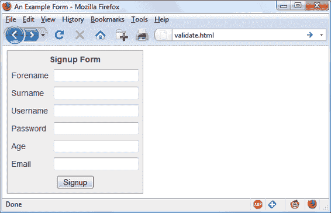
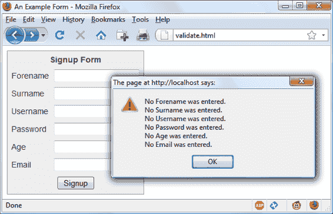
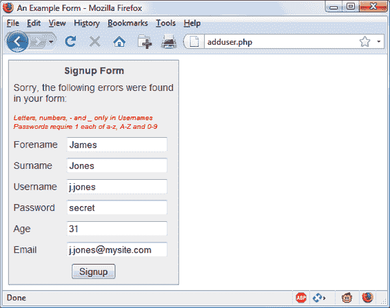

# 第十七章：JavaScript 和 PHP 验证与错误处理

有了你在 PHP 和 JavaScript 方面的坚实基础，现在是时候将这些技术结合起来，创建尽可能用户友好的 Web 表单了。

我们将使用 PHP 创建表单，并使用 JavaScript 执行客户端验证，以确保在提交之前数据尽可能完整和正确。然后 PHP 将对输入进行最终验证，必要时会再次向用户呈现表单以供进一步修改。

在这一过程中，本章将涵盖 JavaScript 和 PHP 中的验证和正则表达式。

# 使用 JavaScript 验证用户输入

JavaScript 验证应被视为更多地为用户提供帮助而不是为你的网站，因为，正如我已经强调过很多次的那样，你不能信任任何提交到服务器的数据，即使它已经通过 JavaScript 验证过。这是因为黑客可以相当容易地模拟你的 Web 表单并提交任意数据。

你不能完全依赖 JavaScript 来执行所有的输入验证的另一个原因是，一些用户禁用了 JavaScript，或者使用不支持 JavaScript 的浏览器。

因此，在 JavaScript 中最好的验证类型是检查字段是否有内容（如果不允许为空），确保电子邮件地址符合正确的格式，并确保输入的值在预期范围内。

## **验证.html** 文档（第一部分）

让我们从一个通用的注册表单开始，这在大多数提供会员或用户注册的网站上都很常见。请求的输入将是 *名*、*姓*、*用户名*、*密码*、*年龄* 和 *电子邮件地址*。示例 17-1 提供了这样一个表单的良好模板。

##### 示例 17-1\. 具有 JavaScript 验证的表单（第一部分）

```php
<!DOCTYPE html>
<html>
  <head>
    <title>An Example Form</title>
    <style>
      .signup {
        border:1px solid #999999;
        font:  normal 14px helvetica;
        color: #444444;
      }
    </style>
    `<script``>`
      `function` `validate``(``form``)`
      `{`
        `fail`  `=` `validateForename``(``form``.``forename``.``value``)`
        `fail` `+=` `validateSurname``(``form``.``surname``.``value``)`
        `fail` `+=` `validateUsername``(``form``.``username``.``value``)`
        `fail` `+=` `validatePassword``(``form``.``password``.``value``)`
        `fail` `+=` `validateAge``(``form``.``age``.``value``)`
        `fail` `+=` `validateEmail``(``form``.``email``.``value``)`

        `if`   `(``fail` `==` `""``)`   `return` `true`
        `else` `{` `alert``(``fail``)``;` `return` `false` `}`
      `}`
    `</script>`
  </head>
  <body>
    <table class="signup" border="0" cellpadding="2"
              cellspacing="5" bgcolor="#eeeeee">
      <th colspan="2" align="center">Signup Form</th>
      <form method="post" action="adduser.php" onsubmit="return validate(this)">
        <tr><td>Forename</td>
          <td><input type="text" maxlength="32" name="forename"></td></tr>
        <tr><td>Surname</td>
          <td><input type="text" maxlength="32" name="surname"></td></tr>
        <tr><td>Username</td>
          <td><input type="text" maxlength="16" name="username"></td></tr>
        <tr><td>Password</td>
          <td><input type="text" maxlength="12" name="password"></td></tr>
        <tr><td>Age</td>
          <td><input type="text" maxlength="3"  name="age"></td></tr>
        <tr><td>Email</td>
          <td><input type="text" maxlength="64" name="email"></td></tr>
        <tr><td colspan="2" align="center"><input type="submit"
          value="Signup"></td></tr>
      </form>
    </table>
  </body>
</html>
```

目前这个表单虽然可以正确显示，但并没有进行自我验证，因为主要的验证函数尚未添加。即便如此，请将其保存为 *validate.html*，当你在浏览器中调用它时，它将呈现为 图 17-1。



###### 图 17-1\. 来自 示例 17-1 的输出

让我们看看这个文档是如何组成的。开头几行设置了文档并使用了一些 CSS 使表单看起来不那么简单。接下来是与 JavaScript 相关的部分，用粗体显示。

在 `<script>` 和 `</script>` 标签之间有一个名为 `validate` 的函数，它调用其他六个函数来验证表单的每个输入字段。稍后我们会详细介绍这些函数。现在我只想解释一下，它们会返回空字符串（如果字段验证通过）或错误消息（如果验证失败）。如果存在任何错误，脚本的最后一行会弹出一个警告框显示这些错误。

在通过验证后，`validate` 函数返回 `true`；否则返回 `false`。`validate` 的返回值很重要，因为如果它返回 `false`，则会阻止表单的提交。这允许用户关闭警告弹出窗口并进行更改。如果返回 `true`，则表单字段中未遇到任何错误，因此表单会被提交。

这个示例的第二部分展示了表单的 HTML 结构，每个字段及其名称都放在表格的单独行中。这是相当直接的 HTML，唯一的例外是在开头的 `<form>` 标签中的 `onSubmit="return validate(this)"` 语句。使用 `onSubmit`，你可以在提交表单时调用自定义的函数。该函数可以进行一些检查，并返回 `true` 或 `false` 的值，以表示是否允许提交表单。

`this` 参数是当前对象（即此表单），并且正如前面讨论的，将其传递给 `validate` 函数。`validate` 函数接收此参数作为对象 `form`。

如你所见，表单的 HTML 中仅包含嵌入在 `onSubmit` 属性中的 `return` 调用的 JavaScript。禁用或不可用 JavaScript 的浏览器将简单地忽略 `onSubmit` 属性，并且 HTML 将正常显示。

## validate.html 文档（第二部分）

现在我们来到示例 17-2，这是六个执行实际表单字段验证的函数。我建议你键入所有这些内容的第二部分，并将其保存在示例 17-1 的 `<script>...</script>` 部分中，你应该已经将其保存为 *validate.html*。

##### 示例 17-2. 具有 JavaScript 验证的表单（第二部分）

```php
`function` `validateForename``(``field``)`
{
  return (field == "") ? "No Forename was entered.\n" : ""
}

`function` `validateSurname``(``field``)`
{
  return (field == "") ? "No Surname was entered.\n" : ""
}

`function` `validateUsername``(``field``)`
{
  if (field == "") return "No Username was entered.\n"
  else if (field.length < 5)
    return "Usernames must be at least 5 characters.\n"
  else if (/[^a-zA-Z0-9_-]/.test(field))
    return "Only a-z, A-Z, 0-9, - and _ allowed in Usernames.\n"
  return ""
}

`function` `validatePassword``(``field``)`
{
  if (field == "") return "No Password was entered.\n"
  else if (field.length < 6)
    return "Passwords must be at least 6 characters.\n"
  else if (!/[a-z]/.test(field) || ! /[A-Z]/.test(field) ||
           !/[0-9]/.test(field))
    return "Passwords require one each of a-z, A-Z and 0-9.\n"
  return ""
}

`function` `validateAge``(``field``)`
{
  if (field == "" || isNaN(field)) return "No Age was entered.\n"
  else if (field < 18 || field > 110)
    return "Age must be between 18 and 110.\n"
  return ""
}

`function` `validateEmail``(``field``)`
{
  if (field == "") return "No Email was entered.\n"
    else if (!((field.indexOf(".") > 0) &&
               (field.indexOf("@") > 0)) ||
              /[^a-zA-Z0-9.@_-]/.test(field))
      return "The Email address is invalid.\n"
  return ""
}
```

我们将依次讨论每个这些函数，从 `validateForename` 开始，这样你就能看到验证的工作原理。

### 验证名字

`validateForename` 是一个非常简短的函数，接受参数 `field`，该参数是由 `validate` 函数传递给它的名字的值。

如果此值为空字符串，则返回错误消息；否则，返回空字符串以表示未遇到错误。

如果用户在此字段中输入空格，则 `validateForename` 将接受它，尽管实际上它对所有目的而言是空的。你可以通过添加额外的语句来修复此问题，从字段中修剪空白字符然后检查它是否为空，或者使用正则表达式来确保字段中除空白字符外还有其他内容，或者——就像我在这里做的一样——让用户犯错，并允许 PHP 程序在服务器上捕获它。

### 验证姓氏

`validateSurname`函数与`validateForename`几乎相同，仅当提供的姓氏是空字符串时才返回错误。我选择不限制名称字段中允许的字符，以便包括非英语和带重音字符的可能性。

### 用户名验证

`validateUsername`函数稍微有趣，因为它的工作更复杂。它必须仅允许字符`a-z`、`A-Z`、`0-9`、`_`和`-`通过，并确保用户名至少为五个字符长。

`if...else`语句开始时，如果`field`未填写，则返回错误。如果不是空字符串，但长度少于五个字符，则返回另一条错误消息。

然后调用 JavaScript 的`test`函数，传递一个正则表达式（匹配任何不是允许字符之一的字符），与`field`进行匹配（参见“正则表达式”）。如果遇到不是允许字符之一的字符，则`test`函数返回`true`，因此`validateUser`返回错误字符串。

### 密码验证

`validatePassword`函数中使用类似的技术。首先，函数检查`field`是否为空，如果是，则返回错误。接下来，如果密码长度少于六个字符，则返回错误消息。

我们对密码施加的要求之一是，它们必须至少包含一个小写字母、一个大写字母和一个数字字符，因此`test`函数被调用三次，分别对这三种情况进行检查。如果其中任何一次调用返回`false`，则表示未满足其中一项要求，因此返回错误消息。否则，返回空字符串表示密码符合要求。

### 年龄验证

`validateAge`如果`field`不是数字（通过调用`isNaN`函数确定）或输入的年龄低于 18 或高于 110，则返回错误消息。您的应用程序可能具有不同或无年龄要求。同样，验证成功后返回空字符串。

### 邮件验证

在最后一个最复杂的示例中，电子邮件地址使用`validateEmail`进行验证。检查是否有实际输入内容，如果没有，则返回错误消息，函数将两次调用 JavaScript 的`indexOf`函数。第一次检查确保字段的第一个字符后面有一个句点（`.`），第二次检查确保`@`符号在第一个字符后面出现。

如果这两个检查都满足，将调用`test`函数来查看字段中是否有任何不允许的字符出现。如果这些测试中有任何失败，将返回一个错误消息。电子邮件地址中允许的字符是大写字母、小写字母、数字以及`_`、`-`、句点和`@`字符，如传递给`test`方法的正则表达式详细说明的那样。如果没有发现错误，则返回空字符串表示验证成功。在最后一行，关闭了脚本和文档。

图 17-2 显示了用户在没有填写任何字段的情况下单击注册按钮的结果。



###### 图 17-2\. JavaScript 表单验证实例

### 使用单独的 JavaScript 文件

当然，因为它们在结构上是通用的，并且可能适用于你可能需要的许多类型的验证，这六个函数是将理想的候选项移出到一个单独的 JavaScript 文件中。你可以将文件命名为*validate_functions.js*，并在示例 17-1 的初始脚本部分之后直接包含它，使用以下语句：

```php
<script src="validate_functions.js"></script>
```

# 正则表达式

让我们更仔细地查看我们一直在进行的模式匹配。我们已经通过*正则表达式*实现了它，这在 JavaScript 和 PHP 中都受支持。它们使得能够在一个表达式中构造最强大的模式匹配算法成为可能。

## 通过元字符匹配

每个正则表达式都必须用斜杠括起来。在这些斜杠内部，某些字符具有特殊含义；它们被称为*元字符*。例如，星号（`*`）的含义类似于你在使用 Shell 或 Windows 命令提示符时看到的（但不完全相同）。星号表示“你尝试匹配的文本可以有任意数量的前导字符——或者根本没有。”

例如，假设你正在寻找姓名*Le Guin*，并且知道有些人可能会带空格或者不带空格拼写。因为文本布局很奇怪（例如，有人可能插入额外的空格来右对齐行），你可能需要搜索类似这样的一行：

```php
The   difficulty  of   classifying Le      Guin's    works
```

所以你需要匹配*LeGuin*，以及用任意数量的空格分隔的*Le*和*Guin*。解决方案是在空格后面跟随一个星号：

```php
/Le *Guin/
```

在那一行中除了姓名*Le Guin*之外还有很多内容，但没关系。只要正则表达式匹配行的某些部分，`test`函数就会返回一个`true`值。如果确保行中仅包含*Le Guin*很重要，稍后我会告诉你如何确保这一点。

假设你知道至少有一个空格。在这种情况下，你可以使用加号（`+`），因为它需要至少一个前导字符：

```php
/Le +Guin/
```

## 模糊字符匹配

点号（`.`）特别有用，因为它可以匹配除换行符以外的任何内容。假设您正在寻找以`<`开头、以`>`结尾的 HTML 标签。这里展示了一个简单的方法：

```php
/<.*>/
```

点号匹配任何字符，而`*`扩展它以匹配零个或多个字符，因此它表示：“匹配介于`<`和`>`之间的任何内容，即使其中什么也没有。” 您将匹配`<>`、`<em>`、`<br>`等等。但如果您不想匹配空情况`<>`，您应该使用`+`而不是`*`，如下所示：

```php
/<.+>/
```

加号扩展了点号以匹配一个或多个字符，即表示：“匹配介于`<`和`>`之间的任何内容，只要它们之间至少有一个字符。” 您将匹配到`<em>`和`</em>`，`<h1>`和`</h1>`，以及带有属性的标签，如下所示：

```php
<a href="www.mozilla.org">
```

不幸的是，加号会持续匹配直到行尾的最后一个`>`，因此您可能会得到如下结果：

```php
<h1><b>Introduction</b></h1>
```

不仅仅是一个标签！稍后在本节中我将展示一个更好的解决方案。

###### 注意

如果您在尖括号之间单独使用点号，而不是跟随一个`+`或`*`，那么它将匹配单个字符；您将匹配到`<b>`和`<i>`，但*不会*匹配`<em>`或`<textarea>`。

如果要匹配点号字符本身（`.`），必须在其前面放置反斜杠（`\`）进行转义，因为否则它是一个元字符，可以匹配任何内容。例如，假设您想匹配浮点数`5.0`，则正则表达式如下：

```php
/5\.0/
```

反斜杠可以转义任何元字符，包括另一个反斜杠（如果您试图在文本中匹配反斜杠）。不过，有点让人困惑的是，稍后您将看到反斜杠有时会赋予其后的字符特殊含义。

我们刚刚匹配了一个浮点数。但也许您想匹配`5.`以及`5.0`，因为它们在浮点数表示上是相同的。您还想匹配`5.00`、`5.000`等，允许任意数量的零。您可以通过添加一个星号来实现，正如您所见：

```php
/5\.0*/
```

## 通过括号进行分组

假设您想匹配单位增量的幂，例如 kilo、mega、giga 和 tera。换句话说，您希望以下所有内容都匹配：

```php
1,000
1,000,000
1,000,000,000
1,000,000,000,000
...
```

加号在这里也适用，但您需要将字符串`,000`进行分组，以便加号匹配整个内容。正则表达式如下：

```php
/1(,000)+ /
```

括号意味着“在应用加号等操作时将其视为一个组”。`1,00,000`和`1,000,00`不会匹配，因为文本必须包含一个 1，后跟一个或多个逗号，后跟三个零的完整组。

加号后面的空格表示匹配在遇到空格时必须结束。如果没有它，`1,000,00`会因为只考虑到第一个`1,000`而错误匹配，而剩下的`,00`会被忽略。要求后面有空格确保匹配将持续到数字的末尾。

## 字符类

有时你想匹配模糊的内容，但又不想使用点号匹配得太广泛。正则表达式的伟大之处在于它们允许你尽可能精确或模糊地匹配。

支持模糊匹配的关键特性之一是方括号对，`[]`。它匹配单个字符，像点号一样，但是在方括号内你放的是一个可以匹配的列表。如果这些字符中的任何一个出现，文本就匹配。例如，如果你想匹配美式拼写*gray*和英式拼写*grey*，你可以指定如下内容：

```php
/gr[ae]y/
```

在你匹配的文本中的`gr`后面，可以是`a`或`e`。但必须只有一个：方括号里放的东西刚好匹配一个字符。方括号里的字符组称为*字符类*。

## 指示范围

在方括号内，你可以使用连字符（`-`）来表示一个范围。一个非常常见的任务是匹配单个数字，你可以用范围来做到如下所示：

```php
/[0-9]/
```

数字在正则表达式中是如此常见，以至于提供了一个单字符来代表它们：`\d`。你可以用它代替方括号中的正则表达式来匹配一个数字：

```php
/\d/
```

## 否定

方括号的另一个重要特性是对字符类的*否定*。你可以通过在开放的方括号后面放置一个插入符号（`^`）来颠倒整个字符类。这里的意思是“匹配任何字符*除了*以下内容”。所以，假设你想找到缺少以下感叹号的*Yahoo*实例。（公司的官方名称中正式包含一个感叹号！）你可以像这样做：

```php
/Yahoo[^!]/
```

字符类别由一个单字符组成——一个感叹号，但它被前面的`^`反转。这实际上并不是解决问题的好方法——例如，如果*Yahoo*在行尾，它就不再后面跟着*任何东西*，而方括号必须匹配一个字符。一个更好的解决方案涉及到负向*前瞻*（匹配后面没有其他东西的内容），但这超出了本书的范围，请参考[在线文档](https://tinyurl.com/regexdocs)。

## 一些更复杂的例子

了解字符类和否定后，你现在准备好看到更好的解决方案来匹配 HTML 标签的问题了。这个解决方案避免了越过单个标签的末尾，但仍然匹配像`<em>`和`</em>`这样的标签，以及带属性的标签，比如这样的：

```php
<a href="www.mozilla.org">
```

这是一个解决方案：

```php
/<[^>]+>/
```

那个正则表达式看起来好像我把茶杯掉在键盘上，但它是完全有效和非常有用的。让我们分解它。图 17-3 展示了各个元素，我会逐一描述它们。


###### 图 17-3\. 典型正则表达式的分解

元素如下：

<dfn class="keep-together">`/`</dfn>

指示这是正则表达式的开头斜杠。

<dfn class="keep-together">`<`</dfn>

HTML 标签的开始括号。这是精确匹配；不是元字符。

<dfn class="keep-together">`[^>]`</dfn>

字符类。嵌入的`^>`表示“匹配除了闭合尖括号之外的任何内容”。

<dfn class="keep-together">`+`</dfn>

允许任意数量的字符匹配前一个`[^>]`，但至少要有一个。

<dfn class="keep-together">`>`</dfn>

HTML 标签的闭合括号。这是精确匹配。

<dfn class="keep-together">`/`</dfn>

表示正则表达式的结束斜杠。

###### 注意

另一个解决匹配 HTML 标签问题的方法是使用非贪婪操作。默认情况下，模式匹配是贪婪的，返回可能的最长匹配。非贪婪（或惰性）匹配找到可能的最短匹配。这本书不涉及其使用，但可以在[JavaScript.info website](https://tinyurl.com/regexgreedy)上找到更多细节。

我们现在将查看来自 Example 17-1 中的表达式之一，其中使用了`validateUsername`函数：

```php
/[^a-zA-Z0-9_-]/
```

Figure 17-4 显示了各种元素。


###### 图 17-4. `validateUsername`正则表达式的详细分解

让我们详细看看这些元素：

<dfn class="keep-together">`/`</dfn>

指示这是正则表达式的开头斜杠。

<dfn class="keep-together">`[`</dfn>

开始字符类的开放方括号。

<dfn class="keep-together">`^`</dfn>

反向字符：反转方括号内的所有其他内容。

<dfn class="keep-together">`a-z`</dfn>

表示任何小写字母。

<dfn class="keep-together">`A-Z`</dfn>

表示任何大写字母。

<dfn class="keep-together">`0-9`</dfn>

表示任何数字。

<dfn class="keep-together">`_`</dfn>

一个下划线。

<dfn class="keep-together">`-`</dfn>

一个破折号。

<dfn class="keep-together">`]`</dfn>

结束字符类的闭合括号。

<dfn class="keep-together">`/`</dfn>

表示正则表达式的结束斜杠。

还有两个重要的元字符。它们通过要求出现在特定位置来“锚定”正则表达式。如果`^`出现在正则表达式的开头，则表达式必须出现在文本行的开头；否则，它不匹配。同样地，如果`$`符号出现在正则表达式的末尾，则表达式必须出现在文本行的末尾。

###### 注意

可能会有些混淆，`^`在方括号内可以表示“否定字符类”，而在正则表达式的开头可以表示“匹配行的开头”。不幸的是，同一个字符用于两种不同的含义，因此在使用时要小心。

我们将通过回答前面提出的问题来完成对正则表达式基础的探索：假设你想确保一行除了正则表达式之外没有任何其他内容，该怎么办？如果你想要一个包含“Le Guin”而没有其他内容的行？我们可以通过修改先前的正则表达式来实现这一点，将两端锚定：

```php
/^Le *Guin$/
```

## 元字符总结

表 17-1 展示了正则表达式中可用的元字符。

表 17-1\. 正则表达式元字符

| 元字符 | 描述 |
| --- | --- |
| `/` | 开始和结束正则表达式 |
| `.` | 匹配除换行符外的任何单个字符 |
| ``*`元素`**`` | 匹配零次或多次的*`元素`* |
| ``*`元素`*+`` | 匹配至少一次的*`元素`* |
| ``*`元素`*?`` | 匹配零次或一次的*`元素`* |
| ``[*`字符`*]`` | 匹配括号内的任意字符 |
| ``[^*`字符`*]`` | 匹配不在括号内的单个字符 |
| ``(*`正则表达式`*)`` | 将*`正则表达式`*视为计数或后续 `*`、`+` 或 `?` 的组 |
| ``*`左`*&#124;*`右`*`` | 匹配*`左`*或*`右`* |
| ``[*`l`*-*`r`*]`` | 匹配介于*`l`*和*`r`*之间的字符范围 |
| `^` | 要求匹配字符串的开头 |
| `$` | 要求匹配字符串的结尾 |
| `\b` | 匹配单词边界 |
| `\B` | 匹配非单词边界 |
| `\d` | 匹配单个数字 |
| `\D` | 匹配单个非数字字符 |
| `\n` | 匹配换行符 |
| `\s` | 匹配空白字符 |
| `\S` | 匹配非空白字符 |
| `\t` | 匹配制表符 |
| `\w` | 匹配单词字符（`a-z`、`A-Z`、`0-9` 和 `_`） |
| `\W` | 匹配非单词字符（除了 `a-z`、`A-Z`、`0-9` 和 `_` 以外的任何字符） |
| ``\*`x`*`` | 匹配*`x`*（如果*`x`*是元字符，但你真正想要的是*`x`*） |
| ``{*`n`*}`` | 精确匹配*`n`*次 |
| ``{*`n`*,}`` | 匹配至少*`n`*次或更多 |
| ``{*`最小`*,*`最大`*}`` | 匹配至少*`最小`*次，最多*`最大`*次 |

通过这张表格的提供，并重新审视表达式 `/[^a-zA-Z0-9_]/`，你可以看到它很容易被简化为 `/[^\w]/`，因为小写 `w` 的单个元字符 `\w` 指定了字符 `a-z`、`A-Z`、`0-9` 和 `_`。

实际上，我们可以比这更聪明，因为元字符 `\W`（大写 `W`）指定除了 `a-z`、`A-Z`、`0-9` 和 `_` 之外的所有字符。因此，我们也可以省略 `^` 元字符，直接使用 `/[\W]/` 或者甚至进一步简化为 `/\W/`，因为它只匹配单个字符。

为了让你更清楚地了解这一切是如何工作的，表 17-2 展示了一系列表达式及其匹配的模式。

表 17-2\. 一些示例正则表达式

| 示例 | 匹配结果 |
| --- | --- |
| `r` | *The quick brown* 中的第一个 *r* |
| `rec[ei][ei]ve` | *receive* 或 *recieve*（同时也包括 *receeve* 或 *reciive*） |
| `rec[ei]{2}ve` | *receive* 或 *recieve*（同时也包括 *receeve* 或 *reciive*） |
| `rec(ei&#124;ie)ve` | *receive* 或 *recieve*（但不是 *receeve* 或 *reciive*） |
| `cat` | *I like cats and dogs* 中的单词 *cat* |
| `cat&#124;dog` | *I like cats and dogs* 中的单词 *cat*（匹配先遇到的 *cat* 或 *dog*） |
| `\.` | `.`（因为`.`是一个元字符，所以`\`是必需的） |
| `5\.0*` | *5.*、*5.0*、*5.00*、*5.000* 等 |
| `[a-f]` | 任意字符 *a*, *b*, *c*, *d*, *e*, 或 *f* 中的一个 |
| `cats$` | *My cats are friendly cats* 中的最后一个 *cats* |
| `^my` | 只匹配 *my cats are my pets* 中的第一个 *my* |
| `\d{2,3}` | 任意两到三位数字（*00* 到 *999*） |
| `7(,000)+` | *7,000*、*7,000,000*、*7,000,000,000*、*7,000,000,000,000* 等 |
| `[\w]+` | 任意一个或多个字符的单词 |
| `[\w]{5}` | 任意五个字母的单词 |

## 通用修饰符

一些额外的修饰符可用于正则表达式：

+   `/g` 使得匹配为全局匹配。在使用替换函数时，要指定此修饰符以替换所有匹配项，而不仅仅是第一个。

+   `/i` 使得正则表达式匹配时忽略大小写。因此，可以用 `/[a-z]/i` 或 `/[A-Z]/i` 替代 `/[a-zA-Z]/`。

+   `/m` 使得多行模式启用，在这种模式下，插入符 (`^`) 和美元符 (`$`) 将在主题字符串中的任何新行之前和之后匹配。通常情况下，多行字符串中，`^` 仅匹配字符串的开始，`$` 仅匹配字符串的结尾。

例如，表达式 `/cats/g` 将匹配句子 “I like cats, and cats like me.” 中的两个 *cats*。同样，表达式 `/dogs/gi` 将匹配句子 “Dogs like other dogs.” 中的两个 *dogs*（*Dogs* 和 *dogs*），因为你可以结合使用这些修饰符。

## 在 JavaScript 中使用正则表达式

在 JavaScript 中，你将主要使用两种方法来处理正则表达式：`test`（你已经见过）和 `replace`。`test` 方法仅告诉你其参数是否与正则表达式匹配，而 `replace` 则需要第二个参数：替换匹配文本的字符串。与大多数函数一样，`replace` 返回一个新字符串作为其返回值；它不会改变输入。

为了比较这两种方法，以下语句返回 `true`，告诉我们 *cats* 这个词在字符串中至少出现一次。

```php
document.write(/cats/i.test("Cats are funny. I like cats."))
```

但以下语句将两次出现的 *cats* 替换为 *dogs*，并打印结果。搜索必须是全局的 (`/g`) 才能找到所有匹配，且大小写不敏感 (`/i`) 才能找到大写 *Cats*：

```php
document.write("Cats are friendly. I like cats.".replace(/cats/gi,"dogs"))
```

如果您尝试这个语句，您会看到 `replace` 的一个限制：因为它精确地使用您告诉它使用的字符串替换文本，所以第一个单词 *Cats* 被替换为 *dogs* 而不是 *Dogs*。

## 在 PHP 中使用正则表达式

在 PHP 中，您可能会经常使用的正则表达式函数是 `preg_match`、`preg_match_all` 和 `preg_replace`。

要测试字符串中是否出现单词 *cats*，不论大小写，您可以像这样使用 `preg_match`：

```php
$n = preg_match("/cats/i", "Cats are crazy. I like cats.");
```

由于 PHP 使用 `1` 表示 `TRUE`，使用 `0` 表示 `FALSE`，所以上述语句将 `$n` 设置为 `1`。第一个参数是正则表达式，第二个参数是要匹配的文本。但是 `preg_match` 实际上更加强大和复杂，因为它接受第三个参数，显示匹配的文本是什么：

```php
$n = preg_match("/cats/i", "Cats are curious. I like cats.", $match);
echo "$n Matches: $match[0]";
```

第三个参数是一个数组（在这里，命名为 `$match`）。函数将匹配的文本放入第一个元素中，因此如果匹配成功，您可以在 `$match[0]` 中找到匹配的文本。在这个例子中，输出告诉我们匹配的文本是大写的：

```php
1 Matches: Cats
```

如果您希望查找所有匹配项，可以使用 `preg_match_all` 函数，如下所示：

```php
$n = preg_match_all("/cats/i", "Cats are strange. I like cats.", $match);
echo "$n Matches: ";
for ($j=0 ; $j < $n ; ++$j) echo $match[0][$j]." ";
```

与之前一样，将 `$match` 传递给函数，并将元素 `$match[0]` 分配为所做的匹配，但这次作为子数组。为了显示子数组，这个例子使用 `for` 循环进行迭代。

当您想要替换字符串的一部分时，可以使用 `preg_replace`，如此例所示。这个例子替换了所有出现的单词 *cats*，不区分大小写地替换为 *dogs*：

```php
echo preg_replace("/cats/i", "dogs", "Cats are furry. I like cats.");
```

###### 注意

正则表达式的主题是一个庞大的主题，已经有整本书写关于它。如果您需要进一步的信息，我建议查看 [维基百科条目](http://bit.ly/regex-wiki) 或 *[Regular-Expressions.info](https://www.regular-expressions.info)*。

# 重新显示 PHP 验证后的表单

好的，回到表单验证。到目前为止，我们已经创建了 HTML 文档 *validate.html*，它将通过到 PHP 程序 *adduser.php*，但只有当 JavaScript 验证字段或 JavaScript 禁用或不可用时。

现在是时候创建 *adduser.php*，接收提交的表单，执行自己的验证，如果验证失败则再次向访客显示表单。示例 17-3 包含了您应该输入和保存的代码（或从配套网站下载）。

##### 示例 17-3\. adduser.php 程序

```php
<?php // adduser.php 
  `// The PHP code`

  `$forename` `=` `$surname` `=` `$username` `=` `$password` `=` `$age` `=` `$email` `=` `"``"``;`

  `if` `(``isset``(``$_POST``[``'forename'``]))`
    `$forename` `=` `fix_string``(``$_POST``[``'forename'``]);`
  `if` `(``isset``(``$_POST``[``'surname'``]))`
    `$surname`  `=` `fix_string``(``$_POST``[``'surname'``]);`
  `if` `(``isset``(``$_POST``[``'username'``]))`
    `$username` `=` `fix_string``(``$_POST``[``'username'``]);`
  `if` `(``isset``(``$_POST``[``'password'``]))`
    `$password` `=` `fix_string``(``$_POST``[``'password'``]);`
  `if` `(``isset``(``$_POST``[``'age'``]))`
    `$age`      `=` `fix_string``(``$_POST``[``'age'``]);`
  `if` `(``isset``(``$_POST``[``'email'``]))`
    `$email`    `=` `fix_string``(``$_POST``[``'email'``]);`

  `$fail`  `=` `validate_forename``(``$forename``);`
  `$fail` `.=` `validate_surname``(``$surname``);`
  `$fail` `.=` `validate_username``(``$username``);`
  `$fail` `.=` `validate_password``(``$password``);`
  `$fail` `.=` `validate_age``(``$age``);`
  `$fail` `.=` `validate_email``(``$email``);`

  `echo` `"``<!DOCTYPE html>``\n``<html><head><title>An Example Form</title>``"``;`

  `if` `(``$fail` `==` `"``"``)`
  `{`
    `echo` `"``</head><body>Form data successfully validated:`
      `$forename``,` `$surname``,` `$username``,` `$password``,` `$age``,` `$email``.</body></html>``"``;`

    `// This is where you would enter the posted fields into a database,`
    `// preferably using hash encryption for the password.`

    `exit``;`
  `}`

  `echo` `<<<_END` <!-- The HTML/JavaScript section -->

    <style>
      .signup {
        border: 1px solid #999999;
      font:   normal 14px helvetica; color:#444444;
      }
    </style>

    <script>
      function validate(form)
      {
        fail  = validateForename(form.forename.value)
        fail += validateSurname(form.surname.value)
        fail += validateUsername(form.username.value)
        fail += validatePassword(form.password.value)
        fail += validateAge(form.age.value)
        fail += validateEmail(form.email.value)

        if (fail == "")     return true
        else { alert(fail); return false }
      }

      function validateForename(field)
      {
        return (field == "") ? "No Forename was entered.\\n" : ""
      }

      function validateSurname(field)
      {
        return (field == "") ? "No Surname was entered.\\n" : ""
      }

      function validateUsername(field)
      {
        if (field == "") return "No Username was entered.\\n"
        else if (field.length < 5)
          return "Usernames must be at least 5 characters.\\n"
        else if (/[^a-zA-Z0-9_-]/.test(field))
          return "Only a-z, A-Z, 0-9, - and _ allowed in Usernames.\\n"
        return ""
      }

      function validatePassword(field)
      {
        if (field == "") return "No Password was entered.\\n"
        else if (field.length < 6)
          return "Passwords must be at least 6 characters.\\n"
        else if (!/[a-z]/.test(field) || ! /[A-Z]/.test(field) ||
                 !/[0-9]/.test(field))
          return "Passwords require one each of a-z, A-Z and 0-9.\\n"
        return ""
      }

      function validateAge(field)
      {
        if (isNaN(field)) return "No Age was entered.\\n"
        else if (field < 18 || field > 110)
          return "Age must be between 18 and 110.\\n"
        return ""
      }

      function validateEmail(field)
      {
        if (field == "") return "No Email was entered.\\n"
          else if (!((field.indexOf(".") > 0) &&
                     (field.indexOf("@") > 0)) ||
                    /[^a-zA-Z0-9.@_-]/.test(field))
            return "The Email address is invalid.\\n"
        return ""
      }
    </script>
  </head>
  <body>

    <table border="0" cellpadding="2" cellspacing="5" bgcolor="#eeeeee">
      <th colspan="2" align="center">Signup Form</th>

        <tr><td colspan="2">Sorry, the following errors were found<br>
          in your form: <p><font color=red size=1><i>$fail</i></font></p>
        </td></tr>

      <form method="post" action="adduser.php" onSubmit="return validate(this)">
        <tr><td>Forename</td>
          <td><input type="text" maxlength="32" name="forename" value="$forename">
        </td></tr><tr><td>Surname</td>
          <td><input type="text" maxlength="32" name="surname"  value="$surname">
        </td></tr><tr><td>Username</td>
          <td><input type="text" maxlength="16" name="username" value="$username">
        </td></tr><tr><td>Password</td>
          <td><input type="text" maxlength="12" name="password" value="$password">
        </td></tr><tr><td>Age</td>
          <td><input type="text" maxlength="3"  name="age"      value="$age">
        </td></tr><tr><td>Email</td>
          <td><input type="text" maxlength="64" name="email"    value="$email">
        </td></tr><tr><td colspan="2" align="center"><input type="submit"
          value="Signup"></td></tr>
      </form>
    </table>
  </body>
</html>

_END; 
  `// The PHP functions`

  `function` `validate_forename``(``$field``)`
  `{`
    `return` `(``$field` `==` `"``"``)` `?` `"``No Forename was entered<br>``"``:` `"``"``;`
  `}`

  `function` `validate_surname``(``$field``)`
  `{`
    `return``(``$field` `==` `"``"``)` `?` `"``No Surname was entered<br>``"` `:` `"``"``;`
  `}`

  `function` `validate_username``(``$field``)`
  `{`
    `if` `(``$field` `==` `"``"``)` `return` `"``No Username was entered<br>``"``;`
    `else` `if` `(``strlen``(``$field``)` `<` `5``)`
      `return` `"``Usernames must be at least 5 characters<br>``"``;`
    `else` `if` `(``preg_match``(``"``/[^a-zA-Z0-9_-]/``"``,` `$field``))`
      `return` `"``Only letters, numbers, - and _ in usernames<br>``"``;`
    `return` `"``"``;`
  `}`

  `function` `validate_password``(``$field``)`
  `{`
    `if` `(``$field` `==` `"``"``)` `return` `"``No Password was entered<br>``"``;`
    `else` `if` `(``strlen``(``$field``)` `<` `6``)`
      `return` `"``Passwords must be at least 6 characters<br>``"``;`
    `else` `if` `(``!``preg_match``(``"``/[a-z]/``"``,` `$field``)` `||`
             `!``preg_match``(``"``/[A-Z]/``"``,` `$field``)` `||`
             `!``preg_match``(``"``/[0-9]/``"``,` `$field``))`
      `return` `"``Passwords require 1 each of a-z, A-Z and 0-9<br>``"``;`
    `return` `"``"``;`
  `}`

  `function` `validate_age``(``$field``)`
  `{`
    `if` `(``$field` `==` `"``"``)` `return` `"``No Age was entered<br>``"``;`
    `else` `if` `(``$field` `<` `18` `||` `$field` `>` `110``)`
      `return` `"``Age must be between 18 and 110<br>``"``;`
    `return` `"``"``;`
  `}`

  `function` `validate_email``(``$field``)`
  `{`
    `if` `(``$field` `==` `"``"``)` `return` `"``No Email was entered<br>``"``;`
      `else` `if` `(``!``((``strpos``(``$field``,` `"``.``"``)` `>` `0``)` `&&`
                 `(``strpos``(``$field``,` `"``@``"``)` `>` `0``))` `||`
                  `preg_match``(``"``/[^a-zA-Z0-9.@_-]/``"``,` `$field``))`
        `return` `"``The Email address is invalid<br>``"``;`
    `return` `"``"``;`
  `}`

  `function` `fix_string``(``$string``)`
  `{`
    `if` `(``get_magic_quotes_gpc``())` `$string` `=` `stripslashes``(``$string``);`
    `return` `htmlentities` `(``$string``);`
  `}`
?>
```

###### 注意

在这个例子中，所有输入在使用前都经过了净化处理，甚至包括密码，因为密码可能包含用于格式化 HTML 的字符，将被转换为 HTML 实体。例如，`&` 将变成 `&amp;`，`<` 将变成 `&lt;`，依此类推。如果将使用哈希函数存储加密密码，只要稍后检查输入的密码时以相同方式进行净化处理，这将不成问题，因此将可以比较相同的输入。

在禁用 JavaScript 并且两个字段填写不正确的情况下提交表单的结果显示在 图 17-5 中。



###### 图 17-5\. PHP 验证失败后表单的呈现方式

我已经将这段代码的 PHP 部分（以及对 HTML 部分的更改）用粗体标记，以便你更清楚地看到这与示例 17-1 和 17-2 之间的区别。

如果你浏览过这个示例，或者从 [书中的示例存储库](https://github.com/RobinNixon/lpmj6) 中下载或者键入它，你会看到 PHP 代码几乎是 JavaScript 代码的克隆；相似的函数用于验证每个字段的正则表达式。

但有几点需要注意。首先，`fix_string` 函数（就在最后）用于清理每个字段，防止任何代码注入尝试成功。

此外，你会看到 HTML 来自于 示例 17-1，在 PHP 代码中通过 `<<<_END..._END;` 结构重复显示表单，展示上次访问者输入的值。你只需简单地为每个 `<input>` 标签添加额外的 `value` 参数（例如 `value="$forename"`）即可做到这一点。强烈建议这样做，这样用户只需编辑先前输入的值，而无需再次在字段中输入这些值。

###### 注意

在现实世界中，你可能不会从 示例 17-1 这样的 HTML 表单开始。相反，你更可能直接编写 示例 17-3 中包含所有 HTML 的 PHP 程序。当然，对于第一次调用程序时需要进行一些微小的调整，以防止在所有字段为空时显示错误。此外，你可能还会将六个 JavaScript 函数放入它们自己的 *.js* 文件中进行单独包含，正如 “使用单独的 JavaScript 文件” 中所述。

现在你已经看到如何将 PHP、HTML 和 JavaScript 结合在一起，下一章将介绍*Ajax*（异步 JavaScript 和 XML），它利用 JavaScript 在后台向服务器发出调用，无缝更新网页的部分内容，而无需重新提交整个页面到服务器。

# 问题

1.  在提交之前，你可以使用什么 JavaScript 方法来发送表单进行验证？

1.  用于将字符串与正则表达式匹配的 JavaScript 方法是什么？

1.  编写一个正则表达式来匹配任何不符合正则表达式语法定义的单词字符。

1.  编写一个正则表达式来匹配单词*fox*或*fix*中的任意一个。

1.  编写一个正则表达式来匹配任意单词后面紧跟任何非单词字符。

1.  使用正则表达式，编写一个 JavaScript 函数来测试字符串`The quick brown fox`中是否存在单词*fox*。

1.  使用正则表达式，编写一个 PHP 函数，在字符串`The cow jumps over the moon`中将所有出现的单词*the*替换为*my*。

1.  哪个 HTML 属性用于在表单字段中预先填充值？

参见《“第十七章答案”》（app01_split_016.xhtml#chapter_17_answers）附录 A 中的解答。
