# 第二十章：使用 CSS3 实现高级 CSS

CSS 的第一个实现是在 1996 年起草，并于 1999 年发布；自 2001 年以来，所有浏览器版本都支持它。这个版本的标准（CSS1）在 2008 年进行了修订。1998 年，开发人员开始起草第二个规范（CSS2）；其标准在 2007 年完成，并在 2009 年进行了修订。

CSS3 规范的开发始于 2001 年，一些功能于 2009 年提出，最新的推荐截至 2020 年仍在进行中。

CSS4 已由 CSS 工作组提出，尽管这并非一个重大进步。相反，它只是 CSS 的一部分——选择器的发展，其内容超出了本书的范围，因为到我写这篇文章时，2021 年仍在进行推荐。如果你感兴趣，可以访问 [drafts.csswg.org 上的资源](https://tinyurl.com/l4selectors)。

幸运的是，CSS 工作组定期发布它认为稳定的 CSS 模块的快照。迄今为止，已发布了四份最佳实践文件，最近的一份是[2020 年](https://w3.org/TR/css-2020)。这是了解 CSS 当前状况的最佳途径。

在本章中，我将带你了解主要浏览器已采纳的最重要的 CSS3 特性，其中许多提供了此前只能通过 JavaScript 实现的功能。

我建议尽可能使用 CSS3 实现动态特性，而不是 JavaScript。CSS 提供的特性使文档属性成为文档本身的一部分，而不是通过 JavaScript 添加的附加部分。这样设计更加清晰。

###### 注意

必须指出的是，CSS 包含非常多的内容，各浏览器对各种功能的实现方式也有所不同（甚至可能完全不同）。因此，我建议在您希望确保所创建的 CSS 在所有浏览器中正常工作时，首先查看[Can I use... 网站](http://caniuse.com)。该网站记录了各种功能在各浏览器中的支持情况，因此它始终比这本书更加及时更新，而 CSS 在这段时间内也可能有很大变化。

# 属性选择器

在前一章中，我详细介绍了各种 CSS 属性选择器，现在我将快速回顾一下。选择器在 CSS 中用于匹配 HTML 元素，共有 10 种不同类型，如表 20-1 所示。

表 20-1\. CSS 选择器、伪类和伪元素

| 选择器类型 | 示例 |
| --- | --- |
| 通用选择器 | `* { color:#555; }` |
| 类型选择器 | `.classname { color:blue; }` |
| 类选择器 | `.classname { color:blue; }` |
| ID 选择器 | `#id` `{ background:cyan; }` |
| 后代选择器 | `span em { color:green; }` |
| 子选择器 | `div > em { background:lime; }` |
| 相邻兄弟选择器 | `i + b { color:gray; }` |
| 属性选择器 | `a[href='info.htm'] { color:red; }` |
| 伪类 | `a:hover { font-weight:bold; }` |
| 伪元素 | `P::first-letter { font-size:300%; }` |

CSS3 设计师们决定这些选择器中的大多数工作方式良好，但进行了三项增强，使您可以更轻松地基于属性内容匹配元素。以下各节详细讨论这些增强功能。

## 匹配字符串的部分

在 CSS2 中，您可以使用诸如 `a[href='info.htm']` 的选择器来匹配 `href` 属性中出现的字符串 `info.htm`，但无法仅匹配字符串的 *部分*。CSS3 提供了三个新运算符：`^`、`$` 和 `*`。如果其中一个直接位于 `=` 符号之前，则可以分别匹配字符串的开头、结尾或任何部分。

### 运算符 `^=` 

此运算符匹配字符串的开头。例如，以下内容将匹配任何`href`属性其值以字符串`http://website`开头的情况：

```php
a[href^='http://website']
```

因此，以下元素将匹配：

```php
<a href='http://website.com'>
```

但这并不会：

```php
<a href='http://mywebsite.com'>
```

### 运算符 `$=`

要仅匹配字符串的结尾，可以使用类似以下选择器，将匹配任何`img`标签其`src`属性以`.png`结尾的情况：

```php
img[src$='.png']
```

例如，以下内容将匹配：

```php

```

但这并不会：

```php

```

### 运算符 `*=`

要匹配属性中任何位置的任何子字符串，可以使用类似以下选择器，它找到页面上任何链接并在其中任何位置包含字符串`google`的情况：

```php
a[href*='google']
```

例如，HTML 片段 `<a href='http://google.com'>` 将会匹配，而片段 `<a href='http://gmail.com'>` 则不会。

# 属性 `box-sizing`

W3C 盒模型指定对象的宽度和高度应仅引用元素内容的尺寸，而忽略任何填充或边框。但一些网页设计师希望指定引用整个元素（包括任何填充和边框）的尺寸。

为了提供此功能，CSS3 允许您使用 `box-sizing` 属性选择希望使用的盒模型。例如，要使用包括填充和边框在内的对象总宽度和高度，请使用此声明：

```php
box-sizing:border-box;
```

或者，要使对象的宽度和高度仅引用其内容，请使用此声明（默认情况）：

```php
box-sizing:content-box;
```

# CSS3 背景

CSS3 提供了两个新属性：`background-clip` 和 `background-origin`。它们之间，您可以指定背景应从元素内的何处开始，并如何剪切背景，以使其不显示在不需要的盒模型部分。

要实现这一点，这两个属性都支持以下值：

`<dfn class="keep-together">`border-box`</dfn>`

指的是边框的外边缘

`<dfn class="keep-together">`padding-box`</dfn>`

指的是填充区域的外边缘

`<dfn class="keep-together">`content-box`</dfn>`

指的是内容区域的外边缘

## 属性 `background-clip`

`background-clip`属性指定了如果背景出现在元素的边框或填充区域内，则应该被忽略（剪切）。例如，以下声明指定背景可以显示在元素的所有部分，直到边框的外缘：

```php
background-clip:border-box;
```

要防止背景出现在元素的边框区域内，可以将其限制为仅出现在其填充区域外缘内的元素部分，如下所示：

```php
background-clip:padding-box;
```

或者要限制背景仅显示在元素的内容区域内，请使用以下声明：

```php
background-clip:content-box;
```

图 20-1 显示了在 Safari 网页浏览器中显示的三行元素，第一行使用了`background-clip`属性的`border-box`值，第二行使用了`padding-box`，第三行使用了`content-box`。

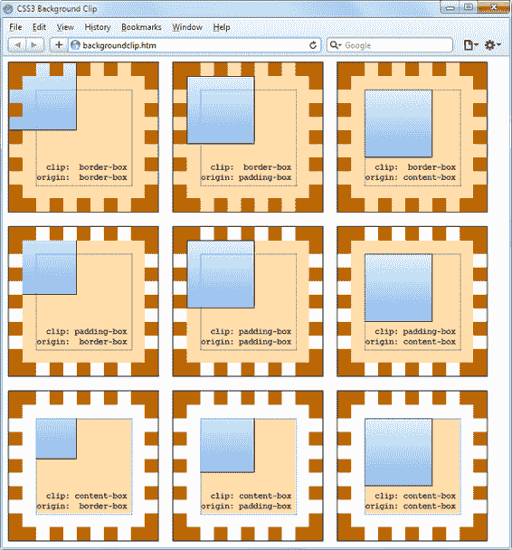

###### 图 20-1\. CSS3 背景属性的不同组合方式

在第一行，内部框（已加载到元素左上角的图像文件，不重复显示）可以在元素的任何位置显示。您还可以清楚地看到它显示在第一个框的边框区域，因为边框已设置为点状。

在第二行，背景图像和背景阴影均不显示在边框区域，因为它们已被剪切到了具有`background-clip`属性值为`padding-box`的填充区域内。

然后，在第三行，背景阴影和图像均已被剪切，仅在每个元素的内部内容区域内显示（显示在浅色虚线框内），使用了`background-clip`属性值为`content-box`。

## background-origin 属性

使用`background-origin`属性，您可以通过指定图像的左上角应从哪里开始来控制背景图像的位置。例如，以下声明指定背景图像的原点应位于边框外缘的左上角：

```php
background-origin:border-box;
```

要将图像的原点设置为填充区域的左上外角，请使用以下声明：

```php
background-origin:padding-box;
```

要将图像的原点设置为元素内部内容区域的左上角，请使用以下声明：

```php
background-origin:content-box;
```

再次查看图 20-1，您可以看到在每一行中，第一个框使用了`background-origin`属性的`border-box`值，第二个框使用了`padding-box`，第三个框使用了`content-box`。因此，在每一行中，较小的内部框显示在第一个框的边框的左上角，第二个框的填充的左上角，以及第三个框的内容的左上角。

###### 注意

请注意，关于内部框的起源，行之间唯一的差异在于，在第 2 行和第 3 行中，内部框被裁剪到填充和内容区域，因此在这些区域之外，框的任何部分都不会显示。

## 属性 `background-size`

就像在 `` 标签中使用图像时可以指定宽度和高度一样，您现在也可以在所有浏览器的最新版本中为背景图像指定宽度和/或高度。

您可以如下应用此属性（其中 *`ww`* 是宽度，*`hh`* 是高度）：

```php
background-size:*`ww`*px *`hh`*px;
```

如果您愿意，您可以只使用一个参数，然后两个维度都将设置为该值。此外，如果将此属性应用于块级元素（如 `<div>`）（而不是内联元素，如 `<span>`），则可以将宽度和/或高度指定为百分比，而不是固定值。

## 使用 `auto` 值

如果您希望仅缩放背景图像的一个维度，并使另一个维度自动缩放以保持相同的比例，您可以像这样使用值 `auto`：

```php
background-size:100px auto;
```

这将宽度设置为 100 像素，并将高度设置为与宽度增加或减少的比例值。

###### 注意

不同的浏览器可能需要不同版本的各种背景属性名称，请在使用它们时参考[Can I use... website](http://caniuse.com)，以确保您应用于目标浏览器所需的所有版本。

## 多重背景

使用 CSS3 您可以将多个背景附加到一个元素，每个背景都可以使用先前讨论的 CSS3 背景属性。图 20-2 显示了一个示例；八个不同的图像被分配到背景中，以创建证书边框的四个角和四条边。

要在单个 CSS 声明中显示多个背景图像，请用逗号分隔它们。示例 20-1 展示了用于创建 图 20-2 背景的 HTML 和 CSS。

##### 示例 20-1\. 在背景中使用多个图像

```php
<!DOCTYPE html>
<html> <!-- backgroundimages.html -->
  <head>
    <title>CSS3 Multiple Backgrounds Example</title>
    <style>
      .border {
        font-family:'Times New Roman';
        font-style :italic;
        font-size  :170%;
        text-align :center;
        padding    :60px;
        width      :350px;
        height     :500px;
        background :url('b1.gif') top    left  no-repeat,
                    url('b2.gif') top    right no-repeat,
                    url('b3.gif') bottom left  no-repeat,
                    url('b4.gif') bottom right no-repeat,
                    url('ba.gif') top          repeat-x,
                    url('bb.gif') left         repeat-y,
                    url('bc.gif') right        repeat-y,
                    url('bd.gif') bottom       repeat-x
      }
    </style>
  </head>
  <body>
    <div class='border'>
      <h1>Employee of the month</h1>
      <h2>Awarded To:</h2>
      <h3>__________________</h3>
      <h2>Date:</h2>
      <h3>___/___/_____</h3>
    </div>
  </body>
</html>
```


###### 图 20-2\. 使用多个图像创建的背景

查看 CSS 部分，您会看到 `background` 声明的前四行将角落图像放置在元素的四个角上，最后四行则放置边缘图像，因为背景图像的优先顺序从顶部到底部。换句话说，在它们重叠的地方，额外的背景图像将出现在已放置图像的后面。如果 GIF 图像的顺序相反，重复的边缘图像将显示在角落的顶部，这将是不正确的。

###### 注意

使用此 CSS，您可以将包含元素调整为任何尺寸，边框将始终正确调整大小以适应，这比使用表格或多个元素实现相同效果要简单得多。

# CSS3 边框

CSS3 还为边框的呈现方式带来了更大的灵活性，允许您独立更改所有四个边框边缘的颜色，显示边缘和角落的图像，为应用圆角边框提供半径值，并将盒子阴影放置在元素下方。

## **border-color 属性**

有两种方法可以将颜色应用到边框上。首先，您可以将单一颜色传递给属性，如下所示：

```php
border-color:#888;
```

此属性将元素的所有边框设置为中灰色。您还可以像这样单独设置边框颜色，这会将边框颜色设置为各种灰色色调：

```php
border-top-color   :#000;
border-left-color  :#444;
border-right-color :#888;
border-bottom-color:#ccc;
```

或者您可以使用单个声明来分别设置所有颜色，如下所示：

```php
border-color:#f00 #0f0 #880 #00f;
```

此声明将顶部边框颜色设置为`#f00`，右侧设置为`#0f0`，底部设置为`#880`，左侧设置为`#00f`（分别为红色、绿色、橙色和蓝色）。您还可以使用颜色名称作为参数。

## **border-radius 属性**

在 CSS3 之前，有才华的 Web 开发人员为了实现圆角边框而进行了许多微调和修复，通常使用`<table>`或`<div>`标签。

但是现在，在元素上添加圆角边框真的很简单，并且在所有主要浏览器的最新版本中均可正常工作，如图 20-3 所示，显示了以不同方式显示的 10 像素边框。 示例 20-2 显示了此 HTML。

##### 示例 20-2\. border-radius 属性

```php
<!DOCTYPE html>
<html> <!-- borderradius.html -->
  <head>
    <title>CSS3 Border Radius Examples</title>
    <style>
      .box {
        margin-bottom:10px;
        font-family  :'Courier New', monospace;
        font-size    :12pt;
        text-align   :center;
        padding      :10px;
        width        :380px;
        height       :75px;
        border       :10px solid #006;
      }
      .b1 {
        border-radius        :40px;
      }
      .b2 {
        border-radius        :40px 40px 20px 20px;
      }
      .b3 {
         border-top-left-radius           :20px;
        border-top-right-radius           :40px;
        border-bottom-left-radius         :60px;
        border-bottom-right-radius        :80px;
      }
      .b4 {
        border-top-left-radius            :40px 20px;
        border-top-right-radius           :40px 20px;
        border-bottom-left-radius         :20px 40px;
        border-bottom-right-radius        :20px 40px;
      }
    </style>
  </head>
  <body>
    <div class='box b1'>
      border-radius:40px;
    </div>

    <div class='box b2'>
      border-radius:40px 40px 20px 20px;
    </div>

    <div class='box b3'>
      border-top-left-radius &nbsp;&nbsp;&nbsp;:20px;<br>
      border-top-right-radius &nbsp;&nbsp;:40px;<br>
      border-bottom-left-radius :60px;<br>
      border-bottom-right-radius:80px;
    </div>

    <div class='box b4'>
      border-top-left-radius &nbsp;&nbsp;&nbsp;:40px 20px;<br>
      border-top-right-radius &nbsp;&nbsp;:40px 20px;<br>
      border-bottom-left-radius :20px 40px;<br>
      border-bottom-right-radius:20px 40px;
    </div>
  </body>
</html>
```

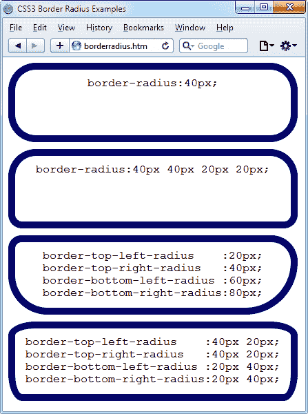

###### 图 20-3\. 混合和匹配各种边界半径属性

因此，例如，要创建半径为 20 像素的圆角边框，您只需使用以下声明：

```php
border-radius:20px;

```

您可以为每个角落单独指定半径，如下所示（顺时针方向从左上角开始应用）：

```php
border-radius:10px 20px 30px 40px;
```

如果您愿意，也可以单独处理元素的每个角落，如下所示：

```php
border-top-left-radius    :20px;
border-top-right-radius   :40px;
border-bottom-left-radius :60px;
border-bottom-right-radius:80px;
```

而且，当引用单独的角落时，您可以提供两个参数来选择不同的垂直和水平半径（产生更有趣和微妙的边框），如下所示：

```php
border-top-left-radius    :40px 20px;
border-top-right-radius   :40px 20px;
border-bottom-left-radius :20px 40px;
border-bottom-right-radius:20px 40px;
```

第一个参数是水平半径，第二个是垂直半径。

# **盒子阴影**

要应用盒子阴影，请指定从对象到水平和垂直偏移量，要添加的阴影模糊量以及要使用的颜色，如下所示：

```php
box-shadow:15px 15px 10px #888;
```

`15px`的两个实例指定了元素从垂直和水平方向的偏移量，这些值可以是负数、零或正数。`10px`指定了模糊量，较小的值会导致较少的模糊效果，`#888`是阴影的颜色，可以是任何有效的颜色值。此声明的结果可在图 20-4 中看到。

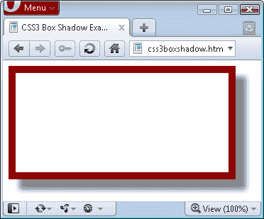

###### 图 20-4\. 元素下方显示的盒子阴影

# 元素溢出

在 CSS2 中，可以通过将`overflow`属性设置为`hidden`、`visible`、`scroll`或`auto`来指示当一个元素过大以至于无法完全包含在其父元素内时该如何处理。但是在 CSS3 中，您现在还可以将这些值分别应用于水平或垂直方向，就像这些示例声明一样：

```php
overflow-x:hidden;
overflow-x:visible;
overflow-y:auto;
overflow-y:scroll;
```

# 多列布局

网页开发者最常要求的功能之一是多列布局，在 CSS3 中这终于实现了。现在，通过指定列数，以及（可选地）选择它们之间的间距和分隔线的类型，即可轻松实现文本在多列中的流动，如图 20-5 所示（由示例 20-3 创建）。

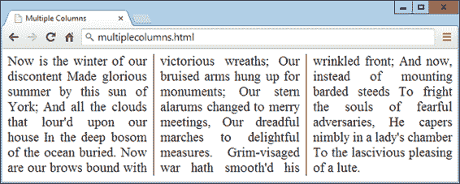

###### 图 20-5\. 多列中的流动文本

##### 示例 20-3\. 使用 CSS 创建多列

```php
<!DOCTYPE html>
<html> <!-- multiplecolumns.html -->
  <head>
    <title>Multiple Columns</title>
    <style>
      .columns {
        text-align          :justify;
        font-size           :16pt;
         column-count       :3;
        column-gap          :1em;
        column-rule         :1px solid black;
      }
    </style>
  </head>
  <body>
    <div class='columns'>
      Now is the winter of our discontent
      Made glorious summer by this sun of York;
      And all the clouds that lour'd upon our house
      In the deep bosom of the ocean buried.
      Now are our brows bound with victorious wreaths;
      Our bruised arms hung up for monuments;
      Our stern alarums changed to merry meetings,
      Our dreadful marches to delightful measures.
      Grim-visaged war hath smooth'd his wrinkled front;
      And now, instead of mounting barded steeds
      To fright the souls of fearful adversaries,
      He capers nimbly in a lady's chamber
      To the lascivious pleasing of a lute.
    </div>
  </body>
</html>
```

在`.columns`类中，前两行仅告诉浏览器将文本右对齐，并将其设置为`16pt`的字体大小。这些声明对于多列布局并不需要，但它们改善了文本显示效果。其余的行设置了元素，使得文本可以在其中通过三列流动，列与列之间有`1em`的间隔，并在每个间隔的中间有一个单像素的边框。

# 颜色和不透明度

CSS3 极大地扩展了定义颜色的方式，现在您还可以使用 CSS 函数以常见格式 RGB（红、绿、蓝）、RGBA（红、绿、蓝和 alpha）、HSL（色调、饱和度和亮度）和 HSLA（色调、饱和度、亮度和 alpha）应用颜色。alpha 值指定了颜色的透明度，使底层元素可以显示出来。

## HSL 颜色

要使用`hsl`函数定义颜色，必须首先从色轮上选择一个介于`0`和`359`之间的色调值。任何更高的颜色数值都会简单地回到开始，因此值`0`是红色，值`360`和`720`也是红色。

在色轮中，红色、绿色和蓝色的主要颜色之间相隔 120 度，因此纯红色是`0`，绿色是`120`，蓝色是`240`。这些值之间的数字代表不同比例的主要颜色混合的不同色调。

接下来，您需要饱和度级别，这是一个介于 0 和 100%之间的值。这指定了颜色将显示多么淡或多么鲜艳。饱和度值从轮盘的中心开始，以中灰色（饱和度为 0%）开始，然后随着向外边缘进展而变得越来越鲜艳（饱和度为 100%）。

剩下的就是您决定颜色亮度的方式，通过选择介于 0 和 100%之间的亮度值。亮度值为`50%`给出最完整、最明亮的颜色；减少该值（最少为`0%`）会使颜色变暗，直到显示为黑色；增加该值（最多为`100%`）会使颜色变亮，直到显示为白色。您可以将此想象为将黑色或白色的级别混合到颜色中。

因此，例如，要选择具有标准百分比亮度的完全饱和的黄色，您可以使用以下声明：

```php
color:hsl(60, 100%, 50%);
```

或者，对于较深的蓝色，您可以使用以下声明：

```php
color:hsl(240, 100%, 40%);
```

您还可以在期望颜色的任何属性（如`background-color`等）上使用此（和所有其他 CSS 颜色函数）。

## HSLA 颜色

为了进一步控制颜色的显示方式，您可以使用`hsla`函数，为颜色提供第四个（alpha）级别，这是一个介于`0`和`1`之间的浮点值。值`0`指定颜色完全透明，而`1`表示完全不透明。

这是您如何选择具有标准亮度和 30%不透明度的完全饱和的黄色：

```php
color:hsla(60, 100%, 50%, 0.3);
```

或者，对于具有 82%不透明度的完全饱和但较浅的蓝色，您可以使用以下声明：

```php
color:hsla(240, 100%, 60%, 0.82);
```

## RGB 颜色

您可能更熟悉选择颜色的 RGB 系统，因为它类似于`#nnnnnn`和`#nnn`颜色格式。例如，要将黄色应用于属性，您可以使用以下任一声明（第一个支持 1600 万种颜色，第二个支持 4000 种颜色）：

```php
color:#ffff00;
color:#ff0;
```

您还可以使用 CSS 的`rgb`函数来实现相同的结果，但使用十进制数字而不是十六进制（其中 255 十进制是 ff 十六进制）：

```php
color:rgb(255, 255, 0);
```

但比这更好的是，您甚至不必再考虑最多 256 个数量级，因为您可以指定百分比值，就像这样：

```php
color:rgb(100%, 100%, 0);
```

实际上，您现在可以通过简单地考虑其主要颜色来非常接近所需的颜色。例如，绿色和蓝色制成青色，因此，要创建接近青色但含有比绿色更多蓝色的颜色，您可以在 0%红色、40%绿色和 60%蓝色进行良好的初步猜测，并尝试以下声明：

```php
color:rgb(0%, 40%, 60%);
```

## RGBA 颜色

与`hsla`函数一样，`rgba`函数支持第四个 alpha 参数，因此，例如，您可以通过以下声明以 40%的不透明度应用先前的类青色：

```php
color:rgba(0%, 40%, 60%, 0.4);
```

## 不透明度属性

`opacity`属性提供与`hsla`和`rgba`函数相同的 Alpha 控制，但允许您单独修改对象的不透明度（或透明度，如果您更喜欢）。

要使用它，请将如下声明应用到元素上（在此示例中将不透明度设置为 25%，即 75%透明）：

```php
opacity:0.25;
```

# 文本效果

通过 CSS3 现在可以为文本应用多种新效果，包括文本阴影、文本重叠和单词换行。

## text-shadow 属性

`text-shadow`属性类似于`box-shadow`属性，并接受相同的一组参数：水平和垂直偏移量、模糊量以及要使用的颜色。例如，以下声明使阴影在水平和垂直方向上各偏移 3 像素，并以深灰色显示阴影，模糊量为 4 像素：

```php
text-shadow:3px 3px 4px #444;
```

此声明的结果看起来像图 20-6，并在所有主要浏览器的最新版本中均有效（但不适用于 IE 9 或更低版本）。

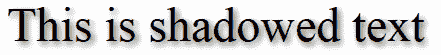

###### 图 20-6\. 为文本应用阴影

## text-overflow 属性

使用任何 CSS 溢出属性的`hidden`值时，您还可以使用`text-overflow`属性，在截断之前放置一个省略号（三个点），以指示某些文本已被截断，如下所示：

```php
text-overflow:ellipsis;
```

如果没有此属性，则截断文本“To be, or not to be. That is the question.”的结果将如图 20-7 所示；但是，应用了该声明后，结果就像图 20-8 一样。

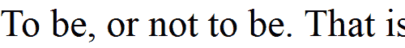

###### 图 20-7\. 文本被自动截断

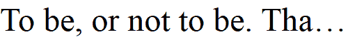

###### 图 20-8\. 文字未被切断，而是使用省略号逐渐消失

为使其起作用，需要三件事：

+   元素应具有不可见的`overflow`属性，例如`overflow:hidden`。

+   元素必须设置`white-space:nowrap`属性以约束文本。

+   元素的宽度必须小于文本的宽度以进行截断。

## word-wrap 属性

当您有一个非常长的单词宽度大于包含它的元素时，它将溢出或被截断。但作为使用`text-overflow`属性和截断文本的替代方案，您可以使用`word-wrap`属性并将值设置为`break-word`来换行长行，如下所示：

```php
word-wrap:break-word;
```

例如，在图 20-9 中，单词*Honorificabilitudinitatibus*过于宽度超出了包含框（其右边缘在字母*t*和*a*之间显示为实线垂直线），因为未应用溢出属性，它已超出了其边界。

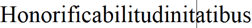

###### 图 20-9\. 字对容器来说太宽，溢出了

但在 图 20-10 中，该元素的 `word-wrap` 属性被赋予了 `break-word` 的值，因此这个词已经整齐地换行到了下一行。

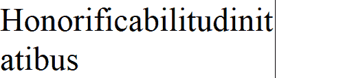

###### 图 20-10\. 现在的字换行在右边缘

# Web 字体

CSS3 Web 字体的使用大大增加了网页设计师可用的排版选择，允许从网络上加载并显示字体，而不仅限于用户的计算机。为了实现这一点，可以通过使用`@font-face`来声明 web 字体，像这样：

```php
@font-face
{
  font-family:FontName;
  src:url('FontName.otf');
}
```

`url` 函数需要一个包含字体路径或 URL 的值。在大多数浏览器上，你可以使用 TrueType (*.ttf*) 或 OpenType (*.otf*) 字体，但是 Internet Explorer 限制你只能使用转换为嵌入式 OpenType (*.eot*) 的 TrueType 字体。

要告诉浏览器字体的类型，可以使用`format`函数，例如对于 OpenType 字体：

```php
@font-face
{
  font-family:FontName;
  src:url('FontName.otf') format('opentype');
}
```

或者对于 TrueType 字体：

```php
@font-face
{
  font-family:FontName;
  src:url('FontName.ttf') format('truetype');
}
```

然而，因为 Internet Explorer 只接受 EOT 字体，它会忽略包含`format`函数的`@font-face`声明。

## Google Web 字体

使用 Web 字体的一个非常棒的方式之一是从 Google 的服务器免费加载它们。要了解更多信息，请访问 [Google 字体网站](http://fonts.google.com)，见图 20-11，在那里你可以获取超过一千种字体。

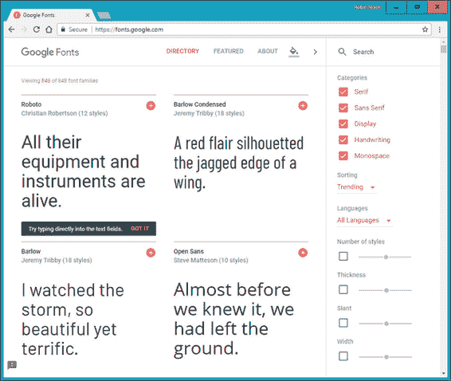

###### 图 20-11\. Google 的一些 Web 字体

为了演示使用其中一种字体的简易性，这里展示如何在 HTML 中加载 Google 字体（在此例中为 Lobster），以用于 `<h1>` 标题：

```php
<!DOCTYPE html>
<html>
  <head>
    <style>
      h1 { font-family:'Lobster', arial, serif; }
    </style>
    <link href='http://fonts.googleapis.com/css?family=Lobster'
      rel='stylesheet'>
  </head>
  <body>
    <h1>Hello</h1>
  </body>
</html>
```

当你从该网站选择字体时，Google 提供了 `<link>` 标签，可以复制并粘贴到你网页的 `<head>` 中。

# 变换

使用变换，你可以在任意三个维度中进行倾斜、旋转、拉伸和挤压元素。这使得通过摆脱`<div>`等元素的统一矩形布局，很容易创建出色的效果，因为现在它们可以以多种角度和形式展示。

要执行变换，使用 `transform` 属性。你可以对 `transform` 属性应用各种属性，从值 `none` 开始，它将对象重置为非变换状态：

```php
transform:none;
```

你可以将以下一个或多个函数提供给 `transform` 属性：

<dfn class="keep-together">`matrix`</dfn>

通过应用值矩阵对其应用矩阵来变换对象

<dfn class="keep-together">`translate`</dfn>

移动元素的原点

<dfn class="keep-together">`scale`</dfn>

缩放对象

<dfn class="keep-together">`rotate`</dfn>

旋转对象

<dfn class="keep-together">`skew`</dfn>

倾斜对象

唯一可能让您费解的是 `skew`。使用此功能时，一个坐标相对于坐标平面或轴的距离在一个方向上被位移。因此，例如，当被倾斜时，矩形被转换为平行四边形。

这些函数也有单一版本，如 `translateX`、`scaleY` 等。

例如，要将元素顺时针旋转 45 度，可以应用以下声明：

```php
transform:rotate(45deg);
```

同时，您可以放大此对象，例如以下声明，将其宽度放大 1.5 倍，高度放大 2 倍，然后执行旋转。图 20-12 显示了应用变换前后的对象：

```php
transform:scale(1.5, 2) rotate(45deg);
```

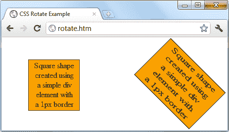

###### 图 20-12\. 变换前后的对象

## 3D 变换

您还可以通过使用以下 CSS3 3D 变换功能来在三维空间中变换对象：

<dfn class="keep-together">`perspective`</dfn>

释放元素，使其脱离二维空间，并创建一个可以移动的第三维度。必须与 3D CSS 函数一起使用。

<dfn class="keep-together">`transform-origin`</dfn>

利用透视，设置所有线条汇聚到一个单一点的位置。

<dfn class="keep-together">`translate3d`</dfn>

将元素移动到其三维空间中的另一个位置。

<dfn class="keep-together">`scale3d`</dfn>

重新调整一个或多个维度。

<dfn class="keep-together">`rotate3d`</dfn>

将元素绕 x、y 和 z 轴之一旋转。

图 20-13 显示了如何使用类似以下的 CSS3 3D 变换规则将二维对象旋转至三维空间。

```php
transform:perspective(200px) rotateX(10deg) rotateY(20deg) rotateZ(30deg);
```

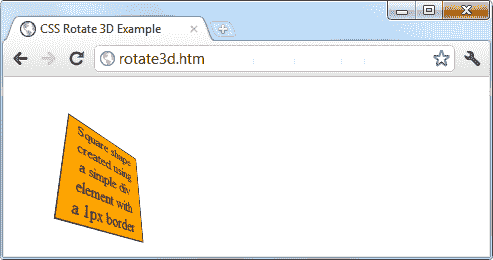

###### 图 20-13\. 在三维空间中旋转的图形

# 过渡

也出现在所有主要浏览器的最新版本中（包括 Internet Explorer 10，但不包括更低版本）的一个动态新功能称为 *过渡*。这些指定了在元素变换时要发生的动画效果，浏览器将自动处理所有中间帧。

要设置转换，需要提供四个属性，如下所示：

```php
transition-property       :*`property`*;
transition-duration       :*`time`*;
transition-delay          :*`time`*;
transition-timing-function:*`type`*;

```

## 要过渡的属性

过渡具有诸如 `height` 和 `border-color` 的属性。在名为 `transition-property` 的 CSS 属性中指定要更改的属性。（这里我使用 *property* 一词，用于描述 CSS 属性及其设置的过渡属性。）您可以通过逗号分隔它们来包含多个属性，如下所示：

```php
transition-property:width, height, opacity;
```

或者，如果您希望对元素的所有内容（包括颜色）进行过渡，可以使用值 `all`，如下所示：

```php
transition-property:all;
```

## 过渡持续时间

`transition-duration`属性需要一个大于等于 0 秒的值，如以下所示，指定过渡应该花费 1.25 秒完成：

```php
transition-duration:1.25s;
```

## 过渡延迟

如果给`transition-delay`属性赋予大于 0 秒的值（默认值），它将在元素初始显示和过渡开始之间引入延迟。以下代码在 0.1 秒延迟后开始过渡：

```php
transition-delay:0.1s;
```

如果`transition-delay`属性的值小于 0 秒（也就是负值），过渡将在属性变更时执行，但看起来似乎是从指定的偏移开始执行，过渡中途进行。

## 过渡时间

`transition-timing`函数属性需要以下一个值：

<dfn class="keep-together">`ease`</dfn>

缓慢开始，变快，然后缓慢结束。

<dfn class="keep-together">`linear`</dfn>

常速过渡。

<dfn class="keep-together">`ease-in`</dfn>

缓慢开始，然后快速进行直至完成。

<dfn class="keep-together">`ease-out`</dfn>

快速开始，保持快速进行直至接近结束，然后缓慢结束。

<dfn class="keep-together">`ease-in-out`</dfn>

缓慢开始，快速进行，然后缓慢结束。

使用任何包含“**ease**”一词的值，确保过渡看起来非常流畅和自然，不像某种线性过渡似乎更加机械。如果这些对你来说还不够丰富，你也可以使用`cubic-bezier`函数自定义自己的过渡效果。

例如，以下是用于创建前述五种过渡类型的声明，演示如何轻松创建自定义过渡：

```php
transition-timing-function:cubic-bezier(0.25, 0.1, 0.25, 1);
transition-timing-function:cubic-bezier(0,    0,   1,    1);
transition-timing-function:cubic-bezier(0.42, 0,   1,    1);
transition-timing-function:cubic-bezier(0,    0,   0.58, 1);
transition-timing-function:cubic-bezier(0.42, 0,   0.58, 1);
```

## 简写语法

你可能会发现使用此属性的简写版本更容易，并在单个声明中包含所有值，如以下示例所示，它将以线性方式过渡所有属性，在 0.3 秒内完成，初始（可选）延迟为 0.2 秒：

```php
transition:all .3s linear .2s;
```

这样做将为您节省输入许多非常相似声明的麻烦，特别是如果您支持所有主要浏览器前缀。

示例 20-4 展示了如何同时使用过渡和变换。CSS 创建了一个方形的橙色元素，里面有一些文本，并且使用`hover`伪类指定，当鼠标经过该对象时，它应该旋转 180 度，并从橙色变为黄色（见图 20-14）。

##### 示例 20-4\. 悬停效果的过渡

```php
<!DOCTYPE html>
<html>
  <head>
    <title>Transitioning on hover</title>
    <style>
      #square {
        position          :absolute;
        top               :50px;
        left              :50px;
        width             :100px;
        height            :100px;
        padding           :2px;
        text-align        :center;
        border-width      :1px;
        border-style      :solid;
        background        :orange;
        transition        :all .8s ease-in-out;
      }
      #square:hover {
        background        :yellow;
        transform         :rotate(180deg);
      }
    </style>
  </head>
  <body>
    <div id='square'>
      Square shape<br>
      created using<br>
      a simple div<br>
      element with<br>
      a 1px border
    </div>
  </body>
</html>
```

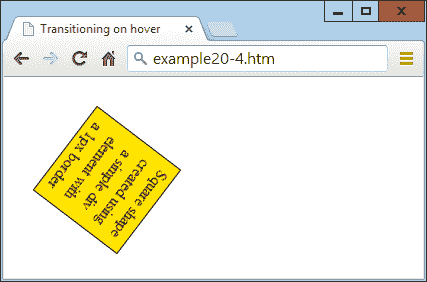

###### 图 20-14\. 当鼠标悬停时，对象旋转并改变颜色

示例代码通过提供浏览器特定版本的声明来适配所有浏览器。在所有最新的浏览器（包括 IE 10 或更高版本）中，当鼠标悬停时，对象将顺时针旋转，同时从橙色渐变到黄色。

CSS 过渡很智能，当它们被取消时，它们会平滑地返回到它们的原始值。因此，如果你在过渡完成之前将鼠标移开，它将立即反转并过渡回其初始状态。

# 问题

1.  CSS3 属性选择器操作符 `^=`, `$=`, 和 `*=` 分别做什么？

1.  你使用什么属性来指定背景图像的大小？

1.  你可以用哪个属性指定边框的半径？

1.  如何在多列上流动文本？

1.  列出四个用于指定 CSS 颜色的函数。

1.  如何创建一个灰色阴影，位于某些文本下方右下角偏移 5 像素，模糊程度为 3 像素？

1.  如何用省略号表示文本被截断？

1.  如何在网页中引入 Google Web 字体？

1.  你会使用什么 CSS 声明来将对象旋转 90 度？

1.  如何设置对象的过渡效果，以便当其任何属性发生变化时，变化将在半秒钟内以线性方式立即过渡？

参见“第二十章答案” 在附录 A 中查看这些问题的答案。
