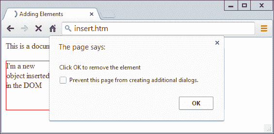

# 第二十一章：从 JavaScript 访问 CSS

现在您已经对 DOM 和 CSS 有了很好的理解，本章将教您如何直接从 JavaScript 访问 DOM 和 CSS，使您能够创建高度动态和响应式的网站。

我还将向您展示如何使用中断，以便您可以创建动画或提供必须继续运行的任何代码（例如钟表）。最后，我将解释如何向 DOM 添加新元素或从中删除现有元素，这样您就无需预先在 HTML 中创建元素，以防 JavaScript 可能需要访问它们。

# 重新访问 getElementById 函数

为了帮助本书其余部分的示例，我想提供一个增强版的 `getElementById` 函数，用于快速高效地处理 DOM 元素和 CSS 样式，无需包括 jQuery 等框架。

但是，为了避免与使用 `$` 字符的框架发生冲突，我将使用大写 `O`，因为它是 *Object* 的首字母，这将在调用函数时返回（通过函数传递的 ID 所代表的对象）。

## 函数 O

下面是裸骨函数 `O` 的样子：

```php
function O(i)
{
  return document.getElementById(i)
}
```

这单独就节省了每次调用时 22 个字符的输入。但我选择稍微扩展该函数，允许将 ID 名称或对象传递给函数，如在 Example 21-1 的完整版本中所示。

##### 示例 21-1。函数 `O`

```php
function O(i)
{
  return typeof i == 'object' ? i : document.getElementById(i)
}
```

如果函数被传递一个对象，它只是将该对象再次返回。否则，它假定已传递了一个 ID，并返回该 ID 所引用的对象。

但是，我为什么要添加这个首语句呢，它只是将传递给它的对象再次返回？

## 函数 S

解答这个问题变得清晰起来，当你看一个称为 `S` 的伙伴函数，它为您提供了易于访问对象的样式（或 CSS）属性，如 Example 21-2 所示。

##### 示例 21-2。函数 `S`

```php
function S(i)
{
  return O(i).style
}
```

此函数名称中的 `S` 是 *Style* 的首字母，该函数执行返回所引用元素的样式属性（或子对象）的任务。由于嵌入的 `O` 函数接受 ID 或对象，您也可以将 ID 或对象传递给 `S`。

让我们通过拿一个 ID 为 `myobj` 的 `<div>` 元素作为例子，将其文本颜色设置为绿色，像这样：

```php
<div id='myobj'>Some text</div>

<script>
  O('myobj').style.color = 'green'
</script>
```

前面的代码将完成工作，但调用新的 `S` 函数要简单得多，如下所示：

```php
S('myobj').color = 'green'
```

现在考虑调用 `O` 后返回的对象存储在例如称为 `fred` 的对象中的情况，如下所示：

```php
fred = O('myobj')
```

由于函数 `S` 的工作方式，我们仍然可以调用它将文本颜色更改为绿色，如下所示：

```php
S(fred).color = 'green'
```

这意味着无论您希望直接访问对象还是通过其 ID 访问，都可以根据需要将其传递给`O`或`S`函数。只需记住，当您传递对象（而不是 ID）时，不要将其放在引号中。

## C 函数

到目前为止，我已为您提供了两个简单的函数，使您可以轻松访问网页上的任何元素和元素的任何样式属性。不过有时，您可能希望一次访问多个元素。您可以通过为每个这样的元素分配一个 CSS 类名来实现这一点，例如这些示例中都使用`myclass`类：

```php
<div class='myclass'>Div contents</div>
<p class='myclass'>Paragraph contents</p>
```

如果您想要访问页面上使用特定类的所有元素，可以使用`C`函数（代表*Class*的首字母），如示例 21-3 中所示，返回一个包含所有匹配类名的对象数组。

##### 示例 21-3\. `C`函数

```php
function C(i)
{
  return document.getElementsByClassName(i)
}
```

要使用此函数，只需按以下方式调用它，保存返回的数组，以便根据需要单独访问每个元素，或者（更可能的情况是）通过循环一次性访问它们：

```php
myarray = C('myclass')
```

现在您可以随意对返回的对象执行任何操作，例如（例如）将其`textDecoration`样式属性设置为`underline`，如下所示：

```php
for (i = 0 ; i < myarray.length ; ++i)
  S(myarray[i]).textDecoration = 'underline'
```

此代码遍历`myarray[]`中的对象，然后使用`S`函数引用每个对象的样式属性，并将其`textDecoration`属性设置为`underline`。

###### 注意

很有可能您在开发代码中不会使用这些`O`、`S`和`C`函数，因为您可能会有自定义或第三方框架来提供此功能，而且还有更多功能。但它们有助于使本书中的示例简短易懂，同时也是 JavaScript 如何可以增强的简单示例。

## 包括函数

我在本章的其余部分示例中使用`O`和`S`函数，因为它们可以使代码更短且更易于理解。因此，我已将它们与`C`函数（我认为您会发现它非常有用）保存在了附带示例的存档的第二十一章文件夹中的*OSC.js*文件中，可以从[书本示例库](https://github.com/RobinNixon/lpmj6)免费下载。

您可以通过以下语句将这些函数包含在任何网页中——最好是在其`<head>`部分，在任何依赖于调用它们的脚本之前：

```php
<script src='OSC.js'></script>
```

*OSC.js*的内容显示在示例 21-4 中，其中所有内容整理成了仅三行。

##### 示例 21-4\. OSC.js 文件

```php
function O(i) { return typeof i == 'object' ? i : document.getElementById(i) }
function S(i) { return O(i).style                                            }
function C(i) { return document.getElementsByClassName(i)                    }
```

# 从 JavaScript 中访问 CSS 属性

我在早些时候的示例中使用的`textDecoration`属性代表一个通常以连字符连接的 CSS 属性，就像这样：`text-decoration`。但由于 JavaScript 将连字符保留为数学运算符使用，因此每当访问连字符连接的 CSS 属性时，必须省略连字符，并将其后的字符设置为大写。

这种情况的另一个示例是`font-size`属性，在 JavaScript 中被引用为放置在点运算符之后的`fontSize`，就像这样：

```php
myobject.fontSize = '16pt'
```

另一种方法是更冗长地使用`setAttribute`函数，该函数*支持*（实际上要求）标准的 CSS 属性名称，就像这样：

```php
myobject.setAttribute('style', 'font-size:16pt')

```

## 一些常见属性

使用 JavaScript，您可以以类似于使用 CSS 的方式修改 Web 文档中任何元素的任何属性。我已经向您展示了如何使用 JavaScript 简写形式或`setAttribute`函数来使用精确的 CSS 属性名称访问 CSS 属性，因此我不会详细介绍所有数百个属性。相反，我想向您展示如何访问一些 CSS 属性作为您可以执行的一些操作的概述。

首先，让我们通过示例 21-5 来看一下如何从 JavaScript 中修改一些 CSS 属性，该示例加载了前面的三个函数，创建了一个`<div>`元素，然后在 HTML 的`<script>`部分内发出 JavaScript 语句来修改它的一些属性（见图 21-1）。

##### 示例 21-5\. 从 JavaScript 中访问 CSS 属性

```php
<!DOCTYPE html>
<html>
  <head>
    <title>Accessing CSS Properties</title>
    <script src='OSC.js'></script>
  </head>
  <body>
    <div id='object'>Div Object</div>

    <script>
      S('object').border     = 'solid 1px red'
      S('object').width      = '100px'
      S('object').height     = '100px'
      S('object').background = '#eee'
      S('object').color      = 'blue'
      S('object').fontSize   = '15pt'
      S('object').fontFamily = 'Helvetica'
      S('object').fontStyle  = 'italic'
    </script>
  </body>
</html>
```


###### 图 21-1\. 从 JavaScript 修改样式

通过这种方式修改属性并没有什么好处，因为您可以直接包含一些 CSS，但很快我们将根据用户交互来修改属性，然后您将看到结合 JavaScript 和 CSS 的真正力量。

## 其他属性

JavaScript 还打开了对非常广泛的其他属性的访问，例如浏览器窗口的宽度和高度，任何弹出窗口或浏览器窗口或框架的宽度和高度，以及诸如父窗口（如果存在）和本次会话中访问的 URL 历史记录等便捷信息。

所有这些属性都是通过点运算符（例如，`window.name`）从`window`对象访问的，并且表 21-1 列出了它们以及每个属性的描述。

表 21-1\. 窗口属性

| 属性 | 描述 |
| --- | --- |
| `closed` | 返回一个布尔值，指示窗口是否已关闭 |
| `defaultStatus` | 设置或返回窗口状态栏中的默认文本 |
| `document` | 返回窗口的`document`对象 |
| `frameElement` | 返回当前窗口插入的`iframe`元素 |
| `frames` | 返回窗口中所有帧和 iframe 的数组 |
| `history` | 返回窗口的`history`对象 |
| `innerHeight` | 设置或返回窗口内容区域的内部高度 |
| `innerWidth` | 设置或返回窗口内容区域的内部宽度 |
| `length` | 返回窗口中的帧和 iframe 的数量 |
| `localStorage` | 允许在 Web 浏览器中保存键/值对 |
| `location` | 返回窗口的`location`对象 |
| `name` | 设置或返回窗口的名称 |
| `navigator` | 返回窗口的`navigator`对象 |
| `opener` | 返回创建当前窗口的窗口的引用 |
| `outerHeight` | 设置或返回窗口的外部高度，包括工具栏和滚动条 |
| `outerWidth` | 设置或返回窗口的外部宽度，包括工具栏和滚动条 |
| `pageXOffset` | 返回文档从窗口左侧水平滚动的像素数 |
| `pageYOffset` | 返回文档从窗口顶部垂直滚动的像素数 |
| `parent` | 返回窗口的父窗口 |
| `screen` | 返回窗口的`screen`对象 |
| `screenLeft` | 返回窗口相对于屏幕的*x*坐标 |
| `screenTop` | 返回窗口相对于屏幕的*y*坐标 |
| `screenX` | 返回窗口相对于屏幕的*x*坐标 |
| `screenY` | 返回窗口相对于屏幕的*y*坐标 |
| `sessionStorage` | 允许在 Web 浏览器中保存键/值对 |
| `self` | 返回当前窗口 |
| `status` | 设置或返回窗口状态栏中的文本 |
| `top` | 返回顶层浏览器窗口 |

有几点需要注意关于其中一些属性：

+   `defaultStatus` 和 `status` 属性只能在用户修改浏览器以允许时设置（这种情况非常少见）。

+   `history` 对象不能被读取（因此无法查看访问者浏览过的网址）。但它支持 `length` 属性以确定历史记录的长度，并支持 `back`、`forward` 和 `go` 方法以在历史记录中导航到特定页面。

+   当您需要知道 Web 浏览器当前窗口中有多少可用空间时，只需读取 `window.innerHeight` 和 `window.innerWidth` 的值。我经常用这些值来在浏览器内居中弹出警报或“确认对话框”窗口。

+   `screen` 对象支持只读属性 `availHeight`、`availWidth`、`colorDepth`、`height`、`pixelDepth` 和 `width`，因此非常适合获取关于用户显示器的信息。

###### 注意

这些属性在针对移动电话和平板设备时非常有用，它们能告诉您可用的屏幕空间大小、正在使用的浏览器类型等信息。

这些少数信息将帮助您入门，并为您提供 JavaScript 中许多新奇有趣的功能的想法。此章节中涵盖的属性和方法远不止这些，但现在您已经知道如何访问和使用属性，您所需要的就是列出所有资源的资源。我建议您从 [在线文档](https://tinyurl.com/domexplained) 开始查看。

# 内联 JavaScript

使用 `<script>` 标签并非执行 JavaScript 语句的唯一方式；您还可以从 HTML 标签中访问 JavaScript，实现出色的动态交互性。例如，要在鼠标经过对象时添加快速效果，可以使用类似于 `` 标签中的代码，该示例在 示例 21-6 中默认显示一个苹果，但当鼠标经过对象时会将其替换为橙子，并在鼠标离开时恢复为苹果。

##### 示例 21-6\. 使用内联 JavaScript

```php
<!DOCTYPE html>
<html>
  <head>
    <title>Inline JavaScript</title>
  </head>
  <body>
    
  </body>
</html>
```

## 关键字 `this`

在上述示例中，您可以看到 `this` 关键字的使用。它告诉 JavaScript 在调用对象上操作，即 `` 标签。您可以在 图 21-2 中看到其结果，即鼠标尚未经过苹果时的状态。

###### 注意

当从内联 JavaScript 调用提供时，关键字 `this` 表示调用对象。在类方法中使用时，它表示应用方法的对象。


###### 图 21-2\. 内联鼠标悬停 JavaScript 示例

## 在脚本中为对象附加事件

上述代码等同于为 `` 标签提供 ID，并将操作附加到标签的鼠标事件中，如 示例 21-7 中所示。

##### 示例 21-7\. 非内联 JavaScript

```php
<!DOCTYPE html>
<html>
  <head>
    <title>Non-inline JavaScript</title>
    <script src='OSC.js'></script>
  </head>
  <body>
    

    <script>
      O('object').onmouseover = function() { this.src = 'orange.png' }
      O('object').onmouseout  = function() { this.src = 'apple.png'  }
    </script>
  </body>
</html>
```

在 HTML 部分，此示例为 `` 元素赋予了 ID `object`，然后在 JavaScript 部分通过为每个事件附加匿名函数来单独操作它。

## 附加到其他事件

无论您是使用内联还是独立的 JavaScript，都可以依附多种事件来执行操作，为用户提供丰富的附加功能。表 21-2 列出了这些事件及其触发时机的详细信息。

表 21-2\. 事件及其触发时机

| 事件 | 发生时 |
| --- | --- |
| `onabort` | 当图像加载未完成前停止时 |
| `onblur` | 当元素失去焦点时^(a) |
| `onchange` | 当表单的任何部分发生变化时 |
| `onclick` | 当对象被点击时 |
| `ondblclick` | 当对象被双击时 |
| `onerror` | 当遇到 JavaScript 错误时 |
| `onfocus` | 当元素获取焦点时 |
| `onkeydown` | 当按键被按下（包括 Shift、Alt、Ctrl 和 Esc）时 |
| `onkeypress` | 当按键被按下（不包括 Shift、Alt、Ctrl 和 Esc）时 |
| `onkeyup` | 当按键释放时 |
| `onload` | 当对象已加载时 |
| `onmousedown` | 当鼠标按钮在元素上按下时 |
| `onmousemove` | 当鼠标在元素上移动时 |
| `onmouseout` | 当鼠标离开元素时 |
| `onmouseover` | 当鼠标从元素外部经过时 |
| `onmouseup` | 当鼠标按钮释放时 |
| `onreset` | 当表单被重置时 |
| `onresize` | 当浏览器调整大小时 |
| `onscroll` | 当文档滚动时 |
| `onselect` | 当选择文本时 |
| `onsubmit` | 当表单被提交时 |
| `onunload` | 当文档被卸载时 |
| ^(a) 一个具有 *焦点* 的元素是指已被点击或以其他方式进入的元素，如输入字段。 |

###### 警告

确保将事件附加到有意义的对象上。例如，非表单对象将不会响应 `onsubmit` 事件。

# 添加新元素

使用 JavaScript，您不仅限于操纵 HTML 文档中提供的元素和对象。事实上，您可以通过将它们插入到 DOM 中随意创建对象。

例如，假设您需要一个新的 `<div>` 元素。示例 21-8 展示了一种将其添加到网页的方法。

##### 示例 21-8\. 将元素插入到 DOM 中

```php
<!DOCTYPE html>
<html>
  <head>
    <title>Adding Elements</title>
    <script src='OSC.js'></script>
  </head>
  <body> This is a document with only this text in it.<br><br>

    <script>
      alert('Click OK to add an element')

      newdiv    = document.createElement('div')
      newdiv.id = 'NewDiv'
      document.body.append(newdiv)

      S(newdiv).border = 'solid 1px red'
      S(newdiv).width  = '100px'
      S(newdiv).height = '100px'
      newdiv.innerHTML = "I'm a new object inserted in the DOM"

      `setTimeout``(``function``(``)`
      `{`
        alert('Click OK to remove the element')

        newdiv.parentNode.removeChild(newdiv)
      `}``,` `1000``)`
    </script>
  </body>
</html>
```

图 21-3 展示了在 Web 文档中添加新 `<div>` 元素的代码示例。首先，使用 `createElement` 创建新元素；然后调用 `appendChild` 函数，将元素插入到 DOM 中。



###### 图 21-3\. 向 DOM 中插入新元素

之后，为元素分配了各种属性，包括其内部 HTML 的一些文本。然后，为了确保新元素立即显示，设置了一个延迟触发器，延迟执行余下的代码一秒钟，以便给 DOM 更新和显示的时间，然后再弹出关于再次移除元素的警报。有关创建和使用延迟触发器的更多信息，请参见 “使用 setTimeout”。

创建的这个新元素与其在原始 HTML 中被包含的方式完全相同，并且具有同样的属性和方法。

###### 注

当我想要创建浏览器内弹出窗口时，有时会使用创建新元素的技术，因为它不依赖于 DOM 中是否有可用的空闲 `<div>` 元素。

## 移除元素

您还可以从 DOM 中移除元素，包括那些未使用 JavaScript 插入的元素；这比添加元素更容易。假设要移除的元素在对象 `element` 中，操作如下：

```php
element.parentNode.removeChild(element)
```

这段代码访问元素的`parentNode`对象，以便它可以从该节点中移除元素。然后它在父对象上调用`removeChild`方法，传递要移除的对象。

## 添加和移除元素的替代方案

插入元素是用于向网页中添加全新对象的。但是如果你的意图只是根据`onmouseover`或其他事件隐藏和显示对象，不要忘记有几个 CSS 属性可以用于此目的，而不必采取创建和删除 DOM 元素的如此激进的措施。

例如，当你想要使一个元素不可见但保持在原位（周围的所有元素保持原位），你可以简单地将对象的`visibility`属性设置为`hidden`，就像这样：

```php
myobject.visibility = 'hidden'
```

要重新显示对象，你可以使用以下内容：

```php
myobject.visibility = 'visible'
```

你还可以将一个元素折叠到零宽度和高度（周围的所有对象填充释放出的空间），就像这样：

```php
myobject.display = 'none'
```

然后恢复元素到其原始尺寸，你将使用以下内容：

```php
myobject.display = 'block'
```

当然，还有`innerHTML`属性，你可以使用它来改变应用于元素的 HTML，例如：

```php
mylement.innerHTML = '<b>Replacement HTML</b>'
```

或者，使用我之前概述的`O`函数：

```php
O('someid').innerHTML = 'New contents'
```

或者你可以让一个元素似乎消失，就像这样：

```php
O('someid').innerHTML = ''
```

###### 注意

不要忘记你可以从 JavaScript 访问的其他有用的 CSS 属性，比如`opacity`用于将对象的可见性设置为可见和不可见之间的某个值，或者`width`和`height`用于调整对象的大小。当然，使用`position`属性与值`absolute`、`static`、`fixed`、`sticky`或`relative`，你甚至可以将对象定位在（或者在外部）浏览器窗口中任何你喜欢的位置。

# 使用中断

JavaScript 提供了对*中断*的访问，这是一种方法，通过它你可以要求浏览器在一段预定的时间后调用你的代码，甚至在指定的间隔内继续调用它。这为你提供了处理后台任务的手段，例如异步通信，甚至像动画化网络元素这样的事情。

中断有两种类型：`setTimeout`和`setInterval`，它们有相应的`clearTimeout`和`clearInterval`函数用于再次关闭它们。

## 使用 setTimeout

当你调用`setTimeout`时，你传递一些 JavaScript 代码或函数名，并且一个表示代码应在多少毫秒后执行的值，就像这样：

```php
setTimeout(dothis, 5000)
```

你的`dothis`函数可能看起来像这样：

```php
function dothis()
{
  alert('This is your wakeup alert!');
}
```

###### 注意

如果你在想，你不能简单地指定`alert()`（带空括号）作为`setTimeout`调用的函数，因为函数会立即执行。只有当你提供不带括号的函数名（例如，`alert`）时，你才能安全地传递函数名，这样它的代码只会在超时发生时执行。

### 传递一个字符串

当您需要向函数提供参数时，您还可以向 `setTimeout` 函数传递一个字符串值，该值直到正确时间才会被执行。例如：

```php
setTimeout("alert('Hello!')", 5000)
```

实际上，如果您在每个语句后加上分号，您可以提供尽可能多的行 JavaScript 代码，例如：

```php
setTimeout("document.write('Starting'); alert('Hello!')", 5000)
```

### 重复超时

一些程序员使用的一种技术是在由其调用的代码中调用 `setTimeout` 函数，如下面的示例所示，它将启动一系列不断弹出警报窗口的无限循环：

```php
setTimeout(dothis, 5000)

function dothis()
{
  setTimeout(dothis, 5000)
  alert('I am annoying!')
}
```

现在每五秒钟将弹出一个警报。我不建议您运行这个实际例子（即使作为测试），否则您可能不得不关闭浏览器才能停止它！

###### 注意

另一种选择是使用 `setInterval` 函数，如稍后所述。但是，链接 `setTimeout` 具有一个优点，即仅在所有前面的代码执行完毕后才发出 `setTimeout` 函数调用，而 `setInterval` 将中断代码运行，有时可能不会得到您打算的结果。

## 取消超时

设置超时后，如果您之前保存了从初始调用 `setTimeout` 返回的值，您可以取消它，如下所示：

```php
handle = setTimeout(dothis, 5000)
```

使用 `handle` 中的值（一个用于暗示您可以控制函数的*句柄*）时，您可以随时取消中断，直到其到期时间，如下所示：

```php
clearTimeout(handle)
```

当您这样做时，中断将被完全遗忘，并且分配给它的代码将不会被执行。

## 使用 setInterval

设置定期中断的更简单的方法是使用 `setInterval` 函数。它的工作方式与 `setTimeout` 相同，只是在您指定的间隔后弹出警报，然后再次过去这个间隔，以此类推，除非您取消它。

示例 21-9 使用此函数在浏览器中显示一个简单的时钟，如图 21-4 所示。

##### 示例 21-9\. 使用中断创建的时钟

```php
<!DOCTYPE html>
<html>
  <head>
    <title>Using setInterval</title>
    <script src='OSC.js'></script>
  </head>
  <body>
    The time is: <span id='time'>00:00:00</span><br>

    <script>
      setInterval("showtime(O('time'))", 1000)

      function showtime(object)
      {
        var date = new Date()
        object.innerHTML = date.toTimeString().substr(0,8)
      }
    </script>
  </body>
</html>
```


###### 图 21-4\. 使用中断维护正确时间

每次调用 `ShowTime` 时，它都会使用 `Date` 调用将对象 `date` 设置为当前日期和时间：

```php
var date = new Date()
```

然后，将传递给 `showtime` 的对象的 `innerHTML` 属性（即 `object`）设置为由函数 `toTimeString` 调用确定的当前时间的小时、分钟和秒的字符串，这将返回一个字符串，例如 `09:57:17 UTC+0530`，然后使用 `substr` 函数将其截断为前八个字符：

```php
object.innerHTML = date.toTimeString().substr(0,8)
```

### 使用该函数

要使用此函数，您首先必须创建一个对象，其 `innerHTML` 属性将用于显示时间，例如这个 HTML：

```php
The time is: <span id='time'>00:00:00</span>
```

值`00:00:00`只是显示时间的位置和方式，并不必要，因为它会被替换掉。然后，在`<script>`代码段中调用`setInterval`函数，如下所示：

```php
setInterval("showtime(O('time'))", 1000)
```

然后，脚本将一个包含以下语句的字符串传递给`setInterval`，该语句设置每秒执行一次（每 1,000 毫秒一次）：

```php
showtime(O('time'))
```

在极少数情况下，某人禁用了 JavaScript（出于安全原因，有时人们会这样做），您的 JavaScript 将无法运行，用户将只看到原始的`00:00:00`。

### 取消间隔

要停止重复间隔，当您首次调用`setInterval`函数设置间隔时，必须记下间隔的句柄，如下所示：

```php
handle = setInterval("showtime(O('time'))", 1000)
```

现在，您可以随时通过以下调用来停止时钟：

```php
clearInterval(handle)
```

您甚至可以设置一个计时器，在一定时间后停止时钟，如下所示：

```php
setTimeout("clearInterval(handle)", 10000)
```

此语句将在 10 秒内发出中断，从而清除重复的间隔。

## 使用中断进行动画

通过结合几个 CSS 属性与重复中断，您可以产生各种动画和效果。

例如，代码在示例 21-10 中将一个方形形状沿着浏览器窗口顶部移动，同时大小膨胀，如图 21-5 所示；当`LEFT`被重置为`0`时，动画将重新开始。

##### 示例 21-10。一个简单的动画

```php
<!DOCTYPE html>
<html>
  <head>
    <title>Simple Animation</title>
    <script src='OSC.js'></script>
    <style>
      #box {
        position  :absolute;
        background:orange;
        border    :1px solid red;
      }
    </style>
  </head>
  <body>
    <div id='box'></div>

    <script>
      SIZE = LEFT = 0

      setInterval(animate, 30)

      function animate()
      {
        SIZE += 10
        LEFT += 3

        if (SIZE == 200) SIZE = 0
        if (LEFT == 600) LEFT = 0

        S('box').width  = SIZE + 'px'
        S('box').height = SIZE + 'px'
        S('box').left   = LEFT + 'px'
      }
    </script>
  </body>
</html>
```


###### 图 21-5。该对象从左侧滑入，同时更改大小

在文档的`<head>`部分，将`box`对象设置为`orange`的`background`颜色，并设置`border`值为`1px solid red`，其`position`属性设置为`absolute`，以便随后的动画代码可以精确地定位它。

然后，在`animate`函数中，全局变量`SIZE`和`LEFT`不断更新，并应用于`box`对象的`width`、`height`和`left`样式属性（在每个值后添加`'px'`以指定单位为像素），从而以每 30 毫秒一次的频率对其进行动画处理。这导致动画速率为每秒 33.33 帧（1,000/30 毫秒）。

# 问题

1.  `O`、`S`和`C`函数提供了哪些功能？

1.  命名两种修改对象 CSS 属性的方式。

1.  哪些属性提供浏览器窗口中可用的宽度和高度？

1.  当鼠标在对象上方和对象外移动时，如何触发某些操作？

1.  哪个 JavaScript 函数创建新元素，并将它们附加到 DOM？

1.  如何使元素（a）不可见，并（b）折叠为零维？

1.  哪个函数在将来的某个时间创建单个事件？

1.  哪个函数设置了在设定的间隔时间重复发生的事件？

1.  如何释放网页中元素的位置，使其能够被移动？

1.  设置事件之间的延迟（以毫秒为单位），以实现每秒 50 帧的动画速率？

参见 “第二十一章答案”，获取这些问题的答案在 附录 A 中。
