# 第二十二章：jQuery 简介

尽管 JavaScript 强大而灵活，具有大量内置函数并不断改进，但对于一些不能通过本地或 CSS 实现的简单事物，例如动画、事件处理和异步通信，通常仍需要额外的代码层。

此外，由于多年来的各种浏览器之争，令人沮丧和恼人的浏览器不兼容性已经来来去去，在不同平台和程序的不同时间重新出现。

因此，确保您的网页在所有设备上看起来一致有时只能通过冗长的 JavaScript 代码来实现，该代码考虑了近年来发布的各种浏览器和版本之间的差异。是的，已经做了很多工作来解决这些差异，但即使在今天，每个响应式网站我创建的都还需要例外来处理不同的浏览器，除非我使用一个框架，我相信很多人会同意这一点。

为了填补这些空白，已经开发了许多函数库（其中许多还提供了与 DOM 的简易钩子），以尽量减少浏览器之间的差异，促进异步通信、事件和动画处理，比如本章的主题 jQuery。

###### 注意

有时，您正在解决的问题可能有一个简单的基于 JavaScript 的解决方案。检查是否有这种情况的一种方法是在[youmightnotneedjquery.com](http://youmightnotneedjquery.com)上进行搜索，该网站将告诉您可能在特定情况下实际上比 jQuery 更简单的替代方案。

# 为什么选择 jQuery？

使用 jQuery，不仅可以获得非常高的跨浏览器兼容性，还可以快速简便地访问 HTML 和 DOM 操作，特殊功能直接与 CSS 交互，控制事件，强大工具创建专业效果和动画，以及进行与 Web 服务器的异步通信的功能。jQuery 还是广泛范围的插件和其他实用工具的基础。

当然，你不*需要*使用 jQuery，一些编程纯粹主义者可能根本不会接触库，更倾向于创建自己的专属函数集合（这样做有很多好处，比如不必等待其他人修复你发现的错误，实现自己的安全功能等等）。但是 jQuery 显然经受住了时间的考验，如果你想利用其温和的学习曲线，并尽快开发出质量高的网页，本章将展示如何开始使用它。

###### 注意

尽管 jQuery 非常重要，几乎在 90% 的生产网站上使用，但有些新技术引起了广泛的赞誉和关注。因为技术变化迅速，您需要了解可能取代当前使用技术的新技术。在我看来，React、Angular 和 Vue 是其中几种技术，它们提供了新的、有趣的和强大可扩展的增强 JavaScript 的方式（预料之中的是，它们分别由 Facebook、Google 和前 Google 员工创建）。尽管我们无法在本书中涵盖所有 JavaScript 框架，但了解主要框架仍然很重要，因此我选择在第二十四章中也向您介绍 React，因为我认为这是您最有可能经常接触到的框架，尽管出于完整性考虑，您可能也想了解 Angular。

# 包含 jQuery

在您的网页中包含 jQuery 有两种方法。您可以前往[下载页面](https://code.jquery.com/jquery/)，下载您需要的版本，上传至您的 Web 服务器，并在 HTML 文件中的 `<script>` 标签中引用它。或者，您可以利用免费的内容传递网络（CDN），简单地链接到您需要的版本。

###### 注意

jQuery 根据 MIT 许可证发布，几乎不限制您对其的使用。只要版权头部保持完整，您可以在任何其他项目（甚至是商业项目）中使用任何 jQuery 项目。

## 选择正确的版本

在决定是直接下载和托管 jQuery 还是使用 CDN 之前，您必须选择一个 jQuery 版本。在大多数情况下，这很简单，因为您只需选择最新版本。但是，如果您的目标是特定的浏览器，或者如果您正在维护依赖特定 jQuery 版本的旧版网站，则最新版本可能不适合您。

与大多数软件不同，您只需下载并安装最新可用版本即可。随着市场上不同浏览器版本的变化，jQuery 随着时间的推移发展，以考虑到其不同特性和缺陷。

同时，jQuery 的改进已经进行了，这可能会使较新版本在专门为特定版本（及其周围的怪癖）量身定制的网站上运行方式不同。

当然，每个新版本都比之前的版本更好，并且越来越可能涵盖所有基础知识。但是，在网站的操作相同至关重要时，通常最好仍然坚持早期版本，直到您完全测试了新版本为止。

### jQuery 的不同版本

现在有三个 jQuery 分支，称为 1.x、2.x 和 3.x，每个分支设计用于不同的环境。

版本 1.x 是 jQuery 的第一个稳定版本。这个版本支持一些老旧的网络浏览器，这些浏览器甚至不再被各自的开发者支持。如果你预计会有大量使用老旧浏览器的访问者，这个版本是一个不错的选择（截至我写作时，1.12 版本可能是最好的选择）。

版本 2.x 放弃了对 Internet Explorer 6–8 的支持，以提高 jQuery 的整体性能并减小库的文件大小。它比 1.x 版本更快速和更小，但不支持老旧的网络浏览器。自从微软停止支持 Windows XP 以来，可以安全地假设您的访问者将使用与 2.x 版本兼容的浏览器，除非您知道其他情况。

如果你需要支持像 Internet Explorer 6–8、Opera 12.1x 或 Safari 5.1+ 这样的老旧浏览器，jQuery 的开发者推荐使用 1.12 版本。关于支持的不同版本的详细信息，请参阅[网站](http://jquery.com/browser-support)。在本书的这个版本中，我已经选定了 3.5.1 版本。

### 压缩或可编辑

你还必须决定是使用已压缩版本的 jQuery（压缩尺寸以减少带宽和加载时间）还是未压缩版本（可能是因为你想自己编辑它—这是完全可以的）。一般来说，压缩版本更好，但大多数 Web 服务器支持使用 *gzip* 进行即时压缩和解压缩，所以这变得不那么重要了（尽管压缩还会去除注释）。

## 下载

最近发布的 jQuery 版本可以在[下载页面](http://jquery.com/download)上以未压缩和压缩的形式找到。你也可以在[jQuery CDN](https://code.jquery.com/jquery/)上找到所有过去的发布版本。下载页面上显示的精简版 jQuery 省略了异步通信功能以节省空间，所以如果你希望使用 jQuery 进行任何 Ajax 功能，应避免使用这些版本。

你只需选择所需的版本，右键单击旁边显示的链接，然后将其保存到硬盘。然后，你可以将其上传到 Web 服务器，然后在 `<script>` 标签中包含它，如以下示例（用于 3.5.1 版本的压缩版本）。

```php
<script src='http://myserver.com/jquery-3.5.1.min.js'></script>
```

###### 注意

如果你以前从未使用过 jQuery（且没有特殊要求），那么只需下载最新的压缩版本，或者通过 CDN 进行链接，如下一节所述。

## 使用内容传递网络

几个 CDN 支持 jQuery。如果你使用其中一个，你可以通过直接链接到这些网络提供的 URL 来省去下载新版本并将其上传到服务器的麻烦。

不仅如此，而且它们免费提供此服务，并且通常位于可能是世界上最快速度的高容量骨干网中。此外，CDN 通常在许多不同的地理位置保存其内容，然后从距用户最近的服务器提供所需文件，确保尽可能快速地交付。

总体而言，如果您不需要修改 jQuery 源代码（需要将其托管在您自己的 Web 服务器上），并且您的用户确定有活动的互联网连接，那么使用 CDN 可能是一个不错的选择。而且这非常容易。您只需知道要访问的文件名以及 CDN 使用的根文件夹即可。例如，您可以通过 jQuery 使用的 CDN 访问所有当前和以前的版本，如下所示：

```php
<script src='http://code.jquery.com/jquery-3.5.1.min.js'></script>
```

基本目录位于 *http://code.jquery.com/*，您只需在其后加上您需要包含的文件名（在本例中为 *jquery-3.5.1.min.js*）。

Microsoft 和 Google 都在其网络上提供 jQuery，因此您还可以通过以下方式之一包含它：

```php
<script src='http://ajax.aspnetcdn.com/ajax/jQuery/jquery-3.5.1.min.js'></script>
<script src='http://ajax.googleapis.com/ajax/libs/jquery/3.5.1/jquery.min.js'>
</script>
```

对于 [Microsoft CDN](http://ajax.aspnetcdn.com)，您应该从 *ajax.aspnetcdn.com/ajax/jQuery/* 的基本目录开始，并在后面跟随您需要的文件名。

对于 Google，但是，您必须将文件名（例如 *jquery-3.5.1.min.js*）拆分为文件夹和文件名（例如 *3.5.1/jquery.min.js*）。然后在前面加上 *ajax.googleapis.com/ajax/libs/jquery/*。

###### 注意

使用 CDN 的附加好处是，大多数其他网站也这样做，因此 jQuery 可能已经缓存在用户的浏览器中，甚至可能无需重新传送。由于超过 90% 的网站使用 jQuery，这可以节省大量宝贵的带宽和时间。

## 定制 jQuery

如果绝对关键的是将网页下载的数据量保持最低，那么您可能仍然可以使用 jQuery，方法是制作一个特殊版本，其中仅包含您的网站将要使用的功能。您将无法依赖 CDN 来传递它，但在这种情况下，您可能本来就没有打算使用 CDN。

要创建自己的自定义版本的 jQuery，请尝试 [jQuery Builder](http://projects.jga.me/jquery-builder)。只需勾选您需要的选项，并取消您不需要的选项。然后，定制版本的 jQuery 将加载到单独的选项卡或窗口中，您可以按需复制粘贴。

# jQuery 语法

对于对 jQuery 还不熟悉的人们来说，最显著的事情是 `$` 符号，它充当了 jQuery 的工厂方法——进入框架的主要手段。选择它是因为该符号在 JavaScript 中是合法的，简短，并且与通常的变量、对象或函数/方法名称不同。

这个符号代替了调用 `jQuery` 函数的操作（如果您愿意，您也可以这样做）。这个想法是保持您的代码简短并节省每次访问 jQuery 时不必要的额外打字。它还立即向其他新接触您代码的开发人员显示出 jQuery（或类似库）正在使用。

## 简单示例

简单来说，您可以通过在括号中输入一个 `$` 符号，然后是选择器，接着是一个句点和要应用于选定元素的方法，来访问 jQuery。

例如，要将所有段落的字体族更改为等宽字体，您可以使用此语句：

```php
$('p').css('font-family', 'monospace')
```

或者，要为 `<code>` 元素添加边框，您可以这样使用：

```php
$('code').css('border', '1px solid #aaa')
```

让我们作为一个完整示例来看看这一点（参见 示例 22-1，其中用粗体突出显示了 jQuery 部分）。

##### 例 22-1\. 一个简单的 jQuery 示例

```php
<!DOCTYPE html>
<html>
  <head>
    <title>First jQuery Example</title>
    `<script` `src=``'jquery-3.5.1.min.js'``>``</script>`
  </head>
  <body> The jQuery library uses either the <code>$()</code> or <code>jQuery()</code> function names. <script>
      `$``(``'code'``)``.``css``(``'border'``,` `'1px solid #aaa'``)`
    </script>
  </body>
</html>
```

当您将此示例加载到浏览器中时，结果将类似于 图 22-1。当然，这个特定的指令只是简单地复制了您可以使用普通 CSS 做的事情，但是这个想法是为了说明 jQuery 语法，所以现在我保持简单。

###### 注意

另一种发出此命令的方式是调用 `jQuery` 函数（与 `$` 的工作方式相同），就像这样：

`jQuery('code').css('border', '1px solid #aaa')`

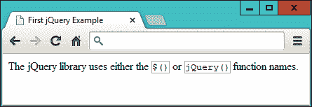

###### 图 22-1\. 使用 jQuery 修改元素

## 避免库冲突

如果您在使用 jQuery 时同时使用其他库，可能会发现它们定义了自己的 `$` 函数。为了解决这个问题，您可以在这个符号上调用 `noConflict` 方法，释放控制权，以便其他库可以接管，就像这样：

```php
$.noConflict()
```

一旦您这样做了，以后要访问 jQuery，您必须调用 `jQuery` 函数。或者您可以用您选择的对象名称替换 `$` 符号，像这样使用：

```php
jq = $.noConflict()
```

现在您可以使用关键字 `jq` 来调用 jQuery，以前您可能使用 `$`。

###### 注意

为了区分并单独跟踪 jQuery 对象和标准元素对象，一些开发人员在任何使用 jQuery 创建的对象前加上 `$` 前缀（这样它们看起来像 PHP 变量！）。

# 选择器

现在您已经看到了如何在网页中轻松包含 jQuery 并访问其功能，让我们继续看看它的选择器，它们（我相信您会高兴地了解到）与 CSS 中的工作方式完全相同。事实上，选择器是 jQuery 大部分操作的核心。

您所要做的只是考虑如何使用 CSS 样式化一个或多个元素，然后您可以使用相同的选择器在这些选定的元素上应用 jQuery 操作。这意味着您可以使用元素选择器、ID 选择器、类选择器以及它们的任何组合。

## css 方法

要解释 jQuery 对选择器的使用，让我们首先看一下更基本的 jQuery 方法之一 `css`，通过它您可以动态地更改任何 CSS 属性。它接受两个参数，要访问的属性名称和要应用的值，如下所示：

```php
css('font-family', 'Arial')
```

如您将在接下来的部分中看到的那样，您不能单独使用此方法；您必须将其附加到一个 jQuery 选择器上，该选择器将选择一个或多个应该由该方法更改属性的元素。以下示例设置所有 `<p>` 元素的内容以显示完全对齐：

```php
$('p').css('text-align', 'justify')
```

您还可以使用 `css` 方法仅通过提供属性名称（而不是第二个参数）来返回（而不是设置）计算值。在这种情况下，将返回与 ID 为 `elem` 的元素匹配的第一个元素的文本颜色。例如，以下示例将返回 ID 为 `elem` 的元素的文本颜色作为 `rgb` 方法：

```php
color = $('#elem').css('color')
```

请记住返回的值是*计算出的*值。换句话说，在调用方法时，jQuery 将计算并返回浏览器当前使用的值，而不是可能通过样式表或其他方式分配给属性的原始值。

因此，如果文本颜色是蓝色（例如），则在前面的语句中分配给变量 `color` 的值将是 `rgb(0, 0, 255)`，即使颜色最初是使用颜色名称 `blue` 或十六进制字符串 `#00f` 或 `#0000ff` 设置的。但是，此计算值始终以可分配回元素（或任何其他元素）的形式存在，通过 `css` 方法的第二个参数。

###### 警告

要注意由此方法返回的任何计算尺寸，因为根据当前的 `box-sizing` 设置（参见 第二十章），它们可能与您的预期有所不同。当您需要获取或设置宽度和高度时，不考虑 `box-sizing`，您应该使用 `width` 和 `height` 方法（以及它们的兄弟方法），如“修改尺寸”一节所述。

## 元素选择器

要选择 jQuery 操作的元素，只需在 `$` 符号（或 jQuery 函数名）后面的括号内列出其名称即可。例如，如果您想更改所有 `<blockquote>` 元素的背景颜色，可以使用如下语句：

```php
$('blockquote').css('background', 'lime')
```

## ID 选择器

如果在 ID 名称前面加上 `#` 字符，您也可以通过它们的 ID 引用元素。例如，要向 ID 为 `advert` 的元素添加边框，您可以使用以下方法：

```php
$('#advert').css('border', '3px dashed red')
```

## 类选择器

您可以根据它们使用的类来操作元素组。例如，要给所有使用类 `new` 的元素加下划线，您可以使用以下方法：

```php
$('.new').css('text-decoration', 'underline')
```

## 结合选择器

与 CSS 一样，您可以使用逗号将选择器组合为单个 jQuery 选择，如以下示例所示：

```php
$('blockquote, #advert, .new').css('font-weight', 'bold')
```

示例 22-2 将所有这些类型的选择器汇集到一个示例中（其中 jQuery 语句以粗体显示），其结果你可以在 图 22-2 中看到。

##### 示例 22-2\. 使用不同选择器的 jQuery

```php
<!DOCTYPE html>
<html>
  <head>
    <title>Second jQuery Example</title>
    <script src='jquery-3.5.1.min.js'></script>
  </head>
  <body>
    <blockquote>Powerful and flexible as JavaScript is, with a plethora of
      built-in functions, it is still necessary to use additional code for
      simple things that cannot be achieved natively or with CSS, such as
      animations, event handling, and asynchronous communication.</blockquote>
    <div id='advert'>This is an ad</div>
    <p>This is my <span class='new'>new</span> website</p>
    <script>
      `$``(``'blockquote'``)``.``css``(``'background'``,` `'lime'``)`
      `$``(``'#advert'``)``.``css``(``'border'``,` `'3px dashed red'``)`
      `$``(``'.new'``)``.``css``(``'text-decoration'``,` `'underline'``)`
      `$``(``'blockquote, #advert, .new'``)``.``css``(``'font-weight'``,` `'bold'``)`
    </script>
  </body>
</html>
```

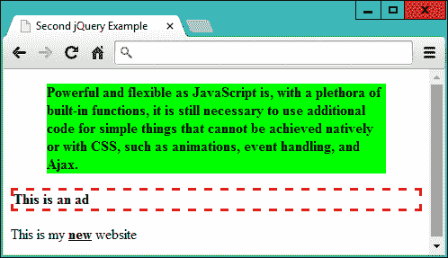

###### 图 22-2\. 操作多个元素

# 处理事件

如果 jQuery 只能修改 CSS 样式，那将不会有多大帮助，但当然，它能做的远不止于此。让我们进一步探讨它如何处理事件。

正如你所记得的，大多数事件是由用户交互触发的：当鼠标移过一个元素时，点击鼠标按钮或按键时。但也有其他可以触发的事件，例如文档加载完成时。

使用 jQuery，将自己的代码安全地附加到这些事件上是很简单的，这样就不会阻止其他代码访问它们。例如，这里是如何让 jQuery 响应元素被点击的：

```php
$('#clickme').click(function()
{
  $('#result').html('You clicked the button!')
})
```

当点击具有 `clickme` ID 的元素时，通过 jQuery 的 `html` 函数更新具有 `result` ID 的元素的 `innerHTML` 属性。

###### 警告

jQuery 对象（使用 `$` 或 `jQuery` 方法创建）与使用 `getElementById` 创建的 JavaScript 对象并不相同。在普通 JavaScript 中，你可以使用类似 `object = document.getElementById('result')` 的语句，然后（例如）`object.innerHTML = 'something'`。但在上面的例子中，`$('#result').innerHTML` 将不起作用，因为 `innerHTML` 不是 jQuery 对象的属性，因此需要使用 jQuery 方法 `html` 来实现所需的结果。

示例 22-3 扩展了这一概念；你可以在 图 22-3 中看到它的运行效果。

##### 示例 22-3\. 处理事件

```php
<!DOCTYPE html>
<html>
  <head>
    <title>jQuery Events</title>
    <script src='jquery-3.5.1.min.js'></script>
  </head>
  <body>
    <button id='clickme'>Click Me</button>
    <p id='result'>I am a paragraph</p>
    <script>
      $('#clickme').click(function()
      {
        $('#result').html('You clicked the button!')
      })
    </script>
  </body>
</html>
```

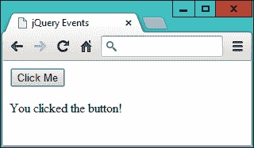

###### 图 22-3\. 处理点击事件

###### 注意

在 jQuery 中访问事件时，请省略标准 JavaScript 中使用的 `on` 前缀。因此，例如，`onmouseover` 事件名在 jQuery 中变成了 `mouseover` 函数，`onclick` 变成了 `click`，依此类推。

# 等待文档加载完成

由于 jQuery 与 DOM 关系密切，它能让你实现的功能往往需要在网页加载完成后才能操作。没有 jQuery，可以通过 `onload` 事件实现，但有一种更高效、跨浏览器的 jQuery 方法称为 `ready`，可以在最早的时刻调用它（甚至比 `onload` 更早）。这意味着 jQuery 可以更快地在页面上工作，用户体验不友好的延迟得到最小化。

要使用此功能，请将 jQuery 代码放置在以下结构中：

```php
$('document').ready(function()
{
  // Your code goes here
})
```

代码将在那里等待，直到文档准备就绪，然后才会被`ready`方法调用。实际上，你可以使用一个更短的版本，它的输入量更少，就像示例 22-4 中展示的那样。

##### 示例 22-4\. 最小的 jQuery“ready”代码封装函数

```php
$(function()
{
  // Your code goes here
})
```

如果你习惯于在这两种结构中的一种中封装你的 jQuery 语句，你就不会遇到试图过早访问 DOM 可能引发的错误类型。

###### 注意

或者，另一种方法是始终将你的 JavaScript 放在每个 HTML 页面的*末尾*，这样它只会在整个文档加载后执行。这也有一个次要优点，即确保网页内容优先加载，因此，你可能会看到用户体验的改善。

结束页面脚本可能不是个好主意的唯一时机是，如果文档看起来准备好了但其实还没有，或者所有外部样式表尚未加载（只能通过测试来真正识别），导致用户认为他们可以在你的脚本准备好之前与之交互。在这种情况下，实现`ready`函数，一切都会很顺利。实际上，如果有疑问，将你的脚本放在页面末尾，并将其 jQuery 调用放在`ready`函数内，你将获得最佳效果。

# 事件函数和属性

你刚刚看到了`ready`事件方法，但你可以访问数十个 jQuery 事件方法和相关属性（这里无法详细列出所有）。然而，以下是一些更常用的方法，它们将为大多数项目提供起点。要获取所有可用事件的详细总结，请参阅[文档](http://api.jquery.com/category/events)。

## 模糊和焦点事件

`blur`事件在从元素中移除焦点时触发，导致其模糊，是`focus`事件的良好伴侣。`blur`和`focus`方法可以用于向事件添加处理程序。如果你在方法的括号中省略任何参数，它们将触发事件。

在示例 22-5 中，有四个输入字段。第一个通过快速调用`focus`方法立即获得焦点，应用于 ID 为`first`的元素。然后，对所有`input`元素添加了一对处理程序。`focus`处理程序在给予焦点时将其背景设置为黄色，而`blur`处理程序在移除焦点（或模糊）时将其背景设置为浅灰色。

##### 示例 22-5\. 使用`focus`和`blur`事件

```php
<!DOCTYPE html>
<html>
  <head>
    <title>Events: blur</title>
    <script src='jquery-3.5.1.min.js'></script>
  </head>
  <body>
    <h2>Click in and out of these fields</h2>
    <input id='first'> <input> <input> <input>
    <script>
      $('#first').focus()
      $('input').focus(function() { $(this).css('background', '#ff0') } )
      $('input') .blur(function() { $(this).css('background', '#aaa') } )
    </script>
  </body>
</html>
```

###### 注意

允许在一个方法的右括号和用于附加另一个方法的点运算符之间（如果你喜欢，也可以在点后）包含空白字符，就像在前面的示例中我已经将`blur`事件名称右对齐在`focus`下面，以帮助其余语句也对齐在列中。

在图 22-4 中，你可以看到这段代码是如何给所有曾经获得焦点的输入字段设置浅灰色背景颜色的。如果当前有焦点，其背景颜色将设置为黄色，而未访问的字段保持白色背景颜色。

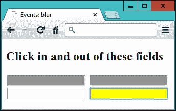

###### 图 22-4\. 附加事件处理程序到`blur`和`focus`事件

## `this`关键字

该示例还用来说明了`this`关键字的使用。当事件被调用时，触发它的元素会作为`this`对象传递，并可以传递给`$`方法进行处理。或者，由于`this`是一个标准的 JavaScript 对象（而不是 jQuery 对象），可以直接使用。所以，如果你喜欢，你可以用下面这种方式替换这段代码：

```php
$(this).css('background', '#ff0')
```

使用这个：

```php
this.style.background = '#ff0'
```

## 单击和双击事件

你之前看到了`click`事件，但也有处理双击的事件。要使用其中任何一个，将事件的方法附加到一个 jQuery 选择器上，并为其参数提供一个要触发的 jQuery 方法，就像这样：

```php
$('.myclass')   .click( function() { $(this).slideUp() })
$('.myclass').dblclick( function() { $(this).hide()    })
```

在这里，我选择使用内联的匿名函数，但如果你喜欢，也可以使用命名函数（只记得提供函数的名称而不带括号，否则会在错误的时间调用）。`this`对象将按预期传递并且可以作为命名函数的参数，就像这样：

```php
$('.myclass').click(doslide)

function doslide()
{
  $(this).slideUp()
}
```

`slideUp`和`hide`方法在“特效”章节中有详细说明。但现在，只需尝试运行示例 22-6，然后单击或双击按钮，看看它们如何有时会通过动画（使用`slideUp`）消失，有时只是消失（使用`hide`），如图 22-5 所示。

##### 示例 22-6\. 附加到`click`和`dblclick`事件

```php
<!DOCTYPE html>
<html>
  <head>
    <title>Events: click & dblclick</title>
    <script src='jquery-3.5.1.min.js'></script>
  </head>
  <body>
    <h2>Click and double click the buttons</h2>
    <button class='myclass'>Button 1</button>
    <button class='myclass'>Button 2</button>
    <button class='myclass'>Button 3</button>
    <button class='myclass'>Button 4</button>
    <button class='myclass'>Button 5</button>
    <script>
      $('.myclass').click(    function() { $(this).slideUp() })
      $('.myclass').dblclick( function() { $(this).hide()    })
    </script>
  </body>
</html>
```


###### 图 22-5\. 按钮 3 已被点击一次并向上滑动

## 键按事件

不时地，你会需要更好地控制用户的键盘交互，特别是在处理复杂表单或编写游戏时。对于这些情况，你可以使用`keypress`方法，它可以附加到接受键盘输入的任何地方，比如输入字段，甚至是文档本身。

在示例 22-7 中，该方法已经附加到文档中以拦截所有键按。运行的结果可以在图 22-6 中看到。

##### 示例 22-7\. 拦截键按

```php
<!DOCTYPE html>
<html>
  <head>
    <title>Events: keypress</title>
    <script src='jquery-3.5.1.min.js'></script>
  </head>
  <body>
    <h2>Press some keys</h2>
    <div id='result'></div>
    <script>
      $(document).keypress(function(event)
      {
        key = String.fromCharCode(event.which)

        if (key >= 'a' && key <= 'z' ||
            key >= 'A' && key <= 'Z' ||
            key >= '0' && key <= '9')
        {
          $('#result').html('You pressed: ' + key)
          event.preventDefault()
        }
      })
    </script>
  </body>
</html>
```


###### 图 22-6\. 处理键盘按键

在此示例中，有几点需要注意，当编写自己的键盘处理程序时，您需要记住这些点。例如，因为不同的浏览器返回不同的值，jQuery 将事件对象的`which`属性标准化为在所有浏览器中返回相同的字符代码。因此，这是查找按下的键的地方。

作为字符代码，`which`中的值是一个数字。您可以通过将其通过`String.fromCharCode`来将其转换为单个字母字符串。在您的代码中，您不必这样做，因为您可以轻松地响应 ASCII 值，但在需要处理字符时，此方法非常有用。

在`if`块内，当识别到按键按下时，示例代码会将相应的简单语句插入到具有 ID 为`result`的`<div>`元素的`innerHTML`属性中。

###### 警告

这是一个很好的例子，说明为什么不应该使用`document.write`函数，因为用户按下键盘时文档已经完全加载。如果此时调用`document.write`来显示信息，它会擦除当前文档。相反，将信息写入元素的 HTML 中是一种完美的、非破坏性的方式，用于提供用户反馈，正如“关于 document.write”中在第十四章中所解释的那样。

## 考虑周到的编程

当您预期用户输入时，您应该决定响应哪些值，然后忽略所有其他值，以防其他事件处理程序需要访问它们。这是一种考虑周到的做法，适用于可能正在运行的任何其他实用程序（以及主浏览器本身）。例如，在上述示例中，我选择仅接受字符 a–z、A–Z 和 0–9，忽略所有其他字符。

有两种方法可以将键盘中断传递给（或者从其他处理程序中拒绝）。首先，什么都不做；当您的代码退出时，其他处理程序也将看到并能够对相同的按键进行反应。然而，如果从单个按键触发多个动作，这可能会引起混乱。

或者，当您不希望事件触发任何其他处理程序时，可以调用事件的`preventDefault`方法，从而阻止事件“冒泡”到其他处理程序。

###### 警告

要小心`preventDefault`方法的调用位置——如果它在处理按键事件的代码部分之外，它将阻止所有其他键盘事件冒泡，并且您可能会锁定用户无法使用浏览器（或者至少无法使用某些功能）。

## 鼠标移动事件

最常拦截的事件之一是鼠标处理事件。我已经介绍了鼠标按钮点击，现在让我们来看看如何附加到鼠标移动事件。

我觉得现在是时候来一个稍微有趣一点的例子了，在 例子 22-8 中，我使用 jQuery 结合 HTML5 画布制作了一个简易的绘图程序。尽管画布直到 第二十六章 才会完全解释，但别担心，因为代码非常简单。

##### 例子 22-8\. 捕获鼠标移动和鼠标按键事件

```php
<!DOCTYPE html>
<html>
  <head>
    <title>Events: Mouse Handling</title>
    <script src='jquery-3.5.1.min.js'></script>
    <style>
      #pad {
        background:#def;
        border    :1px solid #aaa;
      }
    </style>
  </head>
  <body>
    <canvas id='pad' width='480' height='320'></canvas>
    <script>
      canvas  = $('#pad')[0]
      context = canvas.getContext("2d")
      pendown = false

      $('#pad').mousemove(function(event)
      {
        var xpos = event.pageX - canvas.offsetLeft
        var ypos = event.pageY - canvas.offsetTop

        if (pendown) context.lineTo(xpos, ypos)
        else         context.moveTo(xpos, ypos)

        context.stroke()
      })

      $('#pad').mousedown(function() { pendown = true  } )
      $('#pad')  .mouseup(function() { pendown = false } )
    </script>
  </body>
</html>
```

在 图 22-7 中，你可以看到这组相当简单的指令如何用来创建线条图（前提是你有艺术天赋，哈哈）。它的工作原理如下。首先，程序通过引用 jQuery 选择器的第一个（或零索引）元素来创建一个 `canvas` 对象，如下所示：

```php
canvas = $('#pad')[0]
```

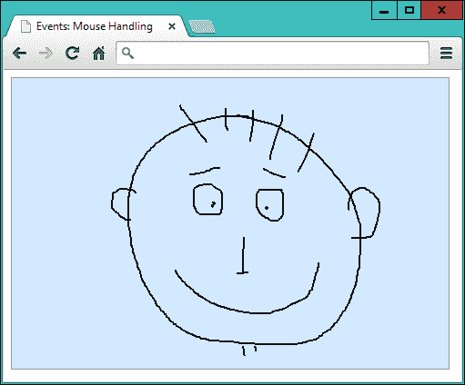

###### 图 22-7\. 捕获鼠标移动和鼠标按键事件

这是一种快速将 jQuery 对象转换为标准 JavaScript 元素对象的方法之一。另一种方法是使用 `get` 方法，如下所示：

```php
canvas  = $('#pad').get(0)
```

这两者是可以互换的，但 `get` 方法更胜一筹，因为在不传递任何参数的情况下，它将返回 jQuery 对象中所有元素节点对象作为一个数组。

无论如何，就像你将在 第二十六章 中学到的那样，画布将使用一个特殊的 `context` 对象进行绘制，现在已经创建了：

```php
context = canvas.getContext("2d")
```

还有一件需要初始化的事情，那就是一个名为 `pendown` 的布尔变量，用来跟踪鼠标按钮的状态（初始为 `false`，因为画笔处于未按下状态）：

```php
pendown = false
```

在此之后，具有 ID 为 `pad` 的画布将其 `mousemove` 事件被下面的匿名函数拦截，其中发生了三组事情：

```php
$('#pad').mousemove(function(event)
{
  ...
})
```

首先，`xpos` 和 `ypos` 这两个本地变量（因为使用了 `var` 关键字，虽然现在更好的做法是用 `let` 替代 `var`）被赋予了表示鼠标在画布区域内位置的值。

这些值来自于 jQuery 的 `pageX` 和 `pageY` 属性，它们指的是鼠标指针相对于包含文档左上角的偏移量。因此，由于画布本身稍微偏离该位置，`canvas` 的偏移值（在 `offsetLeft` 和 `offsetTop` 中）会从 `pageX` 和 `pageY` 中减去：

```php
var xpos = event.pageX - canvas.offsetLeft
var ypos = event.pageY - canvas.offsetTop
```

现在我们知道了鼠标指针相对于画布的位置，接下来的一对行代码测试了 `pendown` 的值。如果它是 `true`，则表示鼠标按钮被按下，因此会调用 `lineTo` 来绘制到当前位置的线条。否则，表示画笔未按下，所以会调用 `moveTo` 来简单更新当前位置：

```php
if (pendown) context.lineTo(xpos, ypos)
else         context.moveTo(xpos, ypos)
```

然后调用 `stroke` 方法以应用刚刚进行的任何绘图命令到画布上。这五行代码就足以处理绘图，但仍然需要跟踪鼠标按钮状态，因此代码的最后两行拦截 `mousedown` 和 `mouseup` 事件，当鼠标按下时将 `pendown` 设置为 `true`，释放时将其设置为 `false`：

```php
$('#pad').mousedown(function() { pendown = true  } )
$('#pad')  .mouseup(function() { pendown = false } )
```

在这个例子中，你可以看到三种不同的事件处理程序组合在一起创建了一个简单的实用程序，使用局部变量来进行内部表达式，并在需要跨多个函数可用对象或状态时使用全局变量。

## 其他鼠标事件

`mouseenter` 和 `mouseleave` 事件在鼠标进入或离开元素时触发。不提供位置值，因为函数假定您只是希望在触发其中一个事件时做出布尔决策。

在 示例 22-9 中，一对匿名函数附加到这些事件上，相应地改变了元素的 HTML，如 图 22-8 所示。

##### 示例 22-9\. 检测鼠标进入和离开元素

```php
<!DOCTYPE html>
<html>
  <head>
    <title>Events: Further Mouse Handling</title>
    <script src='jquery-3.5.1.min.js'></script>
  </head>
  <body>
    <h2 id='test'>Pass the mouse over me</h2>
    <script>
      $('#test').mouseenter(function() { $(this).html('Hey, stop tickling!') } )
      $('#test').mouseleave(function() { $(this).html('Where did you go?')   } )
    </script>
  </body>
</html>
```

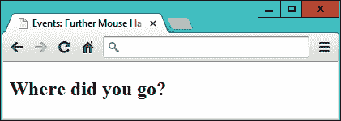

###### 图 22-8\. 检测鼠标进入和离开元素

当鼠标进入所选元素的边界时，该元素的 `innerHTML` 属性会更新（通过调用 `html`）。然后，当鼠标再次离开时，会进一步更新元素的 HTML。

## 替代鼠标方法

还有许多其他的 jQuery 鼠标事件函数可用于覆盖各种情况，所有这些都在 [鼠标事件文档](https://tinyurl.com/jquerymouse) 中详细描述。例如，您可以使用以下替代的 `mouseover` 和 `mouseout` 方法来实现与前面章节中代码类似的结果：

```php
$('#test').mouseover(function() { $(this).html('Cut it out!')         } )
$('#test') .mouseout(function() { $(this).html('Try it this time...') } )
```

或者您可以使用 `hover` 方法通过单个函数调用绑定两个处理程序，如下所示：

```php
$('#test').hover(function() { $(this).html('Cut it out!')         },
                 function() { $(this).html('Try it this time...') } )
```

如果您计划创建 `mouseover` 和 `mouseout` 的组合效果，`hover` 方法显然是选择的逻辑函数，但也有另一种方法可以实现相同的结果，即 *方法链*（在 “方法链” 部分解释），使用以下代码：

```php
$('#test').mouseover(function() { $(this).html('Cut it out!')         } )
           .mouseout(function() { $(this).html('Try it this time...') } )
```

在第二个语句的开始处使用句点操作符将其附加到第一个语句，从而创建了一系列方法链。

###### 注意

上述示例展示了如何捕获鼠标点击、鼠标移动和键盘事件，因此它们大多适用于桌面环境——这是 jQuery 主要针对的。但是，jQuery 还有一个为移动设备提供所有触摸处理事件控制的版本，称为 [jQuery Mobile](http://jquerymobile.com)。我们将在下一章中详细介绍这一点。

## 提交事件

When a form is submitted, you may want to perform some error checking on the data entered before it gets sent to the server. One way to do this is to intercept the `submit` event of the form, as in Example 22-10. Figure 22-9 shows the result of loading this document and then submitting the form with one or more fields left empty.

##### Example 22-10\. 拦截表单的 `submit` 事件

```php
<!DOCTYPE html>
<html>
  <head>
    <title>Events: submit</title>
    <script src='jquery-3.5.1.min.js'></script>
  </head>
  <body>
    <form id='form'>
      First name: <input id='fname' type='text' name='fname'><br>
      Last name:  <input id='lname' type='text' name='lname'><br>
      <input type='submit'>
    </form>
    <script>
      $('#form').submit(function()
      {
        if ($('#fname').val() == '' ||
            $('#lname').val() == '')
        {
          alert('Please enter both names')
          return false
        }
      })
    </script>
  </body>
</html>
```


###### Figure 22-9\. 提交时检查用户输入

The key parts of this example are where the event is attached to an anonymous function, like this:

```php
$('#form').submit(function()
```

and where the values of the two input fields are tested for being empty:

```php
if ($('#fname').val() == '' ||
    $('#lname').val() == '')
```

Here the jQuery `val` method is used to retrieve the value in the `value` property of each field. This is neater than using `$('#fname')[0]` (as in Example 22-8) to get access to the DOM object and then appending `value` to it to read the field’s value, like this: `$('#fname')[0].value`.

In this example, by returning the value `false` if one or more fields are empty, the `if` test cancels the normal submission process. To enable the submission to proceed, you can return `true`, or just not return anything.

# 特效

jQuery really begins to come into its own when processing special effects. Although you can use CSS3 transitions, they are not always easy to manage dynamically from JavaScript—but with jQuery it really is as simple as selecting one or more elements and then applying one or more effects to them.

The core effects available are hiding and showing, fading in and out, sliding, and animations. These can be used singly, together in synchronization, or in sequence. They also support the use of callbacks, which are functions or methods that get called only once an operation has completed.

The following sections describe some of the more useful jQuery effects, each of which supports up to three arguments, as follows:

<dfn class="keep-together">持续时间</dfn>

When a duration value is supplied, the effect will take place over the assigned time, which can be a value in milliseconds or the strings `fast` or `slow`.

<dfn class="keep-together">缓动</dfn>

There are only two easing options in the jQuery library, `swing` and `linear`. The default is `swing`, which gives a more natural effect than `linear`. For more easing options, you can check out plug-ins like [jQuery UI](http://jqueryui.com/easing).

<dfn class="keep-together">回调</dfn>

If you supply a callback function, it will be called after the effect method completes.

This means that when no arguments are given, the method is called immediately without being placed in the animation queue.

So, for example, you can call the `hide` method in a variety of ways, such as these:

```php
$('#object').hide()
$('#object').hide(1000)
$('#object').hide('fast')
$('#object').hide('linear')
$('#object').hide('slow', 'linear')
$('#object').hide(myfunction)
$('#object').hide(333, myfunction)
$('#object').hide(200, 'linear', function() { alert('Finished!') } )
```

正如您将在“方法链接”部分中看到的那样，您可以将函数调用（带参数）连接在一起，它们将依次被动画化，就像以下示例中将隐藏然后显示一个元素的方式：

```php
$('#object').hide(1000).show(1000)
```

许多这些方法还支持其他不常用的参数，并且您可以访问[effects 文档](http://api.jquery.com/category/effects)以获取所有这些方法的详细信息。

## 隐藏和显示

可能最简单的效果是根据用户交互隐藏和显示元素。正如前一节所述，您可以不提供参数或提供各种参数给 `hide` 和 `show` 方法。默认情况下，当没有参数提供时，结果是立即隐藏或显示一个元素。

当提供了参数时，这两种方法同时修改元素的 `width`、`height` 和 `opacity` 属性，直到对于 `hide` 是达到 `0`，对于 `show` 是达到它们的原始值。当元素完全隐藏时，`hide` 函数将元素的 `display` 属性设置为 `none`，而 `show` 函数在元素完全恢复后重新分配其先前的值。

示例 22-11 允许您自己尝试 `hide` 和 `show`（如图 22-10 所示）。

##### 示例 22-11\. 隐藏和显示一个元素

```php
<!DOCTYPE html>
<html>
  <head>
    <title>Effects: hide & show</title>
    <script src='jquery-3.5.1.min.js'></script>
  </head>
  <body>
    <button id='hide'>Hide</button>
    <button id='show'>Show</button>
    <p id='text'>Click the Hide and Show buttons</p>
    <script>
      $('#hide').click(function() { $('#text').hide('slow', 'linear') })
      $('#show').click(function() { $('#text').show('slow', 'linear') })
    </script>
  </body>
</html>
```

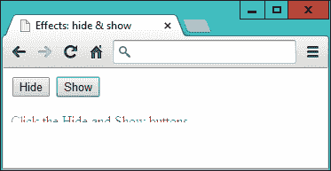

###### 图 22-10\. 元素正在被显示的过程中

## toggle 方法

作为调用 `hide` 和 `show` 方法的替代方法，您可以使用 `toggle` 方法，它使您可以用示例 22-12 替换前面的示例。

##### 示例 22-12\. 使用 `toggle` 方法

```php
<!DOCTYPE html>
<html>
  <head>
    <title>Effects: toggle</title>
    <script src='jquery-3.5.1.min.js'></script>
  </head>
  <body>
    <button id='toggle'>Toggle</button>
    <p id='text'>Click the Toggle button</p>
    <script>
      $('#toggle').click(function() { $('#text').toggle('slow', 'linear') })
    </script>
  </body>
</html>
```

`toggle` 方法接受与 `hide` 和 `show` 相同的参数，但在内部跟踪元素的状态，以便知道是隐藏还是显示它。

###### 注

有四种主要的 jQuery 方法可以设置元素的一个状态或另一个状态，并提供切换版本以简化编码。除了 `toggle` 外，还有 `fadeToggle`、`slideToggle` 和 `toggleClass`，本章节中均有描述。

## 淡入和淡出

四种方法管理淡入淡出：`fadeIn`、`fadeOut`、`fadeToggle` 和 `fadeTo`。到目前为止，您应该已经了解了 jQuery 的工作原理，并且意识到前三者与 `show`、`hide` 和 `toggle` 类似。然而，最后一个有点不同，它允许您指定一个透明度值，使元素（或元素）淡入到 `0` 和 `1` 之间。

示例 22-13 提供了四个按钮，用于尝试每种方法，如图 22-11 所示。

##### 示例 22-13\. 四种淡入淡出方法

```php
<!DOCTYPE html>
<html>
  <head>
    <title>Effects: Fading</title>
    <script src='jquery-3.5.1.min.js'></script>
  </head>
  <body>
    <button id='fadeout'>fadeOut</button>
    <button id='fadein'>fadeIn</button>
    <button id='fadetoggle'>fadeToggle</button>
    <button id='fadeto'>fadeTo</button>
    <p id='text'>Click the buttons above</p>
    <script>
      $('#fadeout')   .click(function() { $('#text').fadeOut(   'slow'     ) })
      $('#fadein')    .click(function() { $('#text').fadeIn(    'slow'     ) })
      $('#fadetoggle').click(function() { $('#text').fadeToggle('slow'     ) })
      $('#fadeto')    .click(function() { $('#text').fadeTo(    'slow', 0.5) })
    </script>
  </body>
</html>
```


###### 图 22-11\. 文本已经淡出到 50% 的不透明度

## 上下滑动元素

另一种让元素消失和重新出现的方法是随着时间的推移改变它们的高度，使它们看起来像是向上和向下滑动。这里有三个 jQuery 方法来实现：`slideDown`、`slideUp`和`slideToggle`。它们的工作方式类似于之前的函数，如在例子 22-14 中编码和图 22-12 中显示的那样。

##### 例子 22-14\. 使用滑动方法

```php
<!DOCTYPE html>
<html>
  <head>
    <title>Effects: Sliding</title>
    <script src='jquery-3.5.1.min.js'></script>
  </head>
  <body>
    <button id='slideup'>slideUp</button>
    <button id='slidedown'>slideDown</button>
    <button id='slidetoggle'>slideToggle</button>
    <div id='para' style='background:#def'>
      <h2>From A Tale of Two Cities - By Charles Dickens</h2>
      <p>It was the best of times, it was the worst of times, it was the age of
      wisdom, it was the age of foolishness, it was the epoch of belief, it was
      the epoch of incredulity, it was the season of Light, it was the season of
      Darkness, it was the spring of hope, it was the winter of despair, we had
      everything before us, we had nothing before us, we were all going direct to
      Heaven, we were all going direct the other way - in short, the period was so
      far like the present period, that some of its noisiest authorities insisted
      on its being received, for good or for evil, in the superlative degree of
      comparison only</p>
    </div>
    <script>
      $('#slideup')    .click(function() { $('#para').slideUp(    'slow') })
      $('#slidedown')  .click(function() { $('#para').slideDown(  'slow') })
      $('#slidetoggle').click(function() { $('#para').slideToggle('slow') })
    </script>
  </body>
</html>
```

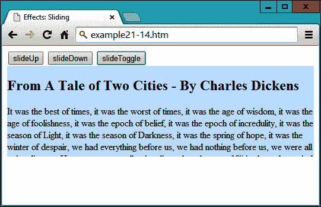

###### 图 22-12\. 段落正在向上滑动

当你想要根据用户点击的部分动态打开或关闭菜单和子菜单时，这些方法表现很好。

## 动画

现在我们可以真正开始在浏览器中移动元素，这样做的话，由于默认的 `static` 值不允许它们移动，你必须首先给你的元素的 `position` 属性赋予 `relative`、`fixed` 或 `absolute` 的值。

要为一个元素添加动画效果，你只需提供一个 CSS 属性列表（不包括颜色）给`animate`方法。不同于之前的效果方法，`animate`首先需要这个属性列表，然后你可以提供任何所需的持续时间、缓动和回调参数。

例如，要创建一个跳动的球动画，可以使用如下代码，就像例子 22-15 中显示的那样（显示为图 22-13）。

##### 例子 22-15\. 创建一个跳动的球动画

```php
<!DOCTYPE html>
<html>
  <head>
    <title>Effects: Animation</title>
    <script src='jquery-3.5.1.min.js'></script>
    <style>
      #ball {
        position  :relative;
      }
      #box {
        width     :640px;
        height    :480px;
        background:green;
        border    :1px solid #444;
      }
    </style>
  </head>
  <body>
    <div id='box'>
      
    </div>
    <script>
      bounce()

      function bounce()
      {
        $('#ball')
          .animate( { left:'270px', top :'380px' }, 'slow', 'linear')
          .animate( { left:'540px', top :'190px' }, 'slow', 'linear')
          .animate( { left:'270px', top :'0px'   }, 'slow', 'linear')
          .animate( { left:'0px',   top :'190px' }, 'slow', 'linear')
      }
    </script>
  </body>
</html>
```

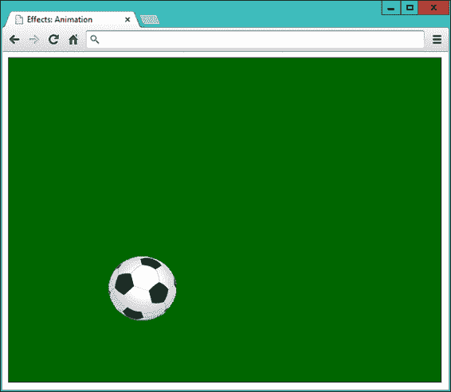

###### 图 22-13\. 浏览器中的球在跳动

在这个例子的 `<style>` 部分中，球的 `position` 属性相对于其容器设置为相对定位，容器是一个带有边框和绿色背景的 `<div>` 元素。

然后在 `<script>` 部分有一个名为 `bounce` 的函数，它连接了四次 `animate` 调用。请注意，要动画化的属性名称（例如此例中的 `left` 和 `top`）是以关联数组的形式提供的，不需要引号，并且与它们应该更改到的值（例如 `'270px'`）之间用冒号分隔。

你还可以通过使用`+=`和`-=`运算符提供相对值来代替绝对值。例如，以下代码将使球相对于其当前位置向右和向上移动 50 像素：

```php
.animate( { left:'`+=`50px', top:'`-=`50px' }, 'slow', 'linear')
```

而且你甚至可以使用字符串值`hide`，`show`和`toggle`来更新属性，就像这样：

```php
.animate( { height:'`hide`', width:'`toggle`' }, 'slow', 'linear')
```

###### 警告

如果您希望修改任何连字符的 CSS 属性，并且它们未在引号内传递（例如在前面示例中的`height`和`width`），则必须通过删除连字符并大写后面的字母来将其名称转换为 camelCase。例如，要动画化元素的`left-margin`属性，您应该提供`leftMargin`作为名称。然而，当在字符串内提供连字符属性名时，例如`css('font-weight', 'bold')`，*不应*将其转换为 camelCase。

### 方法链

由于方法链的工作方式，当 jQuery 方法带有参数时，它们将按顺序运行。因此，这些方法中的每一个都是在前一个动画完成后才调用的。然而，您调用的没有参数的方法将立即并快速地运行，而不会有动画效果。

当您将 Example 22-15 加载到 Web 浏览器中时，动画会通过对`bounce`的单个调用（可以说）启动，导致球从其容器的底部、右侧和顶部边缘弹起，然后回到左侧边缘的中间位置。再次查看本示例中的`bounce`函数，您可以看到有四个链接调用了`animate`函数。

### 使用回调

就目前而言，前面的示例在四个动画后停止，但您可以使用回调函数使动画在每次完成后重新开始。这就是我选择将动画放在一个命名函数中的原因。

使用`bounce`函数中的动画，只需将该名称作为第四个动画组的回调添加即可使动画永远重复，如下所示加粗显示：

```php
.animate( { left:'0px', top :'190px' }, 'slow', 'linear'`,` `bounce`)
```

使用`animate`方法，您可以动画化许多 CSS 属性，但颜色是一个值得注意的例外。然而，即使是颜色动画也可以通过 jQuery UI 插件的添加来实现，该插件提供了创建非常令人愉悦的颜色变化效果（以及许多其他好处）的功能。请参阅 [jQuery UI 页面](http://jqueryui.com) 了解详情。

## 停止动画

有几种方法可以在动画进行中途停止或结束一系列动画。例如，`clearQueue`可以清空队列中的所有存储的动画，`stop`可以立即停止当前正在进行的任何动画，`finish`将停止当前运行的动画并移除队列中的任何动画。

将之前的示例转换为一种类似游戏的形式，通过使球可以点击，触发点击事件时动画将停止。要做到这一点，只需在`bounce`函数下面添加以下单行代码即可：

```php
$('#ball').click(function() { $(this).finish() })
```

如果您成功地点击了球，`finish`方法将停止当前动画，清空队列，并忽略任何回调——换句话说，球将停止在原地。

要了解更多关于管理 jQuery 队列的信息，请查看[`queue`方法的文档](http://api.jquery.com/queue)，您还将了解如何直接操作队列的内容以获得您需要的效果。

# 操作 DOM

由于 jQuery 与 DOM 紧密相关，因此本章的示例已经使用了一些其 DOM 访问方法，如`html`和`val`。现在让我们详细看看所有的 DOM 方法，以了解您可以如何利用 jQuery 来访问它们。

在示例 22-3 中，您看到如何使用`html`方法更改元素的`innerHTML`属性。此方法可用于设置 HTML 或从 HTML 文档中检索 HTML。示例 22-16（其中使用粗体显示了 jQuery）展示了如何检索元素的 HTML 内容（如图 22-14 所示）。

##### 示例 22-16\. 使用警告窗口显示元素的 HTML

```php
<!DOCTYPE html>
<html>
  <head>
    <title>The DOM: html & text</title>
    <script src='jquery-3.5.1.min.js'></script>
  </head>
  <body>
    <h2>Example Document</h2>
    <p id='intro'>This is an example document</p>
    <script>
      alert(`$``(``'#intro'``)``.``html``(``)`)
    </script>
  </body>
</html>
```

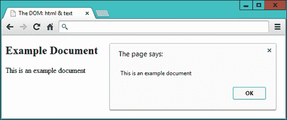

###### 图 22-14\. 检索和显示元素的 HTML

当您调用此方法而不带参数时，结果是读取元素的 HTML 而不是设置它。

## text 和 html 方法的区别

当您使用 XML 文档时，您不能使用`html`方法，因为它根本不起作用（它仅设计用于 HTML）。但是，您可以使用`text`方法来实现类似的结果（在 XML 或 HTML 文档中），如下所示：

```php
text = $('#intro').text()
```

这两者的区别非常简单，即`html`将内容视为 HTML，而`text`将其视为文本。例如，假设您希望将以下字符串分配给一个元素：

```php
<a href='http://google.com'>Visit Google</a>
```

如果您使用`html`方法将其分配给 HTML 元素，则 DOM 将使用新的`<a>`元素进行更新，链接将变为可点击。但是，如果您将其分配给 XML 或 HTML 文档并使用`text`方法，则该字符串将首先转义为文本（例如，通过将 HTML 字符如`<`转换为`&lt;`实体等），然后插入元素中——不会向 DOM 添加元素。

## val 和 attr 方法

还有一些与元素内容交互的方法。首先，您可以使用`val`方法设置和获取输入元素的值，如示例 22-10 所示，其中读取了名字字段。要设置值，只需将其作为参数提供给该方法，如下所示：

```php
$('#password').val('mypass123')
```

使用`attr`方法，您可以获取和设置元素的属性，如示例 22-17 所示，其中将指向 Google 网站的链接完全替换为指向 Yahoo 的链接。

##### 示例 22-17\. 使用`attr`方法修改属性

```php
<!DOCTYPE html>
<html>
  <head>
    <title>The DOM: attr</title>
    <script src='jquery-3.5.1.min.js'></script>
  </head>
  <body>
    <h2>Example Document</h2>
    <p><a id='link' href='http://google.com' title='Google'>Visit Google</a></p>
    <script>
      $('#link').text('Visit Yahoo!')
      $('#link').attr( { href :'http://yahoo.com', title:'Yahoo!' } )
      alert('The new HTML is:\n' + $('p').html())
    </script>
  </body>
</html>
```

第一个 jQuery 语句使用`text`方法来更改`<a>`元素内的文本，第二个语句通过提供关联数组形式的数据来更改`href`和`title`属性值以匹配。第三个语句通过首先使用`html`方法检索更改后的元素内容，然后在警告窗口中显示它，如图 22-15 所示。


###### 图 22-15\. 现在链接已完全修改

您还可以这样读取属性的值：

```php
url = $('#link').attr('href')
```

## 添加和删除元素

虽然可以使用`html`方法将元素插入 DOM 中，但这仅适用于创建特定元素的子元素。因此，jQuery 提供了许多方法来操作 DOM 的任何部分。

这些方法是`append`、`prepend`、`after`、`before`、`remove`和`empty`。每个示例都在示例 22-18 中出现。

##### 示例 22-18\. 添加和删除元素

```php
<!DOCTYPE html>
<html>
  <head>
    <title>Modifying The DOM</title>
    <script src='jquery-3.5.1.min.js'></script>
  </head>
  <body>
    <h2>Example Document</h2>
    <a href='http://google.com' title='Google'>Visit Google</a>
    <code>
      This is a code section
    </code>
    <p>
      <button id='a'>Remove the image</button>
      <button id='b'>Empty the quote</button>
    </p>
    
    <blockquote id='quote' style='border:1px dotted #444; height:20px;'>
      test
    </blockquote>
    <script>
      $('a').prepend('Link: ')
      $("[href^='http']").append(" ")
      $('code').before('<hr>').after('<hr>')
      $('#a').click(function() { $('#ball').remove() } )
      $('#b').click(function() { $('#quote').empty() } )
    </script>
  </body>
</html>
```

在图 22-16 中，您可以看到将`prepend`、`append`、`before`和`after`方法应用于某些元素的结果。

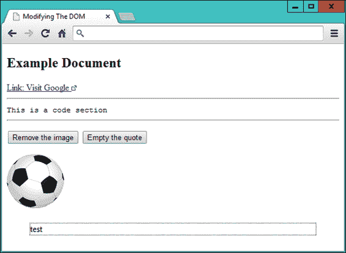

###### 图 22-16\. 一个包含各种元素的文档

已使用`prepend`方法在所有`<a>`元素的内部文本或 HTML 前插入字符串`Link:`，如下所示：

```php
$('a').prepend('Link: ')
```

然后使用属性选择器选择所有具有以`http`开头的`href`属性的元素。由于`^=`运算符，URL 开头的字符串`http`表示非相对链接，因此是绝对链接。在所有匹配元素的内部文本或 HTML 末尾附加外部链接图标，如下所示：

```php
$("[href^='http']").append(" ")
```

###### 注意

`^=`运算符是仅匹配字符串开头的方式。如果只使用`=`运算符，则只会选择整个匹配的字符串。有关详细的 CSS 选择器信息，请参见第十九章和第二十章。

接下来，使用链式方法，将`before`和`after`方法用于在另一个元素之前或之后放置同级元素。在此示例中，我选择在`<code>`元素之前和之后分别放置一个`<hr>`元素，如下所示：

```php
$('code').before('<hr>').after('<hr>')
```

然后，我通过添加几个按钮增加了一些用户交互。点击时，第一个按钮使用`remove`方法移除包含球的``元素，如下所示：

```php
$('#a').click(function() { $('#ball').remove() } )
```

###### 注意

如果在大多数主要桌面浏览器中右键单击并选择检查元素，您将会发现图片现在已不再在 DOM 中。

最后，当点击第二个按钮时，将`empty`方法应用于`<blockquote>`元素，如下所示：

```php
$('#b').click(function() { $('#quote').empty() } )
```

这会清空元素的内容，但保留元素在 DOM 中。

# 动态应用类

有时候改变应用于元素的类会很方便，或者只是向元素添加一个类或从一个类中删除它。例如，假设你有一个名为`read`的类，用来为已读的博客文章设置样式。使用`addClass`方法，很容易向该文章添加一个类，就像这样：

```php
$('#post23').addClass('read')
```

你可以一次添加多个类，用空格分隔，就像这样：

```php
$('#post23').addClass('read liked')
```

但是如果读者选择将文章标记为未读，以便稍后再次阅读呢？在这种情况下，只需使用`removeClass`，像这样：

```php
$('#post23').removeClass('read')
```

当你这样做时，文章使用的所有其他类都不受影响。

然而，在支持类持续添加或删除的情况下，您可能会发现使用`toggleClass`方法更简单，像这样：

```php
$('#post23').toggleClass('read')
```

现在，如果文章尚未使用该类，则添加它；否则，将其删除。

# 修改尺寸

处理尺寸始终是一个棘手的 Web 开发任务，因为不同的浏览器倾向于使用略有不同的值。因此，jQuery 的一个主要优势之一是它很好地规范化这些类型的值，使得您的页面在所有主要浏览器中显示效果符合您的意图。

有三种类型的尺寸：元素宽度和高度，内部宽度和高度，外部宽度和高度。让我们依次看看这些。

## 宽度和高度方法

`width`和`height`方法都可以获取与选择器匹配的第一个元素的宽度或高度，或者设置所有匹配元素的宽度或高度。例如，要获取 ID 为`elem`的元素的宽度，可以使用这个语句：

```php
width = $('#elem').width()
```

赋给变量`width`的值是一个纯数值，与调用`css`方法返回 CSS 值不同，例如下面的例子，将返回（例如）`230px`而不只是数字`230`：

```php
width = $('#elem').css('width')
```

您还可以获取当前窗口或文档的宽度，如下所示：

```php
width = $(window).width()
width = $(document).width()
```

###### 警告

当你将`window`或`document`对象传递给 jQuery 时，不能使用`css`方法获取它们的宽度或高度。相反，你必须使用`width`或`height`方法。

返回的值与`box-sizing`设置无关（见第 20 章）。如果需要考虑`box-sizing`，则应使用`css`方法并传递`width`作为参数，就像这样（但记住在打算使用返回值时从数字部分后面添加的`px`中删除）：

```php
width = $('#elem').css('width')
```

设置值同样简单。例如，要将所有使用`box`类的元素设置为 100×100 像素，可以使用这个语句：

```php
$('.box').width(100).height(100)
```

示例 22-19 将这些操作组合成一个单独的程序，显示为图 22-17。

##### 示例 22-19\. 获取和设置元素尺寸

```php
<!DOCTYPE html>
<html>
  <head>
    <title>Dimensions</title>
    <script src='jquery-3.5.1.min.js'></script>
  </head>
  <body>
    <p>
      <button id='getdoc'>Get document width</button>
      <button id='getwin'>Get window width</button>
      <button id='getdiv'>Get div width</button>
      <button id='setdiv'>Set div width to 150 pixels</button>
    </p>
    <div id='result' style='width:300px; height:50px; background:#def;'></div>
    <script>
      $('#getdoc').click(function()
      {
        $('#result').html('Document width: ' + $(document).width())
      } )

      $('#getwin').click(function()
      {
        $('#result').html('Window width: ' + $(window).width())
      } )

      $('#getdiv').click(function()
      {
        $('#result').html('Div width: ' + $('#result').width())
      } )

      $('#setdiv').click(function()
      {
        $('#result').width(150)
        $('#result').html('Div width: ' + $('#result').width())
      } )
    </script>
  </body>
</html>
```

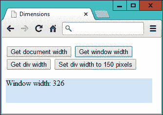

###### 图 22-17\. 获取和设置元素尺寸

在`<body>`的开头，有四个按钮：三个用于报告文档、窗口和出现在按钮正下方的`<div>`元素的宽度；还有一个用于将`<div>`的宽度设置为新值。在`<script>`部分中，有四个 jQuery 语句，前三个只是获取给定对象的宽度，然后通过写入 HTML 到`<div>`中报告这些值。

最终的语句有两个部分：第一个将`<div>`元素的宽度减少到 150 像素，第二个通过使用`width`方法获取并在`<div>`内显示新的宽度值，以确保显示计算出的值。

###### 警告

当用户缩放页面（无论是放大还是缩小），这个事件在所有主要浏览器中都不能以 JavaScript 可靠检测到。因此，jQuery 在应用或返回尺寸值时无法考虑缩放，因此在这种情况下可能会得到意外的结果。

## `innerWidth`和`innerHeight`方法

在处理尺寸时，通常还需要考虑边框、填充和其他属性。为此，您可以使用`innerWidth`和`innerHeight`方法返回匹配选择器的第一个元素的宽度和高度，*包括*填充但*不包括*边框。

例如，以下代码返回具有 ID 为`elem`的元素的`innerWidth`，包括填充：

```php
iwidth = $('#elem').innerWidth()
```

## `outerWidth`和`outerHeight`方法

要返回包括*填充和边框*在内的元素尺寸，您可以调用`outerWidth`和`outerHeight`方法，如下所示：

```php
owidth = $('#elem').outerWidth()
```

如果您希望*还*在返回的值中包括任何边距，可以在调用这些方法时传递`true`值，如下所示：

```php
owidth = $('#elem').outerWidth(true)
```

###### 警告

对于任何`inner...`或`outer...`方法返回的值，不一定是整数，在某些情况下可能是小数。这些方法不能检测用户页面缩放，并且不能在`window`或`document`对象上使用这些方法；对于这些对象，请使用`width`或`height`方法。

# DOM 遍历

如果您回顾一下第十四章中关于文档对象模型的部分，您会记得所有网页都构建得像是扩展家族。有父对象和子对象，兄弟姐妹，祖父母，孙子辈，甚至可以称为表亲，姨妈等元素关系。例如，在以下片段中，`<li>`元素是`<ul>`元素的子元素，而`<ul>`元素反过来是`<li>`元素的父元素：

```php
<ul>
  <li>Item 1</li>
  <li>Item 2</li>
  <li>Item 3</li>
</ul>
```

就像在家庭中一样，你可以用多种方式引用 HTML 元素，比如通过绝对规格或者从窗口级别开始，然后往下移动（也称为*遍历 DOM*）。你还可以利用一个元素与另一个元素之间的关系来引用元素。实际上，这取决于你的具体项目——例如，如果你希望网页尽可能自包含，这样你就能更有可能将元素剪切并粘贴到其他网页文档中，而无需修改粘贴到的 HTML 以匹配目标的 HTML。无论你选择什么，jQuery 都提供了广泛的功能来帮助你准确地处理元素。

## 父元素

要引用元素的直接父级，请使用以下`parent`方法：

```php
my_parent = $('#elem').parent()
```

无论`elem`是什么类型的元素，`my_parent`对象现在包含一个指向其父元素的 jQuery 对象。实际上，由于选择器可以引用多个元素，这个调用实际上返回一个指向父元素列表的对象（尽管列表可能只有一项）。

因为父元素可能有许多子元素，所以你可能会想知道是否可以通过这种方法返回比父元素多的元素。以前面的代码片段为例，其中有三个`<li>`元素。如果我们这样做：

```php
my_parent = $('li').parent()
```

当然，由于一个父元素可能有多个子元素，你可能会想知道此方法是否会返回比父元素更多的元素。考虑前面有三个`<li>`元素的片段。如果我们这样做：

```php
alert($('li').parent().length)
```

现在让我们在选择器匹配时执行某些操作，例如将前面代码段中父元素的`font-weight`属性更改为`bold`，如下所示：

```php
$('li').parent().css('font-weight', 'bold')
```

### 使用过滤器

可选地，可以向`parent`传递选择器以过滤应该反映所需更改的父级。例如，例子 22-20 有三个小列表和几个 jQuery 语句。

##### 示例 22-20\. 访问父元素

```php
<!DOCTYPE html>
<html>
  <head>
    <title>DOM Traversal: Parent</title>
    <script src='jquery-3.5.1.min.js'></script>
  </head>
  <body>
    <ul>
      <li>Item 1</li>
      <li>Item 2</li>
      <li>Item 3</li>
    </ul>
    <ul class='memo'>
      <li>Item 1</li>
      <li>Item 2</li>
      <li>Item 3</li>
    </ul>
    <ul>
      <li>Item 1</li>
      <li>Item 2</li>
      <li>Item 3</li>
    </ul>
    <script>
      $('li').parent()       .css('font-weight',     'bold')
      $('li').parent('.memo').css('list-style-type', 'circle')
    </script>
  </body>
</html>
```

这三个列表都一样，除了中间的`<ul>`元素使用了类`memo`。在`<script>`部分，第一个语句将`font-weight`属性应用于所有`<li>`元素的父级，属性值为`bold`。在这种情况下，导致所有`<ul>`元素显示为粗体。

第二个语句类似，但还将类名`memo`传递给`parent`方法，以便只选择该父元素。然后调用`css`方法将所选列表的`list-style-type`属性设置为`circle`。图 22-18 展示了这两个语句的效果。

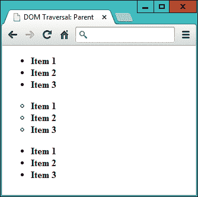

###### 图 22-18\. 使用和不使用过滤器访问父元素

### 选择所有祖先元素

我们刚刚看到如何选择元素的直接父元素，但你也可以通过使用`parents`方法选择祖先元素，一直返回到`<html>`根元素。但为什么要这样做呢？好吧，可能是想要访问祖先链中第一个`<div>`元素，以根据稍后在链中进行的某些动态操作来设置其样式？

对于你现在能想到的任何目的，这种类型的选择可能稍微过于高级，但当你需要时，你会很高兴它在那里，以下是你可能要采取的步骤：

```php
$('#elem').parents('div').css('background', 'yellow')
```

实际上，这可能并不完全是你想要的，因为它会选择祖先链中的所有`<div>`元素，而可能还有其他你不想样式化的元素进一步向上。因此，在这种情况下，你可以使用`parentsUntil`方法进一步过滤选择。

`parentsUntil`方法沿着祖先链向上遍历，方式与`parents`相同，但在遇到与选择过滤器匹配的第一个元素时停止（在本例中，是一个`<div>`元素），因此可以像前述语句一样使用它，确保只选择你想要的最接近匹配的元素：

```php
$('#elem').parentsUntil('div').css('background', 'yellow')
```

要说明这两种方法的区别，请查看示例 22-21，其中包含两组嵌套元素，都位于一个父`<div>`元素内。`<script>`部分调用了`parents`和`parentsUntil`方法的一个示例。

##### 示例 22-21\. 使用`parents`和`parentsUntil`方法

```php
<!DOCTYPE html>
<html>
  <head>
    <title>DOM Traversal: Parents</title>
    <script src='jquery-3.5.1.min.js'></script>
  </head>
  <body>
    <div>
      `<div``>`
        `<section``>`
          `<blockquote``>`
            `<ul``>`
              `<li``>``Item 1``</li>`
              `<li` `id=``'elem'``>``Item 2``</li>`
              `<li``>``Item 3``</li>`
            `</ul>`
          `</blockquote>`
        `</section>`
      `</div>`
      <div>
        <section>
          <blockquote>
            <ul>
              <li>Item 1</li>
              <li>Item 2</li>
              <li>Item 3</li>
            </ul>
          </blockquote>
        </section>
      </div>
    </div>
    <script>
      $('#elem').parents('div')     .css('background',      'yellow')
      $('#elem').parentsUntil('div').css('text-decoration', 'underline')
    </script>
  </body>
</html>
```

如果你看一下图 22-19，你会发现第一个 jQuery 语句设置了所有内容的背景颜色为黄色。这是因为祖先树已经通过`parents`方法遍历到`<html>`元素，同时选择了在树向上遍历过程中遇到的两个`<div>`元素（其中一个包含具有`elem` ID 的`<li>`元素—以粗体显示—及其父`<div>`，它包含两组嵌套元素）。


###### 图 22-19\. 比较`parents`和`parentsUntil`方法

然而，第二个语句使用了`parentsUntil`，使得选择在遇到第一个`<div>`元素时停止。这意味着当应用下划线样式时，它仅适用于包含具有`elem` ID 的`<li>`元素的最近的父`<div>`。外部的`<div>`没有被达到，因为它没有被样式化，所以第二个列表没有被下划线标记。

## 子元素

要访问元素的子元素，请使用`children`方法，如下所示：

```php
my_children = $('#elem').children()
```

像`parent`方法一样，这只下降一级并返回零、一个或多个匹配选择的列表。你也可以向它传递一个过滤器参数来选择子元素，如下所示：

```php
li_children = $('#elem').children('li')
```

在这里，只会选择作为`<li>`元素的子元素的子元素。

要深入到后代中，你需要使用`find`方法，它是`parents`的反向操作，就像这样：

```php
li_descendants = $('#elem').find('li')
```

然而，与`parents`不同，你*必须*为`find`方法提供一个过滤选择器。如果你需要选择所有后代元素，你可以使用通用选择器，就像这样：

```php
all_descendants = $('#elem').find('*')
```

## 兄弟元素

在选择兄弟元素时，有更广泛的方法可用，从`siblings`开始。

`siblings`方法将返回所有符合条件的元素，这些元素是同一父元素的子元素，*除了*用于选择的元素。因此，以以下片段的示例来说，如果你查找具有 ID 为`two`的`<li>`元素的兄弟元素，它将仅返回第一个和第三个`<li>`元素：

```php
<ul>
  <li>Item 1</li>
  <li id='two'>Item 2</li>
  <li>Item 3</li>
</ul>
```

例如，以下语句将导致第一个和第三个兄弟元素加粗：

```php
$('#two').siblings().css('font-weight', 'bold')
```

你还可以在`siblings`方法中使用过滤器来进一步缩小返回的兄弟元素。例如，要仅选择使用类`new`的兄弟元素，可以使用如下语句：

```php
$('#two').siblings('.new').css('font-weight', 'bold')
```

示例 22-22（自由地在属性列中对齐空格）显示了一个包含七个项目的无序列表，其中四个使用了类`new`。第二个项目还具有 ID 为`two`。

##### 示例 22-22\. 选择和过滤兄弟元素

```php
<!DOCTYPE html>
<html>
  <head>
    <title>DOM Traversal: Siblings</title>
    <script src='jquery-3.5.1.min.js'></script>
  </head>
  <body>
    <ul>
      <li          class='new'>Item 1</li>
      <li id='two' class='new'>Item 2</li>
      <li                     >Item 3</li>
      <li          class='new'>Item 4</li>
      <li          class='new'>Item 5</li>
      <li                     >Item 6</li>
      <li                     >Item 7</li>
    </ul>
    <script>
      $('#two').siblings('.new').css('font-weight', 'bold')
    </script>
  </body>
</html>
```

当加载到浏览器中时，jQuery 语句的结果是图 22-20，其中只有项目 1、项目 4 和项目 5 是加粗的，尽管项目 2 也使用了类`new`（因为该方法是在该元素上调用的，因此它被排除在选择范围之外）。

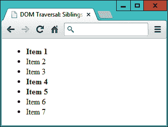

###### 图 22-20\. 选择兄弟元素

###### 注意

由于`siblings`方法省略了其调用元素（我将其称为*调用方*），它无法用于从父元素的*所有*子元素中进行选择。但是，要使用前面的示例来实现这一点，你可以使用如下语句，它将返回所有使用类`new`的兄弟元素（包括调用方）：

```php
$('#two').parent().children('.new')
.css('font-weight', 'bold')
```

你还可以通过在选择中添加`addBack`方法来实现相同的结果，就像这样：

```php
$('#two').siblings('.new').addBack()
.css('font-weight', 'bold')
```

## 选择下一个和上一个元素

当你需要更精细地控制兄弟元素的选择时，可以进一步使用`next`和`prev`方法及其扩展版本来缩小返回的元素。例如，要引用选择器后面紧接的元素，可以使用如下语句（将匹配的元素设置为加粗显示）：

```php
$('#new').next().css('font-weight', 'bold')
```

在以下自由地排列的片段中，例如，第三个项目具有 ID `new`，因此第四个项目被返回：

```php
<ul>
  <li         >Item 1</li>
  <li         >Item 2</li>
  <li id='new'>Item 3</li>
  <li         >Item 4</li>
  <li         >Item 5</li>
</ul>
```

到目前为止，一切都很简单。但是，如果您想引用特定元素之后的*所有*兄弟元素怎么办？好吧，您可以使用`nextAll`方法来做到这一点，像这样（在前面的代码片段中，这将样式化最后两个项目）：

```php
$('#new').nextAll().css('font-weight', 'bold')
```

在调用`nextAll`时，您还可以提供一个过滤器来从匹配的元素中选择，例如下面的示例，它将仅样式化使用`info`类的后续兄弟元素（然而，在前面的代码片段中，没有使用该类的元素，因此该语句不会执行任何操作）：

```php
$('#new').nextAll('.info').css('font-weight', 'bold')
```

或者考虑这种情况，其中一个项目具有 ID`new`，另一个项目具有 ID`old`：

```php
<ul>
  <li         >Item 1</li>
  <li id='new'>Item 2</li>
  <li         >Item 3</li>
  <li id='old'>Item 4</li>
  <li         >Item 5</li>
</ul>
```

现在可以选择仅跟随具有 ID 为`new`的元素的那些兄弟元素，直到（但不包括）具有 ID 为`old`的元素，像这样（其中只会样式化第三个项目）：

```php
$('#new').nextUntil('#old').css('font-weight', 'bold')
```

如果未向`nextUntil`提供参数，它的行为与`nextAll`完全相同，返回所有后续兄弟元素。您还可以向`nextUntil`提供第二个参数，以充当选择匹配元素的过滤器，例如：

```php
$('#new').nextUntil('#old', '.info').css('font-weight', 'bold')
```

在此语句中，仅会对使用`info`类的那些元素应用样式，但在前面的代码片段中，没有使用这些类的元素，因此不会采取任何操作。

您也可以通过使用`prev`、`prevAll`和`prevUntil`方法向后反向工作，遍历组的兄弟元素。

## 遍历 jQuery 选择

除了遍历 DOM，一旦您将一组元素作为 jQuery 选择返回，还可以遍历这些元素，并选择要对其进行操作的元素。

例如，要仅对选择返回的第一个元素应用样式，您可以使用`first`方法，像这样（将第一个无序列表中的第一个列表项设置为显示下划线）：

```php
$('ul>li').first().css('text-decoration', 'underline')
```

或者您可以选择仅使用`last`方法样式化最后一项，像这样：

```php
$('ul>li').last().css('font-style', 'italic')
```

或者，要按索引访问一个元素（从 0 开始），可以使用`eq`方法，像这样（它会样式化列表中的第二个项目，因为编号从 0 开始）：

```php
$('ul>li').eq(1).css('font-weight', 'bold')
```

您还可以使用`filter`方法对选择应用过滤器，像这样（更改从第一个元素开始的每个其他元素的背景颜色，元素 0）：

```php
$('ul>li').filter(':even').css('background', 'cyan')
```

###### 警告

请记住，当您对 jQuery 选择进行索引时，第一个元素是零。因此，例如，在此方式中使用选择器`:even`时，将选择元素 1、3、5 等（而不是 0、2、4、6 等）。

要排除一个或多个元素，可以应用`not`方法，像这样（其中不使用 ID`new`的元素以蓝色样式显示）：

```php
$('ul>li').not('#new').css('color', 'blue')
```

您还可以根据它具有哪些后代来选择元素。例如，要仅选择具有后代`<ol>`元素的元素，您可以使用此语句来为匹配的元素添加一条删除线：

```php
$('ul>li').has('ol').css('text-decoration', 'line-through')
```

示例 22-23 将所有这些内容合并起来，以样式化一个无序列表，其中一个元素还包含一个有序列表。

##### 示例 22-23\. 遍历 jQuery 选择

```php
<!DOCTYPE html>
<html>
  <head>
    <title>Selection Traversal</title>
    <script src='jquery-3.5.1.min.js'></script>
  </head>
  <body>
    <ul>
      <li>Item 1</li>
      <li>Item 2</li>
      <li id='new'>Item 3</li>
      <li>Item 4
        <ol type='a'>
          <li>Item 4a</li>
          <li>Item 4b</li>
        </ol></li>
      <li>Item 5</li>
    </ul>
    <script>
      $('ul>li').first()        .css('text-decoration', 'underline')
      $('ul>li').last()         .css('font-style',      'italic')
      $('ul>li').eq(1)          .css('font-weight',     'bold')
      $('ul>li').filter(':even').css('background',      'cyan')
      $('ul>li').not('#new')    .css('color',           'blue')
      $('ul>li').has('ol')      .css('text-decoration', 'line-through')
    </script>
  </body>
</html>
```

从学习图 22-21 可以看出，每个列表中的每个元素都被一个或多个 jQuery 语句所样式化。

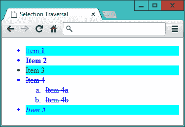

###### 图 22-21\. 在 jQuery 选择中唯一定位元素

## is 方法

还有一个 jQuery 选择器，返回用于在普通 JavaScript 中使用的布尔值：`is`方法。与前面部分展示的 jQuery 过滤方法不同，此函数不会创建一个新的 jQuery 对象，然后可以附加其他方法，或者可以进一步过滤。相反，它只返回`true`或`false`，使该方法最适合在条件语句中使用。

示例 22-24 使用`is`方法附加到对按钮集的事件处理程序中的`parent`调用。当单击任何按钮时，调用处理程序，`is`方法返回一个值，询问其父元素是否为`<div>`（图 22-22）。

##### 示例 22-24\. 使用`is`报告`parent`元素

```php
<!DOCTYPE html>
<html>
  <head>
    <title>Using is</title>
    <script src='jquery-3.5.1.min.js'></script>
  </head>
  <body>
    <div><button>Button in a div</button></div>
    <div><button>Button in a div</button></div>
    <span><button>Button in a span</button></span>
    <div><button>Button in a div</button></div>
    <span><button>Button in a span</button></span>
    <p id='info'></p>
    <script>
      $('button').click(function()
      {
        var elem = ''

        if ($(this).parent().is('div')) elem = 'div'
        else                            elem = 'span'

        $('#info').html('You clicked a ' + elem)
      })
    </script>
  </body>
</html>
```

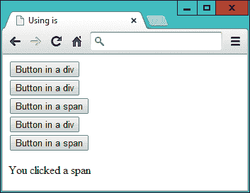

###### 图 22-22\. 使用`is`方法报告`parent`元素

# 不使用选择器的 jQuery

提供了一些用于与标准 JavaScript 对象一起使用的 jQuery 方法，使其处理变得更加简单。这些方法包括`$.each`和`$.map`，它们类似但有微妙的区别。

## $.each 方法

使用`$.each`，可以通过简单地附加一个用于每次迭代调用的函数来迭代数组或类数组对象。示例 22-25 展示了一个宠物名字和类型的数组（称为`pets`），从中需要提取另一个数组（称为`guineapigs`），其中只包含豚鼠的名字。

##### 示例 22-25\. 调用`$.each`方法

```php
<!DOCTYPE html>
<html>
  <head>
    <title>Using each</title>
    <script src='jquery-3.5.1.min.js'></script>
  </head>
  <body>
    <div id='info'></div>
    <script>
      pets =
      {
        Scratchy : 'Guinea Pig',
        Squeaky  : 'Guinea Pig',
        Fluffy   : 'Rabbit',
        Thumper  : 'Rabbit',
        Snoopy   : 'Dog',
        Tiddles  : 'Cat'
      }

      guineapigs = []

      $.each(pets, function(name, type)
      {
        if (type == 'Guinea Pig') guineapigs.push(name)
      })

      $('#info').html('The guinea pig names are: ' + guineapigs.join(' & '))
    </script>
  </body>
</html>
```

为此，`$.each`方法将数组传递给一个匿名函数来处理。该函数接受两个参数，数组的索引（称为`name`）和每个元素的内容（称为`type`）。

然后测试`type`的值是否为`Guinea Pig`，如果是，则将`name`的值推入`guineapigs`数组。完成后，代码将`guineapigs`数组的内容显示在 ID 为`info`的`<div>`元素中。为了分隔数组中的项目，使用 JavaScript 的`join`方法，以`&`符号作为分隔符。加载此示例到浏览器中的结果就是显示文本“The guinea pig names are: Scratchy & Squeaky.”。

## $.map 方法

另一种方法是使用`$.map`方法，它返回函数在数组中返回的所有值组成的数组。

这个函数可以帮助您省去创建数组的麻烦，正如我们在前面的示例中所做的那样。相反，您可以通过将 `$.map` 返回的数组分配给一个变量来同时创建和填充数组，就像这样（最终结果相同但代码更少）：

```php
guineapigs = $.map(pets, function(type, name)
{
  if (type == 'Guinea Pig') return name
})
```

###### 警告

当您在使用 `$.each` 和 `$.map` 方法之间切换时，请注意，因为 `$.each` 将参数按顺序传递给函数，顺序是 *index*、*value*，但是 `$.map` 使用的顺序是 *value*、*index*。这就是为什么在前面的 `$.map` 示例中这两个参数被交换的原因。

# 使用异步通信

在 第十八章 中，我详细介绍了如何在浏览器中的 JavaScript 和运行在 Web 服务器上的 PHP 之间实现异步通信。我还提供了一些方便和紧凑的函数，您可以调用它们来简化这个过程。

但如果加载了 jQuery，您可以选择使用其异步功能，它的工作方式非常相似，您可以选择是使用 POST 还是 GET 请求，然后继续进行操作。

## 使用 POST 方法

示例 22-26（将亚马逊移动网站加载到 `<div>` 元素中）是 示例 18-1 的直接 jQuery 等效物，但由于所有异步通信处理代码都被整理到了 jQuery 库文件中，所以代码更简洁。只需调用 `$.post` 方法一次，并传递以下三个项目： 

+   用于访问服务器上 PHP 程序的 URL

+   要传递到该 URL 的数据

+   用于处理返回数据的匿名函数

##### 示例 22-26\. 发送一个异步 POST 请求

```php
<!DOCTYPE html>
<html> <!-- jqueryasyncpost.htm -->
  <head>
    <title>jQuery Asynchronous Post</title>
    <script src='jquery-3.5.1.min.js'></script>
  </head>
  <body style='text-align:center'>
    <h1>Loading a web page into a DIV</h1>
    <div id='info'>This sentence will be replaced</div>

    <script>
      $.post('urlpost.php', { url : 'amazon.com/gp/aw' }, function(data)
      {
        $('#info').html(data)
      } )
    </script>
  </body>
</html>
```

*urlpost.php* 程序与 示例 18-2 没有改变，因为这个示例和 示例 18-1 可以互换使用。

## 使用 GET 方法

使用 GET 方法进行异步通信同样很简单，只需要以下两个参数：

+   用于访问服务器上 PHP 程序的 URL（包括包含要传递给它的数据的查询字符串）

+   用于处理返回数据的匿名函数

示例 22-27 因此是 示例 18-3 的 jQuery 等效物。

##### 示例 22-27\. 发送一个异步 GET 请求

```php
<!DOCTYPE html>
<html> <!-- jqueryasyncget.htm -->
  <head>
    <title>jQuery Asynchronous GET</title>
    <script src='jquery-3.5.1.min.js'></script>
  </head>
  <body style='text-align:center'>
    <h1>Loading a web page into a DIV</h1>
    <div id='info'>This sentence will be replaced</div>

    <script>
      $.get('urlget.php?url=amazon.com/gp/aw', function(data)
      {
        $('#info').html(data)
      } )
    </script>
  </body>
</html>
```

*urlget.php* 程序与 示例 18-4 没有改变，因为这个示例和 示例 18-3 可以互换使用。

###### 警告

请记住，异步通信的安全限制要求通信必须在提供主 Web 文档的同一服务器上进行。您还必须使用 Web 服务器进行异步通信，*而不是* 使用本地文件系统。因此，建议使用生产或开发服务器来测试这些示例，正如 第二章 中所描述的那样。

# 插件

本章只涵盖了核心 jQuery 库的内容，对于初学者来说已经足够完成很多任务，但总有一天您会发现需要更多功能和功能。幸运的是，现在已经有了许多官方和第三方 jQuery 项目可供选择，以提供几乎您能想象到的任何功能。

## jQuery 用户界面

首先，有一个 jQuery 用户界面插件，称为[jQuery UI](http://jqueryui.com)，它直接延续了 jQuery 的功能。使用它，您可以为网页添加拖放、调整大小和排序方法，以及更多动画效果、动态颜色过渡和更多缓动效果。它还提供了许多小部件，用于创建菜单和其他功能，如手风琴、按钮、选择器、进度条、滑块、微调器、选项卡、工具提示等等。

如果您想在决定下载之前看一些演示，请查看[jQuery UI 演示页面](http://jqueryui.com/demos)。

整个包压缩后不到 400 KB，并且几乎没有任何限制（仅限非常慷慨的 MIT 许可证）。

## 其他插件

[jQuery 插件注册表](http://plugins.jquery.com)汇集了来自众多开发者的各种免费即用的 jQuery 插件。这些包括用于表单处理和验证、幻灯片放映、响应式布局、图像处理、附加动画等等。

###### 注意

如果您正在使用 jQuery 并开发移动浏览器，您还需要查看 jQuery Mobile（见第二十三章），它提供了针对不同类型移动硬件和软件的先进的触摸优化导航方式，以提供最佳的用户体验。

在这一章中，您学习了有时占据整本书的内容。我希望您觉得一切都很清晰，因为 jQuery 非常容易学习和使用。如果您需要其他信息，请查看[jQuery 网站](http://jquery.com)。

# 问题

1.  用作创建 jQuery 对象的工厂方法的常用符号是什么，替代方法名称是什么？

1.  您如何链接到 Google CDN 上的 jQuery 最小化版本 3.5.1 发布版？

1.  jQuery 工厂方法接受哪些类型的参数？

1.  使用哪个 jQuery 方法可以获取或设置 CSS 属性值？

1.  您会使用哪个语句将方法附加到具有 ID 为`elem`的元素的点击事件上，以使其慢慢隐藏？

1.  在动画中，必须修改哪个元素属性才能使其可以被动画化，并且可以接受哪些值？

1.  如何使多个方法同时运行（或在动画中按顺序运行）？

1.  如何从 jQuery 选择对象中检索元素节点对象？

1.  哪个语句会将具有 ID 为`news`的元素节点之前的兄弟元素设置为粗体显示？

1.  你可以使用哪种方法进行 jQuery 异步 GET 请求？

查看“第二十二章答案”，获取这些问题的答案。
