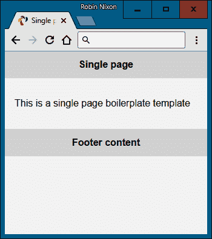
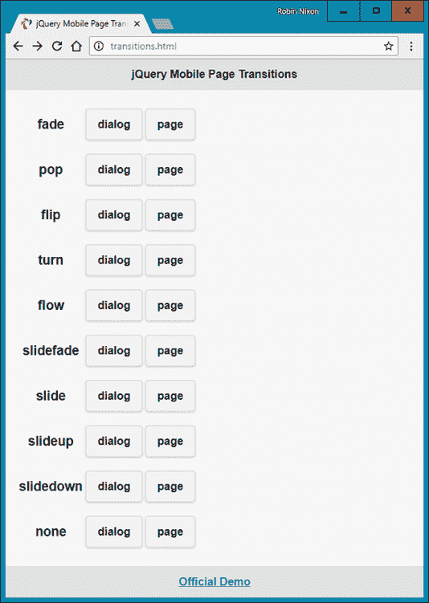
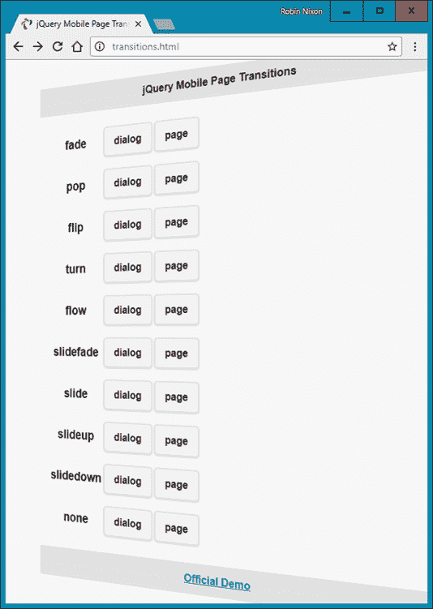
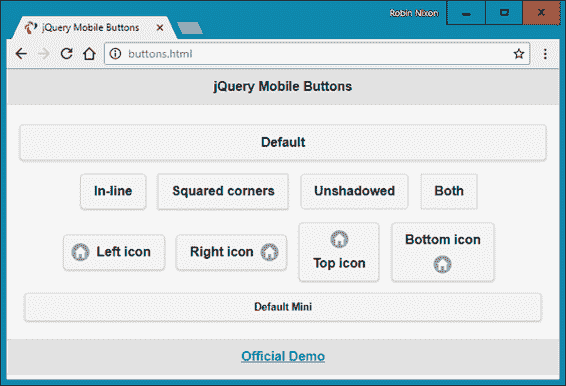
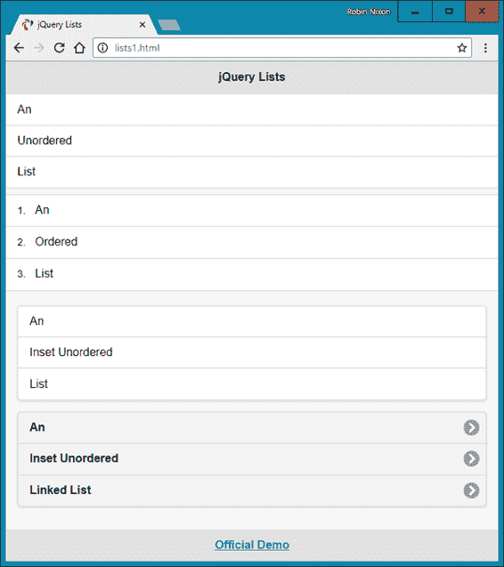
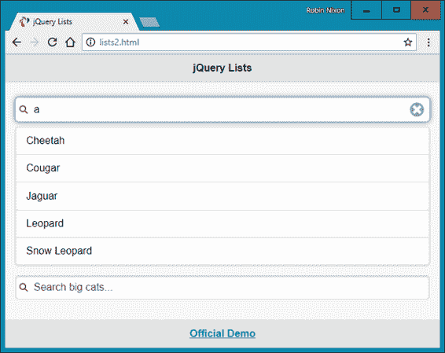
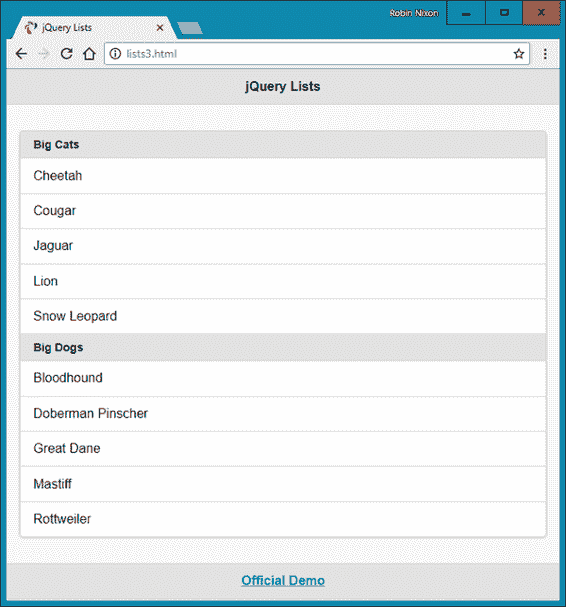
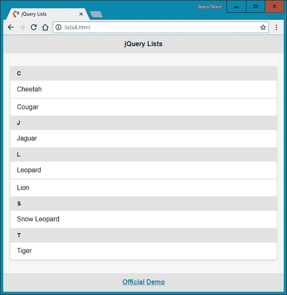

# 第二十三章：介绍 jQuery Mobile

现在你已经意识到了可以从 jQuery 中节省的时间和可以利用的巨大力量，正如在第二十二章中讨论的那样，我认为你会很高兴地发现你可以使用 jQuery Mobile 库做更多的事情。

为了配合 jQuery，jQuery Mobile 要求在网页中同时包含 jQuery 和 jQuery Mobile（还需要一个 CSS 文件和相关图像），以便在手机和其他移动设备上查看时转变为完全互动的体验。

jQuery Mobile 库使你能够通过所谓的*渐进增强*技术（首先使基本浏览器功能显示良好，然后在浏览器能力增强时逐步添加更多功能）将普通网页适配为移动网页。它还具备所谓的*响应式 Web 设计*（使网页在各种设备和窗口或屏幕尺寸上显示良好）的特性。

本章的重点并不是要教会你关于 jQuery Mobile 的所有知识——那本身就可以写成一本完整的书！相反，我想给你足够的信息，让你能够重新设计任何不太大的网页集合，使其成为一个连贯、快速且美观的 Web 应用程序，具备现代触摸设备所期望的所有页面滑动和其他过渡效果，以及更大更易用的图标、输入字段和其他增强的输入和导航功能。

为此，我介绍了 jQuery Mobile 的一些主要功能，这些功能可以让你快速上手，获得一个在桌面和移动平台上都运行良好的清晰且可操作的解决方案。在此过程中，我指出了一些你在将网页适配到移动端时可能会遇到的陷阱以及如何避免它们。一旦掌握了使用 jQuery Mobile，你将很容易通过在线文档找到适合你自己项目需求的功能。

###### 注意

除了根据浏览器的能力逐步增强 HTML 显示外，jQuery Mobile 还会根据使用的标签和一组自定义数据属性逐步增强常规的 HTML 标记。某些元素可以自动增强，无需任何数据属性（例如，`select` 元素会自动升级为菜单），而其他元素则需要存在数据属性才能进行增强。支持的完整数据属性列表可以在[API 文档](http://api.jquerymobile.com/data-attribute)中查看。

# 包括 jQuery Mobile

有两种方法可以在你的网页中包含 jQuery Mobile。首先，你可以访问[下载页面](http://jquerymobile.com/download)，选择你需要的版本，将文件下载到你的 Web 服务器（包括与库配套的样式表和附带的图像），然后从那里提供它们。

例如，如果你已经下载了 jQuery Mobile 1.4.5（我撰写时的当前版本）及其 CSS 文件到服务器的文档根目录，你可以包含它们以及相应的 jQuery JavaScript 文件，我写作时*必须*是 2.2.4 版本。我应该指出，自 jQuery Mobile 最后更新以来已经有一段时间了，我想知道其他技术是否会很快超越它：

```php
<link href="http://myserver.com/jquery.mobile-1.4.5.min.css" rel="stylesheet">
<script src='http://myserver.com/jquery-2.2.4.min.js'></script>
<script src='http://myserver.com/jquery.mobile-1.4.5.min.js'></script>
```

或者，就像 jQuery 一样，你可以利用免费的内容交付网络（CDN），简单地链接到你需要的版本。有三个主要的 CDN 可供选择（Max CDN，Google CDN 和 Microsoft CDN），你可以按以下方式从中获取你需要的文件：

```php
<!-- Retrieving jQuery & Mobile via Max CDN -->
<link rel="stylesheet"
  href="http://code.jquery.com/mobile/1.4.5/jquery.mobile-1.4.5.min.css">
<script src="http://code.jquery.com/jquery-2.2.4.min.js"></script>
<script src="http://code.jquery.com/mobile/1.4.5/jquery.mobile-1.4.5.min.js">
</script>

```

```php
<!-- Retrieving jQuery & Mobile via Google CDN -->
<link rel="stylesheet" href=
 "http://ajax.googleapis.com/ajax/libs/jquerymobile/1.4.5/jquery.mobile.min.css">
<script src=
"http://ajax.googleapis.com/ajax/libs/jquery/2.2.4/jquery.min.js"></script>
<script src=
"http://ajax.googleapis.com/ajax/libs/jquerymobile/1.4.5/jquery.mobile.min.js">
</script>

```

```php
<!-- Retrieving jQuery & Mobile via Microsoft CDN -->
<link rel="stylesheet" href=
  "http://ajax.aspnetcdn.com/ajax/jquery.mobile/1.4.5/jquery.mobile-1.4.5.min.css">
<script src=
"http://ajax.aspnetcdn.com/ajax/jQuery/jquery-2.2.4.min.js"></script>
<script src=
"http://ajax.aspnetcdn.com/ajax/jquery.mobile/1.4.5/jquery.mobile-1.4.5.min.js">
</script>

```

你可能希望将这些语句中的一组放置在页面的`<head>`部分。

###### 注意

为了确保你可以在离线状态下使用这些示例，我已经下载了所有所需的 jQuery 文件，并将它们与示例文件的归档一起包含在内，你可以从[GitHub](https://github.com/RobinNixon/lpmj6)免费下载。因此，所有这些示例都显示本地提供的文件。

# 入门指南

让我们立即深入了解一个 jQuery Mobile 网页的一般外观，参见示例 23-1。这实际上非常简单，如果你快速浏览一下，它将有助于快速理解本章的其余内容。

##### 示例 23-1\. jQuery Mobile 单页面模板

```php
<!DOCTYPE html>
<html>
  <head>
    <meta charset="utf-8">
    <meta name="viewport" content="width=device-width, initial-scale=1">
    <title>Single page template</title>
    <link rel="stylesheet" href="jquery.mobile-1.4.5.min.css">
    <script src="jquery-2.2.4.min.js"></script>
    <script src="jquery.mobile-1.4.5.min.js"></script>
  </head>
  <body>
    <div data-role="page">
      <div data-role="header">
        <h1>Single page</h1>
      </div>
      <div data-role="content">
        <p>This is a single page boilerplate template</p>
      </div>
      <div data-role="footer">
        <h4>Footer content</h4>
      </div>
    </div>
  </body>
</html>

```

仔细检查前面的示例，你会发现它从你期望的标准 HTML5 元素开始。你可能会注意到的第一个不寻常的项目是在`<head>`部分，即在`<meta>`标签内的`viewport`设置。如今，大多数用户将在移动设备上浏览，因此这个标签应该出现在你的所有网页中。

这行代码告诉移动浏览器将显示文档的宽度设置为与 Web 浏览器相同，并且开始时不缩放文档。在高度大于宽度的浏览器中显示时，页面看起来像图 23-1 所示。



###### 图 23-1\. 显示 jQuery Mobile 单页面模板

在指定页面标题后，加载了 jQuery Mobile 的 CSS，然后是 jQuery 2.2.4 库和 jQuery Mobile 1.4.5 库。如“包含 jQuery Mobile”中所解释的，如果你愿意，这些文件都可以从 CDN 下载。

###### 注意

本章的示例包含一个名为*images*的文件夹，其中包含 CSS 所需的所有图标和其他图片。如果您使用 CDN 下载 CSS 和 JavaScript 库文件，可能不需要在您自己的项目中包含此文件夹，因为 CDN 的*images*文件夹应该被使用。

转到`<body>`部分，您会注意到主网页包含在一个`<div>`元素内，该元素具有 jQuery Mobile `data-role`属性值为`page`，并包括进一步的三个`<div>`元素，用于页面的头部、内容和页脚，每个元素都有相应的`data-role`属性。

现在您已经了解了 jQuery Mobile 网页的基本结构。当您在页面之间进行链接时，新页面将通过异步通信加载并添加到 DOM 中。一旦加载完成，页面就可以通过多种方式进行过渡显示，包括即时替换、淡入、溶解、滑动等。

###### 注意

由于网页的异步加载，您应始终在 Web 服务器上测试您的 jQuery Mobile 代码，而不是在本地文件系统上。这是因为 Web 服务器知道如何处理网页的异步加载，这对通信的正确工作是必要的。AMPPS 系统足以做到这一点，只要您使用`localhost://`或`http://127.0.0.1/`访问文件。

# 链接页面

使用 jQuery Mobile，您可以以正常方式链接到页面，并且它将自动处理这些页面请求的异步加载（在可能的情况下），以确保应用所选的任何过渡效果。

这使您可以专注于简单创建您的网页，并让 jQuery Mobile 处理使它们看起来好看并且显示迅速和专业。

为了启用动画页面过渡效果，所有指向外部页面的链接将被异步加载。jQuery Mobile 通过将所有`<a href...>`链接转换为异步通信（也称为 Ajax）请求，并在请求完成时显示加载旋转器来实现这一点。显然，这仅适用于内部页面链接。

###### 注意

当您点击链接时，jQuery Mobile 实现页面过渡的方式是通过“劫持”点击事件，并访问`event.preventDefault`事件，然后提供其特殊的 jQuery Mobile 代码。

如果请求成功，新页面内容将添加到 DOM 中，然后使用默认页面过渡或您选择的任何过渡效果将所选的新页面动画显示出来。

如果异步请求失败，会显示一个小巧而不显眼的错误消息让您知晓，但不会干扰导航流程。

## 同步链接

链接指向其他域或具有`rel="external"`、`data-ajax="false"`或`target`属性将同步加载，导致页面完全刷新而无动画过渡。

`rel="external"` 和 `data-ajax="false"` 具有相同的效果，但前者用于链接到另一个站点或域，而后者用于防止任何页面异步加载。

由于安全限制，jQuery Mobile 会同步加载所有外部域的页面。

###### 注意

在使用 HTML 文件上传时，您需要禁用异步页面加载，因为这种获取网页的方式与 jQuery Mobile 接收上传文件的能力冲突。对于这种情况，最好的方法可能是在 `<form>` 元素中添加 `data-ajax="false"` 属性，如下所示：

```php
<form `data-ajax=``'false'` method='post'
  action='*`dest_file`*' enctype='multipart/form-data'>

```

## 在多页文档中链接到内部位置

单个 HTML 文档可以包含一个或多个页面。后者涉及堆叠多个 `data-role` 为 `page` 的 `<div>` 元素，这允许您在一个*单一* HTML 文档中构建一个小站点或应用程序；jQuery Mobile 将简单地在加载页面时显示源顺序中找到的第一个页面。

如果多页文档中的链接指向锚点（例如 `#page2`），框架将查找带有 `data-role` 属性为 `page` 和给定 ID（`id="page2"`）的页面包装 `<div>`。如果找到，则将新页面过渡到视图中。

用户可以在 jQuery Mobile 中无缝导航到所有类型的网页（无论是内部、本地还是外部）。对于最终用户来说，所有页面看起来都一样，只是在加载外部页面时会显示 Ajax 加载指示器，而加载的外部页面将替换当前页面，而不是像内部页面那样插入 DOM 以保留所有 jQuery Mobile 功能。在所有情况下，jQuery Mobile 更新页面的 URL 哈希以启用后退按钮支持。这也意味着 jQuery Mobile 页面可以被搜索引擎索引，并且不会像原生应用程序一样封闭在某个地方。

###### 警告

当从异步加载的移动页面链接到包含多个内部页面的页面时，必须在链接中添加`rel="external"`或`data-ajax="false"`以强制进行完整页面重新加载，清除掉 URL 中的异步哈希。异步页面使用哈希（`#`）来跟踪其历史记录，而多个内部页面使用此符号来指示内部页面。

## 页面过渡

通过使用 CSS 过渡效果，jQuery Mobile 可以对任何页面链接或表单提交应用效果，只要使用异步导航（默认情况）。

要应用过渡效果，可以在 `<a>` 或 `<form>` 标签中使用 `data-transition` 属性，如下所示：

```php
<a `data-transition=``"slide"` href="destination.html">Click me</a>
```

此属性支持值 `fade`（自版本 1.1 起的默认值），`pop`，`flip`，`turn`，`flow`，`slidefade`，`slide`（版本 1.1 之前的默认值），`slideup`，`slidedown` 和 `none`。

例如，值 `slide` 使新页面从右侧滑入，同时当前页面从左侧滑出。其他值的效果类似明显。

### 将页面加载为对话框

你可以使用 `data-rel` 属性并将其值设为 `dialog`，将新页面显示为对话框窗口，就像这样：

```php
<a `data-rel=``"dialog"` href="dialog.html">Open dialog</a>
```

示例 23-2 演示了如何将各种页面过渡效果应用于页面加载和对话框加载，本地加载 jQuery 库而不是通过 CDN。它由一个简单的表格组成，有两列，第一列用于加载对话框，另一列用于加载新页面。列出了每种可用的过渡类型。为了将链接显示为按钮，我为每个链接的 `data-role` 属性提供了值 `button`（按钮的样式见“按钮样式”）。

##### 示例 23-2\. jQuery Mobile 页面过渡

```php
<!DOCTYPE html> 
<html>
  <head>
    <meta charset="utf-8">
    <meta name="viewport" content="width=device-width, initial-scale=1"> 
    <title>Page Transitions</title> 
    <link rel="stylesheet" href="jquery.mobile-1.4.5.min.css">
    <script src="jquery-2.2.4.min.js"></script>
    <script src="jquery.mobile-1.4.5.min.js"></script>
  </head> 
  <body> 
    <div data-role="page">
      <div data-role="header">
        <h1>jQuery Mobile Page Transitions</h1>
      </div>
      <div data-role="content"><table>
        <tr><th><h3>fade</h3></th>
          <td><a href="page-template.html" data-rel="dialog"
           data-transition="fade" data-role='button'>dialog</a></td>
          <td><a href="page-template.html" data-transition="fade"
           data-role='button'>page</a></td>
        </tr><tr><th><h3>pop</h3></th>
          <td><a href="page-template.html" data-rel="dialog"
           data-transition="pop" data-role='button'>dialog</a></td>
          <td><a href="page-template.html" data-transition="pop"
           data-role='button'>page</a></td>
        </tr><tr><th><h3>flip</h3></th>
          <td><a href="page-template.html" data-rel="dialog"
           data-transition="flip" data-role='button'>dialog</a></td>
          <td><a href="page-template.html" data-transition="flip"
           data-role='button'>page</a></td>
        </tr><tr><th><h3>turn</h3></th>
          <td><a href="page-template.html" data-rel="dialog"
           data-transition="turn" data-role='button'>dialog</a></td>
          <td><a href="page-template.html" data-transition="turn"
           data-role='button'>page</a></td>
        </tr><tr><th><h3>flow</h3></th>
          <td><a href="page-template.html" data-rel="dialog"
           data-transition="flow" data-role='button'>dialog</a></td>
          <td><a href="page-template.html" data-transition="flow"
           data-role='button'>page</a></td>
        </tr><tr><th><h3>slidefade</h3></th>
          <td><a href="page-template.html" data-rel="dialog"
           data-transition="slidefade" data-role='button'>dialog</a></td>
          <td><a href="page-template.html" data-transition="slidefade"
           data-role='button'>page</a></td>
        </tr><tr><th><h3>slide</h3></th>
          <td><a href="page-template.html" data-rel="dialog"
           data-transition="slide" data-role='button'>dialog</a></td>
          <td><a href="page-template.html" data-transition="slide"
           data-role='button'>page</a></td>
        </tr><tr><th><h3>slideup</h3></th>
          <td><a href="page-template.html" data-rel="dialog"
           data-transition="slideup" data-role='button'>dialog</a></td>
          <td><a href="page-template.html" data-transition="slideup"
           data-role='button'>page</a></td>
        </tr><tr><th><h3>slidedown</h3></th>
          <td><a href="page-template.html" data-rel="dialog"
           data-transition="slidedown" data-role='button'>dialog</a></td>
          <td><a href="page-template.html" data-transition="slidedown"
           data-role='button'>page</a></td>
        </tr><tr><th><h3>none</h3></th>
          <td><a href="page-template.html" data-rel="dialog"
           data-transition="none" data-role='button'>dialog</a></td>
          <td><a href="page-template.html" data-transition="none"
           data-role='button'>page</a></td></tr></table>
      </div>
      <div data-role="footer">
        <h4><a href="http://tinyurl.com/jqm-trans">Official Demo</a></h4>
      </div>
    </div>
  </body>
</html>
```

图 23-2 展示了加载此示例（保存为 *transitions.html* 文件名）到浏览器的结果，而 图 23-3 展示了翻转过渡的实际效果。顺便提一下，如果你点击示例页脚中的[链接](http://demos.jquerymobile.com/1.4.4/transitions)，将带你到官方演示站点，你可以更详细地了解这些效果。



###### 图 23-2\. 对页面和对话框应用过渡效果



###### 图 23-3\. 翻转过渡进行中

# 按钮样式

你可以轻松地将简单链接显示为按钮，而无需添加自定义 CSS。你所需做的就是向元素的 `data-role` 属性提供值 `button`，就像这样：

```php
<a `data-role=``"button"` href="news.html">Latest news</a>
```

你可以决定是否使按钮展开到窗口的整个宽度（默认），就像 `<div>` 元素一样，或者以行内显示，就像 `<span>` 元素一样。要行内显示按钮，请向 `data-inline` 属性提供值 `true`，就像这样：

```php
<a data-role="button" `data-inline=``"true"` href="news.html">Latest news</a>
```

无论你是从链接创建按钮还是从表单中使用按钮，你都可以通过选择圆角（默认）或直角，并使其具有阴影（默认）或无阴影的方式来修改其显示方式。通过分别向 `data-corners` 和 `data-shadow` 属性提供值 `false` 来关闭这些功能，就像这样：

```php
<a data-role="button" data-inline="true" `data-corners=``"false"`
   `data-shadow=``"false"` href="news.html">Latest news</a>
```

此外，你甚至可以选择使用 `data-icon` 属性为按钮添加图标，就像这样：

```php
<a data-role="button" data-inline="true" `data-icon=``"home"`
   href="home.html">Home page</a>
```

有超过 50 种现成的图标可供选择。它们全部使用一种称为可缩放矢量图形（SVG）的强大图形语言创建，并针对不支持 SVG 的设备回退到 PNG 格式，使得图标在视网膜显示屏上表现出色。查看[图标演示](https://tinyurl.com/jqmicons)以了解现有的图标。

默认情况下，图标显示在按钮文本的左侧，但你可以选择将它们放置在文本的右侧、上方、下方，或者通过向 `data-iconpos` 属性应用值 `right`、`top`、`bottom` 或 `notext` 来移除任何文本，就像这样：

```php
<a data-role="button" data-inline="true" data-icon="home"
   `data-iconpos=``"right"` href="home.html">Home page</a>
```

如果选择不显示任何按钮文字，则默认显示圆形按钮。

最后，在这个简短的按钮样式概述中，您可以通过向`data-mini`属性提供`true`值来选择显示较小的按钮（包括按钮文本），如下所示：

```php
<a data-role="button" data-inline="true" data-icon="home"
   `data-mini=``"true"` href="home.html">Home page</a>
```

示例 23-3 演示了使用这些按钮样式创建多种按钮的选择（为简洁起见没有`href`属性），如图 23-4 所示。

##### 示例 23-3\. 各种按钮元素

```php
<a data-role="button">Default</a>
<a data-role="button" data-inline="true">In-line</a>
<a data-role="button" data-inline="true"
                      data-corners="false">Squared corners</a>
<a data-role="button" data-inline="true"
                      data-shadow="false">Unshadowed</a>
<a data-role="button" data-inline="true" data-corners="false"
                      data-shadow="false">Both</a><br>
<a data-role="button" data-inline="true"
                      data-icon="home">Left icon</a>
<a data-role="button" data-inline="true" data-icon="home"
                      data-iconpos="right">Right icon</a>
<a data-role="button" data-inline="true" data-icon="home"
                      data-iconpos="top">Top icon</a>
<a data-role="button" data-inline="true" data-icon="home"
                      data-iconpos="bottom">Bottom icon</a><br>
<a data-role="button" data-mini="true">Default Mini</a>

```



###### 图 23-4\. 各种按钮样式的组合

实际上，您可以使用按钮进行更多的样式设置，您可以在[按钮演示](https://tinyurl.com/jqmbuttons)中找到所需的所有详细信息。但现在，这个介绍将对您有所帮助。

# 列表处理

在处理列表时，jQuery Mobile 确实为您提供了一系列易于使用的功能，所有这些功能都可以通过将`data-role`属性设置为`listview`来访问`<ul>`或`<ol>`元素。

因此，例如，要创建简单的无序列表，您可以使用以下代码：

```php
<ul `data-role=``"listview"`>
  <li>Broccoli</li>
  <li>Carrots</li>
  <li>Lettuce</li>
</ul>

```

对于有序列表，只需将`<ul>`的开放和闭合标签替换为`<ol>`，列表将被编号。

列表中的任何链接将自动嵌入箭头图标并显示为按钮。您还可以通过给`data-inset`属性赋值`true`来将列表插入到页面上的其他内容中进行混合。

示例 23-4 演示了这些不同特性在实践中的应用；结果显示在图 23-5 中。

##### 示例 23-4\. 各种列表选择

```php
<ul data-role="listview">
  <li>An</li>
  <li>Unordered</li>
  <li>List</li>
</ul><br><br>

<ol data-role="listview">
  <li>An</li>
  <li>Ordered</li>
  <li>List</li>
</ol><br>

<ul data-role="listview" data-inset="true">
  <li>An</li>
  <li>Inset Unordered</li>
  <li>List</li>
</ul>

<ul data-role="listview" data-inset="true">
  <li><a href='#'>An</a></li>
  <li><a href='#'>Inset Unordered</a></li>
  <li><a href='#'>Linked List</a></li>
</ul>

```



###### 图 23-5\. 有序和无序的普通和插入列表

## 可过滤列表

您可以通过将`data-filter`属性设置为`true`使列表可过滤，这将在列表上方放置一个搜索框，并且当用户输入时，将自动隐藏任何不匹配搜索词的列表元素。您还可以将`data-filter-reveal`设置为`true`，以便在至少输入一个字符的过滤输入之前不显示任何字段，然后仅显示与输入匹配的字段。

示例 23-5 演示了这两种类型的过滤列表的使用，仅通过向后者添加`data-filter-reveal="true"`来区分。

##### 示例 23-5\. 过滤和过滤显示列表

```php
<ul data-role="listview" data-filter="true"
    data-filter-placeholder="Search big cats..." data-inset="true">
  <li>Cheetah</li>
  <li>Cougar</li>
  <li>Jaguar</li>
  <li>Leopard</li>
  <li>Lion</li>
  <li>Snow Leopard</li>
  <li>Tiger</li>
</ul>

<ul data-role="listview" data-filter="true" `data-filter-reveal=``"true"`
    data-filter-placeholder="Search big cats..." data-inset="true">
  <li>Cheetah</li>
  <li>Cougar</li>
  <li>Jaguar</li>
  <li>Leopard</li>
  <li>Lion</li>
  <li>Snow Leopard</li>
  <li>Tiger</li>
</ul>

```

注意使用`data-filter-placeholder`属性在输入字段为空时为用户提供提示。

在图 23-6 中，您可以看到前一种列表类型已经输入了字母`a`，因此当前只显示具有`a`的字段，而第二个列表中没有显示任何字段，因为过滤字段尚未输入任何内容。



###### 图 23-6\. 显示过滤和过滤显示列表

## 列表分隔符

为了增强列表的显示方式，您还可以在其中放置手动或自动分隔符。通过为具有`data-role`属性值为`list-divider`的列表元素提供支持，您可以创建手动列表分隔符，如例 23-6 所示，显示为图 23-7。

##### 例 23-6\. 手动列表分隔符

```php
<ul data-role="listview" data-inset="true">
  `<li` `data-role=``"list-divider"``>``Big Cats``</li>`
  <li>Cheetah</li>
  <li>Cougar</li>
  <li>Jaguar</li>
  <li>Lion</li>
  <li>Snow Leopard</li>
  `<li` `data-role=``"list-divider"``>``Big Dogs``</li>`
  <li>Bloodhound</li>
  <li>Doberman Pinscher</li>
  <li>Great Dane</li>
  <li>Mastiff</li>
  <li>Rottweiler</li>
</ul>
```



###### 图 23-7\. 列表按类别划分

为了让 jQuery Mobile 以方便的方式确定分隔，您可以为`data-autodividers`属性提供值`true`，如例 23-7 所示，它按字母顺序划分字段并显示为图 23-8。

##### 例 23-7\. 使用自动分隔符

```php
<ul data-role="listview" data-inset="true" data-autodividers="true">
   <li>Cheetah</li>
   <li>Cougar</li>
   <li>Jaguar</li>
   <li>Leopard</li>
   <li>Lion</li>
   <li>Snow Leopard</li>
   <li>Tiger</li>
</ul>
```



###### 图 23-8\. 自动按字母顺序划分列表

与按钮一样（请参见“样式化按钮”），您还可以使用`data-icon`属性为链接列表字段添加图标，并提供一个表示要显示的图标的值，就像这样：

```php
<li `data-icon=``"gear"`><a href="settings.html">Settings</a></li>
```

在这个示例中，链接列表的默认右尖括号将被您选择的图标替换（在本例中是齿轮图标）。

除了所有这些出色的功能外，您还可以在列表字段中添加图标和缩略图，并且它们将被缩放以在显示时呈现良好。有关如何执行此操作以及关于许多其他列表功能的详细信息，请参阅[官方文档](https://tinyurl.com/jqmlists)。

# 下一步是什么？

正如我在开头提到的，本章的目的是快速使您熟悉 jQuery Mobile，以便您可以轻松地将网站重新打包成在所有设备上（无论是桌面还是移动设备）看起来都很好的 Web 应用程序。

为此，我仅介绍了 jQuery Mobile 非常好的和最重要的功能，所以我只是初步介绍了您可以利用它做的事情的皮毛。例如，您可以以多种方式增强和使表单在移动设备上运行良好。您可以构建响应式表格，创建可折叠内容，调用弹出窗口，设计自己的主题等等。

###### 注意

您可能会对知道您可以与 Apache 的产品[Cordova](https://cordova.apache.org)结合使用 jQuery Mobile 来构建适用于 Android 和 iOS 的独立应用程序感兴趣。这并不是完全简单明了的事情，这超出了本书的范围，但大部分艰苦工作已经为您完成。

一旦您掌握了本章的所有内容，如果您想了解 jQuery Mobile 还能为您提供什么帮助，我建议您查看官方演示和[网站文档](http://demos.jquerymobile.com)。

此外，第二十九章的示例社交网络应用程序在接近真实世界的情景中应用了许多这些功能，这是了解如何使您的网页移动化的绝佳方法。在此之前，我们将看看最受欢迎且快速增长的 JavaScript 框架之一，React。

# 问题

1.  使用 CDN 将 jQuery Mobile 传送到 Web 浏览器有哪些主要好处和一个缺点？

1.  你会使用什么 HTML 来定义 jQuery Mobile 的内容页面？

1.  组成 jQuery 页面的三个主要部分是什么，并且它们如何表示？

1.  如何在 HTML 文档中放置多个 jQuery Mobile 页面？

1.  如何阻止网页异步加载？

1.  如何将锚点的页面转换设置为翻转，而不是使用默认的淡入效果？

1.  如何加载页面，使其显示为对话框而不是网页？

1.  如何轻松地使锚点链接显示为按钮？

1.  如何使 jQuery Mobile 元素像 `<span>` 元素一样内联显示，而不是像 `<div>` 元素一样全宽？

1.  如何为按钮添加图标？

参见“第二十三章答案”，在附录 A 中找到这些问题的答案。
