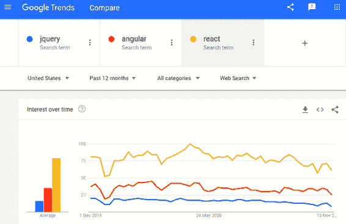

# 第二十四章：React 简介

当使用 JavaScript、HTML 和 CSS 构建动态网站时，随着时间推移，处理网站和应用程序前端所需代码的创建可能会变得冗长且啰嗦，从而降低项目开发速度，并可能引入难以找到的错误。

这就是框架的用武之地。当然，自 2006 年以来，我们有 jQuery 来帮助我们，因此它被安装在绝大多数的生产网站上，尽管如今 JavaScript 在范围和灵活性上已经足够成熟，程序员不再需要过度依赖像 jQuery 这样的框架。随着技术的不断进步，现在还有许多其他出色的选择，比如 Angular 和我在这里讨论的我的首选，React。

jQuery 的设计目的是简化 HTML DOM 树的遍历和操作，以及事件处理、CSS 动画和 Ajax，但是一些程序员，比如谷歌的开发团队，认为它仍然不够强大，因此他们在 2010 年推出了 Angular JS，这在 2016 年演变为 Angular。

Angular 将组件层次结构作为其主要的架构特征，而不是像 Angular 那样使用“scope”或控制器。谷歌庞大的 AdWords 平台以及 Forbes、Autodesk、Indiegogo、UPS 等公司都在使用 Angular，它确实非常强大。

另一方面，Facebook 则有不同的愿景，推出了 React（也称为 React JS）作为其开发单页或移动应用程序的框架，并围绕 JSX 扩展（代表 JavaScript XML）构建。React 库（首次开发于 2012 年）将网页划分为单一组件，简化了开发所需的接口，以服务于 Facebook 所有的广告及更多内容，现在它被网上的各种平台广泛采用，如 Dropbox、Cloudflare、Airbnb、Netflix、BBC、PayPal 等众多知名企业。

显然，Angular 和 React 在它们的创作和设计过程中都受到了坚实的商业决策的驱动，并且它们都是为了处理极高流量的网页而构建的，而 jQuery 在开发者寻求的功能方面显得力不从心。

因此，如今，除了要了解 JavaScript、HTML、CSS 等核心技术，还应该掌握一些 jQuery 以及至少了解 Angular 和 React 其中之一（如果不是两者都要），以及可能其他一些也有自己追随者的框架，这对程序员来说可能会很有用。

然而，基于易用性、学习曲线不陡、普遍实施以及因 Google 趋势显示它是三者中最受欢迎的框架（见图 24-1），我决定向你介绍 React 更为重要。顺便说一句，请不要将同名的 ReactPHP 与 JavaScript 的 React 混淆，它们是完全独立且不相关的项目。

# React 究竟有什么意义？

React 允许开发者创建能够轻松处理和改变数据而无需重新加载网页的大型 Web 应用程序。它的主要存在理由是速度、可扩展性以及简化处理单页 Web 和移动应用程序的视图层。它还能创建可重用的 UI 组件，并管理虚拟 DOM 以提升性能。有人曾说过，你可以将其用作将应用程序分成三个组件（模型、视图、控制器）中的 V（视图）。

开发者无需费力找出各种描述接口交易的方式，只需描述最终状态下的接口，使得当交易发生在该状态时，React 会自动更新 UI。其结果是更快、更少 bug 的开发；速度、可靠性和可扩展性。因为 React 是一个库而不是框架，学习它也很快，只需掌握几个函数。之后，一切都取决于你的 JavaScript 技能。

那么，让我们开始学习如何访问 React 文件。



###### 图 24-1\. 根据 Google 趋势，最近 jQuery、Angular 和 React 的受欢迎程度

###### 注意

我觉得 jQuery 很棒，但我也发现 React 非常易于使用，我认为时间会证明我对 React 最终能否取代 jQuery 成为主导框架（尤其是处理 UI 方面）的猜测是否正确。即使不是这样，学习 React 仍将使你掌握一种非常强大的新工具，许多顶级公司都会在你的简历上看重它。同时也不要忽视 Angular。如果这本书的篇幅足够，我也会介绍 Angular，因为了解它对于调试和维护现有代码非常重要，即使你不使用它开发。你可以在 [`angular.io`](https://angular.io) 找到关于 Angular 的所有信息（这也会让你的简历更上一层楼）。

# 访问 React 文件

像 jQuery 和 Angular 一样，React 是开源的，完全免费使用。也像其他框架一样，在网上有许多服务可以免费为你提供最新（或任何版本）的文件，因此使用它可以像在你的网页中添加几行额外的代码一样简单。

在探讨 React 的功能和如何使用它之前，先了解如何将其包含在网页中，从 *unpkg.com* 拉取文件：

```php
<script
  src="https://unpkg.com/react@17/umd/react.development.js">
</script>
<script
  src="https://unpkg.com/react-dom@17/umd/react-dom.development.js">
</script>
```

这些行理想情况下应放在页面的 `<head>...</head>` 部分，以确保它们在 body 部分加载之前加载。它们加载了 React 和 React DOM 的开发版本，帮助你进行开发和调试。在生产网站上，你应该将这些 URL 中的单词 `development` 替换为 `production`，为了加快传输速度，你甚至可以将 `development` 改为 `production.min`，这样会调用压缩版本的文件，像这样：

```php
<script
  src="https://unpkg.com/react@17/umd/react.production.min.js">
</script>
<script
  src="https://unpkg.com/react-dom@17/umd/react-dom.production.min.js">
</script>
```

为了方便访问并尽可能简化代码，我已经从本书示例的伴随存档中下载了最新的（我写作时是版本 17）未压缩开发文件的版本（在[GitHub](https://github.com/RobinNixon/lpmj6)上），因此所有示例都可以本地加载，看起来像这样：

```php
<script src="react.development.js"></script>
<script src="react-dom.development.js"></script>
```

现在你可以使用 React 编写代码了，接下来呢？虽然这不是必需的，我们接下来引入 Babel JSX 扩展，这样你就可以直接在 JavaScript 中包含 XML 文本，使你的生活变得更加轻松。

## 包含 babel.js

Babel JSX 扩展允许你直接在 JavaScript 中使用类似 HTML 的 XML，而不需要每次都调用一个函数。此外，在早期版本的 ECMAScript（JavaScript 的官方标准）低于 6 的浏览器上，Babel 将其升级以处理 ES6 语法，因此一举提供了两大好处。

你可以再次从 *unpkg.com* 服务器上获取所需的文件，就像这样：

```php
<script src="https://unpkg.com/babel-standalone@6/babel.min.js"></script>
```

你只需要在开发或生产服务器上获取一个精简版本的 Babel 代码。为了方便起见，我还从示例文件的伴随存档中下载了最新版本，因此本书中的示例可以本地加载，看起来像这样：

```php
<script src="babel.min.js"></script>
```

现在我们可以访问 React 文件了，让我们开始做些实际的事情。

###### 注意

本章旨在教你使用 React 的基础知识，让你清楚地理解它的工作原理和意义，并为你提供一个良好的起点，以便进一步发展你的 React 开发。事实上，本章中的一些示例基于（或类似于）你可以在 [reactjs.org](http://reactjs.org) 官方文档中找到的示例，因此，如果你希望更深入地学习 React，可以访问该网站，将会有一个良好的起步。

# 我们的第一个 React 项目

不要在实际编码之前教你所有有关 React 和 JSX 的知识，让我们换个角度，通过直接跳入我们的第一个 React 项目来展示一切有多简单，如示例 24-1 所示，其结果仅在浏览器中显示文本“By Jeeves, it works!”。

##### 示例 24-1\. 我们的第一个 React 项目

```php
<!DOCTYPE html>
<html lang="en">
  <head>
    <meta charset="utf-8">
    <title>First React Project</title>

    <script src='react.development.js'    ></script>
    <script src='react-dom.development.js'></script>
    <script src="babel.min.js">            </script>

    <script type="text/babel">
      `class` `One` `extends` `React``.``Component`
      `{`
        `render``(``)`
        `{`
          `return` `<``p``>``By` `Jeeves``,` `it` `works``!``<``/``p``>`
        `}`
      `}`

      `ReactDOM``.``render``(``<``One` `/``>``,` `document``.``getElementById``(``'div1'``)``)`
    </script>
  </head>
  <body>
    <div id="div1" style='font-family:monospace'></div>
  </body>
</html>

```

这是一个标准的 HTML5 文档，在打开内联脚本之前加载了两个 React 脚本和 Babel 脚本。这里是我们首次需要注意的地方，因为 `script` 标签不是不指定类型，也不是使用 `type=application/javascript`，而是给定了 `type=text/babel`。这告诉浏览器允许 Babel 预处理器运行脚本，必要时添加 ES6 功能，并将遇到的任何 XML 替换为 JavaScript 函数调用，然后再将脚本内容作为 JavaScript 运行。

在脚本中，创建了一个名为`One`的新类，扩展了`React.component`类。在这个类内部，创建了一个`render`方法，它返回以下 XML（不是字符串）：

```php
<p>By Jeeves, it works!</p>
```

最后，在脚本中调用了 `One` 类的 `render` 函数，向它传递了文档主体中唯一 `<div>` 元素的 ID，该元素的 ID 被命名为 `div1`。结果是将 XML 渲染到 div 中，这会导致浏览器自动更新并显示内容，效果如下所示：

```php
By Jeeves, it works!
```

立即你应该看到在 JavaScript 中包含 XML 如何使得编写代码更加简单和快速，并且使其更容易理解。如果没有 JSX 扩展，你将不得不使用一系列 JavaScript 函数调用来完成所有这些工作。

###### 注意

React 将以小写字母开头的组件视为 DOM 标签。因此，例如，`<div />` 表示 HTML 的 `<div>` 标签，但 `<One />` 表示一个组件，并且需要 `One` 在作用域内 —— 你不能像之前的例子中使用小写字母 `one` 并期望你的代码能工作，因为组件的名称必须以大写字母开头，任何对它的引用也是如此。

## 使用函数而不是类

如果你愿意，并且作为越来越普遍的做法，你可以使用一个函数来编写你的代码，而不是将它放在带有 `render` 函数的类中，就像在 Example 24-2 中一样。你可能更喜欢这样做的主要原因是简单性、易用性和更快的开发速度。

##### Example 24-2\. 使用函数而不是类

```php
<!DOCTYPE html>
<html lang="en">
  <head>
    <meta charset="utf-8">
    <title>First React Project</title>

    <script src='react.development.js'    ></script>
    <script src='react-dom.development.js'></script>
    <script src="babel.min.js">            </script>

    <script type="text/babel">
      `function` `Two``(``)`
      `{`
        `return` `<``p``>``And` `this``,` `by` `Jove``!``<``/``p``>`
      `}`

      ReactDOM.render(`<``Two` `/``>`, document.getElementById(`'div2'`))
    </script>
  </head>
  <body>
    <div id="div2" style='font-family:monospace'></div>
  </body>
</html>

```

在浏览器中显示的结果是：

```php
And this, by Jove!
```

###### 注意

从这一点开始的示例中，为了简洁起见，我将只显示 Babel 脚本的内容和文档主体，好像它们都在主体中（这样也同样有效），但附带存档中的示例 *将* 是完整的。因此，从现在开始它们看起来是这样的：

```php
<script type="text/babel">
  function Two()
  {
    return <p>And this, by Jove!</p>
  }

  ReactDOM.render(<Two />,
  document.getElementById('div2'))
</script>

<div id="div2"></div>

```

## 纯函数与不纯函数的黄金法则

当你写一个普通的 JavaScript 函数时，可以写出 React 称为 *pure* 或 *impure* 的代码。纯函数代码不会改变其输入，就像下面的这个例子，它返回从其参数计算得到的值：

```php
function mult(m1, m2)
{
  return m1 * m2
}

```

然而，这个函数被认为是不纯的，因为它修改了一个参数，在使用 React 时绝对不允许：

```php
function assign(obj, val)
{
  obj.value = val
}

```

以黄金规则的形式表达，这意味着所有 React 组件必须在其 props 方面像纯函数一样操作，正如在“属性和组件”中解释的那样。

## 同时使用类和函数

当然，你可以几乎可以互换地使用函数和类（尽管它们之间有一些区别，稍后在“使用类和函数的区别”中会进行解释），就像在示例 24-3 中一样。

##### 示例 24-3\. 同时使用类和函数

```php
<script type="text/babel">
  class One extends React.Component
  {
    render()
    {
      return <p>By Jeeves, it works!</p>
    }
  }

  function Two()
  {
    return <p>And this, by Jove!</p>
  }

  `doRender``(``<``One` `/``>``,` `'div1'``)`
  `doRender``(``<``Two` `/``>``,` `'div2'``)`

  `function` `doRender``(``elem``,` `dest``)`
  {
    ReactDOM.render(`elem`, document.getElementById(`dest`)) `}`
</script>

<div id="div1" style="font-family:monospace"></div>
<div id="div2" style="font-family:monospace"></div>

```

这里有一个名为`One`的类和一个名为`Two`的函数，它们与前两个示例中的相同。不过，这里还有一个额外的区别——创建了一个称为`doRender`的新函数——它大大简化了呈现 XML 块所需的语法。运行结果在浏览器中显示为：

```php
By Jeeves, it works!
```

```php
And this, by Jove!
```

###### 注意

除了以下示例中的周围 HTML 代码，我也将不再重复出现`doRender`函数的代码。因此，当你在这些示例中看到对`doRender`函数的调用时，请记住它不是 React 的内置函数，而是包含在配套档案中的函数。

## 属性和组件

介绍 React 称为*props*和*components*的一种绝佳方式，是构建一个简单的欢迎页面，其中将一个名称传递给脚本，然后显示出来。示例 24-4 是实现这一目标的一种方式。组件允许您将 UI 拆分为单独的、可重用的部分，并在隔离的环境中处理每个部分。它们类似于 JavaScript 函数，接受称为*props*的任意输入，返回描述元素在浏览器中如何显示的 React 元素。

##### 示例 24-4\. 将`props`传递给函数

```php
<script type="text/babel">
  function Welcome(props)
  {
    return <h1>Hello, {props.name}</h1>
  }

  doRender(<Welcome name='Robin' />, 'hello')
</script>

<div id="hello" style='font-family:monospace'></div>
```

在这个例子中，`Welcome`函数接收一个`props`参数，代表属性，在其 JSX 的`return`语句中有一个花括号内的部分，从`props`对象中获取了`name`属性，像这样：

```php
return <h1>Hello, {props.name}</h1>
```

`props`是 React 中的一个对象，接下来你将看到一种将其填充为属性的方法。

###### 注意

使用花括号是在 JSX 中嵌入表达式的方法。实际上，你几乎可以将任何 JavaScript 表达式放在这些花括号中进行评估（除了`for`和`if`语句，这些不能被评估）。

因此，在这个例子中，你可以输入`76 / 13`或`"decode".substr(-4)`来代替`props.name`（这将评估为字符串`"code"`）。但是，在这种情况下，属性`name`是从`props`对象中获取并返回的。

最后，`doRender`函数（你会记得它是一个调用`ReactDOM.render`函数的简写）被传入了`Welcome`函数的名称，接着将字符串值`'Robin'`分配给它的`name`属性，就像这样：

```php
doRender(<Welcome name='Robin' />, 'hello')
```

然后 React 调用`Welcome`函数（也称为*组件*），将`{name: 'Robin'}`传递给它的`props`。然后`Welcome`评估并返回`<h1>Hello, Robin</h1>`作为其结果，然后渲染到名为`hello`的`div`中，并在浏览器中呈现如下：

```php
  Hello, Robin
```

要使您的代码更整洁，如果愿意，您还可以首先创建一个包含 XML 的元素传递给`doRender`的方法，就像这样：

```php
const elem = <Welcome name='Robin' />
doRender(elem, 'hello')

```

## 使用类和函数的区别

在 React 中使用类和函数最明显的区别是语法。函数是简单的 JavaScript（可能包含 JSX），可以接受 props 参数并返回一个组件元素。

然而，类是从`React.Component`扩展的，需要一个`render`方法来返回一个组件。但是这些额外的代码确实带来了好处，因为类允许你在组件中使用`setState`，从而实现（例如）使用定时器和其他状态特性。在 React 中，函数被称为*功能状态无关组件*。此外，类允许您使用 React 称为*生命周期挂钩和方法*。在接下来的部分中详细讨论所有这些内容。

本质上，现在你可以使用函数在 React 中做几乎所有的事情。

# React 状态和生命周期

假设您希望在网页上显示一个滴答作响的时钟（出于简单起见，使用普通数字时钟）。如果您使用无状态的代码，这不是一件容易的事情，但如果您设置代码以保留其状态，那么时钟计数器可以每秒更新一次，并且时间也可以同样频繁地渲染。这就是您在 React 中使用类而不是函数的地方。因此，让我们构建这样一个时钟：

```php
<script type="text/babel">
  class Clock extends React.Component
  {
    constructor(props)
    {
      super(props)
      this.state = {date: new Date()}
    }

    render()
    {
      return <span> {this.state.date.toLocaleTimeString()} </span>
    }
  }

  doRender(<Clock />, 'the_time')
</script>

<p style='font-family:monospace'>The time is: <span id="the_time"></span></p>

```

此代码将从调用`Date`函数返回的结果分配给构造函数的`this`对象的`state`属性，即`props`。只要调用了类的`render`函数，JSX 内容就会被渲染，只会使用类的单个实例，只要它被渲染到相同的 DOM 节点。

###### 注意

您是否看到构造函数开头的`super`调用？通过将其传递给`props`，现在可以在构造函数内使用`this`关键字引用`props`，否则无法使用。

然而，就目前而言，时间将仅显示一次，然后代码将停止运行。因此，现在我们需要设置一些中断驱动的代码来保持`date`属性的更新，通过添加一个*生命周期*方法到类中，通过使用`componentDidMount`挂载一个定时器，就像这样：

```php
componentDidMount()
{
  this.timerID = setInterval(() => this.tick(), 1000)
}

```

我们还没有完成，因为我们仍然需要编写 `tick` 函数，但首先，解释前述内容：`*mounting*` 是 React 用来描述将节点添加到 DOM 的操作。如果组件成功挂载，类的 `componentDidMount` 方法将始终被调用，因此这是设置中断的理想位置，在前述代码中，`this.timerID` 被赋予调用 `SetInterval` 函数返回的 ID，传递给 `this.tick` 方法，以便每隔 1,000 毫秒（或每秒一次）调用它。

当安装定时器时，我们还必须提供一个方法来 *卸载* 它，以防止浪费中断周期。在这种情况下，当 `Clock` 生成的 DOM 被移除（即组件被卸载）时，我们用于停止中断的方法和代码如下所示：

```php
componentWillUnmount()
{
  clearInterval(this.timerID)
}

```

在这里，当 DOM 被移除时 React 会调用 `componentWillUnmount`；因此，我们在这里放置清除 `this.timerID` 中存储的间隔的代码，然后将所有这些时间片段返回给系统，因为清除间隔会立即停止 `tick` 的调用。

最后一个谜题的一部分是每隔 1,000 毫秒调用一次的中断驱动代码，它位于 `tick` 方法中：

```php
tick()
{
  this.setState({date: new Date()})
}
```

这里调用了 React 的 `setState` 函数，以更新 `state` 属性的值，该值是调用 `Date` 函数的最新结果，每秒钟调用一次。

让我们一起看一个示例中的所有代码，如 示例 24-5 所示。

##### 示例 24-5\. 在 React 中构建时钟

```php
<script type="text/babel">
  class Clock extends React.Component
  {
    constructor(props)
    {
      super(props)
      this.state = {date: new Date()}
    }

    componentDidMount()
    {
      this.timerID = setInterval(() => this.tick(), 1000)
    }

    componentWillUnmount()
    {
      clearInterval(this.timerID)
    }

    tick()
    {
      this.setState({date: new Date()})
    }

    render()
    {
      return <span> {this.state.date.toLocaleTimeString()} </span>
    }
  }

  doRender(<Clock />, 'the_time')
}
</script>

<p style='font-family:monospace'>The time is: <span id="the_time"></span></p>

```

现在 `Clock` 类已经完成，包括构造函数、中断启动和停止器、使用中断更新 `state` 属性的方法以及 `render` 函数，现在唯一需要做的就是调用 `doRender`，使整个时钟运行如图所示在浏览器中：

```php
The time is: 12:17:21
```

每次调用 `setState` 函数时，时钟都会自动更新到屏幕，因为组件通过这个函数重新渲染，所以您不必担心在代码中执行此操作。

###### 注意

在初始状态设置后，`setState` 是更新状态的唯一合法方式，因为简单地直接修改状态不会导致组件重新渲染。请记住，您唯一可以在构造函数中分配 `this.state` 的地方。React 可能会将多个 `setState` 调用捆绑成单个更新。

## 使用 Hooks（如果您使用 Node.js）

如果您使用 Node.js（参见 [nodejs.org](http://nodejs.org/)），您可以使用 hooks 而不必过多依赖类。Node.js 是一个在服务器上直接运行 JavaScript（和 React）的开源服务器环境，这是一个需要多个章节才能适当记录的技术，但如果您已经在使用它，我想告诉您，您也可以利用 React 的新 hooks。

Hooks 是 React 16.8 的一个新加入的功能，它支持在不使用类的情况下访问状态。它们易于使用，并且正在成为 React 的一个增长点。如果你想了解如何使用它们，你可以在线获取[更多信息](https://react.docs.org/hooks-intro.html)。

# React 中的事件

在 React 中，事件使用驼峰命名，并且你使用 JSX 来将函数作为事件处理程序传递，而不是字符串。此外，React 事件的工作方式与原生 JavaScript 事件并不完全相同，因为你的处理程序是通过称为`syntheticEvent`的浏览器本地事件的跨浏览器包装实例传递的。这样做的原因是 React 标准化事件以在不同浏览器中具有一致的属性。然而，如果你需要访问浏览器事件，你可以始终使用`nativeEvent`属性来获取它。

为了说明在 React 中使用事件的用法，示例 24-6 是一个简单的`onClick`事件的例子，当点击时移除或重新显示一些文本。

##### 示例 24-6\. 设置一个事件

```php
<script type="text/babel">
  class Toggle extends React.Component
  {
    constructor(props)
    {
      super(props)
      this.state       = {isVisible: true}
      this.handleClick = this.handleClick.bind(this)
    }

    handleClick()
    {
      this.setState(state => ({isVisible: !state.isVisible}))
    }

    render()
    {
      const show = this.state.isVisible

      return (
        <div>
          <button onClick={this.handleClick}>
            {show ? 'HIDE' : 'DISPLAY'}
          </button>
          <p>{show ? 'Here is some text' : ''}</p>
        </div>
      )
    }
  }

  doRender(<Toggle />, 'display')
</script>

<div id="display" style="font-family:monospace"></div>

```

在一个名为`Toggle`的新类的构造函数中，设置了一个名为`isVisible`的属性为`true`并分配给`this.state`，如下所示：

```php
this.state = {isVisible: true}
```

然后，一个名为`handleClick`的事件处理程序使用`bind`方法附加到`this`：

```php
this.handleClick = this.handleClick.bind(this)
```

构造函数完成后，接下来是`handleClick`事件处理程序。这有一个单行命令来在`isVisible`之间切换`true`和`false`的状态：

```php
this.setState(state => ({isVisible: !state.isVisible}))
```

最后，有一个调用`render`方法的地方，它返回两个元素包装在`<div>`中。这样做的原因是 render 方法只能返回单个组件（或 XML 标签），所以这两个元素被包装成一个单一元素以满足该要求。

返回的元素是一个按钮，如果以下文本当前隐藏（即`isVisible`设置为`false`），则显示文本 DISPLAY，否则如果`isVisible`设置为`true`且文本当前可见，则显示文本 HIDE。在此按钮之后，如果`isVisible`为`true`，则显示一些文本，否则不显示任何内容（实际上返回空字符串，这是相同的事情）。

为了决定显示什么按钮文本，或者是否显示文本，使用了三元运算符，你可以回忆起其语法如下：

```php
 expression ? return this if true : or this if false.

```

这是通过单词表达式`show`（其值从`this.state.isVisible`获取）完成的。如果评估为`true`，则按钮显示 HIDE 并显示文本，否则按钮显示 DISPLAY 并且文本不显示。加载到浏览器中时，结果如下（其中`[HIDE]`和`[DISPLAY]`是按钮）：

```php
[HIDE]
```

```php
Here is some text
```

当按钮被按下时，它只改变为以下内容：

```php
[DISPLAY]
```

# 在多行上使用 JSX

尽管你可以将你的 JSX 跨多行拆分以提高可读性，就像前面的例子一样，但你不能将跟随`return`命令的括号移到下一行（或任何其他地方）。它必须留在跟在`return`后面的位置，否则将报告语法错误。然而，关闭括号可以出现在你希望的位置。

# 内联 JSX 条件语句

在 JSX 中，如果条件为`true`，则只返回 XML，从而实现条件渲染。这是因为`true && expression`评估为`expression`，而`false && expression`评估为`false`。

因此，例如，Example 24-7 将两个变量设置为游戏的一部分。`this.highScore`设置为 90，`this.currentScore`设置为 100。

##### Example 24-7\. 一个条件性的 JSX 语句

```php
<script type="text/babel">
  class Setup extends React.Component
  {
    constructor(props)
    {
      super(props)
      this.highScore    = 90
      this.currentScore = 100
    }

    render()
    {
      return (
        <div>
          {
            `this``.``currentScore` `>` `this``.``highScore` `&&`
              <h1>New High Score</h1>
          }
        </div>
      )
    }
  }

  doRender(<Setup />, 'display')
</script>

<div id='display' style='font-family:monospace'></div>

```

在这种情况下，如果`this.currentScore`大于`this.highScore`，则返回`h1`元素；否则返回`false`。代码的结果在浏览器中看起来像这样：

```php
  New High Score
```

当然，在实际游戏中，你将继续将`this.highScore`设置为`this.currentScore`的值，并可能在返回游戏代码之前执行一些其他操作。

因此，无论何时只有在条件为`true`时才显示某些内容，`&&`运算符都是实现此目的的好方法。当然，你刚才在“React 事件”末尾看到了如何在 JSX 中使用三元(`?:`)表达式创建`if...then...else`块。

# 使用列表和键

使用 React 显示列表非常简单。在 Example 24-8 中，数组`cats`包含四种类型的猫的列表。然后，在下一行代码中使用`map`函数提取这些，该函数迭代数组，依次返回每个项目到变量`cat`中。这导致每次迭代都嵌入在一对`<li>...</li>`标签中，然后附加到`listofCats`字符串中。

##### Example 24-8\. 显示列表

```php
<script type="text/babel">
  const cats       = ['lion', 'tiger', 'cheetah', 'lynx']
  const listofCats = `cats``.``map`((cat) => <li>{cat}</li>)

  doRender(`<``ul``>``{``listofCats``}``<``/``ul``>`, 'display')
</script>

<div id='display' style='font-family:monospace'></div>

```

最后，调用`doRender`，将`listofCats`嵌入`<ul>...</ul>`标签对中，结果显示如下：

```php
• lion
• tiger
• cheetah
• lynx
```

## 唯一键

如果你在运行 Example 24-8 时打开了 JavaScript 控制台（通常通过按下 Ctrl Shift J 或在 Mac 上按 Option Command J），你可能会注意到警告消息“列表中的每个子元素都应有一个唯一的‘key’属性。”

尽管不是必需的，但当你为每个兄弟列表项提供唯一键时，React 的工作效果最佳，这有助于它找到对应 DOM 节点的引用，并在进行小改动时允许对 DOM 进行微调，而不需要重新渲染更大的部分。所以 Example 24-9 就是提供这样一个唯一键的示例。

##### Example 24-9\. 使用唯一键

```php
<script type="text/babel">
  `var` `uniqueId`     `=` `0`
  const cats       = ['lion', 'tiger', 'cheetah', 'lynx']
  const listofCats = cats.map((cat) => <li `key``=``{``uniqueId``++``}`>{cat}</li>)

  doRender(<ul>{listofCats}</ul>, 'display')
</script>

<div id='display' style='font-family:monospace'></div>

```

在这个示例中，创建了一个`uniqueId`变量，每次使用时都会递增，因此，例如，第一个键将变为`1`。显示的输出与前一个示例相同，但是如果您想查看生成的键（仅出于兴趣），可以将`li`元素的内容从`{cat}`更改为`{uniqueId - 1 + ' ' + cat}`，然后您将看到以下内容显示（使用`- 1`是因为在引用它时`uniqueId`已经递增了，所以我们需要看到递增之前的值）：

```php
• 0 lion
• 1 tiger
• 2 cheetah
• 3 lynx
```

但是，您可能会问，这有什么意义呢？好吧，考虑以下列表结构的情况：

```php
<ul> // Cities In Europe
  <li>Birmingham</li>
  <li>Paris</li>
  <li>Milan</li>
  <li>Vienna</li>
</ul>
<ul> // Cities in the USA
  <li>Cincinnati</li>
  <li>Paris</li>
  <li>Chicago</li>
  <li>Birmingham</li>
</ul>

```

这里有两组列表，每组都有四个唯一的兄弟姐妹，但在列表之间，包括“伯明翰”和“巴黎”这两个城市名称在同一层次的嵌套中是共享的。当 React 执行某些协调操作（例如重新排序或修改元素后），存在一些情况可以实现速度增益，并且在同一级别的兄弟列表项共享相同值时可能避免问题。为此，您可以为所有兄弟姐妹提供唯一的键，对于 React 而言，可能如下所示：

```php
<ul> // Cities In Europe
  <li key = "1">Birmingham</li>
  <li key = "2">Paris</li>
  <li key = "3">Milan</li>
  <li key = "4">Vienna</li>
</ul>
<ul> // Cities in the USA
  <li key = "5">Cincinnati</li>
  <li key = "6">Paris</li>
  <li key = "7">Chicago</li>
  <li key = "8">Birmingham</li>
</ul>
```

现在不可能将欧洲的巴黎与美国的巴黎混淆（或者至少需要更加努力来定位并且可能重新渲染正确的 DOM 节点），因为每个数组元素对于 React 都有一个不同的唯一 ID。

###### 注意

不要过于担心为什么要创建这些唯一键。只需记住，在这样做时 React 表现最佳，一个好的经验法则是在`map`调用中的元素将需要键。此外，您可以为不相关的不同兄弟集合重复使用您的键。然而，您可能不必创建自己的键，因为您正在处理的数据可能会为您提供它们，例如书籍 ISBN 号码。作为最后的手段，您可以简单地使用项目的索引作为其键，但重新排序可能会很慢，并且您可能会遇到其他问题，因此通常创建自己的键以便控制它们包含的内容是最佳选择。

# 处理表单

在 React 中，`<input type='text'>`，`<textarea>`和`<select>`都以类似的方式工作，因为 React 的内部状态成为所谓的“真实数据源”，因此这些组件被称为*受控组件*。

对于*受控组件*，输入的值始终由 React 状态驱动。这确实意味着您需要在 React 中编写更多的代码，但最终的好处是您可以将值传递给其他 UI 元素或从事件处理程序中访问它们。

通常，没有加载 React 或任何其他框架或库时，表单元素会维护自己的状态，该状态基于用户输入进行更新。在 React 中，可变状态通常保留在组件的`state`属性中，并且应仅使用`setState`函数更新它。

## 使用文本输入

让我们查看这三种输入类型，首先是简单的文本输入，就像这样：

```php
<form>
  Name: <input type='text' name='name'>
  <input type='submit'>
</form>

```

该代码请求输入一串字符，然后在单击提交按钮（或按下 Enter 或 Return 键）时提交。现在让我们将其改为受控 React 组件在示例 24-10 中。

##### 示例 24-10\. 使用文本输入

```php
<script type="text/babel">
  class GetName extends React.Component
  {
    constructor(props)
    {
      super(props)
      this.state    = {value: ''}
      this.onChange = this.onChange.bind(this)
      this.onSubmit = this.onSubmit.bind(this)
    }

    onChange(event)
    {
      this.setState({value: event.target.value})
    }

    onSubmit(event)
    {
      alert('You submitted: ' + this.state.value)
      event.preventDefault()
    }

    render()
    {
      return (
        <form onSubmit={this.onSubmit}>
          <label>
            Name:
            <input type="text" value={this.state.value}
                            onChange={this.onChange} />
          </label>
          <input type="submit" />
        </form>
      )
    }
  }

  doRender(<GetName />, 'display')
</script>

<div id='display' style='font-family:monospace'></div>

```

让我逐步为你解释这一部分。首先我们创建一个名为`GetName`的新类，用于创建一个表单，提示输入名字。这个类包含两个事件处理器`onChange`和`onSubmit`。这些都是本地处理程序，通过在构造函数中使用`bind`调用来覆盖这些同名事件的标准 JavaScript 处理程序，同时在构造函数中也将`value`的值初始化为空字符串。

当被`onChange`中断调用时，新的`onChange`处理程序调用`setState`函数以更新`value`，以便始终保持`value`与输入字段中的内容保持同步。

当触发`onSubmit`事件时，它由新的`onSubmit`处理程序处理，在这种情况下，它发出一个弹出的`alert`窗口，以便我们可以看到它已经起作用。因为我们处理事件而不是系统，所以通过调用`preventDefault`来防止事件冒泡到系统。

最后，`render`方法包含所有要渲染到显示`<div>`中的 HTML 代码。当然，我们使用 XML 格式化的 HTML 来做这件事，因为这是 Babel 期望的（即 JSX 语法）。在这种情况下，它只需要额外的自闭合输入元素`/>`。

###### 注意

我们并没有全局地覆盖`onChange`和`onSubmit`事件，因为我们仅将由渲染的代码发出的事件绑定到`GetName`类内部的本地事件处理程序，因此可以安全地使用相同的名称作为我们的事件处理程序，这有助于使我们的代码目的对其他开发人员更加明显。但如果可能会有任何疑问的可能性，你可能更喜欢为你的处理程序使用不同的名称，比如`actOnSubmit`等。

所以，正如你现在应该看到的那样，`this.state.value`将始终反映输入字段的状态，因为在受控组件中，`value`始终由 React 状态驱动。

## 使用文本区域

使用 React 的一个理念是在 DOM 上保持跨浏览器控制，以便快速简单地访问，并且简化开发流程。通过使用受控组件，我们始终控制并可以使所有类型的数据输入以类似的方式工作。

在示例 24-11 中，上一个示例已修改为使用`<textarea>`元素进行输入。

##### 示例 24-11\. 使用文本区域

```php
<script type="text/babel">
  class `GetText` extends React.Component
  {
    constructor(props)
    {
      super(props)
      this.state    = {value: ''}
      this.onChange = this.onChange.bind(this)
      this.onSubmit = this.onSubmit.bind(this)
    }

    onChange(event)
    {
      this.setState({value: event.target.value})
    }

    onSubmit(event)
    {
      alert('You submitted: ' + this.state.value)
      event.preventDefault()
    }

    render()
    {
      return (
        <form onSubmit={this.onSubmit}>
          <label>
            `Enter` `some` `text``:``<``br` `/``>`
            `<``textarea` `rows``=``'5'` `cols``=``'40'` value={this.state.value}
                                      onChange={this.onChange} />
          </label>`<``br` `/``>`
          <input type="submit" />
        </form>
      )
    }
  }

  doRender(<`GetText` />, 'display')

  function doRender(elem, dest)
  {
    ReactDOM.render(elem, document.getElementById(dest))
  }
</script>

<div id='display' style='font-family:monospace'></div>

```

这段代码与文本输入示例非常相似，只有几个简单的更改：现在这个类被称为`GetText`，`render`方法中的文本输入被替换为一个设置为 40 列宽和 5 行高的`<textarea>`元素，并添加了一些`<br>`元素进行格式化。就是这样——没有其他改动就能让我们完全控制`<textarea>`输入字段。与前面的例子一样，`this.state.value`始终反映输入字段的状态。

当然，此类型的输入支持使用 Enter 或 Return 键输入换行符到字段中，因此现在只能通过单击按钮提交输入。

## 使用 select

在展示如何在 React 中使用`<select>`之前，让我们先看一下典型的 HTML 代码片段，在这个片段中，用户必须从几个国家中选择，其中 USA 是默认选择：

```php
<select>
  <option          value="Australia">Australia</option>
  <option          value="Canada"   >Canada</option>
  <option          value="UK"       >United Kingdom</option>
  <option selected value="USA"      >United States</option>
</select>
```

在 React 中，这需要稍微处理一下，因为它在`select`元素上使用`value`属性而不是应用于`option`子元素的`selected`属性，如示例 24-12 中所示。

##### 示例 24-12\. 使用 select

```php
<script type="text/babel">
  class `GetCountry` extends React.Component
  {
    constructor(props)
    {
      super(props)
      this.state    = {`value``:` `'USA'`}
      this.onChange = this.onChange.bind(this)
      this.onSubmit = this.onSubmit.bind(this)
    }

    onChange(event)
    {
      this.setState({value: event.target.value})
    }

    onSubmit(event)
    {
      alert('You selected: ' + this.state.value)
      event.preventDefault()
    }

    render()
    {
      return (
        <form onSubmit={this.onSubmit}>
          <label>
            `Select` `a` `country`:
            `<``select` `value``=``{``this``.``state``.``value``}`
                 `onChange``=``{``this``.``onChange``}``>`
              `<``option` `value``=``"Australia"``>``Australia``<``/``option``>`
              `<``option` `value``=``"Canada"`   `>``Canada``<``/``option``>`
              `<``option` `value``=``"UK"`       `>``United` `Kingdom``<``/``option``>`
              `<``option` `value``=``"USA"`      `>``United` `States``<``/``option``>`
            `<``/``select``>`
          </label>
          <input type="submit" />
        </form>
      )
    }
  }

  doRender(<`GetCountry` />, 'display')

  function doRender(elem, dest)
  {
    ReactDOM.render(elem, document.getElementById(dest))
  }
</script>

<div id='display' style='font-family:monospace'></div>

```

再次看到，除了`GetCountry`的新类名之外，几乎没有改变，`this.state.value`被赋予了默认值`'USA'`，并且输入类型现在是`<select>`但没有`selected`属性。

正如前两个例子一样，`this.state.value`始终反映输入的状态。

# React Native

React 还有一个名为 React Native 的伴侣产品。通过它，您可以只使用扩展的 JSX JavaScript 语言创建适用于 iOS 和 Android 手机和平板电脑的完整应用程序，而无需了解 Java 或 Kotlin（用于 Android）或 Objective-C 或 Swift（用于 iOS）。

如何做到这一点并在各种移动设备上运行您的应用程序的完整详细信息和解释超出了本书的范围，但在本节中，我向您展示了获取所需软件和信息的位置。

## 创建 React Native 应用程序

要开发 React Native 应用程序，首先需要安装[Android Studio](http://developer.android.com/studio)和[Java JDK](https://tinyurl.com/getjavajdk)。

在 Mac 上，您还需要从 App Store 安装 Xcode。Windows 用户除了棘手的虚拟化或“Hackintosh”外，没有简单的选项来开发 iOS 应用程序，因此真正最好的选择是拥有实际的 Mac（或托管服务）。

然后，您需要阅读[Android Studio 文档](https://developer.android.com/docs)，直到理解如何创建 Android 虚拟设备（AVD）并设置所需的各种环境变量，例如`ANDROID_HOME`，它应指向已安装的 JDK。现在您需要从[nodejs.org](http://nodejs.org)安装 Node.JS。

一旦安装了 Node，如果你还不知道如何使用它，请阅读[文档](https://nodejs.org/en/docs/)。现在你可以根据[React Native 文档](https://reactnative.dev/docs/environment-setup)的建议安装 React Native。之后，你可以通过[React 网站上的教程](http://reactnative.dev/docs/getting-started)来学习，在构建 Windows 和 macOS 上的应用程序之间注意其中的差异。

一旦所有工作都正常运行（在完全理解并顺利运行之前可能需要一些时间），你现在可以使用 React JSX 代码（大部分情况下）同时为两个主要移动平台开发应用程序了！

## 进一步阅读

为了帮助你进行 React Native 开发，这里有一些在线教程，我认为它们清楚地解释了这个过程（感谢 Medium 上的 Pabasara Jayawardhana，Infinite Red Academy 上的 Kevin VanGelder，以及 Microsoft），并且在撰写时都是在线并且可用（如果不可用，则可以在[*archive.org*](https://archive.org)找到）。当然，如果你仍然需要更多信息，你喜欢的搜索引擎将会给你所需的一切：

+   [React Native on Mac OS](https://tinyurl.com/reactnativemac)

+   [React Native on Windows](https://tinyurl.com/reactnativewindows)

+   [Microsoft's Guide to React Native](https://microsoft.github.io/react-native-windows/)

尽管这三个中的后者仅在 URL 中提到了 Windows，但指南也包括 macOS。

## 将 React 提升到下一个水平

现在你已经学会了如何设置和使用 React 的基础知识，还有很多其他内容可以做（特别是如果你打算用它构建 React Native 应用程序），这超出了本书的范围。因此，为了继续你的 React 之旅，我建议你访问[Reactjs.org 网页](https://reactjs.org/docs/hello-world.html)，这是一个很好的起点，在这里你可以回顾一些在这里讨论的内容，然后进一步了解更强大的功能。

而且请记住，你可以从[GitHub](https://github.com/RobinNixon/lpmj6)下载本章节（以及整本书）的所有示例。

因此，现在我们工具箱中有了 React（至少足够让我们启动和运行），让我们继续下一章，探索 HTML5 带给我们的所有好东西。

# 问题

1.  有哪两种主要方法可以将 React 脚本整合到你的网页中？

1.  XML 如何与 JavaScript 结合以在 React 中使用？

1.  在 JSX JavaScript 代码中，你应该使用什么值来替换`<script type="application/javascript">`中的`type`？

1.  有哪两种不同的方法可以将 React 扩展到你的代码中？

1.  在 React 中，纯代码和非纯代码是什么意思？

1.  React 如何跟踪状态？

1.  如何在 JSX 代码中嵌入表达式？

1.  一旦类构造完成，你如何改变一个值的状态？

1.  在构造函数内使用 `this` 关键字引用 `props` 之前，你首先必须做什么？

1.  如何在 JSX 中创建条件语句？

在附录 A 中查看 “第二十四章答案” 来获取这些问题的答案。
