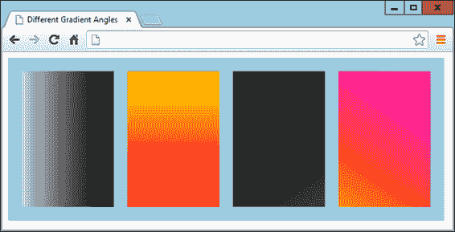
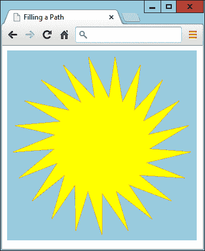

# 第二十六章：HTML5 画布

虽然新网页技术的总称是*HTML5*，但它们并不全是简单的 HTML 标签和属性。canvas 元素就是一个例子。是的，你可以使用`<canvas>`标签创建一个画布，并且可能指定宽度和高度，并可以通过 CSS 进行一些修改，但要真正向画布写入（或从中读取），你必须使用 JavaScript。

幸运的是，你需要学习的 JavaScript 内容很少，而且非常容易实现，而且我已经在第二十一章（*OSC.js*文件中）提供了一套三个现成的函数，使得访问诸如 canvas 这样的对象更加简单。所以，让我们马上开始使用新的`<canvas>`标签。

# 创建和访问一个画布

在第二十五章中，我向你展示了如何绘制一个简单的圆来展示日本国旗，本章中再次使用。现在让我们来看看这里到底发生了什么。

##### 示例 26-1 通过使用 canvas 显示日本国旗

```php
<!DOCTYPE html>
<html>
  <head>
    <title>The HTML5 Canvas</title>
    <script src='OSC.js'></script>
  </head>
  <body>
    <canvas id='mycanvas' width='320' height='240'>
      This is a canvas element given the ID <i>mycanvas</i>
      This text is only visible in non-HTML5 browsers
    </canvas>

    <script>
      canvas            = O('mycanvas')
      context           = canvas.getContext('2d')
      context.fillStyle = 'red'
      S(canvas).border  = '1px solid black'

      context.beginPath()
      context.moveTo(160, 120)
      context.arc(160, 120, 70, 0, Math.PI * 2, false)
      context.closePath()
      context.fill()
    </script>
  </body>
</html>
```

当然，`<!DOCTYPE html>`声明告诉浏览器文档将使用 HTML5。接着，显示了一个标题，并加载了*OSC.js*文件中的三个函数。

文档的主体定义了一个 canvas 元素，赋予其 ID 为`mycanvas`，并设置宽度和高度为 320 × 240 像素。如前一章节所述，canvas 的文本在支持 canvas 元素的浏览器中不会显示，但在不支持 canvas 的老旧浏览器中会显示出来。

接着是一段 JavaScript 代码，用于样式化和在画布上绘制。我们首先通过调用`O`函数在画布元素上创建一个`canvas`对象。正如你所记得的，这会调用`document.getElementById`函数，因此是引用元素的一种更简短的方式。

这些都是你以前见过的东西，但接下来是一些新内容：

```php
context = canvas.getContext('2d')
```

此命令调用新创建的`canvas`对象的`getContext`方法，通过传递值`2d`请求对画布进行二维访问。

###### 注意

如果你想在画布上显示 3D 效果，可以自己做数学运算，在 2D 中“伪造”它，或者可以使用基于 OpenGL ES 的 WebGL，这种情况下你需要调用`canvas.getContext('webgl')`来为其创建一个`context`。这里没有更多的空间来进一步讨论这个主题，但你可以在[*https://webglfundamentals.org*](https://webglfundamentals.org)找到一个很棒的教程。或者，可以查看[Three.jsJavaScript 库](https://threejs.org)，它也使用 WebGL 提供 3D 功能。

有了对象`context`中的这个上下文，我们通过将`context`的`fillStyle`属性设置为`red`来准备后续的绘图命令：

```php
context.fillStyle = 'red'
```

然后调用`S`函数来设置画布的`border`属性为 1 像素的实线黑色边框以勾勒出国旗图像：

```php
S(canvas).border = '1px solid black'
```

准备好一切后，在上下文中打开路径，并将绘图位置移动到位置（160，120）：

```php
context.beginPath()
context.moveTo(160, 120)
```

在此之后，在该坐标中心绘制一个圆弧，半径为 70 像素，从角度为 0 度（即圆的右边缘）开始，以 2 × π 确定的弧度继续绕圆周绘制：

```php
context.arc(160, 120, 70, 0, Math.PI * 2, false)
```

最后的 `false` 值指示顺时针方向绘制圆弧；`true` 值表示应以逆时针方向绘制。

最后，我们使用预先设置为 `red` 的 `fillStyle` 属性来关闭并填充路径：

```php
context.closePath()
context.fill()
```

将此文档加载到网络浏览器中的结果类似于上一章节的图 25-1。

## toDataURL 函数

在创建画布中的图像后，有时您可能希望复制它，也许是为了在网页的其他地方重复使用，用于动画目的，保存到本地存储或上传到 Web 服务器。这尤其方便，因为用户无法使用拖放来保存画布图像。

为了说明如何做到这一点，我在示例 26-2 中添加了几行代码（用粗体标出）。这些代码创建了一个新的 `` 元素，带有 ID `myimage`，给它加上了一个纯黑色边框，然后将画布图像复制到 `` 元素中（参见图 26-1）。

##### 示例 26-2\. 复制画布图像

```php
<!DOCTYPE html>
<html>
  <head>
    <title>Copying a Canvas</title>
    <script src='OSC.js'></script>
  </head>
  <body>
    <canvas id='mycanvas' width='320' height='240'> This is a canvas element given the ID <i>mycanvas</i> This text is only visible in non-HTML5 browsers </canvas>

    ``

    <script>
      canvas            = O('mycanvas')
      context           = canvas.getContext('2d')
      context.fillStyle = 'red'
      S(canvas).border  = '1px solid black'

      context.beginPath()
      context.moveTo(160, 120)
      context.arc(160, 120, 70, 0, Math.PI * 2, false)
      context.closePath()
      context.fill()

      `S``(``'myimage'``)``.``border` `=` `'1px solid black'`
      `O``(``'myimage'``)``.``src`    `=` `canvas``.``toDataURL``(``)`
    </script>
  </body>
</html>
```


###### 图 26-1\. 右侧图像是从左侧画布复制的

如果您自己尝试此代码，您会注意到，尽管您不能拖放左侧画布图像，但您可以对右侧图片进行拖放，您还可以使用适当的 JavaScript（以及服务器端的 PHP）将其保存到本地存储或上传到 Web 服务器。

## 指定图像类型

在从画布创建图像时，您可以指定要的图像类型，可以是 JPEG（*.jpg* 或 *.jpeg* 文件）或 PNG（*.png* 文件）。默认为 PNG（`image/png`），但如果有必要，您可以修改调用 `toDataURL` 的方式。同时，您还可以指定要使用的压缩量，介于 `0`（最低质量）和 `1`（最高质量）之间。以下使用了压缩值 `0.4`，应生成一个外观合理且文件大小较小的图像：

```php
O('myimage').src = canvas.toDataURL('image/jpeg', 0.4)
```

###### 警告

请记住，`toDataURL` 方法适用于 `canvas` 对象，而不适用于从该对象创建的任何上下文。

现在您知道如何创建画布图像，然后复制或以其他方式使用它们，是时候看看可用的绘图命令了，首先是矩形。

## fillRect 方法

有三种不同的方法可以用来绘制矩形，第一种是`fillRect`。要使用它，只需提供矩形的左上角坐标，然后是宽度和高度（以像素为单位），像这样：

```php
context.fillRect(20, 20, 600, 200)
```

默认情况下，矩形将填充为黑色，但你可以通过首先发出如下命令来使用任何其他你喜欢的颜色，其中参数可以是任何可接受的 CSS 颜色、名称或值：

```php
context.fillStyle = 'blue'
```

## clearRect 方法

你还可以绘制一个矩形，其中所有的颜色值（红色、绿色、蓝色和 alpha 透明度）都被设置为`0`，就像下面的例子一样，它使用了相同的坐标顺序和宽度高度参数：

```php
context.clearRect(40, 40, 560, 160)
```

一旦应用了`clearRect`方法，新清除的矩形将从其覆盖的区域中除去所有颜色，只留下已应用到画布元素的任何底层 CSS 颜色。

## strokeRect 方法

当你只想要一个轮廓矩形时，你可以使用如下命令，它将使用黑色或当前选择的描边颜色的默认值：

```php
context.strokeRect(60, 60, 520, 120)
```

要改变使用的颜色，你可以首先发出如下命令，提供任何有效的 CSS 颜色参数：

```php
context.strokeStyle = 'green'
```

## 结合这些命令

在示例 26-3 中，前面的绘制矩形命令已经组合起来显示了图 26-2 中显示的图像。

##### 示例 26-3\. 绘制几个矩形

```php
<!DOCTYPE html>
<html>
  <head>
    <title>Drawing Rectangles</title>
    <script src='OSC.js'></script>
  </head>
  <body>
    <canvas id='mycanvas' width='640' height='240'></canvas>

    <script>
      canvas               = O('mycanvas')
      context              = canvas.getContext('2d')
      S(canvas).background = 'lightblue'
      context.fillStyle    = 'blue'
      context.strokeStyle  = 'green'

      context.fillRect(  20, 20, 600, 200)
      context.clearRect( 40, 40, 560, 160)
      context.strokeRect(60, 60, 520, 120)
    </script>
  </body>
</html>
```


###### 图 26-2\. 绘制同心矩形

本章后面，你将看到如何通过改变描边类型和宽度来进一步修改输出，但首先，让我们通过应用渐变（作为 CSS 的一部分，已经在“渐变”中介绍过）来修改填充。

## createLinearGradient 方法

有几种方法可以对填充应用渐变，但最简单的方法是使用`createLinearGradient`方法。你可以指定相对于画布（而不是被填充对象）的起始和结束*x*和*y*坐标。这允许更加微妙的效果。例如，你可以指定渐变从画布的最左侧开始，到最右侧结束，但仅在填充命令定义的区域内应用，如示例 26-4 所示。

##### 示例 26-4\. 应用渐变填充

```php
gradient = context.createLinearGradient(0, 80, 640,80)
gradient.addColorStop(0, 'white')
gradient.addColorStop(1, 'black')
context.fillStyle = gradient
context.fillRect(80, 80, 480,80)
```

###### 注意

为了简洁和清晰起见，在这个和许多后续示例中，只显示了代码的显著行。完整的例子，包括周围的 HTML、设置和其他代码部分，可以从[GitHub](https://github.com/RobinNixon/lpmj6)免费下载。

在这个例子中，我们通过调用`context`对象的`createLinearGradient`方法创建了一个名为`gradient`的渐变填充对象。起始位置为（0, 80），位于左侧画布边缘的中间位置，而结束位置为（640, 80），位于右侧边缘的中间位置。

要创建您的渐变，确定您希望其流动的方向，然后找到两个点来表示开始和结束。无论您为这些点提供什么值，渐变都将平滑地过渡到给定的方向，即使这些点在填充区域之外。

接下来，提供了一对颜色停止，以指定渐变的第一个颜色是白色，最终颜色是黑色。然后，渐变将平滑地在画布上从左到右过渡这些颜色。

现在，`gradient`对象已准备就绪，它被应用于`context`对象的`fillStyle`属性，以便最终的`fillRect`调用可以使用它。在此调用中，填充仅应用于画布的中心矩形区域，因此尽管渐变从画布的最左边延伸到最右边，但其显示的部分仅从左上角的 80 像素处开始，宽度为 480 像素，深度为 80 像素。结果（当添加到先前的示例代码中时）看起来像图 26-3。


###### 图 26-3\. 中央矩形具有水平渐变填充

通过为渐变指定不同的起始和结束坐标，可以使其朝任何方向倾斜，正如示例 26-5 所演示的，并显示在图 26-4 中。

##### 示例 26-5\. 不同角度和颜色的多种渐变

```php
gradient = context.createLinearGradient(0, 0, 160, 0)
gradient.addColorStop(0, 'white')
gradient.addColorStop(1, 'black')
context.fillStyle = gradient
context.fillRect(20, 20, 135, 200)

gradient = context.createLinearGradient(0, 0, 0, 240)
gradient.addColorStop(0, 'yellow')
gradient.addColorStop(1, 'red')
context.fillStyle = gradient
context.fillRect(175, 20, 135, 200)

gradient = context.createLinearGradient(320, 0, 480, 240)
gradient.addColorStop(0, 'green')
gradient.addColorStop(1, 'purple')
context.fillStyle = gradient
context.fillRect(330, 20, 135, 200)

gradient = context.createLinearGradient(480, 240, 640, 0)
gradient.addColorStop(0, 'orange')
gradient.addColorStop(1, 'magenta')
context.fillStyle = gradient
context.fillRect(485, 20, 135, 200)
```



###### 图 26-4\. 不同线性渐变的范围

在这个例子中，我选择直接将渐变放置在要填充的区域上方，以更清楚地显示从起始到结束的颜色最大变化。

## 详细介绍 addColorStop 方法

您可以在渐变中使用任意数量的颜色停止，不仅限于这些示例中到目前为止使用的两种起始和结束颜色。这使得几乎可以描述您可以想象到的任何类型的渐变效果。为此，必须指定每种颜色在渐变中所占百分比的浮点起始位置，分配在`0`到`1`之间的渐变范围内。您不输入颜色的结束位置，因为它是从下一个颜色停止的起始位置推导出来的，或者是您指定的最后一个位置的渐变结束。

在前面的示例中，仅选择了两个起始和结束值，但要创建彩虹效果，您可以设置如示例 26-6 所示的颜色停止，（显示在图 26-5 中）。

##### 示例 26-6\. 添加多个颜色停止

```php
gradient.addColorStop(0.00, 'red')
gradient.addColorStop(0.14, 'orange')
gradient.addColorStop(0.28, 'yellow')
gradient.addColorStop(0.42, 'green')
gradient.addColorStop(0.56, 'blue')
gradient.addColorStop(0.70, 'indigo')
gradient.addColorStop(0.84, 'violet')
```


###### 图 26-5\. 具有七个停止颜色的彩虹效果

在 示例 26-6 中，所有颜色大致等间距分布（每种颜色占渐变的 14%，最后一种占 16%），但您不必局限于此；您可以将几种颜色挤在一起，同时将其他颜色间隔开。您可以完全自由地选择使用多少种颜色以及它们在渐变中的起始和结束位置。

## createRadialGradient 方法

在 HTML 中，您不仅限于线性渐变；您也可以在画布上创建径向渐变。虽然比线性渐变复杂一点，但也不多。

你需要做的是将中心位置作为一对*x*和*y*坐标传递，并且附带一个像素半径。这些被用作渐变的起始点和外部圆周。然后你还需要传递另一组坐标和半径来指定渐变的结束。

因此，例如，要创建一个简单从圆的中心开始然后扩展出去的渐变，您可以发出类似于 示例 26-7 中的命令（显示在 Figure 26-6 中）。起始点和结束点的坐标相同，但起始点的半径为 `0`，结束点的半径则包含整个渐变。

##### 示例 26-7\. 创建一个径向渐变

```php
gradient = context.createRadialGradient(320, 120, 0, 320, 120, 320)
```


###### 图 26-6\. 一个居中的径向渐变

或者您可以花哨一些，移动径向渐变的起始点和结束点的位置，就像 示例 26-8 中所示（并显示在 Figure 26-7 中），它从位置 (0, 120) 开始居中，半径为 0 像素，并以位置 (480, 120) 结束，半径为 480 像素。

##### 示例 26-8\. 拉伸径向渐变

```php
gradient = context.createRadialGradient(0, 120, 0, 480, 120, 480)
```


###### 图 26-7\. 一个拉伸的径向渐变

###### 注

通过操纵此方法提供的图表，您可以创建各种怪异而奇妙的效果——尝试使用提供的示例自己动手。

## 使用图案进行填充

类似于渐变填充，您也可以将图像应用为填充图案。这可以是当前文档中的任何图像，甚至是通过 `toDataURL` 方法从画布创建的图像（本章前面已经解释过）。

示例 26-9 加载一个 100 × 100 像素的图像（阴阳符号）到新的图像对象 `image` 中。接下来的语句将一个函数附加到 `onload` 事件，该函数为上下文的 `fillStyle` 属性创建一个重复图案。然后用这个图案填充画布中的一个 600 × 200 像素的区域，如图 Figure 26-8 所示。

##### 示例 26-9\. 使用图像作为图案填充

```php
image     = new Image()
image.src = 'image.png'

image.onload = function()
{
  pattern           = context.createPattern(image, 'repeat')
  context.fillStyle = pattern
  context.fillRect(20, 20, 600, 200)
}
```


###### 图 26-8\. 使用图像作为图案填充

我们通过使用 `createPattern` 方法来创建图案，该方法还支持非重复和仅在 x 轴或 y 轴上重复的图案。我们通过将其作为第二个参数传递给它来实现这一点，此参数为要使用的图像之后。

<dfn class="keep-together">`repeat`</dfn>

垂直和水平重复图片。

<dfn class="keep-together">`repeat-x`</dfn>

水平重复图片。

<dfn class="keep-together">`repeat-y`</dfn>

垂直重复图片。

<dfn class="keep-together">`no-repeat`</dfn>

不要重复图片。

填充图案基于整个画布区域，因此在设置填充命令仅应用于画布内较小区域时，图像在顶部和左侧会显得被截断。

###### 警告

如果在此示例中没有使用 `onload` 事件，而是在遇到代码时直接执行，那么图像可能在网页显示时尚未加载完成，可能不会显示在显示器上。附加到此事件可以确保图像可用于在画布中使用，因为该事件仅在图像成功加载后触发。

# 将文本写入画布

就像你从一组图形特性中所期望的那样，用文本写入画布是完全受支持的，具备多种字体、对齐和填充方法。但是，当今在 CSS 中已经有如此好的支持 web 字体的情况下，为什么还要将文本写入画布呢？

假设你希望显示一个带有图形元素的图表或表格。你肯定也想为其部分标记标签。更重要的是，利用现有的命令，你可以生成的不仅仅是彩色字体。因此，让我们首先假设你被要求为一个名为 WickerpediA 的篮编网站创建页眉（尽管实际上已经有一个这样的网站，但我们继续进行）。 

首先，你需要选择合适的字体并将其大小调整到适当的尺寸，可能如示例 26-10 中所示，选择了粗体风格、140 像素大小和 Times 字体。同时，还设置了 `textBaseline` 属性为 `top`，以便 `strokeText` 方法可以使用 (0, 0) 作为文本左上角的起点坐标，将其放置在画布的左上角。图 26-9 显示了其效果。

##### 示例 26-10\. 写入文本到画布

```php
context.font         = 'bold 140px Times'
context.textBaseline = 'top'
context.strokeText('WickerpediA', 0, 0)
```


###### 图 26-9\. 文本已写入画布

## `strokeText` 方法

要将文本写入画布，你需要将文本字符串和一对坐标发送到 `strokeText` 方法，就像这样：

```php
context.strokeText('WickerpediA', 0, 0)
```

提供的 *x* 和 *y* 坐标将被 `textBaseline` 和 `textAlign` 属性作为相对参考使用。

这种方法——使用线条绘制——只是绘制文本到画布的一种方式。因此，除了所有以下影响文本的属性外，如`lineWidth`（稍后在本章详细介绍），还会影响文本显示的线条绘制属性。

## textBaseline 属性

`textBaseline` 属性可以使用以下任意值：

<dfn class="keep-together">`top`</dfn>

对齐到文本的顶部

<dfn class="keep-together">`middle`</dfn>

对齐到文本的中间

<dfn class="keep-together">`alphabetic`</dfn>

对齐到文本的字母基线

<dfn class="keep-together">`bottom`</dfn>

对齐到文本的底部

## 字体属性

字体样式可以是`bold`、`italic`或`normal`（默认），也可以是`italic bold`的组合，大小值可以使用`em`、`ex`、`px`、`%`、`in`、`cm`、`mm`、`pt`或`pc`等单位，与 CSS 类似。字体应该是当前浏览器可用的其中之一，通常为`Helvetica`、`Impact`、`Courier`、`Times`或`Arial`，或者你可以选择用户系统的默认`Serif`或`Sans-serif`字体。如果你确信另一种你想使用的字体在浏览器中可用，也可以指定它，但最好在之后至少包含一个更常见或默认的选项，以便在用户没有安装首选字体时能够优雅地回退样式。

###### 警告

如果你想使用像 `Times New Roman` 这样的字体，其中包含空格，请将相关行更改为以下内容，外部引号与字体名称周围的引号不同：

```php
context.font = 'bold 140px "Times New Roman"'
```

## textAlign 属性

除了选择垂直对齐文本的方式外，还可以通过给 `textAlign` 属性指定以下值来指定水平对齐方式：

<dfn class="keep-together">`start`</dfn>

如果文档方向是从左到右，则将文本左对齐，否则右对齐。这是默认设置。

<dfn class="keep-together">`end`</dfn>

如果文档方向是从左到右，则将文本右对齐，否则左对齐。

<dfn class="keep-together">`left`</dfn>

将文本向左对齐。

<dfn class="keep-together">`right`</dfn>

将文本向右对齐。

<dfn class="keep-together">`center`</dfn>

将文本居中。

你可以像这样使用该属性：

```php
context.textAlign = 'center'
```

在当前示例中，需要将文本左对齐，以便其与画布边缘整齐对齐，因此不使用 `textAlign` 属性，因此默认的左对齐效果发生。

## fillText 方法

你还可以选择使用填充属性来填充画布文本，可以是纯色、线性或径向渐变，或图案填充。让我们尝试基于柳条篮子的纹理进行标题的图案填充，如示例 26-11，其结果显示在图 26-10 中。

##### 示例 26-11\. 用图案填充文本

```php
image     = new Image()
image.src = 'wicker.jpg'

image.onload = function()
{
  pattern           = context.createPattern(image, 'repeat')
  context.fillStyle = pattern
  context.fillText(  'WickerpediA', 0, 0)
  context.strokeText('WickerpediA', 0, 0)
}
```


###### 图 26-10\. 文本现在具有图案填充

为了确保文本边缘有足够的定义，我还在这个示例中保留了`strokeText`调用；如果没有它，边缘的定义就不够了。

这里还可以使用各种其他填充类型或图案，并且画布的简单性使得进行实验变得容易。此外，如果你希望，一旦标题达到完美，你还可以选择通过调用`toDataURL`保存一个副本，正如本章前面详细介绍的那样。然后，你可以将图像用作上传到其他站点的标志，例如。

## measureText 方法

在使用画布文本时，有时需要知道它将占用多少空间，以便最佳位置放置它。你可以使用`measureText`方法来实现这一点（假设在此时已经定义了各种文本属性），如下所示：

```php
metrics = context.measureText('WickerpediA')
width   = metrics.width
```

由于像素高度等于定义字体时的点大小，所以`metrics`对象不提供高度度量。

# 绘制线条

画布提供了丰富的线条绘制函数，以满足几乎所有需求，包括线条、线帽和连接的选择，以及各种类型的路径和曲线。但让我们从上一节中涉及的属性开始，介绍一下。

## lineWidth 属性

所有用线条绘制的画布方法都使用了几个线条属性，其中最重要的之一是`lineWidth`。使用它就像简单地指定像素线宽一样简单，比如这样设置宽度为 3 像素：

```php
context.lineWidth = 3
```

## lineCap 和 lineJoin 属性

当你绘制的线条到达终点并且宽度超过一个像素时，你可以选择如何显示这个*线帽*，通过使用`lineCap`属性，它可以有值`butt`（默认）、`round`或`square`，例如：

```php
context.lineCap = 'round'
```

此外，当你连接超过单像素宽度的线条时，指定它们如何相遇非常重要。你可以使用`lineJoin`属性来实现这一点，它可以具有值`round`、`bevel`或`miter`（默认值），例如：

```php
context.lineJoin = 'bevel'
```

示例 26-12（因为有点复杂，这里完整显示）将每个属性的三个值结合起来应用，从而创建了你在图 26-11 中看到的结果。该示例使用的`beginPath`、`closePath`、`moveTo`和`lineTo`方法将在下面解释。

##### 示例 26-12\. 显示线帽和连接的组合

```php
<!DOCTYPE html>
<html>
  <head>
    <title>Drawing Lines</title>
    <script src='OSC.js'></script>
  </head>
  <body>
    <canvas id='mycanvas' width='535' height='360'></canvas>

    <script>
      canvas               = O('mycanvas')
      context              = canvas.getContext('2d')
      S(canvas).background = 'lightblue'
      context.fillStyle    = 'red'
      context.font         = 'bold 13pt Courier'
      context.strokeStyle  = 'blue'
      context.textBaseline = 'top'
      context.textAlign    = 'center'
      context.lineWidth    = 20
      caps                 = ['  butt', ' round', 'square']
      joins                = [' round', ' bevel', ' miter']

      for (j = 0 ; j < 3 ; ++j)
      {
        for (k = 0 ; k < 3 ; ++k)
        {
          context.lineCap  = caps[j]
          context.lineJoin = joins[k]

          context.fillText(' cap:' + caps[j],  88 + j * 180, 45 + k * 120)
          context.fillText('join:' + joins[k], 88 + j * 180, 65 + k * 120)

          context.beginPath()
          context.moveTo( 20 + j * 180, 100 + k * 120)
          context.lineTo( 20 + j * 180,  20 + k * 120)
          context.lineTo(155 + j * 180,  20 + k * 120)
          context.lineTo(155 + j * 180, 100 + k * 120)
          context.stroke()
          context.closePath()
        }
      }
    </script>
  </body>
</html>
```

这段代码设置了一些属性，然后嵌套了一对循环：一个用于线帽，一个用于连接。在中央循环内，首先设置了`lineCap`和`lineJoin`属性的当前值，然后用`fillText`方法在画布上显示出来。

使用这些设置，代码将绘制九个形状，每个形状都有一个 20 像素宽的线，具有不同的线帽和连接设置，如 图 26-11 所示。

正如你所看到的，平截头线帽很短，方形的较长，而圆形的则介于两者之间。圆角连接是曲线的，斜角连接是切割过角的，而尖角连接具有尖锐的角。连接同样适用于不是 90 度的角的连接。


###### 图 26-11\. 所有线帽和连接的组合

## **miterLimit 属性**

如果你发现你的尖角斜接被截断得太短，你可以使用 `miterLimit` 属性来延长它们，如下所示：

```php
context.miterLimit = 15
```

默认值为 `10`，所以你也可以减少斜接限制。如果 `miterLimit` 没有设置为足够大的值以适应斜接，那么锐角斜接将会简单地变成斜接。因此，如果你遇到尖锐斜接的问题，只需增加你为 `miterLimit` 提供的值，直到斜接正确显示。

# 使用路径

前面的示例使用了两种方法来设置路径，供线条绘制方法使用。`beginPath` 方法设置路径的开始，而 `closePath` 设置路径的结束。在每个路径内部，你可以使用各种方法来移动绘图位置以及创建线条、曲线和其他形状。让我们简要看一下来自 示例 26-12 的相关部分，简化为仅创建模式的单个实例：

```php
context.beginPath()
context.moveTo(20, 100)
context.lineTo(20,  20)
context.lineTo(155, 20)
context.lineTo(155, 100)
context.stroke()
context.closePath()
```

在这段代码片段中，第一行开始了一个路径，然后通过调用 `moveTo` 方法将绘图位置移动到离画布左上角 20 像素横向和 100 像素纵向的位置。

然后紧接着是对 `lineTo` 的三次调用，分别画出三条线，首先向上到位置 (20, 20)，然后向右到 (155, 20)，最后再次向下到 (155, 100)。一旦路径设置好了，调用 `stroke` 方法进行绘制，最后关闭路径因为不再需要。

###### 注意

在完成路径后立即关闭路径是非常重要的；否则，在使用多条路径时可能会得到一些非常意想不到的结果。

## moveTo 和 lineTo 方法

`moveTo` 方法和 `lineTo` 方法都接受简单的 *x* 和 *y* 坐标作为它们的参数，它们的区别在于 `moveTo` 从当前位置拿起一个虚拟的笔然后移动到一个新位置，而 `lineTo` 在当前虚拟笔的位置到指定的新位置之间画一条线。或者，如果调用了 `stroke` 方法但没有其他方法的话，将会画出一条线。因此，我们只能说 `lineTo` 创建了一个*潜在*的画线，但它同样可以是填充区域的轮廓的一部分，例如。

## stroke 方法

`stroke`方法的作用是将到目前为止在路径中创建的所有线条实际绘制到画布上。如果在未关闭路径的情况下发出该命令，则会立即绘制到最近的虚拟笔位置。

然而，如果关闭路径，然后发出一个`stroke`调用，它的效果也会从当前位置回到起始位置连接路径，在这个例子中会将形状变成矩形（这不是我们想要的，因为我们需要看到线帽以及连接点）。

###### 注意

这种路径闭合后的连接效果是必需的（稍后您将看到），以便准备好任何您希望对其使用的`fill`方法；否则，用于填充的图形可能会超出路径的边界。

## rect 方法

如果需要创建四边形而不是前面示例中的三边形（并且您不希望关闭路径），可以发出另一个`lineTo`调用以连接所有内容，就像这样（以粗体显示）：

```php
context.beginPath()
context.moveTo(20, 100)
context.lineTo(20, 20)
context.lineTo(155, 20)
context.lineTo(155, 100)
`context``.``lineTo``(``20``,` `100``)`
context.closePath()
```

但是，有一种更简单的方法可以绘制带有轮廓的矩形，即使用`rect`方法，就像这样：

```php
rect(20, 20, 155, 100)
```

在单个调用中，此命令接受两对*x*和*y*坐标并绘制一个矩形，其左上角位于(20, 20)位置，右下角位于(155, 100)位置。

# 填充区域

使用路径，您可以创建复杂的区域，还可以填充实色、渐变色或图案填充。在示例 26-13 中，使用了一些基本的三角函数来创建复杂的星形图案。我不会详细说明数学如何工作，因为这对示例不重要（尽管如果您想玩转代码，请尝试更改分配给`points`、`scale1`和`scale2`变量的值，以获得不同的效果）。

##### 示例 26-13\. 填充复杂路径

```php
<!DOCTYPE html>
<html>
  <head>
    <title>Filling a Path</title>
    <script src='OSC.js'></script>
  </head>
  <body>
    <canvas id='mycanvas' width='320' height='320'></canvas>

    <script>
      canvas               = O('mycanvas')
      context              = canvas.getContext('2d')
      S(canvas).background = 'lightblue'
      `context``.``strokeStyle`  `=` `'orange'`
      `context``.``fillStyle`    `=` `'yellow'`

      orig   = 160
      points = 21
      dist   = Math.PI / points * 2
      scale1 = 150
      scale2 = 80

      `context``.``beginPath``(``)`

      for (j = 0 ; j < points ; ++j)
      {
        x = Math.sin(j * dist)
        y = Math.cos(j * dist)
        `context``.``lineTo``(``orig` `+` `x` `*` `scale1``,` `orig` `+` `y` `*` `scale1``)`
        `context``.``lineTo``(``orig` `+` `x` `*` `scale2``,` `orig` `+` `y` `*` `scale2``)`
      }

      `context``.``closePath``(``)`
      `context``.``stroke``(``)`
      `context``.``fill``(``)`
    </script>
  </body>
</html>
```

您真正需要查看的只是以粗体显示的那些行，其中开始了一个路径，一对`lineTo`调用定义了形状，路径被关闭，然后使用`stroke`和`fill`方法绘制橙色的形状轮廓并填充黄色（如图 26-12 所示）。

###### 注意

使用路径，您可以创建任意复杂的对象，可以使用公式或循环（如本例中）或仅使用一长串的`moveTo`和/或`lineTo`调用。



###### 图 26-12\. 绘制和填充复杂路径

# clip 方法

有时，在构建路径时，您可能希望忽略画布的某些部分（也许是因为您正在部分“后面”绘制另一个对象，只想显示可见部分）。您可以使用`clip`方法来实现这一点，该方法创建一个边界，超出该边界的`stroke`、`fill`或其他方法将不会产生任何效果。

为了说明这一点，示例 26-14 通过将虚拟笔指针移动到左边缘，然后画一条`lineTo`到右边缘，再向下移动 30 像素，然后再返回到左边缘，依此类推，创建了类似窗帘的效果。这在画布上绘制了一系列深度为 30 像素的水平条，如图 26-13 所示。

##### 示例 26-14\. 创建剪辑区域

```php
context.beginPath()

for (j = 0 ; j < 10 ; ++j)
{
  context.moveTo(20,  j * 48)
  context.lineTo(620, j * 48)
  context.lineTo(620, j * 48 + 30)
  context.lineTo(20,  j * 48 + 30)
}

`context``.``stroke``(``)`
context.closePath()
```


###### 图 26-13\. 水平条形图的路径

要将此示例转换为画布上的剪辑区域，您只需将示例中用粗体突出显示的`stroke`调用替换为`clip`调用，如下所示：

```php
context.clip()
```

现在不会看到条形图的轮廓，但是一个由所有单独的条形图组成的剪辑区域将会存在。为了说明这一点，示例 26-15 使用这种方法替代，并在之前的示例基础上添加了在画布上绘制简单的绿草图像的修改，位于一个包含闪耀太阳的蓝天下（修改自示例 26-12），用粗体突出显示的更改，并在图 26-14 中显示结果。

##### 示例 26-15\. 在剪辑区域的边界内绘制

```php
`context``.``fillStyle` `=` `'white'`
`context``.``strokeRect``(``20``,` `20``,` `600``,` `440``)` // Black border `context``.``fillRect``(`  `20``,` `20``,` `600``,` `440``)` // White background 
context.beginPath()

for (j = 0 ; j < 10 ; ++j)
{
  context.moveTo(20,  j * 48)
  context.lineTo(620, j * 48)
  context.lineTo(620, j * 48 + 30)
  context.lineTo(20,  j * 48 + 30)
}

`context``.``clip``(``)`
context.closePath()

`context``.``fillStyle`   `=` `'blue'`         // Blue sky `context``.``fillRect``(``20``,` `20``,`  `600``,` `320``)`
`context``.``fillStyle`   `=` `'green'`        // Green grass `context``.``fillRect``(``20``,` `320``,` `600``,` `140``)`
`context``.``strokeStyle` `=` `'orange'`
`context``.``fillStyle`   `=` `'yellow'`

`orig`   `=` `170`
`points` `=` `21`
`dist`   `=` `Math``.``PI` `/` `points` `*` `2`
`scale1` `=` `130`
`scale2` `=` `80`

`context``.``beginPath``(``)`

`for` `(``j` `=` `0` `;` `j` `<` `points` `;` `++``j``)`
`{`
  `x` `=` `Math``.``sin``(``j` `*` `dist``)`
  `y` `=` `Math``.``cos``(``j` `*` `dist``)`
  `context``.``lineTo``(``orig` `+` `x` `*` `scale1``,` `orig` `+` `y` `*` `scale1``)`
  `context``.``lineTo``(``orig` `+` `x` `*` `scale2``,` `orig` `+` `y` `*` `scale2``)`
`}`

`context``.``closePath``(``)`
`context``.``stroke``(``)`                     // Sun outline `context``.``fill``(``)`                       // Sun fill
```


###### 图 26-14\. 仅在允许的剪辑区域内绘制

好了，我们不会在这里赢得任何比赛，但您可以看到在有效使用时剪辑可以有多强大。

# isPointInPath 方法

有时候您需要知道特定点是否位于您构建的路径中。但是，您可能只有在非常熟练于 JavaScript 并且能够编写相当复杂的程序时才会想要使用此功能，并且通常会将其作为条件`if`语句的一部分调用，如下所示：

```php
if (context.isPointInPath(23, 87))
{
  // Do something here
}
```

调用的第一个参数是位置的*x*坐标，第二个参数是位置的*y*坐标。如果指定的位置位于路径中的任何点上，则该方法返回值为`true`，因此执行`if`语句的内容。否则，返回值为`false`，则不执行`if`语句的内容。

###### 注意

使用`isPointInPath`方法的完美场景是创建使用画布的游戏，例如希望检查导弹击中目标、球击中墙壁或球拍等边界条件。

# 使用曲线

除了直线路径，您还可以使用各种不同的方法创建几乎无限种类的曲线路径，从简单的弧线和圆到复杂的二次和贝塞尔曲线。

实际上，您不需要使用路径来创建许多线条、矩形和曲线，因为您可以通过直接调用它们的方法来直接绘制它们。但是使用路径可以给您提供更精确的控制，因此我倾向于在定义的路径内绘制画布上的内容，就像以下示例一样。

## 弧方法

`arc`方法要求您传递弧的中心的*x*和*y*位置，以及像素的半径。除了这些值，您还需要传递一对弧度偏移量，并且可以选择包括方向，如下所示：

```php
context.arc(55, 85, 45, 0, Math.PI / 2, false)
```

由于默认方向是顺时针的（一个值为`false`），这可以省略，或者您可以将其更改为`true`以逆时针方向绘制弧。

示例 26-16 创建了三组四个弧，前两组顺时针方向，第三组逆时针方向。此外，前两组弧在调用`stroke`方法之前路径已关闭，因此起点和终点相连，而后面的两组弧在路径关闭之前绘制，因此不相连。

##### 示例 26-16\. 绘制各种弧

```php
context.strokeStyle = 'blue'
arcs =
[
  Math.PI,
  Math.PI * 2,
  Math.PI / 2,
  Math.PI / 180 * 59
]

for (j = 0 ; j < 4 ; ++j)
{
  context.beginPath()
  context.arc(80 + j * 160, 80, 70, 0, arcs[j])
  context.closePath()
  context.stroke()
}

context.strokeStyle = 'red'

for (j = 0 ; j < 4 ; ++j)
{
  context.beginPath()
  context.arc(80 + j * 160, 240, 70, 0, arcs[j])
  context.stroke()
  context.closePath()
}

context.strokeStyle = 'green'

for (j = 0 ; j < 4 ; ++j)
{
  context.beginPath()
  context.arc(80 + j * 160, 400, 70, 0, arcs[j], true)
  context.stroke()
  context.closePath()
}
```

为了创建更短的代码，我使用循环绘制了所有的弧，以便将每个弧的长度存储在数组`arcs`中。这些值以弧度表示，一个弧度相当于 180 ÷ π（π是圆周与直径的比值，约为 3.1415927），它们的计算如下：

<dfn class="keep-together">`Math.PI`</dfn>

等同于 180 度

<dfn class="keep-together">`Math.PI * 2`</dfn>

等同于 360 度

<dfn class="keep-together">`Math.PI / 2`</dfn>

等同于 90 度

<dfn class="keep-together">`Math.PI / 180 * 59`</dfn>

等同于 59 度

图 26-15 展示了三行弧，并说明了在最后一组中使用方向参数`true`以及根据您是否希望绘制连接起始点和终点的线条而仔细选择关闭路径的重要性。


###### 图 26-15\. 各种弧类型

###### 注意

如果您更喜欢使用度而不是弧度，可以创建一个新的`Math`库函数，如下所示：

```php
Math.degreesToRadians = function(degrees)
{
  return degrees * Math.PI / 180
}
```

然后用以下内容替换从示例 26-16 的第二行开始的创建数组的代码：

```php
arcs =
[
  Math.degreesToRadians(180),
  Math.degreesToRadians(360),
  Math.degreesToRadians(90),
  Math.degreesToRadians(59)
]
```

## arcTo 方法

而不是一次创建整个弧，您可以选择从路径中的当前位置弧到另一个位置，就像在以下`arcTo`调用中（它只需要两对*x*和*y*坐标和一个半径）：

```php
context.arcTo(100, 100, 200, 200, 100)
```

您传递给该方法的位置代表想象的切线触及弧的圆周的起点和终点处。切线是一条直线与圆周的接触点，使得接触点两侧的角度相等。

为了说明其工作原理，例子 26-17 绘制了八个不同半径从 0 到 280 像素的弧线。每次循环时，都会在位置 (20, 20) 处创建一个新路径的起始点。然后使用虚拟切线从该位置绘制弧线到位置 (240, 240)，然后再到位置 (460, 20)。在这种情况下，它定义了一个互相成直角的 *V* 形的切线对。

##### 例子 26-17\. 绘制八个不同半径的弧线

```php
for (j = 0 ; j <= 280 ; j += 40)
{
  context.beginPath()
  context.moveTo(20, 20)
  context.arcTo(240, 240, 460, 20, j)
  context.lineTo(460, 20)
  context.stroke()
  context.closePath()
}
```

`arcTo` 方法仅绘制弧线触及第二个虚拟切线的点。因此，在每次调用 `arcTo` 后，`lineTo` 方法创建从 `arcTo` 结束位置到位置 (460,20) 的剩余线段。然后使用 `stroke` 方法将结果绘制到画布上，并关闭路径。

正如您在 图 26-16 中看到的，当 `arcTo` 使用半径值 `0` 调用时，它会创建一个尖锐的连接点。在这种情况下，它是一个直角（但如果两条虚拟切线相互形成其他角度，连接点将位于那个角度）。随着半径的增大，您可以看到弧线变得越来越大。


###### 图 26-16\. 绘制不同半径的弧线

从根本上说，您可以最好地使用 `arcTo` 来从绘制的一个部分弯曲到另一个部分，根据前后位置的弧度切线，仿佛它们是弧线的切线。如果这听起来很复杂，别担心：您很快就会掌握它，并发现这实际上是一种方便和逻辑的绘制弧线的方式。

## 二次曲线绘制方法

尽管弧线很有用，但它们只是一种曲线类型，对于更复杂的设计可能有所限制。但不用担心：还有更多方法来绘制曲线，例如 `quadraticCurveTo` 方法。使用这种方法，您可以在曲线附近放置一个虚拟吸引子，将其朝该方向拉动，就像空间中的物体路径被它经过的行星和恒星的引力所拉动一样。不过，与重力不同的是，吸引子距离越远，它的吸引力就*越*大！

例子 26-18 包含对此方法的六次调用，创建了一朵蓬松云朵的路径，然后用白色填充。 图 26-17 说明了云朵外部虚线的角度代表应用于每条曲线的吸引点。

##### 例子 26-18\. 使用二次曲线绘制云朵

```php
context.beginPath()
context.moveTo(180, 60)
context.quadraticCurveTo(240,   0, 300,  60)
context.quadraticCurveTo(460,  30, 420, 100)
context.quadraticCurveTo(480, 210, 340, 170)
context.quadraticCurveTo(240, 240, 200, 170)
context.quadraticCurveTo(100, 200, 140, 130)
context.quadraticCurveTo( 40,  40, 180,  60)
context.fillStyle = 'white'
context.fill()
context.closePath()
```


###### 图 26-17\. 使用二次曲线绘制

###### 注意

顺便说一下，为了在此图像中实现云的虚线周围的虚线，我使用了`stroke`方法与`setLineDash`方法结合使用，后者接受表示短划线和空格长度的列表。在这种情况下，我使用了`setLineDash([2, 3])`，但您可以创建复杂到您喜欢的虚线，比如`setLineDash([1, 2, 1, 3, 5, 1, 2, 4])`。

## bezierCurveTo 方法

如果您仍然觉得二次曲线对您的需求不够灵活，那么对于每条曲线使用两个吸引子如何？使用`bezierCurveTo`方法，您可以做到这一点，就像在示例 26-19 中那样，其中创建了一个曲线，连接位置(24, 20)和(240, 220)，但是吸引子在画布外部不可见（在此示例中位于位置(720, 480)和(-240, -240)）。图 26-18 展示了这条曲线的形变过程。

##### 示例 26-19\. 创建具有两个吸引子的贝塞尔曲线

```php
context.beginPath()
context.moveTo(240, 20)
context.bezierCurveTo(720, 480, -240, -240, 240, 220)
context.stroke()
context.closePath()
```


###### 图 26-18\. 具有两个吸引子的贝塞尔曲线

吸引子不需要位于画布的相对两侧；您可以将它们放置在任何位置，当它们彼此靠近时，它们将施加联合的吸引力（而不是像前面的例子中那样的对立吸引力）。使用这些不同类型的曲线方法，您可以绘制您所需的每种类型的曲线。

# 图像操作

您不仅可以使用图形方法在画布上绘制和书写，还可以在画布上放置图像或从中提取它们。而且，您不限于简单的复制粘贴命令，因为在读取或写入图像时，您可以拉伸和扭曲图像，并完全控制混合和阴影效果。

## drawImage 方法

使用`drawImage`方法，您可以获取从网站加载的图像对象、上传到服务器的图像，甚至从画布中提取的图像，并将其绘制到画布上。该方法支持多种参数，其中许多是可选的，但在其最简单的形式下，您可以像以下这样调用`drawImage`，仅传递图像及一对*x*和*y*坐标：

```php
context.drawImage(myimage, 20, 20)
```

此命令将`myimage`对象中包含的图像绘制到具有`context`上下文的画布上，其左上角位于位置(20, 20)。

###### 警告

在使用图像之前确保其已加载的最佳实践是将您的图像处理代码封装在一个仅在图像加载时触发的函数中，如下所示：

```php
myimage     = new Image()
myimage.src = 'image.gif'

myimage.onload = function()
{
  context.drawImage(myimage, 20, 20)
}
```

## 调整图像大小

如果您需要在放置在画布上的图像上调整大小，请在调用中添加第二对表示所需宽度和高度的参数，如下（用粗体标记）：

```php
context.drawImage(myimage, 140,  20, `220`, `220`)
context.drawImage(myimage, 380,  20,  `80`, `220`)
```

此处图像放置在两个位置：第一个位置为(140, 20)，图像被放大（从 100 像素正方形到 220 像素正方形），而第二个位置为(380, 20)，图像在水平方向被挤压并在垂直方向上扩展，宽度和高度为 80 × 220 像素。

## 选择图像区域

在使用 `drawImage` 时，并不局限于使用整个图像；还可以选择图像内的区域。例如，如果希望将所有打算使用的图形图像放在一个单独的图像文件中，然后只需抓取所需的图像部分，这会非常方便。开发人员经常使用这种技巧来加快页面加载速度并减少服务器请求。

不过，这样做稍微复杂一些，因为在这种方法中，与在参数列表末尾添加更多参数不同的是，在提取图像的部分时，必须首先放置这些参数。

因此，例如，要在位置 (20, 140) 处放置一个图像，可以发出以下命令：

```php
context.drawImage(myimage, 20, 140)
```

要给抓取的部分设置宽度和高度为 100 × 100 像素，可以像这样修改调用（用粗体标出）：

```php
context.drawImage(myimage, 20, 140, `100`, `100`)
```

但是，如果想要抓取（或裁剪）一个只有 40 × 40 像素的子区域（例如），其位于图像的 (30, 30) 处，你可以像这样调用该方法（新参数用粗体表示）：

```php
context.drawImage(myimage, `30``,` `30``,` `40``,` `40``,` 20, 140)
```

要将抓取的部分调整为 100 像素正方形，可以使用以下方式：

```php
context.drawImage(myimage, `30``,` `30``,` `40``,` `40`, 20, 140, 100, 100)
```

###### 警告

我觉得这非常令人困惑，无法想到这种方法为什么会这样工作的合乎逻辑的原因。但既然它确实如此，我恐怕除了强迫自己记住在哪些条件下哪些参数放在哪里之外，别无他法。

示例 26-20 使用多种调用 `drawImage` 方法的方式来获得 图 26-19 所显示的结果。为了更清楚，我已经分开参数，使得每列的值提供相同的信息。

##### 示例 26-20\. 画布上绘制图像的各种方式

```php
myimage     = new Image()
myimage.src = 'image.png'

myimage.onload = function()
{
  context.drawImage(myimage,                  20,  20          )
  context.drawImage(myimage,                 140,  20, 220, 220)
  context.drawImage(myimage,                 380,  20,  80, 220)
  context.drawImage(myimage, 30, 30, 40, 40,  20, 140, 100, 100)
}
```


###### 图 26-19\. 调整大小和裁剪图像到画布上的图像

## 从画布复制

你还可以将一个画布用作绘制到同一个（或另一个）画布的源图像。只需在图像对象的位置提供画布对象的名称，并以与图像相同的方式使用所有其余的参数。

## 添加阴影

在画布上绘制图像（或图像部分）或者任何其他内容时，还可以通过设置以下一个或多个属性来放置阴影：

<dfn class="keep-together">`shadowOffsetX`</dfn>

阴影向右移动的水平偏移量（如果值为负，则向左移动）。

<dfn class="keep-together">`shadowOffsetY`</dfn>

阴影向下移动的垂直偏移量（如果值为负，则向上移动）。

<dfn class="keep-together">`shadowBlur`</dfn>

模糊阴影轮廓的像素数量。

<dfn class="keep-together">`shadowColor`</dfn>

用于阴影的基础颜色。如果使用了模糊，这种颜色将与模糊区域的背景混合。

这些属性不仅适用于文本和线条，还适用于实心图像，如示例 26-21 中所示，其中一些文本、图像和使用路径创建的对象都添加了阴影。在图 26-20 中，您可以看到阴影智能地围绕图像的可见部分流动，而不仅仅是其矩形边界。

##### 示例 26-21\. 在画布上绘制时应用阴影

```php
myimage     = new Image()
myimage.src = 'apple.png'

orig   = 95
points = 21
dist   = Math.PI / points * 2
scale1 = 75
scale2 = 50

myimage.onload = function()
{
  context.beginPath()

  for (j = 0 ; j < points ; ++j)
  {
    x = Math.sin(j * dist)
    y = Math.cos(j * dist)
    context.lineTo(orig + x * scale1, orig + y * scale1)
    context.lineTo(orig + x * scale2, orig + y * scale2)
  }

  context.closePath()

  context.shadowOffsetX = 5
  context.shadowOffsetY = 5
  context.shadowBlur    = 6
  context.shadowColor   = '#444'
  context.fillStyle     = 'red'
  context.stroke()
  context.fill()

  context.shadowOffsetX = 2
  context.shadowOffsetY = 2
  context.shadowBlur    = 3
  context.shadowColor   = 'yellow'
  context.font          = 'bold 36pt Times'
  context.textBaseline  = 'top'
  context.fillStyle     = 'green'
  context.fillText('Sale now on!', 200, 5)

  context.shadowOffsetX = 3
  context.shadowOffsetY = 3
  context.shadowBlur    = 5
  context.shadowColor   = 'black'
  context.drawImage(myimage, 245, 45)
}
```


###### 图 26-20\. 不同类型绘图对象下的阴影

# 在像素级别编辑

HTML5 画布不仅为您提供了强大的绘图方法范围，还允许您在像素级别直接在引擎盖下进行操作，其中包括三种强大的方法。

## `getImageData` 方法

使用`getImageData`方法，您可以抓取画布的一部分（或全部），以便您可以按任何方式修改检索到的数据，然后将其保存回画布的其他位置（或另一画布）。

为了说明这是如何工作的，示例 26-22 首先加载一个现成的图像并将其绘制到画布上。然后，画布数据被读取到一个名为`idata`的对象中，其中所有颜色被平均在一起以将每个像素更改为灰度，然后稍微调整以将每种颜色向深褐色移动，如图 26-21 所示。下一部分解释了像素的`data`数组及当值`50`被添加到或从数组元素中减去时会发生什么。

##### 示例 26-22\. 操纵图像数据

```php
myimage             = new Image()
myimage.src         = 'photo.jpg'
myimage.crossOrigin = ''

myimage.onload = function()
{
  context.drawImage(myimage, 0, 0)
  idata = context.getImageData(0, 0, myimage.width, myimage.height)

  for (y = 0 ; y < myimage.height ; ++y)
  {
    pos = y * myimage.width * 4

    for (x = 0 ; x < myimage.width ; ++x)
    {
      average =
      (
        idata.data[pos]     +
        idata.data[pos + 1] +
        idata.data[pos + 2]
      ) / 3

      idata.data[pos]     = average + 50
      idata.data[pos + 1] = average
      idata.data[pos + 2] = average - 50
      pos += 4;
    }
  }
  context.putImageData(idata, 320, 0)
}
```


###### 图 26-21\. 将图像转换为深褐色（在灰度模式下查看此图像时，只会看到细微差异）

### `data` 数组

这种图像操作依赖于`data`数组，它是通过调用`getImageData`返回的`idata`对象的属性。此方法返回一个包含所选区域的所有像素数据的数组，其组成部分包括红色、绿色、蓝色和 alpha 透明度。因此，每个彩色像素使用四个数据项来存储。

许多最近的浏览器已采纳严格的安全措施以防止跨源攻击，这就是为什么在这个示例中我们必须为`myimage`对象添加`crossOrigin`属性，并将其值设置为空字符串（代表默认值为`'anonymous'`），以明确允许读取图像数据。出于同样的安全原因，该示例只有在从 Web 服务器（如在线服务器或第二章中的 AMPPS 安装）加载时才能正确工作；在仅从本地文件系统加载时将无法正确工作。

所有数据按顺序存储在`data`数组中，因此红色值的后面是蓝色值，然后是绿色值，最后是透明度值；然后，数组中的下一个项是下一个像素的红色值，依此类推。因此，对于位置(0, 0)的像素，你将会有以下数值：

```php
idata.data[0] // Red level
idata.data[1] // Green level
idata.data[2] // Blue level
idata.data[3] // Alpha level
```

然后是位置(1, 0)，如下所示：

```php
idata.data[4] // Red level
idata.data[5] // Green level
idata.data[6] // Blue level
idata.data[7] // Alpha level
```

在这个图像中，一切都继续以同样的方式进行，直到第一行中最右边的像素——即第 0 行中的第 320 像素，位于位置(319, 0)——被达到。此时，将 319 乘以 4（每个像素数据项的数量）以获得以下数组元素，它们包含这个像素的数据：

```php
idata.data[1276] // Red level
idata.data[1277] // Green level
idata.data[1278] // Blue level
idata.data[1279] // Alpha level
```

这会导致数据指针移动回到图像的第一列，但这次是第 1 行的第一列，即位置(0, 1)，其偏移量为(0 × 4) + (1 × 320 × 4)，即 1,280：

```php
idata.data[1280] // Red level
idata.data[1281] // Green level
idata.data[1282] // Blue level
idata.data[1283] // Alpha level
```

因此，如果图像数据存储在`idata`中，图像宽度为`w`，要访问的像素位置为`x`和`y`，则在直接访问图像数据时使用的关键公式如下：

```php
red   = idata.data[x * 4 + y * w * 4    ]
green = idata.data[x * 4 + y * w * 4 + 1]
blue  = idata.data[x * 4 + y * w * 4 + 2]
alpha = idata.data[x * 4 + y * w * 4 + 3]
```

使用这些知识，我们通过仅获取每个像素的红色、蓝色和绿色分量并求平均值，来创建图 26-12 中的棕色效果（其中`pos`是当前像素数组位置的变量指针）：

```php
average =
(
  idata.data[pos]     +
  idata.data[pos + 1] +
  idata.data[pos + 2]
) / 3
```

现在`average`包含了平均颜色值（通过将所有像素值相加并除以 3 获得），这个值被写回到像素的所有颜色中，但红色增加了值`50`，蓝色减少了相同数量：

```php
idata.data[pos]     = average + 50
idata.data[pos + 1] = average
idata.data[pos + 2] = average - 50
```

结果是增加每个像素的红色值并减少蓝色值（否则这些颜色只需写回平均值将成为单色图像），从而赋予它棕色色调。

## 放置图像数据方法

当你修改了图像数据数组以满足你的要求后，只需像前面的示例中显示的那样调用`putImageData`方法，传递`idata`对象和应该出现的左上角的坐标即可将其写入画布。之前显示的调用将修改后的图像副本放置在原始图像的右侧：

```php
context.putImageData(idata, 320, 0)
```

###### 注意

如果你只想修改画布的一部分，你无需获取整个画布；只需获取包含你感兴趣区域的部分。你也不需要将图像数据写回到原来获取它的位置；图像数据可以写入画布的任何部分。

## 创建图像数据方法

你不必直接从画布创建对象；你也可以通过调用`createImageData`方法创建一个新的对象，并使用空白数据。以下示例创建一个宽度为 320 像素、高度为 240 像素的对象：

```php
idata = createImageData(320, 240)
```

或者，你可以像这样从现有对象创建一个新对象：

```php
newimagedataobject = createImageData(imagedata)
```

然后由您决定如何向这些对象添加像素数据或以其他方式修改它们，如何将它们粘贴到画布上或从它们创建其他对象，等等。

# 高级图形效果

在 HTML5 画布上的更高级功能之一是能够分配各种合成和透明效果，以及应用强大的转换，如缩放、拉伸和旋转。

## 全局合成操作属性

有 12 种不同的方法可用于精细调整如何在画布上放置对象，考虑到现有和未来的对象。这些称为*合成*选项，并且它们的应用方式如下：

```php
context.globalCompositeOperationProperty = 'source-over'
```

合成类型如下：

<dfn class="keep-together">`source-over`</dfn>

默认。源图像被复制到目标图像上。

<dfn class="keep-together">`source-in`</dfn>

只显示出现在目标内的源图像部分，并移除目标图像。源图像的任何 alpha 透明度会导致其下的目标被移除。

<dfn class="keep-together">`source-out`</dfn>

只显示未出现在目标内的源图像部分，并移除目标图像。源图像的任何 alpha 透明度会导致其下的目标被移除。

<dfn class="keep-together">`source-atop`</dfn>

源图像在覆盖目标的地方显示。目标图像在目标不透明且源图像透明时显示。其他区域为透明。

<dfn class="keep-together">`destination-over`</dfn>

源图像在目标图像下绘制。

<dfn class="keep-together">`destination-in`</dfn>

在源和目标图像重叠但源图像透明部分不在的区域显示目标图像。源图像不显示。

<dfn class="keep-together">`destination-out`</dfn>

只显示目标中在源图像非透明部分之外的部分。源图像不显示。

<dfn class="keep-together">`destination-atop`</dfn>

源图像显示在目标未显示的位置。目标和源重叠的地方，显示目标图像。源图像的任何透明部分防止目标图像的该区域显示。

<dfn class="keep-together">`lighter`</dfn>

应用源和目标的总和，以便它们不重叠的地方正常显示；它们重叠的地方，显示两者的总和但变亮。

<dfn class="keep-together">`darker`</dfn>

应用源和目标的总和，以便它们不重叠的地方正常显示；它们重叠的地方，显示两者的总和但变暗。

<dfn class="keep-together">`copy`</dfn>

源图像复制到目标上。源的任何透明区域会导致它所覆盖的目标不显示。

<dfn class="keep-together">`xor`</dfn>

当源和目标图像不重叠时，它们显示为正常。它们重叠的区域，它们的颜色值进行异或运算。

示例 26-23 通过创建 12 个不同的画布来展示所有这些合成类型的效果，每个画布上都有两个对象（一个填充的圆和阴阳图像），它们彼此偏移但有重叠。

##### 示例 26-23\. 使用所有 12 种合成效果

```php
image     = new Image()
image.src = 'image.png'

image.onload = function()
{
  types =
  [
    'source-over',     'source-in',        'source-out',
    'source-atop',     'destination-over', 'destination-in',
    'destination-out', 'destination-atop', 'lighter',
    'darker',          'copy',             'xor'
  ]

  for (j = 0 ; j < 12 ; ++j)
  {
    canvas               = O('c' + (j + 1))
    context              = canvas.getContext('2d')
    S(canvas).background = 'lightblue'
    context.fillStyle    = 'red'

    context.arc(50, 50, 50, 0, Math.PI * 2, false)
    context.fill()
    context.globalCompositeOperation = types[j]
    context.drawImage(image, 20, 20, 100, 100)
  }
}
```

###### 注意

与本章的其他一些示例类似，此示例（可从配套网站下载）包含一些 HTML 和/或 CSS 来增强显示效果，这里未显示因为它对程序的运行不是必需的。

此程序使用 `for` 循环来迭代存储在数组 `types` 中的每种合成类型。每次循环时，在先前某些 HTML（未显示）中已经创建的 12 个画布元素上创建一个新的上下文，它们的 ID 分别为 `c1` 到 `c12`。

在每个画布上，首先放置一个直径为 100 像素的红色圆在左上角，然后选择合成类型并将阴阳图像放置在圆上，但向右和向下偏移 20 像素。图 26-22 显示了每种类型的效果。正如你所见，可以实现多种效果。


###### 图 26-22\. 12 种合成效果示例

## globalAlpha 属性

在画布上绘图时，可以使用 `globalAlpha` 属性指定要应用的透明度，支持从 `0`（完全透明）到 `1`（完全不透明）的值。以下命令将 alpha 设置为 `0.9`，使得未来的绘图操作将是 90% 不透明（或 10% 透明）：

```php
context.globalAlpha = 0.9
```

此属性可与所有其他属性一起使用，包括合成选项。

# 变换

在将元素绘制到 HTML5 画布时，画布支持四个函数来应用变换：`scale`、`rotate`、`translate` 和 `transform`。它们可以单独或一起使用，产生更加有趣的效果。

## 缩放方法

你可以通过首先调用 `scale` 方法来缩放未来的绘图操作。该方法接受水平和垂直缩放因子，可以为负、零或正。

在示例 26-24 中，阴阳图像以其原始尺寸 100 × 100 像素绘制到画布上。然后水平放大三倍和垂直放大两倍，再次调用`drawImage`函数将伸展的图像放置在原始图像旁边。最后，使用值为`0.33`和`0.5`再次应用缩放来恢复一切正常，并且再次绘制图像，这次是在原始图像下方。图 26-23 显示了结果。

##### 示例 26-24\. 放大和缩小尺寸

```php
context.drawImage(myimage, 0, 0)
context.scale(3, 2)
context.drawImage(myimage, 40, 0)
context.scale(.33, .5)
context.drawImage(myimage, 0, 100)
```


###### 图 26-23\. 将图像放大然后再次缩小

仔细观察，你会发现原图下方的复制图像由于放大和再次缩小而变得稍微模糊了一点。

通过使用一个或多个缩放参数的负值，你可以在水平或垂直方向（或两者）中反转一个元素，同时（或代替）缩放。例如，以下代码翻转上下文以创建镜像图像：

```php
context.scale(-1, 1)
```

## `save`和`restore`方法

如果你需要对不同绘图元素进行多次缩放操作，不仅可能会使结果变得模糊，而且计算起来也会非常耗时，例如，三倍放大后再缩小需要`0.33`的值来还原（而两倍放大则需要`0.5`的值来逆转）。

因此，你可以在发出`scale`调用之前调用`save`保存当前上下文，并在稍后通过`restore`调用将缩放恢复到正常。查看下面的示例，可以替换示例 26-24 中的代码：

```php
context.drawImage(myimage, 0, 0)
`context``.``save``(``)`
context.scale(3, 2)
context.drawImage(myimage, 40, 0)
`context``.``restore``(``)`
context.drawImage(myimage, 0, 100)
```

`save`和`restore`方法非常强大，因为它们不仅适用于图像缩放，实际上它们适用于以下所有属性，并且因此可以随时用于保存当前属性，然后稍后恢复它们：`fillStyle`、`font`、`globalAlpha`、`globalCompositeOperation`、`lineCap`、`lineJoin`、`lineWidth`、`miterLimit`、`shadowBlur`、`shadowColor`、`shadowOffsetX`、`shadowOffsetY`、`strokeStyle`、`textAlign`和`textBaseline`。所有四个转换方法的属性也由`save`和`restore`管理：`scale`、`rotate`、`translate`和`transform`。

## 旋转方法

使用`rotate`方法，你可以选择应用对象（或任何绘图方法）到画布的角度。角度用弧度指定，与 180 / π相同，约为 57 度。

旋转发生在画布原点周围，默认情况下是左上角（但很快你会看到，这可以更改）。示例 26-25 展示了四次显示阴阳图像，每个连续的图像旋转`Math.PI` / `25`弧度。

##### 示例 26-25\. 旋转图像

```php
for (j = 0 ; j < 4 ; ++j)
{
  context.drawImage(myimage, 20 + j * 120 , 20)
  context.rotate(Math.PI / 25)
}
```

如你所见，在图 26-24 中，结果可能并非你所期望的，因为图像并未围绕自身旋转。相反，旋转发生在画布原点（位置为（0, 0））。更重要的是，每次新的旋转都累加了前一个旋转。但是，为了纠正这些问题，你可以始终使用`translate`方法与`save`和`restore`方法结合使用。


###### 图 26-24\. 四种不同旋转角度的图像

###### 注意

弧度是一个合理的度量单位，因为一个完整圆有 π × 2 弧度。因此，π 弧度是半圆，π ÷ 2 弧度是一个四分之一圆，π ÷ 2 × 3（或 π × 1.5）弧度是三分之三圆，等等。为了避免记住 π 的值，你可以随时参考`Math.PI`中的值。

## translate 方法

要改变旋转的原点，你可以调用`translate`方法将其移动到其他位置。目标位置可以在画布内（或外）的任何地方。通常，你会指定对象目标位置内的某个点（通常是其中心）。

示例 26-26 在每次调用`rotate`之前执行此转换，现在产生了可能由前面示例意图的效果。此外，在每次操作之前和之后调用`save`和`restore`方法，确保每次旋转都是独立应用的，而不是在上一个旋转的基础上累加的。

##### 示例 26-26\. 在原地旋转对象

```php
w = myimage.width
h = myimage.height

for (j = 0 ; j < 4 ; ++j)
{
  context.save()
  context.translate(20 + w / 2 + j * (w + 20), 20 + h / 2)
  context.rotate(Math.PI / 5 * j)
  context.drawImage(myimage, -(w / 2), -(h / 2))
  context.restore()
}
```

在这个例子中，在每次旋转之前，上下文被保存，并且原点被转换到每个图像将被绘制的确切中心点。然后我们发出旋转指令，并通过提供负值将图像绘制到新原点的左上方，使其中心与原点匹配。其结果显示在图 26-25 中。


###### 图 26-25\. 在原地旋转图像

总结一下：当你希望在原地旋转或变换（接下来描述）一个对象时，你应该执行以下操作：

1.  保存上下文。

1.  将画布原点转换为要放置对象的中心。

1.  发出旋转或变换指令。

1.  使用任何支持的绘图方法绘制对象，使用负的目标位置点宽度的一半向左和高度的一半向上绘制。

1.  恢复上下文以恢复原点。

## transform 方法

当你已经尝试过所有其他画布功能，但仍无法以你需要的方式操纵对象时，就该使用`transform`方法了。使用它，你可以在画布上绘制的对象应用变换矩阵，给你提供多种可能性和强大的功能，可以在单个指令中结合缩放和旋转。

该方法使用的转换矩阵是一个 3 × 3 矩阵，具有 9 个值，但只有 6 个是外部提供给`transform`方法的。因此，与其解释这个矩阵乘法是如何工作的，我只需要解释其六个参数的效果，依次是（顺序可能有点反直觉）：

1.  水平缩放

1.  水平斜切

1.  垂直斜切

1.  垂直缩放

1.  水平平移

1.  垂直平移

你可以通过多种方式应用这些值，例如，通过模仿示例 26-24 中的`scale`方法来替换这个调用：

```php
context.scale(3, 2)
```

以下是：

```php
context.transform(`3`, 0, 0, `2`, 0, 0)
```

同样，你可以用示例 26-26 中的这个调用替换它：

```php
context.translate(20 + w / 2 + j * (w + 20), 20 + h / 2)
```

以下是：

```php
context.transform(1, 0, 0, 1, `20` `+` `w` `/` `2` `+` `j` `*` `(``w` `+` `20``)`, `20` `+` `h` `/` `2`)
```

###### 注意

请注意，水平和垂直缩放参数被赋予值`1`，以确保 1:1 的结果，而斜切值为`0`，以防止结果被斜切。

你甚至可以结合前两行代码一起进行翻译和同时缩放，就像这样：

```php
context.transform(`3`, 0, 0, `2`, `20` `+` `w` `/` `2` `+` `j` `*` `(``w` `+` `20``)`, `20` `+` `h` `/` `2`)
```

正如你所预料的，斜切参数会将元素按指定方向倾斜，例如，从正方形创建一个菱形。

作为斜切的另一个例子，示例 26-27 在画布上绘制阴阳图像，然后用`transform`方法创建一个斜切副本。斜切值可以是任何负数、零或正数，但我选择了水平值为`1`，这使得图像底部向右斜切了一个图像宽度，并按比例拉动了其他部分（见图 26-26）。

##### 示例 26-27\. 创建一个原始和斜切的图像

```php
context.drawImage(myimage, 20, 20)
context.transform(1, 0, `1`, 1, 0, 0)
context.drawImage(myimage, 140, 20)
```


###### 图 26-26\. 将对象水平向右倾斜

###### 注意

你甚至可以通过提供一个负值和一个相反的正斜切值来用`transform`旋转一个对象。但要注意：这样做会修改元素的大小，因此你还需要同时调整比例参数。另外，你需要记住平移原点。因此，我建议在完全熟练使用`transform`之前，坚持使用`rotate`方法。

## setTransform 方法

作为使用`save`和`restore`方法的替代方案，你可以设置绝对变换，这将重置变换矩阵，然后应用提供的值。像这样使用`setTransform`方法（它应用了一个水平正斜切值为`1`的例子）：

```php
context.setTransform(1, 0, `1`, 1, 0, 0)
```

###### 注意

要了解更多关于变换矩阵的信息，请参阅[Wikipedia 文章](https://tinyurl.com/transform-matrix)。

HTML5 画布是网页开发者制作更大、更好、更专业和更引人入胜网站的重要资产。在接下来的章节中，我们将看看另外两个伟大的 HTML5 功能：无需插件的浏览器内音频和视频。

# 问题

1.  如何在 HTML 中创建一个画布元素？

1.  如何让 JavaScript 访问画布元素？

1.  如何开始和结束创建画布路径？

1.  你可以使用什么方法将画布中的数据提取成图像？

1.  如何创建包含超过两种颜色的渐变填充？

1.  在绘图时如何调整线条的宽度？

1.  你会使用哪种方法来指定画布的一个部分，以便未来的绘图只发生在那个区域内？

1.  如何用两个虚拟吸引子绘制复杂曲线？

1.  `getImageData` 方法每像素返回多少个数据项？

1.  `transform` 方法的哪两个参数用于缩放操作？

查看“第二十六章答案”，在附录 A 中找到这些问题的答案。
