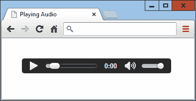
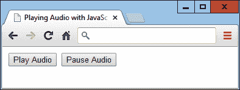
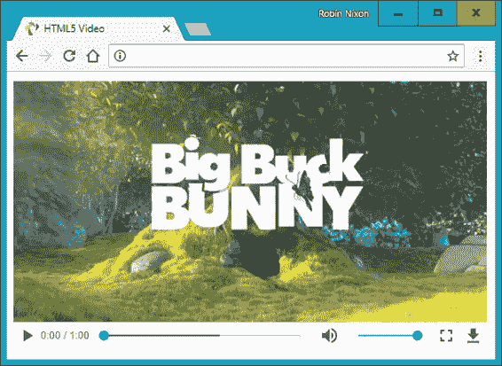
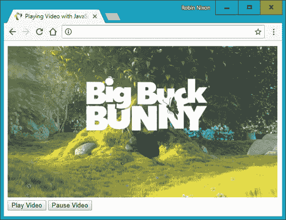

# 第二十七章：HTML5 音频与视频

互联网增长的最大驱动力之一是用户对音频和视频形式的多媒体需求无止境的追求。最初，带宽非常宝贵，几乎没有实时流媒体的概念，下载音频轨道甚至视频可能需要几分钟甚至几小时。

带宽的高昂成本和快速调制解调器的有限可用性推动了更快速、更有效率的压缩算法的发展，例如 MP3 音频和 MPEG 视频，但即使是那时，以合理的时间下载文件的唯一方法也是大幅降低它们的质量。

我早期的一个互联网项目是 1997 年英国的第一个由音乐管理机构授权的在线广播电台。实际上，它更像是一个播客（在这个术语被创造出来之前），因为我们每天制作一个半小时的节目，然后使用最初为电话系统开发的算法将其压缩到 8 位、11 千赫单声道，听起来像电话质量，甚至更差。尽管如此，我们迅速获得了成千上万的听众，他们会下载节目，并在弹出的浏览器窗口中使用插件的方式收听其中讨论的网站。

幸运的是，对于我们和所有发布多媒体内容的人来说，很快就能提供更高的音频和视频质量，但仍需用户下载并安装插件播放器。Flash 成为这些播放器中最受欢迎的，击败了竞争对手如 RealAudio，但由于经常导致浏览器崩溃并要求用户不断升级新版本，它声名狼藉。

因此，普遍认为前进的道路是制定一些支持在浏览器中直接处理多媒体的 web 标准。当然，像微软和谷歌这样的浏览器开发者对这些标准的看法不同，但是当风尘定息时，他们已经同意了所有浏览器应该原生播放的文件类型的一个子集，并将其引入了 HTML5 规范。

最后，只要你把音频和视频编码成几种不同格式，就可以将多媒体上传到 web 服务器，在网页中加入一些 HTML 标签，然后在任何主流桌面浏览器、智能手机或平板设备上播放媒体，用户无需下载插件或做任何其他更改。

# 关于编解码器

术语*编解码器*代表编码器/*解码器*。它描述了软件提供的编解码音频和视频等媒体的功能。在 HTML5 中，根据所使用的浏览器，有多组不同的编解码器可用。

与图形和其他传统网页内容不太相关的音频和视频方面的一个复杂情况是格式和编解码器的许可问题。许多格式和编解码器需付费使用，因为它们是由单个公司或公司联盟开发并选择了专有许可证。一些免费和开源的浏览器由于难以支付费用或者开发者基于原则反对专有许可证，因此不支持最流行的格式和编解码器。由于版权法在不同国家有所不同，并且许可证的执行较难，这些编解码器通常可以在网络上免费获取，但在您所在地可能在技术上是非法使用的。

以下是 HTML5 `<audio>`标签支持的编解码器（也适用于附加到 HTML5 视频的音频）：

<dfn class="keep-together">AAC</dfn>

这种音频编解码器是专有的专利技术，通常使用*.aac*文件扩展名，称为高级音频编码。其 MIME 类型为`audio/aac`。

<dfn class="keep-together">FLAC</dfn>

这种音频编解码器是由 Xiph.Org 基金会开发的自由无损音频编解码器，使用*.flac*扩展名，其 MIME 类型为`audio/flac`。

<dfn class="keep-together">MP3</dfn>

这种音频编解码器称为 MPEG 音频层 3，已经存在多年。尽管这个术语经常（错误地）用来指代任何类型的数字音频，但它是一种专有的专利技术，使用*.mp3*扩展名。其 MIME 类型为`audio/mpeg`。

<dfn class="keep-together">PCM</dfn>

这种音频编解码器称为脉冲编码调制，存储由模拟到数字转换器编码的完整数据，是音频 CD 上数据存储的格式。因为它不使用压缩，被称为*无损*编解码器，其文件通常比 AAC 或 MP3 文件大得多。通常使用*.wav*扩展名。其 MIME 类型为`audio/wav`，但也可能看到`audio/wave`。

<dfn class="keep-together">Vorbis</dfn>

有时被称为 Ogg Vorbis，因为通常使用*.ogg*文件扩展名，这种音频编解码器没有专利限制，无需版税。其 MIME 类型为`audio/ogg`，或者 WebM 容器使用`audio/webm`。

截至 2021 年中期，AAC、MP3、PCM 和 Vorbis 通常受到大多数操作系统和浏览器的支持（不包括微软已停止支持的 Internet Explorer），除了以下与 Safari 相关的异常情况：

Vorbis `audio/ogg`

MacOS 10.11 及更早版本的 Safari 需要 Xiph Quicktime。

Vorbis `audio/webm`

不支持 Safari。

FLAC `audio/ogg`

不支持 Safari（尽管`audio/flac`支持）。

因此，除非您真的有理由使用 Vorbis，否则现在通常安全地仅使用 AAC 或 MP3 进行压缩有损音频，FLAC 进行压缩无损音频，或 PCM 进行未压缩音频。

# <audio>元素

为了适应各种平台，您可以使用多种编解码器记录或转换内容，然后在 `<audio>` 和 `</audio>` 标签内列出它们，例如 示例 27-1。嵌套的 `<source>` 标签包含您希望向浏览器提供的各种媒体。由于提供了 `controls` 属性，结果看起来像 图 27-1。

##### 示例 27-1\. 嵌入三种不同类型的音频文件

```php
<audio controls>
  <source src='audio.m4a' type='audio/aac'>
  <source src='audio.mp3' type='audio/mp3'>
  <source src='audio.ogg' type='audio/ogg'>
</audio>
```



###### 图 27-1\. 播放音频文件

在此示例中，我包含了三种不同的音频类型，因为这是完全可以接受的，如果您希望确保每个浏览器都能找到其首选格式而不仅仅是了解如何处理的一个格式。但是，您可以放弃 MP3 或 AAC 文件中的任何一个（但不能同时放弃），仍然可以确保示例在所有平台上播放。

`<audio>` 元素及其伴侣 `<source>` 标签支持多个属性：

<dfn class="keep-together">`autoplay`</dfn>

导致音频在准备就绪后立即开始播放

<dfn class="keep-together">`controls`</dfn>

导致显示控制面板

<dfn class="keep-together">`loop`</dfn>

设置音频循环播放

<dfn class="keep-together">`preload`</dfn>

导致音频在用户选择播放前即开始加载

<dfn class="keep-together">`src`</dfn>

指定音频文件的源位置

<dfn class="keep-together">`type`</dfn>

指定创建音频时使用的编解码器

如果您不向 `<audio>` 标签提供 `controls` 属性，并且也不使用 `autoplay` 属性，声音将不会播放，用户也无法点击播放按钮开始播放。这将使您不得不像 示例 27-2 中所示的那样，在 JavaScript 中提供此功能（需要额外的加粗显示的代码），以提供播放和暂停音频的功能，如 图 27-2 所示。

##### 示例 27-2\. 使用 JavaScript 播放音频

```php
<!DOCTYPE html>
<html>
  <head>
    <title>Playing Audio with JavaScript</title>
    `<script` `src=``'OSC.js'``>``</script>`
  </head>
  <body>
    <audio `id=``'myaudio'`>
      <source src='audio.m4a' type='audio/aac'>
      <source src='audio.mp3' type='audio/mp3'>
      <source src='audio.ogg' type='audio/ogg'>
    </audio>

    `<button` `onclick=``'playaudio()'``>``Play Audio``</button>`
    `<button` `onclick=``'pauseaudio()'``>``Pause Audio``</button>`

    `<script``>`
      `function` `playaudio``(``)`
      `{`
        `O``(``'myaudio'``)``.``play``(``)`
      `}`
      `function` `pauseaudio``(``)`
      `{`
        `O``(``'myaudio'``)``.``pause``(``)`
      `}`
    </script>
  </body>
</html>
```



###### 图 27-2\. HTML5 音频可以通过 JavaScript 进行控制

当用户点击按钮时，通过调用 `myaudio` 元素的 `play` 或 `pause` 方法来实现。

# `<video>` 元素

在 HTML5 中播放视频与音频非常类似；您只需使用 `<video>` 标签并为您提供的媒体提供 `<source>` 元素即可。 示例 27-3 展示了如何使用三种不同的视频编解码器类型执行此操作，如 图 27-3 所示。

##### 示例 27-3\. 播放 HTML5 视频

```php
<video width='560' height='320' controls>
  <source src='movie.mp4'  type='video/mp4'>
  <source src='movie.webm' type='video/webm'>
  <source src='movie.ogv'  type='video/ogg'>
</video>
```



###### 图 27-3\. 播放 HTML5 视频

## 视频编解码器

与音频类似，多种视频编解码器可供选择，但不同浏览器的支持程度不同。这些编解码器有不同的容器格式，如下所示：

<dfn class="keep-together">MP4</dfn>

作为 MPEG-4 标准的一部分指定的许可受限、多媒体容器格式。其 MIME 类型为 `video/mp4`。

<dfn class="keep-together">Ogg</dfn>

由 Xiph.Org Foundation 维护的免费开放容器格式。Ogg 格式的创建者表示其不受软件专利的限制。其 MIME 类型为 `video/ogg`。

<dfn class="keep-together">WebM</dfn>

一种为 HTML5 视频设计的免版税、开放视频压缩格式。其 MIME 类型为 `video/webm`。

这些可能包含以下视频编解码器之一：

<dfn class="keep-together">H.264 & H.265</dfn>

对最终用户免费播放专利、专有视频编解码器，但对编码和传输过程的所有部分可能会产生版税费用。H.265 在相同质量输出下支持几乎双倍的压缩比 H.264。

<dfn class="keep-together">Theora</dfn>

一种视频编解码器，不受专利的限制且在编码、传输和播放各个层面都不需要版税支付。

<dfn class="keep-together">VP8</dfn>

类似于 Theora 的视频编解码器，由谷歌拥有，并作为开源发布，因此免费使用。

<dfn class="keep-together">VP9</dfn>

与 VP8 类似但更强大，使用一半的比特率。

现在你可以确信几乎所有的现代浏览器都支持这些，但有例外，Theora `video/ogg` 不支持 iOS，而 macOS 早期版本需要 Xiph QuickTime。

因此，如果 iOS 是你的目标平台之一（通常是这样），你可能希望避开使用 Ogg，而可以在所有平台上安全地依赖 MP4 或 WebM，并暂时忘记其他格式。然而，在 Example 27-3 中，我展示了如果你愿意，可以添加所有三种主要视频类型，因为浏览器将选择它偏爱的格式。

`<video>` 元素和相应的 `<source>` 标签支持以下属性：

<dfn class="keep-together">`autoplay`</dfn>

导致视频在准备就绪后立即开始播放

<dfn class="keep-together">`controls`</dfn>

导致显示控制面板

<dfn class="keep-together">`height`</dfn>

指定视频显示的高度

<dfn class="keep-together">`loop`</dfn>

设置视频循环播放

<dfn class="keep-together">`muted`</dfn>

静音音频输出

<dfn class="keep-together">`poster`</dfn>

允许您选择一个图像，在视频播放时显示

<dfn class="keep-together">`preload`</dfn>

导致视频在用户选择播放之前开始加载

<dfn class="keep-together">`src`</dfn>

指定视频文件的源位置

<dfn class="keep-together">`type`</dfn>

指定创建视频时使用的编解码器

<dfn class="keep-together">`width`</dfn>

指定视频显示的宽度

如果您希望从 JavaScript 控制视频播放，可以使用如 示例 27-4 中所示的代码（需要额外的代码部分用粗体标出），其结果显示在 图 27-4 中。

##### 示例 27-4\. 从 JavaScript 控制视频播放

```php
<!DOCTYPE html>
<html>
  <head>
    <title>Playing Video with JavaScript</title>
    `<script` `src=``'OSC.js'``>``</script>`
  </head>
  <body>
    <video `id=``'myvideo'` width='560' height='320'>
      <source src='movie.mp4'  type='video/mp4'>
      <source src='movie.webm' type='video/webm'>
      <source src='movie.ogv'  type='video/ogg'>
    </video><br>

    `<button` `onclick=``'playvideo()'``>``Play Video``</button>`
    `<button` `onclick=``'pausevideo()'``>``Pause Video``</button>`

    `<script``>`
      `function` `playvideo``(``)`
      `{`
        `O``(``'myvideo'``)``.``play``(``)`
      `}`
      `function` `pausevideo``(``)`
      `{`
        `O``(``'myvideo'``)``.``pause``(``)`
      `}`
    </script>
  </body>
</html>
```

此代码与从 JavaScript 控制音频的方式非常相似。只需调用 `myvideo` 对象的 `play` 和/或 `pause` 方法即可播放和暂停视频。



###### 图 27-4\. JavaScript 正在用于控制视频

使用本章中的信息，您将能够在几乎所有浏览器和平台上嵌入任何您喜欢的音频和视频，而不用担心用户是否能够播放。

在接下来的章节中，我将演示许多其他 HTML5 功能的使用，包括地理位置和本地存储。

# 问题

1.  用于将音频和视频插入到 HTML5 文档中的两个 HTML 元素标签是哪两个？

1.  为了确保在所有主要平台上能够播放，您应该提供哪两种压缩的有损音频编解码器（或在其中选择）？

1.  要调用哪些方法来播放和暂停 HTML5 媒体播放？

1.  FLAC 是哪种格式类型？

1.  为了确保在所有主要平台上能够播放，您应该选择哪两种视频编解码器（或在其中选择）？

查看 “第二十七章答案” 中有关这些问题的答案。
