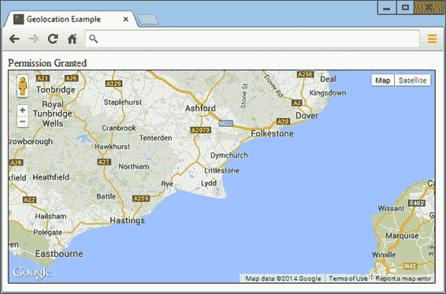
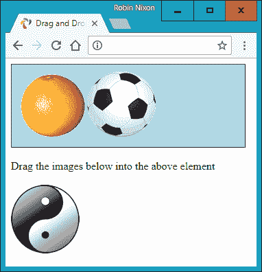
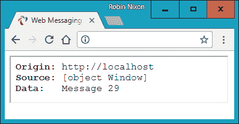

# 第二十八章：其他 HTML5 功能

在 HTML5 的最后一章中，我将解释如何使用地理位置和本地存储，并演示如何在浏览器中进行拖放操作，以及如何设置和使用 Web Workers 并利用跨文档消息传递。

严格来说，大多数这些特性（如 HTML5 的大部分）实际上并不是 HTML 的扩展，因为您是通过 JavaScript 而不是 HTML 标记访问它们。它们只是被浏览器开发人员采纳并被赋予便捷的 HTML5 统称。

这意味着，您需要彻底理解本书中的 JavaScript 教程，才能正确使用它们。话虽如此，一旦掌握了它们，您会想知道在没有这些强大新功能之前，您是如何生活的。

# 地理位置和 GPS 服务

全球定位系统（GPS）服务由多颗围绕地球轨道的卫星组成，它们的位置非常精确。当启用 GPS 的设备连接到这些卫星时，来自各个卫星的信号到达时间的不同，使得设备能够相当精确地确定自己的位置；因为光速（因而是无线电波）是已知的恒定值，信号从卫星到 GPS 设备的传输时间表明卫星的距离。

通过记录来自不同卫星的信号到达时间，这些卫星在任何时候的轨道位置都已精确确定，一个简单的三角测量计算就能让设备相对于卫星的位置精确到几米甚至更少。

许多移动设备，如手机和平板电脑，配备有 GPS 芯片并能提供此信息。但有些设备没有，有些设备已关闭，还有些设备可能在室内使用，被屏蔽了 GPS 卫星信号，因此无法接收任何信号。在这些情况下，可能会使用其他技术来尝试确定设备的位置。

###### 警告

我还要提醒您考虑地理位置信息的隐私影响，特别是如果坐标作为应用程序功能的一部分传输回服务器时。任何具有地理位置功能的应用程序都应有明确的隐私政策。哦，顺便说一句，技术上地理位置信息实际上并不在 HTML5 标准中。事实上，它是由 W3C/WHATWG 定义的独立功能，但大多数人将其视为 HTML5 的一部分。

# 其他定位方法

如果您的设备具有手机硬件但没有 GPS 芯片，它可以尝试通过检查从各种通信塔接收到的信号的时序来三角测量其位置（这些塔可以通信，并且它们的位置非常精确）。如果有几座塔，这几乎可以达到 GPS 定位的精度。但如果只有一座塔，信号强度可以用来确定围绕塔周围的粗略半径，形成的圆表示您可能位于的区域。这可能会将您的位置定位在离实际位置一英里或两英里的范围内，甚至到几十米内。

如果那样还失败了，可能会有 WiFi 接入点的位置在您设备的范围内是已知的，由于所有接入点都有称为媒体访问控制（MAC）地址的唯一标识地址，可以得到您位置的一个合理良好的近似值，也许可以缩小到一两条街道。这就是 Google 街景车辆一直在收集的信息类型（其中一些信息由于可能侵犯数据隐私权而被要求丢弃）。

如果这些方法都失败了，您可以查询并使用您的设备使用的 Internet Protocol（IP）地址作为粗略位置指示器。但通常情况下，这只能提供您的互联网提供商拥有的一个主要交换机的位置，该位置可能有数十甚至数百英里之遥。但至少，您的 IP 地址（通常）可以缩小您所在国家的范围，有时甚至可以缩小到您所在地区。

###### 注意

媒体公司通常使用 IP 地址来限制其内容的播放地域。但是，可以简单地设置使用转发 IP 地址的代理服务器（位于阻止外部访问的领土内），直接将内容通过封锁传递到“外国”浏览器。代理服务器也经常用于伪装用户的真实 IP 地址或绕过审查限制，并可以在 WiFi 热点上共享给许多用户使用。因此，如果通过 IP 地址定位某人，您不能完全确定已经准确识别了正确的位置，甚至国家，应将此信息视为仅作最佳猜测。

# 地理位置和 HTML5

在第二十五章中，我简要介绍了 HTML5 地理位置。现在是时候深入了解它，再次显示在示例 28-1 中。

##### 示例 28-1\. 显示您当前位置的地图

```php
<!DOCTYPE html>
<html>
  <head>
    <title>Geolocation Example</title>
  </head>
  <body>
    <script>
      if (typeof navigator.geolocation == 'undefined')
         alert("Geolocation not supported.")
      else
        navigator.geolocation.getCurrentPosition(granted, denied)

      function granted(position)
      {
        var lat = position.coords.latitude
        var lon = position.coords.longitude

        alert("Permission Granted. You are at location:\n\n"
          + lat + ", " + lon +
          "\n\nClick 'OK' to load Google Maps with your location")

        window.location.replace("https://www.google.com/maps/@"
          + lat + "," + lon + ",8z")
      }

      function denied(error)
      {
        var message

        switch(error.code)
        {
          case 1: message = 'Permission Denied'; break;
          case 2: message = 'Position Unavailable'; break;
          case 3: message = 'Operation Timed Out'; break;
          case 4: message = 'Unknown Error'; break;
        }

        alert("Geolocation Error: " + message)
      }
    </script>
  </body>
</html>

```

让我们浏览这段代码，看看它是如何工作的，从显示标题的`<head>`部分开始。文档的`<body>`完全由 JavaScript 组成，立即开始查询`navigator.geolocation`属性。如果返回的值是`undefined`，则浏览器不支持地理位置，并弹出错误警告窗口。

否则，我们调用属性的`getCurrentPosition`方法，并向其传递两个函数的名称：`granted`和`denied`（请记住，通过仅传递函数名称，我们传递的是实际的函数代码，而不是调用函数的结果，如果函数名称附带括号，则会是后者）：

```php
navigator.geolocation.getCurrentPosition(granted, denied)
```

这些函数稍后在脚本中出现，用于处理提供用户位置数据的两种可能性：`granted`或`denied`。

函数`granted`首先被调用，仅当可以访问数据时才会进入。如果可以访问，变量`lat`和`long`将被赋予浏览器中地理位置例程返回的值。

然后会弹出一个警告窗口，显示有关用户当前位置的详细信息。当用户点击“确定”时，警告窗口将关闭，并且当前网页将被一个指向 Google 地图的网页替换。它通过使用地理位置调用返回的纬度和经度来传递，使用 8 作为缩放设置。您可以通过将`8z`的值更改为另一个数值后跟一个`z`，在`window.location.replace`调用的末尾设置不同的缩放级别。

通过调用`window.location.replace`来实现地图的显示。结果看起来像图 28-1。



###### 图 28-1\. 显示用户位置的交互地图

如果权限被拒绝（或存在其他问题），则由`denied`函数显示错误消息，并弹出自己的警告窗口通知用户错误信息：

```php
switch(error.code)
{
  case 1: message = 'Permission Denied'; break;
  case 2: message = 'Position Unavailable'; break;
  case 3: message = 'Operation Timed Out'; break;
  case 4: message = 'Unknown Error'; break;
}

alert("Geolocation Error: " + message)
```

###### 注

当浏览器从主机请求地理位置数据时，它将提示用户进行授权。用户可以选择授权或拒绝。拒绝授权会导致*权限被拒绝*状态，如果用户授权但主机系统无法确定其位置，则会显示*位置不可用*，而*超时*则发生在用户授权并且主机尝试获取其位置但请求超时的情况。

还有另一种错误情况，即某些平台和浏览器组合允许用户在不授予或拒绝权限的情况下关闭权限请求对话框。这会导致应用程序在等待回调时“挂起”。

在本书的早期版本中，我曾调用 Google Maps API 在网页内直接嵌入地图，但现在该服务需要您自行申请唯一的 API 密钥，并且超过一定使用量可能会产生费用。这就是为什么现在的示例仅生成一个 Google 地图链接。如果您希望在您的网页和应用中嵌入 Google 地图，所有必要的信息都在[网站](https://developers.google.com/maps)上。当然，还有许多其他的地图选项，如[Bing 地图](https://www.bing.com/maps)和[OpenStreetMap](https://www.openstreetmap.org)，它们都有可以访问的 API。

# 本地存储

Cookie 是现代互联网的重要组成部分，因为它们使网站能够在每个用户的机器上保存小段信息，用于跟踪目的。这并不像听起来那么可怕，因为大多数跟踪是帮助网民保存用户名和密码，使他们能够保持登录状态到诸如 Twitter、Facebook 等社交网络的网站上。

Cookie 还可以在本地保存你访问网站的偏好设置（而不是将这些设置存储在网站的服务器上），或者可以用来在电子商务网站上构建订单时跟踪购物车。

但是，它们也可以更积极地用于跟踪你经常访问的网站，并获得你的兴趣画像，以更有效地定向广告。这就是为什么[欧洲联盟](https://tinyurl.com/cookielaweu)现在“要求事先知情同意，以便存储或访问用户终端设备上存储的信息”。

但是，作为一个网页开发者，想象一下在用户设备上保存数据会有多么有用，尤其是如果你的计算服务器和硬盘空间预算有限。例如，你可以创建浏览器内的网页应用程序和服务，用于编辑文字处理文档、电子表格和图像，将所有这些数据保存在用户的计算机上，尽可能降低服务器采购预算。

从用户的角度来看，想象一下本地加载文档比通过网络加载快多少，尤其是在慢速连接下。此外，如果你知道一个网站没有存储你文档的副本，那么安全性会更高。当然，你永远不能保证一个网站或网页应用程序是完全安全的，你也不应该使用可以联网的软件（或硬件）处理高度敏感的文档。但对于像家庭照片这样的最小私密文档，你可能更愿意使用本地保存而不是保存文件到外部服务器的网页应用程序。

## 使用本地存储

使用 Cookie 作为本地存储的最大问题在于，每个 Cookie 最多只能保存 4 KB 的数据。Cookie 还需要在每次页面重新加载时来回传递。并且，除非你的服务器使用传输层安全性（TLS）加密（SSL 的更安全的后继者），否则每次传输 Cookie 时都会明文传输。

但是，有了 HTML5，你可以访问一个更大的本地存储空间（通常每个域名在 5 MB 到 10 MB 之间，具体取决于浏览器），这些数据在页面加载之间和网站访问之间持久存在（甚至在关闭计算机电源并重新开启后仍然存在）。此外，本地存储数据不会在每次页面加载时发送到服务器，并且可以由用户清除，因此你通常希望在服务器上保留数据；否则用户可能会发现他们的数据消失而感到不满，即使是他们自己清除了数据。

本地存储数据通过键/值对处理。键是为引用数据分配的名称，值可以保存任何类型的数据，但保存为字符串。所有数据都是唯一的，限定在当前域内，出于安全原因，由具有不同域的网站创建的任何本地存储都与当前本地存储分开，并且不能被存储数据的域之外的任何域访问。

## localStorage 对象

您可以通过查询其类型来测试是否可以通过`localStorage`对象访问本地存储，如下所示：

```php
if (typeof localStorage == 'undefined')
{
  // Local storage is not available—tell the user and quit.
  // Or maybe offer to save data on the web server instead?
}
```

如果要处理本地存储不可用的情况，这将取决于您打算使用它的方式，因此您放置在`if`语句内的代码将由您决定。

一旦确定本地存储可用，您就可以开始使用`localStorage`对象的`setItem`和`getItem`方法，如下所示：

```php
localStorage.setItem('loc', 'USA')
localStorage.setItem('lan', 'English')
```

要稍后检索此数据，请将键传递给`getItem`方法，如下所示：

```php
loc = localStorage.getItem('loc')
lan = localStorage.getItem('lan')
```

与保存和读取 cookie 不同，您可以在任何时候调用这些方法，而不仅仅是在 Web 服务器发送任何标头之前。保存的值将保留在本地存储中，直到以以下方式擦除：

```php
localStorage.removeItem('loc')
localStorage.removeItem('lan')
```

或者，您可以通过调用`clear`方法彻底清除当前域的本地存储，如下所示：

```php
localStorage.clear()
```

示例 28-2 将前述示例组合到一个单独的文档中，显示当前两个键的值在弹出的警告消息中，最初将为`null`。然后将键和值保存到本地存储中，检索并重新显示，这次分配了值。最后，删除键，然后再次尝试检索这些值，但返回的值再次为`null`。图 28-2 显示这三个警告消息中的第二个。

##### 示例 28-2\. 获取、设置和删除本地存储数据

```php
<!DOCTYPE html>
<html>
  <head>
    <title>Local Storage</title>
  </head>
  <body>
    <script>
      if (typeof localStorage == 'undefined')
      {
        alert("Local storage is not available")
      }
      else
      {
        loc = localStorage.getItem('loc')
        lan = localStorage.getItem('lan')
        alert("The current values of 'loc' and 'lan' are\n\n" +
          loc + " / " + lan + "\n\nClick OK to assign values")

        localStorage.setItem('loc', 'USA')
        localStorage.setItem('lan', 'English')
        loc = localStorage.getItem('loc')
        lan = localStorage.getItem('lan')
        alert("The current values of 'loc' and 'lan' are\n\n" +
          loc + " / " + lan +  "\n\nClick OK to clear values")

        localStorage.removeItem('loc')
        localStorage.removeItem('lan')
        loc = localStorage.getItem('loc')
        lan = localStorage.getItem('lan')
        alert("The current values of 'loc' and 'lan' are\n\n" +
          loc + " / " + lan)
      }
    </script>
  </body>
</html>

```


###### 图 28-2\. 从本地存储中读取两个键及其值

###### 注意

在本地存储中，您可以包含几乎任何和所有数据，并且可以包含多个键/值对，最多达到您域的可用存储限制。

# Web Workers

*Web workers* 运行后台作业，适用于需要长时间计算且不应阻止用户进行其他操作的情况。要使用 web worker，您可以创建 JavaScript 代码段，这些代码将在后台运行。这段代码不必像某些异步系统中的作业那样设置和监控中断。相反，每当它有报告的内容时，您的后台进程通过事件与主 JavaScript 进行通信。

这意味着 JavaScript 解释器决定如何最有效地分配时间片，并且您的代码只需在需要传递信息时与后台任务通信。

示例 28-3 展示了如何设置 Web Worker 在后台执行重复任务，本例中是计算质数。

##### 示例 28-3\. 设置和与 Web Worker 通信

```php
<!DOCTYPE html>
<html>
  <head>
    <title>Web Workers</title>
    <script src='OSC.js'></script>
  </head>
  <body>
    Current highest prime number:
    <span id='result'>0</span>

    <script>
      if (!!window.Worker)
      {
        var worker = new Worker('worker.js')

        worker.onmessage = function (event)
        {
          O('result').innerText = event.data;
        }
      }
      else
      {
        alert("Web workers not supported")
      }
    </script>
  </body>
</html>
```

本例首先在 ID 为 `result` 的 `<span>` 元素中创建一个元素，其中将放置来自 Web Worker 的输出。然后，在 `<script>` 部分，通过 `!!` 连续 `not` 运算符测试 `window.Worker`。如果不是 `true`，则在 `else` 部分显示消息，提示我们 Web Worker 不可用。

否则，程序通过调用 `Worker` 创建一个新的 `worker` 对象，并将文件名 *worker.js* 传递给它。然后，新的 `worker` 对象的 `onmessage` 事件附加到一个匿名函数，该函数将由 *worker.js* 传递的任何消息放入先前创建的 `<span>` 元素的 `innerText` 属性中。

Web Worker 本身保存在文件 *worker.js* 中，其内容显示在 示例 28-4 中。

##### 示例 28-4\. worker.js Web Worker

```php
var n = 1

search: while (true)
{
  n += 1

  for (var i = 2; i <= Math.sqrt(n); i += 1)
  {
    if (n % i == 0) continue search
  }

  postMessage(n)
}
```

该文件将值 `1` 赋给变量 `n`。然后，它连续循环，递增 `n` 并通过测试从 `1` 到 `n` 的平方根的所有值，看它们是否能够完全除尽 `n`，没有余数。如果找到因子，`continue` 命令立即停止暴力攻击，因为该数字不是质数，并从下一个更高的 `n` 值开始处理。

但是，如果测试了所有可能的因子并且没有导致余数为零，`n` 必须是质数，因此其值被传递给 `postMessage`，它将消息发送回设置此 Web Worker 的对象的 `onmessage` 事件。

结果如下所示：

```php
Current highest prime number: 30477191
```

要停止 Web Worker 的运行，可以调用 `worker` 对象的 `terminate` 方法，如下所示：

```php
worker.terminate()
```

###### 注意

如果您希望停止运行此特定示例，可以在浏览器的地址栏中输入以下内容：

```php
javascript:worker.terminate()
```

还请注意，由于 Chrome 处理安全性的方式，您不能在文件系统上使用 Web Worker，只能从 Web 服务器（或在类似 AMPPS 的开发服务器上 *localhost* 运行文件，详见 第 2 章）。

Web Worker 确实有一些安全限制需要注意：

+   Web Worker 在其自己独立的 JavaScript 上下文中运行，并且无法直接访问任何其他执行上下文中的内容，包括主 JavaScript 线程或其他 Web Worker。

+   Web Worker 上下文之间的通信通过 web messaging (`postMessage`) 来完成。

+   因为 Web Workers 无法访问主 JavaScript 上下文，它们无法修改 DOM。Web Workers 可用的唯一 DOM 方法包括 `atob`、`btoa`、`clearInterval`、`clearTimeout`、`dump`、`setInterval` 和 `setTimeout`。

+   Web Workers 受同源策略的限制，因此不能从与原始脚本不同源的位置加载 Web Worker，除非通过跨站方法。

# 拖放

通过设置 `ondragstart`、`ondragover` 和 `ondrop` 事件的事件处理程序，你可以轻松支持在网页上拖放对象，例如 示例 28-5。

##### 示例 28-5\. 拖放对象

```php
<!DOCTYPE HTML>
<html>
  <head>
    <title>Drag and Drop</title>
    <script src='OSC.js'></script>
    <style>
      #dest {
        background:lightblue;
        border    :1px solid #444;
        width     :320px;
        height    :100px;
        padding   :10px;
      }
    </style>
  </head>
  <body>
    <div id='dest' ondrop='drop(event)' ondragover='allow(event)'></div><br>
    Drag the image below into the above element<br><br>

    
    
    

    <script>
      function allow(event)
      {
        event.preventDefault()
      }

      function drag(event)
      {
        event.dataTransfer.setData('image/png', event.target.id)
      }

      function drop(event)
      {
        event.preventDefault()
        var data=event.dataTransfer.getData('image/png')
        event.target.appendChild(O(data))
      }
    </script>
  </body>
</html>
```

在设置了 HTML、提供了标题并加载了 *OSC.js* 文件之后，该文档对 ID 为 `dest` 的 `<div>` 元素进行样式设置，为其设置了背景颜色、边框、固定尺寸和填充。

然后，`<body>` 部分创建了 `<div>` 元素，并将事件处理程序函数 `drop` 和 `allow` 附加到 `<div>` 的 `ondrop` 和 `ondragover` 事件上。之后是一些文本，然后是三个将其 `draggable` 属性设置为 `true` 的图像。每个图像的 `ondragstart` 事件附加了 `drag` 函数。

在 `<script>` 部分，`allow` 事件处理程序函数简单地阻止了拖动的默认操作（即不允许它），而 `drag` 事件处理程序函数调用了事件的 `dataTransfer` 对象的 `setData` 方法，传递了 MIME 类型 `image/png` 和事件的 `target.id`（即被拖动的对象）。`dataTransfer` 对象在拖放操作期间保存被拖动的数据。

最后，`drop` 事件处理程序函数还拦截其默认操作，以便允许拖放，然后从 `dataTransfer` 对象中获取被拖动对象的内容，传递对象的 MIME 类型。然后通过其 `appendChild` 方法将放置的数据附加到目标（即 `dest <div>`）。

如果你自己尝试这个例子，你可以将图像拖放到 `<div>` 元素中，它们将保留在那里，如 图 28-3 所示。这些图像只能拖放到附加了 `drop` 和 `allow` 事件处理程序的元素中，而不能放置到其他位置。



###### 图 28-3\. 已拖放两个图像

你还可以附加其他事件，如 `ondragenter`（当拖动操作进入元素时运行）、`ondragleave`（当离开元素时运行）和 `ondragend`（当拖动操作结束时运行），例如可以在这些操作期间修改光标。

# 跨文档消息

您在前面稍早已经看到消息的使用情况，在 Web Worker 部分。但是由于它并非讨论的核心主题，而且消息仅发布到同一文档，所以我没有详细说明。但出于明显的安全原因，跨文档消息确实需要谨慎使用，因此如果您计划使用它，您需要完全了解其工作原理。

在 HTML5 之前，浏览器开发人员禁止跨文档脚本，但除了阻止潜在的攻击站点外，这还阻止了合法页面之间的通信。任何形式的文档交互通常必须通过 Ajax 和第三方 Web 服务器进行，这很麻烦且难以建立和维护。

但是现在，Web 消息传递允许脚本通过使用一些合理的安全限制在这些边界之间进行交互，以防止恶意黑客攻击。它通过使用`postMessage`方法实现，允许从一个域向另一个域发送纯文本消息，始终在单个浏览器内进行。

这要求 JavaScript 首先获取接收文档的`window`对象，从而允许消息直接发布到与发送文档直接相关的各种其他窗口、框架或 iframe。接收的消息事件具有以下属性：

<dfn class="keep-together">`数据`</dfn>

接收到的消息

<dfn class="keep-together">`来源`</dfn>

发件人文档的来源，包括方案、主机名和端口

<dfn class="keep-together">`源`</dfn>

发送文档的源窗口

发送消息的代码只需一条指令，其中您传递要发送的消息以及应用于其的域，如示例 28-6 中所示。

##### 示例 28-6\. 将 Web 消息发送到 iframe

```php
<!DOCTYPE HTML>
<html>
  <head>
    <title>Web Messaging (a)</title>
    <script src='OSC.js'></script>
  </head>
  <body>
    <iframe id='frame' src='07.html' width='360' height='75'></iframe>

    <script>
      count = 1

      setInterval(function()
      {
        O('frame').contentWindow.postMessage('Message ' + count++, '*')
      }, 1000)
    </script>
  </body>
</html>
```

在这里，通常使用*OSC.js*文件来拉取`O`函数，然后创建一个 ID 为`frame`的`<iframe>`元素，加载示例 28-7 中的内容。然后，在`<script>`部分中，将变量`count`初始化为`1`，并设置每秒重复一次的间隔，以发布字符串`'Message '`（使用`postMessage`方法）以及当前值`count`，然后递增。`postMessage`调用附加到`iframe`对象的`contentWindow`属性，而不是`iframe`对象本身。这很重要，因为 Web 消息要求将帖子发布到窗口，而不是窗口内的对象。

##### 示例 28-7\. 从另一个文档接收消息

```php
<!DOCTYPE HTML>
<html>
  <head>
    <title>Web Messaging (b)</title>
    <style>
      #output {
        font-family:"Courier New";
        white-space:pre;
      }
    </style>
    <script src='OSC.js'></script>
  </head>
  <body>
    <div id='output'>Received messages will display here</div>

    <script>
      window.onmessage = function(event)
      {
        O('output').innerHTML =
          '<b>Origin:</b> ' + event.origin + '<br>' +
          '<b>Source:</b> ' + event.source + '<br>' +
          '<b>Data:</b>   ' + event.data
      }
    </script>
  </body>
</html>
```

这个例子设置了一些样式，使输出更清晰，然后创建了一个 ID 为 `output` 的 `<div>` 元素，在其中接收到的消息内容将被放置。 `<script>` 部分包含一个附加到窗口 `onmessage` 事件的单个匿名函数。在此函数中，显示了 `event.origin`、`event.source` 和 `event.data` 属性值，如 Figure 28-4 所示。



###### 图 28-4\. iframe 到目前为止已接收到 29 条消息

Web 消息传递只能跨域工作，因此您不能通过从文件系统加载文件来测试它；您必须使用 web 服务器（例如在 Chapter 2 建议的 AMPPS 堆栈）。正如您从 Figure 28-4 可以看到的那样，来源是 *http://localhost*，因为这些示例正在本地开发服务器上运行。源是 `window` 对象，当前消息的值是 `Message 29`。

要自己运行这个程序，只需将 *06.html* 加载到浏览器中，使用 `localhost://` 而不是文件系统，它将与 *07.html* 进行通信，而无需您加载它，因为它被插入到一个 iframe 中。

目前，Example 28-6 完全不安全，因为传递给 `postMessage` 的域值是通配符 `*`：

```php
O('frame').contentWindow.postMessage('Message ' + count++, `'*'`)
```

要将消息仅定向到源自特定域的文档，您可以更改此参数。在当前情况下，值为 `http://localhost` 将确保只有从本地服务器加载的文档会接收到任何消息：

```php
O('frame').contentWindow.postMessage('Message ' + count++, `'http://localhost'`)
```

同样地，作为它目前的状态，监听程序显示接收到的任何和所有消息。这也不是非常安全的状态，因为浏览器中还存在恶意文档，它们可能试图发送消息，而不经意的文档中的监听器代码可能会访问这些消息。因此，您可以通过使用 `if` 语句限制监听器对消息的反应，就像这样：

```php
window.onmessage = function(event)
{
  `if` `(``event``.``origin``)` `==` `'http://localhost'``)`
  `{`
    O('output').innerHTML =
      '<b>Origin:</b> ' + event.origin + '<br>' +
      '<b>Source:</b> ' + event.source + '<br>' +
      '<b>Data:</b>   ' + event.data
  `}`
}
```

###### 警告

如果您始终使用站点的正确域，您的网络消息通信将更加安全。但是，请注意，由于消息是明文发送的，某些浏览器或浏览器插件可能存在不安全因素，这可能使此类通信不安全。因此，提高安全性的一种方法是为所有网络消息使用加密方案，并考虑引入双向通信协议以验证每条消息的真实性。

通常情况下，您不会向用户警告 `origin` 或 `source` 值，并且仅将它们用于安全检查。然而，这些例子显示这些值，以帮助您实验网络消息并了解正在发生的事情。除了使用 iframe 外，弹出窗口和其他标签页中的文档也可以使用此方法相互通信。

# 其他 HTML5 标签

多个其他新的 HTML5 标签正在主要浏览器中得到采纳，包括`<article>`、`<aside>`、`<details>`、`<figcaption>`、`<figure>`、`<footer>`、`<header>`、`<hgroup>`、`<mark>`、`<menuitem>`、`<meter>`、`<nav>`、`<output>`、`<progress>`、`<rp>`、`<rt>`、`<ruby>`、`<section>`、`<summary>`、`<time>`和`<wbr>`。您可以从[eastmanreference.com](https://tinyurl.com/htmltaglist)获取更多关于这些和所有其他 HTML5 标签的信息。

这就是您对 HTML5 的介绍。现在您拥有了多个强大的新功能，可以用来创建更加动态和引人入胜的网站。在最后一章中，我将向您展示如何将本书中的所有不同技术结合起来，创建一个迷你社交网络站点。

# 问题

1.  您调用哪个方法来请求 Web 浏览器的地理位置数据？

1.  如何确定浏览器是否支持本地存储？

1.  您可以调用哪个方法来清除当前域的所有本地存储数据？

1.  Web 工作者与主程序进行通信的最佳方式是什么？

1.  如何停止 Web 工作者的运行？

1.  要支持拖放操作，如何防止默认操作禁止这些事件的拖放？

1.  如何使跨文档消息传递更安全？

请参阅“第二十八章答案”位于附录 A 获取这些问题的答案。
