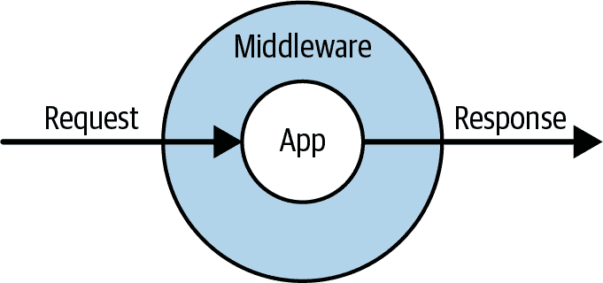

# 第十章：请求、响应和中间件

我们已经谈论过 Illuminate `Request`对象了。例如，在第三章中，您看到如何在构造函数中使用类型提示来获取实例或使用`request()`助手来检索它，在第七章中我们讨论了如何使用它来获取关于用户输入的信息。

在本章中，您将了解更多关于`Request`对象的信息，它是如何生成的，代表什么以及它在应用程序生命周期中扮演的角色。我们还将讨论`Response`对象以及 Laravel 对中间件模式的实现。

# Laravel 的请求生命周期

每个进入 Laravel 应用程序的请求，无论是由 HTTP 请求还是命令行交互生成的，都会立即转换为 Illuminate `Request`对象，然后跨越许多层并最终被应用程序本身解析。然后应用程序生成一个 Illuminate `Response`对象，该对象通过这些层级返回并最终返回给最终用户。

此请求/响应生命周期见图 10-1。让我们看看如何实现每一个步骤，从第一行代码到最后。



###### 图 10-1\. 请求/响应生命周期

## 引导应用程序

每个 Laravel 应用程序都在 Web 服务器级别设置了某种形式的配置，在 Apache 的*.htaccess*文件或 Nginx 配置设置或类似的地方捕获每个 Web 请求，无论 URL 如何，并将其路由到 Laravel 应用程序目录中的*public/index.php*。

*index.php*实际上并没有那么多代码。它有三个主要功能。

首先，它加载 Composer 的自动加载文件，注册所有由 Composer 加载的依赖项。

接下来，它启动 Laravel 的引导过程，创建应用程序容器（您将在第十一章中了解更多关于容器的信息），并注册一些核心服务（包括内核，我们马上会谈到）。

最后，它创建内核的一个实例，创建代表当前用户 Web 请求的请求，并将请求传递给内核进行处理。内核响应一个 Illuminate `Response`对象，*index.php*将其返回给最终用户。然后，内核终止页面请求。

内核是每个 Laravel 应用程序的核心路由器，负责接收用户请求，通过中间件处理它，处理异常并将其传递给页面路由器，然后返回最终响应。实际上，有两个内核，但每个页面请求只使用一个。一个路由器处理 Web 请求（HTTP 内核），另一个处理控制台、定时任务和 Artisan 请求（控制台内核）。每个都有一个`handle()`方法，负责接收 Illuminate `Request`对象并返回 Illuminate `Response`对象。

内核运行所有在每个请求之前需要运行的引导，包括确定当前请求运行的环境（测试、本地、生产等），以及运行所有服务提供商。HTTP 内核还定义了将包装每个请求的中间件列表，包括负责会话和 CSRF 保护的核心中间件。

## 服务提供商

尽管这些引导中有一些过程性代码，几乎所有 Laravel 的引导代码都被分离到 Laravel 称为*服务提供商*的东西中。服务提供商是一个类，封装了各个应用程序部分需要运行的逻辑，以引导它们的核心功能。

例如，有一个`AuthServiceProvider`，它引导所有 Laravel 认证系统所需的注册，并且有一个`RouteServiceProvider`，它引导路由系统。

服务提供商的概念一开始可能有点难以理解，所以可以这样考虑：你的应用程序中的许多组件都有引导代码，需要在应用程序初始化时运行。服务提供商是将这些引导代码分组到相关类中的工具。如果你有任何需要在应用程序代码正常工作之前运行的代码，它就是服务提供商的一个强力候选者。

例如，如果你发现你正在开发的功能需要在容器中注册一些类（你将在第十一章中了解更多），你会为该功能创建一个专门的服务提供商。你可能会有一个`GitHubServiceProvider`或`MailerServiceProvider`。

服务提供商有两个重要的方法：`boot()` 和 `register()`。还有一个你可能选择使用的`DeferrableProvider`接口。这里是它们的工作原理。

其次会调用所有服务提供商的`boot()`方法。现在你可以在这里做任何其他引导，比如绑定事件监听器或定义路由——任何依赖于整个 Laravel 应用程序已经引导的东西。

首先会调用所有服务提供商的`register()`方法。在这里，你可以将类和别名绑定到容器中。不要在`register()`中做任何依赖于整个应用程序已经引导的事情。

如果你的服务提供者只会在容器中注册绑定（即教会容器如何解析给定的类或接口），而不执行任何其他引导操作，你可以“延迟”它们的注册，这意味着它们不会运行，除非显式从容器请求它们的绑定。这可以加快应用程序的平均引导时间。

如果你想延迟你的服务提供者的注册，首先要实现 `Illuminate\Contracts\Support\DeferrableProvider` 接口；然后，给服务提供者一个 `provides()` 方法，返回该提供者提供的绑定列表，如示例 10-1 所示。

##### 示例 10-1\. 延迟服务提供者的注册

```php
...
use Illuminate\Contracts\Support\DeferrableProvider;

class GitHubServiceProvider extends ServiceProvider implements DeferrableProvider
{
    public function provides()
    {
        return [
            GitHubClient::class,
        ];
    }
```

# 服务提供者的更多用途

服务提供者还有一套方法和配置选项，可以在作为 Composer 包的一部分发布时为最终用户提供高级功能。查看[Laravel 源](https://oreil.ly/uHhap)中的服务提供者定义，了解更多信息。

现在我们已经涵盖了应用程序引导，让我们来看看 `Request` 对象，这是引导过程中最重要的输出。

# 请求对象

`Illuminate\Http\Request` 类是 Laravel 特有的 Symfony `HttpFoundation` 的扩展。

# Symfony HttpFoundation

Symfony 的 `HttpFoundation` 类组件几乎支持目前所有的 PHP 框架；这是 PHP 中表示 HTTP 请求、响应、头部、Cookie 等的最流行和强大的抽象集合。

`Request` 对象旨在表示你可能关心的用户 HTTP 请求的每个相关信息。

在原生 PHP 代码中，你可能会发现自己查看 `$_SERVER`、`$_GET`、`$_POST` 等全局变量和处理逻辑的组合，以获取关于当前用户请求的信息。用户上传了哪些文件？他们的 IP 地址是什么？他们提交了哪些字段？所有这些信息都分散在语言和代码中，这使得理解起来困难，而模拟起来更加困难。

Symfony 的 `Request` 对象将所有表示单个 HTTP 请求所需的信息集成到一个对象中，并添加了便捷方法来轻松获取有用的信息。Illuminate 的 `Request` 对象增加了更多便捷方法，用于获取它所代表的请求的信息。

# 捕获请求

在 Laravel 应用中，你几乎不太可能需要这样做，但如果你需要直接从 PHP 的全局变量中捕获自己的 Illuminate `Request` 对象，你可以使用 `capture()` 方法：

```php
$request = Illuminate\Http\Request::capture();
```

## 在 Laravel 中获取请求对象

Laravel 为每个请求创建一个内部的 `Request` 对象，你可以通过几种方式来访问它。

首先—再次强调，我们将在第十一章中更详细地介绍—您可以在任何由容器解析的构造函数或方法中对类进行类型提示。这意味着您可以在控制器方法或服务提供程序中进行类型提示，就像在示例 10-2 中看到的那样。

##### 示例 10-2\. 在容器解析的方法中对类进行类型提示以接收`Request`对象

```php
...
use Illuminate\Http\Request;

class PersonController extends Controller
{
    public function index(Request $request)
    {
        $allInput = $request->all();
    }
```

或者，您可以使用`request()`全局助手，允许您在其上调用方法（例如，`request()->input()`），也允许您单独调用它以获取`$request`的实例：

```php
$request = request();
$allInput = $request->all();
// or
$allInput = request()->all();
```

最后，您可以使用`app()`全局方法来获取`Request`的实例。您可以传递完全限定的类名或简写`request`：

```php
$request = app(Illuminate\Http\Request::class);
$request = app('request');
```

## 获取请求的基本信息

现在您知道如何获取`Request`的实例了，您可以做些什么呢？`Request`对象的主要目的是表示当前的 HTTP 请求，因此`Request`类提供的主要功能是轻松获取有关当前请求的有用信息。

我已经将这里描述的方法分类，但请注意分类之间肯定存在重叠，并且分类有点随意—例如，查询参数可以与“用户和请求状态”一样轻松地出现在“基本用户输入”中。希望这些分类能让您轻松了解可用内容，然后您可以丢弃这些分类。

还要注意，`Request`对象上还有许多其他可用的方法；这些只是最常用的方法。

### 基本用户输入

基本用户输入方法使得获取用户显式提供的信息变得简单—通常通过提交表单或 Ajax 组件。在这里提到“用户提供的输入”时，我指的是来自查询字符串（`GET`）、表单提交（`POST`）或 JSON 的输入。基本用户输入方法包括以下内容：

`all()`

返回所有用户提供的输入的数组。

`input(*fieldName*)`

返回单个用户提供的输入字段的值。

`only(*fieldName*|[*array,of,field,names*])`

返回指定字段名（们）的所有用户提供的输入的数组。

`except(*fieldName*|[*array,of,field,names*])`

返回除指定字段名（们）外的所有用户提供的输入的数组。

`exists(*fieldName*)`

返回一个布尔值，指示输入中是否存在指定字段。`has()`是其别名。在输入中存在指定字段时执行给定的回调。

`filled(*fieldName*)`

返回一个布尔值，指示输入中是否存在指定字段并且不为空（即具有值）。

`whenFilled()`

在输入中存在指定字段并且不为空（即具有值）时执行给定的回调。

`json()`

如果页面收到了 JSON，则返回一个`ParameterBag`。

`boolean(*fieldName*)`

将输入的值作为布尔值返回。将字符串和整数转换为适当的布尔值（使用 `FILTER_VALIDATE_BOOLEAN`）。如果请求中不存在键，则返回 `false`。

`json(*keyName*)`

返回从发送到页面的 JSON 中给定键的值。

示例 10-3 提供了如何使用请求中提供的用户信息方法的几个快速示例。

##### 示例 10-3\. 从请求获取基本用户提供的信息

```php
// form
<form method="POST" action="/form">
    @csrf
    <input name="name"> Name<br>
    <input type="submit">
</form>
```

```php
// Route receiving the form
Route::post('form', function (Request $request) {
    echo 'name is ' . $request->input('name') . '<br>';
    echo 'all input is ' . print_r($request->all()) . '<br>';
    echo 'user provided email address: ' . $request->has('email') ? 'true' : 'false';
});
```

### 用户和请求状态

用户和请求状态方法包括通过表单未显式提供的输入：

`method()`

返回用于访问此路由的方法（`GET`、`POST`、`PATCH` 等）。

`path()`

返回用于访问此页面的路径（不包括域名）；例如，`'http://www.myapp.com/abc/def'` 将返回 `'abc/def'`。

`url()`

返回用于访问此页面的带域名的 URL；例如，`'abc'` 将返回 `'http://www.myapp.com/abc'`。

`is()`

返回布尔值，指示当前页面请求是否与提供的字符串模糊匹配（例如，`/a/b/c` 将被 `$request->is('*b*')` 匹配，其中 `*` 表示任意字符）；使用在 `Str::is()` 中找到的自定义正则表达式解析器。

`ip()`

返回用户的 IP 地址。

`header()`

返回标题数组（例如 `['accept-language' => ['⁠e⁠n⁠-⁠U⁠S⁠,⁠e⁠n⁠;​q⁠=⁠0⁠.⁠8⁠']]`），或者如果作为参数传递了标题名称，则只返回该标题。

`server()`

返回传统存储在 `$_SERVER` 中的变量数组（例如 `REMOTE_ADDR`），或者如果传递了 `$_SERVER` 变量名称，则只返回该值。

`secure()`

返回指示此页面是否使用 HTTPS 加载的布尔值。

`pjax()`

返回指示此页面请求是否使用了 Pjax 加载的布尔值。

`wantsJson()`

返回指示此请求的 `Accept` 头中是否有任何 `/json` 内容类型的布尔值。

`isJson()`

返回指示此页面请求的 `Content-Type` 头中是否有任何 `/json` 内容类型的布尔值。

`accepts()`

返回指示此页面请求是否接受给定内容类型的布尔值。

### 文件

到目前为止，我们讨论的所有输入都是显式的（通过诸如 `all()`、`input()` 等方法检索），或者由浏览器或引用站点定义（通过诸如 `pjax()` 等方法检索）。文件输入类似于显式用户输入，但处理方式有很大不同：

`file()`

返回所有已上传文件的数组，或者如果传递了键（文件上传字段名称），则仅返回一个文件。

`allFiles()`

返回所有已上传文件的数组；与 `file()` 相比，命名更清晰，非常有用。

`hasFile()`

返回指定键是否上传了文件的布尔值。

每个上传的文件都将是 `Symfony\Component\HttpFoundation\File\UploadedFile` 的实例，提供一套工具来验证、处理和存储上传的文件。

请查看 Chapter 14 获取有关如何处理上传文件的更多示例。

### 持久性

请求还可以提供与会话交互的功能。大多数会话功能存放在其他位置，但有几个方法对当前页面请求特别相关：

`flash()`

将当前请求的用户输入闪存到会话中以供稍后检索，这意味着它保存到会话中，但在下一个请求后消失。

`flashOnly()`

为提供的数组中的任何键闪存当前请求的用户输入。

`flashExcept()`

闪存当前请求的用户输入，除了提供的数组中的任何键。

`old()`

返回所有先前闪存的用户输入的数组，或者如果传递了键，则返回先前闪存的该键的值。

`flush()`

清除所有先前闪存的用户输入。

`cookie()`

从请求中检索所有 cookie，或者如果提供了键，则仅检索该 cookie。

`hasCookie()`

返回一个布尔值，指示请求是否具有给定键的 cookie。

`flash*()` 和 `old()` 方法用于存储用户输入，并在稍后检索它，通常在输入经过验证并被拒绝后。

# 响应对象

类似于 `Request` 对象，还有一个 Illuminate `Response` 对象，表示您的应用程序发送给最终用户的响应，包括标头、cookie、内容和用于发送最终用户浏览器的页面渲染指令的任何其他内容。

就像 `Request` 一样，`Illuminate\Http\Response` 类扩展了 Symfony 类：`Symfony\Component\HttpFoundation\Response`。这是一个基类，具有一系列属性和方法，使得表示和呈现响应成为可能；Illuminate 的 `Response` 类通过一些有用的快捷方式对其进行装饰。

## 在控制器中使用和创建响应对象

在谈论如何自定义您的 `Response` 对象之前，让我们退后一步，看看我们最常用的 `Response` 对象的工作方式。

最终，从路由定义返回的任何 `Response` 对象都将转换为 HTTP 响应。它可以定义特定的标头或特定的内容，设置 cookie 或其他任何内容，但最终它将转换为用户浏览器可以解析的响应。

让我们看一下最简单的响应，例如 Example 10-4。

##### 示例 10-4\. 最简单的可能的 HTTP 响应

```php
Route::get('route', function () {
    return new Illuminate\Http\Response('Hello!');
});

// Same, using global function:
Route::get('route', function () {
    return response('Hello!');
});
```

我们创建一个响应，为其提供一些核心数据，然后返回它。我们还可以自定义 HTTP 状态、标头、cookie 等等，例如 Example 10-5。

##### 示例 10-5\. 具有自定义状态和标头的简单 HTTP 响应

```php
Route::get('route', function () {
    return response('Error!', 400)
        ->header('X-Header-Name', 'header-value')
        ->cookie('cookie-name', 'cookie-value');
});
```

### 设置标头

我们通过使用 `header()` 流畅方法在响应上定义一个标头，例如在 Example 10-5。第一个参数是标头名称，第二个是标头值。

### 添加 cookie

如果需要的话，我们还可以直接在`Response`对象上设置 Cookie。我们将在第 14 章更详细地讨论 Laravel 的 Cookie 处理，但你可以查看示例 10-6 了解如何将 Cookie 附加到响应中的简单用例。

##### 示例 10-6\. 将 Cookie 附加到响应

```php
    return response($content)
        ->cookie('signup_dismissed', true);
```

## 专用响应类型

还有一些专门用于视图、下载、文件和 JSON 的特殊响应类型。每种都是预定义的宏，可以轻松重用特定的头部或内容结构模板。

### 查看响应

在第 3 章中，我使用全局的`view()`助手展示如何返回模板，例如`view('*view.name.here*')`或类似的内容。但如果在返回视图时需要自定义头部、HTTP 状态或其他内容，可以使用`view()`响应类型，如示例 10-7 所示。

##### 示例 10-7\. 使用`view()`响应类型

```php
Route::get('/', function (XmlGetterService $xml) {
    $data = $xml->get();
    return response()
        ->view('xml-structure', $data)
        ->header('Content-Type', 'text/xml');
});
```

### 下载响应

有时候你希望应用程序强制用户的浏览器下载一个文件，无论是在 Laravel 中创建文件还是从数据库或受保护的位置提供文件。使用`download()`响应类型可以轻松实现这一点。

必需的第一个参数是要浏览器下载的文件路径。如果是生成的文件，你需要将其暂时保存在某个地方。

可选的第二个参数是下载文件的文件名（例如，*export.csv*）。如果你不在这里传递一个字符串，文件名将会自动生成。可选的第三个参数允许你传递一个头部数组。示例 10-8 展示了使用`download()`响应类型的例子。

##### 示例 10-8\. 使用`download()`响应类型

```php
public function export()
{
    return response()
        ->download('file.csv', 'export.csv', ['header' => 'value']);
}

public function otherExport()
{
    return response()->download('file.pdf');
}
```

如果希望在返回下载响应后从磁盘删除原始文件，可以在`download()`方法后链式调用`deleteFileAfterSend()`方法：

```php
public function export()
{
    return response()
        ->download('file.csv', 'export.csv')
        ->deleteFileAfterSend();
}
```

### 文件响应

文件响应类似于下载响应，不同之处在于它允许浏览器显示文件而不是强制下载。这在处理图片和 PDF 文件时最常见。

必需的第一个参数是文件名，可选的第二个参数可以是头部数组（参见示例 10-9）。

##### 示例 10-9\. 使用`file()`响应类型

```php
public function invoice($id)
{
    return response()->file("./invoices/{$id}.pdf", ['header' => 'value']);
}
```

### JSON 响应

JSON 响应非常常见，尽管编程起来并不是特别复杂，但也有一个定制的响应类型。

JSON 响应将传递的数据转换为 JSON（使用`json_encode()`），并将`Content-Type`设置为`application/json`。你还可以选择使用`setCallback()`方法创建一个 JSONP 响应而不是 JSON，如示例 10-10 所示。

##### 示例 10-10\. 使用`json()`响应类型

```php
public function contacts()
{
    return response()->json(Contact::all());
}

public function jsonpContacts(Request $request)
{
    return response()
        ->json(Contact::all())
        ->setCallback($request->input('callback'));
}

public function nonEloquentContacts()
{
    return response()->json(['Tom', 'Jerry']);
}
```

### 重定向响应

重定向不常在`response()`辅助函数中调用，因此它们与我们已经讨论过的其他自定义响应类型有所不同，但它们仍然只是另一种响应。从 Laravel 路由返回的重定向会向用户发送一个重定向（通常是 301），将其导向另一个页面或返回到上一页。

你技术上*可以*从`response()`中调用重定向，例如`return response()->redirectTo('/')`。但更常见的做法是使用专门的全局辅助函数。

有一个全局的`redirect()`函数，用于创建重定向响应，还有一个全局的`back()`函数，是`redirect()->back()`的快捷方式。

就像大多数全局辅助函数一样，`redirect()`全局函数可以传递参数，也可以用来获取其类的实例，然后链式调用方法。如果不链式调用，而只是传递参数，`redirect()`的行为与`redirect()->to()`相同；它接受一个字符串并重定向到该字符串的 URL。示例 10-11 展示了其使用示例。

##### 示例 10-11\. 使用`redirect()`全局辅助函数的示例

```php
return redirect('account/payment');
return redirect()->to('account/payment');
return redirect()->route('account.payment');
return redirect()->action('AccountController@showPayment');

// If redirecting to an external domain
return redirect()->away('https://tighten.co');

// If named route or controller needs parameters
return redirect()->route('contacts.edit', ['id' => 15]);
return redirect()->action('ContactController@edit', ['id' => 15]);
```

当处理和验证用户输入时，你也可以“返回”到上一页，这在验证上下文中特别有用。示例 10-12 展示了验证上下文中的常见模式。

##### 示例 10-12\. 带有输入的回跳重定向

```php
public function store()
{
    // If validation fails...
    return back()->withInput();
}
```

最后，你可以同时重定向并向会话闪存数据。这在处理错误和成功消息时很常见，例如示例 10-13。

##### 示例 10-13\. 带有闪存数据的重定向

```php
Route::post('contacts', function () {
    // Store the contact

    return redirect('dashboard')->with('message', 'Contact created!');
});

Route::get('dashboard', function () {
    // Get the flashed data from session--usually handled in Blade template
    echo session('message');
});
```

### 自定义响应宏

你也可以使用*宏*创建自己的自定义响应类型。这允许你定义要对响应及其提供的内容进行的一系列修改。

让我们重新创建`json()`自定义响应类型，只是为了看看它是如何工作的。如常，你应该为这类绑定创建一个自定义服务提供者，但现在我们暂时将其放在`AppServiceProvider`中，如示例 10-14 所示。

##### 示例 10-14\. 创建一个自定义响应宏

```php
...
class AppServiceProvider
{
    public function boot()
    {
        Response::macro('myJson', function ($content) {
            return response(json_encode($content))
                ->withHeaders(['Content-Type' => 'application/json']);
        });
    }
```

然后，我们可以像使用预定义的`json()`宏一样使用它：

```php
return response()->myJson(['name' => 'Sangeetha']);
```

这将返回一个带有数组主体的 JSON 编码响应，带有适当的 JSON 类型的`Content-Type`头。

### 负责任接口

如果你想要自定义如何发送响应，而宏提供的空间或组织不够，或者你希望你的对象能够根据自己的显示逻辑作为“响应”返回，那么`Responsable`接口适合你。

`Responsable`接口，`Illuminate\Contracts\Support\Responsable`，规定其实现类必须有一个`toResponse()`方法。这需要返回一个 Illuminate `Response`对象。示例 10-15 说明了如何创建一个`Responsable`对象。

##### 示例 10-15\. 创建一个简单的`Responsable`对象

```php
...
use Illuminate\Contracts\Support\Responsable;

class MyJson implements Responsable
{
    public function __construct($content)
    {
        $this->content = $content;
    }

    public function toResponse()
    {
        return response(json_encode($this->content))
            ->withHeaders(['Content-Type' => 'application/json']);
    }
```

然后，我们可以像使用我们自定义的宏一样使用它：

```php
return new MyJson(['name' => 'Sangeetha']);
```

相对于之前介绍的响应宏，这可能看起来需要做很多工作。但是在处理更复杂的控制器操作时，`Responsable`接口真正发挥作用。一个常见的例子是使用它来创建视图模型（或视图对象），就像在示例 10-16 中。

##### 示例 10-16\. 使用`Responsable`创建视图对象

```php
...
use Illuminate\Contracts\Support\Responsable;

class GroupDonationDashboard implements Responsable
{
    public function __construct($group)
    {
        $this->group = $group;
    }

    public function budgetThisYear()
    {
        // ...
    }

    public function giftsThisYear()
    {
        // ...
    }

    public function toResponse()
    {
        return view('groups.dashboard')
            ->with('annual_budget', $this->budgetThisYear())
            ->with('annual_gifts_received', $this->giftsThisYear());
    }
```

在这种情况下，将复杂的视图准备工作移到一个专用的、*可测试*的对象中，并保持控制器的简洁，这开始变得更有意义。以下是使用那个`Responsable`对象的控制器：

```php
...
class GroupController
{
    public function index(Group $group)
    {
        return new GroupDonationsDashboard($group);
    }
```

# Laravel 和中间件

回顾一下图 10-1，这是本章的开头。

我们已经讨论了请求和响应，但实际上还没有深入了解中间件是什么。您可能已经熟悉中间件，这不是 Laravel 独有的，而是一种广泛使用的架构模式。

## 中间件简介

中间件的概念是，有一系列层包裹在您的应用程序周围，就像一个多层蛋糕或洋葱[¹]一样。正如图 10-1 所示，每个请求在进入应用程序时都会经过每个中间件层，然后生成的响应在发送给最终用户之前也会经过中间件层。

中间件通常被视为与应用程序逻辑分离的部分，并且通常设计为理论上适用于任何应用程序，而不仅限于您目前正在开发的应用程序。

中间件可以检查请求并根据其内容装饰或拒绝它。这意味着中间件非常适合像速率限制这样的用例：它们可以检查 IP 地址，查看在最后一分钟内访问此资源的次数，并在超过阈值时返回状态码 429（请求过多）。

因为中间件也可以在应用程序发送响应时访问响应，所以非常适合装饰响应。例如，Laravel 使用中间件将给定请求/响应周期中排队的所有 cookie 添加到响应中，然后再发送给最终用户。

但中间件最强大的用途之一来自于它们几乎可以是请求/响应周期中*第一*和*最后*的交互对象。这使得中间件非常适合像启用会话这样的功能——PHP 需要您尽早打开会话并在很晚时候关闭会话，而中间件也非常适合这种用途。

## 创建自定义中间件

假设我们希望有一个中间件，它拒绝使用`DELETE` HTTP 方法的每个请求，并在每个请求返回时发送一个 cookie。

有一个 Artisan 命令用于创建自定义中间件。让我们试试看：

```php
php artisan make:middleware BanDeleteMethod
```

您现在可以打开*app/Http/Middleware/BanDeleteMethod.php*文件。默认内容如示例 10-17 所示。

##### 示例 10-17\. 默认中间件内容

```php
...
class BanDeleteMethod
{
    public function handle($request, Closure $next)
    {
        return $next($request);
    }
}
```

这个 `handle()` 方法如何表示处理传入请求 *和* 传出响应是最难理解的中间件方面，所以让我们逐步来看一下。

### 理解中间件的 `handle()` 方法

首先，要记住中间件是层层叠加的，最后叠加在应用程序之上。注册的第一个中间件在请求进入时最先访问，然后请求依次传递给每个其他中间件，然后到达应用程序。然后通过中间件传递生成的响应，最后第一个中间件在响应输出时再次访问。

假设我们已将 `BanDeleteMethod` 注册为第一个运行的中间件。这意味着进入它的 `$request` 是原始请求，没有任何其他中间件的篡改。现在呢？

将该请求传递给 `$next()` 意味着将其传递给其余的中间件。`$next()` 闭包只是将该 `$request` 传递给堆栈中下一个中间件的 `handle()` 方法。然后它会一直传递到没有更多中间件可传递时，并最终到达应用程序。

接下来，响应是如何出来的？这可能比较难理解。应用程序返回一个响应，它通过中间件链返回上来——因为每个中间件都返回它的响应。因此，在同一个 `handle()` 方法中，中间件可以修饰 `$request` 并将其传递给 `$next()` 闭包，然后可以选择在最终将该输出返回给最终用户之前对接收到的输出做一些处理。让我们看一些伪代码来澄清这一点（参见 Example 10-18）。

##### 示例 10-18\. 解释中间件调用过程的伪代码

```php
...
class BanDeleteMethod
{
    public function handle($request, Closure $next)
    {
        // At this point, $request is the raw request from the user.
        // Let's do something with it, just for fun.
        if ($request->ip() === '192.168.1.1') {
            return response('BANNED IP ADDRESS!', 403);
        }

        // Now we've decided to accept it. Let's pass it on to the next
        // middleware in the stack. We pass it to $next(), and what is
        // returned is the response after the $request has been passed
        // down the stack of middleware to the application and the
        // application's response has been passed back up the stack.
        $response = $next($request);

        // At this point, we can once again interact with the response
        // just before it is returned to the user
        $response->cookie('visited-our-site', true);

        // Finally, we can release this response to the end user
        return $response;
    }
}
```

最后，让我们确保中间件实现我们实际承诺的功能（参见 Example 10-19）。

##### 示例 10-19\. 禁止 `DELETE` 方法的示例中间件

```php
...
class BanDeleteMethod
{
    public function handle($request, Closure $next)
    {
        // Test for the DELETE method
        if ($request->method() === 'DELETE') {
            return response(
                "Get out of here with that delete method",
                405
            );
        }

        $response = $next($request);

        // Assign cookie
        $response->cookie('visited-our-site', true);

        // Return response
        return $response;
    }
}
```

## 绑定中间件

我们还没有完成。我们需要以两种方式之一注册此中间件：全局注册或特定路由注册。

全局中间件适用于每个路由；路由中间件则逐个路由应用。

### 绑定全局中间件

这两种绑定都发生在 *app/Http/Kernel.php* 中。要将中间件作为全局添加，只需将其类名添加到 `$middleware` 属性中，如 Example 10-20 所示。

##### 示例 10-20\. 绑定全局中间件

```php
// app/Http/Kernel.php
protected $middleware = [
    \App\Http\Middleware\TrustProxies::class,
    \Illuminate\Foundation\Http\Middleware\CheckForMaintenanceMode::class,
    \App\Http\Middleware\BanDeleteMethod::class,
];
```

### 绑定路由中间件

用于特定路由的中间件可以作为路由中间件或作为中间件组的一部分添加。让我们从前者开始。

路由中间件被添加到 *app/Http/Kernel.php* 的 `$middlewareAliases` 数组中。这类似于将它们添加到 `$middleware`，但我们必须为每一个中间件指定一个键，当将此中间件应用于特定路由时使用，正如在 Example 10-21 中所见。

##### 示例 10-21\. 绑定路由中间件

```php
// app/Http/Kernel.php
protected $middlewareAliases = [
    'auth' => \App\Http\Middleware\Authenticate::class,
    ...
    'ban-delete' => \App\Http\Middleware\BanDeleteMethod::class,
];
```

现在我们可以在路由定义中使用这个中间件，就像在 Example 10-22 中所示。

##### 示例 10-22\. 在路由定义中应用路由中间件

```php
// Doesn't make much sense for our current example...
Route::get('contacts', [ContactController::class, 'index'])->middleware('ban-delete');

// Makes more sense for our current example...
Route::prefix('api')->middleware('ban-delete')->group(function () {
    // All routes related to an API
});
```

### 使用中间件组

中间件组本质上是在特定上下文中一起合理存在的预打包中间件束。

# 路由文件中的中间件组

*routes/web.php* 中的每个路由都位于`web`中间件组中。 *routes/web.php* 文件专门用于 web 路由，而*routes/api.php* 文件则用于 API 路由。如果您想要在其他组中添加路由，请继续阅读。

开箱即用，有两个组：`web`和`api`。 `web`组包含几乎每个 Laravel 页面请求都有用的所有中间件，包括用于 cookies、sessions 和 CSRF 保护的中间件。 `api`组则没有这些——它包含一个节流中间件和一个路由模型绑定中间件，就这些。这些都在*app/Http/Kernel.php*中定义。

您可以像向路由应用路由中间件一样，使用`middleware()`流畅方法向路由应用中间件组：

```php
use App\Http\Controllers\HomeController;

Route::get('/', [HomeController::class, 'index']);
```

您还可以创建自己的中间件组，并向预定义的中间件组添加和移除路由中间件。它的工作方式与通常添加路由中间件相同，但您是将它们添加到`$middlewareGroups`数组中的键组中。

您可能会想知道这些中间件组与两个默认路由文件的对应关系。毫不奇怪，*routes/web.php* 文件使用`web`中间件组包裹，而*routes/api.php* 文件使用`api`中间件组包裹。

*routes/** 文件在`RouteServiceProvider`中加载。看一下那里的`map()`方法（示例 10-23），您会发现`mapWebRoutes()`方法和`mapApiRoutes()`方法，每个方法都已将其各自的文件加载并已包裹在适当的中间件组中。

##### 示例 10-23\. 默认路由服务提供者

```php
// App\Providers\RouteServiceProvider
public const HOME = '/home';

// protected $namespace = 'App\\Http\\Controllers';

public function boot(): void
{
    $this->configureRateLimiting();

    $this->routes(function () {
        Route::prefix('api')
            ->middleware('api')
            ->namespace($this->namespace)
            ->group(base_path('routes/api.php'));

        Route::middleware('web')
            ->namespace($this->namespace)
            ->group(base_path('routes/web.php'));
    });
}

protected function configureRateLimiting()
{
    RateLimiter::for('api', function (Request $request) {
        return Limit::perMinute(60)
            ->by(optional($request->user())->id ?: $request->ip());
    });
}
```

如你所见，我们在示例 10-23 中使用路由器加载了一个路由组，其中包括`web`中间件组和`api`中间件组下的另一个路由组。

## 将参数传递给中间件

尽管不常见，但有时您需要向路由中间件传递参数。例如，您可能有一个身份验证中间件，根据您是保护`member`用户类型还是`owner`用户类型而采取不同的操作：

```php
Route::get('company', function () {
    return view('company.admin');
})->middleware('auth:owner');
```

要使此工作正常，您需要向中间件的`handle()`方法添加一个或多个参数，并相应地更新该方法的逻辑，如示例 10-24 所示。

##### 示例 10-24\. 定义接受参数的路由中间件

```php
public function handle(Request $request, Closure $next, $role): Response
{
    if (auth()->check() && auth()->user()->hasRole($role)) {
        return $next($request);
    }

    return redirect('login');
}
```

请注意，您还可以向`handle()`方法添加多个参数，并通过用逗号分隔它们将多个参数传递给路由定义：

```php
Route::get('company', function () {
    return view('company.admin');
})->middleware('auth:owner,view');
```

# 默认中间件

Laravel 默认提供了相当多的中间件。让我们一起来看看每个中间件。

## 维护模式

我们经常需要临时将应用程序下线以执行某种形式的维护。Laravel 提供了名为“维护模式”的功能，并有一个中间件在每个响应中检查应用程序是否处于该模式下。

您可以使用 `down` Artisan 命令为您的应用程序启用维护模式：

```php
php artisan down --refresh=5 --retry=30 --secret="long-password"
```

`refresh`

发送一个带有响应的头部，以指定秒数后刷新浏览器。

`retry`

设置 `Retry-After` 头部，带有指定的秒数。浏览器通常会忽略此头部。

`secret`

设置一个密码，允许某些用户绕过维护模式。要绕过维护模式，请导航到您的应用程序 URL，后面跟着您设置的秘密（例如 *app.url/long-password*）。这将重定向您到 */* 应用程序 URL，并在您的浏览器上设置一个绕过 cookie，允许您在应用程序处于维护模式时正常访问。

要禁用维护模式，请使用 `up` Artisan 命令：

```php
php artisan up
```

## 速率限制

如果您需要限制用户在特定时间内只能访问某些路由的次数（称为*速率限制*，在 API 中最常见），那么 Laravel 提供了一个即用即有的中间件：`throttle`。示例 10-25 展示了它的使用，使用 Laravel 提供的“api” `RateLimiter` 预设。

##### 示例 10-25\. 将速率限制中间件应用于路由

```php
Route::middleware(['auth:api', 'throttle:api'])->group(function () {
    Route::get('/profile', function () {
        //
    });
});
```

您可以定义尽可能多的自定义 `RateLimiter` 配置，查看 `RouteServiceProvider` 的 `configureRateLimiting()` 方法以获取默认的 `api` 配置，也可以创建您自己的配置。

正如您在 示例 10-26 中看到的，默认的 `api` 配置限制每分钟请求 60 次，分段为经过身份验证的 ID 或（如果用户未登录）IP 地址。

##### 示例 10-26\. 默认速率限制器定义

```php
RateLimiter::for('api', function (Request $request) {
    return Limit::perMinute(60)->by($request->user()?->id ?: $request->ip());
});
```

您还可以自定义当速率限制达到时发送的响应，根据用户或应用程序或请求条件指定不同的速率限制，甚至指定一个依次应用的速率限制器堆栈。查看[速率限制文档](https://oreil.ly/dEy4V)以获取更多信息。

## 受信任的代理

如果您使用任何 Laravel 工具在应用程序内生成 URL，您会注意到 Laravel 检测当前请求是否通过 HTTP 或 HTTPS，并使用适当的协议生成链接。

然而，当您的应用程序前面有代理（例如负载均衡器或其他基于 Web 的代理）时，这并不总是有效。许多代理会发送非标准的头部，如 `X_FORWARDED_PORT` 和 `X_FORWARDED_PROTO` 到您的应用程序，并希望您的应用程序“信任”这些头部，解释它们，并将它们作为解释 HTTP 请求的一部分使用。为了使 Laravel 正确地将代理的 HTTPS 调用视为安全调用，并且为了让 Laravel 处理来自代理请求的其他头部，您需要定义它应该如何处理。

您可能不希望允许*任何*代理发送流量到您的应用程序；相反，您希望将您的应用程序锁定为仅信任特定代理，并且即使从这些代理中，您可能也只想信任某些转发头部。

Laravel 包含了[TrustedProxy 包](https://oreil.ly/wYcDc)，它使您能够将某些流量源标记为“可信”，并标记您希望从这些源信任的转发头，并指定如何将它们映射到普通头部。

要配置您的应用程序将信任哪些代理，您可以编辑 `App\Http\Middleware\TrustProxies` 中间件，并将负载均衡器或代理的 IP 地址添加到 `$proxies` 数组中，如示例 10-27 所示。

##### 示例 10-27\. 配置 `TrustProxies` 中间件

```php
    /**
 * The trusted proxies for this application.
 *
 * @var array<int, string>|string|null
 */
    protected $proxies;

    /**
 * The headers that should be used to detect proxies
 *
 * @var int
 */
    protected $headers =
        Request::HEADER_X_FORWARDED_FOR |
        Request::HEADER_X_FORWARDED_HOST |
        Request::HEADER_X_FORWARDED_PORT |
        Request::HEADER_X_FORWARDED_PROTO |
        Request::HEADER_X_FORWARDED_AWS_ELB;
```

如您所见，`$headers` 数组默认信任来自可信代理的所有转发头部；如果您想自定义此列表，请查看[Symfony 关于信任代理的文档](https://oreil.ly/ur3bg)。

## CORS

希望您从未遇到 CORS（跨源资源共享）的问题。这是我们希望始终*正常运行*的事情之一，当它不起作用时，会令人痛苦。

Laravel 的内置 CORS 中间件默认运行，并可以在*config/cors.php*中配置。它的默认配置对大多数应用程序都是合理的，但在其配置文件中，您可以排除 CORS 保护的路由，修改它操作的 HTTP 方法，并配置它如何与 CORS 头部交互。

# 测试

除了您作为开发人员在自己的测试中使用请求、响应和中间件的上下文之外，Laravel 本身实际上也大量使用它们。

当您像`$this->get('/')`这样使用应用程序测试调用时，您正在指示 Laravel 的应用程序测试框架生成代表您所描述交互的请求对象。然后，这些请求对象被传递给您的应用程序，就好像它们是实际访问一样。这就是为什么应用程序测试如此准确：您的应用程序实际上并不“知道”它正在与一个真实用户交互。

在这种情况下，您进行的许多断言—比如`assertResponseOk()`—都是针对应用程序测试框架生成的响应对象的断言。`assertResponseOk()` 方法只是查看响应对象，并断言其`isOk()` 方法返回`true`—这只是检查其状态码是否为 200。最终，在应用程序测试中，*一切*都像这是一个真实的页面请求一样运作。

发现自己需要在测试中使用一个请求的上下文？您可以随时从容器中获取一个，使用 `$request = request()`。或者您可以自己创建一个—`Request` 类的构造函数参数，所有参数都是可选的，如下所示：

```php
$request = new Illuminate\Http\Request(
    $query,      // GET array
    $request,    // POST array
    $attributes, // "attributes" array; empty is fine
    $cookies,    // Cookies array
    $files,      // Files array
    $server,     // Servers array
    $content     // Raw body data
);
```

如果您真的对一个例子感兴趣，请查看 Symfony 用于从 PHP 提供的全局变量创建新 `Request` 的方法：`Symfony\Component\HttpFoundation\Request@createFromGlobals()`。

`Response` 对象如果需要手动创建，甚至更加简单。以下是（可选的）参数：

```php
$response = new Illuminate\Http\Response(
    $content, // response content
    $status,  // HTTP status, default 200
    $headers  // array headers array
);
```

最后，如果在应用程序测试期间需要禁用中间件，请在该测试中导入 `WithoutMiddleware` 特性。你还可以使用 `$this->withoutMiddleware()` 方法仅在单个测试方法中禁用中间件。

# TL;DR

每个进入 Laravel 应用程序的请求都会转换为 Illuminate `Request` 对象，然后通过所有中间件并由应用程序处理。应用程序生成一个 `Response` 对象，然后通过所有中间件（以相反的顺序）返回给最终用户。

`Request` 和 `Response` 对象负责封装和表示关于传入用户请求和传出服务器响应的每一个相关信息。

服务提供者汇集了绑定和注册类以供应用程序使用的相关行为。

中间件包裹应用程序，可以拒绝或装饰任何请求和响应。

¹ 或者一个 [ogre](https://oreil.ly/HQ1zL)。
