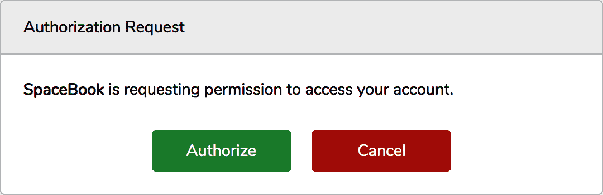

# 第十三章：编写 API

Laravel 开发者面临的最常见任务之一是创建 API，通常是 JSON 和 REST 或类似 REST 的，允许第三方与 Laravel 应用程序的数据进行交互。

Laravel 让与 JSON 工作变得非常容易，并且它的资源控制器已经围绕 REST 动词和模式进行了结构化。在本章中，您将学习一些基本的 API 编写概念，Laravel 提供的编写 API 的工具，以及在编写您的第一个 Laravel API 时需要考虑的一些外部工具和组织系统。

# REST-Like JSON API 的基础知识

表述性状态转移（REST）是一种用于构建 API 的架构风格。技术上来说，REST 或者是一个广义定义，几乎可以适用于整个互联网，或者是一个如此具体的东西，以至于*没有人*真正使用它，所以不要让自己被定义或与书呆子争论所困扰。在 Laravel 的世界中，当我们谈论 RESTful 或类似 REST 的 API 时，通常是指具有以下几个共同特征的 API：

+   它们围绕可由 URI 唯一表示的“资源”进行组织，比如 `/cats` 表示所有猫，`/cats/15` 表示 ID 为 15 的单个猫等。

+   主要使用 HTTP 动词（`GET` `/cats/15` 与 `DELETE /cats/15`）与资源进行交互。

+   它们是无状态的，这意味着请求之间没有持久的会话身份验证；每个请求必须唯一验证自己。

+   它们是可缓存且一致的，这意味着每个请求（除了少数特定于经过身份验证的用户的请求）无论请求者是谁，都应该返回相同的结果。

+   它们返回 JSON。

最常见的 API 模式是为每个 Eloquent 模型创建一个唯一的 URL 结构，将其公开为 API 资源，并允许用户使用特定的动词与该资源进行交互并获取 JSON 返回。示例 13-1 展示了一些可能的示例。

##### 示例 13-1\. 常见的 REST API 端点结构

```php
GET /api/cats
[
    {
        id: 1,
        name: 'Fluffy'
    },
    {
        id: 2,
        name: 'Killer'
    }
]

GET /api/cats/2
{
    id: 2,
    name: 'Killer'
}

POST /api/cats with body:
{
    name: 'Mr Bigglesworth'
}
(creates new cat)

PATCH /api/cats/3 with body:
{
    name: 'Mr. Bigglesworth'
}
(updates cat)

DELETE /api/cats/2
(deletes cat)
```

这让你了解到我们可能与 API 交互的基本集合。让我们深入了解如何通过 Laravel 实现它们。

# 控制器组织和 JSON 返回

Laravel 的 API 资源控制器类似于普通资源控制器（参见“资源控制器”），但修改为与 RESTful API 路由对齐。例如，它们排除了 `create()` 和 `edit()` 方法，这两者在 API 中是不相关的。让我们从这里开始。首先，我们将为我们的资源创建一个新的控制器，并将其路由到 `/api/dogs`：

```php
php artisan make:controller Api/DogController --api
```

示例 13-2 展示了我们的 API 资源控制器的样子。

##### 示例 13-2\. 生成的 API 资源控制器

```php
<?php

namespace App\Http\Controllers\Api;

use Illuminate\Http\Request;
use App\Http\Controllers\Controller;

class DogController extends Controller
{
    /**
 * Display a listing of the resource.
 */
    public function index()
    {
        //
    }

    /**
 * Store a newly created resource in storage.
 */
    public function store(Request $request)
    {
        //
    }

    /**
 * Display the specified resource.
 */
    public function show(string $id)
    {
        //
    }

    /**
 * Update the specified resource in storage.
 */
    public function update(Request $request, string $id)
    {
        //
    }

    /**
 * Remove the specified resource from storage.
 */
    public function destroy(string $id)
    {
        //
    }
}
```

文档块几乎讲述了整个故事。`index()` 列出所有狗，`show()` 列出单个狗，`store()` 存储新狗，`update()` 更新狗，`destroy()` 删除狗。

让我们快速制作一个模型和一个迁移，以便我们可以处理它：

```php
php artisan make:model Dog --migration
php artisan migrate
```

太棒了！现在我们可以填充我们的控制器方法了。

# 这些代码示例工作所需的数据库要求

如果您希望我们在这里编写的代码实际上起作用，您将希望在迁移中添加一个名为`name`的`string()`列，另一个名为`breed`，并将这些列添加到 Eloquent 模型的`fillable`属性，或者只是将该模型的`guarded`属性设置为空数组（`[]`）。稍后的示例还将需要`weight`、`color`的列，以及`bones`和`friends`的关系。

我们可以利用 Eloquent 的一个很棒的特性：如果您输出一个 Eloquent 结果集合，它会自动将自己转换为 JSON（使用`__toString()`魔术方法，如果您感兴趣的话）。这意味着，如果您从路由返回一个结果集合，您实际上将返回 JSON。因此，正如示例 13-3 所示，这将是您写过的一些最简单的代码。

##### 示例 13-3\. `Dog`实体的示例 API 资源控制器

```php
...
class DogController extends Controller
{
    public function index()
    {
        return Dog::all();
    }

    public function store(Request $request)
    {
        return Dog::create($request->only(['name', 'breed']));
    }

    public function show(string $id)
    {
        return Dog::findOrFail($id);
    }

    public function update(Request $request, string $id)
    {
        $dog = Dog::findOrFail($id);
        $dog->update($request->only(['name', 'breed']));
        return $dog;
    }

    public function destroy(string $id)
    {
        Dog::findOrFail($id)->delete();
    }
}
```

Artisan 的`make:model`命令还有一个`--api`标志，您可以传递以生成与上述相同的 API 特定控制器：

```php
php artisan make:model Dog --api
```

如果您想要一次性生成迁移、seeder、factory、policy、资源控制器以及存储和更新表单请求，并在一条命令中使用`--all`标志：

```php
php artisan make:model Dog --all
```

示例 13-4 展示了我们如何在路由文件中链接它。正如您所见，我们可以使用`Route::apiResource()`自动将所有这些默认方法映射到相应的路由和 HTTP 动词。

##### 示例 13-4\. 绑定资源控制器的路由

```php
// routes/api.php
Route::namespace('App\Http\Controllers\Api')->group(function () {
    Route::apiResource('dogs', DogController::class);
});
```

就是这样！您的第一个 Laravel RESTful API。当然，您需要更多的细微差别：分页、排序、认证和更好定义的响应头。但这是其他一切的基础。

# 读取和发送标头

REST API 通常使用标头读取和发送非内容信息。例如，对 GitHub 的任何 API 请求都将返回详细说明当前用户的速率限制状态的标头：

```php
X-RateLimit-Limit: 5000
X-RateLimit-Remaining: 4987
X-RateLimit-Reset: 1350085394
```

同样，许多 API 允许开发人员使用请求头自定义其请求。例如，GitHub 的 API 使用`Accept`头很容易定义要使用的 API 版本：

```php
Accept: application/vnd.github.v3+json
```

如果您将`v3`更改为`v2`，GitHub 将将您的请求传递到其 API 的第 2 版本。

让我们快速学习如何在 Laravel 中同时做这两件事。

## 在 Laravel 中发送响应标头

我们在第十章已经详细讨论了这个主题，但这里是一个快速的复习。一旦您有了一个响应对象，您可以使用`header(*$headerName*, *$headerValue*)`添加一个标头，就像在示例 13-5 中所见。

##### 示例 13-5\. 在 Laravel 中添加响应头

```php
Route::get('dogs', function () {
    return response(Dog::all())
        ->header('X-Greatness-Index', 12);
});
```

很简单易行。

## 在 Laravel 中读取请求标头

如果您有一个传入请求，读取任何给定标头也很简单。[示例 13-6](https://wiki.example.org/reading_a_request_header_in_laravel)说明了这一点。

##### [示例 13-6](https://wiki.example.org/reading_a_request_header_in_laravel)。在 Laravel 中读取请求标头

```php
Route::get('dogs', function (Request $request) {
    var_dump($request->header('Accept'));
});
```

现在您可以读取传入的请求标头并在 API 响应中设置标头了，让我们看看如何自定义您的 API。

# Eloquent 分页

分页是大多数 API 需要考虑特殊说明的第一个地方。Eloquent 提供了一个分页系统，直接连接到任何页面请求的查询参数。我们在第六章中已经简要介绍了分页组件，但这里是一个快速的复习。

任何 Eloquent 调用都提供了一个`paginate()`方法，您可以在其中传递希望每页返回的项目数。然后，Eloquent 会检查页面查询参数的 URL，并且如果设置了，将其视为用户在分页列表中的位置（多少页）的指示器。

要使您的 API 路由准备好自动化的 Laravel 分页，请在调用 Eloquent 查询的路由中使用`paginate()`而不是`all()`或`get()`；类似于[示例 13-7](https://wiki.example.org/paginated_api_route)。

##### [示例 13-7](https://wiki.example.org/a_paginated_api_route)。一个分页的 API 路由

```php
Route::get('dogs', function () {
    return Dog::paginate(20);
});
```

我们已经定义了 Eloquent 应该从数据库中获取 20 个结果。根据`page`查询参数设置的内容，Laravel 将准确知道为我们拉取哪 20 个结果：

```php
GET /dogs        - Return results 1-20
GET /dogs?page=1 - Return results 1-20
GET /dogs?page=2 - Return results 21-40
```

注意，`paginate()`方法也适用于查询构建器调用，如[示例 13-8](https://wiki.example.org/using_the_paginate_method_on_a_query_builder_call)所示。

##### [示例 13-8](https://wiki.example.org/using_the_paginate_method_on_a_query_builder_call)。在查询构建器调用中使用`paginate()`方法

```php
Route::get('dogs', function () {
    return DB::table('dogs')->paginate(20);
});
```

不过，这里有一些有趣的地方：当您将其转换为 JSON 时，它不仅会返回 20 个结果。相反，它将构建一个响应对象，自动向最终用户传递一些有用的与分页相关的详细信息，并且从我们的调用中显示可能的响应，缩减为仅三条记录以节省空间。

##### [示例 13-9](https://wiki.example.org/sample_output_from_a_paginated_database_call)。来自分页数据库调用的示例输出

```php
{
   "current_page": 1,
   "data": [
        {
           'name': 'Fido'
        },
        {
            'name': 'Pickles'
        },
        {
            'name': 'Spot'
        }
   ]
   "first_page_url": "http://myapp.com/api/dogs?page=1",
   "from": 1,
   "last_page": 2,
   "last_page_url": "http://myapp.com/api/dogs?page=2",
   "links": [
      {
         "url": null,
         "label": "&laquo; Previous",
         "active": false
      },
      {
         "url": "http://myapp.com/api/dogs?page=1",
         "label": "1",
         "active": true
      },
      {
         "url": null,
         "label": "Next &raquo;",
         "active": false
      }
   ],
   "next_page_url": "http://myapp.com/api/dogs?page=2",
   "path": "http://myapp.com/api/dogs",
   "per_page": 20,
   "prev_page_url": null,
   "to": 2,
   "total": 4
}
```

# 排序和过滤

尽管 Laravel 中有关于分页的约定和一些内置工具，但没有关于排序的内容，因此您必须自己解决。我将在这里快速给出一个代码示例，并且我将类似于 JSON API 规范（在下面的侧边栏中描述）样式化查询参数。

## 您的 API 结果排序

首先，让我们设置排序结果的能力。我们从[示例 13-10](https://wiki.example.org/simplest_api_sorting)开始，只能按单列和单方向排序。

##### [示例 13-10](https://wiki.example.org/simplest_api_sorting)。最简单的 API 排序

```php
// Handles /dogs?sort=name
Route::get('dogs', function (Request $request) {
    // Get the sort query parameter (or fall back to default sort "name")
    $sortColumn = $request->input('sort', 'name');
    return Dog::orderBy($sortColumn)->paginate(20);
});
```

我们在[示例 13-11](https://wiki.example.org/single_column_api_sorting_direction_control)中添加了反转的能力（例如`?sort=-weight`）。

##### [示例 13-11](https://wiki.example.org/single_column_api_sorting_with_direction_control)。单列 API 排序，带有方向控制

```php
// Handles /dogs?sort=name and /dogs?sort=-name
Route::get('dogs', function (Request $request) {
    // Get the sort query parameter (or fall back to default sort "name")
    $sortColumn = $request->input('sort', 'name');

    // Set the sort direction based on whether the key starts with -
    // using Laravel's starts_with() helper function
    $sortDirection = str_starts_with($sortColumn, '-') ? 'desc' : 'asc';
    $sortColumn = ltrim($sortColumn, '-');

    return Dog::orderBy($sortColumn, $sortDirection)
        ->paginate(20);
});
```

最后，在示例 13-12 中，我们也为多列（例如，`?sort=name,-weight`）执行相同操作。

##### 示例 13-12\. JSON API 风格的排序

```php
// Handles ?sort=name,-weight
Route::get('dogs', function (Request $request) {
    // Grab the query parameter and turn it into an array exploded by ,
    $sorts = explode(',', $request->input('sort', ''));

    // Create a query
    $query = Dog::query();

    // Add the sorts one by one
    foreach ($sorts as $sortColumn) {
        $sortDirection = str_starts_with($sortColumn, '-') ? 'desc' : 'asc';
        $sortColumn = ltrim($sortColumn, '-');

        $query->orderBy($sortColumn, $sortDirection);
    }

    // Return
    return $query->paginate(20);
});
```

正如您所看到的，这并不是最简单的过程，您可能希望围绕重复的过程构建一些辅助工具，但我们正在逐步构建 API 的可定制性，使用逻辑和简单的功能。

## 过滤您的 API 结果

在构建 API 时，另一个常见任务是仅过滤出特定数据子集。例如，客户端可能会要求列出吉娃娃犬的列表。

JSON API 在这里没有为我们提供任何优秀的语法建议，除了我们应该使用`filter`查询参数。让我们沿着排序语法的思路，将所有内容放入单一键中——也许是`?filter=breed:chihuahua`。您可以在示例 13-13 中看到如何做到这一点。

##### 示例 13-13\. API 结果的单个过滤器

```php
Route::get('dogs', function () {
    $query = Dog::query();

    $query->when(request()->filled('filter'), function ($query) {
        [$criteria, $value] = explode(':', request('filter'));
        return $query->where($criteria, $value);
    });

    return $query->paginate(20);
});
```

注意，在示例 13-13 中，我们使用`request()`辅助函数而不是注入`$request`实例。两者功能相同，但有时在闭包内工作时，`request()`辅助函数可能更方便，这样您就不必手动传递变量。

而且，仅仅是为了好玩，在示例 13-14 中，我们允许多个过滤器，例如`?filter=breed:chihuahua,color:brown`。

##### 示例 13-14\. API 结果的多个过滤器

```php
Route::get('dogs', function (Request $request) {
    $query = Dog::query();

    $query->when(request()->filled('filter'), function ($query) {
        $filters = explode(',', request('filter'));

        foreach ($filters as $filter) {
            [$criteria, $value] = explode(':', $filter);
            $query->where($criteria, $value);
        }

        return $query;
    });

    return $query->paginate(20);
});
```

# 转换结果

我们已经介绍了如何对结果集进行排序和过滤。但现在，我们依赖于 Eloquent 的 JSON 序列化，这意味着我们会返回每个模型的每个字段。

当您序列化一个数组时，Eloquent 提供了一些便捷工具来定义应显示哪些字段。您可以在第五章中阅读更多内容，但其主要思想是，如果您在 Eloquent 类上设置了`$hidden`数组属性，则该数组中列出的任何字段都不会显示在序列化的模型输出中。您还可以设置一个`$visible`数组，定义允许显示的字段。或者您还可以覆盖或模仿模型上的`toArray()`函数，以制定自定义输出格式。

另一个常见模式是为每种数据类型创建一个*转换器*。转换器很有帮助，因为它们让您拥有更多控制权，将与 API 特定逻辑隔离开来，使模型本身更一致，即使模型及其关系在未来发生变化。

有一个非常棒但复杂的软件包，[Fractal](https://oreil.ly/pso1E)，它设置了一系列方便的结构和类来转换您的数据。

# API 资源

在过去，当我们在 Laravel 中开发 API 时，我们遇到的第一个挑战之一是如何转换我们的数据。最简单的 API 可以将 Eloquent 对象作为 JSON 返回，但是大多数 API 很快就会超出这种结构的需求。我们应该如何将我们的 Eloquent 结果转换为正确的格式？如果我们想要嵌入其他资源或只在需要时这样做，或者添加计算字段或隐藏某些字段不在 API 中显示，但在其他 JSON 输出中显示呢？API 特定的转换器是解决方案。

现在我们可以访问一个名为*Eloquent API 资源*的功能，它们是定义如何将给定类的 Eloquent 对象（或 Eloquent 对象集合）转换为 API 结果的结构。例如，您的`Dog` Eloquent 模型现在有一个`Dog`资源，其责任是将每个`Dog`实例转换为相应的`Dog`形状的 API 响应对象。

## 创建一个资源类

让我们通过这个`Dog`示例来看一下如何转换我们的 API 输出。首先，使用 Artisan 命令`make:resource`来创建您的第一个资源：

```php
php artisan make:resource Dog
```

这将在*app/Http/Resources/Dog.php*中创建一个新的类，其中包含一个方法：`toArray()`。您可以在 Example 13-15 中看到文件的样子。

##### Example 13-15\. 生成的 API 资源

```php
<?php

namespace App\Http\Resources;

use Illuminate\Http\Request;
use Illuminate\Http\Resources\Json\JsonResource;

class Dog extends JsonResource
{
    /**
 * Transform the resource into an array.
 *
 * @return array<string, mixed>
 */
    public function toArray(Request $request): array
    {
        return parent::toArray($request);
    }
}
```

我们在这里使用的`toArray()`方法可以访问两个重要的数据片段。首先，它可以访问 Illuminate 的`Request`对象，因此我们可以根据查询参数、头信息和其他重要信息来自定义我们的响应。其次，它可以通过在`$this`上调用其属性和方法来访问整个 Eloquent 对象，正如您在 Example 13-16 中所见。

##### Example 13-16\. `Dog`模型的简单 API 资源

```php
class Dog extends JsonResource
{
    public function toArray(Request $request): array
    {
        return [
            'id' => $this->id,
            'name' => $this->name,
            'breed' => $this->breed,
        ];
    }
}
```

要使用这个新资源，您需要更新返回单个`Dog`的任何 API 端点，以包装您的新资源响应，就像在 Example 13-17 中看到的那样。

##### Example 13-17\. 使用简单的`Dog`资源

```php
use App\Dog;
use App\Http\Resources\Dog as DogResource;

Route::get('dogs/{dogId}', function ($dogId) {
    return new DogResource(Dog::find($dogId));
});
```

## 资源集合

现在，让我们谈谈当您从给定 API 端点返回多个实体时会发生什么。这可以通过 API 资源的`collection()`方法来实现，正如您在 Example 13-18 中所见。

##### Example 13-18\. 使用默认的 API 资源集合方法

```php
use App\Dog;
use App\Http\Resources\Dog as DogResource;

Route::get('dogs', function () {
    return DogResource::collection(Dog::all());
});
```

此方法遍历传递给它的每个条目，使用`DogResource` API 资源进行转换，然后返回集合。

对于许多 API 来说，这可能已经足够了，但是如果您需要自定义结构或向您的集合响应添加元数据，您可能需要创建一个自定义的 API 资源集合。

为了做到这一点，让我们再次使用`make:resource` Artisan 命令。这次我们将其命名为`DogCollection`，这表明这是一个 API 资源集合，而不仅仅是一个 API 资源：

```php
php artisan make:resource DogCollection
```

这将生成一个非常类似于 API 资源文件的新文件，位于*app/Http/Resources/DogCollection.php*，再次包含一个方法：`toArray()`。您可以在示例 13-19 中查看文件的外观。

##### 示例 13-19\. 生成的 API 资源集合

```php
<?php

namespace App\Http\Resources;

use Illuminate\Http\Resources\Json\ResourceCollection;

class DogCollection extends ResourceCollection
{
    /**
 * Transform the resource collection into an array.
 *
 * @return array<int|string, mixed>
 */
    public function toArray(Request $request): array
    {
        return parent::toArray($request);
    }
}
```

就像使用 API 资源一样，我们可以访问请求和底层数据。但与 API 资源不同的是，我们处理的是一组项目而不是单个项目，因此我们将访问（已转换的）集合作为`$this->collection`。请参阅示例 13-20 了解示例。

##### 示例 13-20\. 用于`Dog`模型的简单 API 资源集合

```php
class DogCollection extends ResourceCollection
{
    public function toArray(Request $request): array
    {
        return [
            'data' => $this->collection,
            'links' => [
                'self' => route('dogs.index'),
            ],
        ];
    }
}
```

## 嵌套关系

任何 API 的更复杂方面之一是关系如何嵌套。使用 API 资源的最简单方法是将一个键添加到返回的数组中，该键设置为 API 资源集合，就像示例 13-21 中一样。

##### 示例 13-21\. 简单包含的 API 关系

```php
public function toArray(Request $request): array
{
    return [
        'name' => $this->name,
        'breed' => $this->breed,
        'friends' => Dog::collection($this->friends),
    ];
}
```

###### 警告

如果您尝试在示例 13-21 中的代码并收到 502 错误，则是因为您尚未首先加载父资源上的“friends”关系。继续阅读以了解如何解决此问题，但在处理此资源时，以下是如何使用`with()`方法急加载该关系：

```php
return new DogResource(Dog::with('friends')->find($dogId));
```

您可能还希望这是一个条件属性；您可以选择仅在请求中请求它或仅在已经预加载到传递给 Eloquent 对象上时才嵌套它。请参阅示例 13-22。

##### 示例 13-22\. 有条件地加载 API 关系

```php
public function toArray(Request $request): array
{
    return [
        'name' => $this->name,
        'breed' => $this->breed,
        // Only load this relationship if it's been eager loaded
        'bones' => BoneResource::collection($this->whenLoaded('bones')),
        // Or only load this relationship if the URL asks for it
        'bones' => $this->when(
            $request->get('include') == 'bones',
            BoneResource::collection($this->bones)
        ),
    ];
}
```

## 使用分页与 API 资源

只需像将一组 Eloquent 模型传递给资源一样，您也可以传递一个分页器实例。请参阅示例 13-23。

##### 示例 13-23\. 将分页器实例传递给 API 资源集合

```php
Route::get('dogs', function () {
    return new DogCollection(Dog::paginate(20));
});
```

如果您传递一个分页器实例，转换后的结果将具有包含分页信息（`first`页，`last`页，`prev`页和`next`页）和有关整个集合的元信息的附加链接。

您可以查看示例 13-24 以查看此信息的外观。在此示例中，我通过调用`Dog::paginate(2)`将每页项数设置为 2，以便更容易地查看链接的工作方式。

##### 示例 13-24\. 带有分页链接的样本分页资源响应

```php
{
  "data": [
    {
      "name": "Pickles",
      "breed": "Chorkie"
    },
    {
      "name": "Gandalf",
      "breed": "Golden Retriever Mix"
    }
  ],
  "links": {
    "self": "http://gooddogbrant.com/api/dogs",
    "first": "http://gooddogbrant.com/api/dogs?page=1",
    "last": "http://gooddogbrant.com/api/dogs?page=3",
    "prev": null,
    "next": null
  },
  "meta": {
    "current_page": 1,
    "data": [
        {
            "name": "Pickles",
            "breed": "Chorkie",
        },
        {
            "name": "Gandalf",
            "breed": "Golden Retriever Mix",
        }
    ],
    "first_page_url": "http://gooddogbrent.com/api/dogs?page=1",
    "from": 1,
    "last_page": 3,
    "last_page_url": "http://gooddogbrent.com/api/dogs?page=3",
    "links": [
        {
            "url": null,
            "label": "&laquo; Previous",
            "active": false
        },
        {
            "url": "http://gooddogbrent.com/api/dogs?page=1",
            "label": "1",
            "active": true
        },
        {
            "url": "http://gooddogbrent.com/api/dogs?page=2",
            "label": "Next &raquo;",
            "active": false
        }
    ],
    "next_page_url": null,
    "path": "http://gooddogbrent.com/api/dogs",
    "per_page": 3,
    "to": 3,
    "total": 9
  }
}
```

## 有条件地应用属性

您还可以指定响应中的某些属性仅在满足特定测试时应用，如示例 13-25 所示。

##### 示例 13-25\. 有条件地应用属性

```php
public function toArray(Request $request): array
{
    return [
        'name' => $this->name,
        'breed' => $this->breed,
        'rating' => $this->when(Auth::user()->canSeeRatings(), 12),
    ];
}
```

## API 资源的更多自定义

`data` 属性包装的默认形状可能不是你喜欢的方式，或者你可能发现自己需要为响应添加或自定义元数据。查看 [资源文档](https://oreil.ly/LJ3Ie) 以获取有关如何自定义 API 响应的每个方面的详细信息。

# API 身份验证

Laravel 提供了两个主要工具来认证 API 请求：Sanctum（推荐使用）和 Passport（功能强大但非常复杂，通常过于复杂）。

## 使用 Sanctum 进行 API 身份验证

Sanctum 是 Laravel 的一个 API 身份验证系统，专为两个任务而建：为你的高级用户生成简单的令牌，以便与你的 API 交互，并允许 SPA 和移动应用程序依附于你现有的身份验证系统。它不像 OAuth 2.0 那样可配置，但非常接近，并且在设置和配置方面成本要低得多。

使用 Sanctum 有几种方式。你可以允许高级用户在管理面板直接为你的 API 生成令牌，这与许多面向开发者的 SaaS 服务类似。你也可以允许用户访问一个特殊的登录页面直接获取令牌，这对于将移动应用程序认证到你的 API 是有用的。此外，你还可以与你的 SPA 集成，使用 Sanctum 的特殊功能之一，直接挂接到 Laravel 基于 cookie 的身份验证会话中，完全不需要管理令牌。

让我们看看如何安装 Sanctum，然后在每个上下文中如何使用它。

### 安装 Sanctum

Sanctum 已预安装在新的 Laravel 项目中。如果你的项目没有安装它，你需要手动安装并发布其配置文件。

```php
composer require laravel/sanctum
php artisan vendor:publish --provider="Laravel\Sanctum\SanctumServiceProvider"
php artisan migrate
```

对于任何你想保护的使用 Sanctum 的路由，附加 `auth:sanctum` 中间件：

```php
Route::get('clips', function () {
    return view('clips.index', ['clips' => Clip::all()]);
})->middleware('auth:sanctum');
```

### 手动发放 Sanctum 令牌

如果你想在你的应用程序中构建工具来为用户提供认证 API 的令牌，这里是你需要采取的步骤。

首先确保你的 `User` 模型使用了 `HasApiTokens` 特性（在新项目上，它已经有了）：

```php
use Laravel\Sanctum\HasApiTokens;

class User extends Authenticatable
{
    use HasApiTokens, HasFactory, Notifiable;
}
```

接下来，构建一个用户界面，允许用户生成一个令牌。你可以在他们的设置页面上放置一个按钮，上面写着“生成新令牌”，弹出一个模态框询问该令牌的昵称，然后将结果发布到这个表单：

```php
Route::post('tokens/create', function () {
    $token = auth()->user()->createToken(request()->token_name);

    return view('tokens.created', ['token' => $token->plainTextToken]);
});
```

你也可以通过引用 `user` 对象的 `tokens` 属性列出用户拥有的所有令牌：

```php
Route::get('tokens', function () {
    return view('tokens.index', ['tokens' => auth()->user()->tokens]);
});
```

### Sanctum 令牌能力

基于令牌的 API 身份验证的一种常见安全模式是，只允许用户生成具有特定特权的令牌，以减少如果令牌被 compromise 的潜在损害。

如果你想为此构建一个系统，你可以定义（基于业务逻辑或用户偏好）创建时每个令牌拥有的“能力”。将一个字符串数组传递给 `createToken()` 方法，每个字符串代表该令牌拥有的一个能力。

```php
$token = $user->createToken(
    request()->token_name, ['list-clips', 'add-delete-clips']
);
```

然后，您的代码可以直接检查已验证用户的令牌（如 Example 13-26 中所示），或通过中间件（如 Example 13-27 中所示）。

##### Example 13-26\. 根据令牌能力手动检查用户访问权限

```php
if (request()->user()->tokenCan('list-clips')) {
    // ...
}
```

##### Example 13-27\. 使用中间件根据令牌范围限制访问

```php
// routes/api.php
Route::get('clips', function () {
    // Access token has both the "list-clips" and "add-delete-clips" abilities
})->middleware(['auth:sanctum','abilities:list-clips,add-delete-clips']);

// or

Route::get('clips', function () {
    // Access token has at least one of the listed abilities
})->middleware(['auth:sanctum','ability:list-clips,add-delete-clips'])
```

###### 注意

如果您希望使用 Sanctum 的中间件检查功能，则需要将以下两行添加到`App\Http\Kernel`的`middlewareAliases`属性中。

```php
'abilities' => \Laravel\Sanctum\Http\Middleware\
    CheckAbilities::class,
'ability' => \Laravel\Sanctum\Http\Middleware\
    CheckForAnyAbility::class,
```

### SPA 认证

如果您计划使用 Sanctum 与 SPA 进行身份验证，则首先需要采取一些步骤来设置您的 Laravel 应用程序和您的 SPA。

#### Laravel 应用准备工作

首先，在*app/Http/Kernel.php*中的`api`中间件组取消注释`EnsureFrontendRequestsAreStateful`类。

```php
'api' => [
    \Laravel\Sanctum\Http\Middleware\EnsureFrontendRequestsAreStateful::class,
    // Other API middleware here
],
```

其次，在 Sanctum 配置中更新“stateful”域的列表。这些是您的 SPA 可以发出请求的所有域。您可以直接在*config/sanctum.php*中修改它们，或者将逗号分隔的域列表添加到您的*.env*文件中的`SANCTUM_STATEFUL_DOMAINS`键。

#### SPA 应用准备工作

在允许用户登录您的应用之前，您的 SPA 应请求 Laravel 设置一个 CSRF cookie，大多数 JavaScript HTTP 客户端（如 Axios）将在以后的每个请求中传递它。

```php
axios.get('/sanctum/csrf-cookie').then(response => {
    // Handle login
});
```

您可以登录到您的 Laravel 登录路由，无论是您自己创建的路由还是由类似 Fortify 的现有工具提供的路由。未来的请求将通过 Laravel 为您设置的会话 cookie 进行验证。

### 移动应用认证

这是允许您的移动应用用户对基于 Sanctum 的应用进行认证的工作流程：在您的移动应用中请求用户的电子邮件（或用户名）和他们的密码。将这些信息与设备的名称一起发送（从设备的操作系统中读取设备名称；例如，“Matt's iPhone”），发送到您在后端自己创建的路由，该路由将验证他们的登录，并（假设登录有效）创建并返回一个令牌，正如您可以从 Example 13-28 直接看到的文档中获取的内容。

##### Example 13-28\. 用于接受基于 Sanctum 的应用的移动应用登录的路由

```php
Route::post('sanctum/token', function (Request $request) {
    $request->validate([
        'email' => 'required|email',
        'password' => 'required',
        'device_name' => 'required',
    ]);

    $user = User::where('email', $request->email)->first();

    if (! $user || ! Hash::check($request->password, $user->password)) {
        throw ValidationException::withMessages([
            'email' => ['The provided credentials are incorrect.'],
        ]);
    }

    return $user->createToken($request->device_name)->plainTextToken;
});
```

未来对 API 的请求应在`Authorization`标头中传递`Bearer`类型的令牌。

### 进一步的配置和调试

如果您在安装 Sanctum 方面遇到任何问题或想要自定义 Sanctum 的任何功能，请查阅[Sanctum 文档](https://oreil.ly/lIpkq)获取更多信息。

## 使用 Laravel Passport 进行 API 身份验证

Passport（通过 Composer 引入的第一方包，必须安装）可轻松在您的应用程序中设置一个功能齐全的 OAuth 2.0 服务器，包括管理客户端和令牌的 API 和 UI 组件。

### OAuth 2.0 简介

OAuth 是 RESTful API 中最常用的认证系统。不幸的是，这是一个过于复杂的主题，我们无法在此深入讨论。有关更多信息，请参阅 Matt Frost 撰写的关于 OAuth 和 PHP 的优秀书籍 *Integrating Web Services with OAuth and PHP* (php[architect])。

OAuth 最简单的概念是：由于 API 是无状态的，我们不能依赖于正常的基于会话的身份验证方式，这种方式在普通的基于浏览器的查看会话中使用，用户登录后，其验证状态保存在会话中以供后续查看使用。相反，API 客户端需要向认证端点发出单个调用，并执行某种握手来证明自己的身份。然后，它将获得一个令牌，必须在以后的每个请求中（通常通过 `Authorization` 标头）发送以证明其身份。

OAuth 有几种不同的授权类型，“授权”基本上意味着有几种不同的场景和交互类型可以定义认证握手。不同的项目和不同类型的最终消费者将需要不同的授权。

Passport 提供了将基本的 OAuth 2.0 认证服务器添加到您的 Laravel 应用程序中所需的一切，具有更简单和强大的 API 和界面。

### 安装 Passport

Passport 是一个独立的包，因此您的第一步是安装它。我将在这里总结步骤，但您可以在[Passport 文档](https://oreil.ly/N9-eD)中获取更详细的安装说明。

首先，使用 Composer 导入它：

```php
composer require laravel/passport
```

Passport 导入了一系列迁移，因此使用 `php artisan migrate` 运行这些迁移以创建 OAuth 客户端、作用域和令牌所需的表。

接下来，使用 `php artisan passport:install` 运行安装程序。这将为 OAuth 服务器创建加密密钥（*storage/oauth-private.key* 和 *storage/oauth-public.key*），并在数据库中插入我们的个人和密码授权类型令牌的 OAuth 客户端（稍后将介绍）。

您需要将 `Laravel\Passport\HasApiTokens` trait 导入到您的 `User` 模型中；这将为每个 `User` 添加与 OAuth 客户端和令牌相关的关系，以及一些与令牌相关的辅助方法。

最后，在 *config/auth.php* 中添加一个名为 `api` 的新认证守卫；将提供者设置为 `users`，驱动程序设置为 `passport`。

现在，您已经拥有了一个完全功能的 OAuth 2.0 服务器！您可以使用 `php artisan passport:client` 创建新的客户端，并且您可以使用 `/oauth` 路由前缀下的 API 来管理您的客户端和令牌。

要在您的 Passport 认证系统后面保护路由，请将 `auth:api` 中间件添加到路由或路由组中，如示例 13-29 所示。

##### 示例 13-29\. 使用 Passport 认证中间件保护 API 路由

```php
// routes/api.php
Route::get('/user', function (Request $request) {
    return $request->user();
})->middleware('auth:api');
```

要对这些受保护的路由进行身份验证，您的客户端应用程序将需要通过`Authorization`标头中的`Bearer`令牌传递令牌（我们将很快介绍如何获取）。示例 13-30 展示了如果您正在使用 Laravel 包含的 HTTP 客户端进行请求，会是什么样子。

##### 示例 13-30\. 使用`Bearer`令牌进行样本 API 请求

```php
use Illuminate\Support\Facades\Http;

$response = Http::withHeaders(['Accept' => 'application/json'])
    ->withToken($accessToken)
    ->get('http://tweeter.test/api/user');
```

现在，让我们更详细地看看它是如何工作的。

### Passport 的 API

Passport 在您的应用程序中通过`/oauth`路由前缀公开了一个 API。该 API 提供两个主要功能：首先，通过 OAuth 2.0 授权流（`/oauth/authorize`和`/oauth/token`）授权用户，其次，允许用户管理其客户端和令牌（其余路由）。

这是一个重要的区别，特别是如果您对 OAuth 不熟悉。每个 OAuth 服务器都需要公开允许消费者使用您的服务器进行身份验证的能力；这就是该服务的全部意义。但是 Passport 还公开了用于管理 OAuth 服务器客户端和令牌状态的 API。这意味着您可以轻松构建一个前端，让用户在您的 OAuth 应用程序中管理其信息。Passport 实际上附带了基于 Vue 的管理组件，您可以直接使用或作为灵感。

我们将介绍 API 路由，让您可以管理客户端和令牌，以及 Passport 提供的 Vue 组件，使其变得简单易用，但首先让我们深入了解用户可以使用 Passport 保护的 API 进行身份验证的各种方式。

### Passport 可用的授权类型

Passport 使您可以以四种不同的方式对用户进行身份验证。其中两种是传统的 OAuth 2.0 授权（密码授权和授权码授权），另外两种是 Passport 独有的便利方法（个人令牌和同步器令牌）。

#### 密码授权

*密码授权*虽然比授权码授权方式更少见，但要简单得多。如果您希望用户能够直接使用其用户名和密码在您的 API 上进行身份验证，例如，如果您的公司为自己的 API 消耗具有移动应用程序，您可以使用密码授权。

使用密码授权类型，获取令牌只需一步：将用户的凭据发送到`/oauth/token`路由，就像示例 13-31 中那样。

##### 示例 13-31\. 使用密码授权类型进行请求

```php
// routes/web.php in the *consuming application*
Route::get('tweeter/password-grant-auth', function () {
    // Make call to "Tweeter," our Passport-powered OAuth server
    $response = Http::post('http://tweeter.test/oauth/token', [
        'grant_type' => 'password',
        'client_id' => config('tweeter.id'),
        'client_secret' => config('tweeter.secret'),
        'username' => 'matt@mattstauffer.co',
        'password' => 'my-tweeter-password',
        'scope' => '',
    ]);

    $thisUsersTokens = $response->json();
    // Do stuff with the tokens
});
```

此路由将返回一个`access_token`，一个`refresh_token`和两个元数据：`token_type`和`expires_in`（本章后面将讨论）。您现在可以保存这些令牌以用于 API 进行身份验证（访问令牌）和以后请求更多令牌（刷新令牌）。

请注意，我们将用于密码授权类型的 ID 和密钥将是我们 Passport 应用程序中`oauth_clients`数据库表中的那些在其名称与我们 Passport 授权客户端名称匹配的行中的 ID 和密钥。当您运行`passport:install`时，您还将在此表中看到两个默认生成的客户端条目：“Laravel 个人访问客户端”和“Laravel 密码授权客户端”。

#### 授权码授权

最常见的 OAuth 2.0 授权工作流程也是 Passport 支持的最复杂的工作流程。让我们想象我们正在开发一个类似 Twitter 但用于声音片段的应用程序；我们将其称为 Tweeter。我们再想象另一个网站，一个名为 SpaceBook 的科幻迷社交网络。SpaceBook 的开发人员希望让人们将他们的 Tweeter 数据嵌入到他们的 SpaceBook 新闻源中。我们将在我们的 Tweeter 应用程序中安装 Passport，以便其他应用程序 - 例如 SpaceBook - 可以允许他们的用户使用他们的 Tweeter 信息进行身份验证。

在*授权码授权*类型中，每个消费网站 - 例如这个例子中的 SpaceBook - 需要在我们的 Passport 启用的应用程序中创建一个客户端。在大多数情况下，其他站点的管理员将在 Tweeter 拥有用户帐户，我们将为他们构建工具来在那里创建客户端。但是首先，我们可以为 SpaceBook 的管理员手动创建一个客户端：

```php
php artisan passport:client
Which user ID should the client be assigned to?:
 > 1

 What should we name the client?:
 > SpaceBook
 Where should we redirect the request after authorization?
   [http://tweeter.test/auth/callback]:
 > http://spacebook.test/tweeter/callback

 New client created successfully.
 Client ID: 4
 Client secret: 5rzqKpeCjIgz3MXpi3tjQ37HBnLLykrgWgmc18uH
```

要回答第一个问题，您需要知道每个客户端都需要分配给您应用程序中的一个用户。假设用户#1 正在编写 SpaceBook；他们将是我们创建的这个客户端的“所有者”。

一旦我们运行了这个命令，我们就有了 SpaceBook 客户端的 ID 和密钥。在这一点上，SpaceBook 可以使用这个 ID 和密钥来构建工具，允许一个个体 SpaceBook 用户（也是 Tweeter 用户）从 Tweeter 获取授权令牌，以便当 SpaceBook 希望代表该用户进行 API 调用到 Tweeter 时使用。示例 13-32 说明了这一点。 （这和后面的示例假设 SpaceBook 也是一个 Laravel 应用程序；它们还假设 SpaceBook 的开发人员创建了一个在*config/tweeter.php*中返回我们刚刚创建的 ID 和密钥的文件。）

##### 示例 13-32\. 消费者应用程序将用户重定向到我们的 OAuth 服务器

```php
// In SpaceBook's routes/web.php:
Route::get('tweeter/redirect', function () {
    $query = http_build_query([
        'client_id' => config('tweeter.id'),
        'redirect_uri' => url('tweeter/callback'),
        'response_type' => 'code',
        'scope' => '',
    ]);

    // Builds a string like:
    // client_id={$client_id}&redirect_uri={$redirect_uri}&response_type=code

    return redirect('http://tweeter.test/oauth/authorize?' . $query);
});
```

当用户访问 SpaceBook 中的该路由时，他们现在将被重定向到我们 Tweeter 应用中的`/oauth/authorize` Passport 路由。此时他们将看到一个确认页面 - 您可以通过运行此命令使用默认的 Passport 确认页面：

```php
php artisan vendor:publish --tag=passport-views
```

这将发布视图到*resources/views/vendor/passport/authorize.blade.php*，您的用户将看到图 13-1 中显示的页面。



###### 图 13-1\. OAuth 授权码批准页面

一旦用户选择接受或拒绝授权，Passport 将将用户重定向回提供的`redirect_uri`。在示例 13-32 中，我们设置了`redirect_uri`为`url('tweeter/callback')`，因此用户将被重定向回*http://spacebook.test/tweeter/callback*。

批准请求将包含一个代码，我们的消费者应用程序回调路由现在可以使用它从我们的启用 Passport 的应用程序 Tweeter 获取令牌。 拒绝请求将包含一个错误。 SpaceBook 的回调路由可能类似于示例 13-33。

##### 示例 13-33。示例消费应用程序中的授权回调路由

```php
// In SpaceBook's routes/web.php:
Route::get('tweeter/callback', function (Request $request) {
    if ($request->has('error')) {
        // Handle error condition
    }

    $response = Http::post('http://tweeter.test/oauth/token', [
        'grant_type' => 'authorization_code',
        'client_id' => config('tweeter.id'),
        'client_secret' => config('tweeter.secret'),
        'redirect_uri' => url('tweeter/callback'),
        'code' => $request->code,
    ]);

    $thisUsersTokens = $response->json();
    // Do stuff with the tokens
});
```

SpaceBook 开发者在这里做的是使用 Laravel HTTP 客户端构建 HTTP 请求，到 Tweeter 的`/oauth/token` Passport 路由。 然后，他们发送一个`POST`请求，其中包含用户批准访问时收到的授权码，Tweeter 将返回一个包含几个键的 JSON 响应：

`access_token`

SpaceBook 将要保存的该用户令牌。 此令牌是用户将来用于认证到 Tweeter 的请求时使用的。 （使用`Authorization`标头）。

`refresh_token`

如果您决定将您的令牌设置为过期，则 SpaceBook 将需要的令牌。 默认情况下，Passport 的访问令牌有效期为一年。

`expires_in`

直到`access_token`过期的秒数（需要刷新）。

`token_type`

您获取的令牌类型将是`Bearer`；这意味着您在未来的所有请求中传递一个带有名称为`Authorization`和值为`Bearer *YOURTOKENHERE*`的标头。

现在您已经拥有执行基本授权代码流所需的所有工具。 我们将稍后介绍如何为客户和令牌构建管理员面板，但首先，让我们快速查看其他授权类型。

#### 个人访问令牌

授权码授予适用于用户的应用程序，密码授予适用于您自己的应用程序，但是如果您的用户想要为自己创建令牌以测试您的 API 或在开发其应用程序时使用什么？ 这就是个人令牌的用途。

# 创建个人访问客户端

要创建个人令牌，您需要在数据库中拥有个人访问客户端。 运行`php artisan passport:install`将已经添加一个，但是如果出于任何原因需要生成一个新的个人访问客户端，您可以运行`php artisan passport:client --personal`：

```php
`php` `artisan` `passport:client` `--personal`

 What should we name the personal access client?
   [My Application Personal Access Client]:
 > `My` `Application` `Personal` `Access` `Client`

Personal access client created successfully.

```

个人访问令牌并不是“授权”类型；这里没有 OAuth 规定的流程。 相反，它们是 Passport 添加的便捷方法，可以轻松在系统中注册一个单一客户端，该客户端仅用于便捷地为开发者用户创建便利令牌。

例如，也许您有一个正在开发名为 RaceBook（马拉松选手专用的社交网络）的竞争对手 SpaceBook 的用户，他们希望在开始编码之前先玩一玩 Tweeter API，以弄清它的工作原理。这个开发者能够使用授权码流程创建令牌吗？还没有——他们甚至还没有写任何代码呢！这就是个人访问令牌的用途。

您可以通过 JSON API 创建个人访问令牌，我们稍后会介绍，但您也可以直接在代码中为您的用户创建一个：

```php
// Creating a token without scopes
$token = $user->createToken('Token Name')->accessToken;

// Creating a token with scopes
$token = $user->createToken('My Token', ['place-orders'])->accessToken;
```

您的用户可以像使用授权码授予流程创建的令牌一样使用这些令牌。我们将在“护照范围”中详细讨论作用域。

#### Laravel 会话认证的令牌（同步令牌）

还有一种方法让您的用户获取访问 API 的令牌，这是 Passport 添加的另一种便利方法，而普通的 OAuth 服务器不提供。这种方法是当您的用户已经通过常规方式登录到您的 Laravel 应用程序，并且您希望您应用程序的 JavaScript 能够访问 API 时使用的。重新使用授权码或密码授予流程重新认证用户会很麻烦，因此 Laravel 提供了一个辅助方法。

如果您将`Laravel\Passport\Http\Middleware\CreateFreshApiToken`中间件添加到您的`web`中间件组（在*app/Http/Kernel.php*中），Laravel 发送给您的经过身份验证的用户的每个响应都会附带一个名为`laravel_token`的 cookie。这个 cookie 是一个包含有关 CSRF 令牌编码信息的 JSON Web Token（JWT）。现在，如果您在 JavaScript 请求中使用`X-CSRF-TOKEN`标头发送正常的 CSRF 令牌，并且在任何您做的 API 请求中也发送`X-Requested-With`标头，API 将会比较您的 CSRF 令牌与此 cookie，并像处理任何其他令牌一样对您的用户进行身份验证。

Laravel 捆绑的默认 JavaScript 引导设置为您设置了这个标头，但如果您使用不同的框架，您需要手动设置它。示例 13-36 展示了如何在 jQuery 中设置它。

##### 示例 13-36\. 设置 jQuery 通过所有 Ajax 请求传递 Laravel 的 CSRF 令牌和`X-Requested-With`标头

```php
$.ajaxSetup({
    headers: {
        'X-CSRF-TOKEN': "{{ csrf_token() }}",
        'X-Requested-With': 'XMLHttpRequest'
    }
});
```

如果您将`CreateFreshApiToken`中间件添加到您的`web`中间件组，并且在每个 JavaScript 请求中传递这些标头，那么您的 JavaScript 请求将能够访问您的 Passport 保护的 API 路由，而不必担心授权码或密码授予的任何复杂性。

### 护照作用域

如果您熟悉 OAuth，您可能已经注意到我们还没有详细讨论作用域。到目前为止，我们所涵盖的所有内容都可以通过作用域进行定制——但在进一步讨论作用域之前，让我们先快速了解一下什么是作用域。

在 OAuth 中，*作用域* 是定义的一组权限，不是“可以做所有事情”。例如，如果你曾经获取过 GitHub API 令牌，你可能会注意到一些应用只想访问你的姓名和电子邮件地址，一些应用想要访问你所有的仓库，还有一些应用想要访问你的 Gists。这些都是“作用域”，它允许用户和消费者应用定义消费者应用需要执行其工作的访问权限。

如 示例 13-37 所示，你可以在 `AuthServiceProvider` 的 `boot()` 方法中定义应用的作用域。

##### 示例 13-37\. 定义 Passport 作用域

```php
// AuthServiceProvider
use Laravel\Passport\Passport;
...
    public function boot(): void
    {
        ...

        Passport::tokensCan([
            'list-clips' => 'List sound clips',
            'add-delete-clips' => 'Add new and delete old sound clips',
            'admin-account' => 'Administer account details',
        ]);
    }
```

一旦你定义了作用域，消费者应用可以定义它请求访问的作用域。只需在初始重定向中的 `scope` 字段添加一个空格分隔的令牌列表，如 示例 13-38 所示。

##### 示例 13-38\. 请求授权以访问特定作用域

```php
// In SpaceBook's routes/web.php:
Route::get('tweeter/redirect', function () {
    $query = http_build_query([
        'client_id' => config('tweeter.id'),
        'redirect_uri' => url('tweeter/callback'),
        'response_type' => 'code',
        'scope' => 'list-clips add-delete-clips',
    ]);

    return redirect('http://tweeter.test/oauth/authorize?' . $query);
});
```

当用户尝试授权此应用时，它将展示请求的作用域列表。这样，用户就会知道“SpaceBook 请求查看你的电子邮件地址”还是“SpaceBook 请求访问以你身份发布、删除你的帖子和发送消息给你的朋友”。

你   你可以使用中间件或在 `User` 实例上检查作用域。示例 13-39 展示了如何在 `User` 上进行检查。

##### 示例 13-39\. 检查用户验证的令牌是否可以执行指定的操作

```php
Route::get('/events', function () {
    if (auth()->user()->tokenCan('add-delete-clips')) {
        //
    }
});
```

你也可以使用两个中间件，`scope` 和 `scopes`。在你的应用中使用它们，只需将它们添加到 *app/Http/Kernel.php* 文件中的 `$middlewareAliases`：

```php
'scopes' => \Laravel\Passport\Http\Middleware\CheckScopes::class,
'scope' => \Laravel\Passport\Http\Middleware\CheckForAnyScope::class,
```

你现在可以使用中间件，如 示例 13-40 所示。`scopes` 需要用户令牌上包含*所有*定义的作用域才能访问路由，而 `scope` 只需要用户令牌上包含*至少一个*定义的作用域。

##### 示例 13-40\. 使用中间件基于令牌作用域限制访问

```php
// routes/api.php
Route::get('clips', function () {
    // Access token has both the "list-clips" and "add-delete-clips" scopes
})->middleware('scopes:list-clips,add-delete-clips');

// or

Route::get('clips', function () {
    // Access token has at least one of the listed scopes
})->middleware('scope:list-clips,add-delete-clips')
```

如果你没有定义任何作用域，应用将像不存在一样工作。然而，一旦你使用了作用域，你的消费者应用必须明确定义它们请求的作用域。此规则的一个例外是，如果你使用的是密码授权类型，你的消费者应用可以请求 `*` 作用域，这会使令牌获得对所有内容的访问权限。

### 部署 Passport

第一次部署你的 Passport 支持的应用时，Passport API 在你为应用生成密钥之前不会起作用。这可以通过在生产服务器上运行 `php artisan passport:keys` 来完成，这将生成 Passport 用于生成令牌的加密密钥。

# 自定义 404 响应

Laravel 为普通 HTML 视图提供可自定义的错误消息页面，但您还可以为带有 JSON 内容类型的调用自定义默认的 404 回退响应。为此，请将 `Route::fallback()` 调用添加到您的 API 中，如示例 13-41 所示。

##### 示例 13-41\. 定义回退路由

```php
// routes/api.php
Route::fallback(function () {
    return response()->json(['message' => 'Route Not Found'], 404);
})->name('api.fallback.404');
```

## 触发回退路由

如果您想要自定义 Laravel 捕获“未找到”异常时返回的路由，可以使用 `respondWithRoute()` 方法更新异常处理程序，如示例 13-42 所示。

##### 示例 13-42\. 当捕获“未找到”异常时调用回退路由

```php
// App\Exceptions\Handler
use Illuminate\Support\Facades\Route;
use Symfony\Component\HttpKernel\Exception\NotFoundHttpException;
use Illuminate\Http\Request;

public function register(): void
{
    $this->renderable(function (NotFoundHttpException $e, Request $request) {
        if ($request->isJson()) {
            return Route::respondWithRoute('api.fallback.404');
        }
    });

}
```

# 测试

幸运的是，在 Laravel 中测试 API 实际上比测试几乎任何其他东西都简单。

我们在第十二章中详细介绍了这一点，但有一系列针对 JSON 进行断言的方法。结合全栈应用程序测试的简单性，您可以快速轻松地编写 API 测试。查看示例 13-43 中的常见 API 测试模式。

##### 示例 13-43\. 常见的 API 测试模式

```php
...
class DogsApiTest extends TestCase
{
    use WithoutMiddleware, RefreshDatabase;

    public function test_it_gets_all_dogs()
    {
        $dog1 = Dog::factory()->create();
        $dog2 = Dog::factory()->create();

        $response = $this->getJson('api/dogs');

        $response->assertJsonFragment(['name' => $dog1->name]);
        $response->assertJsonFragment(['name' => $dog2->name]);
    }
}
```

请注意，我们使用 `WithoutMiddleware` 来避免担心身份验证问题。如果需要，您可以单独进行身份验证测试（有关身份验证的更多信息，请参见第九章）。

在这个测试中，我们向数据库中插入了两只`Dog`，然后访问 API 路由以列出所有`Dog`，确保两者都出现在输出中。

您可以在这里简单轻松地覆盖所有 API 路由，包括修改`POST`和`PATCH`等操作。

## 测试 Passport

您可以使用 `Passport` 门面上的 `actingAs()` 方法来测试您的作用域。查看示例 13-44 以查看 Passport 中测试作用域的常见模式。

##### 示例 13-44\. 测试作用域访问

```php
public function test_it_lists_all_clips_for_those_with_list_clips_scope()
{
    Passport::actingAs(
        User::factory()->create(),
        ['list-clips']
    );

    $response = $this->getJson('api/clips');
    $response->assertStatus(200);
}
```

# TL;DR

Laravel 专注于构建 API，并简化了与 JSON 和 RESTful API 的工作。有一些约定，如分页，但关于 API 的具体排序、身份验证或其他内容的定义大部分由您决定。

Laravel 提供了身份验证和测试工具，易于操作和读取头信息，并处理 JSON，甚至在直接从路由返回时自动将所有 Eloquent 结果编码为 JSON。

Laravel Passport 是一个单独的包，使得在 Laravel 应用中创建和管理 OAuth 服务器变得简单。
