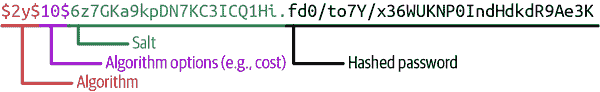

# 第九章：安全和加密

PHP 是一个非常易于使用的语言，因为它的运行时宽容性。即使你犯了一个错误，PHP 也会尝试推断你*想要*做什么，并且通常会继续正常执行你的程序。不幸的是，这种特性也被一些开发者视为一个关键弱点。由于宽容性，PHP 允许大量“坏”代码继续像正确代码一样运行。

更糟糕的是，许多这样的“坏”代码出现在教程中，导致开发者将其复制粘贴到自己的项目中，并延续这一循环。PHP 的这种宽容的运行时和悠久历史使得人们普遍认为 PHP 本身不安全。事实上，*任何*编程语言都可能被不安全地使用。

PHP 本地支持快速、简便地过滤恶意输入和清理用户数据的能力。在 Web 环境中，这种实用性对于保护用户信息免受恶意输入或攻击至关重要。PHP 还提供了明确定义的函数，用于在认证过程中安全地哈希和验证密码。

###### 注意

PHP 的默认密码哈希和验证函数都利用了安全的哈希算法和常数时间的安全实现。这保护了你的应用免受使用时间信息来尝试提取信息等特定攻击的影响。试图自己实现哈希（或验证）可能会使你的应用程序面临 PHP 已经考虑过的风险。

PHP 还为开发者简化了加密（包括加密和签名）的过程。本地的高级接口保护你免受在其他地方容易犯的错误的影响。¹ 事实上，PHP 是其中一个*最简单*的语言，开发者可以在其中利用强大、现代的加密，而无需依赖第三方扩展或实现！

## 旧版加密

PHP 的早期版本附带一个名为 [mcrypt](https://oreil.ly/I7stH) 的扩展。这个扩展暴露了底层的 mcrypt 库，允许开发者轻松利用各种分组密码和哈希算法。在 PHP 7.2 中，为了更加现代化，这个扩展被移除，并推荐使用更新的 sodium 扩展，但你仍然可以通过 PHP 扩展社区库（PECL）手动安装它。²

###### 警告

虽然 mcrypt 库仍然可用，但在过去十多年里没有更新，不应在新项目中使用。对于任何新的加密需求，请使用 PHP 对 OpenSSL 的绑定或本地的 sodium 扩展。

PHP 还支持通过[扩展](https://oreil.ly/cYNB2)直接使用 OpenSSL 库。在构建必须与旧的加密库进行互操作的系统时，这非常有用。但是，该扩展未将 OpenSSL 的全部功能提供给 PHP；有必要查看所暴露的[函数](https://oreil.ly/Y8xEK)和特性，以确定 PHP 的实现是否对您的应用程序有用。

无论如何，较新的钠接口支持 PHP 中广泛的加密操作，应优先于 OpenSSL 或 mcrypt。

## 关于钠及其暴露的接口唯一的问题是缺乏简洁性。每个函数都以`sodium_`为前缀，每个常量都以`SODIUM_`为前缀。在函数和常量名称中的高度描述性使得理解代码发生的事情变得容易。但是，这也导致了极长且潜在分散注意力的函数名称，例如`sodium_​crypto_​sign_​keypair_​from_​secretkey_​and_​publickey()`。

PHP 在 2017 年末发布的 7.2 版本中正式添加了[sodium](https://oreil.ly/gH1Va)扩展（也称为*Libsodium*）。该库支持高级抽象的加密、密码签名、密码哈希等功能。它本身是早期项目[Networking and Cryptography Library (NaCl)](https://nacl.cr.yp.to)的开源分支，由 Daniel J. Bernstein 创建。

这两个项目为需要处理加密的开发者添加了易于使用、高速的工具。它们暴露的接口具有明确的倾向性，旨在使密码学*安全*，并主动避免其他低级工具可能带来的问题。随着明确定义的倾向性接口，开发者可以在算法实现和默认选择方面做出正确的选择，因为这些选择（和潜在的错误）完全被抽象化，并以安全、简单的功能呈现供日常使用。

###### 注意

钠

虽然钠作为 PHP 的核心扩展捆绑在一起，它还为[几种其他语言](https://oreil.ly/L9JPp)提供了绑定。它与从.NET 到 Go 再到 Java 到 Python 的所有内容都是完全可互操作的。

与许多其他加密库不同，钠主要专注于*认证*加密。每个数据片段都自动与身份验证标签配对，该库随后可以使用它来验证底层明文的完整性。如果此标签丢失或无效，库将抛出错误，以警示开发者关联的明文不可靠。

此身份验证的使用并非独特——高级加密标准（AES）的 Galois/Counter Mode (GCM) 实际上做了同样的事情。然而，其他库通常将身份验证和验证认证标签作为开发者的练习留给了开发者。有许多教程、书籍和 Stack Overflow 讨论指出了 AES 的正确实现，但忽略了附加到消息上的 GCM 标签的验证！钠扩展将身份验证和验证抽象化，并提供了清晰、简洁的实现，正如示例 9-1 中所示。

##### 示例 9-1\. 钠中的身份验证加密和解密

```php
$nonce = random_bytes(SODIUM_CRYPTO_SECRETBOX_NONCEBYTES); 

$key = random_bytes(SODIUM_CRYPTO_SECRETBOX_KEYBYTES); 

$message = 'This is a super secret communication!';

$ciphertext = sodium_crypto_secretbox($message, $nonce, $key); 

$output = bin2hex($nonce . $ciphertext); 

// Decoding and decryption reverses the preceding steps $bytes = hex2bin($input); 
$nonce = substr($bytes, 0, SODIUM_CRYPTO_SECRETBOX_NONCEBYTES);
$ciphertext = substr($bytes, SODIUM_CRYPTO_SECRETBOX_NONCEBYTES);

$plaintext = sodium_crypto_secretbox_open($ciphertext, $nonce, $key); 

if ($plaintext === false) { 
    throw new Exception('Unable to decrypt!');
}
```


加密算法是确定性的——相同的输入总是产生相同的输出。为了确保使用相同密钥加密相同数据返回*不同*输出，您需要每次使用足够随机的*nonce*来初始化算法。


对称加密中，您利用单个共享密钥来加密和解密数据。在本例中，密钥是随机的，但您可能会将此加密密钥存储在应用程序之外的某个地方以供安全保存。


加密非常简单。钠选择算法和密码模式，您只需提供消息、随机的一次性数（nonce）和对称密钥即可。底层库会处理其余部分！


在导出加密值（无论是发送给另一方还是存储在磁盘上），您需要跟踪随机 nonce 和随后的密文。nonce 本身不是秘密，因此将其与加密值一起以明文形式存储是安全的（并且是鼓励的）。将二进制的原始字节转换为十六进制是准备数据进行 API 请求或存储在数据库字段中的有效方式。


由于加密输出是十六进制编码的，因此必须先将其解码为原始字节，然后在进行解密之前分离 nonce 和密文组件。


要从加密字段中提取回原文值，需要提供带有其关联 nonce 和原始加密密钥的密文。库会将原文字节重新提取出来并返回给您。


在内部，加密库还在每条加密消息上添加（并验证）认证标签。如果在解密过程中认证标签验证失败，sodium 将返回一个字面量`false`而不是原始明文。这表明消息已被篡改（无论是有意还是无意），不可信。

Sodium 还引入了一个有效的方式来处理公钥密码学。在这种范式中，加密使用一个密钥（已知或公开的密钥），而解密则使用仅为消息接收者所知的完全不同的密钥。在通过可能不受信任的介质（如通过公共互联网交换用户与其银行之间的银行信息）之间交换数据时，这种两部分密钥系统非常理想。事实上，现代互联网上大多数网站使用的 HTTPS 连接在浏览器内部也利用公钥密码学。

在 RSA 等传统系统中，为了安全地交换信息，您需要跟踪相对较大的加密密钥。在 2022 年，RSA 的最小推荐密钥大小为 3072 位；在许多情况下，开发人员将默认为 4096 位，以保证密钥对未来计算增强的安全性。在某些情况下，处理这么大的密钥可能会很困难。此外，传统的 RSA 只能加密 256 字节的数据。如果要加密更大的消息，则需要执行以下操作：

1.  创建一个 256 位的随机密钥。

1.  使用那个 256 位密钥对消息进行*对称*加密。

1.  使用 RSA 加密对称密钥。

1.  分享加密消息和保护其的加密密钥。

这是一个可行的解决方案，但所涉及的步骤很容易变得复杂，并为构建*包含加密*项目的开发团队引入不必要的复杂性。幸运的是，sodium 几乎完全解决了这个问题！

Sodium 的公钥接口利用椭圆曲线密码学（ECC）而不是 RSA。 RSA 使用素数和指数运算来创建用于加密的已知（公共）和未知（私有）组件的双密钥系统。 ECC 则利用几何和特定形式的算术对定义明确的椭圆曲线进行操作。而 RSA 的公共和私有组件是用于指数运算的数字，ECC 的公共和私有组件是几何曲线上的字面上的*x*和*y*坐标。

使用 ECC，256 位密钥具有与 3072 位 RSA 密钥等效的[强度](https://oreil.ly/o2kne)。此外，sodium 选择的加密原语意味着其密钥只是数字（而不是大多数其他 ECC 实现的*x*和*y*坐标）—sodium 的 256 位 ECC 密钥只是一个 32 字节的整数！

此外，钠完全将“创建一个随机对称密钥并单独加密它”的工作流抽象出来，使得 PHP 中的非对称加密与对称加密一样简单，正如 示例 9-1 对对称加密所示范的那样。示例 9-2 明确展示了这种加密形式的工作方式，以及参与者之间所需的密钥交换。

##### 示例 9-2\. 钠中的非对称加密与解密

```php
$bobKeypair = sodium_crypto_box_keypair(); 
$bobPublic = sodium_crypto_box_publickey($bobKeypair); 
$bobSecret = sodium_crypto_box_secretkey($bobKeypair);

$nonce = random_bytes(SODIUM_CRYPTO_SECRETBOX_NONCEBYTES); 

$message = 'Attack at dawn.';

$alicePublic = '...'; 

$keyExchange = sodium_crypto_box_keypair_from_secretkey_and_publickey( 
    $bobSecret,
    $alicePublic
);

$ciphertext = sodium_crypto_box($message, $nonce, $keyExchange); 

$output = bin2hex($nonce . $ciphertext); 

// Decrypting the message reverses the key exchange process $keyExchange2 = sodium_crypto_box_keypair_from_secretkey_and_publickey( 
    $aliceSecret,
    $bobPublic
);

$plaintext = sodium_crypto_box_open($ciphertext, $nonce, $keyExchange2); 

if ($plaintext === false) { 
    throw new Exception('Unable to decrypt!');
}
```


在实际应用中，双方都会在本地生成其公共/私有密钥对，并直接分发其公共密钥。`sodium_crypto_box_keypair()` 函数每次都创建一个随机密钥对，因此理论上，只需执行一次，只要保证私钥保持私密即可。


密钥对的公共和私有组件可以分别提取。这使得仅向第三方提取和传输公钥变得容易，同时也使得私钥分别可用于后续的密钥交换操作。


与对称加密一样，每次非对称加密操作都需要一个随机 nonce。


Alice 的公钥可以通过直接的通信渠道分发，或者已经被知晓。


这里的密钥交换并非用于协商新密钥；它只是简单地将 Bob 的私钥与 Alice 的公钥结合，以便 Bob 加密一条只能由 Alice 读取的消息。


再次，钠选择所涉及的算法和密码模式。你只需要提供数据、随机 nonce 和密钥，库就会完成其余的工作。


发送消息时，将 nonce 和密文连接在一起，然后将原始字节编码为更易于通过 HTTP 渠道发送的内容。十六进制是常见选择，但 Base64 编码同样有效。


在接收端，Alice 需要将自己的私钥与 Bob 的公钥结合起来，以解密只能由 Bob 加密的消息。


提取明文就像步骤 6 中的加密一样简单！


与对称加密一样，此操作也是经过认证的。如果由于任何原因（例如，Bob 的公钥无效）导致加密失败，或者认证标签无法验证，钠会返回一个字面上的 `false`，表明消息不可信任。

## 随机性

在加密领域中，利用适当的随机源对保护任何类型的数据至关重要。较旧的教程大量引用了基于 Mersenne Twister 算法的 PHP 的[`mt_rand()`](https://oreil.ly/HeBSd)函数，这是一个伪随机数生成器。

不幸的是，尽管此函数的输出对于偶然观察者似乎是随机的，但它不是密码学上安全的随机源。相反，对于关键任务，请使用 PHP 的[`random_bytes()`](https://oreil.ly/_eYh6)和[`random_int()`](https://oreil.ly/YWQs8)函数。这两个函数利用了您本地操作系统中内置的密码学安全随机源。

###### 警告

*密码学安全伪随机数生成器*（CSPRNG）的输出与随机噪声无法区分。像 Mersenne Twister 这样的算法足以愚弄人类认为它们是安全的。但实际上，它们对计算机来说很容易预测甚至破解，只要给定一系列先前的输出。如果攻击者能够可靠地预测您的随机数生成器的输出，他们理论上可以解密基于该生成器的任何您试图保护的内容！

以下示例涵盖了 PHP 中一些最重要的安全和加密相关概念。您将学习有关输入验证、适当的密码存储以及使用 PHP 的钠接口的内容。

# 9.1 过滤、验证和清理用户输入

## 问题

您希望在将其用于应用程序中的其他地方之前验证来自不受信任用户的特定值。

## 解决方案

使用`filter_var()`函数验证值是否符合特定期望，如下所示：

```php
$email = $_GET['email'];

$filtered = filter_var($email, FILTER_VALIDATE_EMAIL);
```

## 讨论

PHP 的过滤扩展使您能够验证数据是否符合特定格式或类型，或者对未通过验证的数据进行清理。两种选项之间的微妙差别在于，清理会从值中删除无效字符，而验证会明确返回`false`，如果最终的清理后输入不是有效类型。

在解决方案示例中，明确验证了不受信任的用户输入是否为有效的电子邮件地址。 示例 9-3 演示了此形式验证在多个潜在输入中的行为。

##### 示例 9-3\. 测试电子邮件验证

```php
function validate(string $data): mixed
{
    return filter_var($data, FILTER_VALIDATE_EMAIL);
}

validate('blah@example.com'); 
validate('1234'); 
validate('1234@example.com<test>'); 
```


返回`blah@example.com`


返回`false`


返回`false`

与前述示例的替代方法是对用户输入进行*清理*，以便从条目中去除无效字符。这种清理的结果保证与特定字符集匹配，但不能保证结果是有效输入。例如，示例 9-4 即使两个结果均为无效电子邮件地址，也会正确地清理每个可能的输入字符串。

##### 示例 9-4\. 测试电子邮件清理

```php
function sanitize(string $data): mixed
{
    return filter_var($data, FILTER_SANITIZE_EMAIL);
}

sanitize('blah@example.com'); 
sanitize('1234'); 
sanitize('1234@example.com<test>'); 
```


返回 `blah@example.com`


返回 `1234`


返回 `1234@example.comtest`

根据您希望对输入数据进行的操作，您可能需要对其进行清理或验证。如果您只是希望在数据存储引擎中保持无效字符之外的数据，那么清理可能是正确的方法。如果您希望确保数据既在预期的字符集范围内，*又*是有效的条目，则数据验证是更安全的工具。

基于 PHP 中各种类型的过滤器，`filter_var()` 同样支持这两种方法。具体而言，PHP 支持验证过滤器（见表 9-1）、清理过滤器（见表 9-2）以及不属于这两类的过滤器（见表 9-3）。`filter_var()` 函数还支持第三个可选参数，用于启用更精细的控制，以控制过滤操作的整体输出。

表 9-1\. PHP 支持的验证过滤器

| ID | 选项 | 标志 | 描述 |
| --- | --- | --- | --- |
| `FILTER_​VALI⁠DATE_​BOOLEAN` | `default` | `FILTER_NULL_ON_FAILURE` | 对真值（`1`、`true`、`on` 和 `yes`）返回 `true`，否则返回 `false` |
| `FILTER_​VALI⁠DATE_​DOMAIN` | `default` | `FILTER_FLAG_HOSTNAME`, `FIL⁠TER_NULL_ON_FAILURE` | 根据各种 RFC 验证域名长度是否有效 |
| `FILTER_​VALI⁠DATE_​EMAIL` | `default` | `FILTER_FLAG_EMAIL_UNICODE`, `FIL⁠TER_​NULL_ON_FAILURE` | 根据[RFC 822](https://oreil.ly/iHPaR)的语法验证电子邮件地址 |
| `FILTER_​VALI⁠DATE_​FLOAT` | `default`, `decimal`, `min_range`, `max_range` | `FIL⁠TER_​FLAG_ALLOW_THOUSANDS`, `FILTER_NULL_ON_FAILURE` | 验证值是否为浮点数，可选地从指定范围内验证，并在成功时转换为该类型 |
| `FILTER_​VALI⁠DATE_​INT` | `default`, `max_range`, `min_range` | `FILTER_FLAG_ALLOW_OCTAL`, `FIL⁠TER_FLAG_ALLOW_HEX`, `FIL⁠TER_NULL_ON_FAILURE` | 验证值是否为整数，可选地从指定范围内验证，并在成功时转换为该类型 |
| `FILTER_​VALI⁠DATE_​IP` | `default` | `FILTER_FLAG_IPV4`, `FILTER_FLAG_IPV6`, `FIL⁠TER_FLAG_NO_PRIV_RANGE`, `FIL⁠TER_FLAG_NO_RES_RANGE`, `FIL⁠TER_NULL_ON_FAILURE` | 验证值是否为 IP 地址 |
| `FILTER_​VALI⁠DATE_​MAC` | `default` | `FILTER_NULL_ON_FAILURE` | 将值验证为 MAC 地址 |
| `FILTER_​VALI⁠DATE_​REGEXP` | `default`，`regexp` | `FILTER_NULL_ON_FAILURE` | 根据 Perl 兼容的正则表达式验证值 |
| `FILTER_​VALI⁠DATE_​URL` | `default` | `FILTER_FLAG_SCHEME_REQUIRED`，`FIL⁠TER_FLAG_HOST_REQUIRED`，`FIL⁠TER_FLAG_PATH_REQUIRED`，`FIL⁠TER_FLAG_QUERY_REQUIRED`，`FIL⁠TER_NULL_ON_FAILURE` | 根据[RFC 2396](https://oreil.ly/KiLd3)验证为 URL |

表 9-2\. PHP 支持的净化过滤器

| ID | 标志 | 描述 |
| --- | --- | --- |
| `FILTER_​SANI⁠TIZE_EMAIL` |  | 移除除了字母、数字和+ ! # $ % & ' * + - = ? ^ _ ` { \ &#124; } ~ @ . [ ] 之外的所有字符 |
| `FILTER_​SANI⁠TIZE_​ENCODED` | `FILTER_FLAG_STRIP_LOW`，`FIL⁠TER_FLAG_STRIP_HIGH`，`FIL⁠TER_FLAG_STRIP_BACKTICK`，`FIL⁠TER_FLAG_ENCODE_HIGH`，`FIL⁠TER_FLAG_ENCODE_LOW` | 对字符串进行 URL 编码，可选择剥离或编码特殊字符 |
| `FILTER_​SANI⁠TIZE_ADD_SLASHES` |  | 应用 `addslashes()` |
| `FILTER_​SANI⁠TIZE_​NUM⁠BER_FLOAT` | `FILTER_FLAG_ALLOW_FRACTION`，`FILTER_FLAG_ALLOW_THOUSANDS`，`FILTER_FLAG_ALLOW_SCIENTIFIC` | 移除除了数字、加号和减号以及可选的句点、逗号和大写和小写 *E* 之外的所有字符 |
| `FILTER_​SANI⁠TIZE_​NUM⁠BER_INT` |  | 移除除了数字、加号和减号之外的所有字符 |
| `FILTER_​SANI⁠TIZE_​SPE⁠CIAL_CHARS` | `FILTER_FLAG_STRIP_LOW`，`FIL⁠TER_FLAG_STRIP_HIGH`，`FIL⁠TER_FLAG_STRIP_BACKTICK`，`FIL⁠TER_FLAG_ENCODE_HIGH` | HTML 编码 `' " < > &` 和 ASCII 值低于 32 的字符，可选择剥离或编码其他特殊字符 |
| `FILTER_​SANI⁠TIZE_FULL_​SPECIAL_CHARS` | `FILTER_FLAG_NO_ENCODE_QUOTES` | 等同于使用设置了 `ENT_QUOTES` 的 `htmlspecialchars()` |
| `FILTER_​SANI⁠TIZE_URL` |  | 移除除了在 URL 中有效的字符之外的所有字符 |

表 9-3\. PHP 支持的杂项过滤器

| ID | 选项 | 标志 | 描述 |
| --- | --- | --- | --- |
| `FILTER_CALLBACK` | `callable` 函数或方法 | 所有标志被忽略。 | 调用用户定义的函数来过滤数据 |

验证过滤器还接受运行时的选项数组。这使您能够编写特定范围（用于数字检查）甚至是特定用户输入未通过验证时的默认值。

例如，假设您正在构建一个允许用户指定他们想购买的商品数量的购物车。显然，这必须是大于零且小于您所拥有的总库存的值。像示例 9-5 中所示的方法将强制该值为介于某些边界之间的整数，否则该值将回退到 1。通过这种方式，用户无法意外地订购超过库存、负数商品、部分商品或某些非数值数量。

##### 示例 9-5\. 验证带有界限和默认值的整数值

```php
function sanitizeQuantity(mixed $orderSize): int
{
    return filter_var(
        $orderSize,
        FILTER_VALIDATE_INT,
        [
            'options' => [
                'min_range' => 1,
                'max_range' => 25,
                'default'   => 1,
            ]
        ]
    );
}

echo sanitizeQuantity(12) . PHP_EOL; 
echo sanitizeQuantity(-5) . PHP_EOL; 
echo sanitizeQuantity(100) . PHP_EOL; 
echo sanitizeQuantity('banana') . PHP_EOL; 
```


数量核对并返回 `12`。


负整数验证失败，因此返回默认值 `1`。


输入超出最大范围，因此返回默认值 `1`。


非数字输入将始终返回默认值 `1`。

## 参见

PHP 的[数据过滤扩展的文档](https://oreil.ly/UX_Hs)。

# 9.2 将敏感凭据从应用程序代码中排除

## 问题

您的应用程序需要利用密码或 API 密钥，并且希望避免将敏感凭据写入代码或提交到版本控制。

## 解决方案

将凭据存储在运行应用程序的服务器暴露的环境变量中。然后在代码中引用该环境变量。例如：

```php
$db = new PDO($database_connection, getenv('DB_USER'), getenv('DB_PASS'));
```

## 讨论

许多开发者在早期职业生涯中常犯的一个错误是将敏感系统的凭据硬编码到常量或应用程序代码的其他位置。虽然这样可以让这些凭据容易被应用逻辑访问，但也会严重增加应用程序的风险。

你可能会意外地从开发账户中使用生产凭据。攻击者可能会在意外公开的代码库中找到索引的凭据。员工可能会滥用他们对凭据的知识，超出预期的使用范围。

在生产环境中，最好的凭据是那些未知且未被人为操作的。最好将这些凭据仅保留在生产环境中，并为开发和测试使用*单独的账户*。在代码中利用环境变量使得应用程序足够灵活，能够在任何地方运行，因为它使用的是环境本身而不是硬编码的凭据。

###### 警告

PHP 内置的信息系统 `phpinfo()` 将自动列举所有环境变量，用于调试目的。一旦开始利用系统环境存放敏感凭据，请特别注意避免在应用程序的公开可访问部分使用诸如 `phpinfo()` 这样详细的诊断工具！

*填充*环境变量的方法会因系统而异。在使用 Apache 的系统中，可以通过在 `<VirtualHost>` 指令内使用 `SetEnv` 关键字来设置环境变量，如下所示：

```php
<VirtualHost myhost>
...
SetEnv DB_USER "database"
SetEnv DB_PASS "password1234"
...
</VirtualHost>
```

在由 NGINX 驱动的系统中，只有在 PHP 作为 FastCGI 进程运行时，才能设置环境变量。类似于 Apache 的 `SetEnv`，这可以通过在 NGINX 配置的 `location` 指令内使用关键字来完成，如下所示：

```php
location / {
    ...
    fastcgi_param DB_USER database
    fastcgi_param DB_PASS password1234
    ...
}
```

Docker 驱动的系统分别在其 Compose 文件（用于 Docker Swarm）或系统部署配置（用于 Kubernetes）中设置环境变量。在所有这些情况下，您都是在环境本身而不是应用程序内部定义凭据。

另一个选择是使用 [PHP dotenv](https://oreil.ly/a4TQp)⁴。这个第三方包允许您在名为 *.env* 的平面文件中定义您的环境配置，并自动填充环境变量和 `$_SERVER` 超全局数组。这种方法的最大优势在于 dotfiles（以 `.` 开头的文件）很容易从版本控制中排除，并且通常在服务器上是隐藏的。您可以在本地使用一个 *.env* 文件来定义开发凭据，并在服务器上保留一个单独的 *.env* 文件来定义生产凭据。

在这两种情况下，您都无需直接管理任何 Apache 或 NGINX 配置文件！

一个 *.env* 文件定义的数据库凭据，用于解决方案示例，看起来类似以下内容：

```php
DB_USER=database
DB_PASS=password1234
```

在您的应用程序代码中，您可以加载库依赖项并按如下方式调用其加载器：

```php
$dotenv = Dotenv\Dotenv::createImmutable(__DIR__);
$dotenv->load();
```

一旦加载了库，您可以利用 `getenv()` 在需要访问环境变量的任何地方引用它们。

## 参见

[`getenv()`文档](https://oreil.ly/t6ncZ)。

# 9.3 哈希和验证密码

## 问题

您希望仅通过用户知道的密码进行身份验证，并防止您的应用程序存储敏感数据。

## 解决方案

使用 `password_hash()` 来存储密码的安全哈希：

```php
$hash = password_hash($password, PASSWORD_DEFAULT);
```

使用 `password_verify()` 来验证一个明文密码是否产生了给定的存储哈希，如下所示：

```php
if (password_verify($password, $hash)) {
    // Create a valid session for the user ...
}
```

## 讨论

存储明文密码始终是一个坏主意。如果您的应用程序或数据存储曾被入侵过，那些明文密码将会被攻击者滥用。为了保护用户安全并在遭遇入侵时防止滥用，您必须始终在存储密码时对其进行哈希处理。

幸运的是，PHP 集成了一个原生功能来实现这一点——`password_hash()`。此函数接受明文密码，并自动从该数据生成一个确定性但看似随机的哈希。与其存储明文密码，您存储这个哈希。稍后，当用户选择登录您的应用程序时，您可以比较明文密码与存储的哈希（使用像 `hash_equals()` 这样的安全比较函数），并断言它们是否匹配。

PHP 通常支持三种哈希算法，在表 9-4 中列举。在撰写本文时，默认算法是 bcrypt（基于 Blowfish 密码），但您可以通过向 `password_hash()` 传递第二个参数来在运行时选择特定的算法。

表 9-4\. 密码哈希算法

| 常量 | 描述 |
| --- | --- |
| `PASSWORD_DEFAULT` | 使用默认的 bcrypt 算法。默认算法可能会在将来的版本中更改。 |
| `PASSWORD_BCRYPT` | 使用`CRYPT_BLOWFISH`算法。 |
| `PASSWORD_ARGON2I` | 使用 Argon2i 散列算法。（仅在 PHP 已编译为支持 Argon2 时可用。） |
| `PASSWORD_ARGON2ID` | 使用 Argon2id 散列算法。（仅在 PHP 已编译为支持 Argon2 时可用。） |

每个散列算法支持一组选项，这些选项可以确定服务器上计算散列的难度。默认（或 bcrypt）算法支持一个整数“成本”因子——数字越高，操作的计算成本就越高。Argon2 系列算法支持两个成本因子——一个用于内存成本，另一个用于计算散列所需的时间量。

###### 注意

增加计算散列成本是一种保护应用程序免受暴力破解身份验证攻击的手段。如果计算一个散列需要 1 秒钟，那么合法用户进行身份验证将至少需要 1 秒钟（这很简单）。但是，攻击者每秒最多只能尝试进行一次身份验证。这使得暴力破解攻击在时间和计算能力上都相对昂贵。

在首次构建应用程序时，建议测试将运行该应用程序的服务器环境，并适当设置成本因子。识别成本因子需要在现场环境中测试`password_hash()`的性能，正如在示例 9-6 中所演示的。该脚本将测试系统使用越来越大的成本因子时的散列性能，并确定达到期望时间目标的成本因子。

##### 示例 9-6。测试`password_hash()`的成本因子

```php
$timeTarget = 0.5; // 500 milliseconds

$cost = 8;
do {
    $cost++;
    $start = microtime(true);
    password_hash('test', PASSWORD_BCRYPT, ['cost' => $cost]);
    $end = microtime(true);
} while(($end - $start) < $timeTarget);

echo "Appropriate cost factor: {$cost}" . PHP_EOL;
```

`password_hash()`的输出旨在完全向前兼容。该函数不仅生成散列，还会内部生成一个盐以使散列唯一化。然后该函数返回表示以下内容的字符串：

+   使用的算法

+   成本因子或选项

+   生成的随机盐

+   生成的散列

图 9-1 显示了此字符串输出的示例。

###### 注意

PHP 在每次调用`password_hash()`时会内部生成一个唯一的随机盐。这样做的效果是，对于相同的明文密码，产生不同的散列。通过这种方式，散列值不能用于识别哪些帐户使用相同的密码。



###### 图 9-1。`password_hash()`的输出示例

将所有这些信息编码到`pass⁠word_​hash()`的输出中的优势在于，您无需在应用程序中维护这些数据。在将来的某个日期，您可能会更改散列算法或修改用于散列的成本因素。通过编码最初用于生成散列的设置，PHP 可以可靠地重新创建用于比较的散列。

当用户登录时，他们只提供明文密码。应用程序需要重新计算此密码的哈希值，并将新计算的值与存储在数据库中的值进行比较。鉴于需要计算哈希的信息存储在哈希旁边，这变得相对简单。

而不是自己实现比较，您可以利用 PHP 的`password_verify()`函数以安全可靠的方式完成所有操作。

## 参见

有关[`password_hash()`](https://oreil.ly/gZwBC)和[`password_​verify()`](https://oreil.ly/gf3O9)的文档。

# 9.4 加密和解密数据

## 问题

您希望使用加密保护敏感数据，并能够在稍后可靠地解密这些信息。

## 解决方案

使用 sodium 的`sodium_crypto_secretbox()`来使用已知的对称（也称为共享）密钥加密数据，如示例 9-7 中所示。

##### 示例 9-7。Sodium 对称加密示例

```php
$key = hex2bin('faae9fa60060e32b3bbe5861c2ff290f' .
               '2cd4008409aeb7c59cb3bad8a8e89512'); 

$message = 'Look to my coming on the first light of ' .
           'the fifth day, at dawn look to the east.';

$nonce = random_bytes(SODIUM_CRYPTO_SECRETBOX_NONCEBYTES); 

$ciphertext = sodium_crypto_secretbox($message, $nonce, $key); 
$output = bin2hex($nonce . $ciphertext); 
```


密钥必须是长度为`SODIUM_CRYPTO_SECRETBOX_KEYBYTES`（32 字节）的随机值。如果您正在创建一个新的随机字符串，可以使用`sodium_crypto_secretbox_keygen()`来创建一个。只需确保将其存储在某个地方，以便稍后解密消息。


每个加密操作都应使用唯一的、随机的一次性数字。PHP 的`ran⁠dom_​bytes()`可以可靠地创建适当长度的随机数，使用内置常量。


加密操作利用随机一次性数字和固定的秘密密钥来保护消息，并作为结果返回原始字节。


通常希望通过网络协议交换加密信息，因此将原始字节编码为十六进制可以使其更易于移植。您还需要一次性数字来解密交换的数据，因此将其存储在密文旁边。

当您需要解密数据时，使用`sodium_crypto_secretbox_open()`来提取和验证数据，如示例 9-8 中所示。

##### 示例 9-8。Sodium 对称解密

```php
$key = hex2bin('faae9fa60060e32b3bbe5861c2ff290f' .
               '2cd4008409aeb7c59cb3bad8a8e89512'); 

$encrypted = '8b9225c935592a5e95a9204add5d09db' .
             'b7b6473a0aa59c107b65f7d5961b720e' .
             '7fc285bd94de531e05497143aee854e2' .
             '918ba941140b70c324efb27c86313806' .
             'e04f8e79da037df9e7cb24aa4bc0550c' .
             'd7b2723cbb560088f972a408ffc973a6' .
             '2be668e1ba1313e555ef4a95f0c1abd6' .
             'f3d73921fafdd372'; 
$raw = hex2bin($encrypted);

$nonce = substr($raw, 0, SODIUM_CRYPTO_SECRETBOX_NONCEBYTES); 
$ciphertext = substr($raw, SODIUM_CRYPTO_SECRETBOX_NONCEBYTES);

$plaintext = sodium_crypto_secretbox_open($ciphertext, $nonce, $key);
if ($plaintext === false) { 
    echo 'Error decrypting message!' . PHP_EOL;
} else {
    echo $plaintext . PHP_EOL;
}
```


使用解密时所用的相同密钥，该密钥用于加密。


从示例 9-7 得到的结果密文在此处被重复使用，并且从十六进制编码的字符串中提取。


因为您将密文和一次性数字串联在一起，所以必须将这两个组件分开以便与`sodium_crypto_secretbox_open()`一起使用。


整个加密/解密操作都是经过验证的。如果底层数据发生任何变化，验证步骤将失败，并且函数会返回字面值`false`来标记篡改。如果返回其他内容，则解密成功，您可以信任输出！

## 讨论

由 sodium 公开的`secretbox`函数系列通过使用固定的对称密钥实现了经过验证的加密/解密。每次加密消息时，都应该使用一个随机的随机数来完全保护加密消息的隐私。

###### 警告

在加密中使用的随机数（nonce）本身不是秘密或敏感值。然而，您应该注意，永远不要在相同的对称加密密钥下重复使用随机数。随机数是“一次性使用”的数字，旨在为加密算法增加随机性，使得使用相同密钥加密两次的相同值可以产生不同的密文。重复使用随机数会损害您希望保护的数据的安全性。

这里的对称性在于同一个密钥用于加密和解密消息。当同一个系统负责这两个操作时，这是最有价值的——例如，当 PHP 应用程序需要加密要存储在数据库中的数据，然后在读取时解密该数据。

加密利用[XSalsa20 流密码](https://oreil.ly/DSUAQ)来保护数据。这种密码使用 32 字节（256 位）密钥和 24 字节（192 位）随机数。尽管开发者不必关心这些信息，因为它们被安全地抽象在`secretbox`函数和常量后面。与跟踪密钥大小和加密模式不同，您只需使用匹配的密钥和消息随机数来创建或*打开*一个盒子。

这种方法的另一个优点是身份验证。每个加密操作也将生成一个消息身份验证标签，利用[Poly1305 算法](https://oreil.ly/tSgmq)。解密时，sodium 将验证身份验证标签是否与受保护数据匹配。如果不匹配，可能是消息意外损坏或有意篡改。在任何一种情况下，密文都是不可靠的（解密后的明文也是如此），并且 open 函数将返回一个布尔值`false`。

### 非对称加密

当同一个方负责加密和解密数据时，对称加密最为简单。在许多现代技术环境中，这些参与方可能是独立的，并通过不太可信的媒体进行通信。这需要一种不同形式的加密，因为两个参与方不能直接共享对称加密密钥。相反，每个参与方可以创建公钥和私钥对，并利用密钥交换协议来就加密密钥达成一致。

密钥交换是一个复杂的话题。幸运的是，sodium 为在 PHP 中执行此操作提供了简单的接口。在接下来的示例中，两个参与方将执行以下操作：

1.  创建公钥/私钥对

1.  直接交换他们的公钥

1.  利用这些非对称密钥达成对称密钥协议

1.  交换加密数据

示例 9-9 说明了每一方如何创建自己的公钥/私钥对。尽管代码示例是一个单独的块，但每一方都会独立创建他们的密钥，并且只与对方交换他们的公钥。

##### 示例 9-9\. 非对称密钥创建

```php
$aliceKeypair = sodium_crypto_box_keypair();
$alicePublic = sodium_crypto_box_publickey($aliceKeypair); 
$alicePrivate = sodium_crypto_box_secretkey($aliceKeypair); 

$bethKeypair = sodium_crypto_box_keypair(); 
$bethPublic = sodium_crypto_box_publickey($bethKeypair);
$bethPrivate = sodium_crypto_box_secretkey($bethKeypair);
```


Alice 创建一个密钥对，并从中分别提取她的公钥和私钥。她与 Beth 分享她的公钥。


Alice 保持她的私钥保密。这是她用来为 Beth 加密数据和从她那里解密数据的密钥。类似地，Alice 将使用她的私钥为任何与她分享其公钥的人加密数据。


Beth 像 Alice 一样独立执行相同的操作，并分享她自己的公钥。

一旦 Alice 和 Beth 分享了他们的公钥，他们就可以自由地进行私密通信。sodium 中的`cryptobox`函数族利用这些非对称密钥计算可以用于机密通信的对称密钥。这个对称密钥不会直接暴露给任何一方，但允许双方轻松地进行通信。

请注意，Alice 为 Beth 加密的任何内容只能被 Beth 解密。即使是 Alice 也无法解密这些消息，因为她没有 Beth 的私钥！示例 9-10 说明了 Alice 如何利用她自己的私钥和 Beth 公开的公钥加密简单消息。

##### 示例 9-10\. 非对称加密

```php
$message = 'Follow the white rabbit';
$nonce = random_bytes(SODIUM_CRYPTO_BOX_NONCEBYTES);
$encryptionKey = sodium_crypto_box_keypair_from_secretkey_and_publickey(
    $alicePrivate,
    $bethPublic
); 

$ciphertext = sodium_crypto_box($message, $nonce, $encryptionKey); 

$toBeth = bin2hex($nonce . $ciphertext); 
```


此处使用的加密密钥实际上是由 Alice 和 Beth 各自密钥对的信息组成的。


与对称加密类似，您可以利用一次性密码本引入加密输出的随机性。


您将随机 nonce 和加密的密文串联起来，以便 Alice 可以同时将两者发送给 Beth。

涉及的关键对是椭圆曲线上的点，具体来说是 Curve25519。sodium 用于非对称加密的初始操作是两个这些点之间的*密钥交换*，以定义一个固定但保密的数字。这个操作使用[X25519 密钥交换算法](https://oreil.ly/OAqeF)，并基于 Alice 的私钥和 Beth 的公钥生成一个数字。

然后将该数字用作 XSalsa20 流密码（与对称加密使用的相同）的密钥，以加密消息。类似于对称加密中讨论的 `secret box` 函数族，`cryptobox` 将利用 Poly1305 消息认证标签保护消息，以防篡改或损坏。

在这一点上，Beth 利用她自己的私钥、Alice 的公钥和消息的 nonce，可以独立地重现所有这些步骤来解密消息。她执行类似的 X25519 密钥交换以推导相同的共享密钥，然后用于解密。

幸运的是，sodium 为我们抽象了密钥交换和推导，使得非对称解密相对简单。参见 Example 9-11。

##### Example 9-11\. 非对称解密

```php
$fromAlice = hex2bin($toBeth);
$nonce = substr($fromAlice, 0, SODIUM_CRYPTO_BOX_NONCEBYTES); 
$ciphertext = substr($fromAlice, SODIUM_CRYPTO_BOX_NONCEBYTES);

$decryptionKey = sodium_crypto_box_keypair_from_secretkey_and_publickey(
    $bethPrivate,
    $alicePublic
); 

$decrypted = sodium_crypto_box_open($ciphertext, $nonce, $decryptionKey); 
if ($decrypted === false) { 
    echo 'Error decrypting message!' . PHP_EOL;
} else {
    echo $decrypted . PHP_EOL;
}
```


类似于 `secretbox` 操作，你首先从 Alice 提供的十六进制编码的负载中提取 nonce 和密文。


Beth 使用她自己的私钥以及 Alice 的公钥来创建一个适合解密消息的密钥对。


密钥交换和解密操作被简化为一个简单的“打开”接口来读取消息。


与对称加密一样，sodium 的非对称接口在解密和返回明文之前会验证消息的 Poly1305 认证标签。

不管是对称还是非对称加密机制，sodium 的功能接口都得到了很好的支持和清晰的抽象。这有助于避免在实现旧的机制（如 AES 或 RSA）时常见的错误。Libsodium（支持 sodium 扩展的 C 级库）在其他语言中也得到了广泛支持，提供了 PHP、Ruby、Python、JavaScript 甚至低级语言如 C 和 Go 之间的稳固互操作性。

## 参见

关于 [`sodium_​crypto_​secretbox()`](https://oreil.ly/3IZZM)、[`sodium_​crypto_​secret⁠box_​open()`](https://oreil.ly/qNDqx)、[`sodium_​crypto_​box()`](https://oreil.ly/-apZN) 和 [`sodium_crypto_box_open()`](https://oreil.ly/5lT_D) 的文档。

# 9.5 将加密数据存储在文件中

## 问题

你希望加密（或解密）一个太大而无法装入内存的文件。

## 解决方案

使用 sodium 提供的 *push* 流接口，逐块加密文件，如 Example 9-12 中所示。

##### Example 9-12\. Sodium 流加密

```php
define('CHUNK_SIZE', 4096);

$key = hex2bin('67794ec75c56ba386f944634203d4e86' .
               '37e43c97857e3fa482bb9dfec1e44e70');

[$state, $header] = sodium_crypto_secretstream_xchacha20poly1305_init_push($key); 

$input = fopen('plaintext.txt', 'rb'); 
$output = fopen('encrypted.txt', 'wb');

fwrite($output, $header); 

$fileSize = fstat($input)['size']; 

for ($i = 0; $i < $fileSize; $i += (CHUNK_SIZE - 17)) { 
    $plain = fread($input, (CHUNK_SIZE - 17));
    $cipher = sodium_crypto_secretstream_xchacha20poly1305_push($state, $plain); 

    fwrite($output, $cipher);
}

sodium_memzero($state); 

fclose($input);
fclose($output);
```


初始化流操作会产生两个值——一个头部和流的当前状态。头部本身包含一个随机 nonce，并且在解密任何使用该流加密的内容时是必需的。


将输入和输出文件都作为二进制流打开。在处理文件时，唯一不使用十六进制或 Base64 编码来封装加密输出的情况之一是。


要确保您可以解密文件，首先存储固定长度的头部以供稍后检索。


在开始迭代文件字节块之前，您需要确定输入文件的实际大小。


与其他钠操作一样，流加密密码建立在 Poly1305 认证标签之上（长度为 17 字节）。因此，您读取比标准的 4,096 字节块少 17 字节，因此输出将是写入文件的总计 4,081 字节。


钠 API 加密明文并自动更新状态变量（`$state`通过引用传递并在原地更新）。


加密完成后，显式清空状态变量的内存。PHP 的垃圾回收器会清理引用，但您需要确保系统中的其他编码错误不会无意中泄漏此值。


最后，由于加密完成，关闭文件句柄。

要解密文件，请使用钠的*pull*流接口，如示例 9-13 所示。

##### 示例 9-13\. 钠流解密

```php
define('CHUNK_SIZE', 4096);

$key = hex2bin('67794ec75c56ba386f944634203d4e86' .
               '37e43c97857e3fa482bb9dfec1e44e70');

$input = fopen('encrypted.txt', 'rb');
$output = fopen('decrypted.txt', 'wb');

$header = fread($input, SODIUM_CRYPTO_SECRETSTREAM_XCHACHA20POLY1305_HEADERBYTES); 

$state = sodium_crypto_secretstream_xchacha20poly1305_init_pull($header, $key); 

$fileSize = fstat($input)['size'];
try {
    for (
        $i = SODIUM_CRYPTO_SECRETSTREAM_XCHACHA20POLY1305_HEADERBYTES;
        $i < $fileSize;
        $i += CHUNK_SIZE
    ) { 
        $cipher = fread($input, CHUNK_SIZE);

        [$plain, ] = sodium_crypto_secretstream_xchacha20poly1305_pull(
            $state,
            $cipher
        ); 

        if ($plain === false) { 
            throw new Exception('Error decrypting file!');
        }
        fwrite($output, $plain);
    }
} finally {
    sodium_memzero($state); 

    fclose($input);
    fclose($output);
}
```


在开始解密之前，您必须显式从您首次加密的文件中检索头部值。


拥有加密头部和密钥后，您可以按需初始化流状态。


请记住文件以头部为前缀，因此您需要跳过这些字节，然后每次提取 4,096 字节的块。这将包括 4,079 字节的密文和 17 字节的认证标签。


实际的流解密操作返回明文的元组和一个可选的状态标签（例如，用于标识需要旋转密钥的情况）。


如果加密消息上的认证标签未能验证通过，此函数将返回`false`表示认证失败。如果发生这种情况，请立即停止解密。


操作完成后，应该清零存储流状态的内存，并关闭文件句柄。

## 讨论

Sodium 暴露给 PHP 的流密码接口并不是实际的流。⁵ 具体来说，它们是像块密码一样工作的流*密码*，具有内部计数器。XChaCha20 是`sodium_crypto_secret⁠stream_​xcha⁠cha​20​poly1305_*()`函数族使用的密码，用于在此示例中将数据推送到加密流中并从中拉取数据。在 PHP 中，实现显式地将长消息（文件）分成一系列相关消息。每个消息都使用底层密码进行加密，并以特定顺序单独标记。

这些消息不能截断、移除、重新排序或以任何方式操纵，否则解密操作会检测到篡改。此流的一部分可以加密的消息总数没有实际限制，这意味着通过解决方案示例传递的文件大小没有限制。

解决方案使用 4,096 字节（4 KB）的块大小，但其他示例可以使用 1,024、8,096 或任何其他字节数。这里唯一的限制是 PHP 可用的内存量——在加密和解密过程中迭代较小的文件块将使用更少的内存。示例 9-12 展示了`sodium_​crypto_​secretstream_​xchacha20​poly1305_​push()`如何一次加密一个数据块，通过加密算法“推送”该数据，并更新算法的内部状态。配对的`sodium_​crypto_​secretstream_​xcha⁠cha20poly1305_​pull()`在反向操作中做同样的事情，从流中拉取对应的明文并更新算法的状态。

另一种查看此操作的方法是使用低级原语`sodium_​crypto_​stream_xchacha20_xor()`函数。此函数直接利用 XChaCha20 加密算法，根据给定的密钥和随机 nonce 生成一系列似乎随机的字节流。然后，它在该字节流和给定消息之间执行异或操作，以产生一个密文。⁶ 示例 9-14 展示了此函数可能使用的一种方式——在数据库中加密电话号码。

##### 示例 9-14。用于数据保护的简单流加密

```php
function savePhoneNumber(int $userId, string $phone): void
{
    $db = getDatabase();

    $statement = $db->prepare(
        'INSERT INTO phones (user, number, nonce) VALUES (?, ?, ?)';
    );

    $key = hex2bin(getenv('ENCRYPTION_KEY'));
    $nonce = random_bytes(SODIUM_CRYPTO_STREAM_XCHACHA20_NONCEBYTES);

    $encrypted = sodium_crypto_stream_xchacha20_xor($phone, $nonce, $key);

    $statement->execute([$userId, bin2hex($encrypted), bin2hex($nonce)]);
}
```

使用这种方式的加密流的优势在于密文的长度与明文完全匹配。然而，这也意味着没有可用的认证标签（这意味着密文可能会被第三方损坏或篡改，从而危及任何解密后的可靠性）。

因此，示例 9-14 可能不会直接使用。然而，它确实展示了更加冗长的 `sodium_​crypto_​secretstream_​xcha⁠cha20poly1305_push()` 在幕后如何运作。这两个函数使用相同的算法，但是“秘密流”变体生成自己的随机数并跟踪其内部状态以重复使用（用于加密*多个*数据块）。在使用更简单的 XOR 版本时，您需要手动管理该状态并重复调用！

## 参见

有关 [`sodium_crypto_secretstream_xchacha20poly1305_init_​push()`](https://oreil.ly/chGJC)、[`sodium_​crypto_​secretstream_​xcha⁠cha20poly1305_​init_​pull()`](https://oreil.ly/ogGvJ) 和 [`sodium_​crypto_​stream_​xchacha20_​xor()`](https://oreil.ly/yQBBC) 的文档。

# 9.6 对发送到另一个应用程序的消息进行加密签名

## 问题

您希望在将消息或数据片段发送到另一个应用程序之前对其进行签名，以便另一个应用程序可以验证您对数据的签名。

## 解决方案

使用 `sodium_crypto_sign()` 将加密签名附加到明文消息，如示例 9-15 所示。

##### 示例 9-15\. 消息上的密码签名

```php
$signSeed = hex2bin('eb656c282f46b45a814fcc887977675d' .
                    'c627a5b1507ae2a68faecee147b77621'); 
$signKeys = sodium_crypto_sign_seed_keypair($signSeed);

$signSecret = sodium_crypto_sign_secretkey($signKeys);
$signPublic = sodium_crypto_sign_publickey($signKeys);

$message = 'Hello world!';
$signed = sodium_crypto_sign($message, $signSecret);
```


在实践中，您的签名种子应该是由您保密的随机值。它也可以是从已知密码派生的安全哈希值。

## 讨论

密码签名是验证特定消息（或数据字符串）来源于给定源的一种方法。只要用于签署消息的私钥保持秘密，任何拥有公开已知密钥访问权限的人都可以验证信息来自密钥所有者。

同样，只有密钥的保管人可以对数据进行签名。这有助于验证保管人对消息的签名。它还构成不可否认性的基础：密钥所有者无法声称其他人使用了他们的密钥，否则将使其密钥（及其创建的任何签名）无效。

在解决方案示例中，根据秘密密钥和消息内容计算签名。然后，将签名的字节前置到消息本身，并将这两个元素一起传递给希望验证签名的任何一方。

也可以生成一个*独立*的签名，有效地生成签名的原始字节而不将其连接到消息中。如果消息和签名打算独立发送到第三方验证者（例如，在 API 请求中作为不同的元素），这将非常有用。

###### 注意

虽然原始字节非常适合存储在磁盘或数据库中的信息，但在远程 API 中可能会引发问题。当将它们发送到远程方时，对整个负载（签名和消息）进行 Base64 编码是有意义的。否则，当同时发送两个组件时，你可能希望单独编码签名（例如，十六进制编码）。

不要像 Solution 示例中使用 `sodium_crypto_sign()` 那样，可以使用 `sodium_crypto_sign_detached()`，如示例 9-16。

##### 示例 9-16\. 创建分离的消息签名

```php
$signSeed = hex2bin('eb656c282f46b45a814fcc887977675d' .
                    'c627a5b1507ae2a68faecee147b77621');
$signKeys = sodium_crypto_sign_seed_keypair($signSeed);

$signSecret = sodium_crypto_sign_secretkey($signKeys);
$signPublic = sodium_crypto_sign_publickey($signKeys);

$message = 'Hello world!';
$signature = sodium_crypto_sign_detached($message, $signSecret);
```

签名总是 64 字节长，无论它们是否附加到它们签名的明文上。

## 另请参阅

[`sodium_crypto_sign()`](https://oreil.ly/3eqTz) 的文档。

# 9.7 验证加密签名

## 问题

你想验证由第三方发送给你的数据上的签名。

## 解决方案

使用 `sodium_crypto_sign_open()` 来验证消息上的签名，如示例 9-17 所示。

##### 示例 9-17\. 加密签名验证

```php
$signPublic = hex2bin('d58c47ddb986dcb2632aa5395e8962d3' .
                      'e636ee236b38a8dc880e409c19374a5f');

$message = sodium_crypto_sign_open($signed, $signPublic); 

if ($message === false) { 
    throw new Exception('Invalid signature on message!');
}
```


在 `$signed` 中的数据是一个连接的原始签名和明文消息，就像 `sodium_crypto_sign()` 的返回值一样。


如果签名无效，函数会返回 `false` 作为错误。如果签名有效，函数会返回明文消息。

## 讨论

当涉及到 `sodium_crypto_sign()` 的字面返回时，签名验证非常简单。只需将数据和签名方的公钥传递给 `sodium_​crypto_​sign_open()`，你将得到一个布尔错误或者原始明文。

如果你在处理 web API，消息和签名很可能是分开传递给你的（例如，如果有人使用 `sodium_​crypto_​sign_​detached()`）。在这种情况下，你需要在将它们传递到 `sodium_​crypto_​sign_​open()` 之前将签名和消息连接在一起，如示例 9-18。

##### 示例 9-18\. 验证分离的签名

```php
$signPublic = hex2bin('d58c47ddb986dcb2632aa5395e8962d3' .
                      'e636ee236b38a8dc880e409c19374a5f');

$signature = hex2bin($_POST['signature']);
$payload = $signature . $_POST['message'];

$message = sodium_crypto_sign_open($payload, $signPublic);

if ($message === false) {
    throw new Exception('Invalid signature on message!');
}
```

## 另请参阅

[`sodium_crypto_sign_open()`](https://oreil.ly/UG5ja) 的文档。

¹ 2022 年的 [OpenJDK Psychic Signatures bug](https://oreil.ly/uvYXZ) 展示了加密认证中的错误如何使应用程序甚至整个语言实现容易受到恶意行为的威胁。这个 bug 是由于实现错误造成的，进一步强调在使用加密系统时依赖于可靠、经过充分测试的基本原语的重要性。

² 欲知更多关于本地扩展的内容，请参阅第十五章。

³ PHP 核心中添加此扩展的详细过程，请参考[原始 RFC](https://oreil.ly/6X4AF)。

⁴ 通过 Composer 加载 PHP 包的详细讨论，请看第 15.3 节。

⁵ PHP 流，在第十一章中有详细介绍，展示了在不耗尽系统可用内存的情况下处理大数据块的有效方法。

⁶ 操作符及特别是异或运算的更多内容，请查阅第二章。
