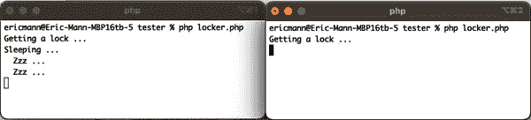

# 第十章：文件处理

Unix 和 Linux 周围最常见的设计哲学之一是“一切皆文件”。这意味着，无论您正在交互的资源是什么，操作系统都会将其视为本地磁盘上的文件。这包括对其他系统的远程请求以及对正在运行的进程输出的处理。

PHP 将请求、进程和资源类似地处理，但语言不认为一切皆文件，而是将一切视为流资源。第十一章详细介绍了流，但对于本章重要的一点是 PHP 在内存中如何处理流。

在访问文件时，PHP 不一定会将文件的所有数据读入内存。相反，它会在内存中创建一个引用文件位置的 `resource`，并有选择地从文件中缓冲字节。然后 PHP 直接访问或操作这些缓冲的字节作为流。然而，这章节的配方中并不需要了解流的基础知识。

PHP 的文件方法——`fopen()`、`file_get_contents()` 等——都在底层使用 `file://` 流包装器。但请记住，如果 PHP 中的一切都是流，您同样可以轻松地使用其他流协议，包括 `php://` 和 `http://`。

## Windows 与 Unix

PHP 可供在 Windows 和 Unix 风格的操作系统（包括 Linux 和 macOS）上使用。重要的是要理解，Windows 背后的底层文件系统与 Unix 风格系统非常不同。Windows 并不认为“一切皆文件”，有时对文件和目录名称的大小写敏感性会以意想不到的方式起作用。

如您将在配方 10.6 中看到的那样，操作系统范式之间的差异也会导致函数行为上的细微差异。具体来说，如果您的程序在 Windows 上运行，由于底层操作系统调用的差异，文件锁定将有所不同。

接下来的示例涵盖了在 PHP 中可能遇到的最常见的文件系统操作，从打开和操作文件到阻止其他进程触及它们。

# 10.1 创建或打开本地文件

## 问题

您需要在本地文件系统上打开文件进行读取或写入。

## 解决方案

使用 `fopen()` 打开文件并返回一个资源引用，以供进一步使用：

```php
$fp = fopen('document.txt', 'r');
```

## 讨论

在 PHP 内部，打开的文件被表示为一个流。您可以根据当前文件指针的位置从流中读取数据或向流中写入数据。在解决方案示例中，您已经打开了一个只读流（尝试向该流写入将失败），并将指针定位在文件的开头。

示例 10-1 展示了如何从文件中读取任意数量的字节，然后通过将其引用传递给 `fclose()` 函数关闭流。

##### 示例 10-1\. 从缓冲区中读取字节

```php
while (($buffer = fgets($fp, 4096)) !== false) { 
    echo $buffer; 
}

fclose($fp); 
```


`fgets()` 函数从指定的资源中读取一行，停止条件为遇到换行符或者已从底层流中读取了指定的字节数（4,096）。如果没有数据可读，则函数返回 `false`。


一旦将数据缓冲到变量中，您可以随意处理它。在这种情况下，将该单行打印到控制台。


使用文件内容后，应显式关闭和清理您创建的资源。

除了读取文件外，`fopen()` 还允许任意写入、文件追加、覆盖或截断。每个操作由作为第二参数传递的模式确定——解决方案示例传递 `r` 以指示只读模式。附加模式在 表 10-1 中描述。

表 10-1\. `fopen()` 可用的文件模式

| Mode | 描述 |
| --- | --- |
| `r` | 仅用于读取；将文件指针放在文件开头。 |
| `w` | 仅用于写入；将文件指针放在文件开头并截断文件为 0 长度。如果文件不存在，则尝试创建。 |
| `a` | 仅用于写入；将文件指针放在文件末尾。如果文件不存在，则尝试创建。在此模式下，`fseek()` 不起作用，写入总是追加的。 |
| `x` | 创建并仅用于写入；将文件指针放在文件开头。如果文件已存在，则 `fopen()` 调用将失败并返回 `false`，生成 `E_WARNING` 级别的错误。如果文件不存在，则尝试创建。 |
| `c` | 仅用于写入；打开文件。如果文件不存在，则创建。如果存在，则不截断（与 `w` 相反），并且调用此函数不会失败（与 `x` 相反）。文件指针放在文件开头。 |
| `e` | 在打开的文件描述符上设置执行时关闭标志。 |

对于文档 表 10-1 中记录的所有文件模式 *除了* `e`，您可以在模式末尾添加字面上的 `+` 号以打开文件以进行读取 *和* 写入，而不是单一操作。

`fopen()` 函数不仅适用于本地文件。默认情况下，该函数假定您想要使用本地文件系统，因此不需要显式指定 `file://` 协议处理程序。但是，您也可以轻松地通过使用 `http://` 或 `ftp://` 处理程序引用远程文件，如下所示：

```php
$fp = fopen('https://eamann.com/', 'r');
```

###### 注意

尽管可以包含远程文件，但在许多情况下可能存在风险，因为您可能无法始终控制远程文件系统返回的内容。通常建议通过切换系统配置中的 `allow_url_include` 来禁用远程文件访问。请参阅[PHP 运行时配置文档](https://oreil.ly/-gXR-)以了解如何实施此更改。

可选的第三个参数允许 `fopen()` 在需要时在[系统包含路径](https://oreil.ly/3S1lo)中搜索文件。默认情况下，PHP 仅在本地目录中搜索（或在指定时使用绝对路径）。从系统包含路径加载文件有助于代码重用，因为您可以指定单独的类或配置文件，而无需在整个项目中复制它们。

## 参见

PHP 文件系统的文档，特别是 [`fopen()`](https://oreil.ly/7yQG-)。

# 10.2 读取文件到字符串

## 问题

您希望将整个文件读入变量，以便在应用程序的其他位置使用。

## 解决方案

使用 `file_get_contents()` 如下：

```php
$config = file_get_contents('config.json');

if ($config !== false) {
    $parsed = json_decode($config);

    // ...
}
```

## 讨论

`file_get_contents()` 函数打开一个文件进行读取，将该文件的所有数据读入变量，然后关闭文件，允许您将该数据作为字符串使用。这在功能上等同于手动使用 `fread()` 将文件读入字符串，如示例 10-2 所示。

##### 示例 10-2\. 使用 `fread()` 手动实现 `file_get_contents()`

```php
function fileGetContents(string $filename): string|false
{
    $buffer = '';
    $fp = fopen($filename, 'r');

    try {
        while (!feof($fp)) {
            $buffer .= fread($fp, 4096);
        }
    } catch(Exception $e) {
        $buffer = false;
    } finally {
        fclose($fp);
    }

    return $buffer;
}

$config = fileGetContents('config.json');
```

尽管可以手动将文件读入内存，如示例 10-2 所示，但专注于编写简单程序并利用语言提供的函数处理复杂操作是一个更好的主意。 `file_get_contents()` 函数是用 C 语言实现的，为您的应用程序提供了高性能。它是二进制安全的，并利用操作系统提供的内存映射功能来实现最佳性能。

像 `fread()` 一样，`file_get_contents()` 可以将本地和远程文件读入内存。如果将可选的第二个参数设置为 `true`，它还可以在系统包含路径中搜索文件。

像 `fread()` 的并行操作 `fwrite()` 一样，还有一个称为 `file_put_contents()` 的自动写入等效函数。此函数封装了打开文件并用变量中的字符串数据覆盖其内容的复杂性。以下示例演示了如何将对象编码为 JSON 并写入静态文件：

```php
$config = new Config(/** ... **/);
$serialized = json_encode($config);

file_put_contents('config.json', $serialized);
```

## 参见

[`file_​get_​contents()`](https://oreil.ly/5pRBt) 和 [`file_​put_​con⁠tents()`](https://oreil.ly/4W0rG) 的文档。

# 10.3 读取文件的特定片段

## 问题

您希望从文件中的特定位置读取一组特定字节。

## 解决方案

使用 `fopen()` 创建资源，使用 `fseek()` 在文件中重新定位指针，并使用 `fread()` 从该位置读取数据如下：

```php
$fp = fopen('document.txt', 'r');
fseek($fp, 32, SEEK_SET);

$data = fread($fp, 32);
```

## 讨论

默认情况下，以读取模式打开的`fopen()`将文件作为资源打开，并将其指针放在文件开头。当你开始从文件中读取字节时，指针将向前移动，直到达到文件末尾。你可以使用`fseek()`来将指针设置到资源内的任意位置，默认情况是文件的开头。

在解决方案示例中的第三个参数——`SEEK_SET`——告诉 PHP 在何处添加偏移量。你有三个选项：

+   `SEEK_SET`（默认）从文件开头设置指针。

+   `SEEK_CUR` 将偏移量添加到当前指针位置。

+   `SEEK_END` 在文件末尾添加偏移量。这对于通过将负偏移量设置为第二个参数来读取文件中的最后几个字节非常有用。

假设你想从 PHP 内部读取长日志文件的最后几个字节。你可以像解决方案示例中读取任意字节一样进行，但是使用负偏移量，如下所示：

```php
$fp = fopen('log.txt', 'r');
fseek($fp, -4096, SEEK_END);

echo fread($fp, 4096);

fclose($fp);
```

注意，即使在前面片段中的日志文件少于 4,096 字节长，PHP 也不会读取超出文件开头的部分。解释器将会把指针放在文件开头并从那个位置开始读取字节。同样地，无论你在调用`fread()`时指定多少字节，都不能超过文件末尾。

## 另请参阅

Recipe 10.1 了解更多关于`fopen()`，以及关于[`fread()`](https://oreil.ly/Gb2m5)和[`fseek()`](https://oreil.ly/Tl6gs)的文档。

# 10.4 修改文件

## 问题

你想要修改文件的特定部分。

## 解决方案

使用`fopen()`打开文件进行读取和写入，然后使用`fseek()`将指针移动到要更新的位置并覆盖从该位置开始的一定数量字节。例如：

```php
$fp = fopen('resume.txt', 'r+');
fseek($fp, 32);

fwrite($fp, 'New data', 8);

fclose($fp);
```

## 讨论

如 Recipe 10.3 中所示，`fseek()`函数被利用来将指针移动到文件中的任意位置。然后，使用`fwrite()`在关闭资源之前将特定的一组字节写入文件。

传递给`fwrite()`的第三个参数告诉 PHP 要写入多少字节。默认情况下，系统将写入第二个参数传递的所有数据，但你可以通过指定字节计数来限制写入的数据量。在解决方案示例中，写入长度设置为数据长度是多余的。这种功能的更现实的例子可能如下所示。

```php
$contents = 'the quick brown fox jumped over the lazy dog';
fwrite($fp, $contents, 9);
```

注意，Solution 示例中的解决方案会在典型的读取模式上添加一个加号；这会同时打开文件以进行读取*和*写入。以其他模式打开文件会导致非常不同的行为：

+   `w`（写入模式），无论是否具有读取能力，都会在你对文件进行其他任何操作之前截断文件！

+   `a`（追加模式），无论是否具有读取能力，都会将文件指针强制移到文件末尾。对 `fseek()` 的调用将*不*按预期移动文件指针，并且您的新数据将始终追加到文件中。

## 参见

配方 10.3 获取关于在 PHP 中使用文件进行随机 I/O 的更多信息。

# 10.5 同时向多个文件写入

## 问题

您希望同时将数据写入多个文件。例如，您希望同时将数据写入本地文件系统和控制台。

## 解决方案

使用 `fopen()` 打开多个资源引用并在循环中写入它们：

```php
$fps = [
    fopen('data.txt', 'w'),
    fopen('php://stdout', 'w')
];

foreach ($fps as $fp) {
    fwrite($fp, 'The wheels on the bus go round and round.');
}
```

## 讨论

PHP 通常是一个单线程系统，必须逐个执行操作。¹ 虽然解决方案示例将为两个文件引用产生输出，但它将首先写入一个文件，然后再写入另一个文件。实际上，这足够快以被接受，但并非真正同时进行。

即使存在这种限制，知道您可以轻松地将相同的数据写入多个文件，使得同时处理多个潜在输出变得相对简单。与在解决方案示例中制定有限文件数量的过程化方法不同，您甚至可以将此类操作抽象成一个类，如 示例 10-3 所示：

##### 示例 10-3\. 用于抽象多个文件操作的简单类

```php
class MultiFile
{
    private array $handles = [];

    public function open(
        string $filename,
        string $mode = 'w',
        bool $use_include_path = false,
        $context = null
        ): mixed
    {
        $fp = fopen($filename, $mode, $use_include_path, $context);

        if ($fp !== false) {
            $this->handles[] = $fp;
        }

        return $fp;
    }

    public function write(string $data, ?int $length = null): int|false
    {
        $success = true;
        $bytes = 0;

        foreach($this->handles as $fp) {
            $out = fwrite($fp, $data, $length);
            if ($out === false) {
                $success = false;
            } else {
                $bytes = $out;
            }
        }

        return $success ? $bytes : false;
    }

    public function close(): bool
    {
        $return = true;

        foreach ($this->handles as $fp) {
            $return = $return && fclose($fp);
        }

        return $return;
    }
}
```

由 示例 10-3 定义的类允许您轻松地将写操作绑定到多个文件句柄，并在需要时进行清理。与逐个打开每个文件并手动迭代它们不同，您只需实例化该类，添加您的文件，然后进行操作。例如：

```php
$writer = new MultiFile();
$writer->open('data.txt');
$writer->open('php://stdout');

$writer->write("Row, row, row your boat\nGently down the stream.");

$writer->close();
```

PHP 对资源指针的内部处理非常高效，并使您能够使用最小的开销写入任意数量的文件或流。像 示例 10-3 这样的抽象类似地使您能够专注于应用程序的业务逻辑，同时 PHP 为您处理资源句柄（及相关的内存分配）。

## 参见

关于 [PHP 的 `stdout` 流](https://oreil.ly/i0kSI) 的文档。

# 10.6 锁定文件以防止其他进程访问或修改

## 问题

您希望在运行脚本时防止另一个 PHP 进程操作文件。

## 解决方案

使用 `flock()` 锁定文件如下：

```php
$fp = fopen('myfile.txt', 'r');

if (flock($fp, LOCK_EX)) {
    // ... Do whatever reading you need

    flock($fp, LOCK_UN);
} else {
    echo 'Could not lock file!';
    exit(1);
}
```

## 讨论

通常情况下，您需要打开一个文件来读取其数据或向其写入内容，但要确保在您操作文件时没有其他脚本会操纵该文件。最安全的做法是显式锁定文件。

###### 警告

在 Windows 上，PHP 利用操作系统本身强制执行的*强制锁定*。一旦文件被锁定，其他进程就无法打开该文件。在基于 Unix 的系统上（包括 Linux 和 macOS），PHP 使用*咨询锁定*。在这种模式下，操作系统可以选择忽略不同进程之间的锁。虽然多个 PHP 脚本通常会尊重锁定，但其他进程可能完全忽略它。

显式文件锁定会阻止其他进程读取或写入同一文件，具体取决于锁的类型。PHP 支持两种锁定方式：共享锁(`LOCK_SH`)仍然允许读取，独占锁(`LOCK_EX`)则完全阻止其他进程访问文件。

如果在一台机器上运行解决方案示例代码两次（在解锁文件之前调用类似`sleep()`的长时间阻塞操作），第二个进程会暂停并等待锁释放后再执行。更具体的示例见示例 10-4。

##### 示例 10-4\. 长时间运行的文件锁演示

```php
$fp = fopen('myfile.txt', 'r');

echo 'Getting a lock ...' . PHP_EOL;
if (flock($fp, LOCK_EX)) {
    echo 'Sleeping ...' . PHP_EOL;
    for($i = 0; $i < 3; $i++) {
        sleep(10);
        echo '  Zzz ...' . PHP_EOL;
    }

    echo 'Unlocking ...' . PHP_EOL;
    flock($fp, LOCK_UN);
} else {
    echo 'Could not lock file!';
    exit(1);
}
```

在两个分开的终端中并排运行上述程序，可以说明锁定的工作原理，如图 10-1 所示。第一次执行将获取文件锁，并继续按预期操作。第二次将等待直到锁可用，并在获取锁之后继续操作。



###### 图 10-1\. 两个进程无法在单个文件上获取相同的锁

## 参见

[`flock()`文档](https://oreil.ly/BRBO5)的文档。

¹ 第十七章详细介绍了并行和异步操作，以解释如何打破单线程范式。
