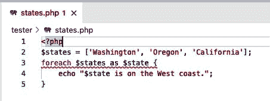

# 第十二章：错误处理

> 鼠辈和人类的美好计划往往会遭遇波折。
> 
> 改编自罗伯特·彭斯

如果你从事编程或软件开发工作，你可能非常熟悉错误和调试的过程。你可能甚至花费了与编写代码同等甚至更多的时间来追踪错误。这是软件的一个不幸定律——无论一个团队多么努力地构建正确的软件，总会不可避免地出现需要识别和纠正的故障。

幸运的是，PHP 使得查找错误相对简单。语言的宽容性通常也使得错误更像是一个讨厌而不是致命的缺陷。

以下的技巧介绍了识别和处理代码中错误的最快最简单的方法。它们还详细说明了如何编写和处理由第三方 API 输出无效数据或其他不正确系统行为抛出的自定义异常。

# 12.1 寻找和修复解析错误

## 问题

PHP 编译器在你的应用程序中未能解析脚本；你希望尽快找到并纠正问题。

## 解决方案

在文本编辑器中打开有问题的文件，并查看解析器标记的语法错误行。如果问题不明显，逐行向后查找代码，直到找到问题并在文件中进行修正。

## 讨论

PHP 是一种相对宽容的语言，通常会尝试让即使是不正确或有问题的脚本运行完成。但在许多情况下，解析器无法正确解释一行代码来确定应该做什么，而是会返回一个错误。

例如，编写一个虚构的示例，循环遍历美国西部的州：

```php
$states = ['Washington', 'Oregon', 'California'];
foreach $states as $state {
    print("{$state} is on the West coast.") . PHP_EOL;
}
```

当在 PHP 解释器中运行时，这段代码将在第二行抛出一个`Parse error`：

```php
PHP Parse error:  syntax error, unexpected variable "$states", expecting "("
in php shell code on line 2
```

仅根据这个错误消息，你就可以准确定位到有问题的行。请记住，尽管`foreach`是一种语言结构，但它仍然类似于带有括号的函数调用。遍历数组状态的正确方法如下：

```php
$states = ['Washington', 'Oregon', 'California'];
foreach ($states as $state) {
    print("{$state} is on the West coast.") . PHP_EOL;
}
```

这种特定错误——在使用语言结构时省略括号——在经常在不同语言之间移动的开发人员中很常见。例如，在 Python 中，同样的机制看起来几乎一样，但在省略`foreach`调用的括号时是语法正确的。例如：

```php
states = ['Washington', 'Oregon', 'California']
for state in states:
    print(f"{state} is on the West coast.")
```

这两种语言的语法非常相似，这种相似性令人困惑。不过，它们之间的差异足够大，以至于每种语言的解析器都会捕捉到这些差异，并在你在项目之间切换时警告你，如果你犯了这样的错误。

幸运的是，像[Visual Studio Code](https://oreil.ly/CkzbA)这样的集成开发环境会自动解析你的脚本，并为你突出显示任何语法错误。图 12-1 说明了这种突出显示如何相对容易地跟踪和纠正问题，使得在你的应用程序运行之前就能发现问题。



###### 图 12-1\. 在应用程序运行之前，Visual Studio Code 将识别和突出显示语法错误

## 另请参阅

[令牌列表](https://oreil.ly/Zw_1I)，PHP 解析器使用的源代码的各个部分。

# 12.2 创建和处理自定义异常

## 问题

当事情出错时，您希望您的应用程序抛出（并捕获）一个自定义异常。

## 解决方案

扩展基础 `Exception` 类以引入自定义行为，然后利用 `try`/`catch` 块来捕获和处理异常。

## 讨论

PHP 定义了一个基本的 [`Throwable`](https://oreil.ly/NkLuC) 接口，由语言中任何错误或异常实现。内部问题由 [`Error`](https://oreil.ly/eFMGz) 类及其后代表示，而用户端的问题由 `Exception` 类及其后代表示。

通常情况下，您只会在应用程序中扩展 `Exception` 类，但您可以在标准的 `try`/`catch` 块中捕获任何 `Throwable` 实现。

例如，假设您正在实现一个带有非常精确自定义功能的除法函数：

1.  不允许被零除。

1.  所有的小数值将向下舍入。

1.  整数 42 作为分子是无效的。

1.  分子必须是整数，但分母也可以是浮点数。

这样的函数可能利用内置错误如 `ArithmeticError` 或 `DivisionByZeroError`。但在前述规则列表中，第三个需要自定义异常的规则显著。在定义您的函数之前，您将像 示例 12-1 中那样定义一个自定义异常。

##### 示例 12-1\. 简单的自定义异常定义

```php
class HitchhikerException extends Exception
{
    public function __construct(int $code = 0, Throwable $previous = null)
    {
        parent::__construct('42 is indivisible.', $code, $previous);
    }

    public function __toString()
    {
        return __CLASS__ . ": [{$this->code}]: {$this->message}\n";
    }
}
```

一旦自定义异常存在，您可以在自定义的除法函数中使用 `throw` 来抛出它，如下所示：

```php
function divide(int $numerator, float|int $denominator): int
{
    if ($denominator === 0) {
        throw new DivisionByZeroError;
    } elseif ($numerator === 42) {
        throw new HitchhikerException;
    }

    return floor($numerator / $denominator);
}
```

一旦您定义了自定义功能，就可以在应用程序中利用该代码。您知道该函数 *可能* 会抛出错误，因此重要的是在 `try` 语句中包装任何调用，并适当处理该错误。示例 12-2 将在四对数字上迭代，尝试每个的除法，并处理任何随后抛出的错误/异常。

##### 示例 12-2\. 处理自定义除法中的错误

```php
$pairs = [
    [10, 2],
    [2, 5],
    [10, 0],
    [42, 2]
];

foreach ($pairs as $pair) {
    try {
        echo divide($pair[0], $pair[1]) . PHP_EOL;
    } catch (HitchhikerException $he) { 
        echo 'Invalid division of 42!' . PHP_EOL;
    } catch (Throwable $t) { 
        echo 'Look, a rabid marmot!' . PHP_EOL;
    }
}
```


如果 42 被作为分子传入，`divide()` 函数将抛出 `Hitchhi⁠ker​Exception` 并且无法恢复。捕获此异常允许您向应用程序或用户提供反馈，并继续执行。


由函数抛出的任何其他 `Error` 或 `Exception` 都将作为 `Throwable` 的实现捕获。在这种情况下，您会丢弃该错误并继续进行。

## 另请参阅

关于以下的文档：

+   基础 [`Exception` 类](https://oreil.ly/2s4mN)

+   [预定义异常列表](https://oreil.ly/TdeGN)

+   附加的异常[如标准 PHP 库（SPL）定义的](https://oreil.ly/GSDEg)

+   [通过扩展创建自定义异常](https://oreil.ly/-jrVt)

+   [PHP 7 中的错误层次结构](https://oreil.ly/KF1Zd)

# 12.3 隐藏最终用户的错误消息

## 问题

你已经修复了所有已知的错误，并准备好在生产环境中启动你的应用程序。但是你也希望防止任何新错误被显示给最终用户。

## 解决方案

要在生产环境完全抑制错误，请将*php.ini*中的`error_reporting`和`dis⁠play_​errors`指令都设置为`Off`，如下所示：

```php
; Disable error reporting
error_reporting = Off
display_errors  = Off
```

## 讨论

解决方案示例中提出的配置更改将影响你的整个应用程序。错误将完全被抑制，即使它们被抛出，也不会显示给最终用户。直接向用户显示错误或未处理的异常被认为是一种不良做法。如果堆栈跟踪直接显示给应用程序的最终用户，这可能还会导致安全问题。

然而，如果你的应用程序行为异常，开发团队将无法记录任何信息以进行诊断和处理。

对于生产环境实例，将`display_errors`设置为`Off`仍将隐藏来自最终用户的错误，但是恢复到默认的`error_reporting`级别将可靠地将任何错误发送到日志中。

虽然可能有一些特定页面存在已知的错误（由于遗留代码、编写不良的依赖项或已知的技术债务），你希望在这些情况下省略它们。在这种情况下，你可以通过使用 PHP 中的`error_​reporting()`函数来*编程*设置错误报告级别。该函数接受一个新的错误报告级别，并返回先前设置的级别（如果之前没有配置，则使用默认级别）。

因此，您可以使用对`error_reporting()`的调用来包装有问题的代码块，并防止在日志中显示太多的错误信息。例如：

```php
$error_level = error_reporting(E_ERROR); 

// ... Call your other application code here. 
error_reporting($error_level); 
```


将错误级别设置为绝对最小值，只包括导致脚本执行停止的致命运行时错误。


将错误级别返回到其先前的状态。

默认错误级别是`E_ALL`，它会显示所有错误、警告和通知。¹ 您可以使用整数报告级别来覆盖这一设置，但 PHP 提供了几个命名常量，代表每个潜在的设置。这些常量在表 12-1 中枚举。

###### 注意

在 PHP 8.0 之前，默认的错误报告级别从`E_ALL`开始，然后显式地移除了诊断通知（`E_NOTICE`）、严格类型警告（`E_STRICT`）和已弃用通知（`E_DEPRECATED`）。

表 12-1\. 错误报告级别常量

| 整数值 | 常量 | 描述 |
| --- | --- | --- |
| 1 | `E_ERROR` | 导致脚本执行停止的致命运行时错误。 |
| 2 | `E_WARNING` | 运行时警告（非致命错误），不会停止脚本执行。 |
| 4 | `E_PARSE` | 解析器生成的编译时错误。 |
| 8 | `E_NOTICE` | 运行时通知，指示脚本遇到可能表明错误但也可能在正常运行脚本过程中发生的情况。 |
| 16 | `E_CORE_ERROR` | 在 PHP 初始启动期间发生的致命错误。这类似于`E_ERROR`，但由 PHP 核心生成。 |
| 32 | `E_CORE_WARNING` | 在 PHP 初始启动期间发生的警告（非致命错误）。这类似于`E_WARNING`，但是由 PHP 核心生成。 |
| 64 | `E_COMPILE_ERROR` | 致命的编译时错误。这类似于`E_ERROR`，但由 Zend 脚本引擎生成。 |
| 128 | `E_COMPILE_​WARN⁠ING` | 编译时警告（非致命错误）。这类似于`E_WARNING`，但由 Zend 脚本引擎生成。 |
| 256 | `E_USER_ERROR` | 用户生成的错误消息。这类似于`E_ERROR`，但通过使用 PHP 函数 [`trigger_error()`](https://oreil.ly/eNgVf) 在 PHP 代码中生成。 |
| 512 | `E_USER_WARNING` | 用户生成的警告消息。这类似于`E_WARNING`，但通过使用 PHP 函数 `trigger_error()` 在 PHP 代码中生成。 |
| 1024 | `E_USER_NOTICE` | 用户生成的通知消息。这类似于`E_NOTICE`，但通过使用 PHP 函数 `trigger_error()` 在 PHP 代码中生成。 |
| 2048 | `E_STRICT` | 启用以使 PHP 建议更改您的代码，以确保最佳的代码互操作性和向前兼容性。 |
| 4096 | `E_RECOVERA⁠BLE_​ERROR` | 可捕获的致命错误。发生了一个危险错误，但 PHP 并不不稳定，可以恢复。如果错误未被用户定义的处理程序捕获（参见 Recipe 12.4），则应用程序会像处理 `E_ERROR` 一样中止。 |
| 8192 | `E_DEPRECATED` | 运行时通知。启用此选项以接收有关将来版本中将不起作用的代码的警告。 |
| 16384 | `E_USER_​DEPRE⁠CATED` | 用户生成的警告消息。这类似于`E_DEPRECATED`，但通过使用 PHP 函数 `trigger_error()` 在 PHP 代码中生成。 |
| 32767 | `E_ALL` | 所有错误、警告和通知。 |

注意你可以通过二进制操作结合错误级别，创建一个位掩码。一个简单的错误报告级别可能包括单独的错误、警告和解析器错误（忽略核心、用户错误和通知）。以下内容将足够地设置这个级别：

```php
error_reporting(E_ERROR | E_WARNING | E_PARSE);
```

## 参见

有关 [`error_reporting()`](https://oreil.ly/b4eIH)、[`error_reporting` 指令](https://oreil.ly/t5IW2) 和 [`display_​errors` 指令](https://oreil.ly/lxXNs) 的文档。

# 12.4 使用自定义错误处理程序

## 问题

您想自定义 PHP 处理和报告错误的方式。

## 解决方案

在 PHP 中将您的自定义处理程序定义为可调用函数，然后按以下方式将该函数传递给 `set_error_handler()`：

```php
function my_error_handler(int $num, string $str, string $file, int $line)
{
    echo "Encountered error $num in $file on line $line: $str" . PHP_EOL;
}

set_error_handler('my_error_handler');
```

## 讨论

PHP 将在大多数可恢复错误的情况下利用您的自定义处理程序。致命错误、核心错误和编译时问题（如解析器错误）要么会停止要么完全阻止程序执行，并且不能通过用户函数处理。具体来说，`E_ERROR`、`E_PARSE`、`E_CORE_ERROR`、`E_CORE_WARNING`、`E_COMPILE_ERROR`和`E_COMPILE_WARNING`错误永远不能被捕获。此外，在调用`set_error_handler()`的文件中大多数`E_STRICT`错误也不能被捕获，因为这些错误会在正确注册自定义处理程序之前被抛出。

如果您定义了一个与解决方案示例中一致的自定义错误处理程序，任何可捕获的错误都将调用此函数并将数据打印到屏幕上。如在示例 12-3 中所示，尝试`echo`一个未定义的变量将会导致一个`E_WARNING`错误。

##### 示例 12-3\. 捕获可恢复的运行时错误

```php
echo $foo;
```

使用解决方案示例中定义并注册的`my_error_handler()`，在示例 12-3 中的错误代码将打印以下文本到屏幕上，引用了`E_WARNING`错误类型的整数值：

```php
Encountered error 2 in php shell code on line 1: Undefined variable $foo
```

一旦您捕获了一个错误以处理它，如果该错误会导致应用程序不稳定，您有责任调用`die()`来停止执行。PHP 不会在处理程序外部为您执行此操作，而是会继续处理应用程序，就像没有抛出错误一样。

如果您在应用程序的某个部分处理错误后，希望恢复原始（默认）错误处理程序，则应通过调用`restore_error_​han⁠dler()`来执行。这仅仅是还原了您之前注册的错误处理程序，并恢复了以前注册的任何错误处理程序。

类似地，PHP 允许您注册（和恢复）自定义异常处理程序。它们与自定义错误处理程序的操作相同，但不同的是它们会捕获在`try`/`catch`块之外抛出的任何异常。与错误处理程序不同的是，程序执行在调用自定义异常处理程序后将会停止。

要了解更多关于异常的信息，请查看配方 12.2 以及[`set_exception_handler()`](https://oreil.ly/_pf4H)和[`restore_exception_&#x200b;han&#x2060;dler()`](https://oreil.ly/TOEuz)的文档。

## 参见

关于[`set_error_handler()`](https://oreil.ly/IAh69)和[`restore_error_handler()`](https://oreil.ly/SlT_d)的文档。

# 12.5 记录错误到外部流

## 问题

您希望将应用程序错误记录到文件或外部某种资源以便未来调试。

## 解决方案

使用`error_log()`将错误写入默认日志文件，方法如下：

```php
$user_input = json_decode($raw_input);
if (json_last_error() !== JSON_ERROR_NONE) {
    error_log('JSON Error #' . json_last_error() . ': ' . $raw_input);
}
```

## 讨论

默认情况下，`error_log()`会将错误记录到由*php.ini*中的[`error_log`指令](https://oreil.ly/3lVPn)指定的位置。在类 Unix 系统上，通常会是*/var/log*内的文件，但可以自定义到系统中的任何位置。

`error_log()`的可选第二个参数允许您在必要时路由错误消息。如果服务器已设置发送电子邮件，则可以指定消息类型为`1`，并为可选的第三个参数提供电子邮件地址以通过电子邮件发送错误。例如：

```php
error_log('Some error message', 1, 'developer@somedomain.tld');
```

###### 注意

在底层，`error_log()`将使用与`mail()`相同的功能来通过电子邮件发送错误。在许多情况下，出于安全目的，可能已禁用此功能。在依赖此功能之前，请务必验证任何邮件系统的功能，特别是在生产环境中。

或者，您可以指定一个*不同*于默认日志位置的文件作为目标，并将整数`3`作为消息类型传递。PHP 将消息直接追加到该文件而不是写入默认日志。例如：

```php
error_log('Some error message', 3, 'error_log.txt');
```

###### 警告

当使用`error_log()`直接记录到文件时，系统*不会*自动追加换行符。您需要负责在任何字符串后附加`PHP_EOL`或编码`\r\n`换行文字。

第十一章详细介绍了文件协议以及 PHP 公开的其他流。请记住，直接引用文件路径实际上是透明地利用了`file://`协议，因此，实际上您是在前面的代码块中将错误记录到文件*流*。只要正确引用流协议，您可以轻松地引用任何其他类型的流。以下示例直接将错误记录到控制台的标准错误流：

```php
error_log('Some error message', 3, 'php://stderr');
```

## 参见

[错误日志函数(`error_log()`)](https://oreil.ly/QUQRH)的文档以及配方 13.5 中对 Monolog 的覆盖，Monolog 是用于 PHP 应用程序的更全面的日志记录库。

¹ 默认错误级别可以直接在*php.ini*中设置，在许多环境中可能已经设置为`E_ALL`以外的某些值。确认您自己环境的配置以确保准确。
