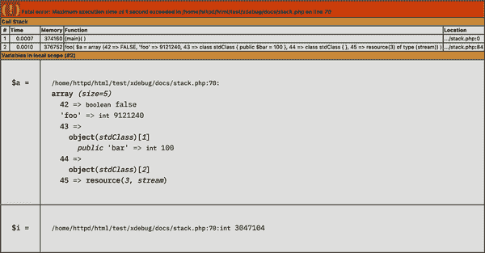
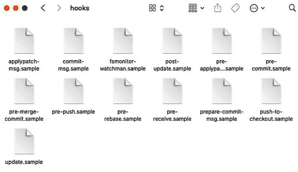
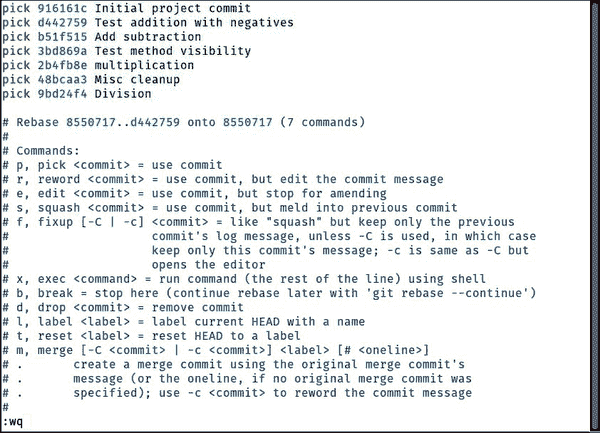
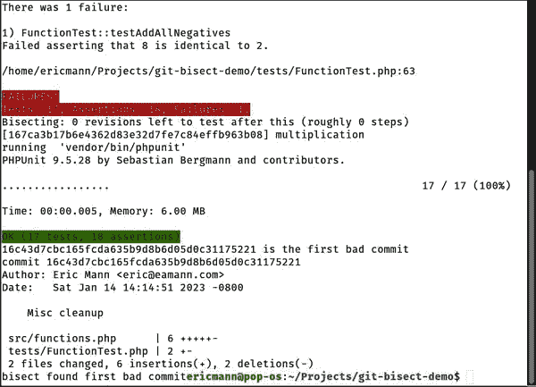

# 第十三章：调试和测试

尽管开发人员尽力而为，但没有任何代码是完美的。您将不可避免地引入一个会影响应用程序生产行为或在某些操作未按预期方式运行时导致最终用户烦恼的错误。

在应用程序中正确处理错误是至关重要的¹。然而，并非应用程序抛出的每个错误都是预期的或者可以捕获的。在这些情况下，您必须了解如何正确*调试*应用程序——即如何跟踪到有问题的代码行，以便进行修复。

PHP 工程师在调试其代码时使用的第一步之一是`echo`语句。在没有正式调试器的情况下，通常会看到开发代码中散布着`echo "Here!";`语句，以便团队可以跟踪可能出现问题的地方。

Laravel 框架通过公开一个名为[`dd()`](https://oreil.ly/N-bOz)（简称“dump and die”）的函数，使得在新项目上工作时流行且易于访问类似的功能。此函数实际上是由 Symfony [`var-dumper`](https://oreil.ly/8pXGo)模块提供，并在 PHP 的本地命令行界面和使用交互式调试器时都能有效工作。该函数的定义如下：

```php
function dd(...$vars): void
{
    if (!in_array(\PHP_SAPI, ['cli', 'phpdbg'], true) && !headers_sent()) {
        header('HTTP/1.1 500 Internal Server Error');
    }

    foreach ($vars as $v) {
        VarDumper::dump($v);
    }

    exit(1);
}
```

在 Laravel 应用程序中使用上述函数将打印出您传递给它的任何变量的内容，并立即停止程序的执行。与使用`echo`一样，这并不是调试应用程序的最优雅方式。然而，它快速、可靠，并且是开发人员在赶时间调试系统时常用的方式。

通过单元测试是预防性调试代码的最佳方法。通过将代码分解为最小的逻辑单元，您可以编写额外的代码，自动测试和验证这些逻辑单元的功能。然后将这些测试连接到集成和部署管道中，可以确保在部署之前应用程序中没有任何问题。

开源项目[PHPUnit](https://phpunit.de)项目使得仪器化整个应用程序并自动测试其行为变得简单明了。所有的测试都是用 PHP 编写的，直接加载您应用程序的函数和类，并明确记录应用程序的正确行为。

###### 注意

PHPUnit 的一个替代品是开源[Behat](https://oreil.ly/mAWR5)库。虽然 PHPUnit 专注于测试驱动开发（TDD），Behat 专注于另一种*行为*驱动开发（BDD）范式。两者对于测试代码同样有用，您的团队应选择采取哪种方法。然而，PHPUnit 是一个更成熟的项目，并将在本章中被引用。

毫无疑问，调试代码的最佳方法是使用交互式调试器。 [Xdebug](https://xdebug.org) 是 PHP 的一个调试扩展，它改善了错误处理，支持跟踪或分析应用程序的行为，并与像 PHPUnit 这样的测试工具集成，以展示应用程序代码的测试覆盖率。更重要的是，Xdebug 还支持交互式逐步调试您的应用程序。

在使用 Xdebug 和兼容的 IDE 的情况下，您可以在代码中放置称为 *断点* 的标志。当应用程序运行并命中这些断点时，它会暂停执行并允许您交互地检查应用程序的状态。这意味着您可以查看所有作用域内的变量、它们的来源，并逐条执行程序以寻找错误。作为 PHP 开发人员，这绝对是您武器库中最强大的工具！

以下配方介绍了调试 PHP 应用程序的基础知识。您将学习如何设置交互式调试、捕获错误、正确测试代码以防止回归，并快速确定引入断裂更改的时间和位置。

# 13.1 使用调试器扩展

## 问题

您希望利用强大的外部调试器来检查和管理应用程序，以便在业务逻辑中识别、分析和消除错误。

## 解决方案

安装 Xdebug，这是一个用于 PHP 的开源调试扩展。例如，在 Linux 操作系统上，可以通过使用默认的包管理器直接安装 Xdebug。例如，在 Ubuntu 上，可以使用 `apt` 安装 Xdebug：

```php
$ sudo apt install php-xdebug
```

由于包管理器有时会安装项目的过时版本，您也可以直接使用 PECL 扩展管理器安装：

```php
$ pecl install xdebug
```

一旦在您的系统上启用了 Xdebug，它将自动为您美化错误页面，并提供丰富的堆栈跟踪和调试信息，以便在出现问题时更轻松地识别错误。

## 讨论

Xdebug 是一个强大的 PHP 扩展。它使您能够全面测试、分析和调试应用程序，这是语言本身不支持的。默认情况下，它带来的最有用的功能之一是大幅改进了错误报告。

默认情况下，Xdebug 将自动捕获应用程序抛出的任何错误，并展示关于以下内容的附加信息：

+   调用堆栈（如 图 13-1 所示），包括时间和内存使用数据。这帮助您准确地确定程序失败的时间以及函数调用发生的代码位置。

+   来自局部作用域的变量，这样您就不需要猜测错误抛出时内存中的数据。



###### 图 13-1\. Xdebug 丰富并格式化错误发生时呈现的信息

与 [Webgrind](https://oreil.ly/OXg9b) 等工具的高级集成还允许你动态地分析应用程序的性能。Xdebug 可以（可选地）记录每个函数调用的执行时间，并将该时间和函数调用的“成本”记录到磁盘上。然后，Webgrind 应用程序会呈现一个便捷的可视化界面，帮助你识别代码中的瓶颈，以便根据需要优化程序。

你甚至可以直接将 Xdebug 与你的开发环境配对，进行[逐步调试](https://oreil.ly/FK9iz)。通过将你的环境（例如 [Visual Studio Code](https://oreil.ly/u4dZy)）与 Xdebug 配置配对，你可以在代码中设置断点，并在 PHP 解释器到达这些点时暂停执行。

###### 注意

[PHP Debug](https://oreil.ly/vVCVY) 扩展使得 Xdebug 和 Visual Studio Code 之间的集成变得非常简单。它直接向你的 IDE 添加了所有你期望的额外接口，包括断点和环境内省。它也直接由 Xdebug 社区维护，所以你可以确保它与整个项目保持同步。

在逐步调试模式下，当应用程序到达断点时会暂停，并且你可以直接访问程序范围内的所有变量。你可以检查和*修改*这些变量以测试你的环境。此外，在断点暂停时，你可以完全访问应用程序的控制台，进一步识别可能发生的情况。调用堆栈也直接暴露出来，因此你可以深入了解导致断点的哪个函数或方法对象，并在必要时进行更改。

在断点中，你可以逐行逐步执行程序，或选择“继续”执行，直到下一个断点或程序抛出的第一个错误。断点也可以在不从 IDE 中移除的情况下禁用，因此你可以根据需要继续执行，但随时回顾特定的问题点。

###### 警告

Xdebug 是任何 PHP 开发团队的极其强大的开发工具。然而，已知即使在最小的应用程序中，它也会显著增加性能开销。确保你只在本地开发或在带有测试部署的受保护环境中启用此扩展。永远不要在生产环境中部署带有 Xdebug 的应用程序！

## 参见

[Xdebug](https://xdebug.org) 的文档和主页。

# 13.2 编写单元测试

## 问题

你希望验证一段代码的行为，以确保将来的重构不会改变应用程序的功能。

## 解决方案

编写一个扩展 PHPUnit 的 `TestCase` 的类，显式测试应用程序的行为。例如，如果你的函数旨在从电子邮件地址中提取域名，你可以定义如下：

```php
function extractDomain(string $email): string
{
    $parts = explode('@', $email);

    return $parts[1];
}
```

然后创建一个类来测试和验证此代码的功能。这样的测试看起来将类似于以下示例：

```php
use PHPUnit\Framework\TestCase;

final class FunctionTest extends TestCase
{
    public function testSimpleDomainExtraction()
    {
        $this->assertEquals('example.com', extractDomain('php@example.com'));
    }
}
```

## 讨论

PHPUnit 最重要的一点是如何组织您的项目。首先，项目需要利用 Composer 来自动加载您的应用程序代码以及加载任何依赖项（包括 PHPUnit 本身）。² 通常，您将把应用程序代码放在项目根目录下的*src/*目录中，而所有测试代码将与之相邻，位于*tests/*目录中。

在解决方案示例中，您应将您的`extractDomain()`函数放置在*src/functions.php*中，将`FunctionTest`类放置在*tests/FunctionTest.php*中。假设通过 Composer 正确配置了自动加载，您可以使用 PHPUnit 捆绑的命令行工具来运行测试，如下所示：

```php
$ ./vendor/bin/phpunit tests
```

默认情况下，前述命令将通过 PHPUnit 自动识别和运行位于您的*tests/*目录中定义的每个测试类。为了更全面地控制 PHPUnit 的运行方式，您可以利用本地配置文件来描述测试套件、文件允许列表，并配置测试期间需要的任何特定环境变量。

基于 XML 的配置通常仅用于复杂或复杂的项目，但[项目文档](https://oreil.ly/Gz86n)详细说明了如何配置它。可与此示例或其他类似简单项目一起使用的基本*phpunit.xml*文件看起来类似于示例 13-1。

##### 示例 13-1\. 基本 PHPUnit XML 配置

```php
<?xml version="1.0" encoding="UTF-8"?>

<phpunit bootstrap="vendor/autoload.php"
         backupGlobals="false"
         backupStaticAttributes="false"
         colors="true"
         convertErrorsToExceptions="true"
         convertNoticesToExceptions="true"
         convertWarningsToExceptions="true"
         processIsolation="false"
         stopOnFailure="false">

  <coverage>
    <include>
      <directory suffix=".php">src/</directory>
    </include>
  </coverage>

  <testsuites>
    <testsuite name="unit">
      <directory>tests</directory>
    </testsuite>
  </testsuites>

  <php>
    <env name="APP_ENV" value="testing"/>
  </php>

</phpunit>
```

借助项目中前述的*phpunit.xml*文件，您只需调用 PHPUnit 本身即可运行您的测试。您不再需要指定*tests/*目录，因为这已由应用程序配置中的`testsuite`定义提供。

类似地，您还可以为不同场景指定*多个*测试套件。也许一个测试集由开发团队主动编写代码时（在前述示例中是*unit*）构建。另一个测试集可能由质量保证（QA）团队编写，以复制用户报告的错误（*回归*）。第二个测试套件的优势在于，您可以重构应用程序直到测试通过（即修复了错误），同时确保未修改应用程序的整体行为。

您还可以确保旧的错误不会在以后出现！

此外，当运行 PHPUnit 时，通过传递可选的`--testsuite`标志，你可以选择在哪个时间运行哪个测试套件。大多数测试都会很快，这意味着它们可以频繁运行而不会为开发团队增加额外的时间成本。快速测试应该在开发过程中尽可能频繁地运行，以确保代码正常工作，并且没有新（或旧）的错误已经进入代码库。不过，有时候，你可能需要编写一个成本太高而不太频繁运行的测试。这些测试应该保留在单独的测试套件中，以便你可以绕过它们进行测试。这些测试保留在那里，可以在部署之前使用，但在标准测试频繁运行时不会减慢日常开发。

如解决方案示例中的函数测试那样，函数测试非常简单。对象测试类似于在测试中实例化对象并调用其方法。然而，最困难的部分是模拟特定函数或方法的多种可能输入。PHPUnit 通过数据提供者解决了这个问题。

作为一个简单的例子，考虑示例 13-2 中的`add()`函数。该函数明确使用宽松的类型来将两个值（无论其类型如何）相加。

##### 示例 13-2\. 简单加法函数

```php
function add($a, $b): mixed
{
    return $a + $b;
}
```

由于前述函数中的参数可以是不同类型的（`int`/`int`，`int`/`float`，`string`/`float`等），你应该测试各种组合，以确保没有任何问题。这样的测试结构看起来像示例 13-3 中的类。

##### 示例 13-3\. PHP 加法简单测试

```php
final class FunctionTest extends TestCase
{
    // ...

    /**
 * @dataProvider additionProvider
 */
    public function testAdd($a, $b, $expected): void
    {
        $this->assertSame($expected, add($a, $b));
    }

    public function additionProvider(): array
    {
        return [
            [2, 3, 5],
            [2, 3.0, 5.0],
            [2.0, '3', 5.0],
            ['2', 3, 5]
        ];
    }
}
```

`@dataProvider`注解告诉 PHPUnit 测试类中应使用的函数的名称，该函数用于提供测试数据。现在，你不需要显式编写四个单独的测试，而是为 PHPUnit 提供了一次以不同输入和期望输出运行一次测试的能力。最终结果是一样的——对`add()`函数的四个单独的测试，但无需显式编写这些额外的测试。

考虑到在示例 13-2 中定义的`add()`函数的结构，你可能会遇到 PHP 中某些类型限制的问题。虽然可以将数值字符串传递给函数（它们在相加之前会被转换为数值），但传递非数值数据将导致 PHP 警告。在将用户输入传递给该函数的情况下，这种问题可能会出现并将出现。最好通过显式使用`is_numeric()`检查输入值并抛出一个可以在其他地方捕获的已知异常来防范这种问题。

为了实现这一点，首先编写一个新的测试来*期望*异常，并验证它是否被适当地抛出。这样的一个测试看起来像示例 13-4。

##### 示例 13-4\. 测试代码中预期异常的存在

```php
final class FunctionTest extends TestCase
{
    // ...

    /**
 * @dataProvider invalidAdditionProvider
 */
    public function testInvalidInput($a, $b, $expected): void
    {
        $this->expectException(InvalidArgumentException::class);
        add($a, $b);
    }

    public function invalidAdditionProvider(): array
    {
        return [
            [1, 'invalid', null],
            ['invalid', 1, null],
            ['invalid', 'invalid', null]
        ];
    }
}
```

###### 警告

在修改代码之前编写测试非常有价值，因为它为您在重构时提供了精确的目标。然而，在您对应用程序代码进行更改之前，此新测试将失败。请注意不要将失败的测试提交到项目的版本控制中，否则将影响团队实施持续集成的能力！

在上述测试放置后，由于函数不符合文档或预期的行为，测试套件现在失败了。请花时间将适当的 `is_numeric()` 检查添加到函数中，如下所示：

```php
function add($a, $b): mixed
{
    if (!is_numeric($a) || !is_numeric($b)) {
        throw new InvalidArgumentException('Input must be numeric!');
    }

    return $a + $b;
}
```

单元测试是文档您的应用程序期望和适当行为的有效方式，因为它们是可执行代码，也验证应用程序是否正常运行。您可以测试成功 *和* 失败条件，甚至可以在代码中模拟各种依赖关系。

PHPUnit 项目还提供了主动识别应用程序代码的百分比 [通过单元测试覆盖率](https://oreil.ly/PEdVd) 的能力。更高的覆盖率百分比不能保证免受错误的影响，但是是一种可靠的方法，可以确保快速发现和纠正错误，对最终用户的影响最小。

## 另请参阅

使用 [PHPUnit](https://oreil.ly/5oYv4) 的文档。

# 13.3 自动化单元测试

## 问题

您希望项目的单元测试在提交到版本控制之前，无需用户交互地频繁运行。

## 解决方案

利用 Git 提交钩子在本地提交之前自动运行单元测试 *之前*。例如，示例 13-5 中的 `pre-commit` 钩子将在用户运行 `git commit` 时自动运行 PHPUnit，但在实际数据写入仓库之前。

##### 示例 13-5\. 用于 PHPUnit 的简单 Git `pre-commit` 钩子

```php
#!/usr/bin/env php
<?php

echo "Running tests.. ";
exec('vendor/bin/phpunit', $output, $returnCode);

if ($returnCode !== 0) {
  echo PHP_EOL . implode($output, PHP_EOL) . PHP_EOL;
  echo "Aborting commit.." . PHP_EOL;
  exit(1);
}

echo array_pop($output) . PHP_EOL;

exit(0);
```

## 讨论

Git 是目前最流行的分布式版本控制系统，并且也是核心 PHP 开发团队使用的系统。它是开源的，并且在托管存储库的方式以及如何自定义工作流程和项目结构方面非常灵活，以适应您的开发周期。

具体而言，Git 允许通过钩子进行自定义。您的钩子位于项目中的 *.git/hooks* 目录中，与 Git 用于跟踪项目状态的其他信息一起。即使是空的 Git 仓库默认也包含几个示例钩子，如 图 13-2 所示。



###### 图 13-2\. Git 初始化即使是空仓库也会带有示例钩子

每个示例钩子都带有 `.sample` 扩展名，以默认禁用它们。如果您希望使用示例钩子，只需删除该扩展名，钩子将在该操作上运行。

在自动化测试的情况下，您需要显式使用 `pre-commit` 钩子，并应创建一个名为 Example 13-5 的文件，其中包含钩子的内容。使用该钩子后，Git 将始终在提交代码之前运行此脚本。

脚本末尾的`0`退出状态告诉 Git 一切正常，可以继续提交。如果您的单元测试中有任何失败，`1`退出状态将标记出现了问题，提交将在不修改您的仓库的情况下中止。

如果您绝对确定自己知道在做什么，并且出于任何原因需要覆盖钩子，您可以在提交代码时添加`--no-verify`标志来绕过钩子。

###### 警告

`pre-commit` 钩子完全在客户端运行，并且存在于您的代码库之外。每个开发者都需要单独安装该钩子。除了团队指南或公司政策外，没有有效的方法来强制使用该钩子（或者防止某人使用`--no-verify`绕过它）。

如果您的团队正在使用 Git 进行版本控制，那么很有可能您也在使用 GitHub 托管您的存储库的某个版本。如果是这样，您可以利用 GitHub Actions 在 GitHub 的服务器上运行 PHPUnit 测试，作为集成和部署管道的一部分。

本地运行测试有助于防止意外地将*回归*（重新引入已知错误的代码）或其他错误提交到代码库中。在云中运行相同的测试功能更强大，因为可以跨可能的配置矩阵执行测试。开发者通常只会在本地运行单个版本的 PHP，但您可以在服务器上的容器中运行应用程序代码和测试，并利用各种版本的 PHP 或不同的依赖版本。

使用 GitHub Actions 运行测试还提供以下好处：

+   如果新开发者还没有设置他们的 Git `pre-commit` 钩子并提交了错误的代码，操作运行程序将立即标记该提交为错误，并防止开发者意外地发布错误到生产环境。

+   在云中使用确定性环境可以保护您的团队免受“在我的机器上可以运行”的问题影响，即代码在一个本地环境中可以工作，但在具有不同配置的生产环境中则会失败。

+   您的集成和部署工作流程应该从每次提交中构建新的部署工件。将此构建过程与您的测试连接起来，确保每个构建工件不受已知缺陷的影响，并且确实可以部署。

## 参见

[使用钩子](https://oreil.ly/TzVOA)自定义 Git 的文档。

# 13.4 使用静态代码分析

## 问题

您希望利用外部工具确保代码在运行之前尽可能少的错误。

## 解决方案

使用像[PHPStan](https://phpstan.org)这样的静态代码分析工具。

## 讨论

PHPStan 是一个用于 PHP 的静态代码分析工具，通过在应用程序发布之前标记错误来帮助减少生产代码中的错误。与严格类型一起使用效果最佳，有助于团队编写更易于管理和理解的应用程序。³

像许多其他开发工具一样，PHPStan 可以通过 Composer 安装到您的项目中，方法如下：

```php
$ composer require --dev phpstan/phpstan
```

然后可以针对您的项目运行 PHPStan，直接分析您的应用程序代码和测试。例如：

```php
$ ./vendor/bin/phpstan analyze src tests
```

默认情况下，PHPStan 运行在级别 0，这是可能的静态分析最宽松的级别。您可以通过在命令行传递`--level`标志并使用大于 0 的数字来指定更高级别的扫描。表格 13-1 列举了可用的各种级别。对于维护良好、严格类型的应用程序，级别 9 的分析是确保代码质量的最佳方法。

表格 13-1\. PHPStan 规则级别

| 级别 | 描述 |
| --- | --- |
| 0 | 对未知类、函数或类方法进行基本检查。还将检查函数调用中的参数数量以及从未定义的任何变量。 |
| 1 | 检查可能未定义的变量、未知的魔术方法和通过魔术 getters 检索到的动态属性。 |
| 2 | 验证所有表达式上的未知方法，并验证功能文档（代码中的文档块）。 |
| 3 | 检查返回类型和属性类型分配。 |
| 4 | 检查死代码（例如，永远为 false 的条件）和无法访问的代码路径。 |
| 5 | 检查参数类型。 |
| 6 | 报告丢失的类型提示。 |
| 7 | 报告部分不正确的联合类型。^(a) |
| 8 | 检查在可为 null 的类型上的任何方法调用或属性访问。 |
| 9 | 对`mixed`类型的严格检查。 |
| ^(a) 关于联合类型的示例，请参阅示例 3-9 的讨论。 |

运行分析工具后，您可以开始更新您的应用程序，以修复基本缺陷和验证错误。您还可以自动化静态分析的使用，类似于您在食谱 13.3 中自动化测试以确保团队定期运行分析并修复识别的错误。

## 参见

[PHPStan 项目主页和文档](https://phpstan.org)。

# 13.5 记录调试信息

## 问题

当程序出现问题时，您希望记录关于您的程序的信息，以便稍后调试可能的错误。

## 解决方案

利用开源 [Monolog](https://oreil.ly/yDIM7) 项目在您的应用程序中实现全面的日志记录接口。首先通过 Composer 安装该包如下：

```php
$ composer require monolog/monolog
```

然后将日志记录器集成到您的应用程序中，以便在必要时发出警告和错误。例如：

```php
use Monolog\Level;
use Monolog\Logger;
use Monolog\Handler\StreamHandler;

$logPath  = getenv('LOG_PATH')  ?? '/var/log/php/error.log';
$logLevel = getenv('LOG_LEVEL') !== false
            ? Level::from(intval(getenv('LOG_LEVEL')))
            : Level::Warning;

$logger = new Logger('default');
$logger->pushHandler(new StreamHandler($logPath, $logLevel));

$log->warning('Hello!');
$log->error('World!');
```

## 讨论

从 PHP 中记录信息的最简单方法是通过其内置的[`error_log()`函数](https://oreil.ly/kXYJP)。这将根据*php.ini*文件的配置，将错误记录到服务器错误日志或平面文件中。唯一的问题是该函数明确记录应用程序中的*错误*。

结果是，任何由`error_log()`记录的内容都被任何解析日志文件的系统视为错误。这使得很难区分真正的错误（例如用户登录失败）和为调试目的记录的消息。真正错误和调试语句的混合可以使得运行时配置变得困难，特别是当你希望在不同环境中关闭某些日志记录时。一种解决方法是在调用`error_log()`时包装一个对当前日志级别的检查，如示例 13-6 所示。

##### 示例 13-6\. 使用`error_log()`选择性记录错误

```php
enum LogLevel: int 
{
    case Debug   = 100;
    case Info    = 200;
    case Warning = 300;
    case Error   = 400;
}

$logLevel = getenv('LOG_LEVEL') !== false 
            ? LogLevel::from(intval(getenv('LOG_LEVEL')))
            : LogLevel::Debug;

// Some application code ... if (user_session_expired()) {
    if ($logLevel >= LogLevel::Info) { 
        error_log('User session expired. Logging out ...');
    }

    logout();
    exit;
}
```


在 PHP 中列出日志级别的最简单方法是使用字面量`enum`类型。


应该能从系统环境中获取日志级别。如果没有提供，则应退回到合理的硬编码默认值。


每当你调用`error_log()`时，都需要显式检查当前的日志级别，并决定是否实际输出错误。

示例 13-6 的问题不在于使用`enum`，也不在于需要从环境动态加载日志级别。问题在于你必须在每次调用`error_log()`之前显式检查日志级别，以确保程序*确实应该*输出错误。这种频繁检查导致大量的混乱代码，并使你的应用既难以阅读又难以维护。

有经验的开发人员会意识到，在这里包装所有日志逻辑（包括日志级别检查）到一个功能接口中，以保持应用程序的清晰。这绝对是正确的方法，也是 Monolog 包存在的全部原因！

###### 注意

虽然 Monolog 是一个流行的 PHP 应用程序日志记录包，但并不是唯一的选择。Monolog 实现了[PHP 的标准 Logger 接口](https://oreil.ly/76eAV)；任何实现相同接口的包都可以替换 Monolog，提供类似的功能。

Monolog 远不止于仅仅将字符串打印到错误日志中。它还支持通道、各种处理程序、处理器和日志级别。

在实例化新记录器时，您首先为该对象定义一个通道。这使您可以并行创建多个日志记录实例，保持它们的内容分离，甚至将它们路由到不同的输出方式。默认情况下，记录器需要比通道更多的东西来操作，因此您还必须将处理程序推送到调用堆栈上。

[处理程序](https://oreil.ly/_1wLC) 定义 Monolog 应如何处理传入特定通道的任何消息。它可以将数据路由到文件中，将消息存储在数据库中，通过电子邮件发送错误，通知 Slack 上的团队或频道有问题，甚至与 RabbitMQ 或 Telegram 等系统进行通信。

###### 注意

Monolog 还支持不同的格式化程序，可以附加到各种处理程序上。每个格式化程序定义了消息将如何序列化并发送到定义的处理程序——例如，作为单行字符串、JSON blob 或 Elasticsearch 文档。除非您使用需要特定格式数据的处理程序，否则默认的格式化程序通常就足够了。

处理器是一个可选的额外步骤，可以向消息添加数据。例如，[IntrospectionProcessor](https://oreil.ly/jp-US) 将自动向日志中添加调用日志的行、文件、类和/或方法。用于带内省的基本 Monolog 设置，以将日志记录到一个平面文件中，看起来像是 示例 13-7。

##### 示例 13-7\. 带有内省的 Monolog 配置

```php
use Monolog\Level;
use Monolog\Logger;
use Monolog\Handler\StreamHandler;
use Monolog\Processor\IntrospectionProcessor;

$logger = new Logger('default');
$logger->pushHandler(new StreamHandler('/var/log/app.log', Level::Debug));
$logger->pushProcessor(new IntrospectionProcessor());

// ...

$logger->debug('Something happened ...');
```

示例 13-7 的最后一行调用了您配置的记录器，并通过处理器发送一个字面字符串到您已连接的处理程序。此外，作为可选的第二个参数，您还可以选择传递关于执行上下文或错误本身的附加数据数组。

即使没有额外的上下文，如果整个代码块位于名为 */src/app.php* 的文件中，它将在应用程序日志中生成类似以下内容：

```php
[2023-01-08T22:02:00.734710+00:00] default.DEBUG: Something happened ...
[] {"file":"/src/app.php","line":15,"class":null,"callType":null,"function":null}
```

您只需要创建一行文本（`Something happened ...`），Monolog 就会自动捕获事件时间戳、错误级别以及由于已注册的处理器而获取的调用堆栈详细信息。所有这些信息使得调试和潜在的错误修正对您和您的开发团队更加容易。

Monolog 还抽象出了在每个调用上检查错误级别的负担。相反，您在两个位置定义正在进行的错误级别：

+   当向记录器实例本身注册处理程序时。只有该错误级别或更高级别的错误将被处理程序捕获。

+   当向记录器通道发送消息时，您明确标识分配给它的错误级别。例如，`::debug()` 发送一个带有显式错误级别 `Debug` 的消息。

Monolog 支持 表 13-2 中列出的八个错误级别，所有这些错误级别都由 [RFC 5424](https://oreil.ly/Jtm9k) 描述的 syslog 协议进行说明。

表 13-2\. Monolog 错误级别

| 错误级别 | 记录器方法 | 描述 |
| --- | --- | --- |
| `Level::Debug` | `::debug()` | 详细的调试信息。 |
| `Level::Info` | `::info()` | 像 SQL 日志或信息应用事件等正常事件。 |
| `Level::Notice` | `::notice()` | 比信息消息具有更重要意义的正常事件。 |
| `Level::Warning` | `::warning()` | 如果不采取行动，可能会成为将来错误的应用程序警告。 |
| `Level::Error` | `::error()` | 需要立即关注的应用程序错误。 |
| `Level::Critical` | `::critical()` | 影响应用程序运行的关键条件。例如，关键组件的不稳定或缺乏可用性。 |
| `Level::Alert` | `::alert()` | 由于关键系统故障需要立即采取行动。在关键应用程序中，此错误级别应该页一个值班工程师。 |
| `Level::Emergency` | `::emergency()` | 应用程序无法使用。 |

通过 Monolog，您可以智能地将错误消息包装在适当的记录器方法中，并确定这些错误何时根据创建日志记录器时使用的错误级别发送到处理程序。如果仅为`Error`级别消息及以上实例化记录器，则对`::debug()`的任何调用都*不会*导致日志记录。在生产环境与开发环境中离散控制日志输出的能力对构建稳定和记录完善的应用程序至关重要。

## 另请参阅

[Monolog 包](https://oreil.ly/_5wx6)的使用说明。

# 13.6 将变量内容转储为字符串

## 问题

您希望检查复杂变量的内容。

## 解决方案

使用`var_dump()`将变量转换为人类可读的格式并将其打印到当前输出流（例如命令行控制台）。例如：

```php
$info = new stdClass;
$info->name = 'Book Reader';
$info->profession = 'PHP Developer';
$info->favorites = ['PHP', 'MySQL', 'Linux'];

var_dump($info);
```

运行在 CLI 中时，上述代码将在控制台打印以下内容：

```php
object(stdClass)#1 (3) {
  ["name"]=>
  string(11) "Book Reader"
  ["profession"]=>
  string(13) "PHP Developer"
  ["favorites"]=>
  array(3) {
    [0]=>
    string(3) "PHP"
    [1]=>
    string(5) "MySQL"
    [2]=>
    string(5) "Linux"
  }
}
```

## 讨论

PHP 中的每种数据形式都有一些字符串表示形式。对象可以枚举它们的类型、字段和方法。数组可以列举它们的成员。标量类型可以公开它们的类型和值。开发者可以以三种略微不同但同样有价值的方式之一访问任何变量的内部内容。

首先，`var_dump()`在解决方案示例中直接打印变量的内容到控制台。这个字符串表示详细说明了涉及的类型、字段名称以及内部成员的值。它作为快速检查变量内部内容的方式很有用，但在此之外并没有太大用处。

###### 警告

要注意确保`var_dump()`不要进入生产环境。此函数不会转义数据，并且可能会将未经过滤的用户输入渲染到应用程序的输出中，从而引入严重的安全漏洞。⁴

更有帮助的是 PHP 的 `var_export()` 函数。默认情况下，它也会打印传递进来的任何变量的内容，但输出格式本身是可执行的 PHP 代码。来自解决方案示例的相同 `$info` 对象将打印如下：

```php
(object) array(
   'name' => 'Book Reader',
   'profession' => 'PHP Developer',
   'favorites' =>
  array (
    0 => 'PHP',
    1 => 'MySQL',
    2 => 'Linux',
  ),
)
```

与 `var_dump()` 不同，`var_export()` 接受一个可选的第二个参数，该参数指示函数*返回*其输出，而不是直接打印到屏幕上。这将产生一个字符串字面量，表示将要返回的变量内容，随后可以存储在其他地方供将来参考。

第三种最终的选择是使用 PHP 的 `print_r()` 函数。与前两个函数一样，它生成变量内容的易读表示。与 `var_export()` 一样，您可以传递可选的第二个参数来返回其输出，而不是直接打印到屏幕上。

尽管 `print_r()` 不直接暴露所有类型信息，与前两个函数不同。例如，来自解决方案示例的相同 `$info` 对象将打印如下：

```php
stdClass Object
(
    [name] => Book Reader
    [profession] => PHP Developer
    [favorites] => Array
        (
            [0] => PHP
            [1] => MySQL
            [2] => Linux
        )
)
```

每个函数显示与所讨论变量相关的不同信息量。哪个版本对您最有效取决于您打算如何使用生成的信息。在调试或记录上下文中，`var_export()` 和 `print_r()` 能够返回字符串表示而不是直接打印到控制台，特别是与类似 第 13.5 节 中描述的 Monolog 工具配对时将非常有价值。

如果您希望以便于直接重新导入到 PHP 中的方式导出变量内容，`var_export()` 的可执行输出将最适合您。如果您正在调试变量内容并需要深层次的类型和大小信息，则 `var_dump()` 的默认输出可能是最具信息性的，即使它不能直接导出为字符串。

如果您*确实*需要利用 `var_dump()` 并希望将其输出作为字符串导出，您可以利用 PHP 中的 [输出缓冲](https://oreil.ly/2AUks) 来实现这一点。具体而言，在调用 `var_dump()` 之前创建输出缓冲区，然后将该缓冲区的内容存储在变量中以备将来使用，如 示例 13-8 所示。

##### 示例 13-8\. 输出缓冲以捕获变量内容

```php
ob_start(); 
var_dump($info); 

$contents = ob_get_clean(); 
```


创建输出缓冲区。此调用后打印到控制台的任何代码将被缓冲区捕获。


将相关变量的内容转储到控制台/缓冲区。


获取缓冲区的内容并在此之后删除它。

前面示例代码的结果将是存储在 `$contents` 中用于将来参考的 `$info` 转储内容的字符串表示。继续转储 `$contents` 本身的内容将得到以下结果：

```php
string(244) "object(stdClass)#1 (3) {
 ["name"]=>
 string(11) "Book Reader"
 ["profession"]=>
 string(13) "PHP Developer"
 ["favorites"]=>
 array(3) {
 [0]=>
 string(3) "PHP"
 [1]=>
 string(5) "MySQL"
 [2]=>
 string(5) "Linux"
 }
}
"
```

## 参见

[`var_dump()`](https://oreil.ly/uYuoV)、[`var_export()`](https://oreil.ly/V_vZ-)和[`print_r()`](https://oreil.ly/0D891)的文档。

# 13.7 使用内置 Web 服务器快速运行应用程序

## 问题

您希望在本地启动 Web 应用程序，而无需配置实际的 Web 服务器，如 Apache 或 NGINX。

## 解决方案

使用 PHP 的内置 Web 服务器快速启动脚本，以便可以从 Web 浏览器访问。例如，如果您的应用程序位于*public_html/*目录中，请从该目录启动 Web 服务器如下所示：

```php
$ cd ~/public_html
$ php -S localhost:8000
```

然后在浏览器中访问*http://localhost:8000*以查看位于该目录中的任何文件（静态 HTML、图像，甚至可执行 PHP）。

## 讨论

PHP CLI 提供了一个内置的 Web 服务器，可以轻松在受控的本地环境中测试或演示应用程序或脚本。CLI 支持运行 PHP 脚本并从请求路径返回静态内容。

静态内容可以包括渲染的 HTML 文件或以下标准 MIME 类型/扩展名中的任何内容：

```php
.3gp, .apk, .avi, .bmp, .css, .csv, .doc, .docx, .flac, .gif, .gz, .gzip, .htm,
.html, .ics, .jpe, .jpeg, .jpg, .js, .kml, .kmz, .m4a, .mov, .mp3, .mp4, .mpeg,
.mpg, .odp, .ods, .odt, .oga, .ogg, .ogv, .pdf, .png, .pps, .pptx, .qt, .svg,
.swf, .tar, .text, .tif, .txt, .wav, .webm, .wmv, .xls, .xlsx, .xml, .xsl, .xsd,
and .zip.
```

###### 警告

内置 Web 服务器用于开发和调试目的。不应在生产环境中使用。出于生产目的，始终利用完整的 Web 服务器作为 PHP 的前端。NGINX 或 Apache 在 PHP-FPM 前端都是合理的选择。

此外，您可以将特定脚本作为*路由器脚本*传递给 Web 服务器，使 PHP 将每个请求重定向到该脚本。这种方法的优点是模仿使用流行 PHP 框架的路由器的使用。缺点是您需要手动处理静态资源的路由。

在 Apache 或 NGINX 环境中，浏览器对图像、文档或其他静态内容的请求会直接提供而不调用 PHP。在利用 CLI Web 服务器时，您必须首先检查这些资产并返回显式的`false`，以便开发服务器正确处理它们。

框架路由器脚本必须检查是否在 CLI 模式下运行，如果是，则相应地路由内容。例如：

```php
if (php_sapi_name() === 'cli-server') {
    if (preg_match('/\.(?:png|jpg|jpeg|gif)$/', $_SERVER["REQUEST_URI"])) {
        return false;
    }
}

// Continue router execution
```

上述*router.php*文件然后可以用以下方式启动本地 Web 服务器：

```php
$ php -S localhost:8000 router.php
```

当调用时，可以通过传递`0.0.0.0`而不是`localhost`使开发 Web 服务器可访问任何接口（在本地网络上可用）。但请记住，该服务器不适用于生产使用，并且结构不足以保护应用程序免受不良行为者的滥用。*不要在公共网络上使用此 Web 服务器！*

## 参见

PHP 的[内置 Web 服务器](https://oreil.ly/Hm9U7)的文档。

# 13.8 使用单元测试和 git-bisect 在版本控制项目中检测回归

## 问题

您希望快速确定版本控制应用程序中引入特定错误的提交，以便修复它。

## 解决方案

使用`git bisect`来跟踪源代码树中的第一个错误提交，如下所示：

1.  在项目上创建一个新分支。

1.  编写一个失败的单元测试（即当前复现 bug 的测试，但如果修复了 bug，它将通过）。

1.  将该测试提交到新分支。

1.  利用 `git rebase` 将引入新测试的提交移动到项目历史的较早位置。

1.  从历史的较早点使用 `git bisect` 自动运行单元测试，以找到测试失败的第一个提交。

一旦重新基础项目的提交历史，所有提交的哈希值都会更改。记住单元测试的 *新* 提交哈希，以便正确地定位 `git bisect`。例如，假设这个提交在移动后的提交历史中具有哈希值 `48cc8f0`。在 示例 13-9 中显示的情况下，你将将此提交标识为“good”，并将项目中的 `HEAD`（最新提交）标识为“bad”。

##### 示例 13-9。在重新基础测试用例后的 `git bisect` 导航示例。

```php
$ git bisect start
$ git bisect good 48cc8f0 
$ git bisect bad HEAD 
$ git bisect run vendor/bin/phpunit 
```


必须告诉 Git 它需要查看的第一个好的提交。


由于不确定损坏的提交在哪里，传递 `HEAD` 常量，Git 将查看之前好的提交之后的每个提交。


Git 可以针对每个可疑的提交运行特定命令。在这种情况下，运行你的测试套件。Git 将继续查看项目提交历史，直到找到第一个使测试套件失败的提交。

一旦 Git 确定了第一个坏的提交（例如 `16c43d7`），使用 `git diff` 查看该提交实际更改的内容，如 示例 13-10 所示。

##### 示例 13-10。比较已知坏的 Git 提交。

```php
$ git diff 16c43d7 HEAD
```

一旦确定了有问题的地方，运行 `git bisect reset` 将仓库恢复到正常操作。此时返回到主分支（可能也要删除测试分支），以便开始修复确定的 bug。

## 讨论

Git 的 bisect 工具是追踪和识别项目中坏提交的强大方法。在较大且活跃的项目中尤其有用，因为在已知好和已知坏状态之间可能存在多个提交。对于较大的项目来说，通过逐个提交来测试其有效性在开发者时间上往往是成本高昂的。

`git bisect` 命令采用二分搜索方法。它找到介于已知好和已知坏之间的提交中点，并测试该提交。然后根据测试输出，靠近已知好或已知坏的提交。

默认情况下，`git bisect`希望你手动测试每个可疑的提交，直到找到“第一个坏”提交。然而，`git bisect run`子命令使你能够将此检查委托给像 PHPUnit 这样的自动化系统。如果测试命令返回默认状态`0`（或成功），则假定提交是良好的。这很有效，因为当所有测试通过时，PHPUnit 会以错误代码`0`退出。

如果测试失败，PHPUnit 将返回错误代码`1`，而`git bisect`则会将其解释为一个不良提交。通过这种方式，你可以快速轻松地自动检测到成千上万个潜在提交中的不良提交。

在解决方案示例中，你首先创建了一个新分支。这仅是为了保持项目清晰，以便在确定坏提交后可以丢弃任何潜在的测试提交。在这个分支上，你提交了一个单独的测试来复制在项目中发现的错误。利用`git log`，你可以快速可视化项目的历史记录，包括这个测试提交，如图 13-3 所示。


###### 图 13-3\. Git 日志显示具有单个提交的主分支和测试分支

此日志非常有用，因为它为项目中的测试提交和每个其他提交提供了短哈希。如果你知道一个已知良好的历史提交，你可以使用`git rebase`重新安排项目，将测试提交移动到*紧随*该已知提交之后。

在图 13-3 中，测试提交哈希是`d442759`，而最后一个已知“良好”提交是`916161c`。要重新排序项目，从项目的初始提交（`8550717`）开始，使用`git rebase`交互式移动测试提交到项目的较早位置。确切的命令如示例 13-11 所示。

##### 示例 13-11\. 交互式`git rebase`以重新排序提交

```php
$ git rebase -i 8550717
```

Git 将打开一个文本编辑器，并为每个可能的提交呈现相同的 SHA 哈希。你希望保留提交历史记录（因此保留`pick`关键字不变），但将测试提交移动到已知良好提交的后面，如图 13-4 所示。



###### 图 13-4\. 交互式 Git 重新基础允许根据需要修改或重新排序提交

保存文件后，Git 将根据移动的提交重建项目历史。如果有冲突，请先在本地解决冲突并提交结果。然后利用`git rebase --continue`继续移动。完成后，你的项目将重组，以使新的测试用例立即出现在已知良好提交之后。

###### 警告

已知的良好提交将具有相同的提交哈希，之前的所有提交也是如此。然而，移动的提交和随后的所有提交将被应用新的提交哈希。务必确保在任何后续的 Git 命令中使用正确的提交哈希！

重新基础完成后，使用`git log --oneline`再次查看你的提交历史，并参考*新*的单元测试所属的新提交。接着，你可以从那个提交开始运行`git bisect`直到项目的`HEAD`，就像在例子 13-9 中一样。Git 将在每个可疑的提交上运行 PHPunit，直到找到第一个“坏”提交，生成类似于图 13-5 的输出。



###### 图 13-5\. Git bisect 在树中找到第一个“坏”提交

有了第一个“坏”提交的信息，你可以查看那一点的差异，准确地找出错误是如何潜入你的项目的。此时，回到主分支并开始准备你的修复。

还是把你的新单元测试拉进来是个好主意。

###### 注意

虽然你可以再次利用`git rebase`将你的测试提交移回原位，但是重新基础操作可能会改变项目历史的修改状态。相反，返回到`main`分支并为实际修复问题创建一个*新*分支。拉入你的测试提交（也许通过[`git cherry-pick`](https://oreil.ly/tTFx3)），并进行必要的更改。

## 另请参阅

[`git bisect`](https://oreil.ly/LXgBP)的文档。

¹ 想了解更多关于错误处理的内容，请查阅第十二章。

² 关于 Composer 的更多信息，请参见第 15.1 节。

³ 关于严格类型的讨论详见第 3.4 节。

⁴ 想了解更多关于数据净化的内容，请参见第 9.1 节。
