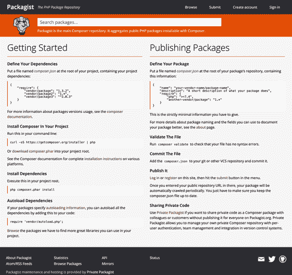

# 第十五章：包和扩展

PHP 是一种高级语言，采用动态类型和内存管理，使软件开发对最终用户更加简便。不幸的是，计算机并不擅长处理高级概念，因此任何高级系统都必须建立在更低级的构建块之上。在 PHP 的情况下，整个系统都是用 C 语言编写并建立的。

由于 PHP 是开源的，您可以直接从 [GitHub](https://oreil.ly/Z1_lP) 下载整个语言的源代码。然后，您可以在自己的系统上从源代码构建语言，对其进行更改，或编写自己的本机（C 级）扩展。

在任何环境中，构建 PHP 源代码所需的其他各种软件包都是必需的。在 Ubuntu Linux 上，这些软件包包括：

`pkg-config`

用于返回有关已安装库的信息的 Linux 包

`build-essential`

包括 GNU 调试器、g++ 编译器和其他用于处理 C/C++ 项目的工具的元包

`autoconf`

用于生成配置代码包的脚本的宏包

`bison`

通用解析生成器

`re2c`

用于 C 和 C++ 的正则表达式编译器和开源词法分析器

`libxml2-dev`

用于 XML 处理的 C 级开发头文件

`libsqlite3-dev`

用于 SQLite 和相关绑定的 C 级开发头文件

您可以使用以下 `apt` 命令安装它们：

```php
$ sudo apt install -y pkg-config build-essential autoconf bison re2c \
                      libxml2-dev libsqlite3-dev
```

一旦依赖项可用，您可以使用 `buildconf` 脚本生成配置脚本，然后 `configure` 本身将准备好构建环境。可以直接传递到 `configure` 控制如何设置环境的 [多个选项](https://oreil.ly/md2qt)。表 15-1 列出了一些最有用的选项。

表 15-1\. PHP `configure` 选项

| 选项标志 | 描述 |
| --- | --- |
| `--enable-debug` | 编译时包含调试符号。对于开发核心 PHP 或编写新扩展非常有用。 |
| `--enable-libgcc` | 允许代码显式链接到 `libgcc`。 |
| `--enable-php-streams` | 激活对实验性 PHP 流的支持。 |
| `--enable-phpdbg` | 启用交互式 `phpdbg` 调试器。 |
| `--enable-zts` | 启用线程安全性。 |
| `--disable-short-tags` | 禁用 PHP 短标签支持（例如 `<?`）。 |

理解如何构建 PHP 本身并不是使用它的先决条件。在大多数环境中，您可以直接从标准软件包管理器安装二进制发行版。例如，在 Ubuntu 上，您可以直接安装 PHP，方法如下：

```php
$ sudo apt install -y php
```

然而，了解如何从源代码构建 PHP 对于希望更改语言行为、包括非捆绑扩展或将来编写自己的本机模块的人来说是重要的。

## 标准模块

默认情况下，PHP 使用其自己的扩展系统来支持语言的核心功能。除了核心模块外，各种扩展也直接捆绑在 PHP 中。¹ 这些包括以下内容：

+   [BCMath](https://oreil.ly/QwfUv) 用于任意精度数学计算

+   [FFI](https://oreil.ly/sktWY)（外部函数接口）用于加载共享库并调用其中的函数

+   [PDO](https://oreil.ly/BEsdu)（PHP 数据对象）用于抽象化各种数据库接口

+   [SQLite3](https://oreil.ly/Zejtz) 用于直接与 SQLite 数据库交互

标准模块已与 PHP 捆绑，并可通过更改您的*php.ini*配置立即包含。外部扩展，例如对 Microsoft SQL Server 的 PDO 支持，也可用，但必须单独安装和激活。像 PECL 这样的工具，在配方 15.4 中讨论，使得在任何环境中安装这些模块变得简单。

## 库/Composer

除了语言的本机扩展之外，您还可以利用[Composer](https://getcomposer.org)，这是 PHP 最流行的依赖管理器。任何 PHP 项目都可以（而且可能*应该*）定义为 Composer 模块，方法是包含一个描述项目及其结构的*composer.json*文件。即使您不利用 Composer 将第三方代码拉入项目中，包含这样一个文件也有两个关键优势：

+   您（或其他开发人员）可以将您的项目作为另一个项目的依赖项包含进去。这使得您的代码可移植，并鼓励函数和类定义的重用。

+   一旦您的项目有了*composer.json*文件，您可以利用 Composer 的自动加载功能在项目中动态包含类和函数，而无需直接使用`require()`来直接加载它们。

本章中的配方解释了如何将您的项目配置为 Composer 包，以及如何利用 Composer 查找和包含第三方库。您还将学习如何通过 PHP 扩展社区库（PECL）和 PHP 扩展与应用程序库（PEAR）找到并包含语言的本机扩展。

# 15.1 定义 Composer 项目

## 问题

您想要启动一个使用 Composer 动态加载代码和依赖项的新项目。

## 解决方案

在命令行上使用 Composer 的`init`命令启动一个新项目，并带有一个*composer.json*文件。例如：

```php
$ composer init --name ericmann/cookbook --type project --license MIT
```

在经过交互式提示（请求描述、作者、最小稳定性等）后，您将得到一个为您的项目定义良好的*composer.json*文件。

## 讨论

Composer 通过在 JSON 文档中定义项目信息，并利用这些信息构建额外的脚本加载器和集成来工作。新初始化的项目在这个文档中一开始并没有太多详细信息。在解决方案示例中使用 `init` 命令生成的 *composer.json* 文件最初看起来如下：

```php
{
    "name": "ericmann/cookbook",
    "type": "project",
    "license": "MIT",
    "require": {}
}
```

这个配置文件没有定义任何依赖项、额外的脚本或自动加载。为了不仅仅用于标识项目和许可证，还需要开始添加内容。首先，需要定义自动加载器以引入项目代码。

对于这个项目，使用默认命名空间 `Cookbook` 并将所有代码放在名为 *src/* 的目录中。然后，更新你的 *composer.json* 将该命名空间映射到该目录，如下所示：

```php
{
    "name": "ericmann/cookbook",
    "type": "project",
    "license": "MIT",
    "require": {},
    "autoload": {
        "psr-4": {
            "Cookbook\\": "src/"
        }
    }
}
```

更新了 Composer 配置之后，可以在命令行上运行 `composer dumpautoload` 命令，强制 Composer 重新加载配置并定义自动化的源映射。完成后，Composer 将在项目中创建一个新的 *vendor/* 目录。它包含两个关键组件：

+   一个 *autoload.php* 脚本，在加载应用程序时需要 `require()` 它

+   一个包含 Composer 代码加载例程的 *composer* 目录，用于动态引入你的脚本

为了进一步说明自动加载的工作原理，创建两个新文件。首先，在 *src/* 目录下创建一个名为 *Hello.php* 的文件，其中包含 示例 15-1 中定义的 `Hello` 类。

##### 示例 15-1\. Composer 自动加载的简单类定义

```php
<?php
namespace Cookbook;

class Hello
{
    public function __construct(private string $greet) {}

    public function greet(): string
    {
        return "Hello, {$this->greet}!";
    }
}
```

然后，在项目的根目录创建一个 *app.php* 文件，其内容如下，用于启动前述片段的执行：

```php
<?php

require_once 'vendor/autoload.php';

$intro = new Cookbook\Hello('world');

echo $intro . PHP_EOL;
```

最后，回到命令行。由于向项目中添加了一个新类，需要再次运行 `composer dumpautoload`，以便 Composer 知道这个类的存在。然后，可以运行 `php app.php` 直接调用应用程序并生成以下输出：

```php
$ php app.php
Hello, world!
$
```

你的项目或应用程序需要的任何类定义都可以采用同样的方式定义。基础的 `Cookbook` 命名空间将始终是 *src/* 目录的根目录。如果希望为对象定义嵌套命名空间，比如 `Cookbook\Recipes`，则在 *src/* 中创建一个同名目录（例如 *Recipes/*），以便 Composer 知道在应用程序中后续使用这些类定义时在哪里找到它们。

同样地，可以利用 Composer 的 `require` 命令将第三方依赖项导入应用程序。² 这些依赖项将在运行时像自定义类一样加载到应用程序中。

## 另请参见

关于 [`init` 命令](https://oreil.ly/6J29w) 和 [PSR-4 自动加载](https://oreil.ly/Buns1) 的 Composer 文档。

# 15.2 查找 Composer 包

## 问题

您想找到一个库来完成特定任务，这样您就不需要花时间重新发明轮子，编写自己的实现。

## 解决方案

使用 PHP 包仓库 [Packagist](https://packagist.org) 来找到适合的库，并使用 Composer 将其安装到您的应用程序中。

## 讨论

许多开发人员发现他们花费大部分时间重新实现他们以前构建的逻辑或系统。不同的应用程序服务于不同的目的，但通常利用相同的基本构建块和基础来运行。

这是诸如面向对象编程等范式背后的关键驱动因素之一，在这些范式中，您将应用程序中的逻辑封装在可以单独操作、更新或甚至重复使用的对象中。与反复编写相同代码不同，您将其封装在一个可以在应用程序内重复使用甚至传输到下一个项目中的对象中。³

在 PHP 中，这些可重用的代码组件通常作为独立的库重新分发，可以使用 Composer 导入。就像 Recipe 15.1 展示了如何定义一个 Composer 项目并自动导入您的类和函数定义一样，同样的系统也可以用来将第三方逻辑添加到您的系统中。⁴

首先，确定特定操作或逻辑片段的需求。例如，假设您的应用程序需要与基于时间的一次性密码（TOTP）系统（如 Google Authenticator）集成。您需要一个 TOTP 库来完成这项工作。要找到它，请在浏览器中导航到 [packagist.org](https://packagist.org)，即 PHP 包仓库。主页看起来会有点像 Figure 15-1，突出显示了标题中的搜索栏。



###### 图 15-1\. Packagist 是通过 Composer 可安装的 PHP 包的免费分发方法

然后搜索您需要的工具——在本例中是 TOTP。您将获得一个按热门程度排序的可用项目列表。您还可以利用包类型和各种标签，将搜索结果缩减到几个可能的库。

###### 注意

在 Packagist 上，受欢迎程度由包下载量和 GitHub 星标定义。这是衡量项目在实际使用中频繁程度的一个好方法，但绝不是您应该依赖的唯一指标。许多开发人员仍然将第三方代码复制粘贴到其系统中，因此 Packagist 指标可能没有反映的数百万“下载”。同样，仅仅因为一个包很受欢迎或被广泛使用，并不意味着它对您的项目是安全的或合适的选择。请花时间仔细审查每个潜在的库，确保它不会为您的应用程序引入不必要的风险。

此外，如果你知道一个特定模块的作者，你信任他们的作品，你可以通过添加他们的用户名直接搜索。例如，搜索`Eric Mann totp`将得到由本书作者原创的特定 TOTP 实现。

一旦你已经确认并仔细审查了扩展你的应用程序所需的可用包，在 Recipe 15.3 中查看安装和管理它们的说明。

## 另请参阅

[Packagist.org](https://packagist.org)：PHP 包仓库。

# 15.3 安装和更新 Composer 包

## 问题

你已经发现了一个你想要包含在项目中的 Packagist 包。

## 解决方案

安装包通过 Composer（假设版本为 1.0）如下：

```php
composer require "vendor/package:1.0"
```

## 讨论

Composer 与你本地文件系统中的两个文件一起工作：*composer.json*和*composer.lock*。第一个用于描述你的项目、自动加载和许可证。具体来说，你在 Recipe 15.1 中定义的原始*composer.json*文件如下：

```php
{
    "name": "ericmann/cookbook",
    "type": "project",
    "license": "MIT",
    "require": {},
    "autoload": {
        "psr-4": {
            "Cookbook\\": "src/"
        }
    }
}
```

运行示例解决方案中的`require`语句后，Composer 会更新你的*composer.json*文件，以添加指定的供应商依赖项。你的文件现在会如下所示：

```php
{
    "name": "ericmann/cookbook",
    "type": "project",
    "license": "MIT",
    "require": {
        "vendor/package": "1.0"
    },
    "autoload": {
        "psr-4": {
            "Cookbook\\": "src/"
        }
    }
}
```

当你`require`一个包时，Composer 会执行三件事：

1.  它检查确保包存在并获取最新版本（如果未指定版本）或你请求的版本。然后更新*composer.json*以将包存储在`require`键中。

1.  默认情况下，Composer 会下载并安装你的包到项目中的*vendor/*目录中。它还更新自动加载程序脚本，因此该包将立即对项目中的其他代码可用。

1.  Composer 还在你的项目中维护一个`composer.lock`文件，明确标识你安装的每个包的版本。

在解决方案示例中，你明确指定了一个版本为 1.0 的包。如果你没有指定版本，Composer 将获取最新版本并在*composer.json*文件中使用。如果 1.0 确实是最新版本，Composer 将使用`¹.0`作为版本指示器，这将安装可能的维护版本（如 1.0.1 版本）。*composer.lock*文件跟踪安装的确切版本，因此即使你删除整个*vendor/*目录，通过`composer install`重新安装包时仍将获取相同的版本。

Composer 还会尽力找到适合您本地环境的最佳版本。它通过比较您的环境所需的 PHP 版本（用于运行工具的版本）与请求的包支持的版本来实现这一点。Composer 还尝试调和通过其他地方声明的传递依赖项显式声明的任何依赖关系。如果系统未能找到兼容的版本以包含，它将报告错误，以便您手动调和 *composer.json* 文件中列出的版本号。

###### 警告

Composer 在其版本约束中遵循语义化版本。`¹.0`的要求将仅允许安装维护版本（例如，1.0.1、1.0.2）。大于等于的约束（例如，`>=1.0`）将安装任何稳定版本，版本号大于或等于 1.0。跟踪您如何定义版本约束非常重要，以防止意外导入由主要版本引入的破坏性包更改。有关如何定义版本约束的更多背景信息，请参考[Composer 文档](https://oreil.ly/gvoGC)。

在 Packagist 托管的具有公共代码的库不是唯一可以通过 Composer 包含的东西。此外，您还可以将系统指向 GitHub 等版本控制系统中托管的公共或私有项目。

要将 GitHub 仓库添加到您的项目中，首先在 *composer.json* 中添加一个`repositories`键，这样系统就知道从哪里查找。然后更新您的`require`键以拉取您需要的项目。运行`composer update`将从 GitHub 直接拉取包并将其包含在您的项目中，就像任何其他库一样。

例如，假设您想使用特定的 TOTP 库，但发现了一个小错误。首先，将 GitHub 仓库分叉到您自己的账户中。然后，在 GitHub 上创建一个分支来保存您的更改。最后，更新 *composer.json* 指向您的自定义分支和分支，如 Example 15-2 所示。

##### Example 15-2\. 使用 Composer 从 GitHub 仓库拉取项目

```php
{
    "name": "ericmann/cookbook",
    "type": "project",
    "license": "MIT",
    "repositories": 
        {
            "type": "vcs",
            "url": "\https://github.com/phpcookbookreader/package" ![1
        }
    ],
    "require": {
        "vendor/package": "dev-bugfix" 
    },
    "minimum-stability": "dev", 
    "autoload": {
        "psr-4": {
            "Cookbook\\": "src/"
        }
    }
}
```


确保您要包含的包是您可以访问的。此存储库可以是公共的也可以是私有的。如果是私有的，那么您将需要将 GitHub 个人访问令牌公开为环境变量，以便 Composer 具有拉取代码所需的适当凭据。


一旦定义了仓库，将一个新的分支规范添加到您的`require`块中。由于这不是标记或发布版本，请在分支名称前加上`dev-`，这样 Composer 就知道要拉取哪个分支。


要在项目中包含开发分支，您应该注明项目所需的[最低稳定性](https://oreil.ly/U9iWR)，以避免在包含过程中可能出现的任何问题。

无论库以公共包、存储库的形式进入您的项目，还是作为[硬编码的 ZIP 文件](https://oreil.ly/xEpJh)，都取决于您的开发团队。无论如何，任何可重复使用的包都可以轻松通过 Composer 加载，并向应用程序的其他部分公开。

## 参见

Composer 的[`require`命令](https://oreil.ly/d32oK)的文档。

# 15.4 安装本地 PHP 扩展

## 问题

您希望安装 PHP 的一个公共可用本地扩展，比如[APC 用户缓存（APCu）](https://oreil.ly/Jppw-)。

## 解决方案

在 PECL 存储库中查找扩展，并通过使用 PEAR 将其安装到系统中。例如，安装 APCu 的方法如下：

```php
$ pecl install apcu
```

## 讨论

PHP 社区使用两种技术来向语言本身分发本地扩展：PEAR 和 PECL。它们之间的主要区别在于它们用于的包类型。

PEAR 本身可以捆绑几乎任何东西——它分发的包是由 PHP 代码组成的 gzip 压缩的 TAR 存档。因此，PEAR 类似于 Composer，可用于管理、安装和更新应用程序中使用的其他 PHP 库。⁵ 不过，PEAR 包与 Composer 包的加载方式有所不同，因此如果选择在两个包管理器之间混合使用，请注意。

PECL 是用 C 语言编写的 PHP 本地扩展库，与 PHP 本身相同的基础语言。PECL 使用 PEAR 来处理扩展的安装和管理；通过扩展引入的新功能可以像访问语言本身的本地函数一样访问。

实际上，现代版本的 PHP 中引入的许多 PHP 包最初是 PECL 扩展，开发人员可以选择安装以进行测试和初始集成。例如，[钠加密库](https://oreil.ly/QdyfM)最初作为 PECL 扩展引入，后来在 PHP 核心分发的 7.2 版本中被添加。⁶

某些数据库（例如[MongoDB](https://oreil.ly/Xoh5_)）将它们的核心驱动程序作为本地 PECL 扩展发布。还提供各种网络、安全、多媒体和控制台操作库。所有这些都是用高效的 C 代码编写的，并且由于 PECL 和与 PHP 的绑定，表现得就像它们是语言本身的一部分一样。

不同于像 Composer 这样传递用户空间 PHP 代码的工具，PECL 直接将原始 C 代码交付给您的环境。`install`命令将执行以下操作：

1.  下载扩展源码

1.  编译源代码以适应您的系统，利用本地环境、其配置和系统架构以确保兼容性

1.  在由您的环境定义的[扩展目录](https://oreil.ly/KFNg9)内创建一个编译后的*.so*文件用于扩展

###### 提示

尽管一些扩展看起来是自动启用的，但很可能你需要修改你系统的*php.ini*文件来显式包含该扩展。建议随后重新启动你的 Web 服务器（如 Apache、NGINX 或类似）以确保 PHP 按预期加载新扩展。

在 Linux 系统上，你甚至可能希望利用系统的软件包管理器安装预编译的本地扩展。在 Ubuntu Linux 系统上安装 APCu 通常就像这样简单：

```php
$ sudo apt install php-apcu
```

无论是利用 PECL 直接构建扩展还是通过包管理器使用预编译的二进制文件，扩展 PHP 都是高效且简单的。这些扩展扩展了语言的功能，使你的最终应用程序显著更加实用。

## 另请参见

关于[PECL 仓库](https://oreil.ly/28K08)和[PEAR 扩展打包系统](https://pear.php.net)的文档。

¹ 完整的捆绑和外部扩展列表可以在[PHP 手册](https://oreil.ly/SEWGK)中找到。

² 想要了解如何使用 Composer 安装第三方库，请参见 Recipe 15.3。

³ 想要更深入地讨论面向对象编程和代码重用，请查看第八章。

⁴ 实际上关于第三方 Composer 包的*安装*将在 Recipe 15.3 中讨论。

⁵ 想要了解如何通过 Composer 安装包，请参见 Recipe 15.3。

⁶ 长篇讨论钠扩展将在第九章中进行。
