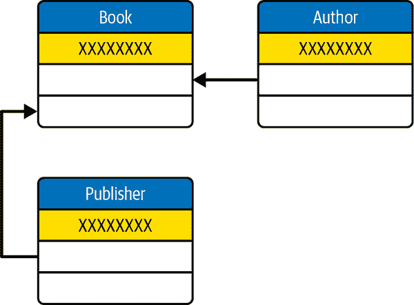
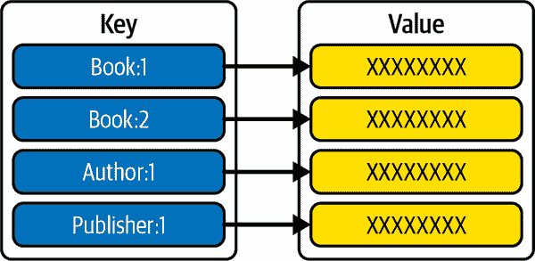
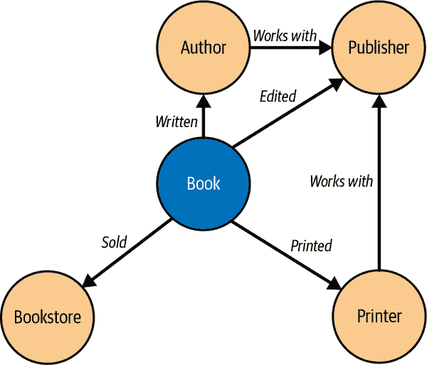

# 第十六章：数据库

现代软件应用程序，特别是在 Web 上，使用状态以便正常运行。*状态*是表示应用程序当前状态的一种方式，针对特定请求——谁登录了、他们在哪个页面上、任何他们配置的偏好等等。

通常，代码是编写为基本上是无状态的。无论用户会话的状态如何，它都会以相同的方式运行（这就是使系统行为对于多个用户在应用程序中可预测的原因）。Web 应用程序部署时，也是以无状态方式进行的。

但是状态对于跟踪用户活动并根据用户继续与其交互的方式演变应用程序行为至关重要。为了使本来无状态的代码能够意识到状态，必须从某处检索该状态。

通常，这是通过使用数据库来完成的。数据库是存储结构化数据的高效方式。在 PHP 中，您通常会使用四种类型的数据库：关系数据库、键-值存储、图形数据库和文档数据库。

# 16.1 关系数据库

*关系数据库*将数据分解为对象及其相互关系。特定条目——比如一本书——被表示为表中的一行，其中的列包含有关书籍的数据。这些列可能包括标题、ISBN 和主题等。关于关系数据库的关键是要记住不同的数据类型存储在不同的表中。

在`book`表中，一列可能是作者的名字，但更可能会有一个完全独立的`author`表。这个表会包含作者的姓名，也许还有他们的传记和邮箱地址。然后这两个表会有各自的`ID`列，而`book`表可能会有一个`author_id`列，用来引用`author`表。图 16-1 展示了这种数据库中表之间的关系。



###### 图 16-1 关系数据库通过表和每个条目之间的引用来定义

关系数据库的例子包括[MySQL](https://www.mysql.com)和[SQLite](https://oreil.ly/5s4ps)。

# 16.2 键-值存储

*键-值存储*比关系数据库简单得多——实际上就是一个将一个标识符（键）映射到某个存储值的单表。许多应用程序使用键-值存储作为简单的缓存工具，在高效的、通常是内存中的查找系统中跟踪原始值。

与关系数据库一样，存储在键-值系统中的数据可以进行类型化。如果你处理的是数字数据，大多数键-值系统会公开额外的功能来直接操作这些数据，例如，你可以在不需要先读取底层数据的情况下递增整数值。图 16-2 展示了这种数据存储中键和值之间的一对一关系。



###### 图 16-2\. 键值存储被结构化为在离散标识符之间的查找，映射到可选类型的值

键值存储的示例包括[Redis](https://redis.io)和[Amazon DynamoDB](https://oreil.ly/BYCIM)。

# 16.3 图数据库

与专注于数据本身结构不同，图数据库专注于建模数据之间的关系（称为*边*）。数据元素由节点封装，节点之间的边将它们连接在一起，并为系统中的数据提供语义上下文。

由于对数据之间关系的高度重视，图数据库非常适合进行诸如图 16-3 所示的可视化，展示这种结构中的边和节点。它们还提供了对数据关系高效查询的功能，使其成为高度互连数据的可靠选择。



###### 图 16-3\. 图数据库优先考虑并说明数据（节点）之间的关系（边）。

图数据库的示例包括[Neo4j](https://neo4j.com)和[Amazon Neptune](https://oreil.ly/8Uezn)。

# 16.4 文档数据库

也可以将数据专门存储为非结构化或半结构化的*文档*。文档可以是结构良好的数据片段（如字面 XML 文档）或自由形式的字节块（如 PDF）。

文档存储与本章介绍的其他数据库类型之间的关键区别是结构—*文档存储*通常是非结构化的，并利用动态模式引用数据。在某些情况下，它们非常有用，但在使用上更加微妙。要深入了解基于文档的方法论，请阅读 Shannon Bradshaw 等人编写的[*MongoDB 权威指南*](https://oreil.ly/psrH8)（O’Reilly）。

以下的示例主要关注关系数据库及其在 PHP 中的使用。您将学习如何连接本地和远程数据库，如何在测试期间利用固定数据，甚至如何使用更复杂的对象关系映射（ORM）库处理您的数据。

# 16.5 连接到 SQLite 数据库

## 问题

您希望使用 SQLite 数据库的本地副本来存储应用程序数据。您的应用程序需要适当地打开和关闭数据库。

## 解决方案

根据需要使用基础 `SQLite` 类来打开和关闭数据库。为了效率，可以通过以下方式扩展基础类，自定义构造函数和析构函数：

```php
class Database extends SQLite3
{
    public function __construct(string $databasePath)
    {
        $this->open($databasePath);
    }

    public function __destruct()
    {
        $this->close();
    }
}
```

然后，使用你的新类来打开数据库，运行一些查询，并在完成时自动关闭连接。例如：

```php
$db = new Database('example.sqlite');

$create_query = <<<SQL
CREATE TABLE IF NOT EXISTS users (
 user_id INTEGER PRIMARY KEY,
 first_name TEXT NOT NULL,
 last_name TEXT NOT NULL,
 email TEXT NOT NULL UNIQUE
);
SQL;

$db->exec($create_query);

$insert_query = <<<SQL
INSERT INTO users (first_name, last_name, email)
VALUES ('Eric', 'Mann', 'eric@phpcookbook.local')
ON CONFLICT(email) DO NOTHING;
SQL;

$db->exec($insert_query);

$results = $db->query('SELECT * from users;');
while ($row = $results->fetchArray()) {
    var_dump($row);
}
```

## 讨论

SQLite 是一个快速完全自包含的数据库引擎，将其所有数据存储在单个磁盘文件中。PHP 自带一个扩展（在大多数发行版中默认启用），可以直接与该数据库进行接口，让你能够随意创建、写入和读取数据库。

默认情况下，`open()` 方法将会在指定路径下创建一个数据库文件（如果不存在）。此行为可以通过传递给方法调用的第二个参数中的标志来更改。默认情况下，PHP 将传递 `SQLITE3_​OPEN_​READWRITE | SQLITE3_OPEN_CREATE`，这将打开数据库以进行读取 *和* 写入，并在不存在时创建它。

Table 16-1 列出了三个可用的标志。

表 16-1\. 用于打开 SQLite 数据库的可选标志

| 标志 | 描述 |
| --- | --- |
| `SQLITE3_OPEN_READONLY` | 仅打开一个数据库用于读取操作 |
| `SQLITE3_OPEN_READWRITE` | 打开一个数据库用于读写操作 |
| `SQLITE3_OPEN_CREATE` | 如果不存在则创建数据库 |

解决方案示例包括一个类，透明地在特定路径上打开一个 SQLite 数据库，如果不存在则创建一个。由于该类扩展了基础的 SQLite 类，因此可以在不同于标准 SQLite 实例的地方使用它来创建表、插入数据并直接查询该数据。类析构函数在实例移出作用域时自动关闭数据库连接。

###### 注意

通常情况下，不需要显式关闭 SQLite 连接，因为 PHP 将在程序退出时自动关闭连接。但是，如果应用程序（或线程）可能会继续运行，建议关闭连接以释放系统资源。尽管这不会对本地基于文件的数据连接产生太大影响，但对于像 MySQL 这样的远程关系数据库来说，这是一个关键的组成部分。在数据库管理中保持一致性是一个良好的习惯。

SQLite 数据库在指定路径上以二进制文件的形式存在于磁盘上。如果你使用像 [Visual Studio Code](https://oreil.ly/k_LBl) 这样的开发环境，你可以使用专门的扩展如 [SQLite Viewer](https://oreil.ly/QzF0J) 来连接和可视化你的本地数据库。拥有多种查看数据库模式和数据的方式是验证你的代码是否按照预期工作的快速有效方法。

## 参见

PHP 关于 [SQLite3 数据库扩展](https://oreil.ly/kMU8Y) 的文档。

# 16.6 使用 PDO 连接到外部数据库提供者

## 问题

您希望使用 PDO 作为抽象层连接并查询远程 MySQL 数据库。

## 解决方案

首先，定义一个扩展核心`PDO`定义的类，处理创建和关闭连接，如下所示：

```php
class Database extends PDO
{
    public function __construct($config = 'database.ini')
    {
        $settings = parse_ini_file($config, true);

        if (!$settings) {
            throw new RuntimeException("Error reading config: `{$config}`.");
        } else if (!array_key_exists('database', $settings)) {
            throw new RuntimeException("Invalid config: `{$config}`.");
        }

        $db = $settings['database'];
        $port = $db['port'] ?? 3306;
        $driver = $db['driver'] ?? 'mysql';
        $host = $db['host'] ?? '';
        $schema = $db['schema'] ?? '';
        $username = $db['username'] ?? null;
        $password = $db['password'] ?? null;

        $port = empty($port) ? '' : ";port={$port}";
        $dsn = "{$driver}:host={$host}{$port};dbname={$schema}";

        parent::__construct($dsn, $username, $password);
    }
}
```

前述类的配置文件需要采用 INI 格式。例如：

```php
[database]
driver = mysql
host = 127.0.0.1
port = 3306
schema = cookbook
username = root
password = toor
```

配置文件一旦配置完成，您可以通过 PDO 提供的抽象直接查询数据库，如下所示：

```php
$db = new Database();

$create_query = <<<SQL
CREATE TABLE IF NOT EXISTS users (
 user_id int NOT NULL AUTO_INCREMENT,
 first_name varchar(255) NOT NULL,
 last_name varchar(255) NOT NULL,
 email varchar(255) NOT NULL UNIQUE,
 PRIMARY KEY (user_id)
);
SQL;

$db->exec($create_query);

$insert_query = <<<SQL
INSERT IGNORE INTO users (first_name, last_name, email)
VALUES ('Eric', 'Mann', 'eric@phpcookbook.local');
SQL;

$db->exec($insert_query);

foreach($db->query('SELECT * from users;') as $row) {
    var_dump($row);
}
```

## 讨论

解决方案示例利用与 Recipe 16.5 相同的表结构和数据，只是它使用了 MySQL 数据库引擎。[MySQL](https://www.mysql.com)是一个由 Oracle 维护的流行的免费开源数据库引擎。据维护者称，它支持许多流行的 Web 应用程序，包括像 Facebook、Netflix 和 Uber 这样的大型平台。事实上，MySQL 如此普及，以至于许多系统维护者默认在 PHP 中包含 MySQL 扩展，使连接系统变得更加简单，免去了自己安装新驱动程序的麻烦。

###### 注意

与 Recipe 16.5 中的解决方案示例不同，PHP 没有明确关闭 PDO 连接的方法。相反，将数据库句柄（例如解决方案示例中的`$db`）的值设置为`null`，使对象超出范围并触发 PHP 关闭连接。

在解决方案示例中，首先定义了一个类来包装 PDO 本身，并抽象连接到 MySQL 数据库。虽然这不是必需的，但就像 Recipe 16.5 一样，这是一个保持数据连接清洁的好方法。一旦建立了连接，您可以高效地创建表格、插入数据并读取数据。

###### 警告

解决方案示例假设在连接到的数据库中已经存在`cookbook`模式。除非您已经直接创建了该模式，否则这种隐式连接将失败，并显示`PDOException` complaining about an unknown database。在尝试操作之前，您必须在 MySQL 数据库中*首先*创建该模式至关重要。

与 SQLite 不同，MySQL 数据库需要一个完全独立的应用程序来托管数据库并连接到您的应用程序。通常，此应用程序将在完全不同的服务器上运行，并且您的应用程序将通过 TCP 连接到指定端口（通常是 3306）。对于本地开发和测试，仅需使用[Docker](https://www.docker.com)在应用程序旁边创建一个本地 MySQL 数据库就足够了。以下一行命令将在 Docker 容器内创建一个本地 MySQL 数据库，监听默认端口 3306，并允许通过`root`用户和密码`toor`进行连接：

```php
$ docker run --name db -e MYSQL_ROOT_PASSWORD=toor -p 0.0.0.0:3306:3306 -d mysql
```

###### 注意

无论是在本地使用 Docker 中的 MySQL 还是在生产环境中使用 MySQL，[官方容器镜像](https://oreil.ly/4btCa)详细介绍了各种可用于自定义和安全环境的配置设置。

当容器首次启动时，不会有任何可用于查询的模式（这意味着示例解决方案的其余部分尚不可用）。要创建一个默认的`cookbook`模式，需要连接到数据库并创建模式。在示例 16-1 中，`$`字符表示 shell 命令，`mysql>`提示表示在数据库本身内运行的命令。

##### 示例 16-1\. 使用 MySQL CLI 创建数据库模式

```php
$ mysql --host 127.0.0.1 --user root --password=toor 

mysql> create database `cookbook`; 
mysql> exit 
```


Docker 容器在本地环境通过 TCP 暴露 MySQL，这需要您指定一个本地主机 IP 地址。如果未这样做，默认情况下 MySQL 会尝试通过 Unix 套接字连接，但在这种情况下会失败。您还必须传递用户名和密码以便连接。


连接到数据库引擎后，可以在其中创建新的模式。


要断开 MySQL 连接，只需输入`exit`或`quit`并按 Enter 键。

如果您没有安装 MySQL 命令行，还可以利用 Docker 连接到运行的数据库容器并使用*其*命令行界面。示例 16-2 展示了如何利用 Docker 容器封装 MySQL CLI 来创建数据库模式。

##### 示例 16-2\. 使用托管在 Docker 中的 MySQL CLI 创建数据库模式

```php
$ docker exec -it db bash 

$ mysql --user root --password=toor 

mysql> create database `cookbook`; 
mysql> exit

$ exit 
```


由于 MySQL 已作为名为`db`的容器在本地运行，您可以通过引用相同的名称在容器内部交互地执行命令。Docker 的`i`和`t`标志指示您希望在交互式终端会话中执行命令。`bash`命令是您明确要执行的命令；其结果是您像直接连接到其中一样在容器内部获得了一个交互式终端会话。


在容器内部连接到数据库就像使用 MySQL CLI 一样简单。您无需引用主机名，因为在容器内部，可以直接连接到公开的 Unix 套接字。


创建表并退出 MySQL CLI 的过程与前面的示例完全相同。


退出 CLI 后，仍然需要退出 Docker 容器中的交互式`bash`会话，以返回到主终端。

使用 PDO 连接数据库而不是直接使用驱动程序的主要优点有两个：

1.  PDO 接口在每种数据库技术中都是相同的。虽然您可能需要重构特定查询以适应一个或另一个数据库引擎（比较这个解决方案中的 `CREATE TABLE` 语法与 Recipe 16.5 中的语法），但无需重构围绕连接、语句执行或查询处理的 PHP 代码。PDO 是一个数据访问抽象层，无论您在应用程序中使用的数据库是什么，都能提供相同的访问和管理方式。

1.  PDO 支持通过在打开连接时将一个真值传递给 `PDO::ATTR_PERSISTENT` 键作为选项来使用*持久连接*。持久连接将在 `PDO` 实例超出范围并且脚本执行完成后仍然保持打开状态。当 PHP 尝试重新打开连接时，系统将查找现有的连接并在存在时重用它。这有助于提高长时间运行的多租户应用程序的性能，否则打开多个冗余连接将对数据库本身造成伤害。（有关持久数据库连接的更多信息，请参阅 [PHP 手册的全面文档](https://oreil.ly/_nHH-)。）

除了这两个优点之外，PDO 还支持准备语句的概念，有助于减少恶意 SQL 注入的风险。有关准备语句的更多信息，请参阅 Recipe 16.7。

## 参见

有关 [PDO 扩展的完整文档](https://oreil.ly/_6%E2%80%94%E2%80%8BV)。

# 16.7 为数据库查询净化用户输入

## 问题

您希望将用户输入传递到数据库查询中，但不完全信任用户输入不会有恶意行为。

## 解决方案

在 PDO 中利用准备语句自动清理用户输入之前将其传递到查询中如下：

```php
$db = new Database();

$insert_query = <<<SQL
INSERT IGNORE INTO users (first_name, last_name, email)
VALUES (:first_name, :last_name, :email);
SQL;

$statement = $db->prepare($insert_query);

$statement->execute([
    'first_name' => $_POST['first'],
    'last_name'  => $_POST['last'],
    'email'      => $_POST['email']
]);

foreach($db->query('SELECT * from users;') as $row) {
    var_dump($row);
}
```

## 讨论

清理用户输入的概念在早期作为 Recipe 9.1 的一部分进行了讨论，该部分使用显式过滤器清理/验证潜在的不受信任的输入。虽然这种方法非常有效，但在未来更新时开发人员很容易忘记在用户输入时包含清理过滤器。因此，显式准备查询以防止恶意 SQL 注入是更安全的做法。

考虑一个用于查找用户数据以显示个人资料信息的查询。这样的查询可能利用用户电子邮件地址作为索引，以区分试图仅显示当前用户信息的另一个用户。例如：

```php
SELECT * FROM users WHERE email = ?;
```

在 PHP 中，您需要传递当前用户的电子邮件地址，以便查询有效运行。使用 PDO 的一个天真的方法可能看起来像 Example 16-3。

##### Example 16-3\. 使用字符串插值的简单查询

```php
$db = new Database();

$statement = "SELECT * FROM users WHERE email = '{$_POST['email']}';";

$results = $db->query($statement);
var_dump($results);
```

如果用户只提交他们自己的用户名（例如，`eric@phpcookbook.local`），那么这个查询将返回该用户的相应数据。不过，不能保证最终用户是可信的，他们可能会提交一个恶意语句，希望将任意语句*注入*到您的数据库引擎中。了解提交的电子邮件地址如何插入到 SQL 语句中，攻击者可以提交 `' OR 1=1;--` 替代。

这个字符串将完成引号（`WHERE email = ''`），添加一个复合布尔语句来匹配*任何*结果（`OR 1=1`），并明确注释掉后续的任何字符。其结果是，您的查询将返回*所有*用户的数据，而不是仅仅是发出请求的单个用户。

同样，恶意用户可以使用相同的方法来注入任意的`INSERT`语句（写入新数据），而您只期望读取信息。他们还可以非法更新现有数据，删除字段，或者以其他方式损害数据存储的可靠性。

SQL 注入非常危险。它在软件世界中也是异常常见的——以至于注入被公认为是开放全球应用安全项目（OWASP）十大安全风险中的第三位[最常遇到的应用安全风险](https://oreil.ly/Cveyu)。

幸运的是，在 PHP 中，防止注入也很容易！

解决方案示例介绍了 PDO 的*预处理语句*接口。与使用用户提供数据插入字符串不同，您在查询中插入命名占位符。这些占位符应以单个冒号开头，并且可以是您能想象到的任何有效名称。当查询运行到数据库时，PDO 将这些占位符替换为运行时传递的字面值。

###### 注意

也可以使用问号字符作为占位符，并根据它们在简单数组中的位置传递值到准备好的语句。然而，在以后的重构过程中很容易混淆元素的位置，因此高度不建议使用这种简单的方法。请务必始终在准备语句时使用命名参数，以避免混淆并未来保护您的代码。

预处理语句适用于数据操作语句（插入、更新、删除）和任意查询。使用预处理语句，可以将 示例 16-3 中的简单查询重写为 示例 16-4。

##### 示例 16-4\. 使用预处理语句的简单查询

```php
$db = new Database();

$query = "SELECT * FROM users WHERE email = :email;";
$statement = $db->prepare($query);

$statement->execute(['email' => $_POST['email']]);

$results = $statement->fetch();
var_dump($results);
```

此代码利用 PDO 自动转义用户输入，并将该值作为字面值传递给数据库引擎。如果用户确实提交了他们的电子邮件地址，查询将如预期般运行并返回预期的结果。

如果用户提交恶意有效负载（例如，`' OR 1=1;--`，如前所述），语句准备将明确转义传递给数据库的引号字符。这将导致查找一个完全匹配恶意有效负载的电子邮件地址（并且不存在），从而产生零用户数据的结果。

## 参见

有关 PDO 的[`prepare()`方法的文档](https://oreil.ly/q3DCh)。

# 16.8 模拟数据用于集成测试与数据库

## 问题

你希望在生产环境中利用数据库进行存储，但在运行自动化测试时模拟该数据库接口。

## 解决方案

使用存储库模式作为业务逻辑与数据库持久性之间的抽象。例如，定义一个存储库接口，如示例 16-5 所示。

##### 示例 16-5\. 数据存储库接口定义

```php
interface BookRepository
{
    public function getById(int $bookId): Book;
    public function list(): array;
    public function add(Book $book): Book;
    public function delete(Book $book): void;
    public function save(Book $book): Book;
}
```

然后，使用上述接口定义具体的数据库实现（例如利用 PDO）。同时使用相同的接口定义模拟实现，返回可预测的静态数据而不是远程系统的实时数据。参见示例 16-6。

##### 示例 16-6\. 带有模拟数据的存储库接口实现

```php
class MockRepository implements BookRepository
{
    private array $books;

    public function __construct()
    {
        $this->books = [
            new Book(id: 0),
            new Book(id: 1),
            new Book(id: 2)
        ];
    }

    public function getById(int $bookId): Book
    {
        return $this->books[$bookId];
    }

    public function list(): array
    {
        return $this->books;
    }

    public function add(Book $book): Book
    {
        $book->id = end(array_keys($this->books)) + 1;
        $this->books[] = $book;

        return $book;
    }

    public function delete(Book $book): void
    {
        unset($this->books[$book->id]);
    }

    public function save(Book $book): Book
    {
        $this->books[$book->id] = $book;
    }
}
```

## 讨论

解决方案示例介绍了一种通过抽象来将业务逻辑与数据层分离的简单方法。通过利用数据*存储库*来包装数据库层，你可以发布同一接口的多个实现。在生产应用中，你的实际存储库可能看起来类似于示例 16-7。

##### 示例 16-7\. 存储库接口的具体数据库实现

```php
class DatabaseRepository implements BookRepository
{
    private PDO $dbh;

    public function __construct($config = 'database.ini')
    {
        $settings = parse_ini_file($config, true);

        if (!$settings) {
            throw new RuntimeException("Error reading config: `{$config}`.");
        } else if (!array_key_exists('database', $settings)) {
            throw new RuntimeException("Invalid config: `{$config}`.");
        }

        $db = $settings['database'];
        $port = $db['port'] ?? 3306;
        $driver = $db['driver'] ?? 'mysql';
        $host = $db['host'] ?? '';
        $schema = $db['schema'] ?? '';
        $username = $db['username'] ?? null;
        $password = $db['password'] ?? null;

        $port = empty($port) ? '' : ";port={$port}";
        $dsn = "{$driver}:host={$host}{$port};dbname={$schema}";

        $this->dbh = new PDO($dsn, $username, $password);
    }

    public function getById(int $bookId): Book
    {
        $query = 'Select * from books where id = :id;';

        $statement = $this->dbh->prepare($query);
        $statement->execute(['id' => $bookId]);

        $record = $statement->fetch();
        if ($record) {
            return Book::fromRecord($record);
        }

        throw new Exception('Book not found');
    }

    public function list(): array
    {
        $books = [];

        $records = $this->dbh->query('select * from books;');
        foreach($record as $book) {
            $books[] = Book::fromRecord($book);
        }

        return $books;
    }

    public function add(Book $book): Book
    {
        $query = 'insert into books (title, author) values (:title, :author);';

        $this->dbh->beginTransaction();
        $statement = $this->dbh->prepare($query);
        $statement->execute([
            'title'  => $book->title,
            'author' => $book->author,
        ]);
        $this->dbh->commit();

        $book->id = $this->dbh->lastInsertId();

        return $book;
    }

    public function delete(Book $book): void
    {
        $query = 'delete from books where id = :id';

        $this->dbh->beginTransaction();
        $statement = $this->dbh->prepare($query);
        $statement->execute(['id' => $book->id]);
        $this->dbh->commit();
    }

    public function save(Book $book): Book
    {
        $query =
            'update books set title = :title, author = :author where id = :id;';

        $this->dbh->beginTransaction();
        $statement = $this->dbh->prepare($query);
        $statement->execute([
            'title' => $book->title,
            'author' => $book->author,
            'id' => $book->id
        ]);
        $this->dbh->commit();

        return $book;
    }
}
```

示例 16-7 实现与解决方案示例中的模拟存储库相同的接口，但连接到实时 MySQL 数据库并在该独立系统中操作数据。实际情况下，你的生产代码将使用*此*实现而不是模拟实例。但在测试运行时，只要你的业务逻辑期望实现`BookRepository`接口的类，你可以轻松地将`DatabaseRepository`替换为`MockRepository`实例。

假设你正在使用[Symfony 框架](https://symfony.com)。你的应用将建立在控制器之上，利用依赖注入处理外部集成。例如，对于管理多本书的库 API，你可能会定义一个`BookController`，大致如下：

```php
class BookController extends AbstractController
{
    #[Route('/book/{id}', name: 'book_show')]
    public function show(int $id, BookRepository $repo): Response
    {
        $book = $repo->getById($id);

        // ...
    }
}
```

前面代码的优点在于控制器不关心您是传递 `MockRepository` 实例还是 `DataRepository` 实例。这两个类都实现了相同的 `BookRepository` 接口，并公开了具有相同签名的 `getByID()` 方法。对于业务逻辑来说，功能是相同的 —— 除了一个会让您的应用程序访问远程数据库以检索（和可能操纵）数据，而另一个则使用一组静态、完全确定性的虚假数据。

###### 注意

Symfony 默认的数据抽象层称为 [Doctrine](https://oreil.ly/JvdG_)，并默认使用仓储模式。Doctrine 提供了一个丰富的抽象层，支持多个 SQL 方言，包括 MySQL，无需通过 PDO 手动连接查询。它还附带了一个命令行实用程序，可以自动为您编写存储对象（称为 *entities*）和仓储的 PHP 代码！

在编写测试时，确定性和虚假数据是优越的，因为它们始终保持一致，这意味着您的测试非常可靠。这也意味着，如果有人在本地做了轻微的配置错误，您不会意外地覆盖真实数据库中的数据。

一个额外的优势是您的测试运行速度会更快。模拟数据接口消除了在应用程序和独立数据库之间发送数据的需求，显著缩短了与任何数据相关功能调用的延迟。尽管如此，您可能仍希望完善一个单独的集成测试套件来测试那些远程集成，并且您将需要一个真实的数据库来使这个独立的测试套件可用。

## 参见

查看 Recipe 8.7 以获取有关类、接口和继承的更多信息。查看 Symfony 文档以获取有关 [controllers](https://oreil.ly/ucip3) 和 [dependency injection](https://oreil.ly/WYpxe) 的更多信息。

# 16.9 使用 Eloquent ORM 查询 SQL 数据库

## 问题

您希望管理数据库架构及其包含的数据，而不是手动编写 SQL。

## 解决方案

使用 Laravel 默认的 ORM，Eloquent，动态定义您的数据对象和架构，如 Example 16-8 所示。

##### 示例 16-8\. Laravel 使用的表定义

```php
Schema::create('books', function (Blueprint $table) {
    $table->id();
    $table->string('title');
    $table->string('author');
});
```

该代码可用于动态创建一个用于存储书籍的表，无论使用何种 SQL 与 Eloquent 结合使用。一旦表存在，Eloquent 可以使用以下类来对其中的数据进行建模 Example 16-9。

##### 示例 16-9\. Eloquent 模型定义

```php
use Illuminate\Database\Eloquent\Model;

class Book extends Model
{
    use HasFactory;

    public $timestamps = false;
}
```

## 讨论

Doctrine ORM 在 Recipe 16.8 中简要提到，利用仓储模式将存储在数据库中的对象映射到业务逻辑中的表示形式。这在 Symfony 框架中很有效，但只是在实际应用程序中建模数据的一种方法。

开源 Laravel 框架本身是建立在 Symfony 和其他组件之上，而是使用[Eloquent ORM](https://oreil.ly/x7lcI)来建模数据。与 Doctrine 不同，Eloquent 基于活动记录设计模式，其中数据库中的表直接与用于表示该表的对应模型相关联。与通过单独的存储库创建/读取/更新/删除模型不同，建模对象通过其自身的方法进行直接操作。

###### Tip

有些开发团队对项目中接受的设计模式可能有很强的意见。尽管 Laravel 框架很流行，但许多开发者认为活动记录方法在数据建模中是*反模式*，即应该避免的方法。请务必确保您的开发团队在您项目中使用的抽象方面达成一致，因为混合多种数据访问模式可能会令人困惑，并且会导致严重的维护问题。

由 Eloquent 公开的模型类非常简单，如解决方案示例中简洁的示例所示。但它们非常动态——模型类本身不需要直接定义模型的实际属性。相反，Eloquent 在实例化模型类时会自动从底层表中读取和解析任何列和数据类型，并将这些添加为模型类的属性。

例如，Example 16-8 中的表定义了三列：

+   一个整数 ID

+   一个字符串标题

+   一个字符串作者名字

当 Eloquent 直接读取这些数据时，它会在 PHP 中有效地创建对象，看起来类似于以下内容：

```php
class Book
{
    public int    $id;
    public string $title;
    public string $author;
}
```

*实际*类将提供各种其他方法，如`save()`，但其余部分包含数据在 SQL 表中的直接表示。要在数据库中创建新记录，而不是直接编辑 SQL，您只需创建一个新对象并保存，如 Example 16-10 所示。

##### Example 16-10\. 使用 Eloquent 创建数据库对象

```php
$book = new Book;
$book->title = 'PHP Cookbook';
$book->author = 'Eric Mann';

$book->save();
```

更新数据同样简单：使用 Eloquent 检索要更改的对象，在 PHP 中进行更改，然后调用对象的`save()`方法直接持久化更新。Example 16-11 演示了在数据库中更新对象以将特定字段中的一个值替换为另一个值。

##### Example 16-11\. 使用 Eloquent 在原地更新元素

```php
Book::where('author', 'Eric Mann')
    ->update(['author', 'Eric A Mann']);
```

使用 Eloquent 的主要优势在于，您可以像操作本机 PHP 对象一样处理数据对象，而无需手动编写、管理或维护 SQL 语句。ORM 的更强大特性是，它会帮助您转义用户输入，这意味着不再需要像 Recipe 16.7 中介绍的额外步骤。

虽然直接利用 SQL 连接（带或不带 PDO）是开始与数据库工作的快速有效方式，但全功能 ORM 的强大功能将使您的应用程序更易于处理。这一点在初始开发和重构时都是如此。

## 参见

[Eloquent ORM](https://oreil.ly/4J-Jz) 的文档。
