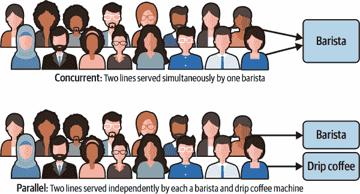
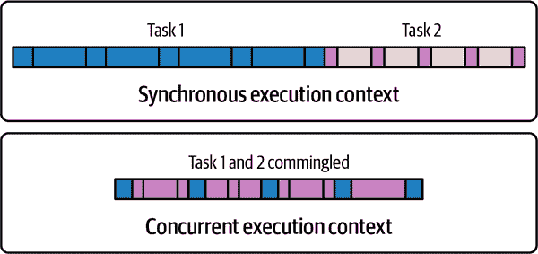
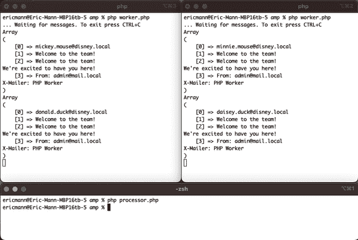

# 第十七章：异步 PHP

许多基本的 PHP 脚本处理操作是同步的——意味着脚本从开始到结束运行一个单体过程，并且一次只做一件事情。然而，在 PHP 世界中，更复杂的应用程序已经变得司空见惯，因此也需要更先进的操作模式。特别是，异步编程迅速成为 PHP 开发者的新兴概念。学习如何在你的脚本中同时执行两个（或多个）任务对于构建现代化应用程序至关重要。

在讨论异步编程时经常会涉及两个词汇：*并发*和*并行*。当大多数人谈论并行编程时，他们实际上指的是*并发编程*。通过并发，您的应用程序可以同时做两件事情，但不一定是同时进行。可以想象一个咖啡师同时为多位顾客提供服务——咖啡师在多任务处理和制作多种饮品，但实际上只能同时制作一种饮品。

使用并行操作时，您可以同时执行两个不同的任务。想象在咖啡店的柜台上安装了一个滴漏咖啡机。一些顾客仍然由咖啡师服务，但其他顾客可以从另一台机器中并行地得到他们的咖啡因。图 17-1 通过咖啡师类比描绘了并发和并行操作。



###### 图 17-1\. 并行与并发操作模式

###### 注意

还有第三个*并行并发*操作的概念，即两个工作流同时进行（并行），同时还在各自的工作流中进行多任务处理（并发）。虽然这种复合概念很有用，但本章节专注于单独讨论这两个概念。

在野外找到的大多数 PHP，无论是现代的还是传统的，都是为了利用单线程执行而编写的。代码既不是并发的也不是并行的。事实上，许多开发人员在想要利用并发或并行概念时完全避开 PHP，转而使用像 JavaScript 或 Go 这样的语言。不过，现代 PHP 完全支持执行模式——无论是否使用额外的库。

## 库和运行时

PHP 对并行和并发操作的原生支持相对较新，并且在实践中使用起来具有一定的难度。然而，有几个库可以抽象出并行工作的难度，使得构建真正的异步应用程序变得更加简单。

### AMPHP

[AMPHP 项目](https://amphp.org)是一个可以通过 Composer 安装的框架，为 PHP 提供事件驱动的并发支持。AMPHP 提供了丰富的函数和对象，使您能够完全掌握异步 PHP。具体而言，AMPHP 提供了完整的事件循环以及有效的 promise、协程、异步迭代器和流的抽象。

### ReactPHP

与 AMPHP 类似，[ReactPHP](https://reactphp.org) 是一个可以通过 Composer 安装的库，提供事件驱动功能和对 PHP 的抽象。它提供了事件循环，同时还提供了完全功能的异步服务器组件，如套接字客户端和 DNS 解析器。

### Open Swoole

[Open Swoole](https://openswoole.com) 是一个可以通过 PECL 安装的低级 PHP 扩展。类似于 AMPHP 和 ReactPHP，Open Swoole 提供了一个异步框架，并实现了承诺和协程。由于它是一个编译扩展（而不是 PHP 库），Open Swoole 的性能显著优于各种替代方案。它还支持在代码中实现真正的并行性，而不仅仅是任务的并发执行。

### RoadRunner

[RoadRunner 项目](https://roadrunner.dev) 是一个用 Go 实现的替代 PHP 运行时环境。它提供了与您熟悉的相同 PHP 接口，但提供了自己的应用服务器和异步进程管理器。RoadRunner 赋予您能力，可以在内存中保留整个应用程序，并在需要时并行调用应用程序执行的原子进程。

### Octane

2021 年，Web 应用程序框架 Laravel 推出了一个名为 [Octane](https://oreil.ly/bLnkA) 的新项目，利用 Open Swoole 或 Roadrunner 来“大幅提升您的应用性能”。与像 AMPHP 或 ReactPHP 这样的框架级工具允许您有意识地编写异步代码不同，Octane 利用 Open Swoole 或 RoadRunner 的异步基础来加速现有基于 Laravel 的应用程序的操作。¹

## 理解异步操作

要完全理解异步 PHP，您至少需要理解两个具体概念：承诺（promises）和协程（coroutines）。

### 承诺

在软件中，*承诺* 是由异步函数返回的对象。不同于表示离散值，承诺代表操作的整体状态。当函数首次返回时，承诺将没有固有值，因为操作本身尚未完成。相反，它将处于*待定*状态，指示程序在后台完成异步操作时应执行其他操作。

当操作**完成**时，承诺将被满足或拒绝。当事情顺利进行并返回一个具体值时，承诺将处于满足状态；当某些事情失败并返回错误时，承诺将处于拒绝状态。

AMPHP 项目通过使用生成器实现承诺，并将满足和拒绝状态捆绑到承诺对象的 `onResolve()` 方法中。例如：

```php
function doSomethingAsync(): Promise
{
    // ...
}

doSomethingAsync()->onResolve(function (Throwable $error = null, $value = null) {
    if ($error) {
        // ...
    } else {
        // ...
    }
});
```

另外，ReactPHP 项目实现了与 JavaScript 相同的 [承诺规范](https://oreil.ly/ZRwcW)，使您可以使用可能对 Node.js 程序员熟悉的 `then()` 结构。例如：

```php
function doSomethingAsync(): Promise
{
    // ...
}

doSomethingAsync()->then(function ($value) {
    // ...
}, function ($error) {
    // ...
});
```

###### 注意

虽然 AMPHP 和 ReactPHP 针对 promises 提供的 API 有些独特，但它们之间是相当可互操作的。AMPHP 明确不遵循 JavaScript 风格的 promise 抽象，以便充分利用 PHP 生成器。然而，它确实接受 ReactPHP 的`PromiseInterface`实例，在与其自身的`Promise`实例一起使用时。

这两个 API 都非常强大，两个项目都为 PHP 提供了高效的异步抽象。然而，为了简单起见，本书重点介绍了 AMPHP 实现的异步代码，因为它们更符合核心 PHP 功能。

### 协程

*协程*是一个可以被中断以允许其他操作继续的函数。特别是在 PHP 中，使用 AMPHP 框架，协程是通过利用`yield`关键字实现的生成器。

虽然传统生成器使用`yield`关键字作为迭代器的一部分返回值，但在 AMPHP 中，它使用相同的关键字作为协程中的功能性中断。值仍然被返回，但协程本身的执行被中断以允许其他操作（如其他协程）继续。当在协程中返回一个 promise 时，协程会跟踪 promise 的状态，并在解决时自动恢复执行。

例如，你可以直接在 AMPHP 中利用协程实现异步服务器请求。以下代码示例说明了如何使用协程来获取页面并解码其响应体，生成一个在代码中其他地方有用的 promise 对象：

```php
$client = HttpClientBuilder::buildDefault();

$promise = Amp\call(function () use ($client) {
    try {
        $response = yield $client->request(new Request("https://eamann.com"));

        return $response->getBody()->buffer();
    } catch (HttpException $e) {
        // ...
    }
});

$promise->onResolve(function ($error = null, $value = null) {
    if ($error) {
        // ...
    } else {
        var_dump($value);
    }
});
```

## Fibers

作为 PHP 8.1 版本的最新并发特性，Fiber 是一个全新的功能。在内部，Fiber 抽象了一个完全独立的操作线程，可以由应用程序的主进程控制。Fiber 不会与主应用程序并行运行，但会展示一个具有自己变量和状态的单独执行栈。

通过 Fibers，你可以在主应用程序内运行一个完全独立的子应用程序，并明确控制每个并发操作的处理方式。

当一个 Fiber 启动时，它会一直运行，直到执行完成或调用`suspend()`将控制权返回给父进程（线程），并向其返回一个值。然后可以通过父进程使用`resume()`来重新启动它。官方文档中的示例清楚地说明了这个概念：

```php
$fiber = new Fiber(function (): void {
    $value = Fiber::suspend('fiber');
    echo "Value used to resume fiber: ", $value, "\n";
});

$value = $fiber->start();

echo "Value from fiber suspending: ", $value, "\n";

$fiber->resume('test');
```

Fiber 并不打算被开发者直接使用，而是一个低级接口，对于像 AMPHP 和 ReactPHP 这样的框架非常有用。这些框架可以利用 Fiber 完全抽象协程的执行环境，保持应用程序状态清晰，并更好地管理并发。

接下来的配方涵盖了在 PHP 中处理并发和并行代码的各个方面。您将看到如何管理多个并发请求，如何构造异步协程，甚至如何利用 PHP 的原生 Fiber 实现。

# 17.1 异步从远程 API 获取数据

## 问题

您希望同时从多个远程服务器获取数据，并在它们全部返回数据后对结果进行操作。

## 解决方案

使用 AMPHP 项目中的`http-client`模块，将多个并发请求作为单独的 promise 发出，然后一旦所有请求都返回，就采取行动。例如：

```php
use Amp\Http\Client\HttpClientBuilder;
use Amp\Http\Client\Request;

use function Amp\Promise\all;
use function Amp\Promise\wait;

$client = HttpClientBuilder::buildDefault();
$promises = [];

$apiUrls = ['\https://github.com', '\https://gitlab.com', '\https://bitbucket.org'];

foreach($apiUrls as $url) {
    $promises[$url] = Amp\call(static function() use ($client, $url) {
        $request = new Request($url);

        $response = yield $client->request($request);

        $body = yield $response->getBody()->buffer();

        return $body;
    });
}

$responses = wait(all($promises));
```

## 讨论

在典型的同步 PHP 应用程序中，您的 HTTP 客户端会一次发出一次请求，并在继续之前等待服务器的响应。这种顺序模式对于大多数实现来说足够快，但在同时管理大量请求时变得繁琐。

AMPHP 框架的`http-client`模块支持以并发方式发出请求。³ 所有请求都通过使用 promise 将请求的状态和最终结果进行包装而以非阻塞方式分派。这种方法背后的魔法不仅仅是 AMPHP 客户端的并发性质；它还包括用于将所有请求捆绑在一起的`Amp\call()`包装器。

通过用`Amp\call()`封装一个匿名函数，你把它变成了一个协程。⁴ 在协程的主体内部，`yield`关键字指示协程等待异步函数的响应；协程的整体结果作为一个`Promise`实例而不是标量值返回。在解决方案示例中，你的协程为每个 API 请求创建一个新的`Promise`实例，并将它们一起存储在一个单一的数组中。

然后，AMPHP 框架暴露了两个有用的函数，允许你等待直到所有的 promise 都被解决：

`all()`

此函数接受一个 promise 数组，并返回一个单一的 promise，一旦数组中的所有 promise 都被解决，就会解决。由这个新 promise 包装的值将是其包装的 promise 值的数组。

`wait()`

这个函数就像它的名字听起来的那样：强制你的应用程序等待一个本来是异步的过程完成。它有效地将异步代码转换为同步代码，并解包你传递给它的 promise 中包含的值。

因此，解决方案示例同时向不同的 API 发出了多个并发的异步请求，然后将它们的响应捆绑到一个数组中，以便在你的其余同步应用程序中使用。

###### 警告

当你按特定顺序发出请求时，它们可能不会按照你发出它们的顺序完成。在解决方案示例中，这三个请求可能总是按照你发送它们的顺序完成。然而，如果增加请求的数量，结果数组可能会与你预期的顺序不同。建议跟踪离散索引（例如使用关联数组），这样当 API 响应按不同顺序返回时，你不会感到惊讶。

## 参见

[AMPHP 项目的 `http-client` 模块文档](https://oreil.ly/OUE0n)。

# 17.2 等待多个异步操作的结果

## 问题

你希望同时处理多个并行操作，然后根据所有操作的总体结果执行操作。

## 解决方案

使用 AMPHP 框架的 `parallel-functions` 模块来真正并行执行你的操作，然后根据所有操作的最终响应进行操作，如 示例 17-1 中所示。

##### 示例 17-1\. 并行数组映射示例

```php
use Amp\Promise;
use function Amp\ParallelFunctions\parallelMap;

$values = Promise\wait(parallelMap([3, 1, 5, 2, 6], function ($i) {
    echo "Sleeping for {$i} seconds." . PHP_EOL; 

    \sleep($i); 

    echo "Slept for {$i} seconds." . PHP_EOL; 

    return $i ** 2; 
}));

print_r($values); 
```


第一个 echo 语句仅用于演示并行映射操作发生的顺序。你将在控制台中看到与最初传递给 `parallelMap()` 的数组顺序相同的语句，具体为 `[3, 1, 5, 2, 6]`。


PHP 核心的 `sleep()` 函数是阻塞的，这意味着它将暂停程序的执行，直到经过指定秒数为止。此函数调用可以被任何其他具有类似效果的阻塞操作替换。本示例的目标是演示每个操作确实是并行运行的。


应用程序完成等待 `sleep()` 后，将再次打印一条消息，以演示并行操作完成的顺序。注意，这将与最初调用它们的顺序不同！具体来说，数字将按升序打印，因为每次调用 `sleep()` 完成的时间不同。


你的函数的任何返回值最终都将被 `Promise` 对象包装，直到异步操作完成。


在 `Promise\wait()` 之外，所有收集到的 promise 都将被解析，并且最终的变量将包含一个标量值。在本例中，该最终变量将是输入数组元素的平方值数组，顺序与原始输入一致。

## 讨论

`parallel-functions` 模块实际上是 AMPHP 的 `parallel` 模块之上的一个抽象层。这两者都可以通过 Composer 安装，并且都不需要任何特殊的扩展来运行。然而，两者都将在 PHP 中提供真正的并行操作。

没有任何扩展，`parallel`将会生成额外的 PHP 进程来处理您的异步操作。它会为您处理子进程的创建和收集，让您可以专注于代码的实际实现。在使用[`parallel`扩展](https://oreil.ly/kW0n5)的系统上，该库会使用轻量级线程来运行您的应用程序。

但在任何情况下，您的代码看起来都一样。无论系统在幕后使用进程还是线程，AMPHP 都将其抽象化了。这使您能够编写一个仅仅利用`Promise`级别抽象的应用程序，并相信一切都会按预期工作。

在示例 17-1 中，您定义了一个包含一些昂贵的阻塞 I/O 调用的函数。这个示例特别使用了`sleep()`，但也可能是远程 API 调用、一些昂贵的哈希操作或者长时间运行的数据库查询。无论如何，这种函数会导致您的应用程序冻结，直到完成，有时您可能需要多次运行它。

而不是使用同步代码，其中您逐个将集合的每个元素传递到函数中，您可以利用 AMPHP 框架来同时处理多个调用。

`parallelMap()` 函数的行为类似于 PHP 的原生`array_map()`，但是以并行方式执行（参数顺序相反）。⁵ 它将指定的函数应用于数组的每个成员，但是在一个单独的进程或线程中执行。由于操作本身是异步的，`parallelMap()` 返回一个`Promise`来包装函数的最终结果。

您得到一个代表后台完全并行计算的`Promise`数组。为了回到同步代码的领域，像在配方 17.1 中那样利用 AMPHP 的`wait()`函数。

## 参见

有关 AMPHP 框架中`parallel`和`parallel-functions`模块的文档。

# 17.3 中断一个操作以运行另一个

## 问题

您希望在同一个线程上运行两个独立的操作，并在它们之间来回切换。

## 解决方案

在 AMPHP 框架中使用协程，显式地在操作之间让出执行控制，就像示例 17-2 中所示。

##### 示例 17-2\. 使用协程进行并发`for`循环

```php
use Amp\Delayed;
use Amp\Loop;
use function Amp\asyncCall;

asyncCall(function () {
    for ($i = 0; $i < 5; $i++) { 
        print "Loop A - " . $i . PHP_EOL;
        yield new Delayed(1000); 
    }
});

asyncCall(function () {
    for ($i = 0; $i < 5; $i++) { 
        print "Loop B - " . $i . PHP_EOL;
        yield new Delayed(400); 
    }
});

Loop::run(); 
```


第一个循环仅仅是从 0 到 4 计数，每次步进 1。


AMPHP 框架的`Delayed()`对象是一个承诺，它在给定的毫秒数后解析自身——在本例中是一整秒。


第二个循环也是从 0 到 4，步长为 1。


第二个循环在 0.4 秒后解析其承诺。


两个`asyncCall()`调用将立即触发并打印`0`到屏幕。然而，循环在正式启动事件循环之前不会继续增加（因此`Delayed`承诺实际上可以解析）。

## 讨论

解决方案示例介绍了两个在思考异步 PHP 时理解重要的关键概念：事件循环和协程。

事件循环是 AMPHP 处理并发操作的核心。没有事件循环，PHP 将不得不从头到尾顺序执行应用程序或脚本。然而，事件循环使解释器能够循环回头部，并以不同的方式运行额外的代码。具体来说，`Loop::run()`函数将持续执行，直到事件循环中没有要处理的内容，或应用程序本身接收到`SIGINT`信号（例如从键盘上按下 Ctrl+C）。

在 AMPHP 框架中有两个创建协程的函数：`call()`和`asyncCall()`。这两个函数都会立即调用传递给它们的回调函数；`call()`会返回一个`Promise`实例，而`asyncCall()`则不会。在回调函数内部，任何使用`yield`关键字的地方都会创建一个协程——一个可以被中断并在解析`Promise`对象之后继续的函数。

在解决方案示例中，这个承诺是一个`Delayed`对象。这是 AMPHP 中导致例程暂停执行类似于原始 PHP 中`sleep()`的方式。不过，`Delayed`对象是非阻塞的。它实质上会“睡眠”一段时间，然后在事件循环的下一次通过时恢复执行。在例程延迟（或“睡眠”）时，PHP 可以自由处理其他操作。

在您的 PHP 控制台中运行解决方案示例将产生以下输出：

```php
% php concurrent.php
Loop A - 0
Loop B - 0
Loop B - 1
Loop B - 2
Loop A - 1
Loop B - 3
Loop B - 4
Loop A - 2
Loop A - 3
Loop A - 4
```

前述输出表明，PHP 无需等待一个循环完成（及其“sleep”或`Deferred`调用链）才能运行另一个循环。两个循环都会*并发*执行。

还要注意，如果两个循环同步执行，这整个脚本至少需要 7 秒才能执行（第一个循环每次等待 1 秒进行五次循环，第二个循环每次等待 0.4 秒进行五次循环）。同时运行这些循环仅需要总共 5 秒。为了充分证明这一点，在进程启动时将`microtime(true)`存储在一个变量中，并在循环完成后与系统时间进行比较。例如：

```php
use Amp\Delayed;
use Amp\Loop;
use function Amp\asyncCall;

$start = microtime(true);

// ...

Loop::run();

$time = microtime(true) - $start;
echo "Executed in {$time} seconds" . PHP_EOL;
```

创建事件循环需要一些小的开销，但在对前述更改后反复执行解决方案示例将可可靠地产生大约 5 秒钟的结果。而且，您还可以将第二个`asyncCall()`调用中的循环计数器从 5 增加到 10。该循环总共仍然只需要 4 秒钟才能完成。再次强调，同步执行这两个循环需要 9 秒钟才能完成，但由于通过协程调度执行上下文，脚本仍可可靠在约 5 秒钟内完成。图 17-2 通过视觉方式说明了同步和并发执行的差异。



###### 图 17-2\. 同时执行两个协程

通过在 AMPHP 的事件循环中将这两个单独的循环作为协程处理，PHP 能够中断一个执行流程以进行另一个的执行。通过在协程之间进行调度，PHP 能够最大限度地利用您的 CPU，并允许应用程序比通过同步逻辑运行更快地完成工作。

解决方案示例是一个使用延迟或暂停的虚构示例；然而，它可以扩展到任何需要利用非阻塞但又较慢的过程的情况。您可以发出网络请求并利用协程，使应用程序在等待请求完成时继续处理。您可以调用数据库或其他持久层，并将非阻塞调用置于协程中。在某些系统中，您还可以外壳到其他进程（如 Sendmail 或其他系统进程），避免这些调用阻塞应用程序的整体执行。

## 另请参阅

AMPHP 框架的[`asyncCall()`函数](https://oreil.ly/sFVTx)的文档以及[通用协程](https://oreil.ly/oC2oW)的文档。

# 17.4 在单独线程中运行代码

## 问题

你希望在单独的线程上运行一个或多个繁重的操作，以便保持主应用程序的空闲状态，以便报告进度。

## 解决方案

使用 AMPHP 项目的`parallel`包来定义要运行的`Task`以及运行它的`Worker`实例。然后将一个或多个工作程序作为单独的线程或进程调用。示例 17-3 通过递归使用单向哈希将值数组减少到单个输出。它通过将哈希操作封装在异步`Task`中，作为工作池的一部分来运行。示例 17-4 然后定义了一个工作池，该工作池在单独的协程包装线程中运行多个`Task`操作。

##### 示例 17-3\. 使用递归哈希来将数组减少为单个值的任务

```php
class Reducer implements Task
{
    private $array;
    private $preHash;
    private $count;

    public function __construct(
        array $array,
        string $preHash = '',
        int $count = 1000)
    {
        $this->array = $array;
        $this->preHash = $preHash;
        $this->count = $count;
    }

    public function run(Environment $environment)
    {
        $reduction = $this->preHash;

        foreach($this->array as $item) {
            $reduction = hash_pbkdf2('sha256', $item, $reduction, $this->count);
        }

        return $reduction;
    }
}
```

##### 示例 17-4\. 工作池可以运行多个任务

```php
use Amp\Loop;
use Amp\Parallel\Worker\DefaultPool;

$results = [];

$tasks = [
    new Reducer(range('a', 'z'), count: 100),
    new Reducer(range('a', 'z'), count: 1000),
    new Reducer(range('a', 'z'), count: 10000),
    new Reducer(range('a', 'z'), count: 100000),
    new Reducer(range('A', 'Z'), count: 100),
    new Reducer(range('A', 'Z'), count: 1000),
    new Reducer(range('A', 'Z'), count: 10000),
    new Reducer(range('A', 'Z'), count: 100000),
];

Loop::run(function () use (&$results, $tasks) {
    require_once __DIR__ . '/vendor/autoload.php';
    use PhpAmqpLib\Connection\AMQPStreamConnection;
    use PhpAmqpLib\Message\AMQPMessage;
    $timer = Loop::repeat(200, function () {
        printf('.');
    });
    Loop::unreference($timer);

    $pool = new DefaultPool;

    $coroutines = [];

    foreach ($tasks as $index => $task) {
        $coroutines[] = Amp\call(function () use ($pool, $index, $task) {
            $result = yield $pool->enqueue($task);

            return $result;
        });
    }

    $results = yield Amp\Promise\all($coroutines);

    return yield $pool->shutdown();
});

echo PHP_EOL . 'Hash Results:' . PHP_EOL;
echo var_export($results, true) . PHP_EOL;
```

## 讨论

并行处理的优势在于您不再受限于一次只运行一个操作。具有多个核心的现代计算机可以实际上和逻辑上同时运行多个独立操作。幸运的是，现代 PHP 可以很好地利用这种功能。在 AMPHP 框架中，`parallel`模块有效地将其暴露出来。⁶

使用这种抽象的**解决方案示例**能够并行处理多个哈希值，使得父应用程序只需报告进度和最终结果。第一个组件是`Reducer`类，接受一个字符串数组并生成这些值的迭代哈希。具体来说，它对数组中每个值进行了一定数量的基于密码的密钥派生哈希操作，将派生的结果传递给数组下一个项目的哈希操作。

###### 提示

哈希操作旨在快速将已知值转换为看似随机的值。它们是单向操作，这意味着您可以轻松地从种子值到哈希，但是反向哈希以检索其种子值是不切实际的。一些更强的安全立场使用多轮特定哈希算法（在许多情况下是数万轮），明确地减慢过程并防止“猜测和检查”类型的攻击来猜测特定种子。

由于这些哈希操作在时间上是昂贵的，您不希望同步运行它们。考虑到它们可能需要的时间，您甚至不希望并发运行它们。相反，您希望完全并行运行它们，以利用机器上所有可用的核心。通过将操作嵌入扩展了`Task`的对象中，它们在线程池中调用时可以同时运行。

AMPHP 的`parallel`包公开了一个带有默认配置的线程池，你可以轻松地在池中排队尽可能多的操作，只要它们实现了`Task`接口。池将返回一个包装任务的 Promise 实例，这意味着你可以在协程中排队你的任务，并等待它们所代表的所有 Promise 的解析。

由于所有操作都是异步的，父应用程序可以在哈希操作并行执行时继续运行代码。解决方案示例利用这一优势，设置了一个重复的`printf()`操作，每 200 毫秒在屏幕上写入一个小数点。这在某种程度上像是一个进度条或活性检查，为您提供了并行进程仍在后台运行的积极确认。

一旦所有并行哈希作业完成，整个操作将把哈希结果打印到屏幕上。

实际上，您可以以这种方式排队任何类型的并行作业以同时执行多个任务。AMPHP 公开了一个`enqueueCallable()`函数，使您能够将任何常规函数调用转换为并行操作。假设您需要从美国国家气象局（NWS）检索天气报告。与解决方案示例中排队多个哈希作业不同，您可以轻松地获取远程天气报告，如示例 17-5 中所示。

##### 示例 17-5。异步检索天气报告

```php
use Amp\Parallel\Worker;
use Amp\Promise;

$forecasts = [
    'Washington, DC' => 'https://api.weather.gov/gridpoints/LWX/97,71/forecast',
    'New York, NY'   => 'https://api.weather.gov/gridpoints/OKX/33,37/forecast',
    'Tualatin, OR'   => 'https://api.weather.gov/gridpoints/PQR/108,97/forecast',
];

$promises = [];
foreach ($forecasts as $city => $forecast) {
    $promises[$city] = Worker\enqueueCallable('file_get_contents', $forecast); 
}

$responses = Promise\wait(Promise\all($promises)); 

foreach($responses as $city => $forecast) {
    $forecast = json_decode($forecast); 
    $latest = $forecast->properties->periods[0];

    echo "Forecast for {$city}:" . PHP_EOL;
    print_r($latest);
}
```


每个 URL 端点都可以使用`file_get_contents()`独立获取。使用 AMPHP 的`enqueueCallable()`函数将自动作为独立进程并行于主应用程序之外执行。


每个并行请求都包装在一个`Promise`对象中。为了返回到同步执行状态，您必须等待所有这些 promise 都被解决。`all`函数将不同的 promise 收集到一个单独的`Promise`对象中。`wait()`函数将阻塞执行，直到此 promise 被解决；然后解开包含的值供同步代码使用。


NWS API 返回一个表示特定气象站预报的 JSON 对象。在利用应用程序中的数据之前，您需要首先解析 JSON 编码的字符串。

###### 警告

NWS 天气 API 完全免费使用，但需要您在请求中发送一个唯一的用户代理。默认情况下，当您使用`file_get_contents()`时，PHP 将发送一个简单的用户代理字符串`PHP`。要自定义此内容，请在您的*php.ini*文件中更改`user_agent`配置为更独特的内容。如果不进行此更改，API 可能会以`403 Forbidden`错误拒绝您的请求。有关更多信息，请参考[有关 API 的常见问题解答](https://oreil.ly/4WVI0)。

AMPHP 框架在底层使用单独的线程还是完全独立的进程取决于系统最初的配置方式。您的代码保持不变，并且在没有支持多线程 PHP 的任何扩展的情况下，可能默认使用生成的 PHP 进程。在任何情况下，`enqueueCallable()`函数要求您使用原生 PHP 函数或通过 Composer 可加载的用户定义函数。这是因为生成的子进程只知道系统函数、Composer 加载的函数以及父进程发送的任何序列化数据。

这最后一个细节至关重要——从父应用程序发送到后台工作程序的数据将被序列化。一些用户定义的对象在 PHP 尝试对其进行序列化和反序列化时可能会出现问题。甚至一些核心对象（如流上下文）与序列化不兼容，无法传递给子线程或进程。

在选择要在后台运行的任务时要小心，确保发送的数据与序列化和并行操作兼容。

## 参见

[`parallel`包](https://oreil.ly/C41Rb)的文档，来自 AMPHP 框架。

# 17.5 在独立线程之间发送和接收消息

## 问题

您希望与多个运行中的线程进行通信，以同步状态或管理这些线程正在执行的任务。

## 解决方案

在主应用程序和它编排的独立线程之间使用消息队列或总线，以实现无缝通信。例如，使用 RabbitMQ 作为主应用程序（如示例 17-7 所示）和独立工作线程（如示例 17-6 所示）之间的中介。

##### 示例 17-6\. 基于队列发送邮件的后台任务

```php
use PhpAmqpLib\Connection\AMQPStreamConnection;

$connection = new AMQPStreamConnection('127.0.0.1', 5762, 'guest', 'guest'); 

$channel = $connection->channel();
$channel->queue_declare('default', false, false, false, false); 

echo '... Waiting for messages. To exit press CTRL+C' . PHP_EOL;

$callback = function($msg) {
    $data = json_decode($msg->body, true); 
    $to = $data['to'];
    $from = $data['from'] ?? 'worker.local';
    $subject = $data['subject'];
    $message = wordwrap($data['message'], 70) . PHP_EOL;

    $headers = "From: {$from} PHP_EOL X-Mailer: PHP Worker";

    print_r([$to, $subject, $message, $headers]) . PHP_EOL; 

    mail($to, $subject, $message, $headers);

    $msg->ack(); 
};

$channel->basic_consume('default', '', false, false, false, false, $callback); 
while(count($channel->callbacks)) {
    $channel->wait(); 
}
```


使用默认端口和默认凭据连接到本地运行的 RabbitMQ 服务器。在生产中，这些值将不同，并且应从环境本身加载。


声明队列到 RabbitMQ 服务器只是打开了一条通信通道。如果队列已存在，则此操作不会执行任何操作。


当数据从 RabbitMQ 进入工作程序时，会将数据包装在消息对象中。您所需的实际数据位于消息体中。


在工作程序中打印数据是诊断正在发生的情况并检查流入数据中的任何潜在错误的有用方式。


一旦您的工作程序完成对消息的处理，它需要向 RabbitMQ 服务器确认消息；否则，另一个工作程序可能会接收并稍后重试该消息。


消息的消费是同步操作。当从 RabbitMQ 接收到消息时，系统将调用传递给此函数的回调函数，并以消息本身作为参数。


只要消息上有回调，此循环将永远运行，并且`wait()`方法将保持与 RabbitMQ 的连接打开，以便工作程序可以消耗并处理队列中的任何消息。

##### 示例 17-7\. 发送消息到队列的主应用程序

```php
use PhpAmqpLib\Connection\AMQPStreamConnection;
use PhpAmqpLib\Message\AMQPMessage;

$connection = new AMQPStreamConnection('127.0.0.1', 5672, 'guest', 'guest'); 

$channel = $connection->channel();
$channel->queue_declare('default', false, false, false, false); 

$message = [
    'subject' => 'Welcome to the team!',
    'from'    => 'admin@mail.local',
    'message' => "Welcome to the team!\r\nWe're excited to have you here!"
];

$teammates = [
    'adam@eden.local',
    'eve@eden.local',
    'cain@eden.local',
    'abel@eden.local',
];

foreach($teammates as $employee) {
    $email = $message;
    $email['to'] = $employee;

    $msg = new AMQPMessage(json_encode($email)); 
    $channel->basic_publish($msg, '', 'default'); 
}

$channel->close(); 
$connection->close();
```


与工作程序一样，您可以使用默认参数连接到本地的 RabbitMQ 服务器。


与工作程序一样，您也需要声明一个队列。如果此队列已存在，此方法调用将不会执行任何操作。


在发送消息之前，您需要对其进行编码。在本例中，负载将被序列化为 JSON 字符串。


对于每条消息，您可以选择发布到哪个队列，并将消息发送到 RabbitMQ。


发送完消息后，建议在执行其他工作之前明确关闭通道和连接。在这个示例中，并没有其他工作要做（进程会立即退出），但显式资源清理对于任何开发者来说都是一个健康的习惯。

## 讨论

解决方案示例使用多个显式的 PHP 进程来处理大型操作。在 示例 17-6 中定义的脚本可以命名为 *worker.php*，并单独多次实例化。如果您在两个独立的控制台中执行这样做，将会产生两个完全独立的 PHP 进程，它们连接到 RabbitMQ 并监听作业。

在第三个窗口中运行 示例 17-7 将启动主进程，并通过向 RabbitMQ 中托管的 `default` 队列发送消息来分派作业。工作程序将独立地接收这些作业，处理它们，并等待未来更多的工作。

父进程（示例 17-7）与两个完全异步的工作进程（示例 17-6）之间使用 RabbitMQ 作为消息代理器的完整交互由 图 17-3 中展示的三个独立控制台窗口说明。



###### 图 17-3\. 多个 PHP 进程通过 RabbitMQ 进行通信

不同的进程不直接通信。要做到这一点，您需要公开一个交互式 API。相反，更简单的通信方式是利用一个中间消息代理器——在本例中是 [RabbitMQ](https://oreil.ly/GtgI0)。

RabbitMQ 是一个开源工具，直接与多种不同的编程语言接口。它允许创建多个队列，然后由一个或多个专用工作程序读取消息内容进行处理。在解决方案示例中，您使用了工作程序和 PHP 的本机 `mail()` 函数来发送电子邮件消息。一个更复杂的工作程序可能会更新数据库记录，与远程 API 进行接口交互，甚至处理像在 第 17.4 节 中执行的哈希操作这样的计算密集型操作。

###### 提示

由于 RabbitMQ 支持多种语言，您在实现中不仅限于 PHP。如果您想在不同语言中使用特定库，可以将您的工作程序写成该语言，并导入库，然后从主 PHP 应用程序向工作程序派发工作。

在生产环境中，您的 RabbitMQ 服务器将利用用户名/密码身份验证，或者甚至明确允许列出可以与其通信的服务器。不过，在开发过程中，您可以有效地利用本地环境、默认凭据和诸如[Docker](https://www.docker.com)之类的工具，在本地机器上运行 RabbitMQ 服务器。要通过默认端口和默认身份验证直接公开 RabbitMQ，请使用以下 Docker 命令：

```php
$ docker run -d -h localhost -p 127.0.0.1:5672:5672 --name rabbit rabbitmq:3
```

服务器运行后，您可以注册尽可能多的队列来管理应用程序群中的数据流。

## 参见

官方的[文档](https://oreil.ly/einsN)和[教程](https://oreil.ly/lEqc9)，用于配置和与 RabbitMQ 交互。

# 17.6 使用 Fiber 管理流内容

## 问题

您希望使用 PHP 的最新并发功能来部分读取和操作流中的数据，而不是一次缓冲其所有内容。

## 解决方案

使用 Fiber 封装流并逐块读取其内容。示例 17-8 每次以 50 字节的块读取网页的整体内容，并跟踪读取的总字节数。

##### 示例 17-8\. 通过 Fiber 每次读取一个块来读取远程流资源

```php
$fiber = new Fiber(function($stream): void {
    while (!feof($stream)) {
        $contents = fread($stream, 50); 
        Fiber::suspend($contents); 
    }
});

$stream = fopen('https://www.eamann.com/', 'r');
stream_set_blocking($stream, false); 

$output = fopen('cache.html', 'w'); 

$contents = $fiber->start($stream); 

$num_bytes = 0;
while (!$fiber->isTerminated()) {
        echo chr(27) . "0G"; 

        echo str_pad("Wrote {$num_bytes} bytes ...", 24, ' ', STR_PAD_RIGHT);
        usleep(500); 

        $contents = $fiber->resume(); 
}

echo chr(27) . "0G";
echo "Done writing {$num_bytes} bytes to cache.html!" . PHP_EOL;

fclose($stream); 

Fiber 自身在启动时接受流资源作为唯一参数。只要流没有结束，Fiber 将从当前位置读取下一个 50 字节到应用程序中。


一旦 Fiber 从流中读取了数据，它将暂停操作并将控制返回给父应用程序堆栈。由于 Fiber 可以将数据发送回父堆栈，因此该 Fiber 在暂停执行时将发送从流中读取的 50 字节。


在父应用程序堆栈中，流被打开并设置为不阻塞应用程序的执行。在非阻塞模式下，任何对 `fread()` 的调用都将立即返回，而不是等待流上的数据。


在父应用程序中，您还可以打开其他资源，比如本地文件，您可以将远程资源的内容缓存到其中。


启动 Fiber 时，将主流资源作为参数传递，以便它在 Fiber 的调用堆栈中可用。一旦 Fiber 暂停执行，它还将返回从流中读取的 50 字节。


要覆盖控制台输出的上一行，请传递 `ESC` 字符 (`chr(27)`) 和 ANSI 控制序列以将光标移动到终端的第一列 (`[0G]`)。现在屏幕上打印的任何后续文本都将覆盖先前显示的内容。


一旦远程流中有数据可用，您可以直接将该数据写入本地缓存文件。


对于该应用程序，休眠语句并非必需，但用于说明当 Fiber 被挂起时，父应用程序堆栈中可以发生其他计算。


恢复 Fiber 将从远程流资源中检索接下来的 50 个字节，假设还有字节可供检索。如果没有剩余内容可供检索，则 Fiber 将终止，并且您的程序将退出其`while`循环。


一旦执行完成并且 Fiber 被清理，确保关闭您打开的所有流或其他资源。

## 讨论

Fibers 类似于协程和生成器，其执行可以被中断，使得应用程序在返回控制之前可以执行其他逻辑。与其他结构不同，Fibers 具有独立于应用程序其余部分的调用堆栈。这种方式使得它们能够在嵌套函数调用中暂停执行，而无需更改触发暂停的函数的返回类型。

对于使用`yield`命令暂停执行的生成器，必须返回一个`Generator`实例。对于使用`::suspend()`方法的 Fiber，您可以返回任何您需要的类型。

一旦 Fiber 被挂起，您可以从父应用程序的任何位置恢复其执行，以重新启动其独立的调用堆栈。这使您能够有效地在多个执行上下文之间跳转，而无需过多关注控制应用程序状态的问题。

您还可以有效地向 Fiber 传递数据。当 Fiber 自我挂起时，它可以选择向父应用程序发送数据——无论您需要什么类型的数据。当您恢复 Fiber 时，您可以传递任何您想要的值，甚至不传递任何值。您还可以选择通过使用`::throw()`方法将异常抛入 Fiber，然后在 Fiber 本身内部处理该异常。 示例 17-9 明确展示了如何从 Fiber 内部处理异常的情况。

##### 示例 17-9\. 处理来自 Fiber 内部的异常

```php
$fiber = new Fiber(function(): void {
    try {
        Fiber::suspend(); 
    }
    catch (Exception $e) {
        echo $e->getMessage() . PHP_EOL; 
    }

    echo 'Finished within Fiber' . PHP_EOL; 
});

$fiber->start(); 
$fiber->throw(new Exception('Error')); 
```


一旦 Fiber 启动，它将立即暂停执行并返回控制给父应用程序堆栈。


当 Fiber 被恢复时，如果遇到可捕获的`Exception`，它将提取并打印出错误消息。


一旦 Fiber 执行完成，它将在结束其并发执行并将控制返回给主应用程序之前打印一条有用的消息。


仅启动 Fiber 仅创建其调用堆栈，并且由于 Fiber 立即挂起，执行从父堆栈的角度继续。


将父级抛出的异常传递给 Fiber 将触发`catch`条件，并将`Error`消息打印到控制台。

Fiber 是在调用堆栈之间处理执行上下文的有效方法，但在 PHP 中仍然属于相对低级别的。虽然它们在像解决方案示例中那样简单操作中使用起来可能很直接，但是在更复杂的计算中可能会变得难以管理。了解 Fiber 的工作原理对于有效使用它们至关重要，但同样重要的是选择适当的抽象来管理您的 Fiber。来自 ReactPHP 的[Async 包](https://oreil.ly/vmkZJ)提供了有效的异步操作抽象，包括 Fiber，使得工程化复杂的并发应用相对容易。

## 另请参阅

PHP 手册涵盖了[Fibers](https://oreil.ly/iU6JH)。

¹ Octane 的承诺是，它将提高大多数应用程序的性能，而无需更改它们的代码。然而，在生产环境中可能会出现一些边缘情况，需要进行更改，因此在依赖项目作为生产环境中的即插即用运行时替代之前，请彻底测试您的代码。

² 有关生成器和`yield`关键字的更多信息，请参阅 Recipe 7.15。

³ 与任何模块及 AMPHP 框架本身一样，您可以通过 Composer 安装`http-client`包。有关 Composer 包的更多信息，请参阅 Recipe 15.3。

⁴ 有关匿名函数或 Lambda 表达式的更多信息，请参阅 Recipe 3.9。

⁵ 有关`array_map()`的更多信息，请参阅 Recipe 7.13。

⁶ AMPHP 框架还发布了一个`parallel-functions`包，公开了几个有用的辅助函数，包装了较低级别的`parallel`包。有关这些函数及其使用方法的更多信息，请参阅 Recipe 17.2。
