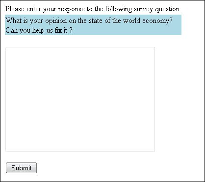
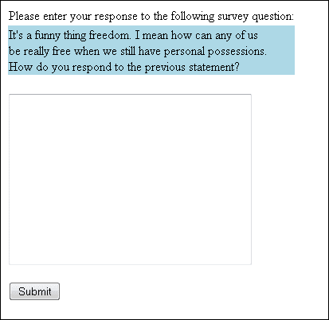
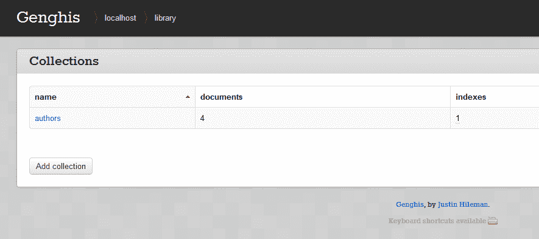
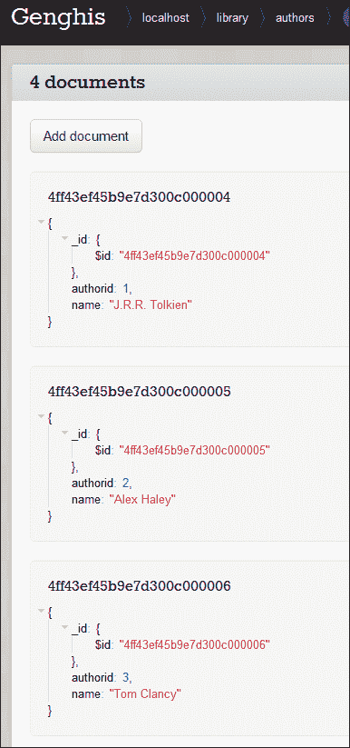
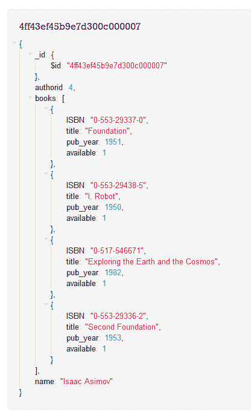

# 第九章：数据库

PHP 支持超过 20 种数据库，包括最流行的商业和开源种类。关系数据库系统，如 MariaDB、MySQL、PostgreSQL 和 Oracle，是大多数现代动态网站的支柱。这些系统存储着购物车信息、购买历史、产品评论、用户信息、信用卡号码，有时甚至是网页本身。

本章介绍如何从 PHP 访问数据库。我们重点介绍内置的*PHP Data Objects*（PDO）库，它允许你使用相同的函数访问任何数据库，而不是使用众多特定于数据库的扩展。在本章中，你将学习如何从数据库中获取数据、将数据存储到数据库中以及处理错误。最后，我们将展示一个示例应用程序，演示如何将各种数据库技术应用到实际中。

这本书无法详尽介绍使用 PHP 创建 Web 数据库应用程序的所有细节。想深入了解 PHP/MySQL 组合，请参阅《*Web Database Applications with PHP and MySQL*, Second Edition》（O’Reilly），作者是 Hugh Williams 和 David Lane，链接在[这里](http://oreil.ly/web_db_apps_PHP_MySQL)。

# 使用 PHP 访问数据库

从 PHP 访问数据库有两种方式。一种是使用特定于数据库的扩展，另一种是使用独立于数据库的 PDO 库。每种方法都有其优缺点。

如果你使用特定于某种数据库的扩展，你的代码将与你使用的数据库密切相关。例如，MySQL 扩展的函数名称、参数、错误处理等完全不同于其他数据库扩展的函数。如果你想将数据库从 MySQL 迁移到 PostgreSQL，将涉及对你的代码进行重大更改。而 PDO 则通过抽象层将数据库特定的功能隐藏，因此在不同数据库系统之间移动可能只需要修改程序中的一行代码或你的*php.ini*文件。

抽象层（如 PDO 库）的可移植性是有代价的，因为使用它的代码通常比使用本地数据库特定扩展的代码略慢一些。

请记住，抽象层在确保你的实际 SQL 查询可移植性方面毫无帮助。如果你的应用程序使用任何非通用 SQL，你将需要大量工作将你的查询从一个数据库转换到另一个数据库。在本章中，我们将简要讨论数据库接口的两种方法，然后看看管理 Web 动态内容的其他方法。

# 关系数据库和 SQL

关系数据库管理系统（RDBMS）是一个为您管理数据的服务器。数据被结构化成表，每个表有若干列，每列都有一个名称和类型。例如，为了跟踪科幻书籍，我们可能有一个“books”表记录标题（字符串）、发布年份（数字）和作者。

表被组合到数据库中，所以科幻书数据库可能有用于时间段、作者和反派的表。关系数据库管理系统通常有其自己的用户系统，用于控制对数据库的访问权限（例如，“用户 Fred 可以更新数据库作者”）。

PHP 使用结构化查询语言（SQL）与关系数据库（如 MariaDB 和 Oracle）进行通信。您可以使用 SQL 创建、修改和查询关系数据库。

SQL 的语法分为两部分。第一部分是数据操作语言（DML），用于检索和修改现有数据库中的数据。DML 非常紧凑，只有四个操作或动词：`SELECT`、`INSERT`、`UPDATE`和`DELETE`。用于创建和修改保存数据的数据库结构的 SQL 命令集称为数据定义语言，或 DDL。DDL 的语法没有像 DML 那样标准化，但由于 PHP 只是将您提供的任何 SQL 命令发送给数据库，您可以使用数据库支持的任何 SQL 命令。

###### 注意

用于创建此样本图书馆数据库的 SQL 命令文件可在名为*library.sql*的文件中找到。

假设您有一个名为`books`的表，这条 SQL 语句将插入一行新数据：

```php
INSERT INTO books VALUES (null, 4, 'I, Robot', '0-553-29438-5', 1950, 1);
```

此 SQL 语句插入一行新数据，但指定了具有值的列：

```php
INSERT INTO books (authorid, title, ISBN, pub_year, available)
 VALUES (4, 'I, Robot', '0-553-29438-5', 1950, 1);
```

要删除所有 1979 年出版的书籍（如果有的话），我们可以使用这条 SQL 语句：

```php
DELETE FROM books WHERE pub_year = 1979;
```

要将*Roots*的年份更改为 1983 年，请使用此 SQL 语句：

```php
UPDATE books SET pub_year=1983 WHERE title='Roots';
```

要仅获取 1980 年代出版的书籍，请使用：

```php
SELECT * FROM books WHERE pub_year > 1979 AND pub_year < 1990;
```

你还可以指定要返回的字段。例如：

```php
SELECT title, pub_year FROM books WHERE pub_year > 1979 AND pub_year < 1990;
```

您可以发出将来自多个表的信息汇总的查询。例如，此查询将`book`和`author`表连接起来，让我们看到每本书的作者是谁：

```php
SELECT authors.name, books.title FROM books, authors
 WHERE authors.authorid = books.authorid;
```

你甚至可以像这样简写（或别名）表名：

```php
SELECT a.name, b.title FROM books b, authors a WHERE a.authorid = b.authorid;
```

有关 SQL 的更多信息，请参阅[*SQL in a Nutshell*](http://oreil.ly/SQL_Nutshell3)，第三版（O'Reilly），作者 Kevin Kline。

## PHP 数据对象

[PHP 网站](http://php.net)对 PDO 有以下介绍：

> PHP 数据对象（PDO）扩展定义了一个轻量级、一致的接口，用于在 PHP 中访问数据库。每个实现 PDO 接口的数据库驱动程序都可以将特定于数据库的特性公开为常规扩展函数。请注意，您不能仅使用 PDO 扩展执行任何数据库函数；您必须使用特定于数据库的 PDO 驱动程序来访问数据库服务器。

PDO 的其他独特功能包括：

+   是一个本地 C 扩展

+   利用最新的 PHP 7 内部功能

+   使用结果集的缓冲读取数据

+   作为基础提供常见的数据库功能。

+   仍然能够访问特定于数据库的函数。

+   可以使用基于事务的技术。

+   可以与数据库中的大对象（LOBs）交互。

+   可以使用带绑定参数的准备和可执行 SQL 语句。

+   可以实现可滚动的游标。

+   提供了`SQLSTATE`错误代码和非常灵活的错误处理能力。

由于这里涉及的功能有很多，我们只会触及其中一部分，以展示 PDO 可以有多么有益。

首先，介绍一下 PDO。它为几乎所有数据库引擎提供了驱动程序，而那些 PDO 未提供的驱动程序应通过 PDO 的通用 ODBC 连接进行访问。PDO 是模块化的，至少需要启用两个扩展才能激活：PDO 扩展本身和特定于您将进行接口的数据库的 PDO 扩展。请参阅[在线文档](http://ca.php.net/pdo))以设置连接到您选择的数据库的连接。例如，要在 Windows 服务器上为 MySQL 交互建立 PDO，只需将以下两行代码输入到您的*php.ini*文件中，并重新启动服务器：

```php
extension=php_pdo.dll
extension=php_pdo_mysql.dll
```

PDO 库也是面向对象的扩展（正如您将在接下来的代码示例中看到的）。

### 建立连接

使用 PDO 的第一个要求是连接到所讨论的数据库，并将该连接保持在连接句柄变量中，如以下代码所示：

```php
$db = new PDO($*`dsn`*, $*`username`*, $*`password`*);
```

`$`*dsn*代表*数据源名称*，另外两个参数是不言自明的。特别是对于 MySQL 连接，您会写如下代码：

```php
$db = new PDO("mysql:host=localhost;dbname=library", "petermac", "abc123");
```

当然，您可以（应该）保持基于变量的用户名和密码参数，以便重用和灵活性原因。

### 与数据库交互

连接到数据库引擎并与要与之交互的数据库连接后，您可以使用该连接向服务器发送 SQL 命令。一个简单的`UPDATE`语句看起来像这样：

```php
$db->query("UPDATE books SET authorid=4 WHERE pub_year=1982");
```

此代码仅更新图书表并释放查询。这允许您直接向数据库发送简单的 SQL 命令（例如`UPDATE`、`DELETE`、`INSERT`）。

### 使用 PDO 和准备语句

更典型的情况是，您将使用*准备语句*，分阶段或步骤地发出 PDO 调用。考虑以下代码：

```php
$statement = $db->prepare("SELECT * FROM books");
$statement->execute();

// handle row results, one at a time
while($row = $statement->fetch()) {
 print_r($row);
 // ... or probably do something more meaningful with each returned row
}

$statement = null;
```

在这段代码中，我们首先“准备”SQL 代码，然后“执行”它。接下来，我们用`while`代码循环处理结果，最后通过将`null`赋给它来释放结果对象。在这个简单的示例中，这可能看起来并不那么强大，但是有其他可以与准备语句一起使用的功能。现在，考虑下面的代码：

```php
$statement = $db->prepare("INSERT INTO books (authorid, title, ISBN, pub_year)"
 . "VALUES (:authorid, :title, :ISBN, :pub_year)");

$statement->execute(array(
 'authorid' => 4,
 'title' => "Foundation",
 'ISBN' => "0-553-80371-9",
 'pub_year' => 1951),
);
```

在这里，我们使用四个命名占位符（*authorid*、*title*、*ISBN* 和 *pub_year*）准备了 SQL 语句。在这种情况下，这些恰好是数据库中列的名称，但这只是为了清晰起见——占位符名称可以是任何对您有意义的内容。在执行调用中，我们用想要在此特定查询中使用的实际数据替换这些占位符。准备语句的一个优点是，您可以多次执行相同的 SQL 命令，并通过数组每次传递不同的值。您还可以使用位置占位符（实际上不命名它们），用? 表示，这是要替换的位置项。看看前一个代码的以下变化：

```php
$statement = $db->prepare("INSERT INTO books (authorid, title, ISBN, pub_year)"
 . "VALUES (?, ?, ?, ?)");

$statement->execute(array(4, "Foundation", "0-553-80371-9", 1951));
```

这样做的效果是一样的，但代码更少，因为 SQL 语句的值区域不命名要替换的元素，因此在 `execute` 语句中，只需发送原始数据，而无需名称。您只需确保发送到准备语句的数据的位置。

### 处理事务

一些关系型数据库管理系统支持*事务*，在事务中，一系列数据库更改可以被提交（一次性应用）或回滚（丢弃，数据库中没有应用任何更改）。例如，当银行处理资金转账时，从一个账户取款并存入另一个账户必须同时发生——两者不能单独发生，两个操作之间也不应该有时间间隔。PDO 使用 `try...catch` 结构优雅地处理事务，例如 示例 9-1 中的这个。

##### 示例 9-1\. 使用 try...catch 代码结构

```php
try {
 // connection successful
 $db = new PDO("mysql:host=localhost;dbname=banking_sys", "petermac", "abc123");
} catch (Exception $error) {
 die("Connection failed: " . $error->getMessage());
}

try {
 $db->setAttribute(PDO::ATTR_ERRMODE, PDO::ERRMODE_EXCEPTION);
 $db->beginTransaction();

 $db->exec("insert into accounts (account_id, amount) values (23, '5000')" );
 $db->exec("insert into accounts (account_id, amount) values (27, '-5000')" );

 $db->commit();
} catch (Exception $error) {
 $db->rollback();
 echo "Transaction not completed: " . $error->getMessage();
}
```

如果整个事务无法完成，那么它将不会完成，并且会抛出异常。

如果在不支持事务的数据库上调用 `commit()` 或 `rollback()`，则这些方法将返回 `DB_ERROR`。

###### 注意

请确保检查您的底层数据库产品是否支持事务。

### 调试语句

PDO 接口提供了一种显示关于 PDO 语句的详细信息的方法，如果出现问题，这可能对调试非常有用。

```php
$statement = $db->prepare("SELECT title FROM books WHERE authorid = ?)";

$statement->bindParam(1, "12345678", PDO::PARAM_STR);
$statement->execute();

$statement->debugDumpParams();
```

调用语句对象上的 `debugDumpParams()` 方法会打印有关调用的各种信息：

```php
SQL: [35] SELECT title
 FROM books
 WHERE authorID = ?
Sent SQL: [44] SELECT title
 FROM books
 WHERE authorid = "12345678"
Params: 1
Key: Position #0:
paramno=0
name[0] ""
is_param=1
param_type=2
```

`Sent SQL` 部分仅在语句执行后显示；在此之前，只有 `SQL` 和 `Params` 部分可用。

# MySQLi 对象接口

PHP 最流行的数据库平台是 MySQL 数据库。如果你查看 [MySQL 网站](http://www.mysql.com)，你会发现有几个不同的 MySQL 版本可供使用。我们将看看自由发布版本，称为*社区服务器*。PHP 还有许多不同的接口可以访问这个数据库工具，所以我们将看看对象导向接口，称为 MySQLi，又称*MySQL Improved* 扩展。

最近，[MariaDB](http://mariadb.com) 开始超越 MySQL 成为 PHP 开发者首选的数据库。按设计，MariaDB 与 MySQL 兼容，这意味着你可以安装 MariaDB，卸载 MySQL，并将你的 PHP 配置指向 MariaDB，可能不需要其他更改。

如果你对面向对象的接口和概念不是很熟悉，请确保在深入学习本节之前阅读第六章。

由于这种面向对象的接口已经内置到 PHP 的标准安装配置中（只需在 PHP 环境中激活 MySQLi 扩展），你只需实例化其类，如下面的代码所示：

```php
$db = new mysqli(*`host`*, *`user`*, *`password`*, *`databaseName`*);
```

在这个例子中，我们有一个名为`library`的数据库，我们将使用虚构的用户名`petermac`和密码`1q2w3e9i8u7y`。实际使用的代码如下：

```php
$db = new mysqli("localhost", "petermac", "1q2w3e9i8u7y", "library");
```

这样我们就可以在 PHP 代码中访问数据库引擎本身；我们将稍后特别访问表和其他数据。一旦这个类被实例化为变量`$db`，我们就可以使用该对象的方法来进行数据库工作。

生成一些代码插入新书到`library`数据库的简短示例会看起来像这样：

```php
$db = new mysqli("localhost", "petermac", "1q2w3e9i8u7y", "library");

$sql = "INSERT INTO books (authorid, title, ISBN, pub_year, available)
 VALUES (4, 'I, Robot', '0-553-29438-5', 1950, 1)";

if ($db->query($sql)) {
 echo "Book data saved successfully.";
} else {
 echo "INSERT attempt failed, please try again later, or call tech support" ;
}

$db->close();
```

首先，我们将 MySQLi 类实例化为变量`$db`。接下来，我们构建我们的 SQL 命令字符串，并将其保存到名为`$sql`的变量中。然后我们调用类的 query 方法，同时测试其返回值以确定是否成功（`TRUE`），然后相应地注释到屏幕上。在这个阶段，你可能不想将内容`echo`到浏览器上，因为这只是一个例子。最后，我们在类上调用`close()`方法来清理和销毁类从内存中。

## 检索数据以进行显示

在你网站的另一个区域，你可能希望列出你的书籍清单，并显示它们的作者是谁。我们可以通过使用相同的 MySQLi 类，并处理从`SELECT` SQL 命令生成的结果集来实现这一点。有许多方法可以在浏览器中显示信息，我们将看一个例子来展示如何实现这一点。请注意，返回的结果是一个不同的对象，而不是我们首先实例化的`$db`。PHP 会为你实例化结果对象，并将其填充为任何返回的数据。

```php
$db = new mysqli("localhost", "petermac", "1q2w3e9i8u7y", "library");
$sql = "SELECT a.name, b.title FROM books b, authors a WHERE 
a.authorid=b.authorid";
$result = $db->query($sql);

while ($row = $result->fetch_assoc()) {
 echo "{$row['name']} is the author of: {$row['title']}<br />";
}

$result->close();
$db->close();
```

在这里，我们使用 `query()` 方法调用，并将返回的信息存储到名为`$result`的变量中。然后我们使用结果对象的 `fetch_assoc()` 方法逐行提供数据，并将该单行存储到名为`$row`的变量中。只要有行要处理，这个过程就会继续。在那个`while`循环内，我们将内容输出到浏览器窗口。最后，我们关闭结果和数据库对象。

输出如下所示：

```php
J.R.R. Tolkien is the author of: The Two Towers
J.R.R. Tolkien is the author of: The Return of The King
J.R.R. Tolkien is the author of: The Hobbit
Alex Haley is the author of: Roots
Tom Clancy is the author of: Rainbow Six
Tom Clancy is the author of: Teeth of the Tiger
Tom Clancy is the author of: Executive Orders...
```

###### 注意

在 MySQLi 中最有用的方法之一是`multi_query()`，它允许您在同一语句中运行多个 SQL 命令。如果您想基于类似数据进行`INSERT`和`UPDATE`语句，您可以在一个方法调用中完成所有操作。

当然，我们只是浅尝辄止 MySQLi 类的功能。如果您查阅其[文档](http://www.php.net/mysqli)，您将看到该类别的广泛方法列表，以及适当主题领域内的每个结果类别的详细记录。

# SQLite

SQLite 是一个紧凑、高性能（适用于小数据集）的数据库，正如其名字所示，它是轻量级的。安装 PHP 时，SQLite 即可立即投入使用，因此如果它符合您的数据库需求，务必详细了解一下。

SQLite 中的所有数据库存储都是基于文件的，因此无需使用单独的数据库引擎就可以完成。如果您试图构建一个数据库占用空间小且除了 PHP 之外没有其他产品依赖的应用程序，这可能非常有利。要开始使用 SQLite，您只需在代码中引用它。

SQLite 还提供了面向对象的接口，因此您可以使用以下语句实例化一个对象：

```php
$db = new SQLiteDatabase("library.sqlite");
```

这条语句的好处在于，如果找不到指定位置的文件，SQLite 会为您创建它。继续使用我们的`library`数据库示例，用于在 SQLite 中创建作者表并插入示例行的命令可能看起来像示例 9-2。

##### 示例 9-2\. SQLite 库作者表

```php
$sql = "CREATE TABLE 'authors' ('authorid' INTEGER PRIMARY KEY, 'name' TEXT)";

if (!$database->queryExec($sql, $error)) {
 echo "Create Failure - {$error}<br />";
} else {
 echo "Table Authors was created <br />";
}

$sql = <<<SQL
INSERT INTO 'authors' ('name') VALUES ('J.R.R. Tolkien');
INSERT INTO 'authors' ('name') VALUES ('Alex Haley');
INSERT INTO 'authors' ('name') VALUES ('Tom Clancy');
INSERT INTO 'authors' ('name') VALUES ('Isaac Asimov');
SQL; 
if (!$database->queryExec($sql, $error)) {
 echo "Insert Failure - {$error}<br />";
} else {
 echo "INSERT to Authors - OK<br />";
}
`Table` `Authors` `was` `createdINSERT` `to` `Authors` `-` `OK`
```

###### 注意

在 SQLite 中，与 MySQL 不同，没有`AUTO_INCREMENT`选项。相反，SQLite 会使任何用`INTEGER`和`PRIMARY KEY`定义的列成为自动递增列。当执行`INSERT`语句时，您可以通过为列提供值来覆盖此默认行为。

请注意，这些数据类型与我们在 MySQL 中看到的相当不同。请记住，SQLite 是一个精简的数据库工具，因此它在数据类型上非常“轻量级”；请参阅表 9-1 获取其使用的数据类型列表。

表 9-1\. SQLite 中可用的数据类型

| 数据类型 | 解释 |
| --- | --- |
| 文本 | 将数据存储为`NULL`、`TEXT`或`BLOB`内容。如果将数字提供给文本字段，则在存储之前将其转换为文本。 |
| 数值 | 可以存储整数或实数数据。如果提供文本数据，SQLite 尝试将信息转换为数值格式。 |
| 整数 | 表现与数值数据类型相同。但是，如果提供实数类型的数据，则将其存储为整数。这可能会影响数据存储的准确性。 |
| 实数 | 表现与数值数据类型相同，但会将整数值强制转换为浮点表示。 |
| None | 这是一个万能的数据类型；它不偏向于任何基本类型。数据被完全按照提供的方式存储。 |

在示例 9-3 中运行以下代码以创建书籍表并将一些数据插入到数据库文件中。

##### 示例 9-3\. SQLite 库书籍表

```php
$db = new SQLiteDatabase("library.sqlite");

$sql = "CREATE TABLE 'books' ('bookid' INTEGER PRIMARY KEY,
 'authorid' INTEGER,
 'title' TEXT,
 'ISBN' TEXT,
 'pub_year' INTEGER,
 'available' INTEGER,
)";

if ($db->queryExec($sql, $error) == FALSE) {
 echo "Create Failure - {$error}<br />";
} else {
 echo "Table Books was created<br />";
}

$sql = <<<SQL
INSERT INTO books ('authorid', 'title', 'ISBN', 'pub_year', 'available')
VALUES (1, 'The Two Towers', '0-261-10236-2', 1954, 1);

INSERT INTO books ('authorid', 'title', 'ISBN', 'pub_year', 'available')
VALUES (1, 'The Return of The King', '0-261-10237-0', 1955, 1);

INSERT INTO books ('authorid', 'title', 'ISBN', 'pub_year', 'available')
VALUES (2, 'Roots', '0-440-17464-3', 1974, 1);

INSERT INTO books ('authorid', 'title', 'ISBN', 'pub_year', 'available')
VALUES (4, 'I, Robot', '0-553-29438-5', 1950, 1);

INSERT INTO books ('authorid', 'title', 'ISBN', 'pub_year', 'available')
VALUES (4, 'Foundation', '0-553-80371-9', 1951, 1);
SQL;

if (!$db->queryExec($sql, $error)) {
 echo "Insert Failure - {$error}<br />";
} else {
 echo "INSERT to Books - OK<br />";
}
```

注意，我们可以同时执行多个 SQL 命令。我们也可以使用 MySQLi 来做到这一点，但您必须记住使用`multi_query()`方法；而在 SQLite 中，可以使用`queryExec()`方法来实现。在加载了一些数据到数据库后，请运行示例 9-4 中的代码。

##### 示例 9-4\. SQLite 选择书籍

```php
$db = new SQLiteDatabase("c:/copy/library.sqlite");

$sql = "SELECT a.name, b.title FROM books b, authors a WHERE a.authorid=b.authorid";
$result = $db->query($sql);

while ($row = $result->fetch()) {
 echo "{$row['a.name']} is the author of: {$row['b.title']}<br/>";
}
```

上述代码产生以下输出：

```php
J.R.R. Tolkien is the author of: The Two Towers
J.R.R. Tolkien is the author of: The Return of The King
Alex Haley is the author of: Roots
Isaac Asimov is the author of: I, Robot
Isaac Asimov is the author of: Foundation
```

SQLite 几乎可以做到与“更大”的数据库引擎一样多的功能——“lite”并不是指其功能，而是指其对系统资源的需求较低。当您需要一个更便携且对资源要求较少的数据库时，您应始终考虑使用 SQLite。

###### 注意

如果您刚开始接触 Web 开发的动态方面，您可以使用 PDO 与 SQLite 进行接口交互。这样，您可以从轻量级数据库开始，并在准备好时逐步转向更强大的 MySQL 数据库服务器。

# 直接文件级别操作

PHP 在其庞大的工具集中有许多隐藏的小特性。其中一个经常被忽视的特性是其处理复杂文件的不可思议能力。当然，每个人都知道 PHP 可以打开文件，但它究竟能做些什么呢？考虑以下示例，突显了其真正的可能性范围。本书的一位作者曾被一位“没钱”的潜在客户联系，但希望开发一个动态网络调查。当然，作者最初向客户展示了 PHP 与 MySQLi 数据库交互的奇迹。然而，在听到当地 ISP 的月费用后，客户问是否有其他（更便宜）的方法来完成工作。事实证明，如果您不想使用 SQLite，可以使用文件来管理和操作少量文本以便稍后检索。我们将在这里讨论的功能在单独使用时并不算特别——实际上，它们确实是每个人可能都熟悉的基本 PHP 工具集的一部分，正如您可以在表 9-2 中看到的那样。

表 9-2\. 常用的 PHP 文件管理函数

| 函数名 | 使用描述 |
| --- | --- |
| `mkdir()` | 用于在服务器上创建目录。 |
| `file_exists()` | 用于确定提供位置是否存在文件或目录。 |
| `fopen()` | 用于打开现有文件以供读取或写入（请查看正确使用的详细选项）。 |
| `fread()` | 用于将文件内容读取到 PHP 变量中以供使用。 |
| `flock()` | 用于在写入时对文件获取独占锁定。 |
| `fwrite()` | 用于将变量的内容写入文件。 |
| `filesize()` | 在读取文件时，用于确定一次读取多少字节。 |
| `fclose()` | 用于一旦文件的有用性结束后关闭文件。 |

有趣的部分在于将所有功能绑定在一起以实现您的目标。例如，让我们创建一个涵盖两页问题的小型网络表单调查。用户可以输入一些意见，并在以后的日期返回以完成调查，从他们离开的地方继续。我们将勾勒出我们小应用程序的逻辑，并希望您能看到它的基本前提可以扩展到完整的生产类型的使用。

我们首先要做的是允许用户随时返回此调查并提供额外的输入。为此，我们需要一个唯一的标识符来区分每个用户。一般来说，一个人的电子邮件地址是唯一的（其他人可能知道并使用它，但这涉及网站安全和/或控制身份盗窃的问题）。为了简单起见，在这里我们假设使用电子邮件地址是诚实的，不必理会密码系统。因此，一旦我们获得了用户的电子邮件地址，我们需要将该信息存储在与其他网站访问者不同的位置。为此，我们将为服务器上的每个访问者创建一个目录文件夹（当然，这假设您可以访问并具有适当权限的服务器位置来允许文件的读写）。由于访客的电子邮件地址是相对唯一的标识符，我们将简单地使用该标识符命名新的目录位置。一旦我们创建了一个目录（测试用户是否从上一次会话返回），我们将读取任何已经存在的文件内容，并在 `<textarea>` 表单控件中显示它们，以便访客可以查看他或她之前写过的内容（如果有的话）。然后，在表单提交时保存访客的评论，并继续下一个调查问题。示例 9-5 展示了第一页的代码（这里包含 `<?php` 标签，因为在列表中的某些位置它们被打开和关闭）。

##### 示例 9-5\. 文件级访问

```php
session_start();

if (!empty($_POST['posted']) && !empty($_POST['email'])) {
 $folder = "surveys/" . strtolower($_POST['email']);

 // send path information to the session
 $_SESSION['folder'] = $folder;

 if (!file_exists($folder)) {
 // make the directory and then add the empty files
 mkdir($folder, 0777, true);
 }

 header("Location: 08_6.php");
} else { ?>
```

```php
<html>
 <head>
 <title>Files & folders - On-line Survey</title>
 </head>

 <body bgcolor="white" text="black">
 <h2>Survey Form</h2>

 <p>Please enter your e-mail address to start recording your comments</p>

 <form action="<?php echo $_SERVER['PHP_SELF']; ?>" method="POST">
 <input type="hidden" name="posted" value="1">
 <p>Email address: <input type="text" name="email" size="45" /><br />
 <input type="submit" name="submit" value="Submit"></p>
 </form>
 </body>
 </html>
<?php }
```

图 9-1 显示了要求访客提交电子邮件地址的网页。


###### 图 9-1\. 调查登录界面

正如您所见，我们首先打开一个新的会话，以便将访客的信息传递给后续页面。然后我们测试确认代码中下方的表单是否已经提交，以及电子邮件地址字段是否有输入。如果测试失败，表单将简单地重新显示。当然，此功能的生产版本会发送错误消息告知用户输入有效文本。

一旦此测试通过（假设表单已正确提交），我们将创建一个`$folder`变量，其中包含我们要保存调查信息的目录结构，并将用户的电子邮件地址附加到其中；我们还将这个新创建的变量（`$folder`）的内容保存到会话中以供以后使用。在这里，我们只是取出电子邮件地址并使用它（再次强调，如果这是一个安全站点，我们会采取适当的安全措施保护数据）。

接下来，我们要检查目录是否已经存在。如果不存在，我们使用`mkdir()`函数创建它。此函数接受路径和要创建的目录的名称作为参数，并尝试创建它。

###### 注意

在 Linux 环境中，`mkdir()`函数有其他选项可以控制新创建的目录的访问级别和权限，因此如果适用于您的环境，请务必查阅这些选项。

在验证目录存在后，我们简单地将浏览器重定向到调查的第一页。

现在我们在调查的第一页（见图 9-2）上，表单已准备好使用了。



###### 图 9-2\. 调查的第一页

然而，这是一个动态生成的表单，正如您在示例 9-6 中所看到的。

##### 示例 9-6\. 文件级访问，继续

```php
<?php
session_start();
$folder = $_SESSION['folder'];
$filename = $folder . "/question1.txt";

// open file for reading then clean it out
$file_handle = fopen($filename, "a+");

// pick up any text in the file that may already be there
$comments = file_get_contents($filename) ;
fclose($file_handle); // close this handle

if (!empty($_POST['posted'])) {
 // create file if first time and then
 //save text that is in $_POST['question1']
 $question1 = $_POST['question1'];
 $file_handle = fopen($filename, "w+");

 // open file for total overwrite
 if (flock($file_handle, LOCK_EX)) {
 // do an exclusive lock
 if (fwrite($file_handle, $question1) == FALSE) {
 echo "Cannot write to file ($filename)";
 }

 // release the lock
 flock($file_handle, LOCK_UN);
 }

 // close the file handle and redirect to next page ?
 fclose($file_handle);
 header( "Location: page2.php" );
} else { ?>
 <html>
 <head>
 <title>Files & folders - On-line Survey</title>
 </head>

 <body>
 <table border="0">
 <tr>
 <td>Please enter your response to the following survey question:</td>
 </tr>
 <tr bgcolor=lightblue>
 <td>
 What is your opinion on the state of the world economy?<br/>
 Can you help us fix it ?
 </td>
 </tr>
 <tr>
 <td>
 <form action="<?php echo $_SERVER['PHP_SELF']; ?>" method="POST">
 <input type="hidden" name="posted" value="1"><br/>
 <textarea name="question1" rows=12 cols=35><?= $comments ?></textarea>
 </td>
 </tr>

 <tr>
 <td><input type="submit" name="submit" value="Submit"></form></td>
 </tr>
 </table>
<?php } ?>
```

在这里，让我们突出几行代码，因为这是文件管理和操作真正发生的地方。在获取所需的会话信息并将文件名追加到`$filename`变量之后，我们就可以开始处理文件了。请记住，这个过程的目的是显示可能已保存在文件中的任何信息，并允许用户输入信息（或修改已输入的信息）。因此，在代码的顶部附近，您会看到以下命令：

```php
$file_handle = fopen($filename, "a+");
```

使用文件打开函数`fopen()`，我们要求 PHP 为我们提供一个文件句柄，并将其存储在名为`$file_handle`的变量中。请注意，此处还向函数传递了另一个参数：`a+`选项。[PHP 网站](http://php.net)提供了这些选项字母的完整列表及其含义。`a+`选项使文件以读写方式打开，并将文件指针置于任何现有文件内容的末尾。如果文件不存在，PHP 将尝试创建它。查看接下来的两行代码，您会看到整个文件被读取（使用`file_get_contents()`函数）到`$comments`变量中，然后关闭文件：

```php
$comments = file_get_contents($filename);
fclose($file_handle);
```

接下来，我们想看看此程序文件的表单部分是否已执行，如果是，我们必须保存输入到文本区域的任何信息。这一次，我们再次打开相同的文件，但使用`w+`选项，这会导致解释器只打开文件进行写入—如果文件不存在，则创建它，如果存在，则清空它。然后，文件指针被放置在文件的开头。本质上，我们想清空文件的当前内容，并用完全新的文本内容替换它。为此，我们使用`fwrite()`函数：

```php
// do an exclusive lock
if (flock($file_handle, LOCK_EX)) {
 if (fwrite($file_handle, $question1) == FALSE){
 echo "Cannot write to file ($filename)";
 }
 // release the lock
 flock($file_handle, LOCK_UN);
}
```

我们必须确保这些信息确实保存到指定的文件中，因此我们在文件写入操作周围包裹了几个条件语句，以确保一切顺利进行。首先，我们尝试在问题文件上获得独占锁定（使用`flock()`函数）；这将确保在我们操作文件时，没有其他进程可以访问该文件。写入完成后，我们释放文件上的锁定。这只是一种预防措施，因为文件管理是基于第一个网页表单中输入的电子邮件地址，并且每个调查都有自己的文件夹位置，因此除非两个人恰好使用相同的电子邮件地址，否则不应发生使用冲突。

正如你所见，文件写入函数使用`$file_handle`变量将`$question1`变量的内容添加到文件中。然后当我们完成后，我们简单地关闭文件，转到调查的下一页，如图 9-3 所示。



###### 图 9-3\. 调查第二页

正如你在例子 9-7 中所见，处理这个文件（称为*question2.txt*）的代码与前一个代码相同，除了文件名不同。

##### 例子 9-7\. 文件级访问，续

```php
<?php
session_start();
$folder = $_SESSION['folder'];
$filename = $folder . "/question2.txt" ;

// open file for reading then clean it out
$file_handle = fopen($filename, "a+");

// pick up any text in the file that may already be there
$comments = fread($file_handle, filesize($filename));
fclose($file_handle); // close this handle

if ($_POST['posted']) {
 // create file if first time and then save
 //text that is in $_POST['question2']
 $question2 = $_POST['question2'];

 // open file for total overwrite
 $file_handle = fopen($filename, "w+");

 if(flock($file_handle, LOCK_EX)) { // do an exclusive lock
 if(fwrite($file_handle, $question2) == FALSE) {
 echo "Cannot write to file ($filename)";
 }

 flock($file_handle, LOCK_UN); // release the lock
 }

 // close the file handle and redirect to next page ?
 fclose($file_handle);

 header( "Location: last_page.php" );
} else { ?>
 <html>
 <head>
 <title>Files & folders - On-line Survey</title>
 </head>

 <body>
 <table border="0">
 <tr>
 <td>Please enter your comments to the following survey statement:</td>
 </tr>

 <tr bgcolor="lightblue">
 <td>It's a funny thing freedom. I mean how can any of us <br/>
 be really free when we still have personal possessions.
 How do you respond to the previous statement?</td>
 </tr>

 <tr>
 <td>
 <form action="<?php echo $_SERVER['PHP_SELF']; ?>" method=POST>
 <input type="hidden" name="posted" value="1"><br/>
 <textarea name="question2" rows="12" cols="35"><?= $comments ?></textarea>
 </td>
 </tr>

 <tr>
 <td><input type="submit" name="submit" value="Submit"></form></td>
 </tr>
</table>
<?php } ?>
```

这种文件处理可以持续进行，时间长短由你决定，因此你的调查可以无限延续。为了增加趣味性，你可以在同一页上询问多个问题，并简单地给每个问题分配一个独立的文件名。这里要指出的唯一独特项是，一旦提交了此页面并存储了文本，它将被重定向到一个名为*last_page.php*的 PHP 文件。这个页面不包含在代码示例中，因为它仅仅是感谢用户填写调查的页面。

当然，在几页之后，每页多达五个问题，你可能会发现自己有大量的单个文件需要管理。幸运的是，PHP 还有其他文件处理函数供你使用。例如，`file()`函数是`fread()`函数的替代品，它将文件的整个内容读取到一个数组中，每行一个元素。如果你的信息格式正确——每行以换行符`\n`结尾——那么你可以非常容易地将多个信息存储在单个文件中。当然，这也需要使用适当的循环控制来处理 HTML 表单的创建以及记录表单中的条目。

当涉及文件处理时，你还可以在 PHP 网站上查看更多选项。如果你访问“文件系统”，你会找到一个包含超过 70 个函数的列表——当然，这里讨论的函数也包括在内。你可以使用`is_readable()`或`is_writable()`函数检查文件是否可读或可写。你可以检查文件权限、空闲磁盘空间或总磁盘空间，你可以删除文件、复制文件等等。归根结底，如果你有足够的时间和愿望，甚至可以编写一个完整的 Web 应用程序而不需要或使用数据库系统。

当有一天到来，这种情况很可能会发生，即你遇到一位客户并不想花大笔钱使用数据库引擎时，你可以提供一种替代方案。

# MongoDB

我们将要看的最后一种数据库类型是 NoSQL 数据库。NoSQL 数据库因其在系统资源上的轻量级特性而备受青睐，更重要的是，它们不受传统 SQL 命令结构的限制。NoSQL 数据库也因同样两个原因而在移动设备如平板电脑和智能手机中变得越来越流行。

NoSQL 数据库世界的佼佼者之一就是 MongoDB。在这里我们只会浅尝 MongoDB 的表面，只是为了让你体验一下它的潜力。如需更详细的内容，请参阅[《MongoDB 与 PHP》](http://bit.ly/MongoDB_PHP)（O’Reilly）由 Steve Francia 编著。

关于 MongoDB，首先要理解的是它不是传统的数据库。它有自己的设置和术语。习惯与它一起工作会花费传统 SQL 数据库用户一些时间。表 9-3 试图与“标准”SQL 术语进行一些类比。

表 9-3\. 典型的 MongoDB/SQL 对应关系

| 传统 SQL 术语 | MongoDB 术语 |
| --- | --- |
| 数据库 | 数据库 |
| 表格 | 集合 |
| 行 | 文档。没有关联，不像数据库的“行”；相反，可以看作是数组。 |

在 MongoDB 范例中，没有确切等价的数据库行。在集合内部处理数据的最佳方式之一是将其视为多维数组，稍后我们将重新调整我们的 `library` 数据库示例时会看到。

如果你只是想在本地主机上尝试 MongoDB（推荐用于熟悉它），你可以使用诸如[Zend Server CE](http://zend.com)之类的一体化工具来设置本地环境，并安装了 Mongo 驱动程序。你仍然需要从[MongoDB 网站](http://www.mongodb.org)下载服务器本身，并按照说明为你自己的本地环境设置数据库服务器引擎。

一个非常有用的基于 Web 的工具，用于浏览 MongoDB 数据并操作集合和文档，是[Genghis](http://genghisapp.com)。只需下载项目并将其放入本地主机的自己文件夹中，然后调用 *genghis.php*。如果数据库引擎正在运行，它将被检测到并显示给你（见图 9-4）。



###### 图 9-4\. Genghis MongoDB web interface 示例

现在让我们来看一些示例代码。看看示例 9-8，看看 Mongo 数据库正在形成的开端。

##### 示例 9-8\. MongoDB 库

```php
$mongo = new Mongo();
$db = $mongo->library;
$authors = $db->authors;

$author = array('authorid' => 1, 'name' => "J.R.R. Tolkien");
$authors->insert($author);

$author = array('authorid' => 2, 'name' => "Alex Haley");
$authors->insert($author);

$author = array('authorid' => 3, 'name' => "Tom Clancy");
$authors->save($author);

$author = array('authorid' => 4, 'name' => "Isaac Asimov");
$authors->save($author);
```

第一行创建了与 MongoDB 引擎的新连接，并创建了一个对象接口。接下来的行连接到 `library` “集合”；如果此集合不存在，Mongo 将为您创建它（因此在 Mongo 中不需要预先创建集合）。然后，我们使用 `$db` 连接到 `library` 数据库创建了一个对象接口，并创建了一个集合，用于存储我们的作者数据。接下来的四组代码将文档添加到 `authors` 集合中，使用了两种不同的方法。前两个示例使用 `insert()` 方法，后两个示例使用 `save()` 方法。这两种方法之间唯一的区别是，`save()` 方法会更新已存在的文档值，如果存在 `_id` 键的话（稍后详细讨论 `_id`）。

在浏览器中执行此代码，你应该会看到图 9-5 中显示的样本数据。正如你所见，一个名为 `_id` 的实体被创建并与插入的数据关联。这是自动分配给所有创建的集合的主键。如果我们想依赖这个键——除了显而易见的复杂性外——我们不必在前面的代码中添加自己的 `authorid` 信息。



###### 图 9-5\. 作者 Mongo 文档数据示例

## 检索数据

数据存储后，我们现在可以开始查看访问它的方法。示例 9-9 展示了其中一种选项。

##### 示例 9-9\. MongoDB 数据选择示例

```php
$mongo = new Mongo();
$db = $mongo->library;
$authors = $db->authors;

$data = $authors->findone(array('authorid' => 4));

echo "Generated Primary Key: {$data['_id']}<br />";
echo "Author name: {$data['name']}";
```

前三行代码与之前相同，因为我们仍然想连接到同一个数据库，并利用同一个集合（`library`）和文档（`authors`）。之后，我们使用 `findone()` 方法，将其传递给一个包含可用于查找我们想要的信息的唯一数据片段的数组——在本例中是 Isaac Asimov 的 `authorid`，即 `4`。我们将返回的信息存储到一个名为 `$data` 的数组中。

###### 注意

作为一个很好的简化，您可以将 Mongo 文档中的信息视为基于数组的。

然后，我们可以根据需要使用该数组来显示文档返回的数据。以下是前面代码的结果输出。注意 Mongo 创建的主键大小。

```php
Generated Primary Key: 4ff43ef45b9e7d300c000007
Author name: Isaac Asimov
```

## 插入更复杂的数据

接下来，我们希望继续通过向文档添加一些书籍来扩展我们的 `library` 示例数据库，这些书籍与特定作者有关。这是不同数据库中不同表的类比可以崩溃的地方。考虑示例 9-10，它向 `authors` 文档添加了四本书，实质上是作为多维数组。

##### 示例 9-10\. MongoDB 简单数据更新/插入

```php
$mongo = new Mongo();
$db = $mongo->library;
$authors = $db->authors;

$authors->update(
 array('name' => "Isaac Asimov"),
 array('$set' =>
 array('books' =>
 array(
 "0-425-17034-9" => "Foundation",
 "0-261-10236-2" => "I, Robot",
 "0-440-17464-3" => "Second Foundation",
 "0-425-13354-0" => "Pebble In The Sky",
 )
 )
 )
);
```

在此之后，我们通过建立必要的连接，使用 `update()` 方法，并使用数组的第一个元素（`update()` 方法的第一个参数）作为唯一的查找标识符，并使用一个称为 `$set` 的定义运算符作为第二个参数，将书籍数据附加到提供的第一个参数的键上。

###### 注意

在生产环境中使用这些特殊操作符 `$set` 和 `$push`（本文未涉及）之前，您应该进行调查并完全理解它们。请参阅[MongoDB 文档](http://bit.ly/12YY646) 以获取更多信息和这些操作符的完整列表。

示例 9-11 提供了另一种实现相同目标的方法，不同之处在于我们提前准备要插入和附加的数组，并使用 Mongo 创建的 `_id` 作为位置键。

##### 示例 9-11\. MongoDB 数据更新/插入

```php
$mongo = new Mongo();
$db = $mongo->library;
$authors = $db->authors;

$data = $authors->findone(array('name' => "Isaac Asimov"));

$bookData = array(
 array(
 "ISBN" => "0-553-29337-0",
 "title" => "Foundation",
 "pub_year" => 1951,
 "available" => 1,
 ),
 array(
 "ISBN" => "0-553-29438-5",
 "title" => "I, Robot",
 "pub_year" => 1950,
 "available" => 1,
 ),
 array(
 "ISBN" => "0-517-546671",
 "title" => "Exploring the Earth and the Cosmos",
 "pub_year" => 1982,
 "available" => 1,
 ),
 array(
 "ISBN' => "0-553-29336-2",
 'title" => "Second Foundation",
 "pub_year" => 1953,
 "available" => 1,
 ),
);

$authors->update(
 array("_id" => $data["_id"]),
 array("$set" => array("books" => $bookData))
);
```

在我们之前的两个代码示例中，我们没有向书籍数据数组添加任何键。我们可以这样做，但是允许 Mongo 将该数据管理为多维数组同样简单。图 9-6 显示了当在 Genghis 中显示来自示例 9-11 的数据时的样子。



###### 图 9-6\. 向作者添加书籍数据

示例 9-12 展示了我们的 Mongo 数据库中存储的更多数据。它在示例 9-9 的基础上再添加了几行代码；在这里，我们引用了前一段代码中插入书籍详细信息的自动生成的自然键。

##### 示例 9-12\. MongoDB 数据查找和显示

```php
$mongo = new Mongo();
$db = $mongo->library;
$authors = $db->authors;

$data = $authors->findone(array("authorid" => 4));

echo "Generated Primary Key: {$data['_id']}<br />";
echo "Author name: {$data['name']}<br />";
echo "2nd Book info - ISBN: {$data['books'][1]['ISBN']}<br />";
echo "2nd Book info - Title: {$data['books'][1]['title']<br />";
```

前面代码生成的输出如下（请记住数组是从零开始的）：

```php
Generated Primary Key: 4ff43ef45b9e7d300c000007
Author name: Isaac Asimov
2nd Book info - ISBN: 0-553-29438-5
2nd Book info - Title: I, Robot
```

关于如何在 PHP 中使用和操作 MongoDB 的更多信息，请参阅[PHP 网站上的文档](https://oreil.ly/GB6iV)。

# 接下来的内容

在下一章中，我们将探讨在由 PHP 生成的页面中包含图形媒体的各种技术，以及在 Web 服务器上动态生成和操作图形的方法。
