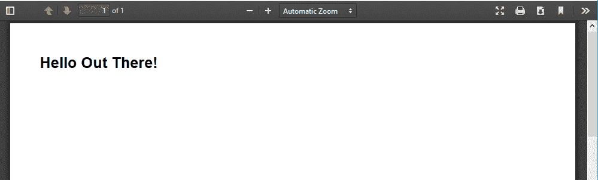
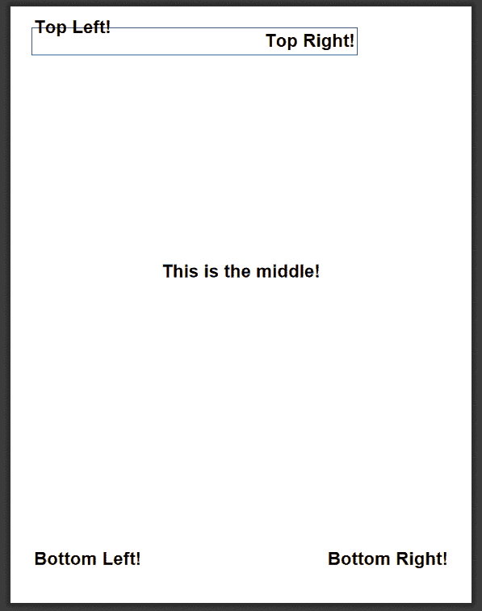
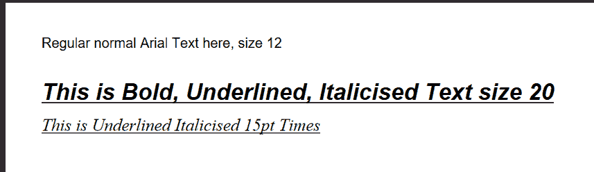
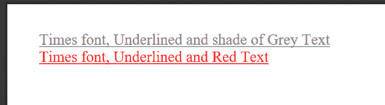
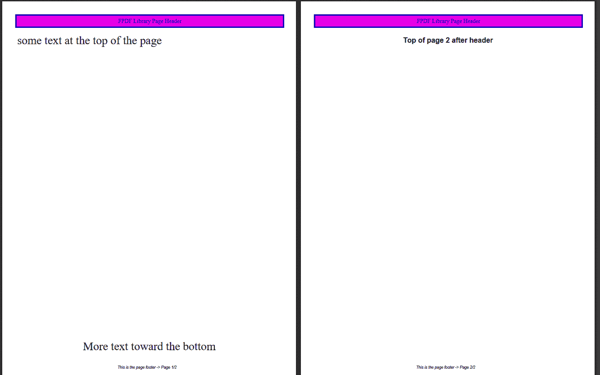
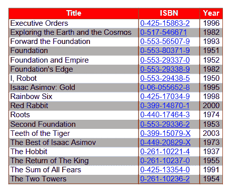

# 第十一章：PDF

Adobe 的便携式文档格式（PDF）是一种在屏幕和打印输出中获得一致外观的流行方式，本章将向您展示如何动态创建包含文本、图形、链接等内容的 PDF 文件。这样做将为许多应用程序打开大门。您几乎可以创建任何类型的商业文档，包括格式信、发票和收据。此外，您还可以通过将文本叠加到纸质表格的扫描副本上并将结果保存为 PDF 文件来自动化大部分文书工作。

# PDF 扩展

PHP 有几个用于生成 PDF 文档的库。本章的示例使用流行的[FPDF 库](http://www.fpdf.org)，这是一组 PHP 代码，您可以通过`require()`函数包含在脚本中——它不需要任何服务器端配置或支持，因此即使在没有主机支持的情况下也可以使用。但是，PDF 文件的基本概念、结构和特性应该适用于所有的 PDF 库。

###### 注意

另一个生成 PDF 的库，[TCPDF](https://tcpdf.org)，在处理 HTML 特殊字符和 UTF-8 多语言输出方面比 FPDF 更强大。如果您需要这种功能，请查看它。您将使用的方法是`writeHTMLCell()`和`writeHTML()`。

# 文档和页面

PDF 文档由多个页面组成，每个页面包含文本和/或图像。本节将向您展示如何创建文档、在文档中添加页面、向页面写入文本，并在完成后将页面发送回浏览器。

###### 注意

本章示例假设您至少已将 Adobe PDF 文档查看器安装为浏览器的附加组件。否则，这些示例将无法运行。您可以从[Adobe 网站](https://oreil.ly/xXA3k)获取该附加组件。

## 一个简单的示例

让我们从一个简单的 PDF 文档开始。示例 11-1 将文本“Hello Out There！”写入一个页面，然后显示生成的 PDF 文档。

##### 示例 11-1。“PDF 中的 Hello Out There！”

```php
<?php

require("../fpdf/fpdf.php"); // path to fpdf.php

$pdf = new FPDF();
$pdf->addPage();

$pdf->setFont("Arial", 'B', 16);
$pdf->cell(40, 10, "Hello Out There!");

$pdf->output();
```

示例 11-1 展示了创建 PDF 文档的基本步骤：创建一个新的 PDF 对象实例、创建一个页面、为 PDF 文本设置有效的字体，并将文本写入页面上的“单元格”中。图 11-1 展示了示例 11-1 的输出。



###### 图 11-1。“PDF 中的 Hello Out There！”示例

## 初始化文档

在示例 11-1 中，我们首先通过`require()`函数引用了 FPDF 库。然后代码创建了 FPDF 对象的新实例。请注意，对新 FPDF 实例的所有调用都是该对象中方法的面向对象调用。（如果您在本章中的示例中遇到问题，请参阅第六章。）创建了 FPDF 对象的新实例后，您需要向对象添加至少一页，因此调用了`AddPage()`方法。接下来，您需要为即将生成的输出设置字体，使用`SetFont()`调用。然后，使用`cell()`方法调用，您可以将输出发送到创建的文档。要将所有工作发送到浏览器，只需使用`output()`方法。

## 输出基本文本单元格

在 FPDF 库中，*单元格*是页面上的一个矩形区域，您可以创建并控制它。该单元格可以具有高度、宽度和边框，并且当然可以包含文本。`cell()`方法的基本语法如下：

```php
cell(`float` w [, `float` h [, `string` txt [, `mixed` border
 [, `int` ln [, `string` align [, `int` fill [, `mixed` link]]]]]]])
```

第一个选项是宽度，然后是高度，接着是要输出的文本。然后是边框，换行控制，文本的对齐方式，文本的填充颜色，最后是是否希望文本成为 HTML 链接。例如，如果我们想要更改我们的原始示例以具有边框并且居中对齐，我们将更改`cell()`代码如下：

```php
$pdf->cell(90, 10, "Hello Out There!", 1, 0, 'C');
```

在使用 FPDF 生成 PDF 文档时，您将广泛使用`cell()`方法，因此最好花一些时间了解此方法的细节。我们将在本章中涵盖大部分内容。

# 文本

文本是 PDF 文件的核心。因此，有许多选项可更改其外观和布局。在本节中，我们将讨论 PDF 文档中使用的坐标系统、插入文本和更改文本属性的功能，以及字体的使用。

## 坐标

在 FPDF 库中，PDF 文档的原点（0, 0）位于定义页面的左上角。所有的测量单位都是以点、毫米、英寸或厘米来指定的。点（默认）等于 1/72 英寸，或 0.35 毫米。在示例 11-2 中，我们使用`FPDF()`类的实例化构造方法将页面尺寸的默认值更改为英寸。此调用的其他选项包括页面的方向（纵向或横向）和页面大小（通常是 Legal 或 Letter）。该实例化的所有选项显示在表 11-1 中。

表 11-1\. FPDF 选项

| `FPDF()`构造函数参数 | 参数选项 |
| --- | --- |
| 方向 | `P`（纵向；默认）`L`（横向） |

| 测量单位 | `pt`（点，或 1/72 英寸，默认）`in`（英寸）

`mm`（毫米）

`cm`（厘米）|

| 页面尺寸 | `Letter`（默认）`Legal`

`A5`

`A3`

`A4`或可自定义尺寸（请参阅 FPDF 文档）|

此外，在示例 11-2 中，我们使用`ln()`方法调用来管理页面的当前行。`ln()`方法可以带有一个可选参数，指示它移动多少个单位（即构造函数调用中定义的度量单位）。在我们的情况下，我们将页面定义为以英寸为单位，因此我们在文档中以英寸为单位移动。此外，由于我们将页面定义为以英寸为单位，因此`cell()`方法的坐标也以英寸为单位呈现。

###### 注

这并不是构建 PDF 页面的理想方法，因为使用英寸单位时，您无法像使用点或毫米单位那样精细控制。在此示例中，我们使用英寸单位以便更清楚地看到示例。

示例 11-2 将文本放置在页面的角落和中心。

##### 示例 11-2\. 演示坐标和线条管理

```php
<?php
require("../fpdf/fpdf.php");

$pdf = new FPDF('P', 'in', 'Letter');
$pdf->addPage();

$pdf->setFont('Arial', 'B', 24);

$pdf->cell(0, 0, "Top Left!", 0, 1, 'L');
$pdf->cell(6, 0.5, "Top Right!", 1, 0, 'R');
$pdf->ln(4.5);

$pdf->cell(0, 0, "This is the middle!", 0, 0, 'C');
$pdf->ln(5.3);

$pdf->cell(0, 0, "Bottom Left!", 0, 0, 'L');
$pdf->cell(0, 0, "Bottom Right!", 0, 0, 'R');

$pdf->output();
```

示例 11-2 的输出显示在图 11-2 中。



###### 图 11-2\. 坐标和线条控制演示输出

让我们稍微分析一下这段代码。在我们用构造函数定义页面之后，我们看到了以下代码行：

```php
$pdf->cell(0, 0, "Top Left!", 0, 1, 'L');
$pdf->cell(6, 0.5, "Top Right!", 1, 0, 'R');
$pdf->ln(4.5);
```

第一个`cell()`方法调用告诉 PDF 类从顶部坐标（0,0）开始，并输出左对齐文本“Top Left!”，无边框，并在输出结束时插入换行符。接下来的`cell()`方法调用会创建一个宽度为六英寸的单元格，再次从页面左侧开始，带有半英寸高的边框和右对齐文本“Top Right!”。然后，我们告诉 PDF 类在页面上向下移动 4½英寸，并从那一点继续生成输出。正如您所见，单凭`cell()`和`ln()`方法就有许多可能的组合。但 FPDF 库的功能远不止这些。

## 文本属性

有三种常见的修改文本外观的方法：粗体、下划线和斜体。在示例 11-3 中，使用`SetFont()`方法（在本章前面介绍过）来改变输出文本的格式。请注意，这些文本外观的修改并非互斥（即，可以任意组合使用），并且在最后一个`SetFont()`调用中更改了字体名称。

##### 示例 11-3\. 演示字体属性

```php
<?php
require("../fpdf/fpdf.php");

$pdf = new FPDF();
$pdf->addPage();

$pdf->setFont("Arial", '', 12);
$pdf->cell(0, 5, "Regular normal Arial Text here, size 12", 0, 1, 'L');
$pdf->ln();

$pdf->setFont("Arial", 'IBU', 20);
$pdf->cell(0, 15, "This is Bold, Underlined, Italicised Text size 20", 0, 0, 'L');
$pdf->ln();

$pdf->setFont("Times", 'IU', 15);
$pdf->cell(0, 5, "This is Underlined Italicised 15pt Times", 0, 0, 'L');

$pdf->output();
```

此外，在这段代码中，构造函数是以无参数形式调用的，使用了纵向、点数和信件的默认值。示例 11-3 的输出显示在图 11-3 中。



###### 图 11-3\. 改变字体类型、大小和属性

FPDF 提供的可用字体样式包括：

+   `Courier`（等宽字体）

+   `Helvetica`或`Arial`（同义词；无衬线字体）

+   `Times`（衬线字体）

+   `Symbol`（符号）

+   `ZapfDingbats`（符号）

您可以使用`AddFont()`方法包含任何其他您具有定义文件的字体系列。

当然，如果您不能改变输出到 PDF 定义中的文本的颜色，那将毫无乐趣可言。这时就需要用到`SetTextColor()`方法了。该方法接受现有的字体定义，并简单地改变文本的颜色。务必在使用`cell()`方法之前调用此方法，以便可以更改单元格的内容。颜色参数是由红、绿和蓝的数字常量组合而成，范围从`0`（无色）到`255`（全彩色）。如果您不传入第二和第三个参数，则第一个数字将是一个灰度，其红、绿和蓝值均等于传入的单个值。示例 11-4 展示了如何应用此方法。

##### 示例 11-4\. 展示颜色属性

```php
<?php
require("../fpdf/fpdf.php");

$pdf = new FPDF();
$pdf->addPage();

$pdf->setFont("Times", 'U', 15);
$pdf->setTextColor(128);
$pdf->cell(0, 5, "Times font, Underlined and shade of Grey Text", 0, 0, 'L');
$pdf->ln(6);

$pdf->setTextColor(255, 0, 0);
$pdf->cell(0, 5, "Times font, Underlined and Red Text", 0, 0, 'L');

$pdf->output();
```

图 11-4 是示例 11-4 中代码的结果。



###### Figure 11-4\. 添加颜色到文本输出

## 页面头部、页脚和类扩展

到目前为止，我们只看了 PDF 页面中少量输出的内容。我们特意这样做是为了向您展示在受控环境中可以做什么的多样性。现在我们需要扩展 FPDF 库的功能。请记住，这个库实际上只是一个供您使用和扩展的类定义，我们现在来看看后者。由于 FPDF 确实是一个类定义，我们只需使用 PHP 中原生的对象命令来扩展它，就像这样：

```php
class MyPDF extends FPDF
```

在这里，我们将`FPDF`类扩展为一个名为`MyPDF`的新类。然后，我们可以扩展对象中的任何方法。如果愿意，我们甚至可以向我们的类扩展中添加更多方法，但这一点稍后再谈。我们将首先查看的两个方法是现有的空方法的扩展，这些空方法在`FPDF`类的父类中预定义：`header()`和`footer()`。这些方法的功能正如它们的名称所示，为 PDF 文档中的每一页生成页面头和页脚。示例 11-5 相当长，展示了这两个方法的定义。您会注意到只有少数新使用的方法；其中最重要的是`AliasNbPages()`，它简单地用于在 PDF 文档发送到浏览器之前跟踪整体页面计数。

##### 示例 11-5\. 定义头部和尾部方法

```php
<?php
require("../fpdf/fpdf.php");

class MyPDF extends FPDF
{
 function header()
 {
 global $title;

 $this->setFont("Times", '', 12);
 $this->setDrawColor(0, 0, 180);
 $this->setFillColor(230, 0, 230);
 $this->setTextColor(0, 0, 255);
 $this->setLineWidth(1);

 $width = $this->getStringWidth($title) + 150;
 $this->cell($width, 9, $title, 1, 1, 'C', 1);
 $this->ln(10);
 }

 function footer()
 {
 //Position at 1.5 cm from bottom
 $this->setY(-15);
 $this->setFont("Arial", 'I', 8);
 $this->cell(0, 10,
 "This is the page footer -> Page {$this->pageNo()}/{nb}", 0, 0, 'C');
 }
}

$title = "FPDF Library Page Header";

$pdf = new MyPDF('P', 'mm', 'Letter');
$pdf->aliasNbPages();
$pdf->addPage();

$pdf->setFont("Times", '', 24);
$pdf->cell(0, 0, "some text at the top of the page", 0, 0, 'L');
$pdf->ln(225);

$pdf->cell(0, 0, "More text toward the bottom", 0, 0, 'C');

$pdf->addPage();
$pdf->setFont("Arial", 'B', 15);

$pdf->cell(0, 0, "Top of page 2 after header", 0, 1, 'C');

$pdf->output();
```

示例 11-5 的结果显示在图 11-5 中。这是两页并排显示的截图，显示页脚中的页数和第一页顶部的页码。页眉有一个带有一些着色的单元格（用于美观效果）；当然，如果您不想使用颜色，您也可以不使用。



###### 图 11-5\. FPDF 头部和页脚添加

## 图片和链接

FPDF 库还可以处理 PDF 文档内部或外部的图像插入和链接控制。让我们首先看看 FPDF 如何允许您将图形插入到文档中。也许您正在构建一个使用公司标志的 PDF 文档，并希望制作一个横幅以打印在每一页的顶部。我们可以使用前面定义的`header()`和`footer()`方法来实现这一点。一旦我们有要使用的图像文件，我们只需调用`image()`方法将图像放置在 PDF 文档中即可。

新的`header()`方法代码如下：

```php
function header()
{
 global $title;

 $this->setFont("Times", '', 12);
 $this->setDrawColor(0, 0, 180);
 $this->setFillColor(230, 0, 230);
 $this->setTextColor(0, 0, 255);
 $this->setLineWidth(0.5);

 $width = $this->getStringWidth($title) + 120;

 $this->image("php_logo_big.jpg", 10, 10.5, 15, 8.5);
 $this->cell($width, 9, $title, 1, 1, 'C');
 $this->ln(10);
}
```

正如您所见，`image()`方法的参数是要使用的图像文件名，开始图像输出的*x*坐标，*y*坐标，以及图像的宽度和高度。如果您没有指定宽度和高度，FPDF 将尽其所能在指定的*x*和*y*坐标处呈现图像。代码在其他方面也有所更改。我们从`cell()`方法调用中删除了填充颜色参数，尽管我们仍然调用了填充颜色方法。这使得头部单元格周围的框区域为白色，以便我们可以轻松插入图像。

这个新标题插入图像的头部输出显示在图 11-6 中。


###### 图 11-6\. 插入图像文件的 PDF 页面头部

本节标题中还有链接，现在让我们来看看如何使用 FPDF 在 PDF 文档中添加链接。FPDF 可以创建两种类型的链接：*内部*链接（即 PDF 文档内部到同一文档的另一个位置，比如两页后）和*外部*链接到 Web URL。

内部链接分为两部分创建。首先，您定义链接的起点或原点，然后设置链接被点击时要去的锚点或目的地。要设置链接的起点，请使用`addLink()`方法。此方法将返回一个句柄，您需要在创建链接的目的部分使用该句柄。要设置目的地，请使用`setLink()`方法，该方法以起始链接句柄作为其参数，以便它可以执行两步之间的连接。

可以通过两种方式创建外部 URL 类型的链接。如果您使用图像作为链接，需要使用`image()`方法。如果要使用纯文本作为链接，需要使用`cell()`或`write()`方法。在本例中，我们使用`write()`方法。

示例 11-6 中显示了内部和外部链接。

##### 示例 11-6\. 创建内部和外部链接

```php
<?php
require("../fpdf/fpdf.php");

$pdf = new FPDF();

// First page
$pdf->addPage();
$pdf->setFont("Times", '', 14);

$pdf->write(5, "For a link to the next page - Click");
$pdf->setFont('', 'U');
$pdf->setTextColor(0, 0, 255);
$linkToPage2 = $pdf->addLink();
$pdf->write(5, "here", $linkToPage2);
$pdf->setFont('');

// Second page
$pdf->addPage();
$pdf->setLink($linkToPage2);
$pdf->image("php-tiny.jpg", 10, 10, 30, 0, '', "http://www.php.net");
$pdf->ln(20);

$pdf->setTextColor(1);
$pdf->cell(0, 5, "Click the following link, or click on the image", 0, 1, 'L');
$pdf->setFont('', 'U');
$pdf->setTextColor(0,0,255);
$pdf->write(5, "www.oreilly.com", "http://www.oreilly.com");

$pdf->output();
```

此代码生成的两页输出显示在图 11-7 和图 11-8 中。


###### Figure 11-7\. 链接 PDF 文档的第一页


###### Figure 11-8\. 链接 PDF 文档的第二页，包含 URL 链接

## 表格和数据

到目前为止，我们只看到了静态 PDF 材料。但是 PHP 的功能远不止静态处理。在本节中，我们将结合数据库中的一些数据（使用数据库信息的 MySQL 示例来自第九章）和 FPDF 生成表格的能力。

###### 注意

请确保参考第九章 中提供的数据库文件结构，以便在本节中跟随进展。

示例 11-7 稍微有些冗长。不过，它有详细的注释，请先阅读这里的内容；我们将在列表后面介绍要点。

##### 示例 11-7\. 生成表格

```php
<?php
`require`("../fpdf/fpdf.php");

`class` TablePDF `extends` FPDF
{
 `function` buildTable($header, $data)
 {
 $this->setFillColor(255, 0, 0);
 $this->setTextColor(255);
 $this->setDrawColor(128, 0, 0);
 $this->setLineWidth(0.3);
 $this->setFont('', 'B');

//Header // make an array for the column widths
 $widths = `array`(85, 40, 15);
// send the headers to the PDF document
 `for`($i = 0; $i < *`count`*($header); $i++) {
 $this->cell($widths[$i], 7, $header[$i], 1, 0, 'C', 1);
 }

 $this->ln();

// Color and font restoration
 $this->setFillColor(175);
 $this->setTextColor(0);
 $this->setFont('');

// now spool out the data from the $data array
 $fill = 0;// used to alternate row color backgrounds
 $url = "http://www.oreilly.com";

 `foreach`($data `as` $row)
 {
 $this->cell($widths[0], 6, $row[0], 'LR', 0, 'L', $fill);

// set colors to show a URL style link
 $this->setTextColor(0, 0, 255);
 $this->setFont('', 'U');
 $this->cell($widths[1], 6, $row[1], 'LR', 0, 'L', $fill, $url);

// restore normal color settings
 $this->setTextColor(0);
 $this->setFont('');
 $this->cell($widths[2], 6, $row[2], 'LR', 0, 'C', $fill);

 $this->ln();

 $fill = ($fill) ? 0 : 1;
 }
 $this->cell(*`array_sum`*($widths), 0, '', 'T');
 }
}

//connect to database $dbconn = `new` mysqli('localhost', 'dbusername', 'dbpassword', 'library');
$sql = "SELECT * FROM books ORDER BY title";
$result = $dbconn->query($sql);

// build the data array from the database records. `while` ($row = $result->fetch_assoc()) {
 $data[] = `array`($row['title'], $row['ISBN'], $row['pub_year']);
}

// start and build the PDF document $pdf = `new` TablePDF();

// Column titles $header = `array`("Title", "ISBN", "Year");

$pdf->setFont("Arial", '', 14);

$pdf->addPage();
$pdf->buildTable($header, $data);

$pdf->output();
```

我们正在使用数据库连接并构建两个数组，将其发送到此扩展类的`build`​`Table()`自定义方法。在`buildTable()`方法中，我们为表头设置颜色和字体属性。然后，根据第一个传入的数组发送表头。还有一个称为`$width`的数组，用于在调用`cell()`时设置列宽。

在发送表格头之后，我们使用包含数据库信息的`$data`数组，并通过`foreach`循环遍历该数组。请注意，此处的`cell()`方法在其`border`参数中使用了`'LR'`。这会在所涉及的单元格左右添加边框，从而有效地为表行添加边框。我们还在第二列中添加了一个 URL 链接，以演示它可以与表行构建一起完成。最后，我们使用`$fill`变量来交替切换，使表格行逐行建立时背景色会交替变化。

此`buildTable()`方法中对`cell()`方法的最后一次调用用于绘制表格底部并关闭列。

此代码的结果显示在 Figure 11-9 中。



###### Figure 11-9\. 基于数据库信息生成的 FPDF 表格，包含活动 URL 链接

# 接下来做什么

这一章中没有涵盖的 FPDF 的其他功能还有很多。请务必访问[库的网站](http://www.fpdf.org)，查看它能帮助你完成的其他示例。那里还有代码片段和完全功能的脚本，以及一个讨论论坛，全部旨在帮助你成为 FPDF 的专家。

在接下来的章节中，我们将稍微调整一下方向，探讨 PHP 与 XML 之间的交互。我们将涵盖一些技术，可以用来“消费”XML，并且介绍如何使用一个名为 SimpleXML 的内置库来解析它。
