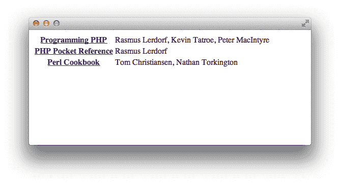
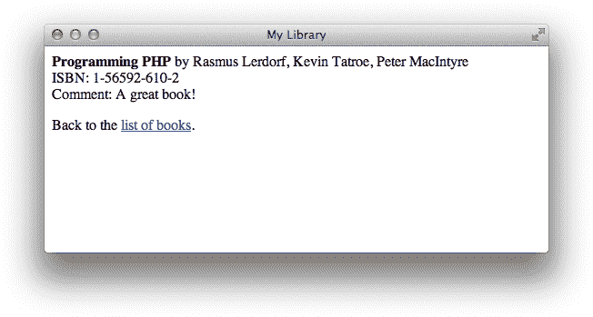

# 第十二章《XML》

可扩展标记语言 XML 是一种标准化的数据格式。它看起来有点像 HTML，使用标签（`<example>像这样</example>`）和实体（`&amp;`）。然而，与 HTML 不同，XML 旨在易于以程序方式解析，并且有关于在 XML 文档中可以和不可以做的规则。XML 现在是出版、工程和医学等各个领域的标准数据格式。它用于远程过程调用、数据库、采购订单等各种用途。

有许多情况下你可能希望使用 XML。因为它是数据传输的常见格式，其他程序可以生成 XML 文件供您提取信息（*解析*）或在 HTML 中显示（*转换*）。本章将向您展示如何使用 PHP 捆绑的 XML 解析器，以及如何使用可选的 XSLT 扩展来转换 XML。我们还简要介绍了生成 XML 的方法。

近年来，XML 已经被用于远程过程调用（XML-RPC）。客户端将函数名和参数值编码为 XML，并通过 HTTP 发送到服务器。服务器解码函数名和数值，决定如何处理，并返回以 XML 编码的响应值。XML-RPC 已被证明是一种有用的方法，可以集成用不同语言编写的应用程序组件。我们将在第十六章展示如何编写 XML-RPC 服务器和客户端，但现在让我们先看一下 XML 的基础知识。

# 《XML 简明指南》

大多数 XML 由元素（类似 HTML 标签）、实体和常规数据组成。例如：

```php
<book isbn="1-56592-610-2">
 <title>Programming PHP</title>
 <authors>
 <author>Rasmus Lerdorf</author>
 <author>Kevin Tatroe</author>
 <author>Peter MacIntyre</author>
 </authors>
</book>
```

在 HTML 中，通常会有未闭合的开放标签。最常见的例子是：

```php
<br>
```

在 XML 中，这是非法的。XML 要求每个开放标签都有对应的闭合标签。对于不包含任何内容的标签，如换行符`<br>`，XML 添加了这种语法：

```php
<br />
```

标签可以嵌套但不能重叠。例如，这是有效的：

```php
<book><title>Programming PHP</title></book>
```

但这个则无效，因为`<book>`和`<title>`标签重叠：

```php
<book><title>Programming PHP</book></title>
```

XML 还要求文档以标识正在使用的 XML 版本开头（可能还包括其他内容，如文本编码）。例如：

```php
<?xml version="1.0" ?>
```

符合格式良好的 XML 文档的最后要求是文件顶层只能有一个元素。例如，这是格式良好的：

```php
<?xml version="1.0" ?>
<library>
 <title>Programming PHP</title>
 <title>Programming Perl</title>
 <title>Programming C#</title>
</library>
```

这不是格式良好的，因为文件顶层有三个元素：

```php
<?xml version="1.0" ?>
<title>Programming PHP</title>
<title>Programming Perl</title>
<title>Programming C#</title>
```

XML 文档通常不是完全自由的。XML 文档中的特定标签、属性和实体，以及它们嵌套的规则，构成了文档的结构。有两种方法来定义这种结构：*文档类型定义*（DTD）和*模式*。DTD 和模式用于验证文档，即确保它们遵循其文档类型的规则。

大多数 XML 文档不包括 DTD；在这些情况下，文档仅在其为有效 XML 时被视为有效。其他情况下，文档通过一个指定名称和位置（文件或 URL）的外部实体来识别 DTD：

```php
<!DOCTYPE rss PUBLIC 'My DTD Identifier' 'http://www.example.com/my.dtd'>
```

有时将一个 XML 文档封装在另一个 XML 文档中会很方便。例如，表示邮件消息的 XML 文档可能具有包围附加文件的 `attachment` 元素。如果附加文件是 XML，则它是一个嵌套的 XML 文档。如果邮件消息文档有一个 `body` 元素（消息主题），并且附加文件是一个表示解剖学的 XML 表示，该表示也具有 `body` 元素，但此元素具有完全不同的 DTD 规则，那么在 `body` 在文档的中途更改意义时，如何验证或理解文档呢？

使用命名空间解决了这个问题。命名空间允许您限定 XML 标签，例如 `email:body` 和 `human:body`。

XML 比我们在这里讨论的还要复杂得多。要对 XML 进行简要介绍，请阅读 [*Learning XML*](http://oreil.ly/Learning_XML)（O’Reilly 出版）的书籍，由埃里克·雷（Erik Ray）编写。要详细了解 XML 语法和标准，请参阅 [*XML in a Nutshell*](http://oreil.ly/XML_Nutshell)（O’Reilly 出版）的书籍，由艾略特·拉斯蒂·哈罗德（Elliotte Rusty Harold）和 W. Scott Means 编写。

# 生成 XML

就像 PHP 可以用于生成动态 HTML 一样，它也可以用于生成动态 XML。您可以基于表单、数据库查询或其他任何 PHP 可以做的事情来为其他程序生成 XML。动态 XML 的一个应用是 *Rich Site Summary*（RSS），这是一个用于聚合新闻站点的文件格式。您可以从数据库或 HTML 文件中读取文章信息，并根据该信息生成 XML 摘要文件。

从 PHP 脚本生成 XML 文档很简单。只需使用 `header()` 函数更改文档的 MIME 类型为 `"text/xml"`。要发出 `<?xml ... ?>` 声明而不被解释为格式不正确的 PHP 标签，只需从 PHP 代码内部 `echo` 该行：

```php
echo '<?xml version="1.0" encoding="ISO-8859-1" ?>';
```

示例 12-1 使用 PHP 生成了一个 RSS 文档。RSS 文件是一个 XML 文档，包含多个 `channel` 元素，每个元素包含一些新闻 `item` 元素。每个新闻 `item` 可以有一个标题、一个描述和指向文章本身的链接。RSS 支持的 `item` 属性比 示例 12-1 创建的要多。正如 PHP 生成 HTML 没有特殊函数一样，生成 XML 也没有特殊函数。你只需 `echo` 它！

##### 示例 12-1\. 生成 XML 文档

```php
<?php
header('Content-Type: text/xml');
echo "<?xml version=\"1.0\" encoding=\"ISO-8859-1\" ?>";
?>
<!DOCTYPE rss PUBLIC "-//Netscape Communications//DTD RSS 0.91//EN"
 "http://my.netscape.com/publish/formats/rss-0.91.dtd">

<rss version="0.91">
 <channel>
 <?php
 // news items to produce RSS for
 $items = array(
 array(
 'title' => "Man Bites Dog",
 'link' => "http://www.example.com/dog.php",
 'desc' => "Ironic turnaround!"
 ),
 array(
 'title' => "Medical Breakthrough!",
 'link' => "http://www.example.com/doc.php",
 'desc' => "Doctors announced a cure for me."
 )
 );

 foreach($items as $item) {
 echo "<item>\n";
 echo " <title>{$item['title']}</title>\n";
 echo " <link>{$item['link']}</link>\n";
 echo " <description>{$item['desc']}</description>\n";
 echo " <language>en-us</language>\n";
 echo "</item>\n\n";
 } ?>
 </channel>
</rss>
```

此脚本生成以下输出：

```php
<?xml version="1.0" encoding="ISO-8859-1" ?>
<!DOCTYPE rss PUBLIC "-//Netscape Communications//DTD RSS 0.91//EN"
 "http://my.netscape.com/publish/formats/rss-0.91.dtd">
<rss version="0.91">
 <channel>
<item>
 <title>Man Bites Dog</title>
 <link>http://www.example.com/dog.php</link>
 <description>Ironic turnaround!</description>
 <language>en-us</language>
</item>

<item>
 <title>Medical Breakthrough!</title>
 <link>http://www.example.com/doc.php</link>
 <description>Doctors announced a cure for me.</description>
 <language>en-us</language>
</item>
 </channel>
</rss>
```

# 解析 XML

假设您有一组 XML 文件，每个文件包含关于一本书的信息，并且您想构建一个索引，显示集合中每本书的文档标题及其作者。您需要解析 XML 文件以识别 `title` 和 `author` 元素及其内容。您可以通过正则表达式和诸如 `strtok()` 的字符串函数手动执行此操作，但实际上这比看起来要复杂得多。此外，即使是有效的 XML 文档，这样的方法也容易出现故障。最简单和最快的解决方案是使用 PHP 随附的 XML 解析器之一。

PHP 包括三个 XML 解析器：一个基于 Expat C 库的事件驱动库，一个基于 DOM 的库，以及一个用于解析简单 XML 文档的名为 SimpleXML 的库。

最常用的解析器是基于事件的库，允许解析但不验证 XML 文档。这意味着您可以了解存在哪些 XML 标签及其周围的内容，但不能确定它们是否是该类型文档正确结构中正确的 XML 标签。在实践中，这通常不是一个大问题。PHP 的事件驱动 XML 解析器在读取文档时调用您提供的各种处理器函数，遇到特定的 *事件*，如元素的开始或结束。

在接下来的章节中，我们将讨论您可以提供的处理器、设置处理器的函数以及触发这些处理器调用的事件。我们还提供了用于创建解析器以在内存中生成 XML 文档映射的示例函数，这些示例函数与一个示例应用程序结合在一起，以美化 XML。

## 元素处理器

当解析器遇到元素的开始或结束时，将调用起始和结束元素处理器。您可以通过 `xml_set_element_handler()` 函数设置这些处理器：

```php
xml_set_element_handler(*`parser`*, *`start_element`*, *`end_element`*);
```

*start_element* 和 *end_element* 参数是处理器函数的名称。

当 XML 解析器遇到元素开始时，将调用起始元素处理器：

```php
*`startElementHandler`*(*`parser`*, *`element`*, *`&``attributes`*);
```

起始元素处理器接收三个参数：调用处理器的 XML 解析器的引用，已打开的元素的名称以及包含解析器遇到的元素任何属性的数组。`$attribute` 数组通过引用传递以提高速度。

示例 12-2 包含了一个起始元素处理器 `startElement()` 的代码。该处理器简单地以粗体打印元素名称，并以灰色显示属性。

##### 示例 12-2\. 起始元素处理器

```php
function startElement($parser, $name, $attributes) {
 $outputAttributes = array();

 if (count($attributes)) {
 foreach($attributes as $key => $value) {
 $outputAttributes[] = "<font color=\"gray\">{$key}=\"{$value}\"</font>";
 }
 }

 echo "&lt;<b>{$name}</b> " . join(' ', $outputAttributes) . '&gt;';
}
```

当解析器遇到元素结束时，将调用结束元素处理器：

```php
*`endElementHandler`*(*`parser`*, *`element`*);
```

它接受两个参数：调用处理器的 XML 解析器的引用，以及正在关闭的元素的名称。

示例 12-3 展示了一个结束元素处理器，格式化该元素。

##### 示例 12-3\. 结束元素处理器

```php
function endElement($parser, $name) {
 echo "&lt;<b>/{$name}</b>&gt;";
}
```

## 字符数据处理器

在元素之间的所有文本（*字符数据*，或 XML 术语中的 *CDATA*）由字符数据处理程序处理。您使用 `xml_set_`​`character``_data_handler()` 函数设置的处理程序在每个字符数据块后被调用：

```php
xml_set_character_data_handler(*`parser`*, *`handler`*);
```

字符数据处理程序接收引发处理程序的 XML 解析器的引用和包含字符数据本身的字符串：

```php
*`characterDataHandler`*(*`parser`*, *`cdata`*);
```

这是一个简单的字符数据处理程序，只需打印数据：

```php
function characterData($parser, $data) {
 echo $data;
}
```

## 处理指令

处理指令用于在 XML 中嵌入脚本或其他代码到文档中。PHP 本身可以看作是一个处理指令，并且使用 `<?php ... ?>` 标签样式遵循 XML 格式来标记代码。当 XML 解析器遇到处理指令时，会调用处理指令处理程序。使用 `xml_set_processing_instruction_handler()` 函数设置处理程序：

```php
xml_set_processing_instruction_handler(*`parser`*, *`handler`*);
```

处理指令看起来像：

```php
<? *`target` `instructions`* ?>
```

处理指令处理程序接收引发处理程序的 XML 解析器的引用、目标名称（例如，`'php'`）和处理指令：

```php
*`processingInstructionHandler`*(*`parser`*, *`target`*, *`instructions`*);
```

处理指令如何处理取决于您。其中一种技巧是将 PHP 代码嵌入 XML 文档中，并在解析文档时使用 `eval()` 函数执行该 PHP 代码。示例 12-4 就是这样做的。当然，如果要包含 `eval()` 代码，您必须信任正在处理的文档。`eval()` 将运行提供给它的任何代码，甚至是销毁文件或将密码发送给破解者的代码。实际上，执行这种任意代码非常危险。

##### 示例 12-4\. 处理指令处理程序

```php
function processing_instruction($parser, $target, $code) {
 if ($target === 'php') {
 eval($code);
 }
}
```

## 实体处理程序

XML 中的实体是占位符。XML 提供了五个标准实体（`&amp;`、`&gt;`、`&lt;`、`&quot;` 和 `&apos;`），但 XML 文档可以定义它们自己的实体。大多数实体定义不会触发事件，而 XML 解析器在调用其他处理程序之前会展开文档中的大多数实体。

两种类型的实体，外部和未解析的，PHP 的 XML 库提供了特殊支持。*外部* 实体是其替换文本由文件名或 URL 标识而不是在 XML 文件中显式给出的实体。您可以定义一个处理程序，以便在字符数据中发生外部实体时调用它，但如果需要的话，您必须自行解析文件或 URL 的内容。

*未解析* 实体必须伴随有一个标记声明，虽然您可以为未解析实体和标记的声明定义处理程序，但在调用字符数据处理程序之前，文本中的未解析实体会被删除。

### 外部实体

外部实体引用允许 XML 文档包含其他 XML 文档。通常，外部实体引用处理程序会打开引用的文件，解析文件，并将结果包含在当前文档中。使用 `xml_set_external_entity_ref_handler()` 设置处理程序，该函数接受 XML 解析器的引用和处理程序函数的名称：

```php
xml_set_external_entity_ref_handler(*`parser`*, *`handler`*);
```

外部实体引用处理程序带有五个参数：触发处理程序的解析器、实体的名称、用于解析实体标识符的基本统一资源标识符（URI）（当前始终为空）、系统标识符（例如文件名）以及实体声明中定义的实体的公共标识符。例如：

```php
*`externalEntityHandler`*(*`parser`*, *`entity`*, *`base`*, *`system`*, *`public`*);
```

如果您的外部实体引用处理程序返回 `false`（如果它不返回任何值，则会返回 `false`），XML 解析将停止，并显示 `XML_ERROR_EXTERNAL_ENTITY_HANDLING` 错误。如果返回 `true`，解析将继续。

示例 12-5 显示了如何解析外部引用的 XML 文档。定义两个函数 `createParser()` 和 `parse()` 来实际创建和传送 XML 解析器的工作。您可以同时用它们来解析顶级文档和通过外部引用包含的任何文档。这些函数在“使用解析器”部分有描述。外部实体引用处理程序只需确定正确的文件以发送到这些函数。

##### 示例 12-5\. 外部实体引用处理程序

```php
function externalEntityReference($parser, $names, $base, $systemID, $publicID) {
 if ($systemID) {
 if (!list ($parser, $fp) = createParser($systemID)) {
 echo "Error opening external entity {$systemID}\n";

 return false;
 }

 return parse($parser, $fp);
 }

 return false;
}
```

### 未解析实体

未解析实体声明必须与符号声明一起出现：

```php
<!DOCTYPE doc [
 <!NOTATION jpeg SYSTEM "image/jpeg">
 <!ENTITY logo SYSTEM "php-tiny.jpg" NDATA jpeg>
]>
```

使用 `xml_set_notation_decl_handler()` 注册符号声明处理程序：

```php
xml_set_notation_decl_handler(*`parser`*, *`handler`*);
```

处理程序将带有五个参数：

```php
*`notationHandler`*(*`parser`*, *`notation`*, *`base`*, *`system`*, *`public`*);
```

*基本* 参数是用于解析符号标识符的基本 URI（当前始终为空）。符号的*系统*标识符或*公共*标识符将被设置，但不会同时出现。

使用 `xml_set_unparsed_entity_decl_handler()` 函数注册未解析实体声明：

```php
xml_set_unparsed_entity_decl_handler(*`parser`*, *`handler`*);
```

处理程序将带有六个参数：

```php
*`unparsedEntityHandler`*(*`parser`*, *`entity`*, *`base`*, *`system`*, *`public`*, *`notation`*);
```

*符号* 参数标识与此未解析实体关联的符号声明。

## 默认处理程序

对于其他任何事件，例如 XML 声明和 XML 文档类型，将调用默认处理程序。调用 `xml_set_default_handler()` 函数设置默认处理程序：

```php
xml_set_default_handler(*`parser`*, *`handler`*);
```

处理程序将带有两个参数：

```php
*`defaultHandler`*(*`parser`*, *`text`*);
```

*文本* 参数将根据触发默认处理程序的事件类型具有不同的值。示例 12-6 在调用默认处理程序时仅打印给定的字符串。

##### 示例 12-6\. 默认处理程序

```php
function default($parser, $data) {
 echo "<font color=\"red\">XML: Default handler called with '{$data}'</font>\n";
}
```

## 选项

XML 解析器有几个选项可用于控制源和目标编码以及大小写折叠。使用 `xml_parser_set_option()` 设置选项：

```php
xml_parser_set_option(*`parser`*, *`option`*, *`value`*);
```

类似地，使用 `xml_parser_get_option()` 查询解析器的选项：

```php
$value = xml_parser_get_option(*`parser`*, *`option`*);
```

### 字符编码

PHP 使用的 XML 解析器支持多种不同字符编码的 Unicode 数据。在内部，PHP 的字符串总是以 UTF-8 编码，但由 XML 解析器解析的文档可以是 ISO-8859-1、US-ASCII 或 UTF-8\. 不支持 UTF-16。

创建 XML 解析器时，可以为其指定用于解析文件的编码格式。如果省略，则假定源文件为 ISO-8859-1\. 如果遇到源编码范围外的字符，XML 解析器将返回错误并立即停止处理文档。

解析器的目标编码是 XML 解析器将数据传递给处理程序函数的编码；通常与源编码相同。在 XML 解析器的生命周期中的任何时间，都可以更改目标编码。解析器通过用问号字符 (`?`) 替换目标编码范围外的任何字符来降级这些字符。

使用常量 `XML_OPTION_TARGET_ENCODING` 获取或设置传递给回调函数的文本编码。允许的值包括 `"ISO-8859-1"`（默认）、`"US-ASCII"` 和 `"UTF-8"`。

### 大小写折叠

XML 文档中的元素和属性名称默认转换为全大写。可以通过将 `xml_parser​_set_option()` 函数的 `XML_OPTION_CASE_FOLDING` 选项设置为 `false` 来关闭此行为（并获得区分大小写的元素名称）：

```php
xml_parser_set_option(XML_OPTION_CASE_FOLDING, false);
```

### 跳过仅包含空白的内容

将选项 `XML_OPTION_SKIP_WHITE` 设置为忽略完全由空白字符组成的值。

```php
xml_parser_set_option(XML_OPTION_SKIP_WHITE, true);
```

### 截断标签名

创建解析器时，可以选择截断每个标签名称的开头字符。要通过 `XML_OPTION_SKIP_TAGSTART` 选项截断每个标签的起始字符数，需提供该值：

```php
xml_parser_set_option(XML_OPTION_SKIP_TAGSTART, 4);
// <xsl:name> truncates to "name"

```

在这种情况下，标签名称将被截断四个字符。

## 使用解析器

要使用 XML 解析器，使用 `xml_parser_create()` 创建解析器，为解析器设置处理程序和选项，然后使用 `xml_parse()` 函数传递数据块给解析器，直到数据耗尽或解析器返回错误。处理完成后，通过调用 `xml_parser_free()` 释放解析器。

函数 `xml_parser_create()` 返回一个 XML 解析器：

```php
$parser = xml_parser_create([*`encoding`*]);
```

可选的 *encoding* 参数指定被解析文件的文本编码（`"ISO-8859-1"`、`"US-ASCII"` 或 `"UTF-8"`）。

函数 `xml_parse()` 如果解析成功返回 `true`，失败返回 `false`：

```php
$success = xml_parse(*`parser`*, *`data`*[, *`final`* ]);
```

参数 *data* 是要处理的 XML 字符串。可选的 *final* 参数应设为 `true`，以解析最后一段数据。

为了轻松处理嵌套文档，编写创建解析器并设置其选项和处理程序的函数。这样可以将选项和处理程序设置放在一个地方，而不是在外部实体引用处理程序中重复它们。示例 12-7 展示了这样一个函数。

##### 示例 12-7\. 创建解析器

```php
function createParser($filename) {
 $fh = fopen($filename, 'r');
 $parser = xml_parser_create();

 xml_set_element_handler($parser, "startElement", "endElement");
 xml_set_character_data_handler($parser, "characterData");
 xml_set_processing_instruction_handler($parser, "processingInstruction");
 xml_set_default_handler($parser, "default");

 return array($parser, $fh);
}

function parse($parser, $fh) {
 $blockSize = 4 * 1024; // read in 4 KB chunks

 while ($data = fread($fh, $blockSize)) {
 if (!xml_parse($parser, $data, feof($fh))) {
 // an error occurred; tell the user where
 echo 'Parse error: ' . xml_error_string($parser) . " at line " .
 xml_get_current_line_number($parser);

 return false;
 }
 }

 return true;
}

if (list ($parser, $fh) = createParser("test.xml")) {
 parse($parser, $fh);
 fclose($fh);

 xml_parser_free($parser);
}
```

## 错误

如果解析完成，`xml_parse()` 函数返回 `true`，如果有错误则返回 `false`。如果出现问题，请使用 `xml_get_error_code()` 获取标识错误的代码：

```php
$error = xml_get_error_code($parser);
```

错误代码对应于以下错误常量之一：

```php
XML_ERROR_NONE
XML_ERROR_NO_MEMORY
XML_ERROR_SYNTAX
XML_ERROR_NO_ELEMENTS
XML_ERROR_INVALID_TOKEN
XML_ERROR_UNCLOSED_TOKEN
XML_ERROR_PARTIAL_CHAR
XML_ERROR_TAG_MISMATCH
XML_ERROR_DUPLICATE_ATTRIBUTE
XML_ERROR_JUNK_AFTER_DOC_ELEMENT
XML_ERROR_PARAM_ENTITY_REF
XML_ERROR_UNDEFINED_ENTITY
XML_ERROR_RECURSIVE_ENTITY_REF
XML_ERROR_ASYNC_ENTITY
XML_ERROR_BAD_CHAR_REF
XML_ERROR_BINARY_ENTITY_REF
XML_ERROR_ATTRIBUTE_EXTERNAL_ENTITY_REF
XML_ERROR_MISPLACED_XML_PI
XML_ERROR_UNKNOWN_ENCODING
XML_ERROR_INCORRECT_ENCODING
XML_ERROR_UNCLOSED_CDATA_SECTION
XML_ERROR_EXTERNAL_ENTITY_HANDLING
```

这些常量通常没有太大用处。使用 `xml_error_string()` 将错误代码转换为您在报告错误时可以使用的字符串：

```php
$message = xml_error_string(*`code`*);
```

例如：

```php
$error = xml_get_error_code($parser);

if ($error != XML_ERROR_NONE) {
 die(xml_error_string($error));
}
```

## 方法作为处理程序

因为在 PHP 中函数和变量是全局的，任何需要多个函数和变量的应用组件都适合面向对象设计。XML 解析通常需要您跟踪解析过程中的位置（例如，“刚刚看到一个打开的 `title` 元素，因此在看到关闭的 `title` 元素之前，跟踪字符数据”）使用变量，当然您必须编写几个处理程序函数来操作状态并实际执行操作。将这些函数和变量包装到一个类中使您能够将它们与程序的其余部分分开，并在以后轻松重用功能。

使用 `xml_set_object()` 函数注册一个对象到解析器中。注册后，XML 解析器会寻找该对象上的方法作为处理程序，而不是作为全局函数：

```php
xml_set_object(*`object`*);
```

## 示例解析应用

让我们开发一个程序来解析 XML 文件，并从中显示不同类型的信息。示例 12-8 中提供的 XML 文件包含一组书籍的信息。

##### 示例 12-8\. books.xml 文件

```php
<?xml version="1.0" ?>
<library>
 <book>
 <title>Programming PHP</title>
 <authors>
 <author>Rasmus Lerdorf</author>
 <author>Kevin Tatroe</author>
 <author>Peter MacIntyre</author>
 </authors>
 <isbn>1-56592-610-2</isbn>
 <comment>A great book!</comment>
 </book>
 <book>
 <title>PHP Pocket Reference</title>
 <authors>
 <author>Rasmus Lerdorf</author>
 </authors>
 <isbn>1-56592-769-9</isbn>
 <comment>It really does fit in your pocket</comment>
 </book>
 <book>
 <title>Perl Cookbook</title>
 <authors>
 <author>Tom Christiansen</author>
 <author whereabouts="fishing">Nathan Torkington</author>
 </authors>
 <isbn>1-56592-243-3</isbn>
 <comment>Hundreds of useful techniques, most
 applicable to PHP as well as Perl</comment>
 </book>
</library>
```

PHP 应用程序解析文件并向用户显示书籍列表，仅显示标题和作者。该菜单显示在图 12-1 中。标题是指向显示书籍完整信息页面的链接。《编程 PHP》的详细信息页面显示在图 12-2 中。

我们定义了一个名为 `BookList` 的类，其构造函数解析 XML 文件并构建记录列表。`BookList` 上有两个方法，从记录列表生成输出。`showMenu()` 方法生成书籍菜单，`showBook()` 方法显示特定书籍的详细信息。

解析文件涉及跟踪记录，我们所处的元素以及哪些元素对应记录（`book`）和字段（`title`、`author`、`isbn`和`comment`）。`$record`属性在构建当前记录时保存当前记录，`$currentField`保存当前处理的字段名称（例如，`title`）。`$records`属性是迄今为止读取的所有记录的数组。



###### 图 12-1\. 书籍菜单



###### 图 12-2\. 书籍详细信息

两个关联数组，`$fieldType` 和 `$endsRecord`，告诉我们哪些元素对应记录中的字段，以及哪个闭合元素表示记录的结束。在构造函数中初始化这些数组。

处理程序本身相当简单。当我们看到元素的开头时，我们会确定它是否对应我们感兴趣的字段。如果是，则将 `$currentField` 属性设置为该字段名称，这样当我们看到字符数据（例如书籍的标题）时，我们就知道它是哪个字段的值。当获取字符数据时，如果 `$currentField` 表示我们处于字段中，则将其添加到当前记录的适当字段中。当我们看到元素的结尾时，我们检查它是否是记录的结尾；如果是，则将当前记录添加到已完成记录的数组中。

一个 PHP 脚本，在 示例 12-9 中提供，同时处理书籍菜单和书籍详情页面。书籍菜单中的条目链接回菜单 URL，并带有一个 `GET` 参数，用于标识要显示的书籍的 ISBN。

##### 示例 12-9\. bookparse.php

```php
<html>
 <head>
 <title>My Library</title>
 </head>

 <body>
 <?php
 class BookList {
 const FIELD_TYPE_SINGLE = 1;
 const FIELD_TYPE_ARRAY = 2;
 const FIELD_TYPE_CONTAINER = 3;

 var $parser;
 var $record;
 var $currentField = '';
 var $fieldType;
 var $endsRecord;
 var $records;

 function __construct($filename) {
 $this->parser = xml_parser_create();
 xml_set_object($this->parser, $this);
 xml_set_element_handler($this->parser, "elementStarted", "elementEnded");
 xml_set_character_data_handler($this->parser, "handleCdata");

 $this->fieldType = array(
 'title' => self::FIELD_TYPE_SINGLE,
 'author' => self::FIELD_TYPE_ARRAY,
 'isbn' => self::FIELD_TYPE_SINGLE,
 'comment' => self::FIELD_TYPE_SINGLE,
 );

 $this->endsRecord = array('book' => true);

 $xml = join('', file($filename));
 xml_parse($this->parser, $xml);

 xml_parser_free($this->parser);
 }

 function elementStarted($parser, $element, &$attributes) {
 $element = strtolower($element);

 if ($this->fieldType[$element] != 0) {
 $this->currentField = $element;
 }
 else {
 $this->currentField = '';
 }
 }

 function elementEnded($parser, $element) {
 $element = strtolower($element);

 if ($this->endsRecord[$element]) {
 $this->records[] = $this->record;
 $this->record = array();
 }

 $this->currentField = '';
 }

 function handleCdata($parser, $text) {
 if ($this->fieldType[$this->currentField] == self::FIELD_TYPE_SINGLE) {
 $this->record[$this->currentField] .= $text;
 }
 else if ($this->fieldType[$this->currentField] == self::FIELD_TYPE_ARRAY) {
 $this->record[$this->currentField][] = $text;
 }
 }

 function showMenu() {
 echo "<table>\n";

 foreach ($this->records as $book) {
 echo "<tr>";
 echo "<th><a href=\"{$_SERVER['PHP_SELF']}?isbn={$book['isbn']}\">";
 echo "{$book['title']}</a></th>";
 echo "<td>" . join(', ', $book['author']) . "</td>\n";
 echo "</tr>\n";
 }

 echo "</table>\n";
 }

 function showBook($isbn) {
 foreach ($this->records as $book) {
 if ($book['isbn'] !== $isbn) {
 continue;
 }

 echo "<p><b>{$book['title']}</b> by " . join(', ', $book['author']) . "<br />";
 echo "ISBN: {$book['isbn']}<br />";
 echo "Comment: {$book['comment']}</p>\n";
 }

 echo "<p>Back to the <a href=\"{$_SERVER['PHP_SELF']}\">list of books</a>.</p>";
 }
 }

 $library = new BookList("books.xml");

 if (isset($_GET['isbn'])) {
 // return info on one book
 $library->showBook($_GET['isbn']);
 }
 else {
 // show menu of books
 $library->showMenu();
 } ?>
 </body>
</html>
```

# 使用 DOM 解析 XML

PHP 提供的 DOM 解析器使用起来简单得多，但复杂性减少的同时，内存使用量却会大大增加。DOM 解析器不会触发事件并允许您在解析过程中处理文档，而是将 XML 文档作为输入，并返回整个节点和元素的树：

```php
$parser = new DOMDocument();
$parser->load("books.xml");
processNodes($parser->documentElement);

function processNodes($node) {
 foreach ($node->childNodes as $child) {
 if ($child->nodeType == XML_TEXT_NODE) {
 echo $child->nodeValue;
 }
 else if ($child->nodeType == XML_ELEMENT_NODE) {
 processNodes($child);
 }
 }
}
```

# 使用 SimpleXML 解析 XML

如果您要处理非常简单的 XML 文档，可以考虑 PHP 提供的第三个库 SimpleXML。SimpleXML 无法像 DOM 扩展那样生成文档，也不像事件驱动扩展那样灵活或内存高效，但它非常容易读取、解析和遍历简单的 XML 文档。

SimpleXML 接受文件、字符串或使用 DOM 扩展生成的 DOM 文档，并生成一个对象。该对象上的属性是数组，提供对每个节点中元素的访问。通过这些数组，可以使用数字索引访问元素，并使用非数字索引访问属性。最后，可以对检索到的任何值使用字符串转换，以获取项目的文本值。

例如，我们可以使用以下方式显示 *books.xml* 文档中所有书籍的标题：

```php
$document = simplexml_load_file("books.xml");

foreach ($document->book as $book) {
 echo $book->title . "\r\n";
}
```

在对象上使用 `children()` 方法，可以迭代给定节点的子节点；同样，可以使用 `attributes()` 方法迭代节点的属性：

```php
$document = simplexml_load_file("books.xml");

foreach ($document->book as $node) {
 foreach ($node->attributes() as $attribute) {
 echo "{$attribute}\n";
 }
}
```

最后，使用对象上的 `asXml()` 方法，可以以 XML 格式检索文档的 XML。这使您可以轻松地更改文档中的值并将其写回到磁盘：

```php
$document = simplexml_load_file("books.xml");

foreach ($document->children() as $book) {
 $book->title = "New Title";
}

file_put_contents("books.xml", $document->asXml());
```

# 使用 XSLT 转换 XML

可扩展样式表语言转换（XSLT）是一种将 XML 文档转换为不同 XML、HTML 或任何其他格式的语言。例如，许多网站提供其内容的多种格式——HTML、可打印 HTML 和 WML（无线标记语言）是常见的。呈现同一信息的多个视图的最简单方法是在 XML 中维护内容的一种形式，并使用 XSLT 生成 HTML、可打印 HTML 和 WML。

PHP 的 XSLT 扩展使用 Libxslt C 库提供 XSLT 支持。

XSLT 转换涉及三个文档：原始 XML 文档、包含转换规则的 XSLT 文档和生成的文档。最终文档不必是 XML；事实上，常见的是使用 XSLT 从 XML 生成 HTML。在 PHP 中进行 XSLT 转换，你创建一个 XSLT 处理器，给它一些要转换的输入，然后销毁处理器。

创建一个处理器，通过创建一个新的 `XsltProcessor` 对象：

```php
$processor = new XsltProcessor;
```

将 XML 和 XSL 文件解析为 DOM 对象：

```php
$xml = new DomDocument;
$xml->load($filename);

$xsl = new DomDocument;
$xsl->load($filename);
```

将 XML 规则附加到对象：

```php
$processor->importStyleSheet($xsl);
```

使用 `transformToDoc()`、`transformToUri()` 或 `transformToXml()` 方法处理文件：

```php
$result = $processor->transformToXml($xml);
```

每个都将表示 XML 文档的 DOM 对象作为参数。

示例 12-10 是我们将要转换的 XML 文档。它的格式与你在网上找到的许多新闻文档类似。

##### 示例 12-10\. XML 文档

```php
<?xml version="1.0" ?>

<news xmlns:news="http://slashdot.org/backslash.dtd">
 <story>
 <title>O'Reilly Publishes Programming PHP</title>
 <url>http://example.org/article.php?id=20020430/458566</url>
 <time>2002-04-30 09:04:23</time>
 <author>Rasmus and some others</author>
 </story>

 <story>
 <title>Transforming XML with PHP Simplified</title>
 <url>http://example.org/article.php?id=20020430/458566</url>
 <time>2002-04-30 09:04:23</time>
 <author>k.tatroe</author>
 <teaser>Check it out</teaser>
 </story>
</news>
```

示例 12-11 是我们将用来将 XML 文档转换为 HTML 的 XSL 文档。每个 `xsl:template` 元素包含处理输入文档一部分的规则。

##### 示例 12-11\. 新闻 XSL 转换

```php
<?xml version="1.0" encoding="utf-8" ?>
<xsl:stylesheet version="1.0" xmlns:xsl="http://www.w3.org/1999/XSL/Transform">
<xsl:output method="html" indent="yes" encoding="utf-8" />

<xsl:template match="/news">
 <html>
 <head>
 <title>Current Stories</title>
 </head>
 <body bgcolor="white" >
 <xsl:call-template name="stories"/>
 </body>
 </html>
</xsl:template>

<xsl:template name="stories">
 <xsl:for-each select="story">
 <h1><xsl:value-of select="title" /></h1>

 <p>
 <xsl:value-of select="author"/> (<xsl:value-of select="time"/>)<br />
 <xsl:value-of select="teaser"/>
 [ <a href="{url}">More</a> ]
 </p>

 <hr />
 </xsl:for-each>
</xsl:template>

</xsl:stylesheet>
```

示例 12-12 是将 XML 文档使用 XSL 样式表转换为 HTML 文档所需的非常少量代码。我们创建一个处理器，运行文件，并打印结果。

##### 示例 12-12\. 文件中的 XSL 转换

```php
<?php
$processor = new XsltProcessor;

$xsl = new DOMDocument;
$xsl->load("rules.xsl");
$processor->importStyleSheet($xsl);

$xml = new DomDocument;
$xml->load("feed.xml");
$result = $processor->transformToXml($xml);

echo "<pre>{$result}</pre>";
```

尽管没有专门讨论 PHP，但 Doug Tidwell 的书籍 [*XSLT*](http://oreil.ly/XSLT_2E)（O’Reilly）提供了 XSLT 样式表语法的详细指南。

# 接下来做什么

虽然 XML 仍然是数据共享的主要格式，但简化版的 JavaScript 数据封装——JSON，已迅速成为简单、可读且简洁的网络服务响应和其他数据的事实标准。这将是我们下一章的主题。
