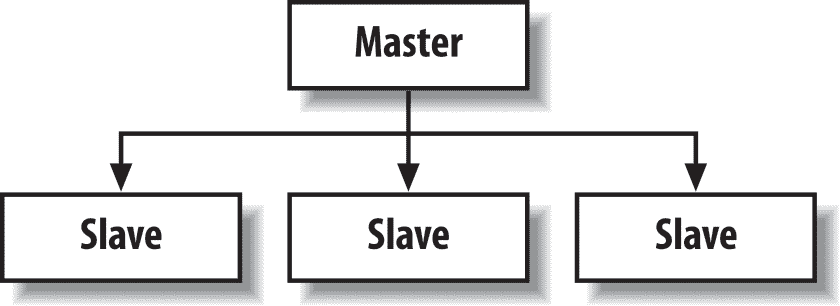
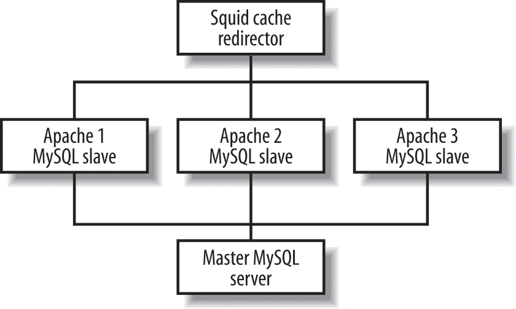

# 第十五章：应用技术

到目前为止，你应该对 PHP 语言的细节及其在各种常见情况下的使用有了扎实的理解。现在我们将向你展示一些在 PHP 应用中可能会有用的技术，比如代码库、模板系统、高效的输出处理、错误处理和性能调优。

# 代码库

正如你所见，PHP 附带了许多扩展库，将有用的功能组合成不同的包，你可以从你的脚本中访问。我们在第十章、11 章和 12 章中介绍了如何使用 GD、FPDF 和 Libxslt 扩展库。

除了使用 PHP 附带的扩展之外，你还可以创建自己的代码库，可以在网站的多个部分中使用。一般的技术是将一组相关函数存储在一个 PHP 文件中。然后，当你需要在页面中使用该功能时，你可以使用`require_once()`将文件的内容插入到当前脚本中。

###### 注意

请注意，还有三种其他包含类型函数也可以使用。它们是`require()`、`include_once()`和`include()`。第二章详细讨论了这些函数。

举个例子，假设你有一组函数，可以帮助创建有效的 HTML 表单元素：你的集合中的一个函数创建一个文本字段或一个`text​area`（取决于你设置的最大字符数），另一个函数创建一系列弹出窗口，用于设置日期和时间，等等。与其将代码复制到许多页面中（这样做很繁琐，容易出错，并且使得难以修复函数中发现的任何错误），创建一个函数库是明智的选择。

当你将函数组合成一个代码库时，要注意在将相关函数分组和包含不经常使用的函数之间保持平衡。当你在页面中包含一个代码库时，无论你是否使用所有函数，该库中的所有函数都会被解析。PHP 的解析器很快，但不解析函数会更快。同时，你不希望将函数分散到太多的库中，导致你需要在每个页面中包含大量文件，因为文件访问速度很慢。

# 模板系统

*模板系统* 提供了一种将网页中的代码与页面布局分离的方法。在较大的项目中，模板可以用于允许设计师专门处理设计网页，程序员则专门（或多或少地）处理编程工作。模板系统的基本思想是，网页本身包含特殊的标记，这些标记将被动态内容替换。网页设计师可以创建页面的 HTML 并简单地关注布局，使用不同种类动态内容所需的适当标记。另一方面，程序员负责创建生成标记动态内容的代码。

为了更具体，让我们看一个简单的例子。考虑以下网页，询问用户提供一个名称，然后如果提供了名称，感谢用户：

```php
<html>
 <head>
 <title>User Information</title>
 </head>

 <body>
 <?php if (!empty($_GET['name'])) {
 // do something with the supplied values ?>

 <p><font face="helvetica,arial">Thank you for filling out the form,
 <?php echo $_GET['name'] ?>.</font></p>
 <?php }
else { ?>
 <p><font face="helvetica,arial">Please enter the following information:
 </font></p>

 <form action="<?php echo $_SERVER['PHP_SELF'] ?>">
 <table>
 <tr>
 <td>Name:</td>
 <td>
 <input type="text" name="name" />
 <input type="submit" />
 </td>
 </tr>
 </table>
 </form>
<?php } ?>
</body>
</html>
```

将不同的 PHP 元素放置在各种布局标记中，如`font`和`table`元素，最好由设计师处理，特别是当页面变得更复杂时。使用模板系统，我们可以将此页面拆分为多个文件，其中一些包含 PHP 代码，另一些包含布局。然后，HTML 页面将包含特殊的标记，用于放置动态内容。示例 15-1 展示了我们简单表单的新 HTML 模板页面，存储在名为 *user.template* 的文件中。它使用`{DESTINATION}`标记来指示应处理表单的脚本。

##### 示例 15-1\. 用户输入表单的 HTML 模板

```php
<html>
 <head>
 <title>User Information</title>
 </head>

 <body>
 <p>Please enter the following information:</p>

 <form action="{DESTINATION}">
 <table>
 <tr>
 <td>Name:</td>
 <td><input type="text" name="name" /></td>
 </tr>
 </table>
 </form>
 </body>
</html>
```

示例 15-2 展示了感谢页面的模板，名为 *thankyou.template*，用户填写表单后显示。此页面使用`{NAME}`标记来包含用户名称的值。

##### 示例 15-2\. 感谢页面的 HTML 模板

```php
<html>
 <head>
 <title>Thank You</title>
 </head>

 <body>
 <p>Thank you for filling out the form, {NAME}.</p>
 </body>
</html>
```

现在我们需要一个脚本来处理这些模板页面，填写各种标记的适当信息。示例 15-3 展示了使用这些模板的 PHP 脚本（一个用于用户尚未提供信息之前，另一个用于之后）。PHP 代码使用 `fillTemplate()` 函数将我们的值和模板文件连接起来。该文件名为 *form_template.php*。

##### 示例 15-3\. 模板脚本

```php
<?php
$bindings["DESTINATION"] = $_SERVER["PHP_SELF"];
$name = $_GET["name"];

if (!empty($name)) {
 // do something with the supplied values
 $template = "thankyou.template";
 $bindings["NAME"] = $name;
}
else {
 $template = "user.template";
}

echo fillTemplate($template, $bindings);
```

示例 15-4 展示了由示例 15-3 中的脚本使用的 `fillTemplate()` 函数。该函数接受模板文件名（相对于位于文档根目录中名为 *templates* 的目录），值数组以及可选指令，指示如果找到未给出值的标记该如何处理。可能的值有 `delete`，删除标记；`comment`，将标记替换为注释，指出值缺失；或其他任何内容，保留标记不变。该文件名为 *func_template.php*。

##### 示例 15-4\. `fillTemplate()` 函数

```php
<?php
function fillTemplate($name, $values = array(), $unhandled = "delete") {
 $templateFile = "{$_SERVER['DOCUMENT_ROOT']}/templates/{$name}";

 if ($file = fopen($templateFile, 'r')) {
 $template = fread($file, filesize($templateFile));
 fclose($file);
 }

 $keys = array_keys($values);

 foreach ($keys as $key) {
 // look for and replace the key everywhere it occurs in the template
 $template = str_replace("{{$key}}", $values[$key], $template);
 }

 if ($unhandled == "delete") {
 // remove remaining keys
 $template = preg_replace("/{[^ }]*}/i", "", $template);
 }
 else if ($unhandled == "comment") {
 // comment remaining keys
 $template = preg_replace("/{([^ }]*)}/i", "<!-- \\1 undefined -->", $template);
 }

 return $template;
}
```

显然，这个模板系统的示例有些牵强。但是如果您想象一个显示数百篇新闻文章的大型 PHP 应用程序，您可以想象使用像`{HEADLINE}`、`{BYLINE}`和`{ARTICLE}`这样的标记的模板系统可能会很有用，因为它允许设计人员创建文章页面的布局，而无需担心实际内容。

虽然模板可能减少了设计人员需要查看的 PHP 代码量，但性能有所折衷，因为每个请求都会产生从模板构建页面的成本。在每个传出页面上执行模式匹配可能会大大减慢流行网站的速度。Andrei Zmievski 的[Smarty](http://www.smarty.net)是一个高效的模板系统，通过将模板转换为直接的 PHP 代码并进行缓存，避免了大部分性能损失。它不是在每个请求上进行模板替换，而是在模板文件更改时才进行。

# 处理输出

PHP 主要是关于在 Web 浏览器中显示输出。因此，您可以使用几种不同的技术来更高效或更方便地处理输出。

## 输出缓冲

默认情况下，PHP 在执行每个命令后将`echo`和类似命令的结果发送到浏览器。或者，您可以使用 PHP 的输出缓冲函数将通常发送到浏览器的信息收集到缓冲区，并稍后发送（或完全丢弃）。这样可以在生成输出后指定输出的内容长度，捕获函数的输出，或者丢弃内置函数的输出。

使用`ob_start()`函数可以开启输出缓冲：

```php
ob_start([*`callback`*]);
```

可选的*`callback`*参数是后处理输出的函数名称。如果指定了这个参数，当缓冲区刷新时，将传递收集到的输出给该函数，并且它应该返回一个字符串输出以发送到浏览器。例如，您可以使用这个功能将所有*http://www.yoursite.com*的出现替换为*http://www.mysite.com*。

当启用输出缓冲时，所有输出都存储在内部缓冲区中。要获取当前缓冲区的长度和内容，请使用`ob_get_length()`和`ob_get_``contents()`：

```php
$len = ob_get_length();
$contents = ob_get_contents();
```

如果未启用缓冲，则这些函数将返回`false`。

有两种方法可以丢弃缓冲区中的数据。`ob_clean()`函数擦除输出缓冲区但不关闭后续输出的缓冲。`ob_end_clean()`函数擦除输出缓冲区并结束输出缓冲。

有三种方法将收集的输出发送到浏览器（这个动作称为*flushing*缓冲区）。`ob_flush()`函数将输出数据发送到 Web 服务器并清空缓冲区，但不终止输出缓冲。`flush()`函数不仅刷新和清空输出缓冲区，还尝试立即将数据发送到浏览器。`ob_end_flush()`函数将输出数据发送到 Web 服务器并结束输出缓冲。在所有情况下，如果你在`ob_start()`中指定了回调函数，该函数将被调用以决定确切发送到服务器的内容。

如果你的脚本在输出缓冲仍然启用的情况下结束——也就是说，你没有调用`ob_end_flush()`或`ob_end_clean()`——PHP 会自动调用`ob_end_flush()`。

以下代码收集`phpinfo()`函数的输出并用于确定你是否安装了 GD 图形模块：

```php
ob_start();
 phpinfo();
 $phpinfo = ob_get_contents();
ob_end_clean();

if (strpos($phpinfo, "module_gd") === false) {
 echo "You do not have GD Graphics support in your PHP, sorry.";
}
else {
 echo "Congratulations, you have GD Graphics support!";
}
```

当然，检查某个特定扩展是否可用的更快、更简单的方法是选择一个你知道该扩展提供的函数，并检查它是否存在。对于 GD 扩展，你可以这样做：

```php
if (function_exists("imagecreate")) {
 // do something useful
}
```

要在文档中将所有引用从*http://www.yoursite.com*更改为*http://www.mysite.com*，只需像这样包装页面：

```php
ob_start(); ?>

Visit <a href="http://www.yoursite.com/foo/bar">our site</a> now!

<?php $contents = ob_get_contents();
ob_end_clean();

```

```php
echo str_replace("`http://www.yoursite.com/`",
"`http://www.mysite.com/`", $contents);
```

```php
?>

Visit <a href="http://www.mysite.com/foo/bar">our site</a> now!
```

另一种方法是使用回调函数。在这里，`rewrite()`回调修改页面的文本：

```php
function rewrite($text) {
```

```php
 return str_replace("`http://www.yoursite.com/`",
"`http://www.mysite.com/`", $text);
```

```php
}

ob_start("rewrite"); ?>

Visit <a href="http://www.yoursite.com/foo/bar">our site</a> now!
Visit <a href="http://www.mysite.com/foo/bar">our site</a> now!
```

## 输出压缩

现代浏览器支持压缩网页文本；服务器发送压缩文本，浏览器解压缩它。为了自动压缩你的网页，可以像这样包装它：

```php
ob_start("ob_gzhandler");
```

内置的`ob_gzhandler()`函数可以作为调用`ob_start()`的回调函数使用。它根据浏览器发送的`Accept-Encoding`头部压缩缓冲页面。可能的压缩技术包括*gzip*、*deflate*或无压缩。

压缩短页面很少有意义，因为压缩和解压缩所需的时间超过了直接发送未压缩文本所需的时间。然而，压缩大于 5 KB 的大页面是有意义的。

不必在每个页面顶部添加`ob_start()`调用，你可以在你的*php.ini*文件中设置`output_handler`选项为一个在每个页面上调用的回调函数。对于压缩，这是`ob_gzhandler`。

# 性能调优

在考虑性能调优之前，先花时间确保你的代码能正常工作。一旦你有了可靠的工作代码，你可以定位较慢的部分，或者*瓶颈*。如果在编写代码时尝试优化代码，你会发现优化后的代码往往更难阅读，并且通常需要更多的时间编写。如果你花时间在一个实际上并不造成问题的代码部分上，那么这段时间就浪费了，特别是在未来需要维护该代码时，而你无法再阅读它时。

一旦您的代码运行正常，您可能会发现它需要进行一些优化。优化代码通常涉及两个方面：缩短执行时间和减少内存需求。

在开始优化之前，请问自己是否真的需要进行优化。太多程序员浪费了时间，纠结于一系列复杂的字符串函数调用是否比单个 Perl 正则表达式快还是慢，而这些代码所在的页面每五分钟只会被查看一次。只有当页面加载时间长到用户感觉它很慢时，才需要进行优化。通常这是一个非常受欢迎的网站的症状——如果页面请求非常频繁，生成页面所需的时间可能会决定及时交付与服务器超载之间的差异。在您的网站上可能需要等待很长时间时，您可以打赌您的访客不会花费太长时间决定在其他地方寻找信息。

一旦您确定您的页面需要优化（最好通过一些最终用户测试和观察来完成此操作），您可以继续确切地确定哪些部分较慢。您可以使用“分析”部分的技术来计时页面的各个子程序或逻辑单元。这将让您了解哪些部分生成页面所需的时间最长——这些部分是您应该集中优化工作的地方。如果一个页面需要 5 秒钟来生成，通过优化仅占总时间 0.25 秒的函数，您永远无法将其减少到 2 秒钟。确定浪费时间最多的代码块并集中关注它们。计时页面和正在优化的部分，以确保您的更改产生积极而非负面的效果。

最后，要知道何时停止。有时候，您能够让某物运行的速度有一个绝对的极限。在这些情况下，提高性能的唯一方法可能是通过引入新硬件来解决问题。解决方案可能会是更快的机器或在它们前面使用反向代理缓存的更多 Web 服务器。

## 基准测试

如果您正在使用 Apache，可以使用 Apache 基准测试实用工具`ab`进行高级性能测试。要使用它，请运行：

```php
$ /usr/local/apache/bin/ab -c 10 -n 1000 http://localhost/info.php
```

此命令将以 10 个并发请求的形式对 PHP 脚本*info.php*进行 1,000 次速度测试。基准测试工具会返回关于测试的各种信息，包括最慢、最快和平均加载时间。您可以将这些值与静态 HTML 页面进行比较，看看您的脚本执行速度有多快。

例如，这是对简单调用`phpinfo()`页面进行 1,000 次获取的输出：

```php
This is ApacheBench, Version 1.3d <$Revision: 1.2 $> apache-1.3
Copyright (c) 1996 Adam Twiss, Zeus Technology Ltd,
http://www.zeustech.net/
Copyright (c) 1998-2001 The Apache Group, http://www.apache.org/

Benchmarking localhost (be patient)
Completed 100 requests
Completed 200 requests
Completed 300 requests
Completed 400 requests
Completed 500 requests
Completed 600 requests
Completed 700 requests
Completed 800 requests
Completed 900 requests
Finished 1000 requests
Server Software: Apache/1.3.22
Server Hostname: localhost
Server Port: 80

Document Path: /info.php
Document Length: 49414 bytes

Concurrency Level: 10
Time taken for tests: 8.198 seconds
Complete requests: 1000
Failed requests: 0
Broken pipe errors: 0
Total transferred: 49900378 bytes
HTML transferred: 49679845 bytes
Requests per second: 121.98 [#/sec] (mean)
Time per request: 81.98 [ms] (mean)
Time per request: 8.20 [ms] (mean, across all concurrent requests)
Transfer rate: 6086.90 [Kbytes/sec] received

Connnection Times (ms)
 min mean[+/-sd] median max
Connect: 0 12 16.9 1 72
Processing: 7 69 68.5 58 596
Waiting: 0 64 69.4 50 596
Total: 7 81 66.5 79 596

Percentage of the requests served within a certain time (ms)
 50% 79
 66% 80
 75% 83
 80% 84
 90% 158
 95% 221
 98% 268
 99% 288
 100% 596 (last request)
```

如果您的 PHP 脚本使用会话，则从`ab`获得的结果将无法代表脚本的真实世界性能。由于会话在请求之间被锁定，`ab`运行的并发请求的结果将非常糟糕。然而，在正常使用中，会话通常与单个用户关联，该用户不太可能发起并发请求。

使用`ab`告诉您页面的总体速度，但不提供页面内单个功能或代码块的速度信息。在尝试提高代码速度时，请使用`ab`来测试您所做的更改。我们将在下一部分向您展示如何计时页面的各个部分，但如果整体页面仍然加载和运行缓慢，这些微基准测试并不重要。您的性能优化是否成功的最终证据来自`ab`报告的数字。

## 分析

PHP 没有内置的分析器，但是有一些技术可以用来调查您认为存在性能问题的代码。一种技术是调用`microtime()`函数来获取经过的时间的准确表示。您可以在要进行分析的代码周围调用`microtime()`，并使用它返回的值计算代码执行所花费的时间。

例如，这是一些代码，您可以使用它来查找生成`phpinfo()`输出所需的时间：

```php
ob_start();
$start = microtime(true);

phpinfo();

$end = microtime(true);
ob_end_clean();

echo "phpinfo() took " . ($end - $start) . " seconds to run.\n";
```

多次重新加载此页面，您将看到数字略有波动。如果经常重新加载，您将看到波动非常大。仅计时代码的单次运行存在风险，可能无法获得代表性的机器负载——服务器可能在用户启动*emacs*时分页，或者已从其缓存中删除源文件。获得准确的执行时间表示的最佳方法是计时重复运行并查看这些时间的平均值。

PEAR 中可用的`Benchmark`类使得重复计时脚本的各个部分变得容易。以下是一个简单示例，展示了如何使用它：

```php
require_once 'Benchmark/Timer.php';

$timer = new Benchmark_Timer;

$timer->start();
 sleep(1);
 $timer->setMarker('Marker 1');
 sleep(2);
$timer->stop();

$profiling = $timer->getProfiling();

foreach ($profiling as $time) {
 echo $time["name"] . ": " . $time["diff"] . "<br>\n";
}

echo "Total: " . $time["total"] . "<br>\n";
```

此程序的输出是：

```php
Start: -
Marker 1: 1.0006979703903
Stop: 2.0100029706955
Total: 3.0107009410858
```

换句话说，到达标记 1 花了 1.0006979703903 秒，该标记紧跟我们的`sleep(1)`调用之后，这是您可以预期的。从标记 1 到结束花了稍微超过两秒，整个脚本运行时间略超过三秒。您可以添加任意多的标记，从而计时脚本的各个部分。

## 优化执行时间

这里有一些缩短脚本执行时间的技巧：

+   当只需`echo`时，避免使用`printf()`。

+   避免在循环内重新计算值，因为 PHP 的解析器不会删除循环不变量。例如，如果$array 的大小不变，请不要这样做：

    ```php
     for ($i = 0; $i < count($array); $i++) { /* do something */ }
    ```

    相反，请这样做：

    ```php
     $num = count($array);
     for ($i = 0; $i < $num; $i++) { /* do something */ }
    ```

+   只包含你需要的文件。拆分包含的文件，只包含你确定会一起使用的函数。虽然代码可能更难维护，但解析不使用的代码是昂贵的。

+   如果你正在使用数据库，请使用持久性数据库连接——建立和断开数据库连接可能会很慢。

+   在做简单的字符串操作时，不要使用正则表达式。例如，将一个字符转换为另一个字符的字符串操作，应该使用`str_replace()`而不是`preg_replace()`。

## 优化内存需求

这里有一些减少脚本内存需求的技术：

+   尽可能使用数字而不是字符串：

    ```php
    for ($i = "0"; $i < "10"; $i++) // bad
    for ($i = 0; $i < 10; $i++) // good
    ```

+   当您使用完一个大字符串后，请将持有该字符串的变量设置为空字符串。这样可以释放内存以便重新使用。

+   只包含或需要你需要的文件。使用`include_once()`和`require_once()`而不是`include()`和`require()`。

+   在完成对 MySQL 或其他数据库的使用后尽快释放结果集。保持结果集在内存中超出其用途并无益处。

## 反向代理和复制

添加硬件通常是改善性能的最快途径。不过，最好先对软件进行基准测试，因为通常修复软件比购买新硬件便宜。解决流量扩展问题的三种常见方法是反向代理缓存、负载均衡服务器和数据库复制。

### 反向代理缓存

*反向代理*是一个程序，位于您的 Web 服务器前面，处理来自客户端浏览器的所有连接。代理被优化以快速提供静态文件，尽管外表和实施方式不同，大多数动态站点可以在短时间内进行缓存，而不会丢失服务。通常情况下，您会在一个单独的机器上运行代理。

举个例子，一个繁忙的站点每秒首页被访问 50 次。如果这个首页由两个数据库查询构建，并且数据库每分钟变化两次，你可以通过使用`Cache-Control`头告诉反向代理缓存页面 30 秒来避免每分钟 5994 次数据库查询。最坏情况是从数据库更新到用户看到新数据会有 30 秒的延迟。对于大多数应用程序来说，这不是一个很长的延迟，并且带来显著的性能优势。

代理缓存甚至可以智能缓存根据浏览器类型、接受的语言或类似功能个性化或定制的内容。典型的解决方案是发送`Vary`头告诉缓存确切影响缓存的请求参数。

有硬件代理缓存可用，但也有非常好的软件实现。对于一个高质量且极其灵活的开源代理缓存，请参考[Squid](http://www.squid-cache.org)。有关代理缓存及如何调整网站以与其配合的更多信息，请参阅 Duane Wessels 的书籍 [*Web Caching*](http://oreil.ly/Web_Caching)（O'Reilly）。

### 负载均衡和重定向

提升性能的一种方法是将负载分布到多台机器上。*负载均衡系统*可以通过均匀分布负载或将传入请求发送到负载最轻的机器来实现这一点。*重定向器*是一种重写传入 URL 的程序，允许对请求分布到各个服务器进行精细控制。

同样，有硬件 HTTP 重定向器和负载均衡器，但重定向和负载均衡也可以通过软件有效实现。通过像[SquidGuard](http://www.squidguard.org)这样的工具将重定向逻辑添加到 Squid 中，可以通过多种方式提高性能。

### MySQL 复制

有时数据库服务器是瓶颈——许多同时查询可能会使数据库服务器陷入困境，导致性能下降。复制是最佳解决方案之一。将发生在一个数据库中的所有内容迅速同步到一个或多个其他数据库中，从而获得多个相同的数据库。这使您可以在多个数据库服务器上分散查询，而不是仅在一个服务器上负载。

最有效的模型是使用单向复制，在这种模式下，您有一个单一的主数据库，将其复制到多个从数据库中。数据库写操作发送到主服务器，数据库读取在多个从服务器之间进行负载均衡。这种技术旨在适用于读取操作远远多于写操作的架构。大多数 Web 应用程序很适合这种场景。

图 15-1 展示了复制过程中主数据库和从数据库之间的关系。



###### 图 15-1\. 数据库复制关系

许多数据库支持复制，包括 MySQL、PostgreSQL 和 Oracle。

### 将所有内容整合在一起

对于一个真正强大的架构，将所有这些概念集成到像 图 15-2 中显示的配置中。

使用五台单独的机器——一个用于反向代理和重定向器，三个 Web 服务器和一个主数据库服务器——这种架构可以处理大量请求。确切的数字仅取决于两个瓶颈——单个的 Squid 代理和单个的主数据库服务器。稍加创意，这两者中的任何一个或两者都可以分配到多台服务器上，但目前，如果您的应用程序在某种程度上可缓存并且数据库读取量大，这是一个不错的方法。



###### 图 15-2\. 将所有内容整合在一起

每个 Apache 服务器都有自己的只读 MySQL 数据库，因此来自 PHP 脚本的所有读请求都通过 Unix 域本地套接字传输到专用的 MySQL 实例。您可以根据需要在此框架下添加任意多个这样的 Apache/PHP/MySQL 服务器。来自您的 PHP 应用程序的任何数据库写入都将通过传输控制协议（TCP）套接字传输到主 MySQL 服务器。

# 接下来的步骤

在接下来的章节中，我们将深入探讨使用 PHP 开发和部署 Web 服务。
