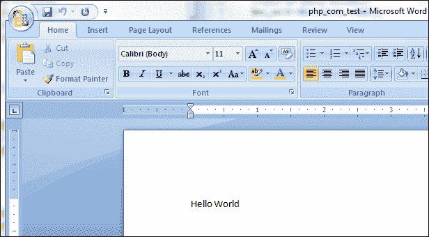

# 第十八章：PHP 在不同平台上

有许多理由在 Windows 系统上使用 PHP，但最常见的是你想在 Windows 桌面上开发 Web 应用程序。如今，在 Windows 上开发 PHP 与在 Unix 平台上一样可行。PHP 在 Windows 上表现得非常出色，PHP 的服务器和附加工具也非常适合 Windows。在任何支持的平台上设置和开发 PHP 环境只是个人偏好的问题。随着时间的推移，PHP 非常友好地支持跨平台，安装和配置变得越来越简单。在多个平台上提供 Zend Server CE（社区版）的相对较新产品已经在建立一个共同的安装平台上大有帮助。

# 为 Windows 和 Unix 编写可移植代码

在部署到生产环境之前在本地开发，是在 Windows 上运行 PHP 的主要原因之一。由于许多生产服务器是基于 Unix 的，因此编写应用程序时要考虑使其在任何操作平台上都能以最少的麻烦运行。

潜在的问题领域包括依赖外部库的应用程序，使用本地文件 I/O 和安全功能，访问系统设备，分叉或生成线程，通过套接字通信，使用信号，生成特定于平台的图形用户界面的外部可执行文件。

好消息是随着 PHP 的发展，跨平台开发已成为主要目标。大部分情况下，PHP 脚本应该可以从 Windows 移植到 Unix 而无大碍。然而，在移植脚本时可能会遇到问题的情况也是有的。例如，PHP 早期实现的一些函数在 Windows 下必须进行模仿。其他函数可能特定于 PHP 运行的 Web 服务器。

## 确定平台

考虑到可移植性，你可能首先想要测试脚本运行的平台。PHP 定义了常量`PHP_OS`，其中包含 PHP 解析器正在执行的操作系统的名称。`PHP_OS`常量的可能值包括`"HP-UX"`，`"Darwin"`（macOS），`"Linux"`，`"SunOS"`，`"WIN32"`和`"WINNT"`。你可能还想考虑内置函数`php_uname()`；它返回更多的操作系统信息。

以下代码显示如何测试 Windows 平台：

```php
if (PHP_OS == 'WIN32' || PHP_OS == 'WINNT') {
 echo "You are on a Windows System";
}
else {
 // some other platform
 echo "You are NOT on a Windows System";
}
```

下面是在 Windows 7 i5 笔记本电脑上执行`php_uname()`函数的输出示例：

```php
Windows NT PALADIN-LAPTO 6.1 build 7601 (Windows 7 Home Premium Edition Service
Pack 1) i586
```

## 跨平台处理路径

PHP 理解在 Windows 平台上使用反斜杠或正斜杠，甚至可以处理同时使用两者的路径。PHP 在访问 Windows Universal Naming Convention (UNC)路径（即*//machine_name/path/to/file*）时也识别正斜杠。例如，以下两行是等效的：

```php
$fh = fopen("c:/planning/schedule.txt", 'r');
$fh = fopen("c:\\planning\\schedule.txt", 'r');
```

## 浏览服务器环境

常量超全局数组`$_SERVER`提供服务器和执行环境信息。以下是其部分内容列表：

```php
["PROCESSOR_ARCHITECTURE"] => string(3) "x86"
["PROCESSOR_ARCHITEW6432"] => string(5) "AMD64"
["PROCESSOR_IDENTIFIER"] => string(50) "Intel64 Family 6 Model 42 Stepping 7,
GenuineIntel"
["PROCESSOR_LEVEL"] => string(1) "6"
["PROCESSOR_REVISION"] => string(4) "2a07"
["ProgramData"] => string(14) "C:\ProgramData"
["ProgramFiles"] => string(22) "C:\Program Files (x86)"
["ProgramFiles(x86)"] => string(22) "C:\Program Files (x86)"
["ProgramW6432"] => string(16) "C:\Program Files"
["PSModulePath"] => string(51)
 "C:\Windows\system32\WindowsPowerShell\v1.0\Modules\"
["PUBLIC"] => string(15) "C:\Users\Public"
["SystemDrive"] => string(2) "C:"
["SystemRoot"] => string(10) "C:\Windows"
```

要查看此全局数组中可用的所有信息，请查看其[文档](http://bit.ly/WlqcjH)。

一旦您知道正在寻找的具体信息，您可以直接请求如下：

```php
echo "The windows Dir is: {$_SERVER['WINDIR']}";
`The` `windows` `Dir` `is``:` `C``:``\Windows`
```

## 发送邮件

在 Unix 系统上，您可以配置`mail()`函数以使用*sendmail*或*Qmail*发送消息。在 Windows 下运行 PHP 时，您可以通过安装 sendmail 并在*php.ini*中设置`sendmail_path`指向可执行文件来使用 sendmail。然而，更方便的做法可能是简单地将 Windows 版本的 PHP 指向一个接受您作为已知邮件客户端的 SMTP 服务器：

```php
[mail function]
SMTP = mail.example.com ;URL or IP number to known mail server
sendmail_from = test@example.com
```

对于更简单的电子邮件解决方案，您可以使用全面的[PHPMailer 库](https://oreil.ly/PbUPO)，它不仅简化了从 Windows 平台发送电子邮件的过程，而且完全跨平台，在 Unix 系统上同样有效。

```php
$mail = new PHPMailer(true);

try {
 //Server settings
 $mail->SMTPDebug = SMTP::DEBUG_SERVER;
 $mail->isSMTP();
 $mail->Host = 'smtp1.example.com';
 $mail->SMTPSecure = PHPMailer::ENCRYPTION_STARTTLS;
 $mail->Port = 587;

 $mail->setFrom('from@example.com', 'Mailer');
 $mail->addAddress('joe@example.net');

 $mail->isHTML(false);
 $mail->Subject = 'Here is the subject';
 $mail->Body = 'And here is the body.';

 $mail->send();
 echo 'Message has been sent';
} catch (Exception $e) {
 echo "Message could not be sent. Mailer Error: {$mail->ErrorInfo}";
}
```

## 行尾处理

Windows 文本文件的行以`\r\n`结尾，而 Unix 文本文件的行以`\n`结尾。PHP 在二进制模式下处理文件，因此不会自动将 Windows 行终止符转换为 Unix 等效的终止符。

PHP 在 Windows 上将标准输出、标准输入和标准错误文件处理器设置为二进制模式，因此不会为您进行任何转换。这对于处理通常与来自 Web 服务器的`POST`消息相关联的二进制输入至关重要。

您的程序输出到标准输出，如果希望在输出流中放置 Windows 行终止符，您将需要专门设置。处理此问题的一种方法是定义一个行尾（EOL）常量和使用它的输出函数：

```php
if (PHP_OS == "WIN32" || PHP_OS == "WINNT") {
 define('EOL', "\r\n");
}
else if (PHP_OS == "Linux") {
 define('EOL', "\n");
}
else {
 define('EOL', "\n");
}

function ln($out) {
 echo $out . EOL;
}

ln("this line will have the server platform's EOL character");
```

更简单的处理方法是通过`PHP_EOL`常量，它会自动确定服务器系统的行尾字符串。（但是请注意，并非所有情况下服务器系统和所需的 EOL 标记相同。）

```php
function ln($out) {
 echo $out . PHP_EOL;
}
```

## 文件末尾处理

Windows 文本文件以控制字符 Z（`\x1A`）结尾，而 Unix 则将文件长度信息单独存储在文件数据之外。PHP 会识别运行平台的文件结束（EOF）字符；因此，`feof()`函数适用于读取 Windows 文本文件。

## 使用外部命令

PHP 在 Windows 上使用默认的命令 shell 进行进程操作。在 Windows 下仅支持基本的 Unix shell 重定向和管道（例如，不支持将标准输出和标准错误分开重定向），且引号规则完全不同。Windows shell 不会进行通配符扩展（即不会用匹配通配符的文件列表替换包含通配符标记的参数）。在 Unix 上可以使用`system("someprog php*.php")`，但在 Windows 上您必须使用`opendir()`和`readdir()`自行构建文件名列表。

## 访问平台特定的扩展

目前有超过 80 个用于 PHP 的扩展，涵盖了广泛的服务和功能。其中大约一半的扩展同时适用于 Windows 和 Unix 平台。只有少数扩展，比如 COM、.NET 和 IIS 扩展，是专门针对 Windows 的。如果你在脚本中使用的扩展在 Windows 下不可用，你需要将该扩展移植过去，或者修改你的脚本以使用在 Windows 下可用的扩展。

在某些情况下，即使整个模块可用，某些函数在 Windows 下也可能不可用。

Windows PHP 不支持信号处理、分叉或多线程脚本。使用这些功能的 Unix PHP 脚本不能直接移植到 Windows。相反，你应该重写脚本，不依赖于这些功能。

# 与 COM 交互

COM 允许你控制其他 Windows 应用程序。你可以将文件数据发送给 Excel，让其绘制图表，并将图表导出为 GIF 图像。你还可以使用 Word 格式化表单接收到的信息，然后打印发票作为记录。在介绍了 COM 术语后，本节将向你展示如何与 Word 和 Excel 交互。

## 背景

COM 是一种远程过程调用（RPC）机制，具有少量面向对象的特性。它提供了一种方法，使调用程序（*控制器*）能够与另一个程序（COM 服务器或*对象*）通信，无论其位于何处。如果底层代码是本地的，该技术称为 COM；如果是远程的，称为分布式 COM（DCOM）。如果底层代码是动态链接库（DLL），并且代码加载到同一进程空间中，则 COM 服务器称为进程内服务器（*inproc*）。如果代码是运行在自己的进程空间中的完整应用程序，则称为进程外服务器应用程序（*local server application*）。

对象链接与嵌入（OLE）是微软早期技术的总称，允许一个对象嵌入到另一个对象中。例如，你可以将 Excel 电子表格嵌入到 Word 文档中。OLE 1.0 开发于 Windows 3.1 时期，使用了称为动态数据交换（DDE）的技术来在程序间进行通信，但由于 DDE 功能有限。如果你想编辑嵌入在 Word 文件中的 Excel 电子表格，必须同时打开 Excel 并让其运行。

OLE 2.0 用 COM 取代了 DDE 作为底层通信方法。使用 OLE 2.0，你现在可以直接将 Excel 电子表格粘贴到 Word 文档中，并在 Word 中内联编辑 Excel 数据。使用 OLE 2.0，控制器可以向 COM 服务器发送复杂的消息。在我们的示例中，控制器将是我们的 PHP 脚本，而 COM 服务器将是典型的 MS Office 应用程序之一。在接下来的章节中，我们将提供一些工具来处理这种类型的集成。

为了激发您的兴趣并展示 COM 的强大功能，示例 18-1 展示了如何启动 Word 并向初始空文档添加“Hello World”。

##### 示例 18-1\. 在 PHP 中创建 Word 文件（word_com_sample.php）

```php
// starting word
$word = new COM("word.application") or die("Unable to start Word app");
echo "Found and Loaded Word, version {$word->Version}\n";

//open an empty document
$word->Documents->add();

//do some weird stuff
$word->Selection->typeText("Hello World");
$word->Documents[1]->saveAs("c:/php_com_test.doc");

//closing word
$word->quit();

//free the object
$word = null;

echo "all done!";
```

为了正确执行此代码文件，必须从命令行执行它，如图 18-1 所示。一旦看到输出字符串`all done!`，您可以在“另存为”文件夹中找到该文件，并使用 Word 打开查看其内容。


###### 图 18-1\. 在命令窗口中调用 Word 示例

实际的 Word 文件应该看起来像图 18-2。



###### 图 18-2\. PHP 创建的 Word 文件

## PHP 函数

PHP 通过一小组函数调用提供了对 COM 的接口。其中大多数是低级函数，需要对 COM 有详细的了解，这超出了本章的范围。`COM`类的对象表示与 COM 服务器的连接：

```php
$word = new COM("word.application") or die("Unable to start Word app");
```

对于大多数 OLE 自动化来说，最困难的任务是将 Visual Basic 的方法调用转换为 PHP 中的类似内容。例如，这是 VBScript 向 Word 文档中插入文本的方法：

```php
Selection.TypeText Text := "This is a test"
```

在 PHP 中相同的行是：

```php
$word->Selection->typetext("This is a test");
```

## API 规范

要确定像 Word 这样的产品的对象层次结构和参数，您可以访问 Microsoft 开发者网站并搜索您感兴趣的 Word 对象的规范。另一种选择是同时使用 Microsoft 的在线 VB 脚本帮助和 Word 支持的宏语言。这样一来，您可以理解参数的顺序以及给定任务所需的值。
